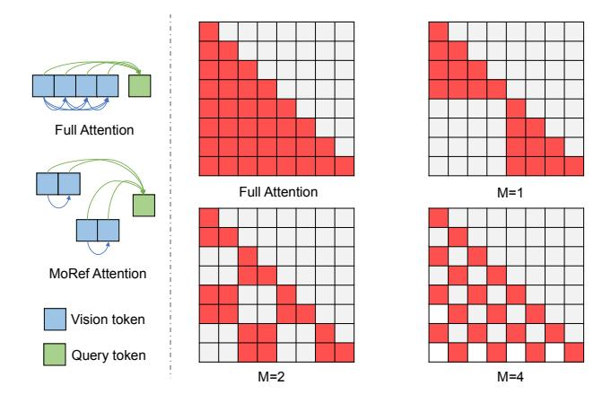

# 3. Method

In this section, we present the Free-MoRef method, which effectively extends the context perception capacity of Video-MLLMs with a high degree of flexibility. Notably, when dealing with extended input frames, Free-MoRef initially partitions the long vision tokens into parallel inference chunks via multi-reference partitioning. Subsequently, it substitutes the self-attention layers of the LLM with MoRef attention. This allows for parallel reasoning over multiple references using the same query and aggregation of unified activations. At the mid-decoder layers, an optional Reference Fusion step is derived to combine the parallel chunks, thereby further enhancing the efficiency of the reasoning process. Without additional training, Free-MoRef overcomes the context length constraint of Video-MLLM during single inference and attains comprehensive perception of exponentially expanding context with minimal computational cost and achieves better performance. The overall architecture of Free-MoRef Inference is depicted in Figure 2, and the details of each component will be elucidated in the following subsections.

## 3.1. Multi-Reference Partition

In Video-MLLM, the reasoning LLM typically has a context length threshold to safeguard stable performance. For instance, the LLaVA-Video [\[44\]](#page-9-8) model employs Qwen2 [\[1\]](#page-8-18) as its underlying LLM, and the corresponding sequence length threshold is set at 32768 tokens. When the length of the inference sequence surpasses this threshold, it frequently results in performance deterioration or, more critically, Out-Of-Memory errors. Under these constraints, existing approaches commonly resort to vision token compression or streaming inference techniques to handle longer input frames. To minimize information loss while concurrently ensuring the efficiency of the reasoning process, we propose to partitioning the long visual token sequence into multiple parallel chunks, which serve as multi-references for comprehensive understanding.

To enhance flexibility, we initially divide the visiontoken sequence into M units according to the temporal relationship. Subsequently, within each unit, we further temporally decompose it into N fragments. Here, both M and N are manually configured hyperparameters. Eventually, through the aggregation of fragments from diverse units, we are able to obtain N reference chunks. Each of these references can be considered as an abstraction of the extended video sequence. Notably, the larger the value of the hyperparameter M, the more pronounced the temporal intersection among the references. When setting M = 1, the N chunks will be temporally independent of each other. After completing the multi-reference partition, we assign identical system prompt and question to each vision sequence, thereby forming the final parallel inferecne chunks, which is designed for more comprehensive and efficient reasoning by leveraging the Mixture-of-Reference (MoRef) attention.

## 3.2. MoRef Attention

MoRef Attention is the key step in attaining comprehensive perception and parallel reasoning across multi-references.

Figure 2. The framework of Free-MoRef Inference. For extended input frames, the initial step involves partitioning the vision tokens into multiple references and subsequently assigning identical system prompt and question to each of these references. To enable efficient comprehension of these multi-reference chunks, we design the MoRef attention mechanism, which concurrently extracts clues from multiple references to formulate responses to the posed question. At the middle layer of the decoder, a reference-fusion step is derived. This step serves to aggregate the parallel chunks into a unified global representation which not only further accelerates the reasoning process but also facilitates cross-chunk interactions, thereby enhancing the overall performance and effectiveness of the long context reasoning.

It concurrently queries distinct references in parallel using an identical question and combines multiple attention outcomes to summarize a unified response for updating the question tokens within each decoder layer.

Specifically, for the input parallel inference chunks, MoRef first constructs  $Q, K, V \in \mathbb{R}^{N \times l \times D}$  (N is the chunk number, l is the sequence length and D is the embedding dimension), then executes flash-attention to obtain the initial attention results O, where  $O = [O^{sys}, O^{vis}, O^{ques}]$ . Here,  $O^{sys}, O^{vis}$  and  $O^{ques}$  respectively denote the attention results corresponding to the system prompt token, vision token, and question token. Owing to the unidirectional nature of causal attention,  $O^{sys}$  in different chunks would be exactly the same. In contrast,  $O^{vis}$  and  $O^{ques}$  yield divergent results due to the variance in vision-references. At this point, we maintain the variation of  $O^{vis}$  and aggregate  $O^{ques}$  across different chunks through the following function:

$$O^{fusion} = (\sum_{i=1}^{N} \omega_i \cdot O_i^{ques}).repeat(N), \sum_{i=1}^{N} \omega_i = 1$$
 (1)

In Eq. 1,  $O_i^{ques}$  represents the query result on each

reference and  $O^{fusion}$  is the unified summarization. By replacing  $O^{ques}$  in the initial attention results, the output of MoRef attention is constructed as  $O^{MoRef} = [O^{sys}, O^{vis}, O^{fusion}]$ .

The  $\omega_i$  in Eq 1 indicates a gating function, which controls the information aggregation across different references. The gating function should be query-aware, as the key information required to answer the question may not be uniformly distributed among diverse references. In the training-free implementation, our objective is to seek the query-reference-correlation from the attention map. Since the flash-attention doesn't support output attention weight, we manually calculate the multi-model attention map between query and vision-reference:

$$\mathbf{A} = softmax(\mathbf{Q}^{ques} \times (\mathbf{K}^{vis})^T) \tag{2}$$

Compared with the full-attention on the whole sequence, the cross-modal attention Eq. 2 introduces negligible computation. With respect to A, we set the gating weights of each reference chunk as:

$$\omega_i = \frac{max(\mathbf{A}[i])}{\sum_{i=1}^{N} max(\mathbf{A}[i])}$$
(3)

Figure 3. Visualization of attention patterns of full attention and MoRef attention. MoRef attention achieves the full-awareness of vision tokens, while the attention map among vision tokens are sparsified. The right part represents vision attention map of splitting 8 vision tokens into two chunks under different setting of temporal unit number (M).

By combining the attention results of the same query across diverse vision-references, all vision-tokens are effectively engaged in the updating of the query-token in each decoder layer. As shown in Figure 3, this integration strategy enables the full-context perception equivalent to that achieved by full attention. By partitioning the vision sequence into N non-overlapping chunks, the computational complexity is reduced by approximately a factor of  $\frac{1}{N}$  compared with full attention. The number of temporal units M serves as a crucial parameter that significantly influences the formation of sparse attention patterns. For instance, consider a vision sequence of length 8 divided into N=2 chunks. Figure 3 depicted the impact of different settings of M on the vision-attention-map.

#### 3.3. Reference Fusion

MoRef attention efficiently enables the comprehensive perception of multi-references. Nevertheless, the division of multi-references disrupts the connectivity among vision-tokens across different chunks. To address this limitation, we design an additional Reference Fusion step. This step aims to achieve the integration of multiple reference chunks into a global one, thereby compensating for the lack of cross-chunk interaction within the deep decoder layer.

The implementation of Reference Fusion is grounded in an observation made by FastV [4]: vision-tokens contribute uniformly in the shallow decoder layers. In contrast, within the deep layers, the attention weights of the decoder layer would more concentrate on the query-token. We visualized the reasoning process of LLaVA-Video [44] and noted a similar phenomenon (as detailed in supplementary material). Leveraging this insight, we maintain parallel multi-

reference reasoning within the shallow layer. When the decoding process reaches a specific layer L, we perform the merging of multi-references based on the attention map  $\boldsymbol{A}$  computed in Eq 2.

Specifically,  $\mathbf{A} \in \mathbb{R}^{N \times l_{ques} \times l_{vis}}$ , where N represents the number of references,  $l_{aues}$  and  $l_{vis}$  denote the number of question token and vision token in each inference chunk. We compute the average of the attention map A along the  $l_{ques}$  dimension to construct the importance estimation matrix  $E \in \mathbb{R}^{N \times l_{vis}}$ , where each element  $E_{ij}$  in E quantifies the average contribution of the j-th vision token in the i-th chunk. Based on the estimation matrix E, we prune  $1 - \frac{1}{N}$ of the less important vision-tokens within each inference chunk. Subsequently, we aggregate the remaining vision tokens into a global reference in accordance with their temporal relationships. System prompt tokens and question tokens are directly transferred from the local reference chunk to the global reference. For the following decoding process, only the global reference is used by the default decoder layers of the LLM.

Through the Reference fusion step, the pruning of noncrucial tokens further reduces the computational load, while the cross-chunk vision interaction that is lacking in shallow layers can be effectively compensated for, which results in optimized performance.

## 4. Experiments

#### 4.1. Experimental Setup

Benchmarks VideoMME. [12] Video Multi-Modal Evaluation benchmark (VideoMME) consists of 900 videos with a total duration of 256 hours, covering a wide range of video types. The videos are associated with 2,700 manually labeled complex multiple-choice QA pairs across 30 subfields. According to video durations, VideoMME is partitioned into three subsets: short (< 2 minutes), medium (4  $\sim$  15 minutes), and long (30  $\sim$  60 minutes). MLVU. [45] Multi-Task Long Video Understanding Benchmark (MLVU) significantly expands the scope of durations with diverse types of videos and 7 different types of QA tasks. The video lengths range from 3 minutes to over 2 hours, with an average duration of 12 minutes. LongVideoBench. [37] LongVideoBench highlights referred reasoning questions, which are dependent on long frame inputs. It contains 17 finer-grained question categories on 10 different types of videos. The video duration covers 4 groups: 8-15 seconds, 15-60 seconds, 3-10 minutes, and 15-60 minutes.

**Implementation Details** We implement the Free-MoRef on the LLaVA-Video-7B [44] model. By default, LLaVA-Video-7B loads videos at a FPS=1, with a maximum of 64 frames, where each frame is represented by 182 tokens. To

| Table 1. Performance of Free-MoRef@LLaVA-Video-7B under extended frame inputs. The red color indicates Out-Of-Memory error | or on |
|----------------------------------------------------------------------------------------------------------------------------|-------|
| a single A100 GPU. We managed the inference under the help of <i>accelerate</i> toolkit.                                   |       |

| Context Length        | FLOPs          | MLVU        | Vi          | deoMM       | LongVideoBench |             |             |             |
|-----------------------|----------------|-------------|-------------|-------------|----------------|-------------|-------------|-------------|
| (Token Number)        | rLOIS          | MILVO       | Medium      | Long        | Overall        | 600s        | 3600s       | Overall     |
| 64 frames (11648)     | 100%           | 70.3        | 62.1        | 53.4        | 64.3           | 60.4        | 51.2        | 58.8        |
| 128 frames (23296)    | 400%           | 70.2        | 63.2        | 54.1        | 64.9           | 60.6        | 50.8        | 58.7        |
| 128 frames@Free-MoRef | <b>110.4%</b>  | <b>70.8</b> | <b>65.8</b> | <b>55.8</b> | <b>66.3</b>    | <b>62.1</b> | <b>51.0</b> | <b>59.3</b> |
| 256 frames (46592)    | 1600%          | 67.2        | 61.4        | 54.1        | 63.1           | 57.2        | 48.5        | 56.7        |
| 256 frames@Free-MoRef | <b>163.2</b> % | <b>72.5</b> | <b>66.4</b> | <b>55.3</b> | <b>66.3</b>    | <b>62.1</b> | <b>51.2</b> | <b>59.3</b> |
| 512 frames (93184)    | 6400%          | 61.1        | 55.7        | 48.8        | 60.6           | 53.1        | 45.9        | 54.3        |
| 512 frames@Free-MoRef | <b>400</b> %   | <b>72.8</b> | <b>67.3</b> | <b>56.0</b> | <b>66.9</b>    | <b>62.8</b> | <b>51.9</b> | <b>59.9</b> |

Table 2. Performance comparison on Long-Video Benchmarks: all models in this table are of the  $7B \sim 8B$  scale.

| Method                     | MLVU | LVideoBench |             | oMME Overall |
|----------------------------|------|-------------|-------------|-----------------|
| InternVL2 [30]             | 64.0 | 54.6        | -           | 54.0            |
| InternVL2.5 [7]            | 68.4 | 57.5        | 53.0        | 64.5            |
| Qwen2-VL [32]              | 64.8 | 55.6        | 55.7        | 63.3            |
| LLaVA- OneVision [14]   | 64.7 | 56.3        | -           | 58.2            |
| LLaVA-Video [44]           | 70.2 | 58.2        | 53.4        | 64.3            |
| Kangaroo [21]              | 61.0 | 54.8        | 46.7        | 56.0            |
| LongVILA [39]              | -    | 57.1        | 47.0        | 60.1            |
| LongVA [42]                | 56.3 | -           | 46.2        | 52.6            |
| Video-XL [28]              | 64.9 | 50.7        | -           | 55.5            |
| RETAKE [33]                | 69.8 | -           | 56.2        | 63.9            |
| LLaVA-Video @Free-MoRef | 72.8 | 59.9        | <u>56.0</u> | 66.9            |

demonstrate the efficacy of Free-MoRef, we multiply the maximum number of frames to 128 (2x), 256 (4x), and 512 (8x) respectively. In our experimental setup, the vision token sequence is consistently partitioned into M=64 temporal units. For the multiplexed inputs of 2x, 4x, and 8x, the number of parallel chunks is set as N=2,4,8 respectively, and the reference fusion layer is configured as L=3,6,12. We conduct the evaluation upon lmms-eval framework [41] and all experiments are executed on a single A100 GPU. Further details will be made accessible in our publicly-released code repository.

#### 4.2. Main Results

**Results on Multiplexed Context Understanding.** We implemented the Free-MoRef method on the llava-video-7B model, which by default has a maximum input frame num-

ber of 64. In order to verify Free-MoRef's ability to handle multiplexed contexts, we expanded the maximum number of input frames to 128, 256, and 512 for experiments. The experimental results are presented in Table 1.

When the number of input frames is doubled, the number of tokens required to encode the input frames amounts to 23,296, which is within the context length limit of Qwen2 (32,768). Under such circumstances, the performance of the model remains nearly unchanged on both the MLVU and LongVideoBench, while demonstrating a slight improvement on the VideoMME benchmark. After the application of Free-MoRef, the computational cost incurred during the inference process is reduced by (1-110.4/400 = 72.4%). Concurrently, both MLVU and LongVideoBench exhibit a 0.5% performance gain. The performance improvement on VideoMME is more pronounced, with a 2.6% improvement for medium-length videos and a 1.7% improvement for long videos.

When the number of input frames is quadrupled, the number of vision tokens surpasses 40,000. This length clearly exceeds the context length limit of Qwen2, and attempting to perform inference using a single A100 GPU will directly result in an Out-Of-Memory error. Notably, even without the assistance of the *accelerate* toolkit, our proposed method is capable of effectively reasoning on up to 512 frames using a single A100 GPU.

Leveraging the *accelerate* toolkit, we were enabled to conduct further comparative experiments. When the number of input frames reached 256, the model's performance experienced a substantial decline across all benchmarks. However, upon the application of Free-MoRef, the degradation was effectively mitigated. In particular, on the MLVU dataset, which consists of relatively longer videos, the model's performance was further enhanced to 72.5%. In terms of efficiency, the computational requirement for the model to infer a context of  $4\times$  length was merely 163.2% of the original. When the number of input frames is further in-

Table 3. Performance comparison on various task categories in VideoMME. Tasks contain Temporal Perception(TP), Spatial Perception(SP), Attribute Perception(AP), Action Recognition(ARec), Object Recognition(ORec), OCR Problems(OCR), Counting Problem(CP), Temporal Reasoning(TR), Spatial Reasoning(SR), Action Reasoning(AR), Object Reasoning(OR) and Information Synopsis(IS). The best result is bolded, the second is underlined, and the worst is in red.

| Context Length            | TP   | SP   | AP   | ARec | ORec | OCR  | CP   | TR   | SR   | AR   | OR   | IS   | Avg  |
|---------------------------|------|------|------|------|------|------|------|------|------|------|------|------|------|
| 64 frames                 | 74.5 | 64.8 | 79.3 | 64.5 | 71.5 | 66.9 | 48.5 | 48.0 | 80.4 | 56.1 | 59.0 | 76.5 | 64.3 |
| 128 frames                | 70.9 | 59.3 | 79.3 | 66.8 | 70.6 | 71.2 | 47.4 | 48.0 | 80.4 | 54.7 | 61.2 | 78.9 | 64.9 |
| 128 frames @Free-MoRef | 74.5 | 64.8 | 78.8 | 67.1 | 72.3 | 71.9 | 48.5 | 50.8 | 85.7 | 58.2 | 61.9 | 79.6 | 66.3 |
| 256 frames @Free-MoRef | 80.0 | 63.0 | 77.9 | 67.1 | 72.3 | 70.5 | 47.8 | 50.3 | 82.1 | 60.0 | 61.9 | 80.8 | 66.3 |

creased by 8×, reaching 512 frames, the length of the vision token approaches nearly 100,000. In comparison to the scenario with 256-frame input, the performance of the baseline model experiences a substantial and further decline. Despite posing challenges to the baseline model, the extended context serves as a rich source of information and provides more abundant references for the reasoning process of Free-MoRef, as a result, Free-MoRef attains a further enhancement in performance. In summary, Free-MoRef enables the Video-MLLM to leverage the multiplexed frame inputs for more comprehensive understanding of long videos, thereby highlighting the robustness and efficiency of Free-MoRef in handling ultra-long context scenarios.

Comparison with other Models. We validated the efficacy of Free-MoRef by conducting comprehensive comparisons with other Video-MLLMs. These comparisons encompassed open-source MLLMs capable of video understanding, as well as specifically designed long-video understanding models. As depicted in Table [2,](#page-5-1) our proposed Free-MoRef method outperformed all the others, attaining the optimal results on the MLVU, LongVideoBench and VideoMME benchmarks.

The underlying reason for the SOTA performance lies in the fact that Free-MoRef enables an efficient and exhaustive understanding of ultra-long contexts. By simply expanding the input frames, Free-MoRef can achieve superior long-video understanding performance within a single inference. It is worth noting that our method is implemented in a training-free manner, which further confirms the potential of MoRef-attention. Its ability to fully understanding ultra-long contexts while maintaining a low computational burden offers significant inspiration for the development of future long-video understanding models, thereby highlighting the practical value and far-reaching implications of Mixture-of-Reference design in the field of long video understanding tasks.

