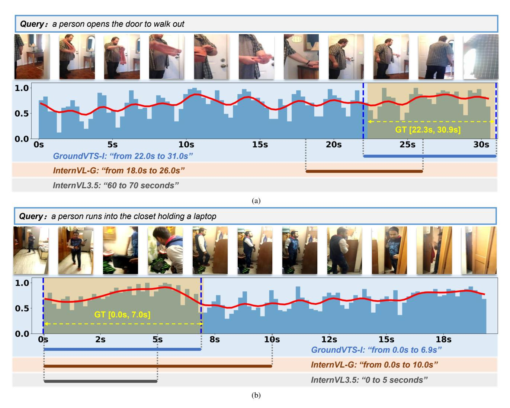

# 15. Additional Qualitative Analysis

To complement the qualitative study, we provide additional visualization examples for both GroundVTS-Q and GroundVTS-I. All examples follow the same visualization format as Figure 5 in the main paper, where the bottom curve denotes the normalized token density produced by the VTS module, with higher peaks indicating segments the model regards as more relevant to the query.

Across these cases, GroundVTS consistently exhibits highly accurate temporal localization. In Figure [7\(a\)](#page-17-0) (GT: 23.5–32.0 s), GroundVTS-Q predicts 24.0–31.9 s, aligning almost perfectly with the ground-truth, whereas QwenVL- G and the pretrained Qwen2.5VL shift the interval far earlier and fail to localize the correct moment. A similar trend appears in Figure [7\(b\)](#page-17-0) (GT: 0.0–5.9 s), where GroundVTS-Q outputs 0.0–5.8 s with near-exact precision, while both baselines truncate or deviate from the target boundary.

The InternVL-based examples exhibit the same trend. In Figure [8\(a\)](#page-18-0) (GT: 22.3–30.9 s), GroundVTS-I produces a tightly aligned prediction of 22.0–31.0 s, whereas InternVL-G shortens and shifts the interval (18.0–26.0 s), and the base InternVL3.5 mislocalizes the event to a distant region. In Figure [8\(b\)](#page-18-0) (GT: 0.0–7.0 s), GroundVTS-I again matches the ground-truth boundaries accurately (0.0– 6.9 s), while the baseline models either overextend the span or capture only a partial portion of the event.

These visualizations reveal three consistent advantages of GroundVTS. First, its temporal predictions are markedly more accurate and better aligned with annotated spans, regardless of model backbone or event duration. Second, its predicted spans consistently fall within the regions where the sampled token density reaches (local) maxima. In every example, the model's final prediction aligns with the peaks of the VTS density curve, indicating that GroundVTS relies on the most informative temporal segments identified by the sampling module. Third, the token allocation patterns produced by VTS are adaptive across different scenarios. In some cases (as illustrated in Figure 5 of the main paper), the density distribution forms sharp peaks with strong contrasts between attended and suppressed segments, typically corresponding to short or well-isolated grounding moments. In other cases, the differences between peaks and valleys are more moderate; nevertheless, the VTS curve still places a clear relative emphasis on the correct temporal region. These variations indicate that VTS does not rely on a fixed sparsity pattern but adjusts its sampling behavior according to the temporal structure of each video-query pair.

In addition, Figure [7\(a\)](#page-17-0) visualizes the spatial distribution of visual tokens selected by VTS. It can be observed that VTS mainly focuses on the middle and lower regions of the frames, which correspond to areas around human activities. When the action of watching TV occurs at the end of the

Figure 7. Additional qualitative comparison between GroundVTS-Q and its base models. Example (a) additionally illustrates spatial token retention maps, which correspond to spatial token selections.

video, the VTS module attends to most regions of the frame.

Overall, by concentrating tokens at the most semantically relevant moments while downweighting redundant frames, VTS enables GroundVTS to encode fine-grained temporal cues more effectively, leading to significantly sharper and more accurate temporal boundaries.

Figure 8. Additional qualitative comparison between GroundVTS-I and its base models.