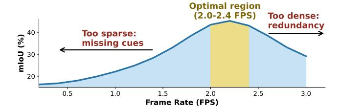
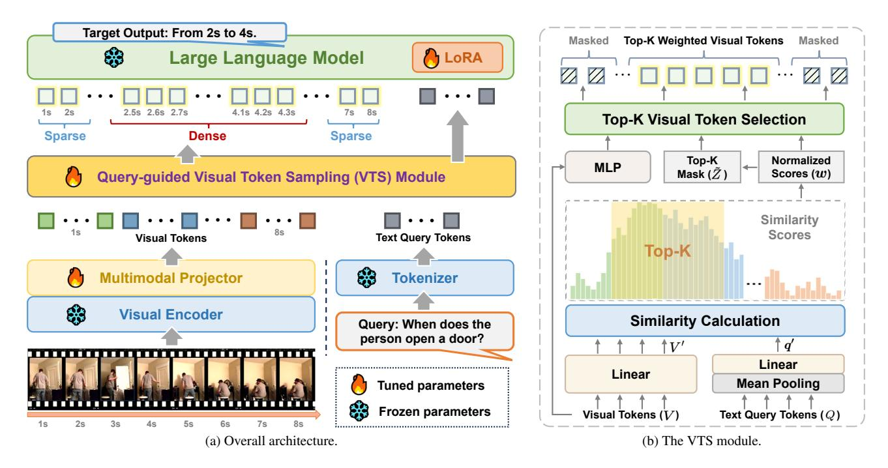

# 2. Related Work

Video large language models (Vid-LLMs) are typically implemented by connecting visual encoders to LLMs through projection layers or multimodal adapters. Recent studies have focused on enhancing the global video understanding capabilities [\[24,](#page-9-5) [29,](#page-9-6) [35,](#page-9-7) [51,](#page-10-9) [53\]](#page-10-8). While these models achieve strong performance, they still struggle to capture granular temporal structures [\[32\]](#page-9-10). GroundVTS instead emphasizes fine-grained temporal perception, thereby improving the ability of Vid-LLMs to handle challenges of VTG. Video temporal grounding (VTG) is a fundamental video understanding task that aims to accurately localize the timestamps of events within a video [\[30\]](#page-9-11). Classical expert models formulate this as a cross-modal matching problem, employing proposal-based or regression-based architectures to improve grounding precision [\[15,](#page-8-9) [31,](#page-9-12) [58,](#page-10-10) [63\]](#page-10-11). These models are typically task-specific and require datasetlevel fine-tuning [\[49\]](#page-10-12). Recent studies [\[7,](#page-8-10) [12,](#page-8-11) [16,](#page-8-12) [17,](#page-8-13) [39,](#page-9-13) [55\]](#page-10-13) integrate VTG capabilities into Vid-LLMs, leveraging their strong reasoning and generalization strengths to unify diverse video understanding tasks within a single framework. To support VTG within this unified setting, many methods introduce explicit time representations (*e.g.*, time tokens/ position embeddings) or frame indexing to better model timestamps [\[12,](#page-8-11) [55\]](#page-10-13). However, these approaches primarily focus on temporal encoding or data adaptation; the sampling and representation of visual tokens before entering the LLM have received comparatively less attention. Ground-VTS addresses this gap by introducing a unified Vid-LLM framework with an effective token sampling mechanism that substantially improves temporal understanding.

Visual token compression and selection. In VTG and VQA, not all visual tokens contribute equally to answering a given query, and many contain redundant or irrelevant information that can distract the model from the relevant evidence [\[38\]](#page-9-14). This has motivated growing interest in token compression, pruning, and adaptive selection for Vid-LLMs [\[1,](#page-8-14) [18,](#page-8-15) [45\]](#page-9-15). However, most existing approaches rely on query-agnostic or saliency-based token reduction, often preserving visually prominent yet semantically irrelevant tokens, which can limit temporal reasoning and grounding precision. Recent token compression methods further deliver strong efficiency gains and improve scalability for long-video understanding [\[27,](#page-9-16) [34,](#page-9-17) [66\]](#page-10-14). Their impli-

Figure 2. Frame rate sensitivity of Qwen2.5VL-7B. Similar trends hold for InternVL3.5 (illustrated in the supplementary material).

cations for VTG—where fine-grained temporal localization is central—remain less explored. In contrast, our Ground-VTS dynamically samples query-relevant tokens within the Vid-LLM via token–query relevance, preserving spatio-temporal cues without external preprocessing.

#### 3. Method

We propose GroundVTS, a Vid-LLM architecture designed to enhance VTG performance through adaptive and efficient visual token utilization. Sec. 3.1 analyzes the sensitivity of VTG performance to frame density, which highlights the necessity of adaptive token sampling, motivating our design. Sec. 3.2 presents the overall architecture of Ground-VTS, followed by a detailed explanation of the Visual Token Sampling (VTS) module in Sec. 3.3. Finally, Sec. 3.4 outlines our progressive optimization strategy, which allows VTS to be seamlessly integrated into existing Vid-LLMs.

#### 3.1. Analysis of Frame Rate Sensitivity

Before introducing our sampling strategy, we first examine how the density of visual tokens inherently influences VTG performance. To this end, we evaluate the pretrained Qwen2.5VL-7B [3] model on the Charades-STA [9] dataset under varying frame rates from 0.2 to 3.0 frames per second (FPS), while keeping all other settings fixed.

As shown in Figure 2, VTG performance demonstrates a clear non-linear dependency on frame rate. When the frame rate is low (<1.0 FPS), the model lacks sufficient temporal cues, resulting in degraded mIoU. As the sampling rate increases, performance improves steadily and reaches its peak around 2.0–2.4 FPS, where mIoU attains 47.8%. However, further increasing the frame rate beyond this range leads to a sharp performance drop, indicating that redundant visual tokens dilute key temporal signals and hinder accuracy.

This observation supports our core hypothesis that the density and relevance of visual tokens critically influence VTG performance. Consequently, an adaptive token sampling mechanism is essential for achieving both accuracy and efficiency in temporal grounding, motivating the design of our GroundVTS framework.

#### 3.2. GroundVTS

The GroundVTS framework, illustrated in Figure 3(a), incorporates a query-guided visual token sampling module to enable efficient and fine-grained temporal grounding. Unlike prior methods that rely on additional preprocessing [53], GroundVTS integrates the sampling process directly into the Vid-LLM pipeline, allowing the model to dynamically focus on temporally and semantically relevant segments conditioned on the input query.

Specifically, given an input video after standard temporal downsampling,  $\mathcal{V} = \{F_t\}_{t=1}^T$ , and a text query, the query is first tokenized into a sequence of embeddings,  $Q = [q_1, q_2, \dots, q_{N_t}] \in \mathbb{R}^{N_t \times D}$ , using a pretrained language tokenizer. Here, T denotes the number of frames,  $N_t$  is the number of text tokens, and D is the text token embedding dimension. Each video frame  $F_t$  is divided into spatial patches and encoded by a pretrained vision encoder to produce dense spatio-temporal features,  $H_v = [h_1, h_2, \dots, h_{N_v}] \in \mathbb{R}^{N_v \times D_v}$ , where  $N_v$  denotes the total number of visual tokens and  $D_v$  denotes the feature dimension. Then, a multimodal projector (implemented as a multilayer perceptron) maps these features to a shared embedding space:  $V = [v_1, v_2, \dots, v_{N_n}] \in \mathbb{R}^{N_v \times D}$ , where each  $\boldsymbol{v_i} \in \mathbb{R}^D$  is the projected embedding of the i-th visual token, ensuring that visual embeddings are dimensionally aligned with the text token embeddings Q.

Conditioned on the query embeddings Q, the VTS module (which will be introduced in Sec. 3.3) evaluates the relevance of each visual token to the query and outputs a compact subset of visual token embeddings via a weighted differentiable top-K selection mechanism:

$$\widetilde{V} = VTS(V, Q) = [\widetilde{\boldsymbol{v}}_1, \widetilde{\boldsymbol{v}}_2, \dots, \widetilde{\boldsymbol{v}}_K],$$
 (1)

where K is the number of tokens selected by VTS. The resulting  $\widetilde{V}$  forms a non-uniform, query-guided distribution of visual tokens that allocates denser sampling around relevant moments and sparser coverage elsewhere.

To preserve temporal coherence under non-uniform sampling, we reuse the original positional encodings from dense sampling (masking out only those of unselected visual tokens), ensuring that the selected tokens remain temporally aligned with the input video.

Finally, the sampled visual tokens and query embeddings are concatenated to form a multimodal sequence and processed by the LLM for joint reasoning and generation.

#### 3.3. Visual Token Sampling

The VTS module is the core of GroundVTS, responsible for dynamically selecting the most informative visual tokens under the guidance of the textual query. As illustrated in Figure 3(b), VTS consists of the following two main steps.

**Query-Guided Token Scoring.** Given the projected visual embeddings,  $V = \{v_i\}_{i=1}^{N_v}$ , and the tokenized query

Figure 3. **Overview of the proposed GroundVTS framework.** (a) GroundVTS integrates a query-guided VTS module into the Vid-LLM pipeline, enabling adaptive selection of query-relevant tokens; (b) The VTS module computes token-query similarity scores and performs weighted differentiable top-K sampling to retain the most informative tokens, supporting efficient and precise video temporal grounding.

embeddings,  $Q = \{q_j\}_{j=1}^{N_t}$ , to estimate the relevance between each visual token and the query, both sets of embeddings are first projected into lower-dimensional subspaces of dimension  $D_r$  through linear projections:

$$V' = W_v V, \ \boldsymbol{q'} = W_q \operatorname{Pool}(Q), \ W_v, W_q \in \mathbb{R}^{D \times D_r}.$$
 (2)

Here,  $W_v$  and  $W_q$  are trainable projection matrices, and  $Pool(\cdot)$  denotes mean pooling over text token embeddings.

Then, the relevance distribution is obtained through a softmax function applied to the temperature-scaled dot products between each pair of embeddings in V' and q':

$$\boldsymbol{w} = \operatorname{softmax} \left( V' \boldsymbol{q'}^{\top} / \tau \right),$$
 (3)

where  $\tau$  is a temperature hyperparameter controlling the sharpness of the distribution. This formulation can be interpreted as an attention mechanism, where the weight assigned to each visual token reflects both its alignment with the query and its relative importance within the sequence. The resulting weight vector,  $\boldsymbol{w} = [w_1, w_2, \dots, w_{N_v}]^{\top}$ , effectively emphasizes semantically relevant visual tokens while attenuating less informative ones.

**Differentiable Top-**K **Selection.** To efficiently retain the most relevant visual information, we select the top-K visual tokens based on w. The number of selected tokens is adaptively determined by the ratio  $\rho \in (0,1]$ , where  $K = \lceil \rho \cdot N_v \rceil$ . Let  $\mathcal{I}_K$  denote the indices of the top-K tokens.

Since hard top-K selection is non-differentiable, we employ a Straight-Through Estimator (STE) with Gumbel-Softmax relaxation [19] to enable end-to-end training. Specifically, we add Gumbel noise  $g_i \sim \text{Gumbel}(0,1)$  to the log-probabilities and compute a differentiable approximation of the discrete selection mask:

$$z_{i} = \frac{\exp\left((\log w_{i} + g_{i})/\tau_{g}\right)}{\sum_{j=1}^{N_{v}} \exp\left((\log w_{j} + g_{j})/\tau_{g}\right)},$$
(4)

where  $\tau_g$  is a Gumbel temperature controlling the smoothness of the relaxation. During the forward pass, a hard top-K operator is applied:

$$z_i^{\text{hard}} = \begin{cases} 1, & \text{if } i \in \mathcal{I}_K, \\ 0, & \text{otherwise,} \end{cases}$$
 (5)

while the backward propagation flows through the continuous relaxation  $z_i$ . To this end, the STE is implemented as the following, combining the hard and soft representations:

$$\tilde{z}_i = z_i^{\text{hard}} + z_i - \text{stopgrad}(z_i),$$
 (6)

where  $stopgrad(\cdot)$  denotes gradient detachment.

The final visual representations are then obtained via weighted differentiable top-K masking: the relevance weights of the selected top-K tokens are re-normalized to sum to one and serve as the non-zero elements of the final

mask, while all non-top-K positions remain zero. Mathematically, this is formulated as:

$$\tilde{\boldsymbol{v}}_i = \hat{w}_i \cdot \text{MLP}(\boldsymbol{v}_i), \quad \hat{w}_i = \frac{\exp(w_i/\tau') \cdot \tilde{z}_i}{\sum_{j=1}^{N_v} \exp(w_j/\tau') \cdot \tilde{z}_j}, (7)$$

where MLP indicates a multilayer perceptron and τ ′ represents the temperature hyperparameter. This strategy ensures that token selection remains query-aware and trainable.

