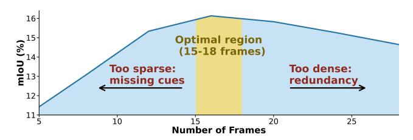

# 9. Dataset Ablation

GroundVTS-Q is trained on the LLaVA-Video-178K and our constructed Grounding-FT datasets. For a fair comparison, the base Qwen2.5VL-7B is trained on the same datasets under three settings, as reported in Table 11: (i) *Qwen-G*, trained only on the Grounding-FT dataset; (ii) *Qwen-(L+G)*, trained on the concatenation of the two datasets; and (iii) *Qwen-(L→G)*, trained following the same Stage  $2\rightarrow$ Stage 3 curriculum. Note that Stage 1 (VTS warm-up) is not applicable to the base model.

As shown in Table 11, GroundVTS-Q consistently outperforms the Qwen baselines across all evaluation settings. In particular, GroundVTS-Q achieves 50.1 mIoU on Charades-STA, significantly surpassing Qwen-G with 31.7, Qwen-(L+G) with 28.5, and Qwen-(L→G) with 29.8. These results suggest that the proposed grounding-aware training strategy effectively improves performance under matched data and training configurations.

## 10. Frame Sampling Sensitivity of InternVL3.5

To examine whether the frame density sensitivity is specific to Qwen2.5-VL or reflects a more general phenomenon, we conduct an additional experiment using InternVL3.5. Unlike Qwen2.5-VL, InternVL3.5 adopts a fixed-number frame sampling strategy. Therefore, we vary the number of sampled frames to analyze how visual token density affects VTG performance.

Figure 6 presents the frame sensitivity results of InternVL3.5 on the QVHighlights dataset. Similar to the trend observed with Qwen2.5-VL, the performance again exhibits

Table 10. Parameter-free token sampling vs. GroundVTS.

| VTS Trainir  | Training     |        | Charade | s-STA  |      | ActivityNet-Captions |        |        |      |  |
|--------------|--------------|--------|---------|--------|------|----------------------|--------|--------|------|--|
| VTS Training |              | R1@0.3 | R1@0.5  | R1@0.7 | mIoU | R1@0.3               | R1@0.5 | R1@0.7 | mIoU |  |
| $\checkmark$ | <b>√</b>     | 71.5   | 57.5    | 34.2   | 50.1 | 51.3                 | 33.6   | 21.4   | 36.0 |  |
| _            | $\checkmark$ | 69.6   | 52.7    | 29.6   | 47.5 | 38.8                 | 25.0   | 13.7   | 27.8 |  |
| _            | _            | 21.2   | 13.6    | 6.8    | 14.5 | 9.1                  | 5.1    | 2.6    | 6.6  |  |

Table 11. Dataset ablation on Charades-STA and ActivityNet-Captions test spilt.

| Variant                                                                            |                     | Charac              | des-ST              | A                   | Act                 | ActivityNet-Captions |                    |                     |  |
|------------------------------------------------------------------------------------|---------------------|---------------------|---------------------|---------------------|---------------------|----------------------|--------------------|---------------------|--|
|                                                                                    | R1 @.3           | R1 @.5           | R1 @.7           | mIoU                | R1 @.3           | R1 @.5            | R1 @.7          | mIoU                |  |
| Qwen-G                                                                             | 45.2                | 32.7                | 18.7                | 31.7                | 40.6                | 23.9                 | 9.9                | 26.7                |  |
| Qwen-(L+G)                                                                         | 41.1                | 27.7                | 15.7                | 28.5                | 39.1                | 20.6                 | 7.8                | 24.9                |  |
| $\begin{array}{c} Qwen\text{-}(L{\rightarrow}G) \\ GroundVTS\text{-}Q \end{array}$ | 42.5 <b>71.5</b> | 30.7 <b>57.5</b> | 16.9 <b>34.2</b> | 29.8 <b>50.1</b> | 40.0 <b>51.3</b> | 22.1 <b>33.6</b>  | 8.6 <b>21.4</b> | 25.9 <b>36.0</b> |  |

Figure 6. Frame sensitivity of InternVL3.5 on QVHighlights.

a clear non-linear dependency on frame density. Increasing the number of sampled frames initially improves performance by providing richer temporal cues. However, beyond a certain point, further increasing the frame count leads to diminishing returns and eventually performance degradation, suggesting that excessive visual tokens introduce redundancy and interfere with effective temporal reasoning.

These results indicate that the sensitivity to visual token density is not limited to a specific model architecture, but appears to be a general characteristic of multimodal LLM-based VTG systems. This observation further supports our motivation for designing an adaptive token sampling mechanism in GroundVTS.

