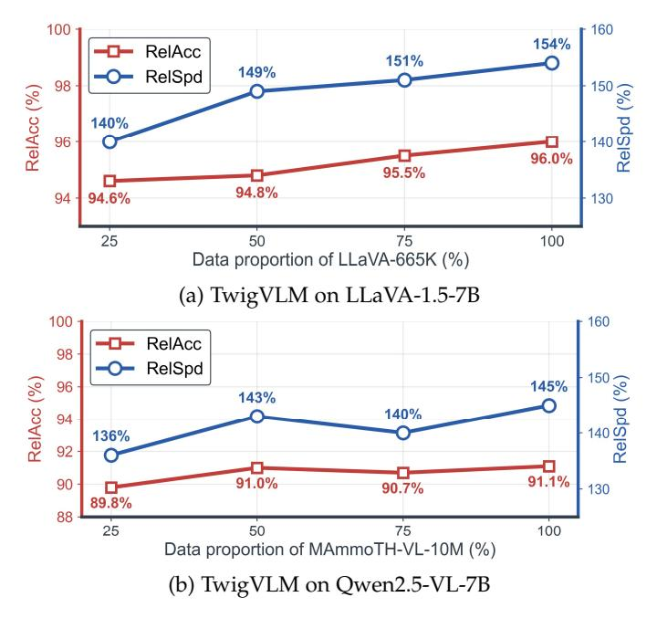
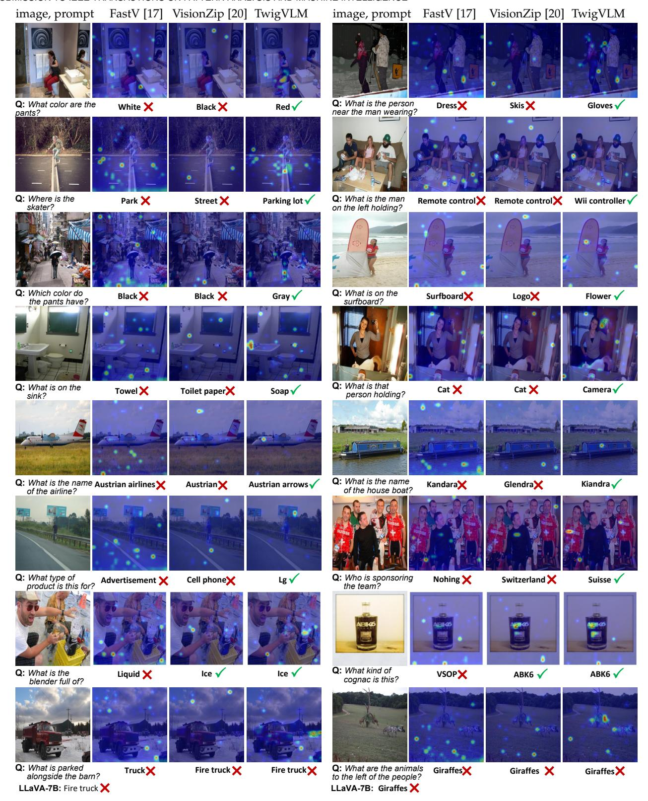

# **APPENDIX A MORE IMPLEMENTATION DETAILS**

**TwigVLM/TwigVLM++ training.** As described in the main text, the twig block is trained by finetuning the shallow VLM Ms. Specifically, M<sup>s</sup> is initialized with the weights of the first K+T layers and the prediction head of the corresponding base VLM Mb. During finetuning, only the last T layers and the prediction head—collectively termed the twig block—are updated, while the first K layers remain frozen. This process follows the same training manner to train the base VLM Mb. Theoretically, any suitable multimodal instruction tuning dataset can be employed to finetune Ms.

The base VLMs evaluated in the main text experiments all leverage the open-source datasets to train their twig blocks. Specifically, we use the LLaVA-665K dataset [23] to train TwigVLM/TwigVLM++ for LLaVA-1.5-7B and LLaVA-NeXT-7B models, and a dataset of 5M single-image samples from the MAmmoTH-VL-10M dataset [67] for Qwen2.5-VL-7B. The optimization hyper-parameters used for training TwigVLM/TwigVLM++ are detailed in TABLE 6. All training is performed on a server equipped with 8 NVIDIA A100 GPUs. Under these conditions, the training of TwigVLM is highly efficient, requiring only approximately 10% of the time needed to train the corresponding base VLM, *e.g.*, training the twig block for the LLaVA-1.5-7B model takes about 10 GPU hours, while the training of the original LLaVA-1.5- 7B takes about 100 GPU hours. TwigVLM++ training also needs only 20% of that time.

**Twig-guided token pruning (TTP).** During inference, TwigVLM leverages the TTP strategy to perform token pruning over the base VLM: (i) at the K-th layer, selecting R key visual tokens (output by the K-th layer) and discarding the rest tokens guided by the attention map from the last twig layer, and (ii) applying the FinalWipe strategy to further remove all the visual tokens after the Kf-th layer. Therefore, we adjust the value of R to satisfy different pruning ratios calculated by the average number of retained visual tokens R¯. TABLE 7 shows the default pruning settings for TwigVLM under different pruning ratios.

**Self-speculative decoding (SSD).** For efficient generation of long responses, TwigVLM applies the SSD strategy by using the M<sup>s</sup> as the *draft* model and M<sup>b</sup> as the *target* model. Specifically, in each SSD iteration, the draft model efficiently predicts δ = 5 subsequent draft tokens in an autoregressive manner. To further improve efficiency, this draft generation process is equipped with an early-exit mechanism that allows the draft model to stop generation if the probability

| config                     | setting                              |  |  |
|----------------------------|--------------------------------------|--|--|
|                            | TwigVLM & TwigVLM++ stage-1 (shared) |  |  |
| optimizer                  | AdamW                                |  |  |
| weight decay               | 0.                                   |  |  |
| optimizer momentum         | β1, β2=0.9, 0.98                     |  |  |
| batch size                 | 128                                  |  |  |
| learning rate schedule     | cosine decay                         |  |  |
| peak learning rate         | 1e-4                                 |  |  |
| warm-up strategy           | linearly warm-up                     |  |  |
| warm-up ratio              | 0.03                                 |  |  |
| training samples           | 665K                                 |  |  |
| training epochs            | 1                                    |  |  |
|                            | TwigVLM++ stage-1 (additional)       |  |  |
| PredKL coefficient α       | 0.1                                  |  |  |
| AttnKL coefficient γ       | 1.0                                  |  |  |
|                            | TwigVLM++ stage-2                    |  |  |
| optimizer                  | AdamW                                |  |  |
| peak learning rate         | 2e-5                                 |  |  |
| batch size                 | 128                                  |  |  |
| group size G               | 32                                   |  |  |
| candidate set R            | {64,85,107,128,149,171,192}          |  |  |
| annealing params (βmax, p) | (8.0, 2.0)                           |  |  |
| training samples           | 50K                                  |  |  |
| training epochs            | 1                                    |  |  |

TABLE 6: **Training settings.** The first section lists hyperparameters shared by TwigVLM and the training stage-1 of TwigVLM++. The second and third sections list additional hyper-parameters specific to TwigVLM++.

| R¯  | pruning ratio | K | R   | Kf |
|-----|---------------|---|-----|----|
| 192 | 66.7%         | 2 | 227 | 24 |
| 128 | 77.8%         | 2 | 134 | 24 |
| 64  | 88.9%         | 2 | 41  | 24 |

TABLE 7: **Pruning settings.** These hyper-parameters correspond to the default TTP settings of different pruning ratios.

of the current predicted token falls below a predefined threshold θ = 0.6. The target model then verifies these generated draft tokens in parallel, accepts those matching the target model's predictions, and then predicts a next token by itself. The iteration repeats until the <EOS> token is generated. Note that the TTP and SSD strategies can be seamlessly integrated, as detailed in Algorithm 1.

**Tree-based self-speculative decoding.** TwigVLM++ replaces the sequential SSD with a tree-based variant to increase the number of accepted tokens per verification step. The token tree T is rooted at the last accepted token and constructed level by level, governed by three hyperparameters: an expansion width E, a selection width K, and a tree depth D. Let T<sup>l</sup> denote the set of nodes at level l. At the first level, M<sup>s</sup> computes the draft distribution conditioned on the current prefix and takes the top-E tokens as children of the root, giving |T1|=E. For each subsequent level l > 1, the top-K nodes from Tl−<sup>1</sup> (ranked by prediction probability) are selected for expansion; each selected node u is fed into M<sup>s</sup> together with its root-to-u prefix to produce E children, yielding |T<sup>l</sup> |=K·E. To bound the verification cost, the completed tree is pruned to retain at most Nmax candidate

## **Algorithm 1** Pseudocode of TwigVLM's inference process

```
# bVLM: the base VLM model, i.e., M_b
# twig: the twig block
# K: Number of shared low layers
# K_f: The position to apply FinalWipe
# R: Number of retained visual tokens when pruning
# delta: Maximum draft token length
# theta: Confidence threshold to stop draft
def sVLM_forward(tokens):
   X_k = bVLM.forward_low_layers(tokens, k=K)
   prob, Attn_last = twig.forward(X_k)
   a_i = argmax(prob)
   return X_k, prob, Attn_last, a_i
def TwigVLM_inference(img, ques):
   draft_toks = [] # temporary buffer for draft tokens
   final_resp = [] # buffer for final response
   # Prefilling stage of sVLM
   X_k, _, Attn, a_i = sVLM_forward((img, ques))
   draft_toks.append(a_i)
   # Prune visual tokens in X_k using Eq. (5)
   # X_k_b means shared token latents for bVLM
   X_k_b = pruning(X_k, Attn, r=R)
   # The loop of self speculative decoding
   while EOS_TOKEN not in final_resp:
       X_k, prob, _, a_i = sVLM_forward(a_i)
       draft_toks.append(a_i)
       X_k_b = concat(X_k_b, X_k, axis=1)
       # the condition to stop draft and verify
       if len(draft_toks) >= delta or prob < theta:
           # removing all visual tokens after layer K_f
           tgt_probs = bVLM.forward_high_layers(
              X_k_b, k=K, fianl_wipe=K_f)
           # verification
           right_toks = [a for a, p in zip(draft_toks, tgt_probs[:-1])
                 if argmax(p) == a]
           right_toks.append(argmax(tgt_probs[-1]))
           final_resp.extend(right_tokens)
           # reset temporary variables
           draft_toks = []
           X_k_b = None
           a_i = final_resp[-1]
   return final_resp
```

nodes by preferentially keeping the highest-confidence leaf nodes and their ancestors. In our default setting, we use E=10, K=10, D=4, and Nmax=60. For verification, M<sup>b</sup> processes the pruned tree in a single forward pass via *tree attention* [65], using a *topology-aware causal mask* so that each node attends only to its ancestors. The target model traverses the tree from the root, accepting a child at each level whose token matches the target model's prediction, and stops at the first level where no child matches; a bonus token predicted by M<sup>b</sup> is then appended. The full procedure is detailed in Algorithm 2.

## **APPENDIX B MORE EXPERIMENTAL RESULTS**

#### **B.1 More performance comparisons**

**Comparisons on more benchmarks.** Taking LLaVA-1.5- 7B as the base VLM, TABLE 9 compares the accuracies among TwigVLM, TwigVLM++ and other visual token pruning methods on *nine* VLM benchmarks under three different pruning ratios. TwigVLM and TwigVLM++ consistently outperform or match their counterparts on all benchmarks and pruning ratios, achieving the best overall RelAcc. In particular, TwigVLM and TwigVLM++ even surpass the upper bound given by the base VLM in RelAcc (100.3%&100.4%) with a 66.7% pruning ratio, demonstrating

## **Algorithm 2** Pseudocode of TwigVLM++'s inference process

```
# bVLM: the base VLM model, i.e., M_b
# twig: the twig block
# K: Number of shared low layers
# K_f: The position to apply FinalWipe
# R: Number of retained visual tokens when pruning
# delta: Number of tree draft iterations
# top_k: Branch factor for tree-based drafting
# max_tokens: Maximum number of candidate tokens in tree
def sVLM_forward(tokens, tree_mask):
   X_k = bVLM.forward_low_layers(tokens, k=K)
   prob, X_t, qk = twig.forward(X_k, tree_mask)
   return X_k, X_t, prob, qk
def TwigVLM++_inference(img, ques):
   final_resp = [] # buffer for final response
   # Prefilling stage of sVLM
   X_k, X_t, _, qk = sVLM_forward((img, ques), None)
   # Prune visual tokens using P-Head
   Attn_phead = P_Head(X_t, qk, img_tags)
   X_k_b = pruning(X_k, Attn_phead, r=R)
   # The loop of tree-based speculative decoding
   while EOS_TOKEN not in final_resp:
       # Tree-based draft generation
       draft_toks = []
       for i in range(delta):
           X_k, prob, _, _ = sVLM_forward(a_i, tree_mask)
           # Top-k sampling for tree expansion
           topk_toks = topk(prob, k=top_k)
           draft_toks.append(topk_toks)
           a_i = topk_toks
           X_k_b = concat(X_k_b, X_k, axis=1)
       # Build tree structure from draft tokens
       tree_cands, tree_pos_ids, tree_mask = \
           build_tree_candidates(draft_toks, top_k, max_tokens)
       # Verify with tree-structured forward
       tgt_probs = bVLM.forward_high_layers(
           X_k_b, tree_cands, tree_pos_ids, tree_mask,
           k=K, final_wipe=K_f)
       # Select best candidate path
       accept_len = verify_tree(tree_cands, tgt_probs)
       best_path = select_best_path(tree_cands, accept_len)
       # Accept tokens and add bonus token
       accept_toks = best_path[:accept_len]
       accept_toks.append(argmax(tgt_probs[accept_len]))
       final_resp.extend(accept_toks)
       # Reset for next iteration
       a_i = final_resp[-1]
       X_k_b = None
   return final_resp
```

their spectacular effectiveness and robustness in accelerating VLMs to deal with various tasks.

**Comparisons on a larger base VLM.** To further demonstrate the generalization ability and superiority of our TwigVLM and TwigVLM++, we present additional experimental results on a larger VLM, LLaVA-1.5-13B, as shown in TABLE 8. TwigVLM and TwigVLM++ consistently achieve the best overall RelAcc compared to all the counterparts, with their superiority being more significant as the increase of pruning ratios. These results verify the scalability and generalization ability of our TwigVLM and TwigVLM++ in accelerating large VLMs.

## **B.2 More ablation studies on TwigVLM**

**Token acceptance rate in SSD.** In the context of speculative decoding methods [22], [34], [36], the token acceptance rate (*abbr.* TokAR) serves as a critical metric for assessing the efficacy of these approaches. TokAR is defined as the proportion of the draft tokens generated by the draft model

| Method                               |      |      |      |      |      | GQA MMB MME VQAT SQAI VQAV2 RelAcc |       |  |
|--------------------------------------|------|------|------|------|------|------------------------------------|-------|--|
| Upper Bound, 576 Tokens (100%)       |      |      |      |      |      |                                    |       |  |
| LLaVA-1.5-13B                        | 63.2 | 67.7 | 1818 | 61.3 | 72.8 | 80.0                               | 100%  |  |
| Retain Averaged 192 Tokens (↓ 66.7%) |      |      |      |      |      |                                    |       |  |
| FastV                                | 60.3 | 67.4 | 1807 | 60.4 | 74.0 | 77.7                               | 98.6% |  |
| VisionZip                            | 59.1 | 66.9 | 1754 | 59.5 | 73.5 | 78.1                               | 97.4% |  |
| VisionZip‡                           | 61.6 | 67.1 | 1790 | 59.9 | 72.7 | 78.6                               | 98.5% |  |
| TwigVLM                              | 62.5 | 68.6 | 1840 | 60.4 | 73.1 | 79.4                               | 99.9% |  |
| TwigVLM++                            | 62.6 | 68.2 | 1829 | 60.4 | 73.2 | 79.4                               | 99.8% |  |
| Retain Averaged 128 Tokens (↓ 77.8%) |      |      |      |      |      |                                    |       |  |
| FastV                                | 57.5 | 65.9 | 1758 | 58   | 73.8 | 74.3                               | 95.7% |  |
| VisionZip                            | 57.9 | 66.7 | 1743 | 58.7 | 74.0 | 76.8                               | 96.6% |  |
| VisionZip‡                           | 60.1 | 67.6 | 1736 | 59.2 | 73.0 | 77.6                               | 97.4% |  |
| TwigVLM                              | 61.2 | 66.9 | 1811 | 60.2 | 73.4 | 79.1                               | 98.9% |  |
| TwigVLM++                            | 62.3 | 67.7 | 1849 | 60.3 | 72.9 | 79.1                               | 99.6% |  |
| Retain Averaged 64 Tokens (↓ 88.9%)  |      |      |      |      |      |                                    |       |  |
| FastV                                | 50.1 | 55.9 | 1408 | 52.2 | 73.2 | 61.1                               | 83.6% |  |
| VisionZip                            | 56.2 | 64.9 | 1676 | 57.4 | 74.4 | 73.7                               | 94.2% |  |
| VisionZip‡                           | 58.1 | 65.6 | 1671 | 58.5 | 72.3 | 75.2                               | 94.9% |  |
| TwigVLM                              | 60.0 | 67.4 | 1765 | 58.4 | 72.4 | 77.0                               | 97.1% |  |
| TwigVLM++                            | 61   | 65.7 | 1793 | 58.5 | 72.7 | 78.0                               | 97.5% |  |

TABLE 8: Performance comparisons of our TwigVLM and TwigVLM++ with other token pruning methods on the **LLaVA-1.5-13B** model.

that are subsequently accepted by the target model. In TwigVLM, TokAR plays a key role, which is influenced by the effectiveness of the twig block and has a significant impact on model's generation speed.

To analyze how TokAR is influenced by the design choices in TwigVLM, we evaluate this metric on several representative variants from the ablation studies presented in the main text. From the results shown in TABLE 10, we have the following findings: (i) A more effective draft model can be trained by only modifying the initialization strategy without altering the architecture. The variant (c) achieves the highest TokAR (57.4%) and thus the highest generation speedup. (ii) Increasing the number of twig layers T introduces more computational costs while improving TokAR at the same time. As a result, the RelSpd exhibits only a modest decline when T increases from 1 to 3. However, it drops distinctly at T=4, which indicates that TokAR begins to saturate. These findings suggest that TwigVLM achieves higher speedup by striking an optimal balance between TokAR and computation costs of the draft model.

**Data efficiency.** To demonstrate the data efficiency of TwigVLM, we train multiple models using different proportions (i.e., 25%, 50%, 75%, and 100%) of each model's respective training dataset for LLaVA-1.5-7B and Qwen2.5- VL-7B. As shown in Fig. 8, both models exhibit a general upward trend in accuracy and speed as the amount of training data increases. Remarkably, however, even when trained on only 50% of their respective datasets, TwigVLM models already achieve competitive, and in some cases comparable, performance to models trained on the full dataset. Moreover, TwigVLM requires only 10% of the training cost of the corresponding base VLM (see A). Recall the results in TABLE 5c of the main text, we can sum up that it is highly efficient and feasible to apply our TwigVLM and



Fig. 8: Performance comparisons of TwigVLM models trained with **different proportions of the training dataset**. Specifically, we use LLaVA-665K to train TwigVLM models for LLaVA-1.5-7B and use MAmmoTH-VL-10M to train TwigVLM models for Qwen2.5-VL-7B. Even with only 50% of the respective training data, TwigVLM is able to maintain competitive accuracy and speed.

TwigVLM++ in industrial scenarios.

**Memory footprint analysis.** We measure the inference VRAM usage of the LLaVA-1.5-7B and LLaVA-Next-7B models in TABLE 11. The introduction of the twig block brings 8% extra VRAM cost for loading model weights. Compared to the base VLM, the overall inference VRAM cost of TwigVLM is comparable or slightly reduced due to the substantial reduction of visual tokens.

## **APPENDIX C MORE VISUALIZED RESULTS**

In this section, we provide more visualized results to validate the effectiveness of TwigVLM's two key components: the twig-guided visual token pruning (TTP) and selfspeculative decoding (SSD). We use LLaVA-1.5-7B as the base VLM in the following experiments.

**Visual token pruning.** To better understand the effectiveness of the proposed TTP strategy, we compare TwigVLM with two representative token pruning methods, namely FastV [17] and VisionZip [20], by visualizing their attention map for token selection and providing the corresponding answer predictions. We provide 16 examples from the GQA and TextVQA benchmarks. As illustrated in Fig. 9, TwigVLM demonstrates superior ability to comprehend the semantics in both the textual prompt and image, and accurately identify task-specific image patches (*i.e.*, visual tokens), thereby activating more informative visual tokens for token pruning. In contrast, FastV and VisionZip often fail to capture the fine-grained visual details, leading to

| Method          | GQA                            | MMB  | MME  | VQAT | SQAI | VQAV2                                | POPE | MMMU | MM-Vet | RelAcc |
|-----------------|--------------------------------|------|------|------|------|--------------------------------------|------|------|--------|--------|
|                 | Upper Bound, 576 Tokens (100%) |      |      |      |      |                                      |      |      |        |        |
| LLaVA-1.5-7B    | 61.9                           | 64.7 | 1862 | 58.2 | 69.5 | 78.5                                 | 85.9 | 36.3 | 31.1   | 100%   |
|                 |                                |      |      |      |      | Retain Averaged 192 Tokens (↓ 66.7%) |      |      |        |        |
| FastV [17]      | 56.5                           | 63.7 | 1786 | 57.3 | 69.5 | 74.6                                 | 79.2 | 35.7 | 28.1   | 95.6%  |
| SparseVLM [18]  | 57.6                           | 62.5 | 1721 | 56.1 | 69.1 | 75.6                                 | 83.6 | 33.8 | 31.5   | 96.2%  |
| PDrop [43]      | 57.3                           | 63.3 | 1797 | 56.5 | 69.2 | 75.1                                 | 82.3 | -    | -      | 96.4%  |
| MustDrop [19]   | 58.2                           | 62.3 | 1787 | 56.5 | 69.2 | 76.0                                 | 82.6 | -    | -      | 96.6%  |
| VisionZip [20]  | 59.3                           | 63.0 | 1783 | 57.3 | 68.9 | 76.8                                 | 85.3 | 36.6 | 31.7   | 98.5%  |
| VisionZip‡ [20] | 60.1                           | 63.4 | 1834 | 57.8 | 68.2 | 77.4                                 | 84.9 | 36.2 | 32.6   | 99.2%  |
| TwigVLM         | 61.2                           | 64.0 | 1848 | 58.0 | 68.8 | 78.1                                 | 87.2 | 36.6 | 32.8   | 100.3% |
| TwigVLM++       | 61.2                           | 64.3 | 1868 | 58.0 | 69.2 | 78.2                                 | 86.9 | 36.4 | 32.6   | 100.4% |
|                 |                                |      |      |      |      | Retain Averaged 128 Tokens (↓ 77.8%) |      |      |        |        |
| FastV           | 53.0                           | 61.4 | 1646 | 56.0 | 69.5 | 69.2                                 | 73.2 | 36.3 | 28.0   | 92.1%  |
| SparseVLM       | 56.0                           | 60.0 | 1696 | 54.9 | 67.1 | 73.8                                 | 80.5 | 33.8 | 30.0   | 93.6%  |
| PDrop           | 57.1                           | 61.6 | 1761 | 56.6 | 68.4 | 72.9                                 | 82.3 | -    | -      | 95.2%  |
| MustDrop        | 56.9                           | 61.1 | 1745 | 56.3 | 68.5 | 74.6                                 | 78.7 | -    | -      | 94.6%  |
| VisionZip       | 57.6                           | 62.0 | 1762 | 56.8 | 68.9 | 75.6                                 | 83.2 | 37.9 | 32.6   | 98.1%  |
| VisionZip‡      | 58.9                           | 62.6 | 1823 | 57.0 | 68.3 | 76.6                                 | 83.7 | 37.3 | 32.9   | 98.8%  |
| TwigVLM         | 60.6                           | 63.5 | 1818 | 57.8 | 69.5 | 77.9                                 | 86.6 | 36.6 | 30.8   | 99.2%  |
| TwigVLM++       | 60.8                           | 63.7 | 1856 | 58.0 | 69.5 | 77.9                                 | 87.0 | 36.4 | 31.4   | 99.8%  |
|                 |                                |      |      |      |      | Retain Averaged 64 Tokens (↓ 88.9%)  |      |      |        |        |
| FastV           | 44.1                           | 45.9 | 1218 | 50.7 | 70.0 | 52.0                                 | 55.6 | 34.0 | 17.8   | 75.3%  |
| SparseVLM       | 52.7                           | 56.2 | 1505 | 51.8 | 62.2 | 68.2                                 | 75.1 | 32.7 | 23.3   | 85.6%  |
| PDrop           | 47.5                           | 58.8 | 1561 | 50.6 | 69.0 | 69.2                                 | 55.9 | -    | -      | 84.4%  |
| FasterVLM [21]  | 51.5                           | 58.5 | 1573 | 53.1 | 69.6 | 66.8                                 | 67.2 | -    | 27.5   | 87.6%  |
| MustDrop        | 53.1                           | 60.0 | 1612 | 54.2 | 63.4 | 69.3                                 | 68.0 | -    | -      | 88.1%  |
| VisionZip       | 55.1                           | 60.1 | 1690 | 55.5 | 69.0 | 72.4                                 | 77.0 | 36.2 | 31.7   | 94.5%  |
| VisionZip‡      | 57.0                           | 61.5 | 1756 | 56.0 | 68.8 | 74.2                                 | 80.9 | 35.6 | 30.2   | 95.6%  |
| TwigVLM         | 58.8                           | 60.4 | 1760 | 55.8 | 70.0 | 75.6                                 | 82.7 | 35.9 | 29.9   | 96.3%  |
| TwigVLM++       | 59.7                           | 63.2 | 1801 | 56.7 | 69.5 | 76.8                                 | 86.6 | 35.7 | 29.0   | 97.6%  |

TABLE 9: Performance of TwigVLM/TwigVLM++ on **LLaVA-1.5-7B** compared to existing methods under three different pruning ratios. The best result for each benchmark and pruning ratio is **bolded**.

| ablation variant                                  | TokAR (%) | RelSpd (%) |  |  |  |  |
|---------------------------------------------------|-----------|------------|--|--|--|--|
| Twig block initialization (Table 4c in main text) |           |            |  |  |  |  |
| (a) random init.                                  | 37.7      | 120.4      |  |  |  |  |
| (b) VLM layers[L-T:L]                             | 44.1      | 131.4      |  |  |  |  |
| (c) VLM layers[K:K+T]                             | 57.4      | 153.6      |  |  |  |  |
| Number of twig layers (Table 4d in main text)     |           |            |  |  |  |  |
| (d) T = 1                                         | 48.7      | 154.1      |  |  |  |  |
| (e) T = 2                                         | 53.4      | 152.6      |  |  |  |  |
| (f) T = 3                                         | 57.4      | 153.6      |  |  |  |  |
| (g) T = 4                                         | 58.1      | 145.4      |  |  |  |  |

TABLE 10: **Token acceptance rate in SSD**. We evaluate the token acceptance rate (TokAR) of the variants in the ablation experiments of the main text.

suboptimal token selection and incorrect predictions. Notably, even though TwigVLM predicts an incorrect answer, its activated visual tokens according to the attention map are reasonable. This suggests that TwigVLM's occasional failures may not be caused by the visual token pruning, but due to the limitations of the base VLM. These findings verify and explain the effectiveness of the TTP strategy.

| model         | avg. visual<br>tokens (R¯) | model weights<br>VRAM (GB) | inference<br>VRAM (GB) |
|---------------|----------------------------|----------------------------|------------------------|
| LLaVA-1.5-7B  | 576                        | 14.3                       | 15.8                   |
| + TwigVLM     | 64                         | 15.5                       | 16.5                   |
| LLaVA-Next-7B | 2,880                      | 14.3                       | 17.9                   |
| + TwigVLM     | 320                        | 15.5                       | 16.8                   |

TABLE 11: Memory footprint comparisons during inference.

**Self-speculative decoding.** To better understand the decoding behavior of the SSD strategy in TwigVLM, we show 8 examples of generated long responses on MM-Vet. From the results in Fig. 10, we have two key observations: (i) In general, the proportion of accepted tokens (in green) surpasses that of the corrected tokens (in black) by the target model, indicating that TwigVLM achieves significant speedup through its high token acceptance rate. (ii) The majority of *easy* tokens, such as those associated with grammar and punctuation, are readily accepted. In contrast, the *hard* tokens, which often demand complex reasoning, have a high probability of being corrected by the target model. In practice, the proportion of easy tokens is usually larger than the hard ones, which confirms the effectiveness of



Fig. 9: Visualization of attention maps and predictions for FastV [17], VisionZip [20], and our TwigVLM on the examples chosen from the GQA [60] and TextVQA [61]. For the examples in the last row, we additionally provide the predictions from the LLaVA-1.5-7B.

our SSD strategy in accelerating the decoding stage while maintaining the generation quality.

