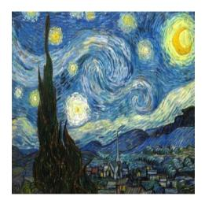
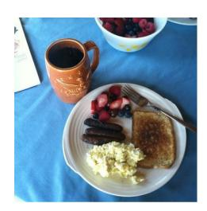
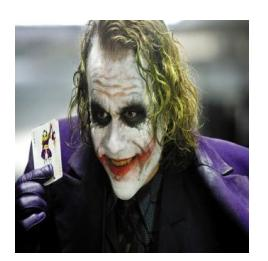

# APPENDIX D EVALUATION BENCHMARKS

In this section, we provide a brief overview of the benchmarks used in our experiments.

**Q**: Is that wine in the background?

**A**: No, there is no wine in the background. The image features a pizza and a soda in a box, along with a laptop and a potted plant.

**Q**: what is the green logo on the car?

**A**: The green logo on the car is the Monster Energy logo.

**Q**: Introduce the player on the right.

**A**: The player on the right is named Kak·, and he is wearing a jersey with the number 8.

**Q**: Is there any reflection of zebra in water?

**A**: Yes, there is a reflection of the zebra in the water.

**Q**: Can you give a short introduction to this painting?

**A**: The painting is a famous artwork by Vincent Van Gogh, featuring a night scene with a sky filled with stars. The scene is set in a village, with a church

 steeple visible in the distance. The painting captures the beauty of the night sky and the tranquility of the village, creating a serene atmosphere. The combination of the stars, the church steeple, and the village buildings make this painting a captivating representation of the artist's vision.

**Q**: Can you give a short introduction to this person?

**A**: The image features a statue of an old man with a long beard, sitting and holding a staff in his hands. The statue appears to be a

representation of a wise or respected figure, possibly a religious leader or a historical figure. The statue is situated in front of a building, possibly a temple or a museum, and it serves as a symbol of wisdom, knowledge, or spiritual guidance.

**Q**: Provide a detailed description of the given image.

**A**: The image features a dining table with a white plate filled with a variety of breakfast foods. The plate contains eggs, toast, and a selection of fruits,

including strawberries and blueberries. There are also sausages on the plate, adding to the delicious assortment of breakfast items. A cup of coffee is placed next to the plate, completing the breakfast setup. A fork is positioned on the table, ready for use. The table setting is inviting and perfect for a morning meal.

**Q**: Can you give a short introduction to this movie?

**A**: The movie "The Dark Knight" is a 2008 superhero film directed by Christopher Nolan. It is the second installment in the Batman film series and stars

Heath Ledger as the Joker, along with Christian Bale as Batman/Bruce Wayne, Michael Caine as Alfred, and Maggie Gyllenhall as Rachel Dawes. The film follows Batman as he battles the Joker, a psychopathic criminal mastermind who seeks to take over Gotham City. The movie is known for its intense action sequences, complex plot, and the iconic performance of Heath Ledger as the Joker.

Fig. 10: Examples of the generated responses using the self-speculative decoding (SSD) on MM-Vet [72], with accepted tokens by the target model being highlighted in green.

**GQA** [60] is a benchmark that focuses on visual scene understanding and reasoning, leveraging scene graphs, questions, and images. It incorporates spatial relationships and object properties, posing challenges for models to perform accurate visual reasoning under complex visual environments.

**MMBench** [68] adopts a hierarchical evaluation approach

with three levels: Level-1 (perception and reasoning), Level-2 (six sub-abilities), and Level-3 (20 specific dimensions). This structured framework allows for a comprehensive evaluation of model performance, making it an effective tool for assessing a wide range of visual understanding capabilities. We denote it as "MMB" in the main text.

**MME** [69] assesses models across 14 subtasks that probe

both perceptual and cognitive skills. Carefully crafted instruction-answer pairs guarantee a fair and comprehensive evaluation of a model's multimodal performance. The final score reported on this benchmark is the summation of both the perception and cognition scores.

**ScienceQA** [70] spans multiple scientific fields, including natural, language, and social sciences, with questions organized into 26 topics, 127 categories, and 379 skills. It evaluates a model's multimodal comprehension, multi-step reasoning, and interpretability, providing a rich testbed for assessing scientific knowledge application in visual contexts. In our experiments, we only evaluate the performance on the samples with images, denoted as "SQAI " in the experimental tables.

**VQA-v2** [71] is a large-scale benchmark featuring 265K images of real-world scenes and objects, with each image paired with open-ended questions and 10 human-provided ground truth answers.

**TextVQA** [61] tests a model's ability to process and reason about text embedded within images. By requiring the integration of visual and textual information, it serves as a critical benchmark for evaluating text-based reasoning in visual contexts. To save space, we denote it as "VQAT " in the experimental tables.

**POPE** [73] targets object hallucination evaluation by posing binary questions about object presence in images. It employs metrics such as Accuracy, Recall, Precision, and F1 score across three sampling methods. The reported score is calculated by the mean accuracy over the three indicators: adversarial, random, and popular.

**MMMU** [74] challenges models with tasks requiring college-level expertise and reasoning skills. It comprises 11.5K questions drawn from exams, quizzes, and textbooks, spanning six key disciplines: Art & Design, Business, Science, Health & Medicine, Humanities & Social Science, and Tech & Engineering. Featuring 30 subjects and 183 subfields, MMMU involves diverse image types, *e.g.*, charts, diagrams, and chemical structures, demanding advanced perceptual and domain-specific reasoning abilities akin to those of human experts.

**MM-Vet** [72] evaluates six fundamental vision-language capabilities: recognition, OCR, knowledge, language generation, spatial awareness, and mathematical reasoning. It examines 16 specific combinations of these skills through quantitative metrics, offering a nuanced perspective on a model's proficiency in tackling intricate multimodal tasks.

**MMStar** [75] is an elite vision-indispensable multi-modal benchmark designed to rigorously evaluate the genuine multi-modal capabilities of large vision-language models. It comprises 1,500 carefully selected samples spanning six core capability dimensions, including coarse and fine-grained perception, instance reasoning, logical reasoning, science & technology, and mathematics. Each sample is manually verified to ensure that visual content is essential for arriving at the correct answer, thereby filtering out instances answerable through text-only reasoning or dataset bias.

**OCRBench** [76] is a comprehensive evaluation benchmark designed to assess the optical character recognition capabilities of large vision-language models across diverse text-related visual understanding tasks. It encompasses 29 sub-tasks spanning five major categories—text recognition, scene text-centric VQA, document-oriented VQA, key information extraction, and handwritten mathematical expression recognition—comprising 1,000 human-verified question-answer pairs.

**BLINK** [77] is a multimodal benchmark that evaluates visual perception capabilities, which are straightforward for humans yet challenging for current multimodal large language models. It reformats 14 classic computer vision tasks into 3,807 multiple-choice questions, covering relative depth estimation, jigsaw puzzle solving, visual correspondence, forensics detection, spatial reasoning, and more. The benchmark reveals that even state-of-the-art models significantly lag behind human performance on these perceptionoriented tasks.

**Video-MME** [78] is a comprehensive evaluation benchmark for assessing video understanding capabilities of multimodal large language models. It comprises 900 videos totaling 254 hours with 2,700 human-annotated question-answer pairs, spanning short (<2 minutes), medium (4–15 minutes), and long (30–60 minutes) durations across 30 broad categories. The benchmark evaluates models in both withsubtitle and without-subtitle settings, thereby disentangling visual and textual comprehension abilities.

**EgoSchema** [79] is a diagnostic benchmark for very longform video language understanding, featuring over 5,000 human-curated multiple-choice question-answer pairs derived from Ego4D videos. Each question requires temporal reasoning over three-minute video clips, making it substantially more demanding than prior video QA benchmarks that typically involve short clips of only a few seconds. The benchmark specifically targets the assessment of models' capacity for extended temporal comprehension and egocentric activity understanding.

**MVBench** [80] is a comprehensive benchmark designed to evaluate the temporal understanding capabilities of multimodal video large language models. It defines 20 challenging video understanding tasks—such as action sequence recognition, scene transition detection, and attribute change identification—that specifically require dynamic, temporal reasoning rather than reliance on single-frame cues. Evaluation is conducted through a multiple-choice questionanswering format, enabling scalable and reproducible assessment across diverse temporal reasoning dimensions.

## **REFERENCES**

- [1] T. Brown, B. Mann, N. Ryder, M. Subbiah, J. D. Kaplan, P. Dhariwal, A. Neelakantan, P. Shyam, G. Sastry, A. Askell, S. Agarwal, A. Herbert-Voss, G. Krueger, T. Henighan, R. Child, A. Ramesh, D. Ziegler, J. Wu, C. Winter, C. Hesse, M. Chen, E. Sigler, M. Litwin, S. Gray, B. Chess, J. Clark, C. Berner, S. McCandlish, A. Radford, I. Sutskever, and D. Amodei, "Language models are few-shot learners," in *Advances in Neural Information Processing Systems*, vol. 33, 2020, pp. 1877–1901.
- [2] D. Guo, D. Yang, H. Zhang, J. Song, R. Zhang, R. Xu, Q. Zhu, S. Ma, P. Wang, X. Bi *et al.*, "Deepseek-r1: Incentivizing reasoning capability in llms via reinforcement learning," *arXiv preprint arXiv:2501.12948*, 2025.
- [3] OpenAI, "Gpt-4v(ision) system card," OpenAI, Tech. Rep., 2023.
- [4] H. Liu, C. Li, Q. Wu, and Y. J. Lee, "Visual instruction tuning," in *Advances in Neural Information Processing Systems*, vol. 36, 2023, pp. 34 892–34 916.

- [5] J. Bai, S. Bai, S. Yang, S. Wang, S. Tan, P. Wang, J. Lin, C. Zhou, and J. Zhou, "Qwen-vl: A frontier large vision-language model with versatile abilities," *arXiv preprint arXiv:2308.12966*, 2023.
- [6] Z. Chen, W. Wang, H. Tian, S. Ye, Z. Gao, E. Cui, W. Tong, K. Hu, J. Luo, Z. Ma *et al.*, "How far are we to gpt-4v? closing the gap to commercial multimodal models with open-source suites," *Science China Information Sciences*, vol. 67, no. 12, p. 220101, 2024.
- [7] Z. Shao, Z. Yu, J. Yu, X. Ouyang, L. Zheng, Z. Gai, M. Wang, Z. Kuang, and J. Ding, "Imp: Highly capable large multimodal models for mobile devices," *IEEE Transactions on Multimedia*, 2025.
- [8] Z. Peng, W. Wang, L. Dong, Y. Hao, S. Huang, S. Ma, Q. Ye, and F. Wei, "Grounding multimodal large language models to the world," in *The Twelfth International Conference on Learning Representations*, 2024.
- [9] C. Ma, Y. Jiang, J. Wu, Z. Yuan, and X. Qi, "Groma: Localized visual tokenization for grounding multimodal large language models," in *European Conference on Computer Vision*. Springer, 2024, pp. 417–435.
- [10] J. Ye, A. Hu, H. Xu, Q. Ye, M. Yan, Y. Dan, C. Zhao, G. Xu, C. Li, J. Tian *et al.*, "mplug-docowl: Modularized multimodal large language model for document understanding," *arXiv preprint arXiv:2307.02499*, 2023.
- [11] C. Luo, Y. Shen, Z. Zhu, Q. Zheng, Z. Yu, and C. Yao, "Layoutllm: Layout instruction tuning with large language models for document understanding," in *Proceedings of the IEEE/CVF conference on computer vision and pattern recognition*, 2024, pp. 15 630–15 640.
- [12] J. Wang, H. Xu, J. Ye, M. Yan, W. Shen, J. Zhang, F. Huang, and J. Sang, "Mobile-agent: Autonomous multi-modal mobile device agent with visual perception," *arXiv preprint arXiv:2401.16158*, 2024.
- [13] C. Zhang, Z. Yang, J. Liu, Y. Han, X. Chen, Z. Huang, B. Fu, and G. Yu, "Appagent: Multimodal agents as smartphone users," *arXiv preprint arXiv:2312.13771*, 2023.
- [14] A. Brohan, N. Brown, J. Carbajal, Y. Chebotar, X. Chen, K. Choromanski, T. Ding, D. Driess, A. Dubey, C. Finn *et al.*, "Rt-2: Visionlanguage-action models transfer web knowledge to robotic control," *arXiv preprint arXiv:2307.15818*, 2023.
- [15] M. J. Kim, K. Pertsch, S. Karamcheti, T. Xiao, A. Balakrishna, S. Nair, R. Rafailov, E. Foster, G. Lam, P. Sanketi *et al.*, "Openvla: An open-source vision-language-action model," *arXiv preprint arXiv:2406.09246*, 2024.
- [16] A. Vaswani, N. Shazeer, N. Parmar, J. Uszkoreit, L. Jones, A. N. Gomez, L. u. Kaiser, and I. Polosukhin, "Attention is all you need," in *Advances in Neural Information Processing Systems*, vol. 30, 2017.
- [17] L. Chen, H. Zhao, T. Liu, S. Bai, J. Lin, C. Zhou, and B. Chang, "An image is worth 1/2 tokens after layer 2: Plug-and-play inference acceleration for large vision-language models," in *European Conference on Computer Vision*. Springer, 2024, pp. 19–35.
- [18] Y. Zhang, C.-K. Fan, J. Ma, W. Zheng, T. Huang, K. Cheng, D. Gudovskiy, T. Okuno, Y. Nakata, K. Keutzer *et al.*, "Sparsevlm: Visual token sparsification for efficient vision-language model inference," *arXiv preprint arXiv:2410.04417*, 2024.
- [19] T. Liu, L. Shi, R. Hong, Y. Hu, Q. Yin, and L. Zhang, "Multistage vision token dropping: Towards efficient multimodal large language model," *arXiv preprint arXiv:2411.10803*, 2024.
- [20] S. Yang, Y. Chen, Z. Tian, C. Wang, J. Li, B. Yu, and J. Jia, "Visionzip: Longer is better but not necessary in vision language models," *arXiv preprint arXiv:2412.04467*, 2024.
- [21] Q. Zhang, A. Cheng, M. Lu, Z. Zhuo, M. Wang, J. Cao, S. Guo, Q. She, and S. Zhang, "[cls] attention is all you need for trainingfree visual token pruning: Make vlm inference faster," *arXiv preprint arXiv:2412.01818*, 2024.
- [22] M. Elhoushi, A. Shrivastava, D. Liskovich, B. Hosmer, B. Wasti, L. Lai, A. Mahmoud, B. Acun, S. Agarwal, A. Roman *et al.*, "Layerskip: Enabling early exit inference and self-speculative decoding," *arXiv preprint arXiv:2404.16710*, 2024.
- [23] H. Liu, C. Li, Y. Li, and Y. J. Lee, "Improved baselines with visual instruction tuning," in *Proceedings of the IEEE/CVF Conference on Computer Vision and Pattern Recognition*, 2024, pp. 26 296–26 306.
- [24] Z. Shao, M. Wang, Z. Yu, W. Pan, Y. Yang, T. Wei, H. Zhang, N. Mao, W. Chen, and J. Yu, "Growing a twig to accelerate large vision-language models," in *Proceedings of the IEEE/CVF International Conference on Computer Vision (ICCV)*, 2025, pp. 20 064–20 074.
- [25] A. Gu and T. Dao, "Mamba: Linear-time sequence modeling with selective state spaces," in *First Conference on Language Modeling*, 2024.

- [26] Y. Sun, L. Dong, Y. Zhu, S. Huang, W. Wang, S. Ma, Q. Zhang, J. Wang, and F. Wei, "You only cache once: Decoder-decoder architectures for language models," *Advances in Neural Information Processing Systems*, vol. 37, pp. 7339–7361, 2025.
- [27] A. Liu, B. Feng, B. Xue, B. Wang, B. Wu, C. Lu, C. Zhao, C. Deng, C. Zhang, C. Ruan *et al.*, "Deepseek-v3 technical report," *arXiv preprint arXiv:2412.19437*, 2024.
- [28] H. Jiang, Q. Wu, C.-Y. Lin, Y. Yang, and L. Qiu, "Llmlingua: Compressing prompts for accelerated inference of large language models," in *Proceedings of the 2023 Conference on Empirical Methods in Natural Language Processing*, 2023, pp. 13 358–13 376.
- [29] J. Mu, X. Li, and N. Goodman, "Learning to compress prompts with gist tokens," *Advances in Neural Information Processing Systems*, vol. 36, pp. 19 327–19 352, 2023.
- [30] T. Dao, D. Y. Fu, S. Ermon, A. Rudra, and C. Re, "FlashAttention: ´ Fast and memory-efficient exact attention with IO-awareness," in *Advances in Neural Information Processing Systems (NeurIPS)*, 2022.
- [31] S. Dai, H. Genc, R. Venkatesan, and B. Khailany, "Efficient transformer inference with statically structured sparse attention," in *2023 60th ACM/IEEE Design Automation Conference (DAC)*. IEEE, 2023, pp. 1–6.
- [32] G. Xiao, Y. Tian, B. Chen, S. Han, and M. Lewis, "Efficient streaming language models with attention sinks," in *The Twelfth International Conference on Learning Representations*, 2024.
- [33] Z. Zhang, Y. Sheng, T. Zhou, T. Chen, L. Zheng, R. Cai, Z. Song, Y. Tian, C. Re, C. Barrett ´ *et al.*, "H2o: Heavy-hitter oracle for efficient generative inference of large language models," *Advances in Neural Information Processing Systems*, vol. 36, pp. 34 661–34 710, 2023.
- [34] Y. Leviathan, M. Kalman, and Y. Matias, "Fast inference from transformers via speculative decoding," in *International Conference on Machine Learning*. PMLR, 2023, pp. 19 274–19 286.
- [35] T. Cai, Y. Li, Z. Geng, H. Peng, J. D. Lee, D. Chen, and T. Dao, "Medusa: Simple llm inference acceleration framework with multiple decoding heads," *arXiv preprint arXiv:2401.10774*, 2024.
- [36] F. Liu, Y. Tang, Z. Liu, Y. Ni, D. Tang, K. Han, and Y. Wang, "Kangaroo: Lossless self-speculative decoding for accelerating llms via double early exiting," *Advances in Neural Information Processing Systems*, vol. 37, pp. 11 946–11 965, 2025.
- [37] Z. Zhang, S. Yadav, F. Han, and E. Shutova, "Cross-modal information flow in multimodal large language models," *arXiv preprint arXiv:2411.18620*, 2024.
- [38] W. Ye, Q. Wu, W. Lin, and Y. Zhou, "Fit and prune: Fast and training-free visual token pruning for multi-modal large language models," *arXiv preprint arXiv:2409.10197*, 2024.
- [39] X. Ye, Y. Gan, Y. Ge, X.-P. Zhang, and Y. Tang, "Atp-llava: Adaptive token pruning for large vision language models," *arXiv preprint arXiv:2412.00447*, 2024.
- [40] Q. Wu, W. Lin, W. Ye, Y. Zhou, X. Sun, and R. Ji, "Accelerating multimodal large language models via dynamic visual-token exit and the empirical findings," *arXiv preprint arXiv:2411.19628*, 2024.
- [41] Y. Han, X. Liu, P. Ding, D. Wang, H. Chen, Q. Yan, and S. Huang, "Rethinking token reduction in mllms: Towards a unified paradigm for training-free acceleration," *arXiv preprint arXiv:2411.17686*, 2024.
- [42] J. Chen, L. Ye, J. He, Z.-Y. Wang, D. Khashabi, and A. Yuille, "Llavolta: Efficient multi-modal models via stage-wise visual context compression," *arXiv preprint arXiv:2406.20092*, 2024.
- [43] L. Xing, Q. Huang, X. Dong, J. Lu, P. Zhang, Y. Zang, Y. Cao, C. He, J. Wang, F. Wu *et al.*, "Pyramiddrop: Accelerating your large vision-language models via pyramid visual redundancy reduction," *arXiv preprint arXiv:2410.17247*, 2024.
- [44] Z. Zhang, P. Pham, W. Zhao, K. Wan, Y.-J. Li, J. Zhou, D. Miranda, A. Kale, and C. Xu, "Treat visual tokens as text? but your mllm only needs fewer efforts to see," *arXiv preprint arXiv:2410.06169*, 2024.
- [45] W. Chai, E. Song, Y. Du, C. Meng, V. Madhavan, O. Bar-Tal, J.- N. Hwang, S. Xie, and C. D. Manning, "Auroracap: Efficient, performant video detailed captioning and a new benchmark," *arXiv preprint arXiv:2410.03051*, 2024.
- [46] D. Bolya, C.-Y. Fu, X. Dai, P. Zhang, C. Feichtenhofer, and J. Hoffman, "Token merging: Your vit but faster," in *The Eleventh International Conference on Learning Representations*, 2023.
- [47] Y. Shang, M. Cai, B. Xu, Y. J. Lee, and Y. Yan, "Llava-prumerge: Adaptive token reduction for efficient large multimodal models," *arXiv preprint arXiv:2403.15388*, 2024.

- [48] P. K. A. Vasu, F. Faghri, C.-L. Li, C. Koc, N. True, A. Antony, G. Santhanam, J. Gabriel, P. Grasch, O. Tuzel *et al.*, "Fastvlm: Efficient vision encoding for vision language models," *arXiv preprint arXiv:2412.13303*, 2024.
- [49] Q. Zhang, A. Cheng, M. Lu, R. Zhang, Z. Zhuo, J. Cao, S. Guo, Q. She, and S. Zhang, "Beyond text-visual attention: Exploiting visual cues for effective token pruning in vlms," in *Proceedings of the IEEE/CVF International Conference on Computer Vision*, 2025, pp. 20 857–20 867.
- [50] Y. Jiang, Q. Wu, W. Lin, W. Yu, and Y. Zhou, "What kind of visual tokens do we need? training-free visual token pruning for multimodal large language models from the perspective of graph," in *Proceedings of the AAAI Conference on Artificial Intelligence*, 2025, aAAI 2025.
- [51] M. Endo, X. Wang, and S. Yeung-Levy, "Feather the throttle: Revisiting visual token pruning for vision-language model acceleration," in *Proceedings of the IEEE/CVF International Conference on Computer Vision*, 2025, pp. 22 826–22 835.
- [52] Z. Wen, Y. Gao, W. Li, C. He, and L. Zhang, "Token pruning in multimodal large language models: Are we solving the right problem?" in *Findings of the Association for Computational Linguistics: ACL 2025*, 2025, pp. 15 537–15 549.
- [53] M. Gagrani, R. Goel, W. Jeon, J. Park, M. Lee, and C. Lott, "On speculative decoding for multimodal large language models," in *Proceedings of the IEEE/CVF Conference on Computer Vision and Pattern Recognition*, 2024, pp. 8285–8289.
- [54] W. Zhao, Y. Han, J. Tang, Z. Li, Y. Song, K. Wang, Z. Wang, and Y. You, "A stitch in time saves nine: Small vlm is a precise guidance for accelerating large vlms," *arXiv preprint arXiv:2412.03324*, 2024.
- [55] M. Huo, J. Zhang, H. Wang, J. Xu, Z. Chen, H. Tai, and Y. Chen, "Spec-llava: Accelerating vision-language models with dynamic tree-based speculative decoding," 2025. [Online]. Available: https://arxiv.org/abs/2509.11961
- [56] H. Huang, F. Yang, Z. Liu, X. Yin, D. Li, P. Ren, and E. Barsoum, "Specvlm: Fast speculative decoding in visionlanguage models," *CoRR*, vol. abs/2509.11815, 2025. [Online]. Available: https://arxiv.org/abs/2509.11815
- [57] Y. Ji, J. Zhang, H. Xia, J. Chen, L. Shou, G. Chen, and H. Li, "SpecVLM: Enhancing speculative decoding of video LLMs via verifier-guided token pruning," in *Proceedings of the 2025 Conference on Empirical Methods in Natural Language Processing*, C. Christodoulopoulos, T. Chakraborty, C. Rose, and V. Peng, Eds. Suzhou, China: Association for Computational Linguistics, Nov. 2025, pp. 7205–7219. [Online]. Available: https://aclanthology.org/2025.emnlp-main.366/
- [58] J. Kang, H. Shu, W. Li, Y. Zhai, and X. Chen, "Vispec: Accelerating vision-language models with vision-aware speculative decoding," in *Advances in Neural Information Processing Systems 38 (NeurIPS 2025)*, 2025. [Online]. Available: https://openreview.net/forum? id=x2BsIdJJJW
- [59] Z. Zhou, X. Ning, K. Hong, T. Fu, J. Xu, S. Li, Y. Lou, L. Wang, Z. Yuan, X. Li *et al.*, "A survey on efficient inference for large language models," *arXiv preprint arXiv:2404.14294*, 2024.
- [60] D. A. Hudson and C. D. Manning, "Gqa: A new dataset for realworld visual reasoning and compositional question answering," in *Proceedings of the IEEE/CVF Conference on Computer Vision and Pattern Recognition*, 2019.
- [61] A. Singh, V. Natarajan, M. Shah, Y. Jiang, X. Chen, D. Batra, D. Parikh, and M. Rohrbach, "Towards vqa models that can read," in *Proceedings of the IEEE/CVF Conference on Computer Vision and Pattern Recognition*, 2019, pp. 8317–8326.
- [62] Y. Tang, S. Wang, L. Madaan, and R. Munos, "Beyond verifiable rewards: Scaling reinforcement learning in language models to unverifiable data," in *Advances in Neural Information Processing Systems*, 2025. [Online]. Available: https://openreview. net/forum?id=pc6M9h3T9m
- [63] X. Zhou, Z. Liu, A. Sims, H. Wang, T. Pang, C. Li, L. Wang, M. Lin, and C. Du, "Reinforcing general reasoning without verifiers," in *International Conference on Learning Representations*, 2026. [Online]. Available: https://openreview.net/forum?id=nnwvwge40d
- [64] Z. Shao, P. Wang, Q. Zhu, R. Xu, J. Song, M. Zhang, Y. K. Li, Y. Wu, and D. Guo, "Deepseekmath: Pushing the limits of mathematical reasoning in open language models," *arXiv preprint arXiv:2402.03300*, 2024.
- [65] X. Miao, G. Oliaro, Z. Zhang, X. Cheng, Z. Wang, Z. Zhang, R. Y. Y. Wong, A. Zhu, L. Yang, X. Shi, C. Shi, Z. Chen, D. Arfeen, R. Cen, and Z. Jia, "Specinfer: Accelerating large language model serving

- with tree-based speculative inference and verification," in *Proceedings of the 29th ACM International Conference on Architectural Support for Programming Languages and Operating Systems (ASPLOS)*, 2024.
- [66] H. Liu, C. Li, Y. Li, B. Li, Y. Zhang, S. Shen, and Y. J. Lee, "Llava-next: Improved reasoning, ocr, and world knowledge," January 2024. [Online]. Available: https://llava-vl.github.io/ blog/2024-01-30-llava-next/
- [67] J. Guo, T. Zheng, Y. Bai, B. Li, Y. Wang, K. Zhu, Y. Li, G. Neubig, W. Chen, and X. Yue, "Mammoth-vl: Eliciting multimodal reasoning with instruction tuning at scale," 2024. [Online]. Available: https://arxiv.org/abs/2412.05237
- [68] Y. Liu, H. Duan, Y. Zhang, B. Li, S. Zhang, W. Zhao, Y. Yuan, J. Wang, C. He, Z. Liu *et al.*, "Mmbench: Is your multi-modal model an all-around player?" in *European Conference on Computer Vision*. Springer, 2025, pp. 216–233.
- [69] C. Fu, P. Chen, Y. Shen, Y. Qin, M. Zhang, X. Lin, Z. Qiu, W. Lin, J. Yang, X. Zheng *et al.*, "Mme: A comprehensive evaluation benchmark for multimodal large language models," *arXiv preprint arXiv:2306.13394*, 2023.
- [70] P. Lu, S. Mishra, T. Xia, L. Qiu, K.-W. Chang, S.-C. Zhu, O. Tafjord, P. Clark, and A. Kalyan, "Learn to explain: Multimodal reasoning via thought chains for science question answering," *Advances in Neural Information Processing Systems*, vol. 35, pp. 2507–2521, 2022.
- [71] Y. Goyal, T. Khot, D. Summers-Stay, D. Batra, and D. Parikh, "Making the v in vqa matter: Elevating the role of image understanding in visual question answering," in *Proceedings of the IEEE/CVF Conference on Computer Vision and Pattern Recognition*, 2017, pp. 6904–6913.
- [72] W. Yu, Z. Yang, L. Li, J. Wang, K. Lin, Z. Liu, X. Wang, and L. Wang, "Mm-vet: Evaluating large multimodal models for integrated capabilities," *arXiv preprint arXiv:2308.02490*, 2023.
- [73] Y. Li, Y. Du, K. Zhou, J. Wang, W. X. Zhao, and J.-R. Wen, "Evaluating object hallucination in large vision-language models," *arXiv:2305.10355*, 2023.
- [74] X. Yue, Y. Ni, K. Zhang, T. Zheng, R. Liu, G. Zhang, S. Stevens, D. Jiang, W. Ren, Y. Sun *et al.*, "Mmmu: A massive multi-discipline multimodal understanding and reasoning benchmark for expert agi," in *Proceedings of the IEEE/CVF Conference on Computer Vision and Pattern Recognition*, 2024, pp. 9556–9567.
- [75] L. Chen, J. Li, X. Dong, P. Zhang, Y. Zang, Z. Chen, H. Duan, J. Wang, Y. Qiao, D. Lin, and F. Zhao, "Are we on the right way for evaluating large vision-language models?" in *Advances in Neural Information Processing Systems*, 2024.
- [76] Y. Liu, Z. Li, M. Huang, B. Yang, W. Yu, C. Li, X.-C. Yin, C.-L. Liu, L. Jin, and X. Bai, "Ocrbench: On the hidden mystery of ocr in large multimodal models," *Science China Information Sciences*, vol. 67, no. 12, 2024.
- [77] X. Fu, Y. Hu, B. Li, Y. Feng, H. Wang, X. Lin, D. Roth, N. A. Smith, W.-C. Ma, and R. Krishna, "Blink: Multimodal large language models can see but not perceive," in *Proceedings of the European Conference on Computer Vision*, 2024.
- [78] C. Fu, Y. Dai, Y. Luo, L. Li, S. Ren, R. Zhang, Z. Wang, C. Zhou, Y. Shen, M. Zhang *et al.*, "Video-mme: The first-ever comprehensive evaluation benchmark of multi-modal llms in video analysis," in *Proceedings of the IEEE/CVF Conference on Computer Vision and Pattern Recognition*, 2025.
- [79] K. Mangalam, R. Akshulakov, and J. Malik, "Egoschema: A diagnostic benchmark for very long-form video language understanding," in *Advances in Neural Information Processing Systems*, 2023.
- [80] K. Li, Y. Wang, Y. He, Y. Li, Y. Wang, Y. Liu, Z. Wang, J. Xu, G. Chen, P. Lou, L. Wang, and Y. Qiao, "Mvbench: A comprehensive multimodal video understanding benchmark," in *Proceedings of the IEEE/CVF Conference on Computer Vision and Pattern Recognition*, 2024, pp. 22 195–22 206.