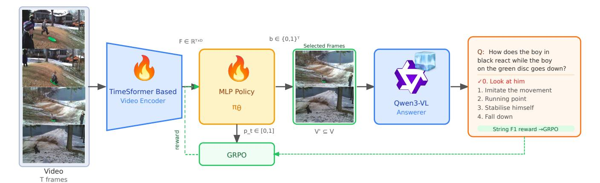
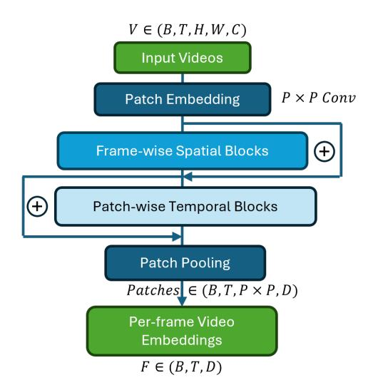

# 1. Introduction

Existing state-of-the-art VLMs rely on scaling large visualtext data pairs to improve performance [\[8,](#page-8-0) [13,](#page-8-1) [23,](#page-8-2) [31\]](#page-9-0), and while these efforts have yielded measurable gains on VQA benchmarks, the underlying mechanism–a vision encoder tokenizes image patches, a projection layer maps them into the language model's embedding space, and an autoregressive LLM decodes the response–has remained largely unchanged. Videos are first sampled and transformed into visual tokens, which are then aligned with textual inputs through cross-attention mechanisms [\[12\]](#page-8-3). The data-hungry nature of such architecture brings significant downfalls in "Small Data" domains, where data collection is costly, inefficient and sometimes facing regulations, limiting the adopting in these situations [\[4,](#page-8-4) [27,](#page-8-5) [29\]](#page-9-1). Some approaches attempt to enhance spatial and temporal reasoning by applying LoRA-based [\[15\]](#page-8-6) fine-tuning on datasets specifically curated for reasoning tasks, thereby improving a model's ability to understand and interpret video content. Most other methods rely on minor modifications to the attention architecture to adapt the model to specific domains and applications [\[17\]](#page-8-7). VLMs for video largely inherit the architecture and biases of image-based models, with temporal reasoning added only superficially. Video-LLaVA [\[22\]](#page-8-8) samples eight frames through a shared frozen encoder with no temporal module, LLaVA-OneVision [\[20\]](#page-8-9) treats video frames as multiple images and shows that an image-only checkpoint already performs competitively on video benchmarks, and Video-ChatGPT [\[25\]](#page-8-10) reduces temporal reasoning to meanpooling of per-frame CLIP features. The resulting performance gap is stark: InternVL2.5-78B achieves 95.1% on DocVQA [\[26\]](#page-8-11) yet only 72.1% on Video-MME [\[8\]](#page-8-0); a 23 point drop that reflects the absence of genuine temporal reasoning rather than mere task difficulty. In practice, most systems rely on pragmatic frame-sampling strategies, effectively reducing videos to sets of isolated images, leading to unavoidable information loss while increasing signal-noise ratio. The frames with necessary information for VLM to reason might be discarded through this sampling procedures, degrading answers' quality. The broader question of how visual inputs should be structured, represented, and processed within VLMs to preserve key information while removing noise remains insufficiently examined. Although a few studies highlight the role of sampling as a form of

Figure 1. HORNet pipeline. Given a video V = {v1, v2, . . . , vT } with T uniformly sampled frames, our TimeSFormer-based video encoder E extracts per-frame features F ∈ R T ×D. A lightweight trainable MLP policy πθ scores each frame independently, producing keep probabilities pt ∈ [0, 1] and a binary selection mask b ∈ {0, 1} T . Only the frames selected by the mask (V′ ⊆ V) are passed to the frozen Qwen3-VL answerer. For example, to answer *"How does the boy in black react while the boy on the green disc goes down?"*, HORNet selects only the frames capturing the key interaction moment, discarding irrelevant context; correctly predicting *"Look at him"*. At training time, GRPO samples K candidate subsets, evaluates each via String F1 reward against the ground-truth answer, and updates πθ through group-normalized policy gradients. The VLM answerer remain frozen throughout while the encoder and MLP policy are trainable.

filtering [\[6,](#page-8-12) [30,](#page-9-2) [41\]](#page-9-3), its importance is largely overlooked.

Given that scaling data has improved image understanding far more than video understanding under this paradigm, we turn to a complementary axis of improvement: optimizing how models reason over their visual inputs through reinforcement-learning-based fine-tuning. Most existing VLMs requires supervised fine-tuning (SFT) to adapt to new domains, which are costly and inefficient with small data. The advent of Group Relative Policy Optimization (GRPO) [\[9,](#page-8-13) [28\]](#page-9-4) has opened a new avenue for end-to-end optimization of language model behavior via verifiable reward signals. Inspired by its success in guiding the gradients to improve the *outputs* of VLMs [\[1,](#page-8-14) [10,](#page-8-15) [39\]](#page-9-5), we ask a fundamentally different question: can GRPO be used to optimize *what a VLM sees (inputs)*, rather than what it says (gradients)? We formalize the problem as Select Any Frames (SAF): given a video and a question, select the subset of frames from the full temporal sequence that maximizes the downstream VLM's ability to produce the correct answer. SAF treats frame selection as a sequential decision problem amenable to reinforcement learning, with the VLM's QA accuracy providing a direct, task-grounded reward signal. This framing is intentionally simple and general; the SAF policy is modular and can be paired with any downstream VLM without any modifications to the architecture.

To address the issue, we present HORNet: Hindsight Optimization Reasoning, a three-stage SAF pipeline that optimize VLMs' performance by selecting optimal frames from video input (see Fig. [1\)](#page-1-0). First, a trainable lightweight video encoder extracts rich spatiotemporal features for each frame independently. Second, a lightweight trainable multilayer perceptron (MLP) policy consumes these features and outputs a per-frame keep probability. Third, GRPO trains the video encoder and MLP by sampling multiple candidate frame subsets per video, passing each to a frozen VLM model for answering and computing rewards. Only the MLP and video encoder are trained; the VLM remain frozen throughout. This design makes HORNet exceptionally parameter-efficient-suitable for small-data settings where full fine-tuning of large models is infeasiblewhile still benefiting from the representational capacity of pretrained video and language foundations. Operating at the frame-selection level rather than the token level allows HORNet to substantially reduce both the memory footprint and the inference latency of downstream VLM processing, with these gains becoming even more pronounced as model size increases.

We train HORNet on a diverse multi-dataset corpus spanning MSRVTT-QA [\[33\]](#page-9-6), MSVD-QA [\[34\]](#page-9-7), and NExT-QA [\[32\]](#page-9-8), totaling 17,350 videos, 341,877 QA pairs, and 114.2 hours of content. This breadth covers descriptive, causal, and temporal question types, pushing the policy to discover generalizable selection strategies rather than dataset-specific shortcuts. In short, our contributions are:

- We introduce SAF (Select Any Frames), a task formulation that decouples frame selection from VLM reasoning and enables direct reward-based optimization of visual inputs.
- We propose HORNet, a GRPO-trained frame selection policy built on frozen video and language foundations, trainable with minimal parameters.
- We demonstrate that GRPO can be redirected from opti-

Table 1. **Research gap.** Existing frame selection methods satisfy at most two of four desirable properties simultaneously. HORNet is the first to achieve all four: learned selection, reward-based optimization, a fully frozen VLM, and parameter efficiency (<1M parameters).  $\checkmark$  fully supported,  $\times$  not supported,  $\sim$  partial.

| Method             | Learned Selection | Reward Optimized | Frozen VLM | Param. Efficient |
|--------------------|----------------------|---------------------|---------------|---------------------|
| Uniform Sampling   | ×                    | ×                   | ✓             | <b>√</b>            |
| SeViLA [36]        | $\checkmark$         | ×                   | ×             | ×                   |
| Frame-Voyager [37] | $\checkmark$         | ×                   | ×             | ×                   |
| F2C [30]           | ×                    | ×                   | $\checkmark$  | ✓                   |
| ReFoCUS [19]       | $\checkmark$         | $\checkmark$        | ~             | ×                   |
| ViaRL [35]         | ✓                    | ✓                   | ×             | ×                   |
| HORNet (Ours)      | $\checkmark$         | $\checkmark$        | $\checkmark$  | ✓                   |

mizing VLM outputs to optimizing VLM inputs; a conceptual shift that is both more parameter-efficient and more generally applicable.

• We provide a large-scale training benchmark combining three VideoQA datasets (341,877 QA pairs, 114.2 hours) for evaluating frame selection methods.

#### 1.1. Small Data Statement

This work qualifies as small data research on two fronts. First, HORNet is designed for settings where annotated video-question-answer data is scarce or expensive to collect. Rather than fine-tuning a billion-parameter VLM; which typically requires hundreds of thousands of domainspecific examples, HORNet trains fewer than 1M parameters, meaning that the method can be deployed in domains where only a small number of labeled video QA pairs are available, such as medical procedures, surveillance, or industrial inspection, without risking catastrophic forgetting or overfitting of the foundation models. Second, HORNet's training strategy is explicitly chosen to maximize sample efficiency. GRPO generates multiple candidate frame selections per training example and computes rewards from the frozen VLM's own outputs, effectively amplifying each labeled sample by a factor of K = 8 without requiring any additional annotation. Our ablation study (Table 4) confirms this advantage. Furthermore, the trained policy transfers to a different VLM answerer without retraining (Table 6), eliminating the need to recollect data when the downstream model changes. Together, these design choices-frozen foundations, reward amplification, and transferable policies-make HORNet particularly suited to the data-scarce regimes that motivate this work.

#### 2. Related Work

We summarize the positioning of existing methods in Table 1 across four desirable properties: whether the method uses learned frame selection, whether it is optimized via downstream reward signals, whether the VLM remains frozen during training, and whether it is parameter-efficient. Existing approaches satisfy at most two of these properties simultaneously. HORNet is the first to satisfy all four.

Frame selection for video understanding. The importance of selecting the right frames, rather than sampling uniformly, has been recognized since Buch et al. [6] demonstrated that a single well-chosen frame, identified by a permutation-invariant attention module over frozen CLIP embeddings, suffices for many VideoQA benchmarks. This finding motivated a line of work on learned selection. SeViLA [36] chains a Localizer and Answerer fine-tuned from BLIP-2, using pseudo-labels from the Answerer to self-refine the Localizer. Frame-Voyager [37] enumerates frame combinations and trains a supervised selector by ranking subsets according to a Video-LLM's prediction loss. VidF4 [21] proposes differentiable frame scoring that jointly considers question relevance and inter-frame diversity. On the training-free side, F2C [30] segments videos into temporally coherent clips using watershed-based scoring and CLIP query relevance, demonstrating that clip-level temporal coherence can outperform isolated frame selection. A.I.R. [41] employs a VLM to iteratively decompose queries and evaluate small frame batches, trading inference cost for selection accuracy. BOLT [24] and Q-Frame [40] also use CLIP similarity with different sampling strategies to balance query relevance and coverage. These methods demonstrate that the when of frame selection matters as much as the how. HORNet differs from all of these in that it *learns* the selection policy end-to-end from downstream QA rewards, without heuristics, pseudo-labels, or combinatorial enumeration.

Reinforcement learning for frame selection. A concurrent wave of work applies RL specifically to visual input selection. ReFoCUS [19] trains an autoregressive frame selector using reward signals from a reference VLM's answer confidence margins. ViaRL [35] co-evolves a frame selector and answerer via iterated amplification RL, achieving strong results on temporal needle QA tasks. Frame-Mind [14] introduces Frame-Interleaved Chain-of-Thought with a GRPO variant for multi-turn dynamic resolution frame sampling. VideoBrain [2] trains an agent that decides when to invoke additional frame sampling using GRPO at the agent-invocation level. While these methods share our motivation, they differ in key respects: ReFoCUS uses autoregressive selection; ViaRL modifies both selector and answerer; FrameMind requires multi-turn agentic inference; and VideoBrain operates at the coarse sampling decision level rather than per-frame scoring. HORNet is simpler by design; a single forward pass through a frozen encoder followed by an MLP produces selection probabilities, and

GRPO training requires no modifications to either the encoder or the VLM. This simplicity makes it particularly suited to small-data and resource-constrained settings.

**GRPO for vision-language models.** Group Relative Policy Optimization [28] was introduced to train language models on verifiable rewards without a critic network, later scaled in DeepSeek-R1 [9] to incentivize emergent reasoning. Its application to vision-language models has since expanded rapidly: Video-R1 [10] applies temporal contrastive GRPO to video MLLMs; R1-VL [39] extends it to stepwise multimodal reasoning; DeepVideo-R1 [1] addresses the vanishing advantage problem specific to video GRPO; Vision-R1 [16] demonstrates data-efficient GRPO training for visual math reasoning; and GRPO-CARE [7] addresses reasoning consistency degradation. Critically, all of these works apply GRPO to improve what the VLM generates; optimizing output distributions. HORNet redirects GRPO toward optimizing what the VLM receives; a complementary direction that has not been explored prior to this work.

HORNet sits at the intersection of these three threads. It inherits the GRPO optimization framework from the reasoning literature, the select-then-answer pipeline from the frame selection literature, and the frozen foundation model paradigm from efficient video VLMs. The key novelty is using GRPO's group-relative advantage estimation-critic-free, scalable, and reward-agnostic-to directly maximize downstream QA performance through frame selection, with a parameter footprint small enough for low-data regimes.

#### 3. Method

In this section, we first formally define the Select Any Frames (SAF) problem. We then introduce the HORNet architecture and detail the GRPO-based training procedure.

#### 3.1. Problem Formulation

Let  $\mathbf{V} = \{v_1, v_2, \dots, v_T\}$  denote a video represented by T uniformly sampled frames, where  $v_t \in \mathbb{R}^{H \times W \times C}$  is the t-th RGB frame. Let q be a natural language question and a the corresponding ground-truth answer. We denote by  $\mathcal{D}$  a dataset of triplets  $(\mathbf{V}, q, a)$ . A video encoder E extracts spatiotemporal per-frame representations  $\mathbf{F} \in \mathbb{R}^{T \times D}$ , from which a lightweight policy selects a subset  $\mathbf{V}' \subseteq \mathbf{V}$ . A pretrained and frozen VLM  $\mathcal{M}$  then produces a predicted answer  $\hat{a} = \mathcal{M}(\mathbf{V}', q)$ .

The goal of SAF is to learn a parameterized policy  $\pi_{\theta}$  that selects a subset  $\mathbf{V}' = \pi_{\theta}(\mathbf{V}, q)$  maximizing downstream answering performance. Formally, we seek:

$$\theta^* = \arg\max_{\theta} \mathbb{E}_{(\mathbf{V},q,a) \sim \mathcal{D}} \left[ R(\mathcal{M}(\pi_{\theta}(\mathbf{V},q),q),a) \right], \quad (1)$$

where  $R(\hat{a}, a)$  is a task-specific reward function measuring the quality of the predicted answer  $\hat{a}$  relative to the ground-

Figure 2. **HORNet encoder** E. Input frames are patchified with a  $P \times P$  convolution, processed by spatial self-attention within each frame, and then by temporal self-attention across frames at each patch location. The resulting temporally contextualized patch tokens are pooled to yield per-frame video representations used by HORNet for frame selection. B is batch size, T is frame count and D is hidden dimension. We set P=16, T=32 and D=768 in our training.

truth a (e.g., exact match accuracy). The VLM  $\mathcal M$  remains frozen during training; only the policy parameters  $\theta$  are optimized.

**Policy parameterization.** We represent the policy output as a binary selection mask  $\mathbf{b} = (b_1, \dots, b_T) \in \{0, 1\}^T$ , where  $b_t = 1$  indicates that frame  $v_t$  is selected. The selected subset is therefore  $\mathbf{V}' = \{v_t \mid b_t = 1\}$ . The policy defines a distribution over binary masks:

$$\mathbf{b} \sim \pi_{\theta}(\mathbf{b} \mid \mathbf{V}, q),$$
 (2)

which factorizes over frames via independent Bernoulli decisions:

$$\pi_{\theta}(\mathbf{b} \mid \mathbf{V}, q) = \prod_{t=1}^{T} \text{Bernoulli}(b_t \mid p_t),$$
 (3)

where  $p_t \in [0,1]$  is the selection probability for frame  $v_t$ , predicted by the policy network.

This formulation imposes no temporal ordering or contiguity constraints on frame selection, hence the name Select Any Frames (SAF). The policy may therefore learn to select temporally sparse key events, short critical intervals, or dense motion segments, depending solely on what maximizes the task-driven reward.

## 3.2. Video Representation

We design HORNet to identify the most informative frames in a video while suppressing redundant or noisy content. This process is guided by learned video representations rather than raw pixels, enabling the model to focus on semantically meaningful cues that correlate with downstream performance. To balance representational strength with computational efficiency, HORNet employs a lightweight encoder E derived from the TimeSFormer [\[5\]](#page-8-23) architecture. The encoder decouples spatial and temporal reasoning into two separate transformer blocks to efficiently model video structure. In spatial blocks, we perform spatial selfattention independently on each of the frames to capture intra-frame relationships such as object appearance, local motion cues, and spatial layout. After spatial encoding, a second transformer stack performs temporal self-attention to capture motion patterns and temporal dependencies at each patch position. This factorized design (see Figure [2\)](#page-3-0) preserves temporal modeling capacity while avoiding the prohibitive cost of joint attention over all tokens.

