# 2 Related Works

### 2.1 Vision-Language Models

VLMs [\(Bai et al.,](#page-8-5) [2023;](#page-8-5) [Wang et al.,](#page-10-8) [2023;](#page-10-8) [Chen](#page-8-6) [et al.,](#page-8-6) [2024b;](#page-8-6) [Zhang et al.,](#page-10-9) [2025b\)](#page-10-9) have achieved impressive performance in various multimodal tasks. These models are typically composed of an image encoder, a projector, and an LLM. In the input sequence, visual tokens often constitute a significant portion. To improve the model's capacity for fine-grained understanding, some Vision-Language models, such as LLaVA-NeXT [\(Liu et al.,](#page-9-8) [2024b\)](#page-9-8) and LLaVA-UHD [\(Guo et al.,](#page-8-7) [2024\)](#page-8-7), increase the resolution of the input image, which further raises the number of visual tokens in the sequence. The excessive number of visual tokens leads to considerable computational overhead and adversely affects the inference speed of the model, constraining its practical deployment. This motivates the need for visual token compression techniques that reduce redundancy while preserving model performance.

### 2.2 Visual Token Compression Methods

Most visual token compression methods employ a pruning or merging strategy. FastV [\(Chen et al.,](#page-8-2) [2024a\)](#page-8-2) is a representative pruning method that compresses visual tokens by discarding those with low attention scores in the LLM. Following this work, some methods [\(Xing et al.,](#page-10-5) [2025;](#page-10-5) [Song et al.,](#page-9-9) [2025;](#page-9-9) [Hu et al.,](#page-8-8) [2025\)](#page-8-8) leverage text-image attention to prune tokens, which brings extra computational overhead. In transformer [\(Vaswani et al.,](#page-10-2) [2017\)](#page-10-2), the attention score controls the information flow from layer to layer. Based on this theory, many approaches [\(Zhang et al.,](#page-10-10) [2025d;](#page-10-10) [Arif et al.,](#page-8-9) [2025\)](#page-8-9) overcome this by the attention from CLS token. However, not every vision encoder features such a token (e.g., SigLIP [\(Zhai et al.,](#page-10-1) [2023\)](#page-10-1)), which constrains the adaptation of these methods for universal VLMs [\(Bai et al.,](#page-8-1) [2025;](#page-8-1) [Chen et al.,](#page-8-6) [2024b\)](#page-8-6). Apart from the drop strategy, merging-based approaches aim to reduce redundancy by fusing similar visual tokens. ToMe [\(Bolya et al.,](#page-8-10) [2023\)](#page-8-10) performs token merging by aggregating visual tokens

<span id="page-2-0"></span>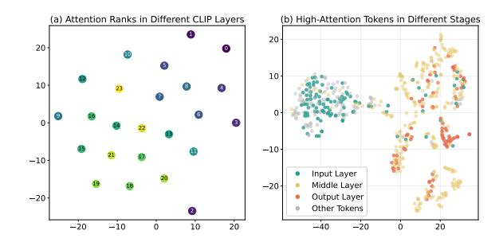

Figure 2: Hierarchical attention pattern in CLIP. (a) Attention rankings of different layers. Most layers are adjacent to their neighbouring layers. (b) Top 50% attentive tokens from different CLIP layers. The attention shifts from one cluster to another, showing a gradual and continuous transition, bridged by the middle-layer attention. Please refer to the Appendix [B](#page-11-0) for details.

<span id="page-2-1"></span>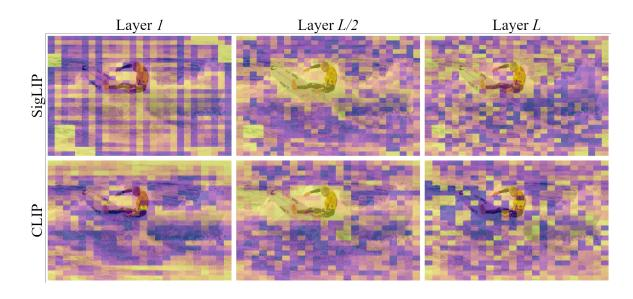

Figure 3: Attention map for different layers of SigLIP and CLIP. Patches with higher scores are in yellow. We can see that the middle layer is more object-centric.

with high feature similarity. Subsequently, several studies [\(Cao et al.,](#page-8-11) [2023;](#page-8-11) [Yang et al.,](#page-10-7) [2025b;](#page-10-7) [Huang](#page-9-10) [et al.,](#page-9-10) [2025\)](#page-9-10) have explored hybrid pruning-andmerging strategies. Most merging methods need extra training or functions, since merging is usually gradual across multiple layers and not compatible with FlashAttention [\(Dao et al.,](#page-8-12) [2022\)](#page-8-12). In this work, we show that pruning tokens purely based on the vision encoder's inherent hierarchical attention pattern can achieve outstanding results without special tokens and unnecessary complexity.

## 3 Motivated Insights

What Is the Representation Structure Inside Vision Encoders? To understand the focusing mechanism of vision encoders, we first take an insight into how attention distribution shifts across different layers. As shown in Fig. [2\(](#page-2-0)a), we project the attention scores of different layers with t-SNE [\(Maaten and Hinton,](#page-9-11) [2008\)](#page-9-11). The distribution reveals a continuous trajectory where most adjacent layers happen to be near each other, indicating the attention shifts across layers in a progressive and

<span id="page-2-2"></span>

|     | Layer CLIP-L CLIP-B SigLIP SigLIP2 |       |       |       | DeiT  | VJEPA2 |
|-----|------------------------------------|-------|-------|-------|-------|--------|
| 1   | 0.58×                              | 0.34× | 0.57× | 0.62× | 0.27× | 0.82×  |
| L/2 | 1×                                 | 1×    | 1×    | 1×    | 1×    | 1×     |
| L   | 0.80×                              | 0.79× | 0.66× | 0.64× | 0.59× | 0.26×  |

Table 1: IoU of object segmentation mask and top 10% high-attention tokens. Higher values stand for more overlap on objects in the image. '*L*' denotes the total layers in the encoder. The data is normalized for a better comparison.

ordered way. We label tokens with high attention from different layers in Fig. [2\(](#page-2-0)b). From the input to the output, the attention transfers from one cluster to another cluster, with the middle layer attention bridging both clusters. This continuous transition proves the existence of an ordered representation hierarchy in the vision encoder.

What do Middle Layers Focus on? We visualize the attention map for CLIP and SigLIP in Fig. [3.](#page-2-1) The attention distribution in the middle layers exhibits a distinct pattern: the model focuses on the main object of the image, e.g., the surf-man. To confirm this empirical observation, we compute the IoU between the object segmentation mask and top 10% high-attention tokens in Table [1](#page-2-2) using the COCO val2017 dataset [\(Lin et al.,](#page-9-12) [2014\)](#page-9-12). The results show that the high-attention tokens from the middle layer share more overlap with objects than the input or output layer, indicating that the attention from the middle layers is more correlated to objects in the image. Notably, this tendency occurs across various encoders, including world models [\(Assran et al.,](#page-8-4) [2025\)](#page-8-4), showing little correlation with model architecture or training data.

What do Deep Layers Focus on? Previous works have argued that tokens receiving high attention scores in the deep layer of ViT encode rich global information by conducting image classification tasks on these tokens [\(Darcet et al.,](#page-8-13) [2024\)](#page-8-13). In Fig. [3,](#page-2-1) we can see that in the output layer, the high-attention tokens diffuse across the whole image. Despite showing little correlation with the object, these tokens include patches of the image uniformly and can serve as an ideal indicator of the image under a limited token budget. Therefore, we can conclude that tokens receiving high attention in the output layer encode global information.

#### 4 Method

An overview of our method is depicted in Fig. 4 and pseudo-code is given in Appendix A. In the following, we first revisit the self-attention, then we present the design of HiPrune and HiPrune++.

### 4.1 Preliminaries

In a ViT-based vision encoder, an image is encoded into multiple tokens, forming a visual token matrix  $\mathbf{T}_v \in \mathbb{R}^{N \times d}$ , where N denotes the number of patches in an image and d denotes the hidden dimension of the model. In each layer, the tokens are first mapped into  $\mathbf{Q}, \mathbf{K}, \mathbf{V} \in \mathbb{R}^{N \times d}$ , and subsequently, the attention matrix  $\mathbf{A}$  is computed by

$$\mathbf{A} = \operatorname{softmax}(\frac{\mathbf{Q}\mathbf{K}^T}{\sqrt{d_k}}) \in \mathbb{R}^{H \times N \times N}.$$
 (1)

The information sharing between tokens only takes place in Eq. 1. Intuitively, the more 'important' a token is, the more its value in every token's new state, which is assigned by  $\bf A$ . Therefore, in layer l, the importance of tokens can be weighted by their attention score:

$$\mathbf{a}^{[l]} = \frac{1}{H} \sum_{h=1}^{H} \sum_{n=1}^{N} \mathbf{A}^{[l]}[h, n, :],$$
 (2)

$$= (a_1^{[l]}, a_2^{[l]}, \dots, a_N^{[l]}) \in \mathbb{R}^N.$$
 (3)

### 4.2 Retained Tokens

Anchor tokens denote tokens with the highest attention score in the middle layers of the vision encoder. As discussed in our motivated insights, the middle layers tend to focus on object features, as evidenced by higher attention scores for tokens related to the object. Based on this, anchor tokens encode rich, detailed information about the raw image and should be retained when pruning.

**Buffer tokens** indicate tokens spatially adjacent to anchor tokens. As indicated by previous studies (Yang et al., 2024), noise exists in the attention map of ViTs. In Fig. 3, despite most high-attention tokens concentrating on the surf-man, a few tokens diffuse among the image, which may mislead the anchor tokens. To mitigate the noise issue and preserve spatial relationship, we include tokens neighbouring the anchor as a buffer.

**Register tokens** receive top attention scores in the output layer of the vision encoder. In deep layers of the vision encoder, the high-attention tokens

<span id="page-3-0"></span>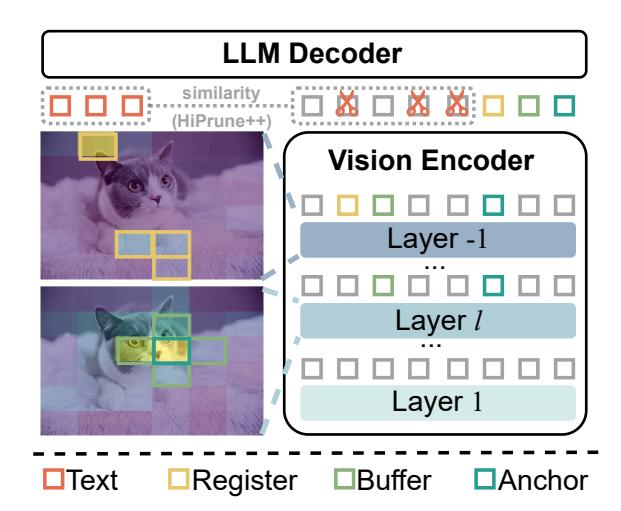

<span id="page-3-1"></span>Figure 4: **Overview of HiPrune and HiPrune++.** HiPrune selects anchor and buffer tokens based on the attention from the object layer l, and register tokens from the last encoder layer. HiPrune++ additionally includes a small set of tokens selected by cosine similarity with text tokens to enhance instruction following ability.

distribute uniformly across the image, serving as an ideal indicator of global information (Darcet et al., 2024). To enhance the model's overall understanding of an image, we supplement the token set with register tokens, which is a common practice in approaches for VLM token pruning (Zhang et al., 2025d; Arif et al., 2025).

#### <span id="page-3-2"></span>4.3 Pruning Pipeline

Given a target token budget N', we designate the object layer l and object proportion  $\alpha$ , denoting the layer from which to determine anchor and buffer tokens, and the added-up proportion of them. Taking the cross strategy as an example (4 buffers around 1 anchor), we first draw the attention score  $\mathbf{a}^{[l]}$  from the object layer l and calculate the number of anchor tokens by  $N_a = \left[\frac{\alpha \cdot N'}{5}\right]$ . The anchor token indices set  $\mathcal{I}_A$  is decided by

$$\mathcal{I}_A = \{i \mid |\{j|a_i^{[l]} > a_i^{[l]}\}| < N_a\}. \tag{4}$$

Once the anchor tokens are decided, we proceed to retain buffer tokens. It is worth noting that the buffer selection scheme can be diverse, but little difference exists between choices as long as the size is big enough, which is to be discussed in our ablation studies. Assuming an  $H_r \times W_c$  image is patchfied into  $r \times c$  tokens, the buffer token indices  $\mathcal{I}_B$  is calculated by

$$\mathcal{I}_B = \cup \{\mathcal{I}_A - 1, \mathcal{I}_A + 1, \mathcal{I}_A - c, \mathcal{I}_A + c\} \cap [0, rc - 1].$$
 (5)

The register token selection occurs after anchor tokens and buffer tokens, given the attention score  $\mathbf{a}^{[-1]}$  of the output layer of the vision encoder, the registers are selected by

$$\mathcal{I}_R = \{i \mid |\{j | a_j^{[-1]} > a_i^{[-1]}\}| < N' - |\mathcal{I}_A \cup \mathcal{I}_B|$$
(6)

$$\wedge i \notin \mathcal{I}_A \cup \mathcal{I}_B \}. \tag{7}$$

It is notable that  $\mathcal{I}_A$ ,  $\mathcal{I}_B$ , and  $\mathcal{I}_R$  are just the indices of tokens; the tokens for the LLM component are still chosen from the output layer of the vision encoder. After obtaining these token indices, HiPrune directly selects the corresponding tokens from the original token matrix  $\mathbf{T}_v \in \mathbb{R}^{N \times d}$  and discards the rest, leaving a pruned token matrix

$$\mathbf{T'}_v = \mathbf{T}_v[\mathcal{I}_A \cup \mathcal{I}_B \cup \mathcal{I}_R, :] \in \mathbb{R}^{N' \times d}.$$
 (8)

#### 4.4 Text Guidance

HiPrune is intentionally designed to be text-agnostic, meaning that the pruning process itself does not rely on any textual guidance. This design enables direct application to ViT-based vision models beyond the VLM paradigm, with more robustness and generalization. Nevertheless, HiPrune remains orthogonal to most text-aware token pruning methods and can be seamlessly combined with them. To confirm the compatibility, we introduce a text-aware extension **HiPrune++**, which performs lightweight text-relevance pruning after HiPrune.

Specifically, for each previously unselected visual token  $\mathbf{t}_v^i \in \mathbb{R}^d, i \notin \mathcal{I}_A \cup \mathcal{I}_B \cup \mathcal{I}_R$ , we compute its cosine similarity  $\mathbf{r}^i$  with the averaged text embedding  $\mathbf{t}_t \in \mathbb{R}^d$  by

$$\mathbf{r}^{i} = \frac{\mathbf{t}_{v}^{i} \cdot \mathbf{t}_{t}}{\|\mathbf{t}_{v}^{i}\| \cdot \|\mathbf{t}_{t}\|}.$$
 (9)

Following the common practice (Zhang et al., 2025e), for vision encoders with a paired text encoder (Radford et al., 2021), we obtain  $\mathbf{t}_t$  with the corresponding encoder. For those without a paired text encoder (Bai et al., 2025), we use the average of all text embeddings. We then retain  $[\beta \cdot N]$  visual tokens by the magnitude of  $\mathbf{r}$ , where  $\beta$  is the proportion of visual tokens selected by text-relevance.

#### 5 Experiments

### 5.1 Experiment Settings

Following popular works (Zhang et al., 2025d; Chen et al., 2024a), we conduct evaluations against other token pruning methods on four widely used VLMs, i.e., LLaVA-1.5-7B (Liu et al., 2024a), LLaVA-NeXT-7B (Liu et al., 2024b), Qwen2.5-VL-3B (Bai et al., 2025), and Video-LLaVA (Lin et al., 2023). Model descriptions, benchmark datasets, and comparison details are in Appendix C.

Implementation Details. We follow the default settings for each compared method as specified in their code repositories. In HiPrune, for both LLaVA-1.5-7B and LLaVA-NeXT-7B, we set l=9 and  $\alpha=0.1$ . For Qwen, we set l=16 and  $\alpha=0.1$  since it has more layers in the vision encoder. We set  $\beta=0.1$  for all the models when evaluating Hiprune++. Most of the evaluations are performed with the LMMs-Eval toolkit (Zhang et al., 2024b), and FLOPs are computed with the calflops package. All the experiments are conducted on one NVIDIA A100-PCIE (40G) unless otherwise specified.

### 5.2 Accuracy Results

Results on LLaVA-1.5. The accuracy results are shown in Table 2 with 192, 128, and 64 tokens retained as the common practice. Across all the settings, HiPrune consistently outperforms existing methods, demonstrating superior performance. Specifically, with 1/3 tokens retained, HiPrune and HiPrune++ preserve 99.3% and 99.9% of the original model's average performance, almost matching the vanilla model. We present Pareto analyses on the token budget against hallucination and accuracy performance in Fig. 5. Interestingly, the superiority of HiPrune++ against HiPrune is more significant with fewer tokens, highlighting the necessity of text guidance under a lower budget.

Results on LLaVA-NeXT. In Table 3 we present evaluations on LLaVA-NeXT-7B (Liu et al., 2024b), a high-resolution VLM with more visual tokens. When retaining only 2/9 visual tokens, HiPrune++ preserves 99.7% accuracy, while HiPrune maintains 99.4%, which are quite close to the original model. With 11.1% and 5.6% of tokens retained, HiPrune++ still preserves 98.4% and 94.4% performance, respectively, demonstrating robustness on high-resolution models that handle more images and visual tokens.

**Results on Qwen.** To verify the versatility of HiPrune, we further insert it into Qwen2.5-VL (Bai et al., 2025) in Table 4. Unlike CLIP, some approaches relying on the text encoder or special tokens may have limited performance or cannot

<span id="page-5-0"></span>

| Method                 | Venue                      | GQA  | MMB  | MMB <sup>CN</sup> | MME      | POPE      | SQA <sup>IMG</sup> | VQA <sup>V2</sup> | VQA <sup>Text</sup> | VizWiz | Average      |
|------------------------|----------------------------|------|------|-------------------|----------|-----------|--------------------|-------------------|---------------------|--------|--------------|
|                        |                            |      |      | Vanilla,          | 576 Toke | ens (1009 | %)                 |                   |                     |        |              |
| LLaVA-1.5-7B           | CVPR'24                    | 61.9 | 64.7 | 58.1              | 1862     | 85.9      | 69.5               | 78.5              | 58.2                | 50.0   | 100.0%       |
|                        | Retain 192 Tokens (33.3 %) |      |      |                   |          |           |                    |                   |                     |        |              |
| ToMe                   | ICLR'23                    | 54.3 | 60.5 | -                 | 1563     | 72.4      | 65.2               | 68.0              | 52.1                | -      | 88.5%        |
| FastV                  | ECCV'24                    | 52.7 | 61.2 | 57.0              | 1612     | 64.8      | 67.3               | 67.1              | 52.5                | 50.8   | 90.4%        |
| $HiRED^\dagger$        | AAAI'25                    | 58.8 | 62.6 | 54.5              | 1742     | 83.0      | 67.9               | 75.0              | -                   | 51.1   | 96.4%        |
| $TRIM^\dagger$         | COLING'25                  | 59.9 | 64.1 | 53.6              | 1765     | 87.1      | 67.8               | 76.2              | 54.9                | 50.4   | 97.1%        |
| PyramidDrop            | CVPR'25                    | 57.3 | 63.3 | 56.8              | 1797     | 82.3      | 69.2               | 75.1              | 56.5                | 51.1   | 97.2%        |
| VisionZip              | CVPR'25                    | 59.3 | 63.0 | -                 | 1783     | 85.3      | 68.9               | 76.8              | 57.3                | -      | 97.7%        |
| SparseVLM <sup>†</sup> | ICML'25                    | 59.5 | 64.1 | 58.0              | 1780     | 85.4      | 68.8               | 77.0              | 57.7                | 50.6   | 98.6%        |
| HiPrune                | Ours                       | 59.2 | 62.8 | 57.0              | 1814     | 86.1      | 68.9               | 76.7              | 57.6                | 54.5   | <u>99.3%</u> |
| HiPrune++              | Ours                       | 60.3 | 63.5 | 57.5              | 1818     | 86.9      | 68.8               | 77.2              | 57.5                | 54.7   | 99.9%        |
|                        |                            |      |      | Retain I          | 28 Toker | ns (22.29 | %)                 |                   |                     |        |              |
| ToMe                   | ICLR'23                    | 52.4 | 53.3 | 48.8              | 1343     | 62.8      | 59.6               | 63.0              | 49.1                | 50.2   | 83.0%        |
| FastV                  | ECCV'24                    | 49.6 | 56.1 | 56.4              | 1490     | 59.6      | 60.2               | 61.8              | 50.6                | 51.3   | 85.4%        |
| $HiRED^\dagger$        | AAAI'25                    | 57.1 | 61.7 | 53.9              | 1714     | 79.8      | 68.1               | 73.5              | -                   | 51.4   | 95.0%        |
| $TRIM^\dagger$         | COLING'25                  | 58.9 | 63.3 | 51.5              | 1732     | 87.2      | 68.4               | 74.8              | 52.7                | 50.6   | 95.7%        |
| PyramidDrop            | CVPR'25                    | 57.1 | 61.6 | 56.6              | 1761     | 82.3      | 68.4               | 72.9              | 56.6                | 51.0   | 96.2%        |
| VisionZip              | CVPR'25                    | 57.6 | 62.0 | -                 | 1762     | 83.2      | 68.9               | 75.6              | 56.8                | -      | 96.2%        |
| SparseVLM <sup>†</sup> | ICML'25                    | 53.8 | 64.4 | 58.1              | 1761     | 85.0      | 68.5               | 76.3              | 56.7                | 50.2   | 97.0%        |
| HiPrune                | Ours                       | 57.3 | 62.2 | 56.4              | 1782     | 82.8      | 68.3               | 74.9              | 56.6                | 54.3   | <u>97.5%</u> |
| HiPrune++              | Ours                       | 59.0 | 62.3 | 57.0              | 1780     | 86.4      | 68.5               | 76.2              | 56.0                | 54.6   | 98.8%        |
|                        |                            |      |      |                   |          | ıs (11.1% | 1                  |                   |                     |        |              |
| ToMe                   | ICLR'23                    | 48.6 | 43.7 | 38.9              | 1138     | 52.5      | 50.0               | 57.1              | 45.3                | 50.2   | 73.1%        |
| FastV                  | ECCV'24                    | 46.1 | 48.0 | 52.7              | 1256     | 48.0      | 51.1               | 55.0              | 47.8                | 50.8   | 76.7%        |
| HiRED <sup>†</sup>     | AAAI'25                    | 54.6 | 60.2 | 51.3              | 1595     | 73.7      | 68.2               | 69.8              | -                   | 53.3   | 91.8%        |
| $TRIM^\dagger$         | COLING'25                  | 56.9 | 61.5 | 44.9              | 1603     | 86.7      | 69.0               | 71.9              | 50.0                | 50.6   | 92.1%        |
| PyramidDrop            | CVPR'25                    | 47.5 | 58.8 | 50.5              | 1561     | 55.9      | 69.0               | 69.2              | 50.6                | 50.7   | 86.6%        |
| VisionZip              | CVPR'25                    | 55.1 | 60.1 | -                 | 1690     | 77.0      | 69.0               | 72.4              | 55.5                | -      | <u>92.7%</u> |
| SparseVLM <sup>†</sup> | ICML'25                    | 53.7 | 60.1 | 52.5              | 1559     | 77.5      | 69.7               | 70.2              | 53.4                | 50.4   | 91.8%        |
| HiPrune                | Ours                       | 53.6 | 59.5 | 53.4              | 1646     | 73.0      | 68.9               | 69.2              | 54.9                | 54.4   | 92.7%        |
| HiPrune++              | Ours                       | 56.4 | 60.3 | 53.8              | 1767     | 84.3      | 68.9               | 72.8              | 54.5                | 54.7   | 96.1%        |

Table 2: **Results on LLaVA-1.5-7B.** '†' denotes our reproduced results, others are from (Zhang et al., 2025a).

be implemented. When applied to Qwen, HiPrune achieves SOTA performance across the three settings. At an 11.1% retention rate, HiPrune preserves 93.0% of the model's original performance, outperforming FastV and VisionZip by 6.6% and 1.5%, respectively. The results on the Qwen series further support our key insights on vision encoders, regardless of their pre-training data or architecture.

**Results on Video-LLaVA.** Video-LLaVA results are in Appendix D.1 due to the space limitation.

### 5.3 Efficiency Results

**Latency and Throughput.** We analyze the decoding latency and throughput of HiPrune on LLaVA with a simple example of around 600 tokens in Table 5. Compared with SparseVLM using 192 visual tokens, HiPrune achieves  $1.32 \times$  faster during LLM prefill and gains a  $1.20 \times$  speedup in generation, demonstrating its superior efficiency. When reducing the visual token number to 64, the FLOPs of a single forward pass are reduced by 78.3%, resulting in a  $2.47 \times$  faster prefill.

<span id="page-5-1"></span>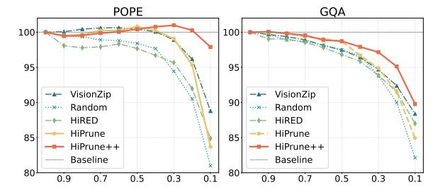

Figure 5: **Pareto analyses.** The horizontal axis is the token retention ratio, while the vertical axis is the percentage normalized accuracy results on LLaVA-1.5-7B.

Overhead Analyses. In Fig. 6 we plot the time consumption of each component in HiPrune and HiPrune++ during the prefill phase. Both methods operate before the LLM decoder and thus are compatible with FlashAttention(Dao et al., 2022). The sort introduced by HiPrune consumes only 1% of the total time, which is negligible compared to the largely reduced prefill latency. With a text encoder, HiPrune++ still maintains a total overhead of under 10%, which is acceptable in deployment.

<span id="page-6-0"></span>

| Method    | MMB  | MMB <sup>CN</sup> | POPE     | SQA <sup>IMG</sup> | VizWiz | Avg   |
|-----------|------|-------------------|----------|--------------------|--------|-------|
|           | V    | anilla, 288       | 0 Token. | s (100%)           |        |       |
| LLaVA     | 67.4 | 60.6              | 86.5     | 70.1               | 57.6   | 100%  |
|           | F    | Retain 640        | Tokens   | (22.2%)            |        |       |
| HiRED     | 66.0 | 57.0              | 85.0     | 68.3               | 59.1   | 98.1% |
| TRIM      | 66.8 | 55.8              | 86.9     | 66.9               | 54.8   | 96.0% |
| VisionZip | 66.3 | 58.1              | 86.3     | 68.1               | 57.1   | 98.1% |
| DivPrune  | 65.0 | 56.4              | 85.4     | 67.9               | 58.6   | 97.4% |
| VisPruner | 65.2 | 56.0              | 85.7     | 67.8               | 60.9   | 98.1% |
| HiPrune   | 67.0 | 59.3              | 85.3     | 68.0               | 59.9   | 99.4% |
| HiPrune++ | 67.2 | 59.1              | 87.1     | 67.8               | 59.9   | 99.7% |
|           | F    | Retain 320        | Tokens   | (11.1%)            |        |       |
| HiRED     | 64.2 | 56.4              | 83.3     | 66.8               | 58.3   | 96.2% |
| TRIM      | 63.5 | 51.0              | 86.5     | 66.2               | 53.5   | 93.1% |
| VisionZip | 63.1 | 55.6              | 82.1     | 67.3               | 56.2   | 94.8% |
| DivPrune  | 63.9 | 55.2              | 83.0     | 67.7               | 57.4   | 95.6% |
| VisPruner | 63.8 | 55.4              | 80.8     | 68.3               | 60.4   | 96.4% |
| HiPrune   | 65.3 | 57.0              | 78.9     | 67.3               | 59.9   | 96.4% |
| HiPrune++ | 66.2 | 57.4              | 85.6     | 67.2               | 60.1   | 98.4% |
|           |      | Retain 160        | Tokens   | (5.6%)             |        |       |
| TRIM      | 61.6 | 45.2              | 84.8     | 65.5               | 52.9   | 89.9% |
| VisionZip | 60.1 | 50.4              | 74.8     | 68.3               | 55.5   | 90.5% |
| DivPrune  | 62.5 | 52.3              | 78.4     | 68.3               | 57.5   | 93.4% |
| VisPruner | 59.2 | 51.3              | 73.5     | 68.9               | 60.1   | 92.0% |
| HiPrune   | 59.8 | 50.7              | 67.7     | 68.7               | 57.2   | 89.6% |
| HiPrune++ | 61.5 | 50.6              | 85.0     | 68.0               | 58.6   | 94.4% |

Table 3: **Results on LLaVA-NeXT-7B.** The full table (Table 9) for more comparisons is in Appendix D.1.

<span id="page-6-3"></span>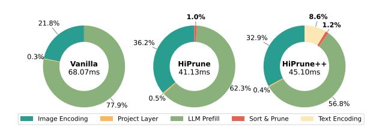

Figure 6: **Component overhead analyses.** The numbers inside each circle denote the wall-clock prefill latency for LLaVA-1.5-7B measured on RTX 5090. The budget for HiPrune and HiPrune++ is 192.

#### 5.4 Ablation Studies

We provide ablation studies on key designs in this subsection. Extended studies on hyperparameters and buffer selections are provided in Appendix D.2.

**Attention Pattern.** Many methods prune tokens guided by the CLS token's attention to other tokens; however, not every model has this token, making these methods model-specific. We compare computing attention score  $\mathbf{a}^{[l]}$  by Eq. 3 and CLS in Table 6(a). For our method, the global attention achieves slightly better results and features much stronger versatility since it is model-agnostic.

**Token Types.** We examine the retained anchor, buffer, and register tokens in HiPrune. As Table 6(b) shows, removing either type degrades the model's performance. Specifically, removing regis-

<span id="page-6-1"></span>

| Method              | MMB  | MMB <sup>CN</sup> | POPE    | $\mathbf{SQA^{IMG}}$ | VizWiz | Avg   |  |  |  |
|---------------------|------|-------------------|---------|----------------------|--------|-------|--|--|--|
|                     |      | Vanilla,          | 100% Ta | okens                |        |       |  |  |  |
| Qwen                | 77.3 | 73.0              | 87.0    | 80.4                 | 68.3   | 100 % |  |  |  |
|                     |      | Retain 3          | 3.3% To | kens                 |        |       |  |  |  |
| FastV               | 74.4 | 70.6              | 85.0    | 79.3                 | 66.9   | 97.4% |  |  |  |
| VisionZip           | 74.9 | 69.8              | 85.4    | 80.1                 | 67.1   | 97.7% |  |  |  |
| HiPrune             | 75.9 | 71.4              | 85.9    | 79.4                 | 68.4   | 98.7% |  |  |  |
| HiPrune++           | 76.0 | 71.1              | 85.9    | 79.9                 | 68.0   | 98.7% |  |  |  |
| Retain 22.2% Tokens |      |                   |         |                      |        |       |  |  |  |
| FastV               | 72.4 | 69.2              | 82.7    | 79.6                 | 66.2   | 95.9% |  |  |  |
| VisionZip           | 73.5 | 67.4              | 84.6    | 80.0                 | 66.3   | 96.2% |  |  |  |
| HiPrune             | 73.7 | 69.1              | 84.9    | 80.2                 | 67.1   | 97.1% |  |  |  |
| HiPrune++           | 74.2 | 69.4              | 84.4    | 80.2                 | 66.7   | 97.1% |  |  |  |
|                     |      | Retain 1          | 1.1% To | kens                 |        |       |  |  |  |
| FastV               | 56.2 | 60.7              | 73.3    | 79.3                 | 63.8   | 86.4% |  |  |  |
| VisionZip           | 67.8 | 63.3              | 80.2    | 79.5                 | 62.8   | 91.5% |  |  |  |
| HiPrune             | 69.6 | 65.4              | 80.4    | 79.1                 | 64.6   | 93.0% |  |  |  |
| HiPrune++           | 70.5 | 64.7              | 79.9    | 79.4                 | 64.5   | 93.0% |  |  |  |

Table 4: **Results on Qwen2.5-VL-3B-Instruct.** All the results are reproduced by us.

<span id="page-6-2"></span>

| Method    | $\begin{array}{ccc} FLOPs & Prefill \\ (T) \downarrow & (ms) \downarrow \end{array}$ |                    | $\begin{array}{c} \textbf{Decode} \\ (\textbf{ms}) \downarrow \end{array}$ | Throughput (tokens/s)↑ | VRAM<br>(GB)↓ |
|-----------|--------------------------------------------------------------------------------------|--------------------|----------------------------------------------------------------------------|------------------------|---------------|
|           | I                                                                                    | /anilla, 576       | Tokens (100                                                                | 1%)                    |               |
| LLaVA-7B  | 8.63                                                                                 | $54.31_{\pm 0.37}$ | $21.85_{\pm0.26}$                                                          | $44.42_{\pm0.37}$      | 14.52         |
|           | 1                                                                                    | Retain 192 T       | Tokens (33.3                                                               | %)                     |               |
| HiPrune   | 3.56                                                                                 | $28.56_{\pm 0.30}$ | $21.65_{\pm 0.08}$                                                         | $45.65_{\pm 0.07}$     | 14.52         |
| HiPrune++ | 3.57                                                                                 | $28.89_{\pm 0.11}$ | $21.73_{\pm 0.15}$                                                         | $45.23_{\pm0.08}$      | 15.38         |
| Random    | 3.56                                                                                 | $28.83_{\pm 0.14}$ | $20.97 {\scriptstyle \pm 0.07}$                                            | $47.17_{\pm 0.05}$     | 14.52         |
|           | 1                                                                                    | Retain 128 T       | Tokens (22.2                                                               | %)                     |               |
| HiPrune   | 2.71                                                                                 | $25.59_{\pm 0.17}$ | $21.53{\scriptstyle \pm 0.08}$                                             | $45.59_{\pm 0.07}$     | 14.35         |
| HiPrune++ | 2.73                                                                                 | $25.76_{\pm 0.16}$ | $21.59_{\pm0.10}$                                                          | $45.47_{\pm 0.07}$     | 15.38         |
| Random    | 2.71                                                                                 | $25.52_{\pm 0.14}$ | $20.59_{\pm0.15}$                                                          | $47.59_{\pm0.20}$      | 14.07         |
|           |                                                                                      | Retain 64 Te       | okens (11.19                                                               | %)                     |               |
| HiPrune   | 1.87                                                                                 | $21.96_{\pm 0.10}$ | $21.33_{\pm0.10}$                                                          | $45.93_{\pm 0.07}$     | 14.35         |
| HiPrune++ | 1.88                                                                                 | $22.03_{\pm 0.11}$ | $21.41_{\pm 0.12}$                                                         | $45.80_{\pm0.10}$      | 15.38         |
| Random    | 1.87                                                                                 | $21.81_{\pm 0.15}$ | $21.00_{\pm0.39}$                                                          | $46.80_{\pm0.64}$      | 14.02         |

Table 5: **Wall-clock latency and throughput.** 'Random' randomly prunes tokens and adds no computational overhead, serving as a reference.

ter tokens causes the most significant degradation, highlighting the critical role of global information, which is in line with previous studies (Yang et al., 2025b; Zhang et al., 2025d).

**Buffer Selection Scheme.** In Table 6(c) we present different buffer token selection schemes. A square or cross can both achieve similar results; however, when the size of the buffer is too small or missing (row 2 in (b)), the results begin to drop. The buffer tokens are introduced to resist the noise in the attention map. When the window is too small, the effects of the buffer become limited.

**Object Layer Setting.** We adopt a dispersion-based searching strategy to decide the Object Layer l, where the attention score for object and buffer tokens is extracted. Intuitively, tokens on the same

<span id="page-7-2"></span>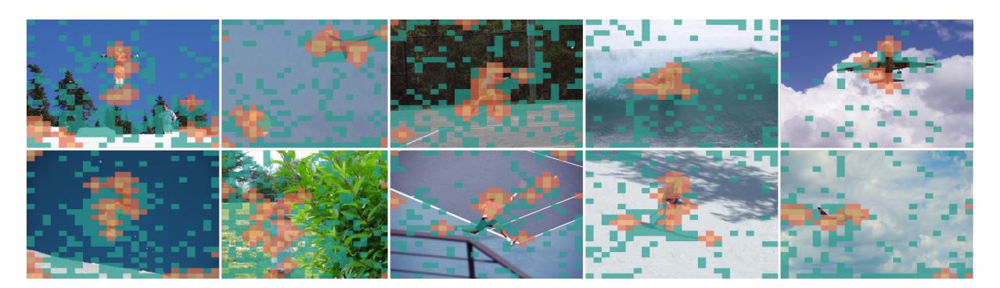

Figure 7: **Visualization on tokens retained by HiPrune.** Anchor tokens are in **yellow**, buffer tokens in **orange**, and register tokens in **teal**. Anchor and buffer tokens focus on the sports player, the aircraft, and the fire extinguisher. The images are slightly resized for better visualization and are randomly chosen from the COCO val2017 dataset.

<span id="page-7-0"></span>

| Setting        | GQA  | MME       | POPE      | VizWiz | Avg    |  |  |  |
|----------------|------|-----------|-----------|--------|--------|--|--|--|
|                | (a)  | Attention | n Pattern |        |        |  |  |  |
| CLS Token      | 59.4 | 1772      | 85.4      | 55.5   | 99.8%  |  |  |  |
| Global*        | 59.2 | 1814      | 86.1      | 54.5   | 100.0% |  |  |  |
| (b) Token Type |      |           |           |        |        |  |  |  |
| w/o Register   | 58.4 | 1693      | 85.5      | 54.7   | 97.9%  |  |  |  |
| w/o Buffer     | 59.1 | 1807      | 85.9      | 54.2   | 99.7%  |  |  |  |
| w/o Buf+Anc    | 59.1 | 1805      | 85.9      | 54.4   | 99.7%  |  |  |  |
| Full*          | 59.2 | 1814      | 86.1      | 54.5   | 100.0% |  |  |  |
|                | (c)  | Selection | ı Scheme  |        |        |  |  |  |
| Square(8)      | 59.2 | 1817      | 86.0      | 54.4   | 100.0% |  |  |  |
| Row(2)         | 59.2 | 1795      | 85.9      | 54.3   | 99.6%  |  |  |  |
| Cross(4)*      | 59.2 | 1814      | 86.1      | 54.5   | 100.0% |  |  |  |

Table 6: **Ablation study on HiPrune.** Each set is evaluated on LLaVA-1.5-7B with 192 tokens and  $\alpha=0.1$ . The number in row (c) denotes the buffer token number. '\*' denotes the default setting.

object should feature high similarity. We plot the average pairwise distance of high-attention tokens and model performance with different l in Fig. 8. For LLaVA, model performance achieves an optimal when setting l as 9. We assume that at this layer, tokens with similar semantic information are close in the embedding space, and at a critical point from object-centric to global information.

#### 5.5 Visualizations

**Selected Tokens.** In Fig. 7 we present a visualization of retained tokens. Anchor tokens and buffer tokens are mainly distributed on the main objects of the image, such as the body of the player, the aircraft in the sky, etc. Preserving these tokens can bring more information about image details and alleviate hallucination. The register tokens diffuse among the whole image uniformly. Despite showing little correlation with image segmentation, they carry indispensable global information. The reason has been discussed in our Motivated

<span id="page-7-1"></span>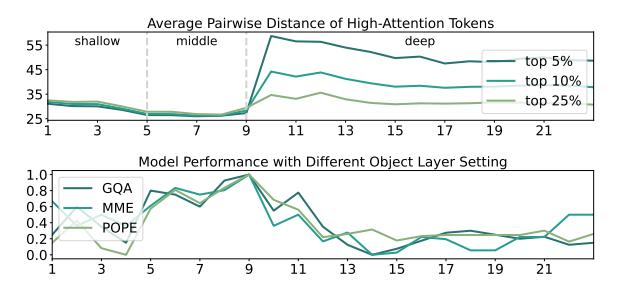

Figure 8: Average pairwise distance of high-attention tokens and model performance with different Object Layer. Based on this trend, we divide CLIP into three phases and set the Object Layer at the critical point.

Insights. The combination of these tokens strikes a balance between overall and detail information. More visualizations are in Appendix F.

### 6 Conclusion

In this paper, we investigate the layer-wise attention patterns of vision encoders and reveal that middle layers predominantly capture object-centric features, while deeper layers emphasize global representations. Motivated by this, we propose HiPrune, a model-agnostic and training-free token pruning method that leverages the hierarchical attention structure within the vision encoder. HiPrune mainly preserves anchor, buffer, and register tokens, and an optional set of visual tokens selected by similarity with text embeddings. Extensive experiments across diverse VLMs demonstrate the robustness and generality of HiPrune, which achieves state-of-the-art results while significantly reducing computational overhead. We believe our findings offer valuable perspectives on the internal representation of vision encoders, and HiPrune will facilitate more efficient deployment of VLMs and inspire future research in this direction.

## Acknowledgement

This work is supported in part by the National Natural Science Foundation of China under grants U24A20328, 62301189, 62476071, 62576122, 62536003, 62521006, Guangdong Basic and Applied Basic Research Foundation under grants 2025A1515011732, 2026A1515011139.

## Limitations

HiPrune is most readily applicable to open-source models where architectural modifications are feasible, and cannot be incorporated into commercial models like Gemini and ChatGPT due to their black-box nature. Additionally, HiPrune relies on the multi-head self-attention in the transformer architecture and is not directly transferable to models using a CNN encoder. Besides, we only provide an explicit and simple way to couple HiPrune and text guidance. Despite the outstanding results, future work may focus on taking a better approach to couple text guidance and HiPrune.

## References

- <span id="page-8-3"></span>Saeed Ranjbar Alvar, Gursimran Singh, Mohammad Akbari, and Yong Zhang. 2025. Divprune: Diversitybased visual token pruning for large multimodal models. In *CVPR*, pages 9392–9401.
- <span id="page-8-9"></span>Kazi Hasan Ibn Arif, JinYi Yoon, Dimitrios S Nikolopoulos, Hans Vandierendonck, Deepu John, and Bo Ji. 2025. Hired: Attention-guided token dropping for efficient inference of high-resolution visionlanguage models. In *AAAI*, pages 1773–1781.
- <span id="page-8-4"></span>Mido Assran, Adrien Bardes, David Fan, Quentin Garrido, Russell Howes, Matthew Muckley, Ammar Rizvi, Claire Roberts, Koustuv Sinha, Artem Zholus, and 1 others. 2025. V-jepa 2: Self-supervised video models enable understanding, prediction and planning. *arXiv preprint arXiv:2506.09985*.
- <span id="page-8-5"></span>Jinze Bai, Shuai Bai, Shusheng Yang, Shijie Wang, Sinan Tan, Peng Wang, Junyang Lin, Chang Zhou, and Jingren Zhou. 2023. Qwen-vl: A frontier large vision-language model with versatile abilities. *arXiv preprint arXiv:2308.12966*, 1(2):3.
- <span id="page-8-1"></span>Shuai Bai, Keqin Chen, Xuejing Liu, Jialin Wang, Wenbin Ge, Sibo Song, Kai Dang, Peng Wang, Shijie Wang, Jun Tang, and 1 others. 2025. Qwen2. 5-vl technical report. *arXiv preprint arXiv:2502.13923*.
- <span id="page-8-10"></span>Daniel Bolya, Cheng-Yang Fu, Xiaoliang Dai, Peizhao Zhang, Christoph Feichtenhofer, and Judy Hoffman. 2023. Token merging: Your vit but faster. In *ICLR*.

- <span id="page-8-11"></span>Qingqing Cao, Bhargavi Paranjape, and Hannaneh Hajishirzi. 2023. [PuMer: Pruning and merging tokens](https://doi.org/10.18653/v1/2023.acl-long.721) [for efficient vision language models.](https://doi.org/10.18653/v1/2023.acl-long.721) In *Proceedings of the 61st Annual Meeting of the Association for Computational Linguistics (Volume 1: Long Papers)*, pages 12890–12903, Toronto, Canada. Association for Computational Linguistics.
- <span id="page-8-2"></span>Liang Chen, Haozhe Zhao, Tianyu Liu, Shuai Bai, Junyang Lin, Chang Zhou, and Baobao Chang. 2024a. An image is worth 1/2 tokens after layer 2: Plug-andplay inference acceleration for large vision-language models. In *ECCV*, pages 19–35. Springer.
- <span id="page-8-6"></span>Zhe Chen, Weiyun Wang, Hao Tian, Shenglong Ye, Zhangwei Gao, Erfei Cui, Wenwen Tong, Kongzhi Hu, Jiapeng Luo, Zheng Ma, and 1 others. 2024b. How far are we to gpt-4v? closing the gap to commercial multimodal models with open-source suites. In *CVPR*.
- <span id="page-8-12"></span>Tri Dao, Dan Fu, Stefano Ermon, Atri Rudra, and Christopher Ré. 2022. Flashattention: Fast and memory-efficient exact attention with io-awareness. *NeruIPS*, pages 16344–16359.
- <span id="page-8-13"></span>Timothée Darcet, Maxime Oquab, Julien Mairal, and Piotr Bojanowski. 2024. Vision transformers need registers. In *ICLR*.
- <span id="page-8-0"></span>Alexey Dosovitskiy, Lucas Beyer, Alexander Kolesnikov, Dirk Weissenborn, Xiaohua Zhai, Thomas Unterthiner, Mostafa Dehghani, Matthias Minderer, Georg Heigold, Sylvain Gelly, and 1 others. 2021. An image is worth 16x16 words: Transformers for image recognition at scale. In *ICLR*.
- <span id="page-8-15"></span>Chaoyou Fu, Peixian Chen, Yunhang Shen, Yulei Qin, Mengdan Zhang, Xu Lin, Jinrui Yang, Xiawu Zheng, Ke Li, Xing Sun, Yunsheng Wu, and Rongrong Ji. 2024. [Mme: A comprehensive evaluation benchmark](https://arxiv.org/abs/2306.13394) [for multimodal large language models.](https://arxiv.org/abs/2306.13394) *Preprint*, arXiv:2306.13394.
- <span id="page-8-14"></span>Yash Goyal, Tejas Khot, Douglas Summers-Stay, Dhruv Batra, and Devi Parikh. 2017. Making the V in VQA matter: Elevating the role of image understanding in Visual Question Answering. In *CVPR*.
- <span id="page-8-7"></span>Zonghao Guo, Ruyi Xu, Yuan Yao, Junbo Cui, Zanlin Ni, Chunjiang Ge, Tat-Seng Chua, Zhiyuan Liu, and Gao Huang. 2024. Llava-uhd: an lmm perceiving any aspect ratio and high-resolution images. In *ECCV*, pages 390–406. Springer.
- <span id="page-8-16"></span>Danna Gurari, Qing Li, Abigale J Stangl, Anhong Guo, Chi Lin, Kristen Grauman, Jiebo Luo, and Jeffrey P Bigham. 2018. Vizwiz grand challenge: Answering visual questions from blind people. In *CVPR*, pages 3608–3617.
- <span id="page-8-8"></span>Anwen Hu, Haiyang Xu, Liang Zhang, Jiabo Ye, Ming Yan, Ji Zhang, Qin Jin, Fei Huang, and Jingren Zhou. 2025. [mPLUG-DocOwl2: High-resolution](https://doi.org/10.18653/v1/2025.acl-long.291)

- [compressing for OCR-free multi-page document un](https://doi.org/10.18653/v1/2025.acl-long.291)[derstanding.](https://doi.org/10.18653/v1/2025.acl-long.291) In *Proceedings of the 63rd Annual Meeting of the Association for Computational Linguistics (Volume 1: Long Papers)*, pages 5817–5834, Vienna, Austria. Association for Computational Linguistics.
- <span id="page-9-10"></span>Xiaohu Huang, Hao Zhou, and Kai Han. 2025. [PruneVid: Visual token pruning for efficient video](https://doi.org/10.18653/v1/2025.findings-acl.1024) [large language models.](https://doi.org/10.18653/v1/2025.findings-acl.1024) In *Findings of the Association for Computational Linguistics: ACL 2025*, pages 19959–19973, Vienna, Austria. Association for Computational Linguistics.
- <span id="page-9-15"></span>Drew A Hudson and Christopher D Manning. 2019. Gqa: A new dataset for real-world visual reasoning and compositional question answering. In *CVPR*, pages 6700–6709.
- <span id="page-9-2"></span>Aaron Hurst, Adam Lerer, Adam P Goucher, Adam Perelman, Aditya Ramesh, Aidan Clark, AJ Ostrow, Akila Welihinda, Alan Hayes, Alec Radford, and 1 others. 2024. Gpt-4o system card. *arXiv preprint arXiv:2410.21276*.
- <span id="page-9-20"></span>Kunchang Li, Yali Wang, Yinan He, Yizhuo Li, Yi Wang, Yi Liu, Zun Wang, Jilan Xu, Guo Chen, Ping Luo, and 1 others. 2024. Mvbench: A comprehensive multi-modal video understanding benchmark. In *CVPR*, pages 22195–22206.
- <span id="page-9-18"></span>Yifan Li, Yifan Du, Kun Zhou, Jinpeng Wang, Wayne Xin Zhao, and Ji-Rong Wen. 2023. Evaluating object hallucination in large vision-language models. *arXiv preprint arXiv:2305.10355*.
- <span id="page-9-3"></span>Zijing Liang, Yanjie Xu, Yifan Hong, Penghui Shang, Qi Wang, Qiang Fu, and Ke Liu. 2024. A survey of multimodel large language models. In *Proceedings of the 3rd International Conference on Computer, Artificial Intelligence and Control Engineering*, pages 405–409.
- <span id="page-9-13"></span>Bin Lin, Yang Ye, Bin Zhu, Jiaxi Cui, Munan Ning, Peng Jin, and Li Yuan. 2023. Video-llava: Learning united visual representation by alignment before projection. *arXiv preprint arXiv:2311.10122*.
- <span id="page-9-12"></span>Tsung-Yi Lin, Michael Maire, Serge Belongie, James Hays, Pietro Perona, Deva Ramanan, Piotr Dollár, and C Lawrence Zitnick. 2014. Microsoft coco: Common objects in context. In *ECCV*, pages 740– 755. Springer.
- <span id="page-9-6"></span>Haotian Liu, Chunyuan Li, Yuheng Li, and Yong Jae Lee. 2024a. Improved baselines with visual instruction tuning. In *CVPR*, pages 26296–26306.
- <span id="page-9-8"></span>Haotian Liu, Chunyuan Li, Yuheng Li, Bo Li, Yuanhan Zhang, Sheng Shen, and Yong Jae Lee. 2024b. [Llava](https://llava-vl.github.io/blog/2024-01-30-llava-next/)[next: Improved reasoning, ocr, and world knowledge.](https://llava-vl.github.io/blog/2024-01-30-llava-next/)
- <span id="page-9-5"></span>Haotian Liu, Chunyuan Li, Qingyang Wu, and Yong Jae Lee. 2023. Visual instruction tuning. In *NeurIPS*, pages 34892–34916.

- <span id="page-9-19"></span>Yuan Liu, Haodong Duan, Yuanhan Zhang, Bo Li, Songyang Zhang, Wangbo Zhao, Yike Yuan, Jiaqi Wang, Conghui He, Ziwei Liu, and 1 others. 2024c. Mmbench: Is your multi-modal model an all-around player? In *ECCV*, pages 216–233. Springer.
- <span id="page-9-16"></span>Pan Lu, Swaroop Mishra, Tony Xia, Liang Qiu, Kai-Wei Chang, Song-Chun Zhu, Oyvind Tafjord, Peter Clark, and Ashwin Kalyan. 2022. Learn to explain: Multimodal reasoning via thought chains for science question answering. In *NeurIPS*.
- <span id="page-9-11"></span>Laurens van der Maaten and Geoffrey Hinton. 2008. Visualizing data using t-sne. *Journal of machine learning research*, 9(Nov):2579–2605.
- <span id="page-9-21"></span>Minesh Mathew, Dimosthenis Karatzas, and CV Jawahar. 2021. Docvqa: A dataset for vqa on document images. In *WACV*, pages 2200–2209.
- <span id="page-9-14"></span>Adam Paszke, Sam Gross, Francisco Massa, Adam Lerer, James Bradbury, Gregory Chanan, Trevor Killeen, Zeming Lin, Natalia Gimelshein, Luca Antiga, and 1 others. 2019. Pytorch: An imperative style, high-performance deep learning library. *NeurIPS*, 32.
- <span id="page-9-4"></span>Alec Radford, Jong Wook Kim, Chris Hallacy, Aditya Ramesh, Gabriel Goh, Sandhini Agarwal, Girish Sastry, Amanda Askell, Pamela Mishkin, Jack Clark, and 1 others. 2021. Learning transferable visual models from natural language supervision. In *ICML*, pages 8748–8763. PMLR.
- <span id="page-9-17"></span>Amanpreet Singh, Vivek Natarajan, Meet Shah, Yu Jiang, Xinlei Chen, Dhruv Batra, Devi Parikh, and Marcus Rohrbach. 2019. Towards vqa models that can read. In *CVPR*, pages 8317–8326.
- <span id="page-9-9"></span>Dingjie Song, Wenjun Wang, Shunian Chen, Xidong Wang, Michael Guan, and Benyou Wang. 2025. Less is more: A simple yet effective token reduction method for efficient multi-modal llms. In *COLING*.
- <span id="page-9-1"></span>Gemini Team, Rohan Anil, Sebastian Borgeaud, Jean-Baptiste Alayrac, Jiahui Yu, Radu Soricut, Johan Schalkwyk, Andrew M Dai, Anja Hauth, Katie Millican, and 1 others. 2023. Gemini: a family of highly capable multimodal models. *arXiv preprint arXiv:2312.11805*.
- <span id="page-9-7"></span>Hugo Touvron, Matthieu Cord, Matthijs Douze, Francisco Massa, Alexandre Sablayrolles, and Hervé Jégou. 2021. Training data-efficient image transformers & distillation through attention. In *ICML*, pages 10347–10357. PMLR.
- <span id="page-9-0"></span>Hugo Touvron, Thibaut Lavril, Gautier Izacard, Xavier Martinet, Marie-Anne Lachaux, Timothée Lacroix, Baptiste Rozière, Naman Goyal, Eric Hambro, Faisal Azhar, and 1 others. 2023. Llama: Open and efficient foundation language models. *arXiv preprint arXiv:2302.13971*.

- <span id="page-10-2"></span>Ashish Vaswani, Noam Shazeer, Niki Parmar, Jakob Uszkoreit, Llion Jones, Aidan N Gomez, Łukasz Kaiser, and Illia Polosukhin. 2017. Attention is all you need. In *NeurIPS*.
- <span id="page-10-8"></span>Tiannan Wang, Wangchunshu Zhou, Yan Zeng, and Xinsong Zhang. 2023. [EfficientVLM: Fast and accurate](https://doi.org/10.18653/v1/2023.findings-acl.873) [vision-language models via knowledge distillation](https://doi.org/10.18653/v1/2023.findings-acl.873) [and modal-adaptive pruning.](https://doi.org/10.18653/v1/2023.findings-acl.873) In *Findings of the Association for Computational Linguistics: ACL 2023*, pages 13899–13913, Toronto, Canada. Association for Computational Linguistics.
- <span id="page-10-5"></span>Long Xing, Qidong Huang, Xiaoyi Dong, Jiajie Lu, Pan Zhang, Yuhang Zang, Yuhang Cao, Conghui He, Jiaqi Wang, Feng Wu, and 1 others. 2025. Pyramiddrop: Accelerating your large vision-language models via pyramid visual redundancy reduction. In *CVPR*.
- <span id="page-10-0"></span>An Yang, Anfeng Li, Baosong Yang, Beichen Zhang, Binyuan Hui, Bo Zheng, Bowen Yu, Chang Gao, Chengen Huang, Chenxu Lv, and 1 others. 2025a. Qwen3 technical report. *arXiv preprint arXiv:2505.09388*.
- <span id="page-10-11"></span>Jiawei Yang, Katie Z Luo, Jiefeng Li, Congyue Deng, Leonidas Guibas, Dilip Krishnan, Kilian Q Weinberger, Yonglong Tian, and Yue Wang. 2024. Denoising vision transformers. In *ECCV*, pages 453–469. Springer.
- <span id="page-10-7"></span>Senqiao Yang, Yukang Chen, Zhuotao Tian, Chengyao Wang, Jingyao Li, Bei Yu, and Jiaya Jia. 2025b. Visionzip: Longer is better but not necessary in vision language models. In *CVPR*, pages 19792–19802.
- <span id="page-10-1"></span>Xiaohua Zhai, Basil Mustafa, Alexander Kolesnikov, and Lucas Beyer. 2023. Sigmoid loss for language image pre-training. In *ICCV*, pages 11975–11986.
- <span id="page-10-14"></span>Ce Zhang, Kaixin Ma, Tianqing Fang, Wenhao Yu, Hongming Zhang, Zhisong Zhang, Yaqi Xie, Katia Sycara, Haitao Mi, and Dong Yu. 2025a. Vscan: Rethinking visual token reduction for efficient large vision-language models. *arXiv preprint arXiv:2505.22654*.
- <span id="page-10-9"></span>Daoze Zhang, Yuze Zhao, Jintao Huang, and Yingda Chen. 2025b. [Sharper and faster mean better: To](https://doi.org/10.18653/v1/2025.acl-long.222)[wards more efficient vision-language model for hour](https://doi.org/10.18653/v1/2025.acl-long.222)[scale long video understanding.](https://doi.org/10.18653/v1/2025.acl-long.222) In *Proceedings of the 63rd Annual Meeting of the Association for Computational Linguistics (Volume 1: Long Papers)*, pages 4423–4439, Vienna, Austria. Association for Computational Linguistics.
- <span id="page-10-15"></span>Jianrui Zhang, Cai Mu, and Yong Jae Lee. 2024a. [Vinoground: Scrutinizing lmms over dense temporal](https://arxiv.org/abs/2410.02763) [reasoning with short videos.](https://arxiv.org/abs/2410.02763) *arXiv*.
- <span id="page-10-13"></span>Kaichen Zhang, Bo Li, Peiyuan Zhang, Fanyi Pu, Joshua Adrian Cahyono, Kairui Hu, Shuai Liu, Yuanhan Zhang, Jingkang Yang, Chunyuan Li, and Ziwei Liu. 2024b. [Lmms-eval: Reality check on the](https://arxiv.org/abs/2407.12772) [evaluation of large multimodal models.](https://arxiv.org/abs/2407.12772) *Preprint*, arXiv:2407.12772.

- <span id="page-10-3"></span>Qizhe Zhang, Aosong Cheng, Ming Lu, Renrui Zhang, Zhiyong Zhuo, Jiajun Cao, Shaobo Guo, Qi She, and Shanghang Zhang. 2025c. Beyond text-visual attention: Exploiting visual cues for effective token pruning in vlms. In *ICCV*.
- <span id="page-10-10"></span>Qizhe Zhang, Aosong Cheng, Ming Lu, Zhiyong Zhuo, Minqi Wang, Jiajun Cao, Shaobo Guo, Qi She, and Shanghang Zhang. 2025d. [cls] attention is all you need for training-free visual token pruning: Make vlm inference faster. In *ICCV*.
- <span id="page-10-12"></span>Qizhe Zhang, Mengzhen Liu, Lichen Li, Ming Lu, Yuan Zhang, Junwen Pan, Qi She, and Shanghang Zhang. 2025e. Beyond attention or similarity: Maximizing conditional diversity for token pruning in mllms. *arXiv preprint arXiv:2506.10967*.
- <span id="page-10-4"></span>Shaolei Zhang, Qingkai Fang, Zhe Yang, and Yang Feng. 2025f. LLaVA-mini: Efficient image and video large multimodal models with one vision token. In *ICLR*.
- <span id="page-10-6"></span>Yuan Zhang, Chun-Kai Fan, Junpeng Ma, Wenzhao Zheng, Tao Huang, Kuan Cheng, Denis Gudovskiy, Tomoyuki Okuno, Yohei Nakata, Kurt Keutzer, and 1 others. 2025g. Sparsevlm: Visual token sparsification for efficient vision-language model inference. In *ICML*.

#### <span id="page-11-1"></span>A Pseudo-code for HiPrune

In Algorithm 1, we provide a pseudo-code for HiPrune and HiPrune++ written in PyTorch style (Paszke et al., 2019) to better explain our method. This example is adapted from LLaVA and adopts the cross as the strategy to select buffer tokens.

### <span id="page-11-3"></span>Algorithm 1 HiPrune and HiPrune++

Input: Image tensor image

**Parameter**: Token Budget N, Object Layer 1, Object Proportation alpha, Encoder Patch Size p **Output**: Pruned token tensor retained\_tokens

```
image_tokens, all_attns = encoder(image)
    ## Compute attention score from object layer l\nmid_attn = all_attns[l].squeeze(0) # Remove batch\nmid_attn = mid_attn.mean(0) # Average multi-head\nmid_attn = mid_attn.sum(0) # Attention to each
                 token
     mid_attn = mid_attn[1:] # Exclude cls
      ## Assign anchor
                      round(N * alpha / 5) # 5 tokens in a
                cluster
     a_idx = topk(mid_attn, k=a_sum).indices
10 ## Assign buffer tokens
11 b_idx = cat([a_idx-1, a_idx+1, a_idx-p, a_idx+p)
12 a_b_idx = unique(cat([a_idx, b_idx]).clamp(0, p)
                                                                                       a_idx+p])
     **2))
## Compute attention score from output layer
     deep_attn = all_attns[-1].squeeze(0)
deep_attn = mid_attn.mean(0).sum(0)[1:]
     deep_attn = mid_attn.mean(0).sum(0)[
## Assign register tokens
mask = zeros(N).scatter_(a_b_idx, 1)
deep_attn -= mask # Mask already-cho
r_sum = N - a_b_idx.shape[0]
18
                                                         `already-chosens
     ## Text Guidance in HiPrune++
t_sum = round(N * beta / 5)
text_tokens = text_encoder(text)
                                                       k=r_sum).indices
     t_sum = round
text_tokens =
     avg_text_tokens = text_encoder(text)
avg_text_tokens = text_tokens.mean(-2)
avg_text_tokens /= avg_text_tokens.norm(-1)\nimage_tokens /= image_tokens.norm(-1)\nsimilarity = avg_text_tokens @ image_tokens
     mask = mask.scatter_(r_idx, 1)\nsimilarity -= mask # Mask already-chosens
      similarity
      t_idx = topk(similarity, k=t_sum)
      ## Retain these tokens
retained_idx = cat([a_idx, b_idx, r_idx, t_i
retained_tokens = image_tokens[retained_idx]
     return retained_tokens
```

#### <span id="page-11-0"></span>**B** Hierarchical Attention Pattern Details

In Fig. 2, we show how attention distribution shifts across layers in CLIP. Here, we explain details about Fig. 2(a) and Fig. 2(b). Since HiPrune prunes visual tokens by their rankings rather than absolute values, we focus on the ranking of each token's attention. In Alg. 2, we state our acquisition process of Fig. 2(a), which shows the ranking of attentions across layers. In Fig. 2(b), it is worth noting that each dot (regardless of color) is the projected token **from the output layer**, and the color does not mean that the token is drawn from middle layers. We have included a comprehensive visualization in the next section.

### <span id="page-11-2"></span>C Evaluation Details

**Models.** HiPrune is model-agnostic and training-free, applicable to any VLM with at least one vision

<span id="page-11-4"></span>**Algorithm 2** Acquisition process of Fig. 2(a).

Input: Image tensor image

Output: Attention Ranking Coordinates coor\_2d

```
1 all_ranks = []
2 tokens, all_attns = encoder(image)
3 for attn in all_attns:
4
```

encoder and an LLM. We conduct HiPrune on models with various vision encoders and visual token partition strategies. Following most previous work, we evaluate on LLaVA-1.5-7B (Liu et al., 2024a) and LLaVA-NeXT-7B (Liu et al., 2024b), which encode images into fixed-length token sequences. We also include evaluations on Qwen2.5-VL-7B-Instruct and Qwen2.5-VL-32B-Instruct (Bai et al., 2025), which utilizes a dynamic-resolution ViT and encodes images into sequences of varying lengths. For video evaluations, we apply HiPrune on Video-LLaVA (Lin et al., 2023). All the models utilized in this paper are downloaded from Huggingface.

Comparisons. We compare HiPrune with 9 SOTA visual token reduction methods: ToMe (Bolya et al., 2023), FastV (Chen et al., 2024a), SparseVLM (Zhang et al., 2025g), HiRED (Arif et al., 2025), TRIM (Song et al., 2025), VisionZip (Yang et al., 2025b), and PyramidDrop (Xing et al., 2025). Some comparisons on Qwen are missing because the corresponding method either can only be applied to LLaVA or does not open-source code.

Among these, ToMe employed a fusion strategy, while FastV accelerated the inference process by reducing unnecessary tokens. SparseVLM utilized sparsity technology to compress tokens in the language model. HiRED decreased model complexity by selectively retaining important tokens. TRIM optimized processing speed and memory usage by eliminating unnecessary tokens. PyramidDrop applied a pyramid structure to reduce tokens layer by layer, and VisionZip enhanced efficiency by intelligently selecting and compressing tokens.

**Datasets.** We conduct thorough experiments across various multimodal benchmarks, including visual question answering benchmarks such as GQA (Hudson and Manning, 2019), SQA (Lu

<span id="page-12-1"></span>

| Method         | Token Num | GQA  | MMB  | MMBCN | MME  | POPE | SQAIMG | VQAV2 | VQAText | VizWiz |
|----------------|-----------|------|------|-------|------|------|--------|-------|---------|--------|
| LLaVA-1.5-13B  | 576       | 63.2 | 67.7 | 63.5  | 1818 | 85.9 | 72.8   | 80.0  | 61.3    | 53.6   |
|                | 192       | 59.4 | 67.1 | 62.5  | 1798 | 85.4 | 73.7   | 78.0  | 59.5    | 55.6   |
| w/ HiPrune     | 128       | 57.9 | 66.8 | 63.1  | 1730 | 82.8 | 74.1   | 76.1  | 58.3    | 54.9   |
|                | 64        | 54.2 | 64.8 | 59.2  | 1634 | 72.4 | 74.6   | 70.3  | 56.7    | 56.0   |
|                | 192       | 60.2 | 66.5 | 62.5  | 1808 | 86.7 | 73.2   | 78.5  | 59.5    | 55.4   |
| w/ HiPrune++   | 128       | 59.1 | 67.2 | 62.8  | 1745 | 86.2 | 73.8   | 77.4  | 58.8    | 55.4   |
|                | 64        | 56.9 | 65.0 | 58.3  | 1736 | 84.4 | 74.1   | 73.9  | 56.7    | 56.0   |
| LLaVA-NeXT-13B | 2880      | 64.4 | 68.5 | 61.2  | 1901 | 85.3 | 73.1   | 82.3  | 63.2    | 59.1   |
|                | 640       | 62.6 | 70.2 | 65.3  | 1877 | 84.9 | 71.6   | 80.0  | 61.6    | 61.1   |
| w/ HiPrune     | 320       | 59.3 | 68.6 | 64.9  | 1800 | 79.7 | 72.1   | 75.7  | 60.1    | 59.2   |
|                | 160       | 54.4 | 66.3 | 61.3  | 1647 | 71.0 | 70.9   | 68.4  | 57.1    | 55.9   |
|                | 640       | 63.5 | 69.9 | 64.8  | 1894 | 86.6 | 72.2   | 80.5  | 61.5    | 60.7   |
| w/ HiPrune++   | 320       | 61.5 | 68.8 | 63.4  | 1823 | 86.3 | 71.2   | 77.6  | 59.8    | 59.1   |
|                | 160       | 58.2 | 66.3 | 60.7  | 1774 | 86.2 | 71.2   | 72.3  | 55.9    | 56.7   |

Table 7: Performance comparisons on LLaVA-1.5-13B and LLaVA-NeXT-13B [\(Liu et al.,](#page-9-6) [2024a\)](#page-9-6).

<span id="page-12-2"></span>

| Method        | Token Budget | GQA  | MMB  | MMBCN | MME  | POPE | SQAIMG | VQAtext | VizWiz |
|---------------|--------------|------|------|-------|------|------|--------|---------|--------|
| Qwen2.5-VL-3B | 100%         | 59.9 | 77.3 | 73.0  | 2144 | 87.0 | 80.4   | 77.8    | 68.9   |
|               | 33.3%        | 57.5 | 75.9 | 71.8  | 2061 | 86.0 | 79.8   | 70.1    | 68.0   |
| w/ HiPrune    | 22.2%        | 55.6 | 73.7 | 69.1  | 2002 | 84.5 | 80.0   | 62.9    | 67.0   |
|               | 11.1%        | 51.5 | 69.7 | 65.1  | 1881 | 80.0 | 79.4   | 50.9    | 64.5   |
|               | 33.3%        | 57.4 | 75.6 | 70.9  | 2069 | 85.9 | 79.7   | 69.2    | 68.2   |
| w/ HiPrune++  | 22.2%        | 55.7 | 73.5 | 68.9  | 1980 | 84.7 | 79.8   | 61.7    | 66.9   |
|               | 11.1%        | 51.3 | 69.8 | 64.9  | 1844 | 80.0 | 79.1   | 48.8    | 64.4   |
| Qwen2.5-VL-7B | 100%         | 60.5 | 83.2 | 80.1  | 2331 | 86.2 | 87.4   | 83.1    | 70.4   |
|               | 33.3%        | 58.9 | 82.6 | 79.5  | 2297 | 85.1 | 87.0   | 78.5    | 69.2   |
| w/ HiPrune    | 22.2%        | 57.2 | 80.2 | 77.6  | 2168 | 84.0 | 85.7   | 74.1    | 68.6   |
|               | 11.1%        | 52.5 | 76.1 | 73.5  | 1998 | 80.2 | 82.8   | 62.6    | 66.4   |
|               | 33.3%        | 58.6 | 82.1 | 79.2  | 2310 | 85.1 | 86.6   | 77.9    | 69.0   |
| w/ HiPrune++  | 22.2%        | 57.3 | 80.3 | 77.0  | 2172 | 83.6 | 85.2   | 73.2    | 68.5   |
|               | 11.1%        | 52.8 | 75.6 | 73.3  | 1999 | 79.5 | 82.8   | 60.7    | 66.7   |

Table 8: Performance comparisons on Qwen2.5-VL-3B-Instruct and Qwen2.5-VL-7B-Instruct [\(Bai et al.,](#page-8-1) [2025\)](#page-8-1).

[et al.,](#page-9-16) [2022\)](#page-9-16), VQAv2 [\(Goyal et al.,](#page-8-14) [2017\)](#page-8-14), MME [\(Fu et al.,](#page-8-15) [2024\)](#page-8-15), and TextVQA [\(Singh et al.,](#page-9-17) [2019\)](#page-9-17). Additionally, we include POPE [\(Li et al.,](#page-9-18) [2023\)](#page-9-18) and VizWiz [\(Gurari et al.,](#page-8-16) [2018\)](#page-8-16) to study the hallucination when visual tokens are pruned. We also include MMB and MMB-CN [\(Liu et al.,](#page-9-19) [2024c\)](#page-9-19) to study the multilingual ability of VLM since some approaches rely on the CLIP text encoder to work and draw back on non-English tasks. For video tasks, we adopt MVBench [\(Li et al.,](#page-9-20) [2024\)](#page-9-20) and Vinoground [\(Zhang et al.,](#page-10-15) [2024a\)](#page-10-15) to evaluate the model's overall performance in multiple domains.

Toolkits. For HiPrune, most of our evaluations are completed with LMMs-Eval toolkit [\(Zhang](#page-10-13) [et al.,](#page-10-13) [2024b\)](#page-10-13). However, since some benchmarks

either are extremely slow on LMMs-Eval or need Internet for an online evaluation, the MMB, MMB-CN [\(Liu et al.,](#page-9-19) [2024c\)](#page-9-19), TextVQA [\(Singh et al.,](#page-9-17) [2019\)](#page-9-17), and VQAv2 [\(Goyal et al.,](#page-8-14) [2017\)](#page-8-14) results in Table [2](#page-5-0) are obtained with the public codebase released by LLaVA [\(Liu et al.,](#page-9-5) [2023\)](#page-9-5). The rest of the results in Table [2](#page-5-0) and all the results in Tables [3](#page-6-0) and [4](#page-6-1) are obtained with LMMs-Eval.

## D Extended Experiments

### <span id="page-12-0"></span>D.1 Accuracy Results

Video Evaluations. We apply HiPrune on Video-LLaVA-7B [\(Lin et al.,](#page-9-13) [2023\)](#page-9-13). As Fig. [10](#page-14-1) shows, for Vinoground, the accuracy results remain stable and keep 99.2% performance with 1/16 visual tokens.

<span id="page-13-0"></span>

| Method                    | MMB  | MMB <sup>CN</sup> | POPE     | SQA <sup>IMG</sup> | VizWiz | Avg   |  |  |  |
|---------------------------|------|-------------------|----------|--------------------|--------|-------|--|--|--|
|                           | Va   | anilla, 2880      | ) Tokens | s (100%)           |        |       |  |  |  |
| LLaVA                     | 67.4 | 60.6              | 86.5     | 70.1               | 57.6   | 100%  |  |  |  |
|                           | F    | Retain 640        | Tokens   | (22.2%)            |        |       |  |  |  |
| FastV                     | 63.1 | 53.5              | 79.5     | 67.4               | 53.9   | 92.7% |  |  |  |
| HiRED                     | 66.0 | 57.0              | 85.0     | 68.3               | 59.1   | 98.1% |  |  |  |
| TRIM                      | 66.8 | 55.8              | 86.9     | 66.9               | 54.8   | 96.0% |  |  |  |
| VisionZip                 | 66.3 | 58.1              | 86.3     | 68.1               | 57.1   | 98.1% |  |  |  |
| DivPrune                  | 65.0 | 56.4              | 85.4     | 67.9               | 58.6   | 97.4% |  |  |  |
| PDrop                     | 64.1 | 55.2              | 83.8     | 66.7               | 53.8   | 94.3% |  |  |  |
| VisPruner                 | 65.2 | 56.0              | 85.7     | 67.8               | 60.9   | 98.1% |  |  |  |
| SparseVLM                 | 65.9 | 58.6              | 85.3     | 67.6               | 53.6   | 96.5% |  |  |  |
| HiPrune                   | 67.0 | 59.3              | 85.3     | 68.0               | 59.9   | 99.4% |  |  |  |
| HiPrune++                 | 67.2 | 59.1              | 87.1     | 67.8               | 59.9   | 99.7% |  |  |  |
| Retain 320 Tokens (11.1%) |      |                   |          |                    |        |       |  |  |  |
| FastV                     | 53.4 | 42.5              | 49.5     | 66.6               | 51.3   | 78.1% |  |  |  |
| HiRED                     | 64.2 | 56.4              | 83.3     | 66.8               | 58.3   | 96.2% |  |  |  |
| TRIM                      | 63.5 | 51.0              | 86.5     | 66.2               | 53.5   | 93.1% |  |  |  |
| VisionZip                 | 63.1 | 55.6              | 82.1     | 67.3               | 56.2   | 94.8% |  |  |  |
| DivPrune                  | 63.9 | 55.2              | 83.0     | 67.7               | 57.4   | 95.6% |  |  |  |
| PDrop                     | 55.5 | 44.7              | 60.8     | 66.7               | 49.7   | 81.6% |  |  |  |
| VisPruner                 | 63.8 | 55.4              | 80.8     | 68.3               | 60.4   | 96.4% |  |  |  |
| SparseVLM                 | 63.1 | 56.7              | 76.9     | 67.2               | 54.2   | 93.2% |  |  |  |
| HiPrune                   | 65.3 | 57.0              | 78.9     | 67.3               | 59.9   | 96.4% |  |  |  |
| HiPrune++                 | 66.2 | 57.4              | 85.6     | 67.2               | 60.1   | 98.4% |  |  |  |
|                           | ]    | Retain 160        | Tokens   | (5.6%)             |        |       |  |  |  |
| TRIM                      | 61.6 | 45.2              | 84.8     | 65.5               | 52.9   | 89.9% |  |  |  |
| VisionZip                 | 60.1 | 50.4              | 74.8     | 68.3               | 55.5   | 90.5% |  |  |  |
| DivPrune                  | 62.5 | 52.3              | 78.4     | 68.3               | 57.5   | 93.4% |  |  |  |
| VisPruner                 | 59.2 | 51.3              | 73.5     | 68.9               | 60.1   | 92.0% |  |  |  |
| HiPrune                   | 59.8 | 50.7              | 67.7     | 68.7               | 57.2   | 89.6% |  |  |  |
| HiPrune++                 | 61.5 | 50.6              | 85.0     | 68.0               | 58.6   | 94.4% |  |  |  |

Table 9: **Results on LLaVA-NeXT-7B.** Comparison results are reported from (Zhang et al., 2025e).

For MVBench, the performance drop is slightly observable but still acceptable.

**Different Model Sizes.** We further apply HiPurne to LLaVA-1.5-13B, LLaVA-NeXT-13B, Qwen2.5-VL-7B-Instruct, and Qwen2.5-VL-32B-Instruct (Liu et al., 2023, 2024a; Bai et al., 2025). These experiments follow the same experiment settings described in Section Experiment. The results for LLaVA-series are reported in Table 7 and Table 9, while the results for Qwen-series are in Table 8 and 10. When implemented on a model with a different size, HiPrune maintains its overall performance and shows a trend similar to a smaller one reported in our paper. Notably, for SQA and VizWiz, HiPrune acquires results even slightly better than baseline under some settings. HiPrune is model-agnostic and easy to deploy on other VLMs, which is among our future works.

**Text-Dominant Results** To evaluate the accuracy performance under text-dominant tasks, we test our method with DocVQA (Mathew et al., 2021) and present the results in Fig. 9. HiPrune and HiPrune++ surpass most comparisons under most

<span id="page-13-2"></span>

| Method              | MMB  | MMB <sup>CN</sup> | POPE    | $SQA^{IMG}$ | VizWiz | Avg   |  |  |  |
|---------------------|------|-------------------|---------|-------------|--------|-------|--|--|--|
|                     |      | Vanilla,          | 100% To | okens       |        |       |  |  |  |
| Qwen                | 86.3 | 84.0              | 84.2    | 91.5        | 64.8   | 100%  |  |  |  |
|                     |      | Retain 2          | 2.2% To | kens        |        |       |  |  |  |
| FastV               | 76.4 | 72.9              | 64.9    | 84.4        | 63.5   | 88.6% |  |  |  |
| VisionZip           | 82.2 | 79.1              | 79.2    | 86.5        | 64.7   | 95.6% |  |  |  |
| HiPrune             | 82.6 | 80.0              | 80.8    | 87.0        | 64.2   | 96.2% |  |  |  |
| HiPrune++           | 82.6 | 79.0              | 80.1    | 86.5        | 64.2   | 95.7% |  |  |  |
| Retain 11.1% Tokens |      |                   |         |             |        |       |  |  |  |
| FastV               | 67.2 | 63.5              | 41.0    | 82.9        | 61.9   | 77.7% |  |  |  |
| VisionZip           | 76.0 | 73.9              | 71.7    | 83.5        | 62.6   | 89.8% |  |  |  |
| HiPrune             | 77.2 | 74.3              | 71.7    | 82.6        | 63.0   | 90.1% |  |  |  |
| HiPrune++           | 76.6 | 73.5              | 72.1    | 82.9        | 62.5   | 89.8% |  |  |  |
|                     |      | Retain 5          | 5.6% To | kens        |        |       |  |  |  |
| FastV               | 56.4 | 53.0              | 34.3    | 78.7        | 60.1   | 69.6% |  |  |  |
| VisionZip           | 69.8 | 66.6              | 62.5    | 81.5        | 60.9   | 83.5% |  |  |  |
| HiPrune             | 71.3 | 67.4              | 63.8    | 82.6        | 61.1   | 84.7% |  |  |  |
| HiPrune++           | 70.3 | 67.4              | 63.3    | 81.8        | 60.8   | 84.0% |  |  |  |

Table 10: **Results on Qwen2.5-VL-32B-Instruct.** All the results are reproduced by us.

<span id="page-13-3"></span>

| Setting      | GQA  | MME  | POPE | VizWiz | Avg    |
|--------------|------|------|------|--------|--------|
| Square(8)    | 59.2 | 1817 | 86.0 | 54.4   | 100.0% |
| Cross(4)*    | 59.2 | 1814 | 86.1 | 54.5   | 100.0% |
| Rot-Cross(4) | 59.3 | 1819 | 85.7 | 54.4   | 100.0% |
| Row(2)       | 59.2 | 1795 | 85.9 | 54.3   | 99.6%  |
| Column(2)    | 59.1 | 1805 | 85.7 | 54.3   | 99.7%  |

Table 11: **Study on selection schemes of buffer tokens.** Each set is evaluated on LLaVA-1.5-7B with 192 tokens and  $\alpha=0.1$ . The number in denotes buffer token number. '\*' denotes the default setting.

token budgets, demonstrating robustness under text-dominant scenarios.

#### <span id="page-13-1"></span>**D.2** Ablation Studies

Hyperparameter Sentivity. HiPrune depends on two hyperparameters: the object layer l and the object proportion  $\alpha$ . The former is set by the average pairwise distance of the top-attention token set, while the latter is set manually. As Fig. 11 shows, there does not exist an optimal point regarding  $\alpha$ , and the difference between various  $\alpha$  is trivial, so we simply set it to 0.1 in all our settings. However, for different l, the optimal results emerge at layer 9, which is exactly the changing point of average pairwise distance in Fig. 8. We hypothesize that this point features the most concentrated information and overlaps well with objects.

**Buffer Selection Scheme.** Buffer tokens are tokens neighbouring anchor tokens. To better depict the positional relation between buffer tokens and anchor tokens, we provide a simple diagram in Fig. 12. Results for these schemes are reported in Ta-

<span id="page-14-2"></span>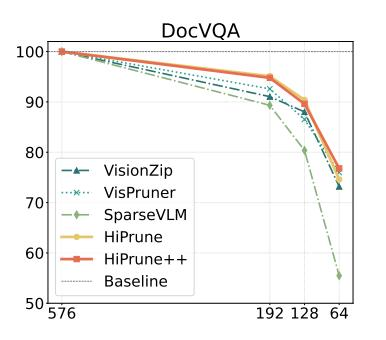

Figure 9: Results on Text-Dominant Tasks. We evaluate HiPrune on LLaVA-1.5-7B with the DocVQA dataset. The horizontal axis is the token budget, while the vertical axis is the percentage normalized results.

<span id="page-14-1"></span>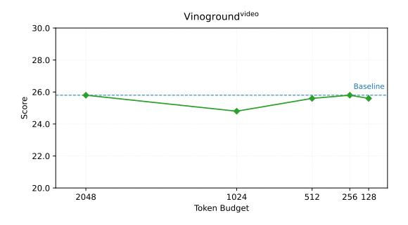

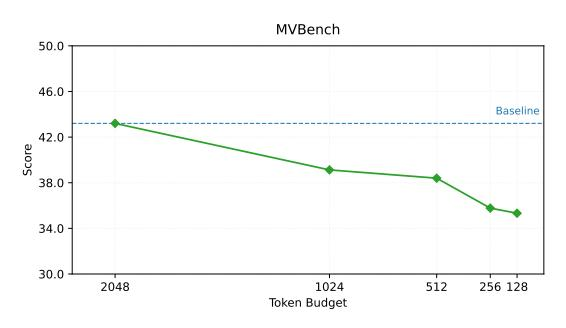

Figure 10: Results on Video-LLaVA-7B. We apply HiPrune and set different token budgets. The vanilla model features a token budget of 2048.

ble [11.](#page-13-3) When the number of buffers around one anchor surpasses 4, the performance stays stable. The buffers are introduced to mitigate misselection caused by noise in the attention map; therefore, theoretically, as long as their coverage size is sufficiently wide, the exact shape does not make a significant difference.

## E Visualization of Attention Evolution

As shown in Fig. [14,](#page-16-0) the high-attention tokens in the input layer and the output layer (last but one in LLaVA) obey distinct distributions. In these examples, high-attention tokens in the shallow layer distribute uniformly across the embedding space,

<span id="page-14-3"></span>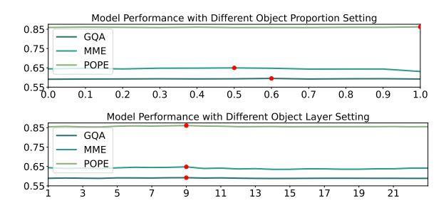

Figure 11: Hyperparameter sensitivity. The results are obtained on LLaVA-v1.5-7B with budget N′ = 192. The best performance setting is marked in red.

<span id="page-14-4"></span>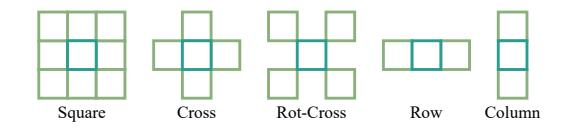

Figure 12: Positional relation between buffer and anchor tokens under different selection schemes. The anchor tokens are in teal while the buffer tokens are in lime.

while they cluster in the output layer. During the shift, the middle layers show a transitional status covering every cluster. These examples indicate that CLIP encodes images in a continuous and gradual way, forming a hierarchical representation inside the vision encoder.

