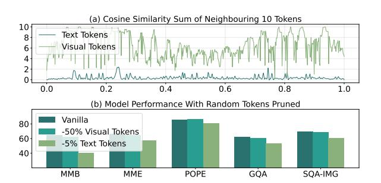

# HiPrune: Hierarchical Attention for Efficient Token Pruning in Vision-Language Models

Jizhihui Liu1 \* , Guangdao Zhu1 \* , Feiyi Du1 \* , Niu Lian1 , Jun Li1,2 Bin Chen1,2† , Weili Guan1,2 , Yaowei Wang1,2

1Harbin Institute of Technology, Shenzhen 2Pengcheng Laboratory danielement321@gmail.com, chenbin2021@hit.edu.cn

## Abstract

Vision-Language Models (VLMs) encode images and videos into abundant tokens, which contain substantial redundancy and computation cost. While visual token pruning mitigates the issue, most existing methods lack insight into the intrinsic property of the vision encoder itself. In this work, we dive into the vision encoder and prove that the middle layers pay more attention to the main objects of the image qualitatively and quantitatively, while the deep layers to tokens with rich global information. Utilizing this Hierarchical attention pattern, we propose HiPrune, a training-free and model-agnostic token Pruning method. HiPrune identifies three types of visual tokens according to their attention in different phases of the vision encoder, which preserves different levels of information. By coupling with the similarity of text tokens, we propose a prompt-aware variance, HiPrune++, which further improves instruction following performance under a very low token budget. Extensive experiments across four representative VLMs show that HiPrune achieves up to 99.3% of task accuracy with only 1/3 of the tokens, while reducing inference FLOPs by 58.7%. HiPrune++ maintains up to 99.7% accuracy with 2/9 tokens, highlighting robustness under high-resolution. Our code is available at [https:](https://github.com/Danielement321/HiPrune) [//github.com/Danielement321/HiPrune](https://github.com/Danielement321/HiPrune).

## 1 Introduction

Built on the success of Large Language Models (LLMs) [\(Touvron et al.,](#page-9-0) [2023;](#page-9-0) [Yang et al.,](#page-10-0) [2025a\)](#page-10-0), Vision-Language Models (VLMs) [\(Team et al.,](#page-9-1) [2023;](#page-9-1) [Hurst et al.,](#page-9-2) [2024;](#page-9-2) [Liang et al.,](#page-9-3) [2024\)](#page-9-3) have demonstrated considerable capacity in various visual tasks. VLMs commonly comprise a vision encoder [\(Radford et al.,](#page-9-4) [2021;](#page-9-4) [Zhai et al.,](#page-10-1) [2023\)](#page-10-1), an adaptor, and an LLM. The vision encoder is a

Figure 1: Redundancy analyses on visual tokens. (a) The sum of cosine similarity between each token and neighbouring 10 tokens. (b) The performance of LLaVA-1.5-7B when randomly removing 50% visual tokens or 5% text tokens.

vision transformer (ViT) [\(Dosovitskiy et al.,](#page-8-0) [2021;](#page-8-0) [Vaswani et al.,](#page-10-2) [2017\)](#page-10-2) that encodes the image into numerous tokens, which account for the biggest proportion of inputs and cause significant latency and memory demands. In LLaVA-1.5 [\(Liu et al.,](#page-9-5) [2023,](#page-9-5) [2024a\)](#page-9-6), an image is encoded into 576 tokens, much longer than its textual counterparts [\(Zhang](#page-10-3) [et al.,](#page-10-3) [2025c\)](#page-10-3). For VLMs that incorporate a native dynamic-resolution encoder [\(Bai et al.,](#page-8-1) [2025\)](#page-8-1), one high-resolution webpage snapshot may require more than 10,000 tokens, resulting in a substantial computational cost and GPU memory allocation.

Although visual tokens constitute the majority of VLM input sequences, their necessity remains questionable. In Fig. [1\(](#page-0-0)a), we compare the cosine similarity between each token and its 10 neighbors and find that visual tokens exhibit significantly higher redundancy than text tokens. Fig. [1\(](#page-0-0)b) shows that randomly pruning 50% of visual tokens causes a performance drop much smaller than removing merely 5% of text tokens, while yielding substantial reductions in FLOPs. Moreover, previous works [\(Chen et al.,](#page-8-2) [2024a;](#page-8-2) [Zhang et al.,](#page-10-4) [2025f\)](#page-10-4) observe that visual tokens receive markedly less attention in the LLM decoder compared to text tokens. These findings point to a key insight: vi-

1Equal Contribution.

2Corresponding Author.

sual tokens are highly redundant. Based on this, many works seek to reduce the number of visual tokens to overcome the computational burden. Some methods [\(Chen et al.,](#page-8-2) [2024a;](#page-8-2) [Xing et al.,](#page-10-5) [2025;](#page-10-5) [Zhang et al.,](#page-10-6) [2025g\)](#page-10-6) conduct token pruning inside the LLM decoder, while some [\(Yang et al.,](#page-10-7) [2025b;](#page-10-7) [Alvar et al.,](#page-8-3) [2025\)](#page-8-3) conduct token selection based on static metrics like diversity or similarity. However, most methods do not fully utilize the intrinsic attention property of the vision encoder and are model-sensitive, necessitating careful tuning for practical deployment.

In this paper, we show that vision encoders process visual information in a progressive and structured hierarchy, where different layers attend to distinct semantic levels. Specifically, middle layers predominantly capture object-centric features, while deeper layers encode global contextual representations. This hierarchical pattern is consistently observed across various vision encoders [\(Radford](#page-9-4) [et al.,](#page-9-4) [2021;](#page-9-4) [Zhai et al.,](#page-10-1) [2023;](#page-10-1) [Touvron et al.,](#page-9-7) [2021;](#page-9-7) [Assran et al.,](#page-8-4) [2025\)](#page-8-4), regardless of the architecture design or pre-training data. Building on this observation, we introduce HiPrune, a training-free and model-agnostic visual token pruning plugin. We extract attention maps from a designated object layer l, selecting tokens with the highest attention scores and tokens near them as Anchor Tokens and Buffer Tokens, which encode detailed local semantics. The remaining token budget is allocated to Register Tokens, selected by the attention scores in the output layer, capturing global and holistic contextual features. We further introduce an optional subset of visual tokens selected based on similarity with text tokens, which showcases an improved instruction-following ability (HiPrune++).

We evaluate our method across multiple popular VLMs. When applied to LLaVA-1.5, HiPrune maintains 99.3% of original performance while requiring only 1/3 tokens, alongside bringing a 58.7% FLOPs reduction. With a tight budget of 1/9 tokens, HiPrune++ still preserves 96.1% accuracy score, accompanied by an outstanding hallucination reduction compared with baselines. With a different encoder and dynamic token length setting, HiPurne achieves state-of-the-art on Qwen, confirming its versatility on various architectures.

Our main contributions are as follows:

• We analyse the hierarchical attention patterns in vision encoders and reveal the focus of various layers qualitatively and quantitatively.

- We propose HiPrune and HiPrune++, a training-free and model-agnostic visual token pruning plugin enabling efficient inference.
- Extensive experiments on VLMs demonstrate the excellence of HiPrune, preserving 99.3% performance with only 1/3 visual tokens and reducing inference FLOPs by up to 58.7%.

