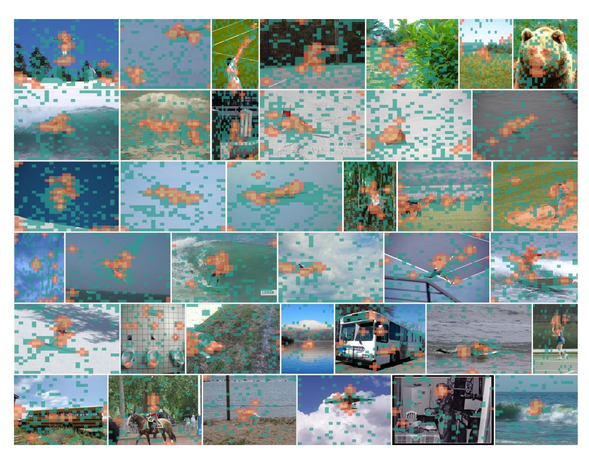
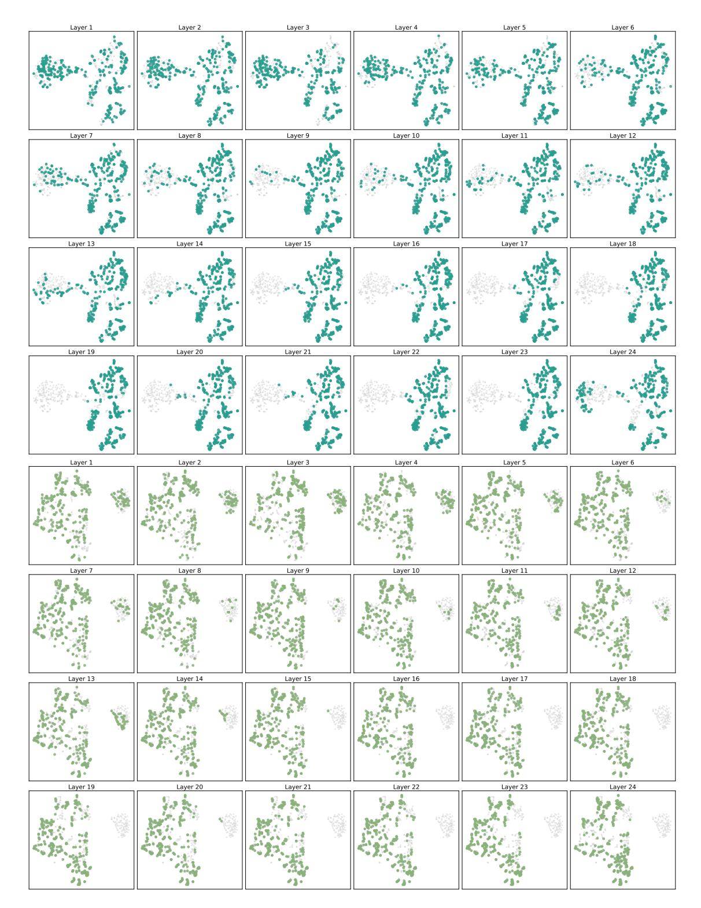
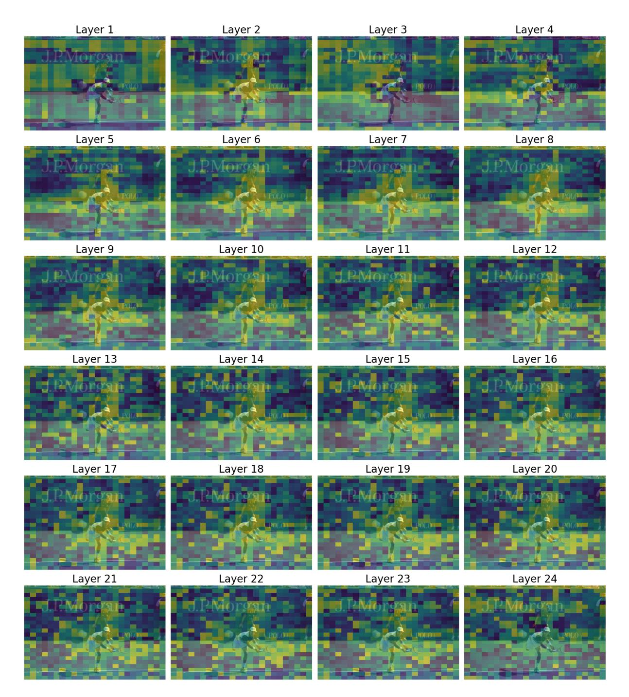

# F Visualizations on Retained Tokens

We provide extended examples on retained tokens in Fig. [13.](#page-15-0) We can see that the anchor tokens and buffer tokens contain the main body of the image, e.g., the player, the person, and the animal, which are crucial for image understanding. The register tokens seem less image-aligned, but cover the whole image sufficiently, indicating they encode global information. The reason is discussed in the section Experiment, and this visualization further confirms our theory.

## G Visualizations on All Layers' Attention

We provide two examples of all layers' attention distribution in Fig. [15.](#page-17-0) In the middle layers, the highlighted areas mainly overlap the person, which is the main object of the image, and agrees with the human perception order, as we also first notice the person in the image.

Figure 13: Visualization on tokens retained by HiPrune. The images are randomly chosen from the COCO val2017 set [\(Lin et al.,](#page-9-12) [2014\)](#page-9-12). Anchor tokens are in yellow, buffer tokens are in red, and register tokens are in cyan.

Figure 14: Two examples of t-SNE visualization on visual tokens that receive top 50% attention from different CLIP layers.

Figure 15: Visualization of all layers' attention in the CLIP model.