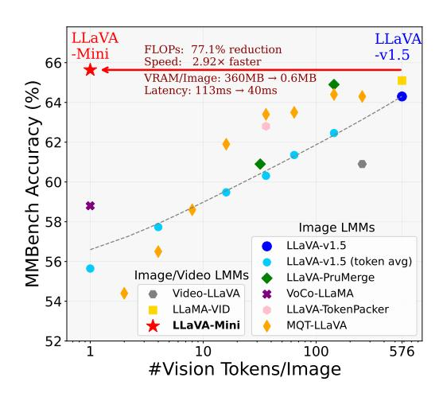

# 1 INTRODUCTION

Large multimodal models (LMMs), such as GPT-4o [\(OpenAI, 2024\)](#page-14-0), equip large language models (LLMs) [\(OpenAI, 2022;](#page-14-1) [2023\)](#page-14-2) with the ability to understand visual information, exhibiting a common trend toward low-latency responses to enable real-time multimodal interactions. Recently, the most widely adopted LMMs [\(Liu et al., 2023b;](#page-13-0) [2024a;](#page-14-3) [Zhu et al., 2024\)](#page-16-0), exemplified by the LLaVA series [\(Liu et al., 2023b\)](#page-13-0), involves embedding image patches into vision tokens through a vision encoder [\(Radford et al., 2021\)](#page-14-4) and incorporating them into the LLM's context to facilitate visual information comprehension, leading to strong performance in image and video understanding.

However, the substantial computational costs of LMMs present ongoing challenges. Unlike LLMs [\(Touvron et al., 2023a](#page-15-0)[;b;](#page-15-1) [Dubey et al., 2024\)](#page-10-0), which only process textual inputs, LMMs must incorporate a large number of additional vision tokens into the LLM's context to represent visual information [\(Liu et al., 2023b\)](#page-13-0), significantly increasing computational complexity. For instance, in the widely used vision encoder CLIP ViT-L/336px, a single image is encoded into 24 × 24 = 576 vision tokens [\(Radford et al., 2021\)](#page-14-4), where integrating such a large number of vision tokens into

1Key Laboratory of Intelligent Information Processing,

Institute of Computing Technology, Chinese Academy of Sciences (ICT/CAS)

2Key Laboratory of AI Safety, Chinese Academy of Sciences

3University of Chinese Academy of Sciences, Beijing, China

[zhangshaolei20z@ict.ac.cn,](mailto:zhangshaolei20z@ict.ac.cn) [fengyang@ict.ac.cn](mailto:fengyang@ict.ac.cn)

∗Corresponding author: Yang Feng.

1Code: <https://github.com/ictnlp/LLaVA-Mini>; Model: [https://huggingface.co/](https://huggingface.co/ICTNLP/llava-mini-llama-3.1-8b) [ICTNLP/llava-mini-llama-3.1-8b](https://huggingface.co/ICTNLP/llava-mini-llama-3.1-8b)

the context of parameter-heavy LLM results in significant computational overhead and higher inference latency. This issue becomes even more pronounced in high-resolution image modeling (which requires more vision tokens per image) (Liu et al., 2024b) or video processing (which involves processing more images) (Maaz et al., 2024; Lin et al., 2023a). Therefore, developing efficient LLMs is essential for achieving GPT-40-like low-latency multimodal interactions.

The computational demands of LMMs are primarily driven by model scale and the number of tokens in the input context. Existing approaches to improving LMM efficiency typically focus on model downsizing (Chu et al., 2023; 2024; Yuan et al., 2024a; Zhou et al., 2024a) or quantization techniques (Yuan et al., 2024b), but often overlook another critical avenue: reducing the number of vision tokens to shorten the input context. Some token reduction methods rely on predefined rules to reduce the number of tokens output by the vision encoder (Bolya et al., 2023; Shang et al., 2024; Li et al., 2024e; Ye et al., 2024d; Hu et al., 2024), which leads to the loss of visual information and inevitably results in performance degradation (Wang et al., 2024; Fan et al., 2024).

In this paper, we aim to develop efficient LMMs by minimizing the number of vision tokens while maintaining comparable performance. To this end, we begin by exploring a foundational question: How does the LMM (particularly the LLaVA architecture) understand vision tokens? Through layer-wise analysis (refer to Sec.3), we observe that the importance of vision tokens changes across different layers of LLM. In the early layers, vision tokens play a crucial role, receiving considerable attention from the following text tokens (e.g., user input instructions and responses). However, as the layers deepen, the attention devoted to vision tokens decreases sharply, with most attention shifting towards the input instructions. Notably, even when we entirely remove vision tokens in some later layers, LMM keeps certain visual understanding capabilities. This finding suggests that vision tokens are more critical in early layers, where text tokens fuse visual information from vision tokens.

Figure 1: LLaVA-Mini achieves comparable performance to LLaVA-v1.5 using only 1 vision token instead of 576, yielding efficient computation, lower latency, and reduced VRAM usage.

Based on this finding, if the fusion process can be shifted from the early layers of LLM to perform before LLM, we can significantly reduce the number of vision tokens fed into the LLM without sacrificing performance. Along with this idea, we propose *LLaVA-Mini*, an efficient and high-quality LMM with minimal vision tokens. LLaVA-Mini introduces a modality pre-fusion module before LLM to fuse visual information into the instruction text in advance, and employs a compression module to highly compress the vision tokens before inputting them into LLM, thereby enhancing efficiency while preserving high-quality visual understanding. Under extreme settings, LLaVA-Mini requires only one vision token per image fed into LLM backbone, offering significant advantages in inference time and memory consumption for high-resolution image and long video processing.

Experiments across a wide range of 11 image-based and 7 video-based understanding benchmarks show that LLaVA-Mini achieves performance comparable to LLaVA-v1.5 (Liu et al., 2023b) while using only 1 vision token instead of 576 (compression rate of 0.17%). With minimal vision tokens, LLaVA-Mini offers substantial benefits in terms of computational efficiency (77% FLOPs reduction) and lowering GPU memory usage (360 MB  $\rightarrow$  0.6 MB per image), as shown in Figure 1. As a result, LLaVA-Mini decreases inference latency of image understanding from 100 ms to 40 ms and also enables the processing of long videos exceeding 10,000 frames (over 3 hours) on an NVIDIA RTX 3090 with 24GB of memory, paving the way for low-latency multimodal interactions.

#### 2 Related Work

As Large multimodal models (LMMs) are increasingly deployed in real-time applications (OpenAI, 2024), enhancing their efficiency has become a critical concern. Recent efforts focus on either

reducing the model size or the number of tokens that fed into LMM. To reduce LMM's model size, previous methods directly replace the LLM backbone with a smaller one (Chu et al., 2023; 2024; Yuan et al., 2024a; Zhou et al., 2024a), while directly reducing the parameter scale can impact the LLM backbone's capabilities, resulting in performance declines in visual tasks (Shang et al., 2024).

Another efficiency determinant for LMMs is the context length provided to the LLM backbone, including vision and text tokens. In practice, the number of vision tokens can be substantial, particularly when processing high-resolution images and videos. For image-based LMMs, token merging (Bolya et al., 2023), PruMerge (Shang et al., 2024), and TokenPacker (Li et al., 2024e) aggregate vision tokens based on similarity. Qwen-VL (Bai et al., 2023) and MQT-LLaVA (Hu et al., 2024) utilize Q-former (Li et al., 2023a) to compress vision tokens into a fixed length. However, directly reducing vision tokens inevitably results in the loss of visual information (Fan et al., 2024).

For video-based LMMs, Video-ChatGPT (Maaz et al., 2024), Video-Chat (Li et al., 2024c), Video-LLaVA (Lin et al., 2023a), and Video-LLaMA (Zhang et al., 2023), select a fixed number of frames from videos of varying lengths. MovieChat (Song et al., 2024a) applies memory techniques to condense videos into a fixed-length representation. Such frame selection or merging methods may lose some key frames or misunderstand the temporal information of the video (Zhou et al., 2024b).

Previous methods have primarily focused on token reduction on the vision encoder. LLaVA-Mini takes this a step further by exploring how vision tokens and text tokens interact within the LLM backbone, and accordingly introduces a modality pre-fusion module, enabling an extreme compression of vision tokens (1 vision token fed into LLM) while achieving comparable performance.

#### 3 How Does LLAVA Understand Vision Tokens?

To compress visual tokens while preserving visual understanding, we sought to figure out how LMMs understand visual tokens. Given the complexity of this issue, our preliminary analysis concentrated on the LLaVA architecture (Liu et al., 2023b), focusing on the role of visual tokens (particularly their quantity) in LMMs from an attention-based perspective (Xiao et al., 2024).

