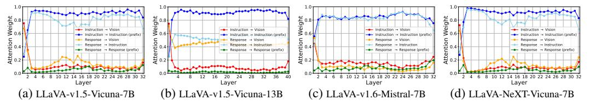
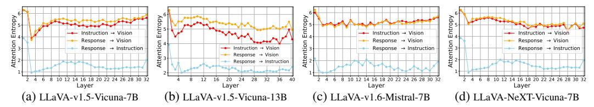
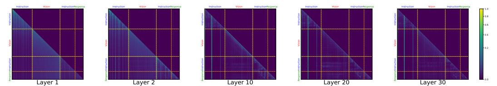
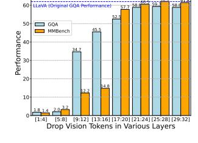
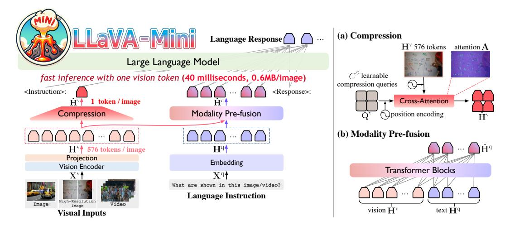
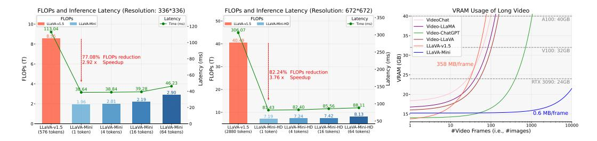
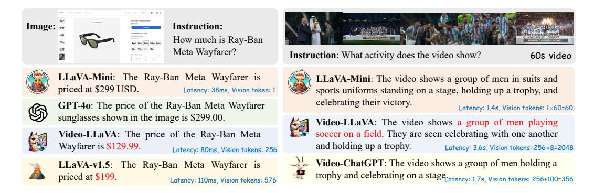

# 3.1 LLAVA ARCHITECTURE

LLaVA (Large Language and Vision Assistant) (Liu et al., 2023b) is an advanced multimodal architecture that integrates vision and language processing capabilities. Building upon vision Transformers (ViT) (Dosovitskiy et al., 2021) for visual inputs and LLMs for text, LLaVA can generate language response  $\mathbf{X}^a$  based on the given language instruction  $\mathbf{X}^q$  and visual inputs  $\mathbf{X}^v$ .

Typically, a pre-trained CLIP ViT-L/14 (Radford et al., 2021) and a projection layer are employed to encode the visual inputs  $\mathbf{X}^v$  into vision tokens (i.e., continuous representations)  $\mathbf{H}^v$ . Then, vision tokens  $\mathbf{H}^v$  and language instruction's embedding  $\mathbf{H}^q$  are fed into an LLM, such as Vicuna (Chiang et al., 2023) or Mistral, to generate the response  $\mathbf{X}^a$ . In practice, vision tokens are often inserted into the middle of the language instruction, so the inputs of LLM can be formally represented as:

$$\left\langle H_1^{\mathbf{q}}, \cdots, H_k^{\mathbf{q}}, H_1^{\mathbf{v}}, \cdots, H_{l_v}^{\mathbf{v}}, H_{k+1}^{\mathbf{q}}, \cdots, H_{l_q}^{\mathbf{q}} \right\rangle,$$
 (1)

where  $l_v$  and  $l_q$  denote the lengths of the vision tokens and language instruction, respectively. For instance, in LLaVA-v1.5, the system prompts are positioned before the image (i.e.,  $H_1^q, \cdots, H_k^q$ ), while the user inputs follow the image (i.e.,  $H_{k+1}^q, \cdots, H_{l_q}^q$ ) (Liu et al., 2023b).

#### 3.2 PRELIMINARY ANALYSES

We begin by analyzing the significance of visual tokens in LMMs to guide the strategies for compressing vision tokens. Specifically, we evaluate the importance of visual tokens at each layer of LMMs from an attention-based perspective. Our analysis encompasses several LMMs, including LLaVA-v1.5-Vicuna-7B, LLaVA-v1.5-Vicuna-13B, LLaVA-v1.6-Mistral-7B, and LLaVA-NeXT-Vicuna-7B (Liu et al., 2023b; 2024b), to identify common characteristics across models of varying sizes and training datasets. Appendix A gives the formal expression of the preliminary analyses.

Vision Tokens are More Important in Early Layers To find out which layers in LMM the vision tokens play a more important role, we measure the attention weights assigned to different token

Figure 2: Layer-wise variation of attention weights assigned to different types of tokens (including instruction, vision, and response) in LMMs. "A \rightarrow B" means the attention weights from A to B.

Figure 3: Attention entropy assigned to different types of tokens across different layers in LMMs.

types (including instruction, vision, and response) at each layer. As shown in Figure 2, Visual tokens receive more attention in the earlier layers, but this attention sharply decreases in the deeper layers, with over 80% of the attention being directed towards instruction tokens. This finding is consistent with the previous conclusion (Chen et al., 2024). This change in attention suggests that vision tokens play a central role in the early layers, with the instruction tokens seeking relevant visual information from vision tokens through attention mechanisms. In the later layers, the model relies more on instructions that have already fused the visual data to generate responses.

**Most Vision Tokens are Focused in Early Layers** To further assess the importance of individual visual tokens, we calculate the entropy of the attention distribution at each layer. As shown in Figure 3, we find that the entropy of attention toward visual tokens is much higher in the earlier layers, indicating that most visual tokens are evenly attended to in the early layers.

Figure 4: Attention visualization at different layers in LLaVA-v1.5 (color bar: logarithmic scale).

To intuitively illustrate the layer-wise variations in the importance of visual tokens, Figure 4 visualizes the attention distribution across each layer of LLaVA-v1.5. Almost all visual tokens receive broader attention in the early layers, while only some visual tokens are focused in the later layers. These observations suggest that all visual tokens are crucial in the early layers, and reducing their quantity inevitably results in a loss of visual information. This explains why previous methods of direct token reduction will compromise visual understanding capabilities (Shang et al., 2024; Ye et al., 2024d; Hu et al., 2024).

To further substantiate our finding that visual tokens are particularly critical in the early layers, we evaluated the visual understanding ability of LMMs when visual tokens were dropped at different layers. Specifically, we measured the performance of LLaVA-v1.5 on the

Figure 5: Performance of LLaVA-v1.5 when removing all vision tokens in various layers of LMM.

GQA (Hudson & Manning, 2019) and MMBench (Liu et al., 2024c), with visual tokens being dropped at layers 1-4, 5-8, ..., 29-32, respectively. As shown in Figure 5, removing visual tokens in the early layers leads to a complete loss of visual understanding ability, while removing tokens in the higher layers has a minimal effect, with the model retaining much of its original performance. In conclusion, our analyses and ablation study reveal that vision tokens play a crucial role in the early layers of LLaVA, where text tokens fuse visual information from the vision tokens at this stage. This insight can inform our strategies for compressing vision tokens.

Figure 6: Architecture of LLaVA-Mini. **Left**: LLaVA-Mini represents each image with one vision token. **Right**: Detailed view of the proposed query-based compression and modality pre-fusion.

#### 4 LLAVA-MINI

We introduce LLaVA-Mini, an efficient large multimodal model with minimal vision tokens. Like previous work, LLaVA-Mini uses a vision encoder to encode an image into several vision tokens. To enhance the efficiency, LLaVA-Mini significantly reduces the number of vision tokens fed into LLM backbone through a compression module. To retain visual information during compression, based on previous findings that vision tokens play a crucial role in the early layers for fusing visual information, LLaVA-Mini introduces a modality pre-fusion module before the LLM backbone to fuse the visual information into the text tokens. The details of LLaVA-Mini are as follows.

#### 4.1 ARCHITECTURE

The architecture of LLaVA-Mini is illustrated in Figure 6. For the visual inputs  $\mathbf{X}^{\mathrm{v}}$ , a pre-trained CLIP vision encoder (Radford et al., 2021) is employed to extract visual features from each image. These features are then mapped into the word embedding space via a projection layer, producing vision tokens  $\mathbf{H}^{\mathrm{v}} \in \mathbb{R}^{N^2 \times d_h}$ , where  $N^2$  is the number of vision tokens and  $d_h$  is the LLM's embedding dimension. For the language instruction  $\mathbf{X}^{\mathrm{q}}$ , LLM's embedding layer is used to generate text token representations  $\mathbf{H}^{\mathrm{q}} \in \mathbb{R}^{l_q \times d_h}$ , where  $l_q$  is the number of text tokens.

Vision Token Compression To enhance the efficiency of LMMs, LLaVA-Mini reduces the number of vision tokens fed into the LLM backbone by utilizing a query-based compression module. To learn compression of the vision tokens, LLaVA-Mini introduces  $C \times C$  learnable compression queries  $\mathbf{Q}^{\mathrm{v}}$ . These queries interact with all vision tokens  $\mathbf{H}^{\mathrm{v}}$  through cross-attention (Li et al., 2023a; Ye et al., 2024a), selectively extracting the important visual information to produce  $C \times C$  compressed vision tokens  $\hat{\mathbf{H}}^{\mathrm{v}} \in \mathbb{R}^{C^2 \times d_h}$ . To preserve the spatial information in the image during compression, we introduce a 2D sinusoidal positional encoding  $PE(\cdot)$  (He et al., 2021) on the learnable queries and original vision tokens. Formally, the compression can be expressed as:

$$\hat{\mathbf{H}}^{v} = \mathbf{A} \cdot \mathbf{H}^{v}, \text{ where } \mathbf{A} = \operatorname{Softmax}\left(\left(\mathbf{Q}^{v} + PE(\mathbf{Q}^{v})\right) \cdot \left(\mathbf{H}^{v} + PE(\mathbf{H}^{v})\right)^{\top}\right),$$
 (2)

where  $\mathbf{A} \in \mathbb{R}^{C^2 \times N^2}$  is the similarity and  $\hat{\mathbf{H}}^v$  are  $C \times C$  compressed vision tokens.

**Modality Pre-fusion** The compression of vision tokens inevitably results in some loss of visual information. To retain as much visual information during compression as possible, LLaVA-Mini introduces a modality pre-fusion before the LLM backbone, enabling text tokens to fuse relevant visual information from all vision tokens in advance. Based on our previous observations, where this fusion stage occurs implicitly within the early layers of the LLM, the modality pre-fusion module  $f(\cdot)$  consists of  $N_{fusion}$  Transformer blocks (Vaswani et al., 2017), where each Transformer block shares the same structure and hyperparameters with LLM backbone. Vision tokens  $\mathbf{H}^{\text{v}}$  and text

tokens  $\mathbf{H}^q$  are concatenated and fed into the pre-fusion module, and the outputs corresponding to the text tokens are then extracted as fusion tokens, expressed as:

$$\hat{\mathbf{H}}^{\mathbf{q}} = f\left(\operatorname{Concat}\left(\mathbf{H}^{\mathbf{v}}, \mathbf{H}^{\mathbf{q}}\right)\right) \left[-l_{a}:\right],\tag{3}$$

where  $\hat{\mathbf{H}}^q \in \mathbb{R}^{l_q \times d_h}$  are fusion tokens of text representations with related visual information.

Finally, the compressed vision tokens  $\hat{\mathbf{H}}^{\text{v}}$  and fusion tokens  $\hat{\mathbf{H}}^{\text{q}}$  of text representations with related visual information ( $C^2 + l_q$  tokens in total) are fed to LLM together to generate the response.

#### 4.2 HIGH-RESOLUTION IMAGE AND VIDEO MODELING

LLaVA-Mini uses minimal vision tokens to represent visual information, making it possible to handle high-resolution images and videos much more efficiently.

**High-Resolution Image** The resolution of LMM is typically determined by the vision encoder, such as CLIP's ViT-L, which encodes at a resolution of 336\*336 pixels. To perceive images at a higher resolution, we divide each image into four sub-images by splitting it horizontally and vertically into two parts (Liu et al., 2024b). Each of these sub-images is processed by the vision encoder and projection individually, yielding  $N^2 \times 4$  vision tokens with a high resolution of 672\*672 pixels. The proposed compression module is then employed to reduce these  $N^2 \times 4$  vision tokens into  $C^2$  compressed vision tokens  $\hat{\mathbf{H}}^{\text{v}}$ . The modality pre-fusion module takes the 4 sub-images ( $N^2 \times 4$  vision tokens), the original image ( $N^2$  vision tokens), and the language instruction ( $l_q$  text tokens) as inputs, and then generates  $l_q$  fusion tokens  $\hat{\mathbf{H}}^{\text{q}}$  with richer global and local visual information. Finally, the number of tokens input to the LLM is  $C^2 + l_q$ . Note that when handling high-resolution images, C is set slightly higher than in standard-resolution settings to preserve more details.

**Video** When handling videos, LMMs often extract multiple frames from the video (Li et al., 2023b), which incurs significant computational costs. For instance, in the case of LLaVA-v1.5, extracting frames at a rate of 1 frame per second (fps) from an 8-second video results in  $576 \times 8 = 4608$  vision tokens, leading to substantial VRAM usage. LLaVA-Mini can represent each image with minimal vision tokens, providing a significant advantage in processing long videos. For a video consisting of M frames, LLaVA-Mini processes each frame individually, generating  $C^2$  vision tokens and  $l_q$  fusion tokens per frame.  $C^2$  vision tokens from each of M frames are sequentially concatenated to yield a total of  $M \times C^2$  vision tokens, i.e.,  $\hat{\mathbf{H}}^{\text{V}}$ . Then,  $l_q$  fusion tokens corresponding to M frames are aggregated through pooling operation to generate the video's fusion tokens  $\hat{\mathbf{H}}^{\text{q}}$ . As a result, the number of tokens fed to the LLM is reduced from  $MN^2 + l_q$  to  $MC^2 + l_q$  for a video of M frames.

#### 4.3 TRAINING

LLaVA-Mini follows the same training process as LLaVA, consisting of two stages.

Stage 1: Vision-Language Pretraining In this stage, compression and modality pre-fusion modules are not yet applied (i.e., the  $N^2$  vision tokens remain unchanged). LLaVA-Mini learns to align vision and language representations using visual caption data. The training focuses solely on the projection module while the vision encoder and LLM remain frozen (Liu et al., 2023b).

**Stage 2: Instruction Tuning** In this stage, LLaVA-Mini is trained to perform various visual tasks based on minimal vision tokens, using instruction data. Compression and modality pre-fusion are introduced to LLaVA-Mini, and all modules except the frozen vision encoder (i.e., the projection, compression, modality pre-fusion, and LLM backbone) are trained in an end-to-end manner.

#### 5 EXPERIMENTS

#### 5.1 EXPERIMENTAL SETTING

**Benchmarks** We evaluate LLaVA-Mini on image and video understanding tasks. Experiments are conducted on 11 image benchmarks and 7 video benchmarks. Refer to Appendix C for details.

**Baselines** LLaVA-Mini is an image/video LMM, so we compare it with several advanced image-based and video-based LMMs. Detailed description of baselines refer to Appendix D.

Table 1: Performance on 11 image-based benchmarks. 'Res.' is resolution and '#Vision Tokens' is the number of vision tokens fed to LLM backbone. '\*' indicates that involving extra training data.

| Methods                        | LLM                       | Res. | #Vision Tokens | VQA v2 | GQA  | VisWiz | SciQA | <b>VQA</b> T | POPE | MME    | ММВ  | SEED | LLaVA W | MM- Vet | Avg. (%) |
|--------------------------------|---------------------------|------|-------------------|-------------------|------|--------|-------|-------------------------|------|--------|------|------|--------------------|------------|----------|
| BLIP-2                         | Vicuna-13B                | 224  | 32                | 65.0              | 41.0 | 19.6   | 61.0  | 42.5                    | 85.3 | 1293.8 | -    | 46.4 | 38.1               | 22.4       |          |
| InstructBLIP                   | Vicuna-7B                 | 224  | 32                | -                 | 49.2 | 34.5   | 60.5  | 50.1                    | -    | -      | 36.0 | 53.4 | 60.9               | 26.2       | _        |
| IDEFICS-9B                     | LLaMA-7B                  | 224  | 64                | 50.9              | 38.4 | 35.5   | -     | 25.9                    | -    | -      | 48.2 | -    | -                  | -          | -        |
| IDEFICS-80B                    | LLaMA-65B                 | 224  | 64                | 60.0              | 45.2 | 36.0   | _     | 30.9                    | -    | -      | 54.5 | -    | -                  | - 1        | _        |
| Qwen-VL                        | Qwen-7B                   | 448  | 256               | 78.8              | 59.3 | 35.2   | 67.1  | 63.8                    | -    | -      | 38.2 | 56.3 | -                  | - 1        | -        |
| Qwen-VL-Chat                   | Qwen-7B                   | 448  | 256               | 78.2              | 57.5 | 38.9   | 68.2  | 61.5                    | _    | 1487.5 | 60.6 | 58.2 | _                  | - i        | -        |
| SPHINX                         | LLaMA-13B                 | 224  | 289               | 78.1              | 62.6 | 39.9   | 69.3  | 51.6                    | 80.7 | 1476.1 | 66.9 | 56.2 | 73.5               | 36.0       | 56.0     |
| SPHINX-2k                      | LLaMA-13B                 | 762  | 2890              | 80.7              | 63.1 | 44.9   | 70.6  | 61.2                    | 87.2 | 1470.6 | 65.9 | 57.9 | 76.9               | 40.2       | 59.0     |
| mPLUG-Owl2                     | LLaMA-7B                  | 448  | 1024              | 79.4              | 56.1 | 54.5   | 68.7  | 54.3                    | -    | 1450.2 | 64.5 | 57.8 | -                  | 36.2       | -        |
| Video-LLaVA                    | Vicuna-7B                 | 224  | 256               | 74.7              | 60.3 | 48.1   | 66.4  | 51.8                    | 84.4 | -      | 60.9 | -    | 73.1               | 32.0       | -        |
| LLaVA-v1.5                     | Vicuna-7B                 | 336  | 576               | 78.5              | 62.0 | 50.0   | 66.8  | 58.2                    | 85.9 | 1510.7 | 64.3 | 58.6 | 63.4               | 30.5       | 56.3     |
| LMMs with fewer vision tokens  |                           |      |                   |                   |      |        |       |                         |      |        |      |      |                    |            |          |
| MQT-LLaVA                      | Vicuna-7B                 | 336  | 2                 | 61.0              | 50.8 | 48.5   | 65.0  | -                       | 74.5 | 1144.0 | 54.4 | -    | 41.7               | 19.5       | -        |
| MQT-LLaVA                      | Vicuna-7B                 | 336  | 36                | 73.7              | 58.8 | 51.0   | 66.8  | _                       | 81.9 | 1416.3 | 63.4 | _    | 59.6               | 27.8       | _        |
| MQT-LLaVA                      | Vicuna-7B                 | 336  | 256               | 76.8              | 61.6 | 53.1   | 67.6  | _                       | 84.4 | 1434.5 | 64.3 | _    | 64.6               | 29.8       | _        |
| PruMerge                       | Vicuna-7B                 | 336  | 32                | 72.0              | _    | _      | 68.5  | 56.0                    | 76.3 | 1350.3 | 60.9 | _    | _                  | -          | _        |
| PruMerge++                     | Vicuna-7B                 | 336  | 144               | 76.8              | _    | _      | 68.3  | 57.1                    | 84.0 | 1462.4 | 64.9 | _    | _                  | - 1        | _        |
| LLaMA-VID                      | Vicuna-7B                 | 336  | 2                 | -                 | 55.5 | _      | 68.8  | 49.0                    | 83.1 | _      | _    | _    | _                  | -          | _        |
| VoCo-LLaMA                     | Vicuna-7B                 | 336  | 1                 | 72.3              | 57.0 | -      | 65.4  | _                       | 81.4 | 1323.3 | 58.8 | 53.7 | _                  | - 1        | _        |
| TokenPacker                    | Vicuna-7B                 | 336  | 36                | 75.0              | 59.6 | 50.2   | _     | _                       | 86.2 | _      | 62.8 | _    | _                  | 29.6       | _        |
|                                | Ours                      |      |                   |                   |      |        |       |                         |      |        |      |      |                    |            |          |
| LLaVA-Mini                     | Vicuna-7B                 | 336  | 1                 | 77.6              | 60.9 | 56.2   | 70.4  | 57.0                    | 84.4 | 1466.0 | 65.6 | 58.5 | 68.9               | 36.6       | 57.9     |
| $\Delta$ compare               | e to LLaVA-v1.5           |      | 0.17%             | -0.9              | -1.1 | +6.1   | +3.6  | -1.3                    | -1.5 | -44.7  | +1.3 | -0.1 | +5.5               | +6.1       | +1.6     |
| LLaVA-Mini-HD                  | Vicuna-7B                 | 672  | 64                | 78.9              | 61.8 | 58.5   | 69.7  | 59.1                    | 85.3 | 1476.8 | 67.5 | 60.2 | 69.3               | 33.9       | 58.6     |
| $\Delta$ compare               | e to LLaVA-v1.5           |      | 11.1%             | +0.4              | -0.2 | +8.5   | +2.9  | +0.9                    | -0.6 | -33.9  | +3.2 | +1.6 | +5.9               | +3.4       | +2.4     |
| LLaVA-Mini* (Image & Video) | LLaMA-3.1- 8B-Instruct | 336  | 1                 | 79.0              | 61.3 | 57.4   | 83.1  | 58.5                    | 85.3 | 1522.7 | 71.6 | 63.0 | 70.2               | 37.2       | 60.7     |

Table 2: Performance on video-based open-ended generative benchmarks. We report accuracy (%) for question-answer, and scores (1-5, higher is better) for question-answer and generative performance. Results marked with **bold** and <u>underlined</u> indicate the best and second best, respectively.

|               | #Vision |                     |             |               |              | Questio        | n-Answe          | er              | Video-based Generative Performance |        |            |          |             |      |
|---------------|---------|---------------------|-------------|---------------|--------------|----------------|------------------|-----------------|------------------------------------|--------|------------|----------|-------------|------|
| Methods       | #Frames | Tokens per Frame | MSV Acc. | D-QA Score | MSRV Acc. | TT-QA Score | Activity Acc. | Net-QA Score | Correctness                        | Detail | Contextual | Temporal | Consistency | Avg. |
| LLaMA Adapter | 5       | 256                 | 54.9        | 3.1           | 43.8         | 2.7            | 34.2             | 2.7             | 2.03                               | 2.32   | 2.30       | 1.98     | 2.15        | 2.19 |
| VideoChat     | 16      | 32                  | 56.3        | 2.8           | 45.0         | 2.5            | 26.5             | 2.2             | 2.23                               | 2.50   | 2.53       | 1.94     | 2.24        | 2.30 |
| Video-LLaMA   | 16      | 64                  | 51.6        | 2.5           | 29.6         | 1.8            | 12.4             | 1.1             | 1.96                               | 2.18   | 2.16       | 1.82     | 1.79        | 1.99 |
| Video-ChatGPT | 100     | $\sim$ 3.6          | 64.9        | 3.3           | 49.3         | 2.8            | 35.2             | 2.7             | 2.40                               | 2.52   | 2.62       | 1.98     | 2.37        | 2.37 |
| BT-Adapter    | 100     | $\sim 2.6$          | 67.5        | 3.7           | 57.0         | 3.2            | 45.7             | 3.2             | 2.68                               | 2.69   | 3.27       | 2.34     | 2.46        | 2.69 |
| MovieChat     | 2048    | 32                  | 75.2        | 3.8           | 52.7         | 2.6            | 45.7             | 3.4             | 2.76                               | 2.93   | 3.01       | 2.24     | 2.42        | 2.65 |
| LLaMA-VID     | 1fps    | 2                   | 69.7        | 3.7           | 57.7         | 3.2            | 47.4             | 3.3             | 2.96                               | 3.00   | 3.53       | 2.46     | 2.51        | 2.88 |
| Video-LLaVA   | 8       | 256                 | 70.7        | 3.9           | 59.2         | 3.5            | 45.3             | 3.3             | 2.87                               | 2.94   | 3.44       | 2.45     | 2.51        | 2.84 |
| LLaVA-Mini    | 1fps    | 1                   | 70.9        | 4.0           | 59.5         | 3.6            | 53.5             | 3.5             | 2.97                               | 2.99   | 3.61       | 2.48     | 2.67        | 2.94 |

Configuration For a fair comparison, LLaVA-Mini employs the same configurations as LLaVA-v1.5 (Liu et al., 2023b), using the CLIP ViT-L/336px (Radford et al., 2021) as the vision encoder and Vicuna-v1.5-7B (Chiang et al., 2023) as the LLM backbone. The compressed hyperparameter C is set to 1, meaning vision tokens are compressed to one token. The number of modality prefusion layers  $N_{fusion}$  is set to 4. LLaVA-Mini uses the same training data as LLaVA-v1.5 (Liu et al., 2023b), using 558K caption data for pretraining and 665K instruction data for instruction tuning. The high-resolution version with 672\*672 pixels (refer to Sec.4.2) is denoted as LLaVA-Mini-HD. To capture more visual details, the compressed hyperparameter C of LLaVA-Mini-HD is set to 8, i.e., compressing to 64 vision tokens. For video processing, LLaVA-Mini extracts 1 frame per second (1 fps) from the video and sets C=1 to represent each frame with one vision token.

To further explore the potential of LLaVA-Mini, we introduce a variant that uses the CLIP ViT-L/336px (Radford et al., 2021) as vision encoder and the advanced LLaMA-3.1-8B-Instruct (Dubey et al., 2024) as LLM backbone. During instruction tuning, we combine 665K image instruction data from LLaVA (Liu et al., 2023b), 100K video instruction data from Video-ChatGPT (Maaz et al., 2024), and part of open-source data (Li et al., 2024a), resulting in 3 million training samples. LLaVA-Mini is trained using 8 NVIDIA A800 GPUs. Training details are provided in Appendix B.

#### 5.2 MAIN RESULTS

**Image-based Evaluation** We compare LLaVA-Mini with LLaVA-v1.5 across 11 benchmarks to thoroughly assess the performance of LLaVA-Mini with minimal vision tokens. The results are

Table 3: Performance on MVBench (accuracy). Detailed scores are reported in Appendix [H.](#page-25-0)

| Methods       | Action | Object | Position | Scene | Count | Attribute | Pose |      | Character Cognition | Avg. |
|---------------|--------|--------|----------|-------|-------|-----------|------|------|---------------------|------|
| mPLUG-Owl     | 28.4   | 33.0   | 25.0     | 29.0  | 29.3  | 42.0      | 24.0 | 31.0 | 25.3                | 29.7 |
| Video-ChatGPT | 32.1   | 40.7   | 21.5     | 31.0  | 28.0  | 44.0      | 29.0 | 33.0 | 30.3                | 32.7 |
| Video-LLaMA   | 34.4   | 42.2   | 22.5     | 43.0  | 28.3  | 39.0      | 32.5 | 40.0 | 29.3                | 34.1 |
| VideoChat     | 38.0   | 41.2   | 26.3     | 48.5  | 27.8  | 44.3      | 26.5 | 41.0 | 27.7                | 35.5 |
| LLaMA-VID     | 43.4   | 36.7   | 39.8     | 22.0  | 36.5  | 37.3      | 37.5 | 34.0 | 60.5                | 41.4 |
| Video-LLaVA   | 48.0   | 46.5   | 27.8     | 84.5  | 35.5  | 45.8      | 34.0 | 42.5 | 34.2                | 43.1 |
| LLaVA-Mini    | 52.1   | 43.2   | 31.8     | 85.5  | 37.5  | 44.5      | 29.5 | 52.0 | 35.0                | 44.5 |

Table 4: Results on MLVU (accuracy) of long video understanding. Evaluation includes Topic Reasoning (TR), Anomaly Recognition (AR), Needle QA (NQA), Ego Reasoning (ER), Plot QA (PQA), Action Order (AO), and Action Count (AC).

Table 5: Results on EgoSchema (accuracy), a long-form video benchmark (∼ 3 minutes) for first-person view temporal reasoning.

| Methods                      | #Frames | Holistic |      |      | Single Detail |      |      | Multi Detail | Avg. |               |      |                   |
|------------------------------|---------|----------|------|------|---------------|------|------|--------------|------|---------------|------|-------------------|
|                              |         | TR       | AR   | NQA  | ER            | PQA  | AO   | AC           |      | Methods       |      | #Frames EgoSchema |
| Avg. Video Duration (minute) |         | 7        | 10   | 14   | 10            | 8    | 16   | 13           | 11   | Random        | -    | 20                |
| Max Video Duration (minute)  |         | 20       | 543  | 139  | 20            | 13   | 137  | 130          | 143  | mPLUG-Owl     | 16   | 31.1              |
| Video-ChatGPT                | 100     | 26.9     | 24.0 | 40.3 | 42.0          | 29.9 | 25.1 | 31.1         | 31.3 | InternVideo   | 16   | 32.1              |
| MovieChat                    | 2048    | 29.5     | 25.0 | 24.2 | 24.7          | 25.8 | 28.6 | 22.8         | 25.8 | Video-ChatGPT | 100  | 36.2              |
| Movie-LLM                    | 1fps    | 30.0     | 29.0 | 29.6 | 24.7          | 24.1 | 20.5 | 24.8         | 26.1 | VideoChat     | 16   | 42.2              |
| TimeChat                     | 96      | 23.1     | 27.0 | 24.5 | 28.4          | 25.8 | 24.7 | 32.0         | 30.9 | TimeChat      | 96   | 33.0              |
| LLaMA-VID                    | 1fps    | 50.8     | 34.5 | 30.1 | 32.7          | 32.5 | 23.9 | 27.8         | 33.2 | LLaMA-VID     | 1fps | 38.5              |
| MA-LMM                       | 1000    | 51.9     | 35.5 | 43.1 | 38.9          | 35.8 | 25.1 | 24.3         | 36.4 | Video-LLaVA   | 8    | 38.4              |
| LLaVA-Mini                   | 1fps    | 76.0     | 50.0 | 44.5 | 37.5          | 49.0 | 24.3 | 18.4         | 42.8 | LLaVA-Mini    | 1fps | 51.2              |

reported in Table [1,](#page-6-0) where LLaVA-Mini achieves performance comparable to LLaVA-v1.5 while using only 1 vision token instead of 576. Previous efficient LMMs with fewer vision tokens often merged similar tokens directly after the vision encoder [\(Shang et al., 2024;](#page-14-7) [Ye et al., 2024d\)](#page-16-4), resulting in a significant loss of visual information and negatively impacting visual understanding of LMMs. For instance, LLaMA-VID, VoCo-LLaVA, and MQT-LLaVA, which reduce vision tokens to 1-2 tokens, lead to 5% performance drop on average. In contrast, LLaVA-Mini employs modality pre-fusion to integrate visual information into text tokens before compressing the vision tokens, achieving performance comparable to LLaVA-v1.5 at a token compression rate of 0.17%. Furthermore, LLaVA-Mini-HD shows an average performance improvement of 2.4% over LLaVA-v1.5 due to high-resolution image modeling. Note that LLaVA-Mini-HD has a computational load of 8.13 TFLOPs, which remains lower than LLaVA-v1.5's 8.55 TFLOPs. More efficiency analyses refer to Sec[.5.3.](#page-8-0) Overall, LLaVA-Mini preserves strong visual understanding capabilities while compressing vision tokens, enhancing the usability of efficient LMMs in visual scenarios.

Video-based Evaluation We compare LLaVA-Mini with advanced video LMMs on 5 widely used video-based benchmarks. The results are reported in Table [2](#page-6-1) and [3,](#page-7-0) where LLaVA-Mini demonstrates superior overall performance. Video LMMs such as VideoChat [\(Li et al., 2024c\)](#page-13-4), Video-LLaVA [\(Lin et al., 2023a\)](#page-13-1), and Video-LLaMA [\(Maaz et al., 2024\)](#page-14-6) use much more vision tokens to represent each frame, and thereby can extract only 8-16 frames from a video due to the limited context length of LLMs, which may result in the loss of visual information in some frames. In contrast, LLaVA-Mini uses one vision token to represent each image and accordingly can extract frames from the video at a rate of 1 frame per second, thus performing better on video understanding.

Extrapolation to Long Videos Furthermore, we compare LLaVA-Mini with advanced long-video LMMs (can process video over 100 frames) on long-form video benchmarks, MLVU [\(Zhou et al.,](#page-16-6) [2024b\)](#page-16-6) and EgoSchema [\(Mangalam et al., 2023\)](#page-14-9). Note that LLaVA-Mini is trained only on Video-ChatGPT instruction data and has not been exposed to any long video data, so its performance on long videos is entirely derived from the length extrapolation capabilities of its framework [\(Press](#page-14-10) [et al., 2022\)](#page-14-10). As shown in Table [4](#page-7-1) and [5,](#page-7-1) LLaVA-Mini exhibits significant advantages in long video understanding. By representing each frame as one token, LLaVA-Mini facilitates straightforward extension to longer videos during inference. In particular, LLaVA-Mini is only trained on videos shorter than 1 minute (< 60 frames), and performs well on MLVU's long-form video, which encompasses videos over 2 hours (> 7200 frames) during inference. Overall, with one vision token per frame, LLaVA-Mini demonstrates high-quality video understanding in a more efficient manner.

Figure 7: FLOPs and latency of LLaVA-Mini.

Figure 8: FLOPs and latency of LLaVA-Mini-HD.

Figure 9: VRAM usage (3-hour video) of LLaVA-Mini.

Table 6: Performance of LLaVA-Mini with different numbers of modality pre-fusion layers  $N_{fusion}$ .

| Methods     | Pre-fusion | #Vision | FLOPs      | Performance       |      |      |  |
|-------------|------------|---------|------------|-------------------|------|------|--|
| Methous     | #Layers    | Tokens  | <b>(T)</b> | VQA v2 | GQA  | MMB  |  |
| LLaVA-v1.5  | -          | 576     | 8.55       | 78.5              | 62.0 | 64.3 |  |
| LLaVA-Mini  | 0          | 1       | 0.96       | 72.4              | 54.2 | 57.7 |  |
|             | 0          | 16      | 1.16       | 74.1              | 55.4 | 59.2 |  |
| (w/o        | 0          | 64      | 1.79       | 75.3              | 56.7 | 62.1 |  |
| pre-fusion) | 0          | 144     | 2.85       | 76.9              | 58.9 | 64.9 |  |
| LLaVA-Mini  | 1          | 1       | 1.21       | 74.8              | 55.5 | 60.4 |  |
|             | 2          | 1       | 1.46       | 76.0              | 57.6 | 63.1 |  |
| (w/         | 3          | 1       | 1.81       | 76.9              | 59.1 | 64.9 |  |
| pre-fusion) | 4          | 1       | 1.96       | 77.6              | 60.9 | 65.6 |  |

Table 7: Performance of LLaVA-Mini with various vision tokens.

| Methods    | Res.  | #Vision | Performance  |      |      |  |  |
|------------|-------|---------|--------------|------|------|--|--|
| Weilous    | 1103. | Tokens  | $VQA^{\!v2}$ | GQA  | MMB  |  |  |
| LLaVA-v1.5 | 336   | 576     | 78.5         | 62.0 | 64.3 |  |  |
|            | 336   | 1       | 77.6         | 60.9 | 65.6 |  |  |
|            | 336   | 4       | 77.7         | 60.9 | 66.7 |  |  |
|            | 336   | 16      | 78.1         | 61.3 | 66.6 |  |  |
| LLaVA-Mini | 336   | 64      | 78.5         | 61.6 | 67.5 |  |  |
|            | 672   | 16      | 78.5         | 61.5 | 67.4 |  |  |
|            | 672   | 64      | 78.9         | 61.8 | 67.5 |  |  |
|            | 672   | 144     | 79.3         | 62.3 | 67.9 |  |  |
|            | 672   | 576     | 80.0         | 62.9 | 68.1 |  |  |

#### 5.3 EFFICIENCY

With the performance comparable to LLaVA-v1.5, we further explore the computational efficiency offered by LLaVA-Mini. Figures 7, 8, 9 illustrate the advantages of LLaVA-Mini in terms of computational load, inference latency, and memory usage, where FLOPs are calculated by calflops (Ye, 2023), and latency is tested on the A100 without any engineering acceleration techniques.

**FLOPs and Inference Latency** As shown in Figure 7, LLaVA-Mini significantly reduces computational load by 77% compared to LLaVA-v1.5, achieving a speedup of 2.9 times. LLaVA-Mini achieves response latency lower than 40 ms, which is crucial for developing low-latency real-time LMMs. As shown in Figure 8, when modeling at high resolutions, the efficiency advantages of LLaVA-Mini are even more pronounced, yielding 82% FLOPs reduction and 3.76 times speedup.

**Memory Usage** Memory consumption poses another challenge for LMMs, particularly in video processing. Figure 9 demonstrates the memory requirements of LMMs when processing videos of varying lengths. In previous methods, each image requires approximately 200-358 MB memory (Liu et al., 2023b; Lin et al., 2023a), limiting them to handle only about 100 frames on a 40GB GPU. In contrast, LLaVA-Mini with one vision token requires just 0.6 MB per image, enabling it to theoretically support video processing of over 10,000 frames on RTX 3090 with 24 GB of memory.

### 6 Analyses

#### 6.1 SUPERIORITY OF MODALITY PRE-FUSION

The proposed modality pre-fusion is central to LLaVA-Mini, as it integrates visual information into text tokens in advance, facilitating extreme compression of vision tokens. To investigate the effects of modality pre-fusion, we conduct an ablation study in Table 6. Without pre-fusion, token compression results in a performance drop of around 5%, even with 144 vision tokens retained, the performance of LMMs falls short of LLaVA-v1.5. This also explains why previous token merging methods often exhibit poor performance (Ye et al., 2024d) or can only achieve a compression rate of over 40% (Shang et al., 2024). Notably, under the same FLOPs, increasing the number of pre-fusion layers yields greater benefits than increasing the number of compression vision tokens. This sup-

Figure 10: Case of image understanding.

Figure 11: Case of video understanding.

ports our preliminary analysis, which indicated that vision tokens exhibit varying importance across different layers and vision tokens are more critical in early layers. Investing more computational overhead in earlier stages where vision tokens are more important results in better performance.

#### 6.2 EFFECT OF COMPRESSION

LLaVA-Mini employs query-based compression to achieve a high compression ratio for vision tokens. We compare the performance of query-based compression with direct average pooling in Table 8. Query-based compression can adaptively capture important features in the image while requiring only a minimal additional computational cost, demonstrating a significant advan-

Table 8: Effect of query-based compression.

| Compression     | #Vision | FLOPs  | Per               | formaı      | ıce         |
|-----------------|---------|--------|-------------------|-------------|-------------|
| Compression     | Tokens  | TLOIS  | VQA v2 | GQA         | MMB         |
| Average Pooling | 1       | 1.96T  | 76.1              | 59.8        | 64.0        |
| Query-based     |         | +2.42G | <b>77.6</b>       | <b>60.9</b> | <b>65.6</b> |
| Average Pooling | 4       | 2.01T  | 76.9              | 60.3        | 65.1        |
| Query-based     |         | +2.44G | <b>77.7</b>       | <b>60.9</b> | <b>66.7</b> |

tage. Appendix F gives a visualization of the compression process and a more detailed analysis.

#### 6.3 Performance with Various Vision Tokens

LLaVA-Mini uses 1 vision token for standard images and 64 for high-resolution images. We explore the potential of LLaVA-Mini when further increasing the number of vision tokens (larger C) in Table 7. The results indicate that as the number of vision tokens increases, LLaVA-Mini continues to improve in performance. In particular, LLaVA-Mini outperforms LLaVA-v1.5 when both using 576 vision tokens, demonstrating its effectiveness when computational resources are plentiful.

#### 6.4 CASE STUDY

Figures 10 and 11 present examples of LLaVA-Mini in image and video understanding tasks (refer to Appendix G for more cases). Despite using only one vision token, LLaVA-Mini performs effectively in capturing visual details, such as accurately identifying price information (OCR) in website screenshots. For video understanding, Video-LLaVA extracts 8 frames per video, regardless of video duration (Lin et al., 2023a). Training on only 8 frames (sometimes missing key frames) can cause hallucinations (Khattak et al., 2024), encouraging LMM to forge information beyond the extracted frames. For instance, given a celebration scene, Video-LLaVA mistakenly imagines "a group of men playing soccer on a field" before the celebration. This fixed-length frame extraction is a forced compromise due to the large number of vision tokens required per image while LLM's context length is limited. In contrast, LLaVA-Mini, utilizing just one vision token per frame, can process videos at 1 fps, resulting in more robust video understanding. Overall, LLaVA-Mini ensures strong visual understanding while enhancing efficiency, making it a practical solution for multimodal interaction.

#### 7 Conclusion

We introduce LLaVA-Mini, an efficient LMM with minimal vision tokens. LLaVA-Mini excels in image and video understanding while exhibiting superiority in computational efficiency, inference latency, and memory usage, facilitating the real-time multimodal interaction with efficient LMMs.

