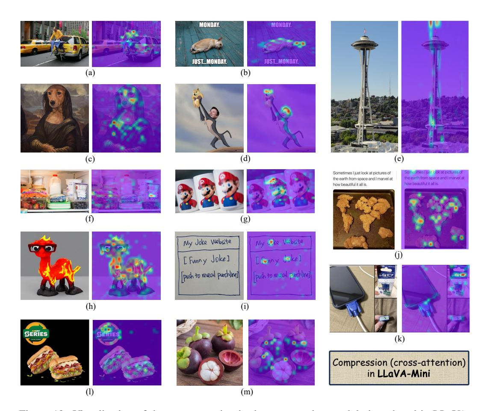

# F VISUALIZATION OF COMPRESSION

LLaVA-Mini introduces query-based compression to adaptively compress vision tokens while preserving essential information. The learnable queries in compression module interact with all vision tokens through cross-attention to capture key visual information. To verify the effectiveness of the proposed compression, Figure [12](#page-22-1) visualizes the cross-attention during the compression process. Across various image types and styles (e.g., photographs, text, screenshots, and cartoons),

Figure 12: Visualization of the cross-attention in the compression module introduced in LLaVA-Mini. The left side is the original image, and the right side is the cross-attention distribution heat map, where brighter areas are more heavily weighted during compression. The example images are all from the LLaVA-Bench-in-the-Wild benchmark.

LLaVA-Mini's compression exhibits strong interpretability, effectively extracting key visual information from images. In cases where critical information is concentrated (such as (b), (d), (h), (i) in Figure [12\)](#page-22-1), LLaVA-Mini focuses on these key locations. Conversely, in cases where the main object is unclear. (such as (f), (j), (i), (m) in Figure [12\)](#page-22-1), LLaVA-Mini exhibits a more dispersed attention pattern during the compression process, thereby preserving a broader range of visual information.

In particular, for complex image like Figure [12\(](#page-22-1)k), which contain multiple sub-figures with logical relationships, the proposed compression module adaptively pay attention to the VGA-shaped charger, the product name on the charger packaging, and the charging port of the charger, demonstrating the superiority of the proposed compression. Overall, compared to compression based on average pooling, query-based compression allows LLaVA-Mini to adaptively assign greater weight to key information, effectively retaining important visual details after compression.

