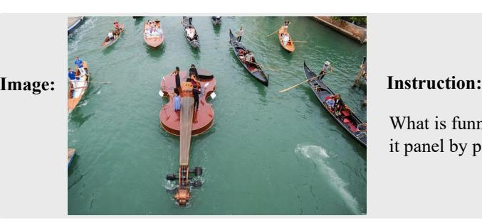
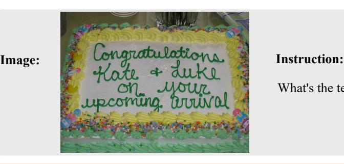
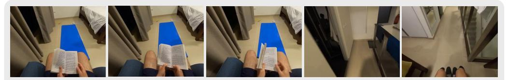

# G MORE CASES

Image Understanding Figure [13](#page-23-0) illustrates an example of LLaVA-Mini's capabilities in more complex image reasoning. The image in Figure [13](#page-23-0) incorporates features such as metaphor and counterfactual reasoning, requiring LMMs to accurately interpret the visual information and reason about the humorous aspects based on the entities present in the scene. The results demonstrate that only LLaVA-Mini and GPT-4o successfully capture the phrases "*the musicians are performing on a giant violin*" and "*The violin, being a large and buoyant object, is placed on the water*", while both Video-LLaVA and LLaVA-v1.5 fail to understand this image. In terms of the perception of

What is funny about this image? Describe it panel by panel.

**LLaVA-Mini**: The image is a creative and humorous take on a traditional concert setting, where the musicians are performing on a giant violin, which is a whimsical and unexpected sight. The violin, being a large and buoyant object, is placed on the water, and the musicians are seated on it as if it were a stage. The presence of the gondolas and the water setting adds to the humor, as it's not a typical environment for a concert. The musicians' serious expressions and the formal attire of the performers contrast with the absurdity of the situation, which is likely intended to be a playful and entertaining spectacle. The image plays on the concept of a concert in a unique and imaginative way, using the visual pun of the violin's shape and the water setting to create a humorous and memorable scene.

**GPT-4o**: This image shows a humorous and creative scene of a boat shaped like a giant violin floating on a canal, surrounded by traditional gondolas. Here's a panel-by-panel description: Central Focus: The Violin Boat – The main object of humor is the boat designed to look like a massive violin or stringed instrument. On top of it, there are people standing or possibly playing music. This design turns an ordinary boat into a whimsical, oversized musical instrument.

Surrounding Gondolas – Around the violin-shaped boat, regular gondolas can be seen with people rowing and sitting in them. These gondolas look tiny compared to the giant violin boat, adding to the comedic contrast. The gondoliers and passengers in these smaller boats seem to be watching or escorting the violin boat, enhancing the spectacle.

Water and Context – The canal is typical of places like Venice, known for its waterways and gondolas. The idea of transforming a boat into a musical instrument on such a canal adds to the absurdity and charm of the scene.

The humor comes from the unusual sight of a giant floating violin on a canal, combining the elegance of music with a quirky, oversized version of an everyday object in a whimsical, realworld setting.

**Video-LLaVA**: The image is a panel of four pictures that showcase a humorous scene of a boat with a man playing a musical instrument on it. The boat is floating in a body of water, and the man is playing a guitar. The funny aspect of the scene is that the boat is shaped like a guitar, making it a unique and amusing sight. The four pictures capture different moments of the man playing the guitar on the boat, showcasing the creativity and humor of the scene.

**LLaVA-v1.5**: The image is a panel of a comic strip featuring a man in a boat, paddling with a paddle. The boat is surrounded by other boats, and the man is wearing a tie. The funny aspect of this image is that the man is wearing a tie while paddling, which is an unusual combination of attire for a boat ride. The scene is set in a river, and there are several people in the boats around him. The man's attire and the presence of multiple boats create a humorous and unexpected visual.

Figure 13: Example demonstrating LLaVA-Mini's image understanding capability on more complex image reasoning. Output marked in red indicates factual errors.

entities in the picture, both Video-LLaVA and LLaVA-v1.5 exhibit hallucinations in their descriptions. Specifically, Video-LLaVA erroneously interprets the image as "*The image is a panel of four pictures*" and "*the man is playing a guitar*", while LLaVA-v1.5 fails to recognize the presence of the violin entirely.

Figure [14](#page-24-0) illustrates an example of LLaVA-Mini's capabilities in a more challenging OCR task. The text in the image is presented in an unusual cursive handwriting style, which can significantly hinder the recognition quality of LMMs. For this challenging OCR case, both LLaVA-Mini and GPT-

What's the text on the cake?

**LLaVA-Mini**: Congratulations Kate & Luke on your upcoming arrival

**GPT-4o**: The text on the cake says: "Congratulations Kate & Luke on your upcoming arrival"

**Video-LLaVA**: The text on the cake reads "Congratulations Kate & Duke on your upcoming arrival!"

**LLaVA-v1.5**: The text on the cake reads "Congratulations Kate & Luke on your upcoming wedding!"

Figure 14: Example demonstrating LLaVA-Mini's image understanding capability on more challenging OCR task. Output marked in red indicates recognition errors.

**Instruction**: Describe what happen in this first person video?

3min video

**LLaVA-Mini**: The first-person video captures a moment of solitude and relaxation, likely in a private space such as a bedroom or a hotel room. The individual is seated comfortably on a chair, engrossed in reading a book, which suggests a moment of leisure or study. The presence of the yoga mat indicates that the person may have been or plans to engage in physical activity, possibly as part of a routine or for relaxation. The room's minimalistic decor and the person's casual attire suggest a setting that is informal and personal. The video does not provide any explicit narrative or context beyond these observations, so any further interpretation would be speculative.

**Video-LLaVA**: In this video, a man is seen sitting on a chair and reading a book. He then stands up and walks towards the bathroom where he takes a shower. After that, he is seen sitting on the floor and reading the book again. The video seems to be a simple yet peaceful depiction of a man's daily routine. The man appears to be calm and relaxed throughout the video, and the setting is minimalistic, with no other characters or objects present. The video's focus is solely on the man and his actions, and the viewer is left to interpret the meaning behind the scenes. Overall, the video is a simple yet intriguing portrayal of a man's daily routine, and it is sure to leave the viewer with a sense of calm and relaxation.

**Video-ChatGPT**: In the video, a man is seen sitting on a chair and reading a book. He then puts the book down and stands up. The video then shows him walking down a hallway and entering a room.

Figure 15: Example demonstrating LLaVA-Mini's video understanding capability on first-person view video. Output marked in red indicates factual errors.

4o accurately identify the text in the image, particularly with LLaVA-Mini using only one vision token. In contrast, Video-LLaVA and LLaVA-v1.5 incorrectly recognize "*Duke*" and "*wedding*", and erroneously add an exclamation mark "!" at the end. Overall, LLaVA-Mini demonstrates superior performance in perceiving and reasoning about visual information.

Video Understanding Figure [15](#page-24-1) illustrates an example of LLaVA-Mini's capabilities in processing longer first-person video. The results show that LLaVA-Mini exhibits a more comprehensive and detailed understanding of the video, effectively capturing entities in the room, such as the yoga mat. In contrast, Video-LLaVA mistakenly imagines "*he takes a shower*" due to its limitation of extracting only 8 frames from the video. Video-ChatGPT provides much shorter responses, lacking some detailed information. Overall, LLaVA-Mini exhibits a superior understanding of the video.

