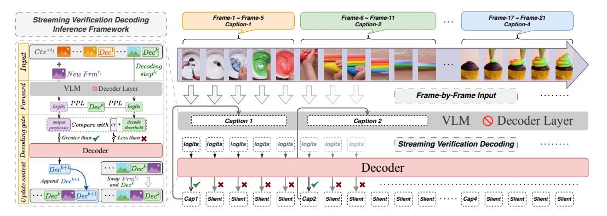
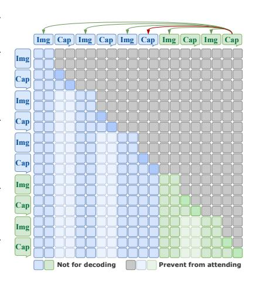

# 3 Method: LiveStar

#### 3.1 Training Strategy

We design a streaming training strategy for aligning streaming video and language using Streaming Causal Attention Masks (SCAM). By constructing interleaved frame-caption sequences, we train LiveStar to incrementally generate temporally consistent captions for streaming video inputs of varying lengths, maintaining narrative coherence across evolving prefixes as the frames progress.

**Streaming Video-Language Alignment** Current Video-LLMs primarily rely on static vision-language foundation models [1, 2, 69] pre-trained on image-text pairs, exhibiting limited adaptation to streaming video-text relationships [10]. These models typically optimize the objective by image/video-text pair alignment:

$$\max P([Txt_i] \mid [Img_i]/[Vid_i]), \tag{1}$$

which fails to address two critical challenges in online video understanding: (1) incremental processing of streaming frames, and (2) dynamic alignment between evolving visual contexts and linguistic outputs. To address them, we propose multi-turn, frame-by-frame instruction tuning that bridges streaming video inputs with language generation through the reformulated objective:

$$\max P([Txt^k] \mid [Ctx^{< t_i}], [Frm^{t_i}]), \ \forall t_i \in C_k,$$

where  $[Frm^{t_i}]$  denotes the video frame at timestamp  $t_i$ ,  $[Ctx^{< t_i}]$  represents the accumulated multimodal context, and  $C_k = \{t_i\}_{i=m}^n$  indicates a **semantic clip** (frames from  $t_m$  to  $t_n$  within the same scene/event/action) sharing semantic text  $[Txt^k]$ . This addresses the pretraining misalignment in existing EOS-based models [20-23] that enforce end-of-sequence token prediction (i.e.,  $\max P(\text{EOS} \mid [Ctx^{< t_i}], [Frm^{t_i}]))$  across non-response frames. Unlike these models, LiveStar achieves streaming consistency through incremental context integration over variable-length video streams. Our method maintains narrative coherence by dynamically updating frame prefixes while preserving evolving visual contexts, establishing *a new paradigm* for streaming video understanding.

Figure 2: **Overview of the streaming verification decoding (SVeD) inference framework:** A dynamic response-silence decoding framework designed to determine optimal response timing for online video understanding.

Interleaved Frame-Caption Sequences To enable multi-turn, frame-by-frame instruction tuning, we construct interleaved frame-caption sequences using a chat-inspired format, which allows LiveStar to incrementally ingest visual inputs while preserving temporal awareness for accurate scene transition detection. Each conversational turn includes: (1) a frame  $[Frm^{t_i}]$  (at timestep  $t_i$ ) and (2) a corresponding caption  $[Cap^k]$  (for the k-th semantic clip). Consecutive frames from the same semantic clip share captions with identical semantics. To mitigate overfitting from repeated caption exposure, we randomly sample a caption  $[Cap^k]$  from a pool of M paraphrased captions.

Streaming Causal Attention Masks To train LiveStar autoregressively on interleaved frame-caption sequences, we address three challenges: (1) Preventing leakage: Alreadygenerated captions within the current semantic clip must be masked when generating the current caption to prevent trivial copying, as they are identical in content. (2) Token-specific context: During autoregression, the model must retain visibility into previously predicted tokens for the current caption to maintain coherence. (3) Scene transition signaling: The last caption of each semantic clip must persist across subsequent frames to explicitly demarcate semantic boundaries. To address these, we propose Streaming Causal Attention Masks (SCAM) (see Fig. 3 for the mask matrix), replacing standard causal attention masks. Formally, when generating the caption for frame  $Frm^{t_i}$  in the clip  $C_k$ , the model is constrained to attend only to all video frames from the preceding clips  $\{C_1, C_2, \dots, C_{k-1}\}$  and the last captions of those clips. The final optimization objective is as follows:

Figure 3: Mask matrix of SCAM.

$$\max P([Cap_i^k] \mid [Ctx^{< t_i} \{Mask^{\le t_i}\}], [Frm^{t_i}]), \ \forall t_i \in C_k.$$

Here, the mask matrix  $Mask^{\leq t_i}$  is designed to block attention to all non-terminal caption tokens from semantic clips  $\{C_1, C_2, \dots, C_k\}$  prior to timestep  $t_i$ , as illustrated in Fig. 1(d).

#### 3.2 Inference Framework

While LiveStar can generate real-time captions at each timestep, determining when to update the response while maintaining content coherence and avoiding redundant outputs remains a critical challenge. To address this, we propose a dynamic response-silence decoding (SVeD) framework (see Fig. 2) and employ memory-aware techniques for acceleration.

**Streaming Verification Decoding** We present SVeD, a dynamic response-silence decoding framework designed to determine optimal response timing for online video understanding. It introduces a *decoding gate* that selectively triggers caption generation based on a streaming verifica-

tion mechanism. At each triggered decoding step  $t_i$ , we compute the perplexity of the generated caption [Dec] as:  $PPL^{t_i}([Dec]) = \sqrt[N]{1/P([Dec] \mid [Ctx^{< t_i}], [Frm^{t_i}])}$ , where N represents the token count of [Dec], and  $P(\cdot)$  is the autoregressive probability derived from token logits. For each incoming frame  $[Frm^{t_j}]$ , SVeD performs a single forward pass to verify the latest caption's validity by recomputing  $PPL^{t_j}([Dec])$ . If  $PPL^{t_j}([Dec]) > \alpha \cdot PPL^{t_i}([Dec])$  (where  $\alpha$  is a tunable scaling factor), the gate activates decoding at  $t_j$ , generating an updated caption. Otherwise, move [Dec] to the end of [Ctx] without decoding, preserving temporal coherence while minimizing latency. Under the same model architecture, SVeD achieves faster inference than decoding an EOS token to indicate a silent response. This lightweight verification step ensures adaptive response timing, balancing accuracy and efficiency. For details, refer to Alg. 1.

Peak-End Memory Compression Modern streaming videos often span hours with high frame rates, posing computational challenges for long-term understanding. Inspired by the Peak-End cognitive rule [70-72]—where human memory retention prioritizes salient moments (keyframes) and recent experiences (summaries)—we propose a memory compression framework tailored for 10+ minute video analysis at 3 fps. Our method leverages two critical signals: (1) Keyframe detection: We have computed the perplexity  $PPL^{t_i}([Dec])$  for each frame, where lower values indicate higher semantic importance. (2) Temporal summarization: The final frame's caption of each semantic clip encapsulates event semantics. To optimize memory, we probabilistically prune frames older than a window W, with deletion likelihood proportional to both the relative PPL within its semantic clip and elapsed time. Experiments demonstrate that it achieves optimal semantic accuracy (SemCor) and minimal timing difference (TimDiff) compared to Uniform Dropout and FIFO Forgetting, as shown in Tab. 4.

