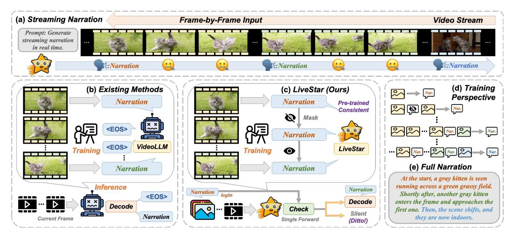

# 1 Introduction

Recent advancements in Large Vision-Language Models (LVLMs) [\[1](#page-10-0)[–5\]](#page-10-1) have substantially propelled the development of Video Large Language Models (Video-LLMs) [\[6](#page-10-2)[–10\]](#page-10-3). These cutting-edge models have been instrumental in pushing the boundaries of multimodal AI systems through innovations in spatial-temporal reasoning [\[11–](#page-10-4)[13\]](#page-10-5), memory-enhanced processing [\[14–](#page-10-6)[16\]](#page-10-7), and long-term video understanding [\[17](#page-10-8)[–19\]](#page-10-9), particularly enhancing capabilities in offline scenarios.

Building on these advances, researchers are increasingly exploring live streaming assistants for online video understanding [\[20](#page-11-0)[–25\]](#page-11-1), which remain always-on, reason through time, and provide real-time responses. However, existing online Video-LLMs [\[25](#page-11-1)[–27\]](#page-11-2) struggle to process frame-byframe inputs and determine response timing, as shown in Fig [1\(](#page-1-0)a). To effectively process continuous video streams and generate timely responses, such models must possess temporal decision-making capabilities—responding at contextually appropriate moments rather than producing repetitive outputs

∗Corresponding author: shengsheng.qian@nlpr.ia.ac.cn

Figure 1: Illustration of online video understanding. (a) Taking the RNG task as an example, online video understanding requires Video-LLMs to handle continuous streams and output at appropriate times; (b) Existing methods overly rely on learning the EOS token, leading to poor inference performance; (c)-(e) LiveStar establishes an effective response-silence training and inference framework by SCAM and SVeD without compromising basic video understanding capabilities.

or default "I don't know" responses for each frame. To address this, VideoLLM-online [\[20\]](#page-11-0) designs a streaming EOS (End-Of-Sequence) prediction mechanism (Fig. [1\(](#page-1-0)b)). It ingests video streams, determines response timing based on user queries, and generates EOS tokens to mark silence intervals. Subsequent advancements like VideoLLM-MoD [\[21\]](#page-11-3) and LION-FS [\[22\]](#page-11-4) have further refined this EOS-based framework, achieving improved computational efficiency and response accuracy.

However, current online Video-LLMs exhibit excessive reliance on the EOS token, which leads to four critical issues: (1) Response-Silence Imbalance: Frames requiring EOS tokens as output vastly outnumber those generating normal responses [\[23\]](#page-11-5). For example, in a 1-minute video at 3 FPS with 5 response intervals, the response-to-silence ratio becomes 1:35. (2) Consecutive Frame Inconsistency: As shown in Fig. [1\(](#page-1-0)b), adjacent visually similar frames may produce conflicting outputs—one generating a full narration while the other outputs only the EOS token. This inconsistency disrupts model convergence during fine-tuning. (3) Pre-training Misalignment: While pretraining aligns image-text pairs, silent states enforce a mapping from input frames to EOS tokens, contradicting the pretraining objective of meaningful visual-language correspondence. (4) Vocabulary Confusion: Since the EOS token is embedded in the vocabulary as a regular token, its frequent appearance in responses pollutes semantic coherence, introducing ambiguity and conflicting with normal outputs. These issues hinder model training effectiveness and degrade base video understanding capabilities, as the forced response-silence mechanism compromises the visual-language alignment. Motivated by this critical gap, we aim to address Challenge 1: How to establish an effective response-silence training and inference framework without compromising basic video understanding capabilities?

Moreover, online Video-LLMs face challenges due to limited diversity in training data and evaluation scope, failing to fully encompass the online applications encountered in real-world scenarios. For instance, prominent models [\[20](#page-11-0)[–22\]](#page-11-4) primarily focus on first-person video analysis through training on Ego4D [\[28\]](#page-11-6). Although StreamMind [\[23\]](#page-11-5) extends its reach to sports scenarios with SoccerNet [\[29\]](#page-11-7), its scope remains severely constrained. Recent efforts like SVBench [\[30\]](#page-11-8), OVO-Bench [\[31\]](#page-11-9), and StreamBench [\[32\]](#page-11-10) have pioneered online evaluation by assessing models' ability to process videos synchronously during playback. However, these benchmarks focus exclusively on video question answering and lack coverage of diverse real-world tasks. In practice, beyond first-person devices, online scenarios span live streaming platforms, surveillance systems, and cinematic tools, requiring capabilities like real-time interactive editing [\[33,](#page-11-11) [34\]](#page-11-12), streaming narration, and temporal grounding in continuous streams. Current evaluation benchmarks present three critical limitations: (1) Narrow scenario coverage limited to specific domains, (2) Single-task evaluation focused on video question answering, and (3) Offline assessment of temporal reasoning and response timing. These shortcomings motivate us to tackle Challenge 2: How to construct a comprehensive dataset and

benchmark encompassing diverse real-world scenarios and tasks for holistic evaluation of online video understanding?

To deal with the above challenges, we introduce LiveStar, an innovative live streaming assistant that enables online video understanding across diverse scenarios, delivering context-aware responses at semantically relevant moments through adaptive streaming decoding. For Challenge 1, we establish a streaming response-silence paradigm featuring two key innovations: (1) a streaming video-language alignment strategy using Streaming Causal Attention Masks (SCAM) during training, and (2) a Streaming Verification Decoding (SVeD) mechanism for inference. During training, we construct interleaved frame-caption sequences where revealed video frames progressively align with their corresponding captions through causal masked attention constraints (Fig. [1\(](#page-1-0)d)), maintaining consistency with standard multimodal pre-training paradigms. For streaming inference, SVeD employs single-pass verification to determine optimal response timing: it suppresses redundant outputs by comparing current content with previous responses, maintaining narrative continuity through strategic silence. To handle extended video contexts, we implement a peak-end memory compression strategy that prioritizes salient keyframes and final captions, enabling efficient processing of long videos by focusing on semantically rich content while accelerating inference through streaming key-value cache. For Challenge 2, we introduce OmniStar, a dataset for training and benchmarking that encompasses diverse real-world scenarios and evaluation tasks in online video understanding. The dataset includes carefully annotated real-time narration, streaming QA, and streaming video grounding tasks on 20,137 videos, evaluated through an online setting that better simulates real-world conditions compared to traditional offline settings. Extensive experiments conducted on three benchmarks demonstrate that LiveStar achieves state-of-the-art results for online video understanding.

In summary, our contributions can be summarized as follows:

- We present LiveStar, an innovative live streaming assistant for online video understanding, capable of performing real-time comprehension on continuous video streams across diverse real-world scenarios and online tasks, while responding at contextually appropriate moments.
- We design a streaming video-language alignment training strategy using Streaming Causal Attention Masks (SCAM). By constructing interleaved frame-caption sequences, we train LiveStar to generate temporally consistent captions incrementally for variable-length streaming video inputs, maintaining narrative coherence across evolving frame prefixes.
- We propose Streaming Verification Decoding (SVeD), a response-silence decoding framework that determines optimal response timing via a single forward pass verification. Furthermore, SVeD mimics human-like memory consolidation through a peak-end rule-based strategy, distilling long video contexts by prioritizing salient frames to accelerate processing.
- We introduce OmniStar, a comprehensive dataset for training and benchmarking that encompasses 15 diverse real-world scenarios and 5 evaluation tasks in online video understanding. Extensive experiments across three benchmarks demonstrate LiveStar's state-of-the-art performance, achieving an average 19.5% improvement in semantic correctness with 18.1% reduced timing difference compared to existing online Video-LLMs across all five OmniStar tasks.

