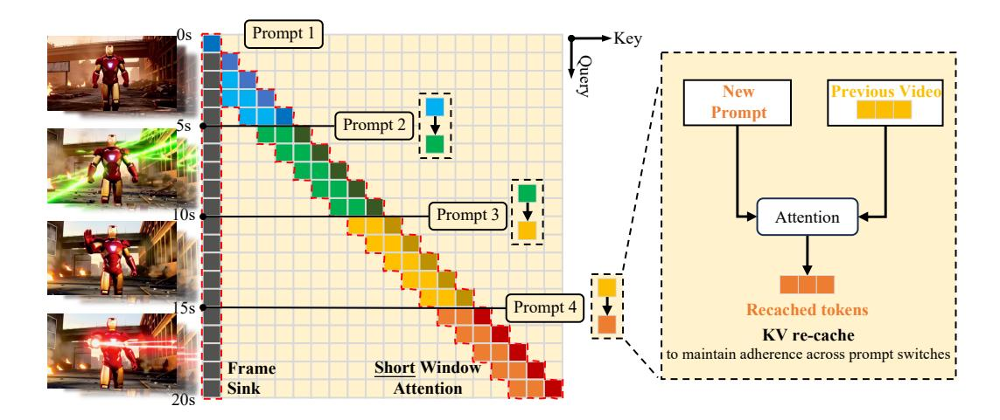

# 1 INTRODUCTION

Long video generation is essential for advancing creative, educational, and cinematic applications. It enables coherent storytelling, richer scene development, and more complex temporal dynamics than short clips can provide. However, static prompt-based generation limits adaptability once the

Figure 2: The framework of LONGLIVE. (Left) LONGLIVE processes sequential user prompts and generates a corresponding long video using efficient short window attention and frame sink. Compared to the normal attention window of 5s, our short window only uses half the size, with the help of frame sink, which maintains the long-range consistency. (Right) To maintain consistency when the prompt switches, LONGLIVE employs a KV-recache technique that updates cached key–value states by combining previous videos with new prompt embeddings through cross-attention layers.

process has commenced. It is difficult for users to conceive highly detailed, long-form prompts in a single step. Beyond simply producing long videos, the ability to interact alongside the generation process, such as streaming prompt inputs during runtime, opens new possibilities for adaptive content creation. This interactive paradigm enables users to guide narratives, adjust visual styles, or introduce new elements on the fly. Therefore, interaction makes long video generation controllable.

Interactive long video generation poses difficulties in both quality and efficiency. For the *quality* perspective, it is difficult to maintain smooth, consistent, and coherent transitions when switching between user prompts during generation. Even subtle mismatches in visual style, motion continuity, or scene layout can disrupt the narrative flow and reduce the overall realism of the video. For the *efficiency* perspective, the computational and memory demands scale rapidly with video length. For example, generating a 180-second video with the Wan-2.1 [\(Wan et al.,](#page-11-0) [2025\)](#page-11-0) model requires processing over one million tokens, which is computationally prohibitive. In addition, in an interactive setting, prolonged user waiting times severely degrade the overall user experience.

Existing video generation methods have limitations in long video generation. For *diffusion-based* video generation models [\(Wan et al.,](#page-11-0) [2025;](#page-11-0) [Kong et al.,](#page-10-0) [2024;](#page-10-0) [Yang et al.,](#page-11-1) [2025;](#page-11-1) [Wei et al.,](#page-11-2) [2025;](#page-11-2) [OpenAI,](#page-10-1) [2024;](#page-10-1) [Kuaishou,](#page-10-2) [2024\)](#page-10-2) and *diffusion-forcing* models [\(Chen et al.,](#page-9-0) [2024a;](#page-9-0) [2025a;](#page-9-1) [Zhang &](#page-12-0) [Agrawala,](#page-12-0) [2025\)](#page-12-0), although they can produce high-quality short clips, their reliance on bidirectional attention makes inference inefficient. The bidirectional attention prevents KV (key–value) cache technique, leading to redundant computation and prohibitive latency for long videos. For example, SkyReels-V2 [\(Chen et al.,](#page-9-1) [2025a\)](#page-9-1) requires approximately 50 minutes on an H100 GPU to generate a 60-second video. For *AR* models with causal attention, they can leverage cached KV states for faster inference, but they often exhibit degraded quality when generating long videos. Due to the high cost of directly training on long videos, existing AR models [\(Huang et al.,](#page-9-2) [2025;](#page-9-2) [Teng et al.,](#page-11-3) [2025\)](#page-11-3) typically adopt a train-short-test-long strategy. Consequently, the quality gradually degrades as the video length increases. In the interactive setting involving prompt switching, error accumulation, and loss of temporal coherence over time further result in visual artifacts and inconsistency.

In this paper, we propose LONGLIVE, a real-time interactive long video generation framework, as illustrated in Figure [1.](#page-0-0) LONGLIVE is a causal attention, frame-level AR video generation model, enabling it to inherit the KV cache mechanism for efficient inference. Our key design is *KV-recache*, as shown in Figure [2,](#page-1-0) which updates cached states by incorporating new prompt embeddings. This technique ensures both smoothness and prompt adherence across prompt switches in interactive settings. In addition, for efficient fine-tuning, we present a *streaming long tuning* strategy that preserves consistency between training and inference (train-long-test-long), to address the degradation commonly observed in long-video AR generation. For efficient inference, we introduce *short window attention* combined with a *frame-level attention sink* (abbreviated as frame sink), which significantly accelerates inference while preserving performance.

In our experiments, LONGLIVE delivers both high efficiency and strong quality for interactive longvideo generation. In terms of training efficiency, we fine-tune a 1.3B-parameter model to produce high-quality minute-long videos in only 32 GPU-days. Training on long videos is essential: it not only improves long-horizon fidelity but also enables efficient inference strategies that markedly accelerate decoding. In terms of inference efficiency, LONGLIVE sustains 20.7 FPS on a single NVIDIA H100, supporting real-time interaction and outperforming state-of-the-art approaches in throughput. In terms of quality, our framework achieves strong VBench scores on both short- and long-video settings. LONGLIVE scales to produce videos up to 240 seconds, on a single H100 GPU, while maintaining high visual fidelity and temporal coherence, effectively handling long video generation with little degradation. Moreover, we further enable INT8-quantized inference in LONGLIVE, with only marginal quality loss, as shown in Appendix [G.](#page-16-0)

## 2 RELATED WORK

We present core related work here and provide extended discussion with details in the appendix [D.](#page-13-0) A growing number of works [\(Chen et al.,](#page-9-0) [2024a;](#page-9-0) [Song et al.,](#page-10-3) [2025;](#page-10-3) [Mao et al.,](#page-10-4) [2025;](#page-10-4) [Yuan et al.,](#page-12-1) [2025;](#page-12-1) [Zhang & Agrawala,](#page-12-0) [2025;](#page-12-0) [Gao et al.,](#page-9-3) [2025;](#page-9-3) [Henschel et al.,](#page-9-4) [2025;](#page-9-4) [Gao et al.,](#page-9-3) [2025\)](#page-9-3) integrate diffusion modeling with AR prediction, an intermediate paradigm between purely diffusion-based approaches and purely AR approaches. SkyReels-V2 [\(Chen et al.,](#page-9-1) [2025a\)](#page-9-1) couples diffusion forcing with a film-structure planner and multimodal controls. Recent efforts [\(Yin et al.,](#page-11-4) [2025;](#page-11-4) [Huang](#page-9-2) [et al.,](#page-9-2) [2025;](#page-9-2) [Gu et al.,](#page-9-5) [2025;](#page-9-5) [Teng et al.,](#page-11-3) [2025\)](#page-11-3) have advanced causal AR-based models for long video generation. StreamDiT [\(Kodaira et al.,](#page-10-5) [2025\)](#page-10-5) trains a diffusion model with window attention, but has potential drift or detail loss over long streams. Most recently, Self-forcing [\(Huang et al.,](#page-9-2) [2025\)](#page-9-2) addresses the train–test gap in AR video diffusion by simulating inference conditions during training, rolling out generation with KV cache, and conditioning on model outputs. MAGI-1 [\(Teng](#page-11-3) [et al.,](#page-11-3) [2025\)](#page-11-3) scales AR video generation to large models and datasets through chunk-wise prediction, but its prompt switching requires manual adjustment of KV-cache windows at different steps.

