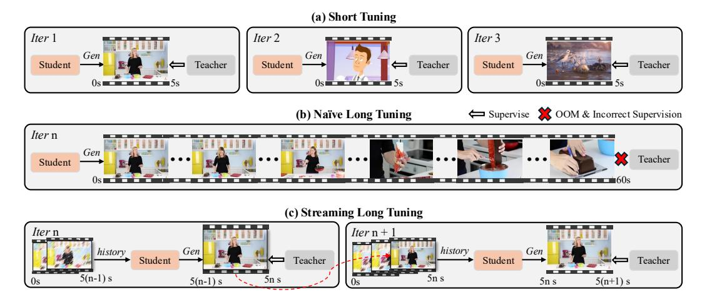
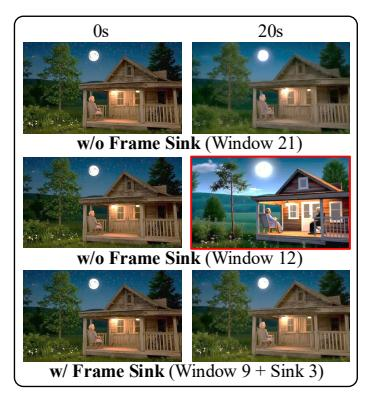
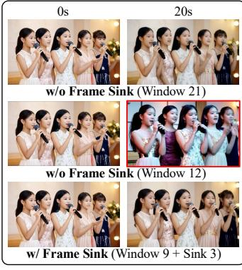

# 3 METHOD

#### 3.1 KV RECACHE

Causal AR models naturally support interactive prompt switching, but this ability is limited. Discarding all prior KV cache at the switch improves adherence to the new prompt, yet it introduces abrupt visual changes and temporal discontinuities, as shown in Figure [3](#page-3-0) (a). Conversely, retaining the entire KV cache often prevents the model from following new prompts, or adapting to new prompts after a delay, because the cache is saturated with information from the previous prompt, as shown in Figure [3](#page-3-0) (b). Based on this observation, we first diagnose why prompt switching is hard for streaming video generators. In DiT [\(Peebles & Xie,](#page-10-6) [2023\)](#page-10-6) architectures, cross-attention and self-attention layers alternate. During generation, large amounts of information from the previous prompt are repeatedly injected through cross-attention layers and then propagated forward by selfattention, so that this prompt signal is written into the running KV cache. Consequently, when the prompt is switched, the model still carries residual semantics of the old prompt in the cache. And in certain instances, this results in inconsistent adherence to the new prompt.

To address this issue, we introduce KV recache. At a prompt switch boundary, we recompute the KV cache using the already generated frames together with the new prompt, effectively erasing residual information from the previous prompt while keeping the motion and visual cues that guarantee temporal continuity. Concretely, at the first post-switch frame, we encode the generated video prefix as the visual context and pair it with the next prompt to rebuild the cache; subsequent steps then proceed normally using this refreshed cache. In this way, the cache retains the visual state of the ongoing video, but the prompt semantics now cleanly correspond to the active prompt, enabling improved semantic alignment without visual discontinuities.

Figure 3: Prompt switching under different KV-cache strategies. (a) w/o KV cache: New prompt takes effect, but transitions are abrupt and visuals are inconsistent. (b) w/ KV cache: Smooth continuity, but the new prompt is not followed (lag or ignore). (c) KV re-cache: Smooth, visually consistent transitions with full new-prompt compliance.

To ensure train–inference alignment, we integrate the recaching operation into our training loop (Figure [4\)](#page-4-0). When a training iteration contains a prompt switch, we (i) perform recache once, (ii) continue rollout with the updated cache, and (iii) in distillation, feed the teacher model with the new prompt as well, so the student is supervised under the exact post-switch condition it will face at inference. This training scheme further removes the train-inference mismatch. Models trained with recache therefore exhibit both strong temporal smoothness and fast semantic convergence to the next prompt at inference, as illustrated in Figure [3](#page-3-0) (c). In terms of efficiency, recaching is invoked only once per training sample. The added cost is thus minimal; for a 10s video with a single switch, recaching introduces only about 6% extra time cost compared to no recaching usage.

Moreover, although training includes only one prompt switch per long sequence, this mechanism generalizes well during inference. The model supports interactive inference with multiple prompt switches by performing a single recaching step at each boundary. Given n + 1 prompts and n switch points, the generator rolls out causally, applies KV recaching at each switch, and continues producing frames semantically aligned with the active prompt while maintaining smooth transitions. A detailed illustration of this procedure is outlined in Appendix Algorithm [2.](#page-14-0)

#### 3.2 STREAMING LONG TUNING

LongLive builds upon causal frame-level AR video generators. These models are trained only on short clips. At inference, they produce long videos via a rolling, fixed-length context window that repeatedly feeds the model its own outputs. As the rollout continues, small prediction errors accumulate and the context inside the window becomes progressively noisier, so the model conditions on a more degraded self-generated history. Since such long-range, self-generated contexts were absent in training, this *train-short–test-long* regime induces content drift and breaks consistency over long horizons. To address this mismatch, we propose a *train-long–test-long* strategy. During training, the model synthesizes long sequences by conditioning on its own imperfect predictions, with supervision applied throughout the entire rollout. This exposes the model to extended, self-generated, and progressively degraded frames already in training, aligning training with inference, mitigating error accumulation to improve fidelity and consistency.

Self-supervision [\(Huang et al.,](#page-9-2) [2025\)](#page-9-2) methods are able to avoid collecting a large long-video dataset. It requires no real video data: a pretrained teacher provides synthetic supervision that guides the student to match the teacher's output distribution. However, two practical challenges arise in this method. First, the teacher itself is typically trained for short clips and thus cannot reliably supervise

Figure 4: The streaming long tuning pipeline. (a) Short tuning: only 5s clips are supervised, like Self-Forcing [\(Huang et al.,](#page-9-2) [2025\)](#page-9-2), leading to quality loss on long videos. (b) Naive long tuning: naively scaling to long sequences causes incorrect teacher supervision and OOM. (c) Streaming long tuning: our approach trains on long sequences by reusing the historical KV cache each iteration to generate the next 5s clip, then supervising it with the teacher.

an entire long sequence end-to-end. Second, na¨ıvely unrolling and backpropagating through long sequences easily triggers out-of-memory (OOM) issues and is computationally wasteful.

To address these two challenges, we introduce a streaming long tuning procedure (Figure [4\)](#page-4-0) that learns on long videos while keeping memory and supervision local and reliable. In the first iteration, the generator samples a short video clip (e.g., 5s) from scratch, and we apply DMD [\(Yin et al.,](#page-11-5) [2024b;](#page-11-5)[a\)](#page-11-6) on this short clip. In subsequent iterations, the generator extends the short clip from the previous iteration, and produce the next short clip conditioned on the previously stored KV cache, and we again apply DMD only to this newly generated clip. We repeat this rolling extension until the video reaches a preset maximum length, then fetch a new batch and restart from scratch. This schedule mirrors the inference-time rollout and thus reduces train–test inconsistency. At each iteration, the teacher provides reliable supervision for the current short clip (where it is competent), and the collection of per-clip supervisions provides global guidance for the full sequence. In practice, we detach the already generated frames so they act as a constant causal context. The gradients are computed only for the current generated clip. Consequently, memory usage is limited by the clip duration, avoiding OOM. A detailed illustration of this process appears in Appendix Algorighm [1.](#page-14-0)

Our study reveals that tuning on long videos is not only critical for the performance of long video generation, but also a prerequisite for efficient long inference strategies. These strategies include window attention and frame sink, which significantly improve inference speed.

#### 3.3 EFFICIENT LONG INFERENCE

Short-window Attention In long video generation, the cost of dense causal attention grows quadratically with the sequence length, making naive inference prohibitive on long videos. Motivated by evidence of temporal locality in video generation: nearby frames contribute more to predicting the next one [\(Gu et al.,](#page-9-5) [2025;](#page-9-5) [Zhang & Agrawala,](#page-12-0) [2025\)](#page-12-0), we adopt local window attention during inference and during streaming tuning. Limiting attention to a fixed temporal window reduces both computation and memory. Attention complexity becomes proportional to the window size rather than the growing sequence length, and the KV cache needed per layer scales with the window rather than the total video. However, window size introduces a quality–efficiency trade-off. We generate 20-second videos using different attention window settings, as shown in the first and second rows in Figure [5.](#page-5-0) Larger windows retain more temporal context and yield stronger longrange consistency, but incur higher latency and memory. Shrinking the window improves efficiency at the cost of consistency, since distant but critical cues disappear from the receptive field.

Figure 5: Comparison in a 20-second generated video of long window attention (Window 21 latent frames), short-window attention (Window 12), and short-window + frame-sink (Window 9 + Sink 3). Shorter windows boost efficiency but weaken long-range consistency; adding a frame-sink restores consistency while keeping the efficiency gains.

Frame Sink Prior work reported that attention-sink tokens alone do not prevent long-rollout collapse in video models [\(Huang et al.,](#page-9-2) [2025\)](#page-9-2). In contrast, we empirically find that attention sinks become effective once long-rollout collapse is addressed via streaming long tuning. Serving as persistent global anchors, attention sinks markedly improve long-range temporal consistency, thereby mitigating the quality–efficiency trade-off when using short-window attention. As shown in the third row of Figure [5,](#page-5-0) adding a frame-sink greatly boosts long-range consistency under a short window while maintaining low cost. Concretely, we fix the first frame chunk of the video as global sink tokens; these tokens are permanently retained in the KV cache and concatenated to every attention block's keys and values, making them globally attendable even with local-window attention. The remainder of the KV cache uses a short rolling window and is evicted normally. In experiments, a short-window with a frame-sink preserves high long-video quality while reducing end-to-end compute time by 28% and peak memory by 17% on a single H100 GPU.

Consistency between Training and Inference We integrate short-window attention and the frame sink into streaming tuning to align train-test behavior and improve efficiency. Let the local attention window be W frames and the supervised clip length (from the teacher) be T frames. At each training step, we keep (i) the KV cache from the last W frames of the preceding context *without gradients* and (ii) the full KV cache of T frames for the current supervised clip *with gradients*. We also maintain S sink tokens (the first two frames) that are never evicted and are concatenated to every layer's KV so they remain globally attendable. Consequently, the resident KV size per step is O(W+T+S) and does *not* grow with total video length, preventing OOM on very long rollouts. The sinks stabilize identity and scene semantics, allowing us to train with the same shortened window used at inference. For KV re-caching, we rebuild the cache from only the most recent W generated frames, which refreshes semantics while preserving local continuity and saves the re-caching cost.

