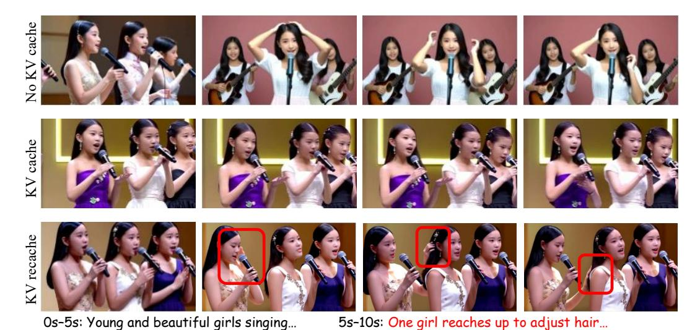

# M LIMITATION ANALYSIS

LONGLIVE is an efficient fine-tuning scheme built on top of a pretrained base model, so its ultimate performance is bounded by the capacity and quality of that base model. In particular, we adopt a self-supervised fine-tuning strategy without additional curated real-video data. While this improves efficiency and scalability, it also limits the method's ability to correct systematic errors or biases inherited from the base model. Consequently, the quality of any short segment (e.g., per 10-s clip) is unlikely to consistently exceed that of the base model, even if long-horizon consistency or instruction adherence improves. Therefore, our gains are primarily in adaptation and stabilization rather than absolute ceiling quality. Future work could incorporate supervised data to avoid the quality bound.

Figure B: Interactive 60s videos with sequential prompts. See our [Demo Page](https://nvlabs.github.io/LongLive) for more examples.

Figure C: Single-prompt 60 s videos. See our [Demo Page](https://nvlabs.github.io/LongLive) for more examples.

0s–5s: a steaming burger—seared patty (crisp edges, pink center), melted cheddar, lettuce, tomato, pickles, special sauce—on a lightly charred sesame bun.

5s–10s: fresh pepper sprinkles onto a hot patty under melted cheddar with lettuce, tomato, pickles, special sauce on a charred sesame bun.

Figure D: We present qualitative results from the ablation study of KV re-caching. See our [Demo](https://nvlabs.github.io/LongLive) [Page](https://nvlabs.github.io/LongLive) for more examples. No KV cache: New-prompt adherence but abrupt transitions and visual

discontinuity. KV cache: Smooth visuals but new-prompt non-adherence (delayed or ignored). KV recache: Visual consistency and new-prompt adherence.