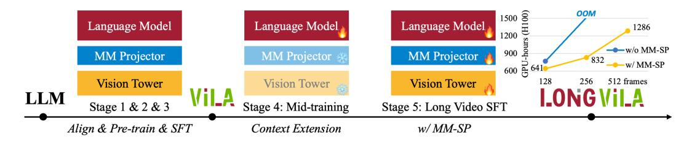
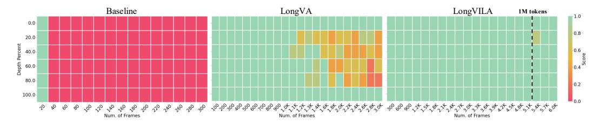

# 1 INTRODUCTION

Integrating multi-modal understanding with long-context capability is important. A foundation model supporting more modalities can take more flexible input signals so that people can interact with the model in more diverse manners, *e.g.,* GPT-4o-like multi-modal chatbot, multi-modal web agent [\(Koh et al., 2024\)](#page-12-0), and real-world robotics foundation model [\(Brohan et al., 2022;](#page-10-0) [2023;](#page-10-1) [Padalkar et al., 2023\)](#page-13-0). Longer context enables models to process more information, *e.g.,* long documents, repo-level codebase, and hour-length video, which similarly provides required features to more real-world applications.

While some works have enabled long-context Vision-Language Models (VLMs) [\(Lin et al., 2023b;](#page-12-1) [Weng et al., 2024\)](#page-13-1), they employ simplified approaches rather than offering a comprehensive solution. For instance, LongVA [\(Zhang et al., 2024b\)](#page-14-0) relies on long-context LLMs and trains models on short-context data. LongVLM [\(Weng et al., 2024\)](#page-13-1) utilizes token compression to circumvent context extension. These approaches sidestep more challenging issues, such as the development of a robust long-context multi-modal training framework and corresponding dataset design.

A full-stack design is crucial for long-context Vision-Language Models (VLMs). Training large models is typically a complex, systematic endeavor that demands both data engineering [\(Betker](#page-10-2) [et al., 2023;](#page-10-2) [Ouyang et al., 2022;](#page-13-2) [Zhou et al., 2024\)](#page-14-1) and system-software co-design [\(Lepikhin et al.,](#page-12-2) [2020;](#page-12-2) [Chowdhery et al., 2023;](#page-10-3) [Shoeybi et al., 2019;](#page-13-3) [Brown et al., 2020;](#page-10-4) [Dehghani et al., 2023\)](#page-11-0). Unlike text-only LLMs, VLMs (*e.g.,* LLaVA [\(Liu et al., 2023c\)](#page-12-3)) often require distinct model architectures and flexible distributed training strategies. Additionally, long-context modeling necessitates

∗Algorithm Lead. † System Lead. The first four authors have equal contributions.

Figure 1: The LongVILA training pipeline. In Stages 1 through 3, the process starts with alignment, pre-training, and supervised fine-tuning. In Stage 4, the model undergoes mid-training context extension. Finally, in Stage 5, the model is fine-tuned for long video understanding with Multi-Modal Sequence Parallelism (MM-SP).

Figure 2: Comparison of Needle in the Long Video Haystack Experiment. The 32-frame baseline model (left) can not retrieve right needles after 32 frames. LongVA (middle) achieves 87.6% accuracy in 3,000 frames. In contrast, the LongVILA model (right), trained on 2048 frames, presents 99.8% accuracy on 6,000 frames (more than 1 million context length).

not only long-context data to fully utilize the model's capabilities [\(Fu et al., 2024c;](#page-11-1) [Chen et al., 2023\)](#page-10-5) but also infrastructure capable of supporting memory-intensive long-context training [\(Li et al., 2021;](#page-12-4) [Jacobs et al., 2023;](#page-11-2) [Li et al., 2023a\)](#page-12-5). Therefore, a full-stack design, encompassing training pipeline and system, is indispensable for long-context VLMs.

In this work, we introduce LongVILA, a comprehensive solution for long-context VLMs. For training pipeline, we implement a five-stage training curriculum as Figure [1:](#page-1-0) (1) multi-modal alignment, (2) large-scale pre-training, (3) short supervised fine-tuning, (4) context extension for LLMs, and (5) long supervised fine-tuning. For system, we establish an efficient and user-friendly framework, namely Multi-Modal Sequence Parallelism (MM-SP), which supports training and inferencing memory-intensive long-context VLMs.

LongVILA-7B presents strong performance on 9 popular benchmarks, *e.g.,* 65.1% on VideoMME [\(Fu et al., 2024a\)](#page-11-3) with subtitle. The LongVILA model, trained on 2048 frames, achieves 99.8% accuracy in the needle-in-a-haystack experiments with 6,000 frames, with a context length of more than 1 million tokens. In ablations, by increasing the number of video frames using LongVILA, the performance on VideoMME in long videos consistently improves (Figure [3\)](#page-2-0). Our MM-SP system can efficiently scale the context length up to 2 million tokens without gradient checkpointing, achieving 2.1× to 5.7× speedup compared to ring style sequence parallelism, and 1.1× to 1.4× compared to Megatron with a hybrid context parallelism and tensor parallelism.

