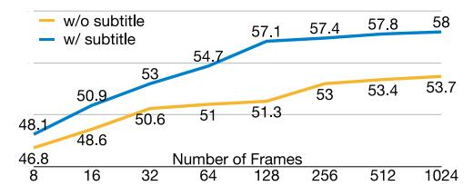
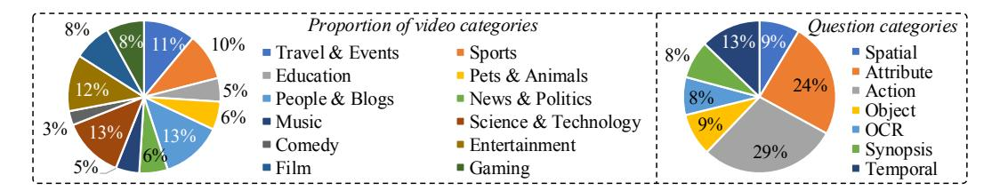
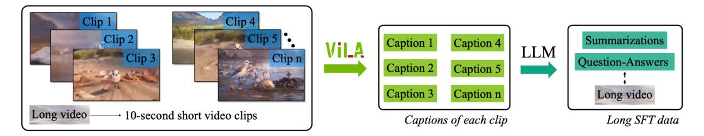
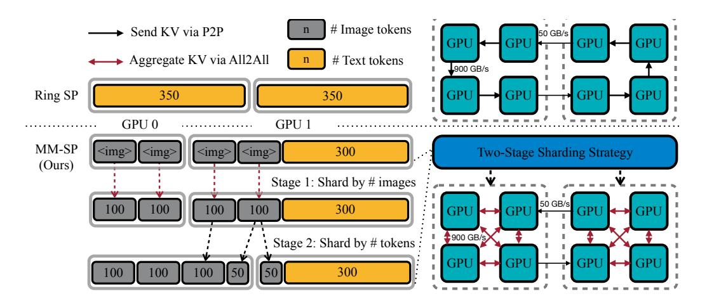

# 2 RELATED WORKS

Visual language model architecture. There are two predominant designs for VLMs: the encoderdecoder architecture (*e.g.,*, LLaVA [\(Liu et al., 2023c\)](#page-12-3), PaLM-E [\(Driess et al., 2023\)](#page-11-4)) and the decoderonly architecture (*e.g.,*, Fuyu [\(Bavishi et al., 2023\)](#page-10-6), Chameleon [\(Team, 2024\)](#page-13-4)). Encoder-Decoder VLMs connect the vision encoder to the LLM decoder through a multi-modal projector. Certain multi-modal projectors, such as spatial pooling and Q-former, significantly reduce the number of tokens per image or video frame, thereby lowering the computational burden on the LLM decoder. In contrast, decoder-only LLMs typically process raw patches as input without hierarchical token pooling, making it more challenging to reduce the token count for each image or frame. In this work, we build on VILA [\(Lin et al., 2023b\)](#page-12-1) as our foundation. It is worth noting that enhanced variants

Figure 3: Scaling video frames improves VideoMME accuracy in long category.

| Training    | VideoMME |       |        |      |  |  |  |  |  |
|-------------|----------|-------|--------|------|--|--|--|--|--|
| Stages      | Average  | Short | Medium | Long |  |  |  |  |  |
| 1-2-3-4-5   | 57.5     | 69.3  | 56.1   | 47.0 |  |  |  |  |  |
| 1-2-4-(3&5) | 55.9     | 67.4  | 54.1   | 46.1 |  |  |  |  |  |
| 4-1-2-3-5   | 56.0     | 69.2  | 54.1   | 44.5 |  |  |  |  |  |
| 4-1-2-(3&5) | 55.3     | 67.2  | 53.6   | 45.1 |  |  |  |  |  |

Table 1: Ablations on various training stage settings on VideoMME (without subtitle). (3&5) means joint training of the stage 3 and 5.

of VILA exist, such as VILA2(Fang et al., 2024) for improved performance and X-VILA(Ye et al., 2024) for cross-modality understanding, reasoning, and generation. For our model architecture and training pipeline, we adhere to the standard VILA-1.5 version.

Sequence parallelism and hybrid strategy. Long-context training examples often exceed the memory capacity of a single device. To address this issue, the sequence parallelism paradigm has been widely adopted in the text-only LLM community, distributing a single sequence across multiple devices. Specifically, Ring-style systems Li et al. (2021; 2023a); Liu et al. (2023a) use Point-to-Point (P2P) communication primitives to collectively compute the attention module, while DeepSpeed-Ulysses Jacobs et al. (2023) employs an All-to-All (A2A) primitive to alternate between sharding the sequence dimension and the attention head dimension during attention computation. Ulysses generally achieves higher throughput than Ring-style SP due to its more efficient A2A communication primitive and larger, unsegmented computation blocks. However, its scalability is limited by the number of attention heads. Recently, USP (Fang & Zhao, 2024) was introduced as the first to integrate Ring-style SP and Ulysses SP, combining the strengths of both approaches. LoongTrain (Gu et al., 2024) further optimizes communication and placement strategies to enhance training efficiency. Following (Fang & Zhao, 2024; Gu et al., 2024), we extend the system to multi-modal scenarios to accommodate complex attention masks and variable-length input sequences. Our work is the first to design and implement a sequence parallelism system for visual language models.

#### 3 LongVILA Training Pipeline

As shown in Figure 1, in our pipeline, there are five training stages, *i.e.*, Stage 1: multi-modal alignment, Stage 2: large-scale pre-training, Stage 3: supervised fine-tuning, Stage 4: context extension for LLM, Stage 5: long supervised fine-tuning. Stage 1, 2, and 3 follow VILA (Lin et al., 2023b), to firstly bridge the gap between LLM and vision encoder, and then pre-training on larger datasets. In Stage 1, only the multi-modal projector is trainable with others frozen. In Stage 2, we freeze the vision encoder and training LLM and the multi-modal projector. In Stage 3, we fully fine-tune the model for short data instruction following, *e.g.*, image and short video datasets. Afterwards, we extend the context length of LLM with text-only dataset in a continued pre-training manner in Stage 4. In Stage 5, we adopt our MM-SP system (§4) to enhance the instruction following abilities by long video supervised fine-tuning. It is noted that all parameters are trainable in the final stage.

### 3.1 STAGE1&2&3: ALIGNMENT, PRE-TRAINING, AND SHORT SUPERVISED FINE-TUNING

We first use open-sourced image and video caption datasets to train the multi-modal projector in stage (1) to conduct the multi-modal alignment. Note that, following (Lin et al., 2023b), both vision encoder and LLM decoder are frozen at this stage. After that, we conduct large-scale pre-training to learn general multi-modal capacity at scale. To improve the quality of large open-sourced datasets, we follow VILA2 (Fang et al., 2024) to relabel COYO-25M (Lin et al., 2023b; Byeon et al., 2022) with VILA-1.5-40B (Lin et al., 2023b). The supervised fine-tuning process incorporates mixed data types, including both images and videos. For short video comprehension, we utilize open-source video instruction-following datasets, *e.g.*, YouCook2 Zhou et al. (2018) and ShareGPTVideo Zhang et al. (2024c). In experiments, our model is based on Qwen2-1.5B and Qwen2-7B (qwe, 2024).

Figure 4: The proportion of question and video categories in our LongVILA\_sft dataset. We have 15,292 videos in total. For each video, there are one sample for captioning and the other question.

Figure 5: The pipeline for generating instruction-following data from long videos. The process begins by segmenting the long video into short clips, each approximately 10 seconds in length. These clips are individually annotated with captions using the VILA-1.5 model. Subsequently, an LLM is employed to generate question-and-answer pairs based on the captions of these clips. Generated questions include summarization and other inquiries pertinent to the content of long videos.

#### 3.2 STAGE4: CONTEXT EXTENSION FOR LLMS

Our empirical research indicates that extending the context length of LLMs is essential prior to engaging in supervised fine-tuning with long video datasets. Following Stage 2 of our methodology, we execute a continuation of pre-training on the LLM to enhance its context length to 262,144, utilizing a total of 17B tokens. We employ a progressive training schedule, incrementally increasing the context length from 8,192 to 65,536, and ultimately to 262,144, utilizing the SlimPajama dataset (Soboleva et al., 2023) in accordance with the methodology outlined by (Fu et al., 2024d).

Furthermore, we augment the base frequency of the Rotary Position Embeddings (RoPE) as described in (Su et al., 2021) during the fine-tuning phase. Sequence parallelism is implemented for the training at the 262,144 context length. We use low-rank adaptation for context extension fine-tuning (Chen et al., 2024b). These processes collectively require approximately 336 GPU hours on machines equipped with 80GB A100 GPUs.

#### 3.3 STAGE5: LONG SUPERVISED FINE-TUNING

Long video instruction following To facilitate the fine-tuning of long videos, we constructed a new, dedicated dataset for long video training, each consisting of 15,292 videos. We use the original long videos from the Shot2Story dataset (Han et al., 2023). Each video includes different questions and answers: one for generating captions and another for answering questions, enabling diverse applications in video understanding. Figure 5 illustrates the process for generating instruction-following datasets from long videos. Initially, the long video is segmented into shorter clips, each approximately 10 seconds in duration. These clips are then independently annotated with descriptive captions utilizing the VILA-1.5 model. Subsequently, an LLM is employed to generate question-and-answer pairs derived from the captions of these clips. The generated questions encompass summarization and other queries relevant to the comprehensive understanding of long video content.

As in Figure 4, the left chart categorizes videos into several domains, including Travel & Events, Sports, Education, Pets & Animals, People & Blogs, News & Politics, Music, Science & Technology, Comedy, Entertainment, Film, and Gaming, ensuring a wide-ranging representation of video content. The right chart breaks down the categories of questions into Spatial, Attribute, Action, Object, OCR, Synopsis, and Temporal, reflecting the variety of inquiries and cognitive tasks that

Figure 6: Sharding strategy and communication pattern of MM-SP. For sharding strategy, Ring SP is designed for text-only modalities, without optimization for the workload of an image encoder. Our MM-SP implements a novel sharding strategy that balances the computational load between the image encoder and the language modeling stages. For communication pattern, Ring SP [\(Liu](#page-12-6) [et al., 2023a;](#page-12-6) [Li et al., 2023a\)](#page-12-5) (top) relies on P2P communication for both intra-node and internode settings, resulting in underutilization of intra-node bandwidth. MM-SP (bottom) adopts 2D-Attention [\(Fang & Zhao, 2024;](#page-11-6) [Gu et al., 2024\)](#page-11-7) mechanism which utilizes intra-node All-to-All (All2All) and inter-node Point-to-Point (P2P) communication to transfer keys and values (KV), enhancing the efficiency of intra-node NVLink utilization. The bandwidth is for H100.

the dataset can address. This dataset provides a rich resource for advancing the understanding and processing of long video formats in supervised fine-tuning.

Once we acquired the long video dataset, applying it for supervised fine-tuning introduced new challenges, primarily due to the substantial number of frames in each sample—often ranging in the hundreds or even thousands. For instance, a single sequence from 1400 video frames can encompass around 274k tokens. Existing data-parallel training systems struggle to handle such extensive contexts. We developed the MM-SP system (Section [4\)](#page-4-0) to efficiently train long-context VLMs.

