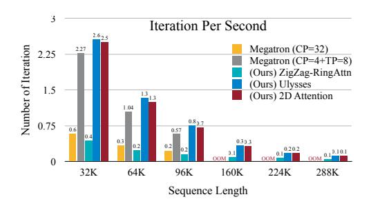
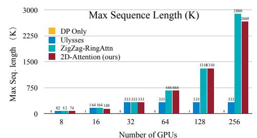
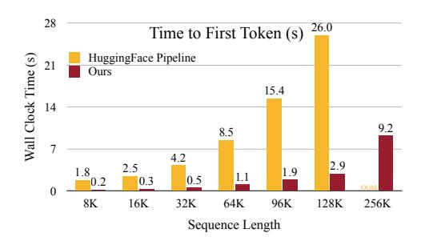
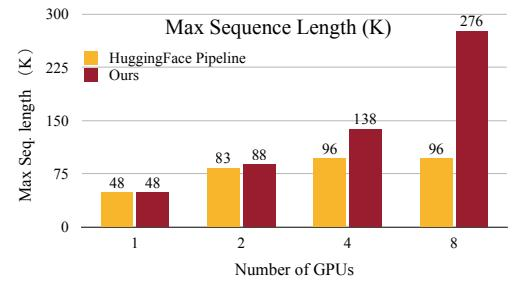

# 5.1 TRAINING AND INFERENCE SYSTEM

Our training and inference systems can be integrated with HuggingFace Transformers through straightforward monkey patching, in line with the popular open-source approach outlined in [\(Zheng](#page-14-7) [et al., 2023\)](#page-14-7). In this section, we present a quantitative evaluation of the training system's throughput, the inference system's latency, and the maximum supported sequence length.

Figure 9: Performance comparison of training systems on 32 H100 GPUs. MM-SP is as scalable as ZigZag-RingAttn, and as efficient as Ulysses.

Figure 10: Performance comparison of inference systems on 8 H100 GPUs.

#### 5.1.1 TRAINING SYSTEM

Baselines and hardware setup For training efficiency, we compare our system with ZigZag ring-style sequence parallelism, which incorporates load balancing and GPU optimization (ZIGZAG-RINGATTN for consistency)(Li et al., 2023a; Zhu, 2023; Liu et al., 2024a; Korthikanti et al., 2023). We use a widely adopted open-source implementation (Zhu, 2023). To reduce the memory footprint of models, gradients, and optimizer states, we employ Fully-Sharded Data Parallelism (FSDP)(Zhao et al., 2023) instead of Zero-3(Rajbhandari et al., 2020) (Table 7). Additionally, we compare our system with the expert-designed and highly optimized Megatron-LM(Shoeybi et al., 2019; Korthikanti et al., 2023) system, focusing on their implementation of sequence parallelism, termed "context parallelism" (CP). We also evaluate a hybrid strategy that combines tensor model parallelism (TP) within a node and CP across nodes, as recommended by the Megatron-LM team for advanced usage.

We conduct most experiments on H100 nodes, each equipped with 8xH100 (80GB) GPUs interconnected via intra-node NVLink and 400 Gbps inter-node InfiniBand. For experiments involving the maximum supported sequence length during training, we extend the setup to 32 A100 nodes, each with 8xA100 (80GB) GPUs, where the conclusions are consistent with those for H100 due to the equivalent total memory. Our evaluations are based on an 8B model with a batch size of 1. Since the Megatron-LM baseline does not natively support VLM training and the visual encoder is typically orders of magnitude smaller than LLMs, we report the main results for the LLM backbone without the visual encoder. An ablation study of the visual encoder is provided in § 5.1.3.

**Throughput** Figure 9 presents throughput results measured as iteration per second over 32 H100 GPUs. These results were obtained after 10 warmup iterations and averaged over 5 iterations to minimize variance. Our system achieves a speedup of  $2.1\times$  to  $5.7\times$  compared to ZIGZAG-RINGATTN, and performs on par with DeepSpeed-Ulysses. When compared to the more optimized ring-style sequence parallelism in Megatron-LM CP, our method shows a  $3.1\times$  to  $4.3\times$  speedup. This highlights that our system design effectively addresses the issues inherent in ring-style sequence parallelism, as in  $\S$  4.2. Furthermore, our system achieves a  $1.1\times$  to  $1.4\times$  speedup compared to Megatron-LM's hybrid strategy. Note that our system is currently implemented in Triton (Tillet et al., 2019), and further porting it to C++ could yield even greater speedup. Additionally, we observed that the Megatron-LM system supports a significantly lower maximum sequence length, which is why its results are not in the next section. We observe similar observations using 8 H100 nodes (Table 8).

Table 3: Performance comparisons on 9 video benchmarks, including ActivityNet-QA [\(Yu et al.,](#page-14-9) [2019\)](#page-14-9), EgoSchema [\(Mangalam et al., 2023\)](#page-13-10), EventBench [\(Du et al., 2024\)](#page-11-11), LongVideoBench [\(Wu](#page-13-11) [et al., 2024\)](#page-13-11), PerceptionTest [\(Patraucean et al., 2023\)](#page-13-12), MVBench [\(Li et al., 2024b\)](#page-12-9), NExT-QA [\(Xiao](#page-14-10) [et al., 2021\)](#page-14-10), VNBench [\(Zhao et al., 2024\)](#page-14-11), and VideoMME [\(Fu et al., 2024a\)](#page-11-3).

| Model          | Size M LL | ActNet-QA | EgoSchema | EventBench | LVideoBench | PercepTest | MVBench | NExT-QA | VNBench | VideoMME |         |
|----------------|-----------------|-----------|-----------|------------|-------------|------------|---------|---------|---------|----------|---------|
|                |                 | test      | test      | val        | val         | val        | test    | mc      | val     | w/o sub. | w/ sub. |
| GPT-4V         | -               | 57.0      | -         | 32.6       | 61.3        | -          | 43.5    | -       | -       | 59.9     | 63.3    |
| GPT-4o         | -               | -         | -         | 53.3       | 66.7        | -          | -       | -       | 64.4    | 71.9     | 77.2    |
| Gemini-1.5-Pro | -               | 57.5      | 72.2      | 43.2       | 64.0        | -          | -       | -       | 66.7    | 75.0     | 81.3    |
| Video-LLaVA    | 7B              | 45.3      | 38.4      | 5.9        | 37.6        | -          | 43.5    | -       | 12.4    | 39.9     | 41.6    |
| Flash-VStream  | 7B              | 51.9      | -         | -          | -           | -          | -       | 61.6    | -       | -        | -       |
| ShareGPT4Video | 8B              | 50.8      | -         | -          | 41.8        | -          | 51.2    | -       | -       | 39.9     | 43.6    |
| VideoLLaMA2    | 7B              | 50.2      | 51.7      | 6.9        | -           | 51.4       | 54.6    | -       | 4.5     | 47.9     | 50.3    |
| VideoLLaMA2.1  | 7B              | 53.0      | 53.1      | -          | -           | 54.9       | 57.3    | -       | -       | 54.9     | 56.4    |
| Kangaroo       | 8B              | -         | 62.7      | -          | 54.8        | -          | 61.1    | -       | -       | 56.0     | 57.6    |
| PLLaVA         | 7B              | 56.3      | -         | 28.2       | 39.2        | -          | 46.6    | -       | -       | -        | -       |
| LLaVA-OV       | 7B              | 56.7      | 60.1      | -          | 56.4        | 57.1       | 56.7    | 79.4    | 51.8    | 58.2     | 61.5    |
| LongVILA       | 7B              | 59.5      | 67.7      | 58.0       | 57.1        | 58.1       | 67.1    | 80.7    | 63.0    | 60.1     | 65.1    |

We evaluate the maximum sequence length supported by a fixed number of GPUs by progressively increasing the per-GPU sequence length from 1k to 10k until an out-of-memory error occurs. The results are summarized in Figure [9.](#page-7-0) To ensure a fair comparison, activation checkpointing is disabled. Vanilla data parallelism fails to scale for long videos at larger cluster sizes. DeepSpeed-Ulysses partitions based on attention heads, which limits its ability to scale to higher context lengths, as the 8B model has only 32 attention heads. Consequently, our approach supports approximately 8× higher context lengths when scaled to 256 GPUs. Additionally, our system achieves a similar context length scaling as ZIGZAG-RINGATTN, with support for over 2 million context length on 256 GPUs.

In summary, our training system combines the best of both worlds—it achieves scalability comparable to ZIGZAG-RINGATTN while maintaining the throughput of DeepSpeed-Ulysses. Additionally, it delivers a 1.3× speedup and supports 2.5× longer context lengths compared to the highly optimized Megatron-LM.

## 5.1.2 INFERENCE SYSTEM

We evaluated our inference system against HuggingFace Pipeline parallelism using a single node with 8 H100 GPUs and the 8B model (Figure [10\)](#page-7-1). Our system achieves an 8.2× speedup compared to HuggingFace Pipeline on 8xH100 GPUs. This significant improvement is primarily due to HuggingFace Pipeline inference activating only one GPU at a time, whereas our method leverages all GPUs to compute jointly. Figure [10](#page-7-1) compares the maximum supported sequence length, where our method supports sequences that are 2.9× longer than those supported by HuggingFace Pipeline. Specifically, during 96K sequence length inference, HuggingFace Pipeline stores 80GB of activations on the first GPU and only 18GB on the remaining GPUs. This imbalanced allocation of activations limits the maximum supported sequence length.

### 5.1.3 EFFECT OF TWO-STAGE SHARDING

We evaluate the impact of our two-stage sharding strategy using a video captioning dataset [\(Chen](#page-10-10) [et al., 2024a\)](#page-10-10). We compare our two-stage sharding to a one-stage baseline that only distributes workload based on the number of images. We measure the time per iteration across different numbers of H100 GPUs. For k GPUs, we use k images per video and a batch size of k. The results, shown in Table [5,](#page-15-1) indicate a speedup ranging from 1% to 7%. This improvement is primarily observed

| Table 4: Performance | comparison on | VideoMME ( | (Fu et al., | . 2024a` | benchmark in details. |
|----------------------|---------------|------------|-------------|----------|-----------------------|
|                      |               |            |             |          |                       |

| Model           | LLM        | Frames  |                     | w/o s        | ubtitle             |                     |                     | w su                | btitle              |                     |
|-----------------|------------|---------|---------------------|--------------|---------------------|---------------------|---------------------|---------------------|---------------------|---------------------|
| Wiodei          | Size       | Traines | Overall             | Short        | Medium              | Long                | Overall             | Short               | Medium              | Long                |
| Video-LLaVA     | 7B         | 8       | 39.9                | 45.3         | 38.0                | 36.2                | 41.6                | 46.1                | 40.7                | 38.1                |
| SliME           | 8B         | 8       | 45.3                | 53.3         | <u>55.4</u>         | 39.8                | 47.2                | 55.4                | 44.4                | 41.7                |
| ShareGPT4Video  | 8B         | 16      | 39.9                | 48.3         | 36.3                | 35.0                | 43.6                | 53.6                | 39.3                | 37.9                |
| VideoChat2      | 7B         | 16      | 39.5                | 48.3         | 37.0                | 33.2                | 43.8                | 52.8                | 39.4                | 39.2                |
| VideoLLaMA2     | 7B         | 16      | 47.9                | 56.0         | 45.4                | 42.1                | 50.3                | 59.4                | 47.6                | 43.8                |
| Chat-Univi-v1.5 | 7B         | 64      | 40.6                | 45.7         | 40.3                | 35.8                | 45.9                | 51.2                | 44.6                | 41.8                |
| Kangaroo        | 8B         | 64      | <u>56.0</u>         | 66.1         | 55.3                | 46.7                | <u>57.6</u>         | 68.0                | 55.4                | 49.3                |
| ShareGemini     | 7B         | 64      | 43.2                | 49.1         | 41.3                | 39.1                | 47.9                | 49.1                | 47.3                | 43.4                |
| LongVA          | 7B         | 128     | 52.6                | 61.1         | 50.4                | 46.2                | 54.3                | 61.1                | 53.6                | 47.6                |
| InternVL-V1.5   | 20B        | 10      | 50.7                | 60.2         | 46.4                | 45.6                | 52.4                | 61.7                | 49.1                | 46.6                |
| VITA            | 8x7B       | 20      | 55.0                | 64.2         | 53.3                | <u>47.6</u>         | 57.6                | 67.9                | 55.3                | <u>49.6</u>         |
| Video-CCAM      | 14B        | 96      | 53.9                | 62.1         | 52.8                | 47.0                | 56.1                | 63.9                | <u>55.9</u>         | 48.3                |
| LongVILA        | 1.5B 7B | 256     | 53.6 <b>60.1</b> | 66.2 69.0 | 49.3 <b>58.3</b> | 45.3 <b>53.0</b> | 57.5 <b>65.1</b> | 70.2 <b>72.9</b> | 54.1 <b>64.9</b> | 48.2 <b>57.4</b> |

in longer captioning tasks, where the baseline suffers from workload imbalance due to the lack of sharding based on the number of text tokens.

#### 5.2 GENERAL VIDEO UNDERSTANDING

Table 3 presents the performance of LongVILA, comparing to state-of-the-art models (Lin et al., 2023a; Zhang et al., 2024d; Chen et al., 2024a; Li et al., 2023c; Cheng et al., 2024; Jin et al., 2023; Zhang et al.; Share, 2024; Chen et al., 2024c; Fu et al., 2024b; Fei et al., 2024; Liu et al., 2024c; Xu et al., 2024; Li et al., 2024a; Zhang et al., 2024a) on popular video benchmarks. LongVILA-7B achieves strong performance across all these benchmarks. Table 4 compares their effectiveness across short, medium, and long video lengths, as well as overall performance on VideoMME. LongVILA, utilizing 256 frames, achieves an overall score of 60.1 / 65.1 without / with subtitle, which are competitive results. We include LongVILA-1.5B (starting from Qwen2-1.5B (qwe, 2024)) for evaluation, which is also competitive. We provide a detailed model complexity of LongVILA among various model size, number of frames, context length, latency and FLOPs in Table 10 in the appendix. We also do the ablation on training schedules in Table 1.

### 5.3 NEEDLE-IN-A-HAYSTACK

In Figure 2, we present the results of the Needle in a Haystack experiment for long videos. Following the methodology established in the existing literature (Zhang et al.), we prepared a long video and sampled a fixed number of frames. We inserted specifically designed images at various depths and tasked the model with answering corresponding questions. The 32-frame baseline model (left) was unable to accurately retrieve the correct images beyond 32 frames. In contrast, the LongVILA model (right) demonstrated 99.8% accuracy across 6,000 frames, which contains more than 1 million tokens. To our best knowledge, this is the first VLM which can handle 1 million context length.

### 6 Conclusion

We introduce LongVILA, a comprehensive full-stack solution for long-context visual language models, encompassing model training pipeline and distributed system. Based on our curated long video datasets and five-stage training pipeline, our LongVILA model extends the feasible frame count from 8 to 2048, precisely capturing fine-grained information from 2-hour needle-in-a-haystack videos, with more than 1 million tokens Our LongVILA-7B model achieves strong performance across popular video benchmarks, especially on VideoMME, *e.g.*, 65.1% accuracy with subtitle. Our system efficiently scales context length up to 2 million tokens, achieving speedups of  $2.1\times$  to  $5.7\times$  compared to ring sequence parallelism and  $1.1\times$  to  $1.4\times$  compared to a hybrid Megatron context and tensor parallelism.

