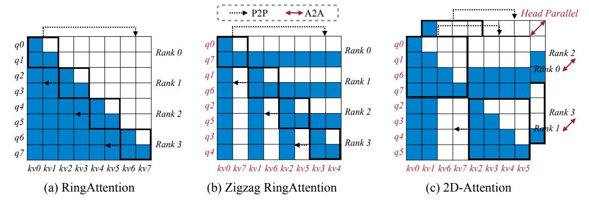
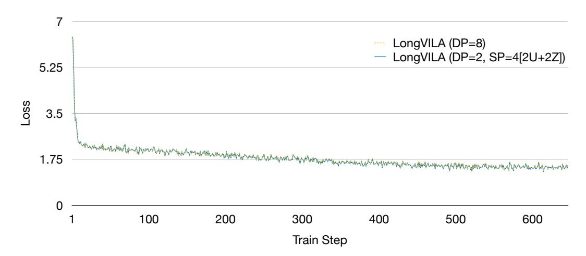
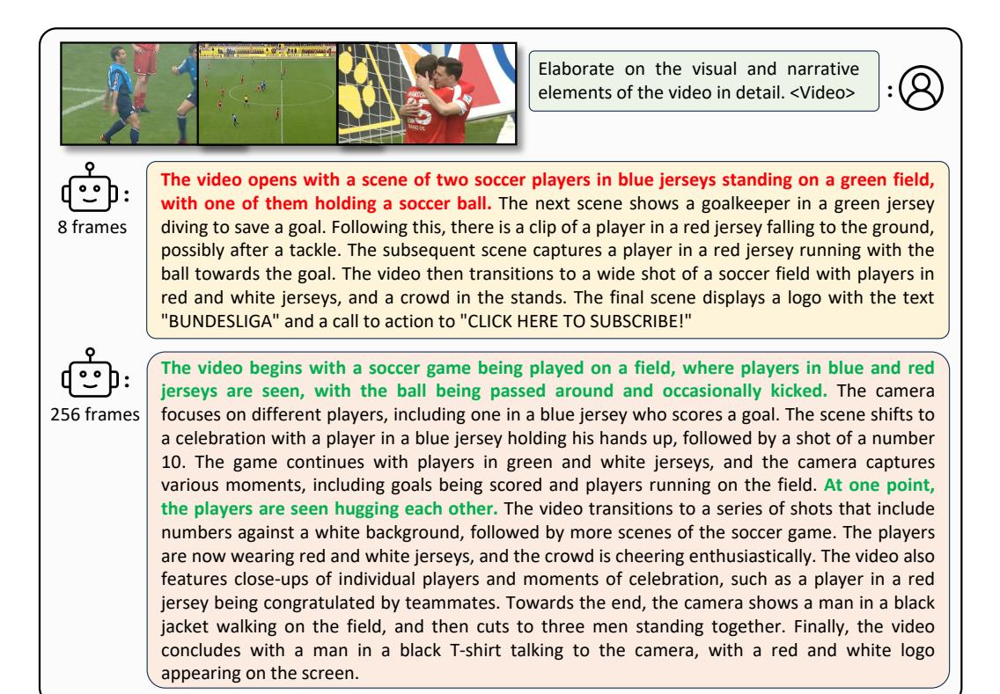
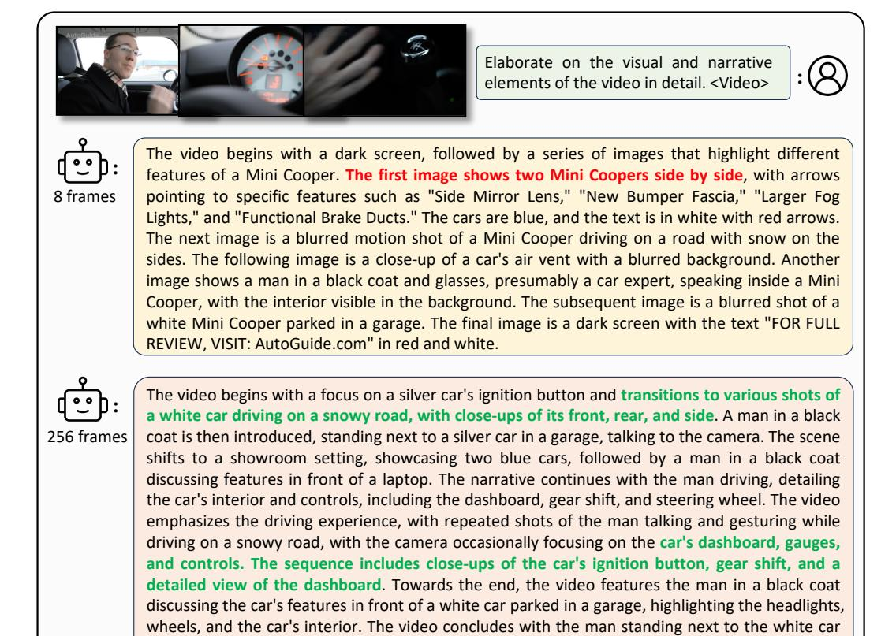

# REFERENCES

- Qwen2 technical report. 2024.
- Jinze Bai, Shuai Bai, Shusheng Yang, Shijie Wang, Sinan Tan, Peng Wang, Junyang Lin, Chang Zhou, and Jingren Zhou. Qwen-vl: A frontier large vision-language model with versatile abilities. *arXiv preprint arXiv:2308.12966*, 2023.
- Rohan Bavishi, Erich Elsen, Curtis Hawthorne, Maxwell Nye, Augustus Odena, Arushi Somani, and Sagnak Tas¸ırlar. Introducing our multimodal models, 2023. ˘
- James Betker, Gabriel Goh, Li Jing, Tim Brooks, Jianfeng Wang, Linjie Li, Long Ouyang, Juntang Zhuang, Joyce Lee, Yufei Guo, et al. Improving image generation with better captions. *Computer Science. https://cdn. openai. com/papers/dall-e-3. pdf*, 2(3):8, 2023.
- Anthony Brohan, Noah Brown, Justice Carbajal, Yevgen Chebotar, Joseph Dabis, Chelsea Finn, Keerthana Gopalakrishnan, Karol Hausman, Alex Herzog, Jasmine Hsu, et al. Rt-1: Robotics transformer for real-world control at scale. *arXiv preprint arXiv:2212.06817*, 2022.
- Anthony Brohan, Noah Brown, Justice Carbajal, Yevgen Chebotar, Xi Chen, Krzysztof Choromanski, Tianli Ding, Danny Driess, Avinava Dubey, Chelsea Finn, et al. Rt-2: Vision-language-action models transfer web knowledge to robotic control. *arXiv preprint arXiv:2307.15818*, 2023.
- Tom Brown, Benjamin Mann, Nick Ryder, Melanie Subbiah, Jared D Kaplan, Prafulla Dhariwal, Arvind Neelakantan, Pranav Shyam, Girish Sastry, Amanda Askell, et al. Language models are few-shot learners. *Advances in neural information processing systems*, 33:1877–1901, 2020.
- Minwoo Byeon, Beomhee Park, Haecheon Kim, Sungjun Lee, Woonhyuk Baek, and Saehoon Kim. Coyo-700m: Image-text pair dataset, 2022.
- Lin Chen, Xilin Wei, Jinsong Li, Xiaoyi Dong, Pan Zhang, Yuhang Zang, Zehui Chen, Haodong Duan, Bin Lin, Zhenyu Tang, et al. Sharegpt4video: Improving video understanding and generation with better captions. *arXiv preprint arXiv:2406.04325*, 2024a.
- Yukang Chen, Shengju Qian, Haotian Tang, Xin Lai, Zhijian Liu, Song Han, and Jiaya Jia. Longlora: Efficient fine-tuning of long-context large language models. *arXiv preprint arXiv:2309.12307*, 2023.
- Yukang Chen, Shengju Qian, Haotian Tang, Xin Lai, Zhijian Liu, Song Han, and Jiaya Jia. Longlora: Efficient fine-tuning of long-context large language models. In *The International Conference on Learning Representations*, 2024b.
- Zhe Chen, Weiyun Wang, Hao Tian, Shenglong Ye, Zhangwei Gao, Erfei Cui, Wenwen Tong, Kongzhi Hu, Jiapeng Luo, Zheng Ma, Ji Ma, Jiaqi Wang, Xiaoyi Dong, Hang Yan, Hewei Guo, Conghui He, Botian Shi, Zhenjiang Jin, Chao Xu, Bin Wang, Xingjian Wei, Wei Li, Wenjian Zhang, Bo Zhang, Pinlong Cai, Licheng Wen, Xiangchao Yan, Min Dou, Lewei Lu, Xizhou Zhu, Tong Lu, Dahua Lin, Yu Qiao, Jifeng Dai, and Wenhai Wang. How far are we to gpt-4v? closing the gap to commercial multimodal models with open-source suites. *CoRR*, abs/2404.16821, 2024c.
- Zesen Cheng, Sicong Leng, Hang Zhang, Yifei Xin, Xin Li, Guanzheng Chen, Yongxin Zhu, Wenqi Zhang, Ziyang Luo, Deli Zhao, and Lidong Bing. Videollama 2: Advancing spatial-temporal modeling and audio understanding in video-llms. *CoRR*, abs/2406.07476, 2024.
- Aakanksha Chowdhery, Sharan Narang, Jacob Devlin, Maarten Bosma, Gaurav Mishra, Adam Roberts, Paul Barham, Hyung Won Chung, Charles Sutton, Sebastian Gehrmann, et al. Palm: Scaling language modeling with pathways. *Journal of Machine Learning Research*, 24(240): 1–113, 2023.
- Wenliang Dai, Junnan Li, Dongxu Li, Anthony Meng Huat Tiong, Junqi Zhao, Weisheng Wang, Boyang Albert Li, Pascale Fung, and Steven C. H. Hoi. Instructblip: Towards general-purpose vision-language models with instruction tuning. *ArXiv*, abs/2305.06500, 2023.

- Tri Dao. Flashattention-2: Faster attention with better parallelism and work partitioning. In *ICLR*, 2024.
- Mostafa Dehghani, Josip Djolonga, Basil Mustafa, Piotr Padlewski, Jonathan Heek, Justin Gilmer, Andreas Peter Steiner, Mathilde Caron, Robert Geirhos, Ibrahim Alabdulmohsin, et al. Scaling vision transformers to 22 billion parameters. In *International Conference on Machine Learning*, pp. 7480–7512. PMLR, 2023.
- Danny Driess, Fei Xia, Mehdi SM Sajjadi, Corey Lynch, Aakanksha Chowdhery, Brian Ichter, Ayzaan Wahid, Jonathan Tompson, Quan Vuong, Tianhe Yu, et al. Palm-e: An embodied multimodal language model. *arXiv preprint arXiv:2303.03378*, 2023.
- Yifan Du, Kun Zhou, Yuqi Huo, Yifan Li, Wayne Xin Zhao, Haoyu Lu, Zijia Zhao, Bingning Wang, Weipeng Chen, and Ji-Rong Wen. Towards event-oriented long video understanding. *CoRR*, abs/2406.14129, 2024.
- Jiarui Fang and Shangchun Zhao. Usp: A unified sequence parallelism approach for long context generative ai. *arXiv preprint arXiv:2405.07719*, 2024.
- Yunhao Fang, Ligeng Zhu, Yao Lu, Yan Wang, Pavlo Molchanov, Jang Hyun Cho, Marco Pavone, Song Han, and Hongxu Yin. Vila2 : Vila augmented vila. *arXiv preprint arXiv:2407.17453*, 2024.
- Jiajun Fei, Dian Li, Zhidong Deng, Zekun Wang, Gang Liu, and Hui Wang. Video-ccam: Enhancing video-language understanding with causal cross-attention masks for short and long videos. *CoRR*, abs/2408.14023, 2024.
- Chaoyou Fu, Yuhan Dai, Yondong Luo, Lei Li, Shuhuai Ren, Renrui Zhang, Zihan Wang, Chenyu Zhou, Yunhang Shen, Mengdan Zhang, Peixian Chen, Yanwei Li, Shaohui Lin, Sirui Zhao, Ke Li, Tong Xu, Xiawu Zheng, Enhong Chen, Rongrong Ji, and Xing Sun. Video-mme: The first-ever comprehensive evaluation benchmark of multi-modal llms in video analysis. *CoRR*, abs/2405.21075, 2024a.
- Chaoyou Fu, Haojia Lin, Zuwei Long, Yunhang Shen, Meng Zhao, Yifan Zhang, Xiong Wang, Di Yin, Long Ma, Xiawu Zheng, Ran He, Rongrong Ji, Yunsheng Wu, Caifeng Shan, and Xing Sun. VITA: towards open-source interactive omni multimodal LLM. *CoRR*, abs/2408.05211, 2024b.
- Yao Fu, Rameswar Panda, Xinyao Niu, Xiang Yue, Hannaneh Hajishirzi, Yoon Kim, and Hao Peng. Data engineering for scaling language models to 128k context. *arXiv preprint arXiv:2402.10171*, 2024c.
- Yao Fu, Rameswar Panda, Xinyao Niu, Xiang Yue, Hannaneh Hajishirzi, Yoon Kim, and Hao Peng. Data engineering for scaling language models to 128k context. *CoRR*, abs/2402.10171, 2024d.
- Diandian Gu, Peng Sun, Qinghao Hu, Ting Huang, Xun Chen, Yingtong Xiong, Guoteng Wang, Qiaoling Chen, Shangchun Zhao, Jiarui Fang, Yonggang Wen, Tianwei Zhang, Xin Jin, and Xuanzhe Liu. Loongtrain: Efficient training of long-sequence llms with head-context parallelism. *CoRR*, pdf/2406.18485, 2024.
- Mingfei Han, Linjie Yang, Xiaojun Chang, and Heng Wang. Shot2story20k: A new benchmark for comprehensive understanding of multi-shot videos. *arXiv preprint arXiv:2311.17043*, 2023.
- Yanping Huang, Youlong Cheng, Ankur Bapna, Orhan Firat, Dehao Chen, Mia Chen, HyoukJoong Lee, Jiquan Ngiam, Quoc V Le, Yonghui Wu, et al. Gpipe: Efficient training of giant neural networks using pipeline parallelism. *Advances in neural information processing systems*, 32, 2019.
- Sam Ade Jacobs, Masahiro Tanaka, Chengming Zhang, Minjia Zhang, Leon Song, Samyam Rajbhandari, and Yuxiong He. Deepspeed ulysses: System optimizations for enabling training of extreme long sequence transformer models. *arXiv preprint arXiv:2309.14509*, 2023.
- Peng Jin, Ryuichi Takanobu, Caiwan Zhang, Xiaochun Cao, and Li Yuan. Chat-univi: Unified visual representation empowers large language models with image and video understanding. *CoRR*, abs/2311.08046, 2023.

- Jing Yu Koh, Robert Lo, Lawrence Jang, Vikram Duvvur, Ming Chong Lim, Po-Yu Huang, Graham Neubig, Shuyan Zhou, Ruslan Salakhutdinov, and Daniel Fried. Visualwebarena: Evaluating multimodal agents on realistic visual web tasks. *arXiv preprint arXiv:2401.13649*, 2024.
- Vijay Anand Korthikanti, Jared Casper, Sangkug Lym, Lawrence McAfee, Michael Andersch, Mohammad Shoeybi, and Bryan Catanzaro. Reducing activation recomputation in large transformer models. *Proceedings of Machine Learning and Systems*, 5:341–353, 2023.
- Dmitry Lepikhin, HyoukJoong Lee, Yuanzhong Xu, Dehao Chen, Orhan Firat, Yanping Huang, Maxim Krikun, Noam Shazeer, and Zhifeng Chen. Gshard: Scaling giant models with conditional computation and automatic sharding. *arXiv preprint arXiv:2006.16668*, 2020.
- Bo Li, Yuanhan Zhang, Dong Guo, Renrui Zhang, Feng Li, Hao Zhang, Kaichen Zhang, Yanwei Li, Ziwei Liu, and Chunyuan Li. Llava-onevision: Easy visual task transfer. *CoRR*, abs/2408.03326, 2024a.
- Dacheng Li, Rulin Shao, Anze Xie, Eric Xing, Joseph Gonzalez, Ion Stoica, Xuezhe Ma, and Hao Zhang. Lightseq: : Sequence level parallelism for distributed training of long context transformers. In *Workshop on Advancing Neural Network Training: Computational Efficiency, Scalability, and Resource Optimization*, 2023a.
- Junnan Li, Dongxu Li, Silvio Savarese, and Steven Hoi. Blip-2: Bootstrapping languageimage pre-training with frozen image encoders and large language models. *arXiv preprint arXiv:2301.12597*, 2023b.
- Kunchang Li, Yinan He, Yi Wang, Yizhuo Li, Wenhai Wang, Ping Luo, Yali Wang, Limin Wang, and Yu Qiao. Videochat: Chat-centric video understanding. *CoRR*, abs/2305.06355, 2023c.
- Kunchang Li, Yali Wang, Yinan He, Yizhuo Li, Yi Wang, Yi Liu, Zun Wang, Jilan Xu, Guo Chen, Ping Lou, Limin Wang, and Yu Qiao. Mvbench: A comprehensive multi-modal video understanding benchmark. In *CVPR*, pp. 22195–22206, 2024b.
- Shenggui Li, Fuzhao Xue, Chaitanya Baranwal, Yongbin Li, and Yang You. Sequence parallelism: Long sequence training from system perspective. *arXiv preprint arXiv:2105.13120*, 2021.
- Yanwei Li, Yuechen Zhang, Chengyao Wang, Zhisheng Zhong, Yixin Chen, Ruihang Chu, Shaoteng Liu, and Jiaya Jia. Mini-gemini: Mining the potential of multi-modality vision language models, 2024c.
- Bin Lin, Yang Ye, Bin Zhu, Jiaxi Cui, Munan Ning, Peng Jin, and Li Yuan. Video-llava: Learning united visual representation by alignment before projection. *CoRR*, abs/2311.10122, 2023a.
- Ji Lin, Hongxu Yin, Wei Ping, Yao Lu, Pavlo Molchanov, Andrew Tao, Huizi Mao, Jan Kautz, Mohammad Shoeybi, and Song Han. Vila: On pre-training for visual language models, 2023b.
- Hao Liu, Matei Zaharia, and Pieter Abbeel. Ring attention with blockwise transformers for nearinfinite context. *arXiv preprint arXiv:2310.01889*, 2023a.
- Hao Liu, Wilson Yan, Matei Zaharia, and Pieter Abbeel. World model on million-length video and language with blockwise ringattention. *arXiv preprint arXiv:2402.08268*, 2024a.
- Haotian Liu, Chunyuan Li, Yuheng Li, and Yong Jae Lee. Improved baselines with visual instruction tuning. *arXiv preprint arXiv:2310.03744*, 2023b.
- Haotian Liu, Chunyuan Li, Qingyang Wu, and Yong Jae Lee. Visual instruction tuning. In *NeurIPS*, 2023c.
- Haotian Liu, Chunyuan Li, Yuheng Li, Bo Li, Yuanhan Zhang, Sheng Shen, and Yong Jae Lee. Llava-next: Improved reasoning, ocr, and world knowledge, January 2024b.
- Jiajun Liu, Yibing Wang, Hanghang Ma, Xiaoping Wu, Xiaoqi Ma, xiaoming Wei, Jianbin Jiao, Enhua Wu, and Jie Hu. Kangaroo: A powerful video-language model supporting long-context video input. *arXiv preprint arXiv:2408.15542*, 2024c.

- Muhammad Maaz, Hanoona Rasheed, Salman Khan, and Fahad Shahbaz Khan. Video-chatgpt: Towards detailed video understanding via large vision and language models. In *Proceedings of the 62nd Annual Meeting of the Association for Computational Linguistics (ACL 2024)*, 2024.
- Karttikeya Mangalam, Raiymbek Akshulakov, and Jitendra Malik. Egoschema: A diagnostic benchmark for very long-form video language understanding. In *NeurIPS*, 2023.
- Deepak Narayanan, Aaron Harlap, Amar Phanishayee, Vivek Seshadri, Nikhil R Devanur, Gregory R Ganger, Phillip B Gibbons, and Matei Zaharia. Pipedream: Generalized pipeline parallelism for dnn training. In *Proceedings of the 27th ACM symposium on operating systems principles*, pp. 1–15, 2019.
- Long Ouyang, Jeffrey Wu, Xu Jiang, Diogo Almeida, Carroll Wainwright, Pamela Mishkin, Chong Zhang, Sandhini Agarwal, Katarina Slama, Alex Ray, et al. Training language models to follow instructions with human feedback. *Advances in neural information processing systems*, 35: 27730–27744, 2022.
- Abhishek Padalkar, Acorn Pooley, Ajinkya Jain, Alex Bewley, Alex Herzog, Alex Irpan, Alexander Khazatsky, Anant Rai, Anikait Singh, Anthony Brohan, et al. Open x-embodiment: Robotic learning datasets and rt-x models. *arXiv preprint arXiv:2310.08864*, 2023.
- Viorica Patraucean, Lucas Smaira, Ankush Gupta, Adria Recasens, Larisa Markeeva, Dylan Ba- ` narse, Skanda Koppula, Joseph Heyward, Mateusz Malinowski, Yi Yang, Carl Doersch, Tatiana Matejovicova, Yury Sulsky, Antoine Miech, Alexandre Frechette, Hanna Klimczak, Raphael ´ Koster, Junlin Zhang, Stephanie Winkler, Yusuf Aytar, Simon Osindero, Dima Damen, Andrew Zisserman, and Joao Carreira. Perception test: A diagnostic benchmark for multimodal video ˜ models. In *NeurIPS*, 2023.
- Samyam Rajbhandari, Jeff Rasley, Olatunji Ruwase, and Yuxiong He. Zero: Memory optimizations toward training trillion parameter models. In *SC20: International Conference for High Performance Computing, Networking, Storage and Analysis*, pp. 1–16. IEEE, 2020.
- Share. Sharegemini: Scaling up video caption data for multimodal large language models, June 2024.
- Mohammad Shoeybi, Mostofa Patwary, Raul Puri, Patrick LeGresley, Jared Casper, and Bryan Catanzaro. Megatron-lm: Training multi-billion parameter language models using model parallelism. *arXiv preprint arXiv:1909.08053*, 2019.
- Daria Soboleva, Faisal Al-Khateeb, Robert Myers, Jacob R Steeves, Joel Hestness, and Nolan Dey. SlimPajama: A 627B token cleaned and deduplicated version of RedPajama, 2023.
- Jianlin Su, Yu Lu, Shengfeng Pan, Bo Wen, and Yunfeng Liu. Roformer: Enhanced transformer with rotary position embedding. *CoRR*, abs/2104.09864, 2021.
- Chameleon Team. Chameleon: Mixed-modal early-fusion foundation models. *arXiv preprint arXiv:2405.09818*, 2024.
- Philippe Tillet, Hsiang-Tsung Kung, and David Cox. Triton: an intermediate language and compiler for tiled neural network computations. In *Proceedings of the 3rd ACM SIGPLAN International Workshop on Machine Learning and Programming Languages*, pp. 10–19, 2019.
- Shengbang Tong, Ellis Brown, Penghao Wu, Sanghyun Woo, Manoj Middepogu, Sai Charitha Akula, Jihan Yang, Shusheng Yang, Adithya Iyer, Xichen Pan, Austin Wang, Rob Fergus, Yann LeCun, and Saining Xie. Cambrian-1: A fully open, vision-centric exploration of multimodal llms, 2024.
- Yuetian Weng, Mingfei Han, Haoyu He, Xiaojun Chang, and Bohan Zhuang. Longvlm: Efficient long video understanding via large language models. *CoRR*, abs/2404.03384, 2024.
- Haoning Wu, Dongxu Li, Bei Chen, and Junnan Li. Longvideobench: A benchmark for long-context interleaved video-language understanding. *CoRR*, abs/2407.15754, 2024.

- Junbin Xiao, Xindi Shang, Angela Yao, and Tat-Seng Chua. Next-qa: Next phase of questionanswering to explaining temporal actions. In *CVPR*, pp. 9777–9786, 2021.
- Lin Xu, Yilin Zhao, Daquan Zhou, Zhijie Lin, See-Kiong Ng, and Jiashi Feng. Pllava : Parameterfree llava extension from images to videos for video dense captioning. *CoRR*, abs/2404.16994, 2024.
- Hanrong Ye, De-An Huang, Yao Lu, Zhiding Yu, Wei Ping, Andrew Tao, Jan Kautz, Song Han, Dan Xu, Pavlo Molchanov, and Hongxu Yin. X-VILA: cross-modality alignment for large language model. *CoRR*, abs/2405.19335, 2024.
- Gyeong-In Yu, Joo Seong Jeong, Geon-Woo Kim, Soojeong Kim, and Byung-Gon Chun. Orca: A distributed serving system for {Transformer-Based} generative models. In *16th USENIX Symposium on Operating Systems Design and Implementation (OSDI 22)*, pp. 521–538, 2022.
- Zhou Yu, Dejing Xu, Jun Yu, Ting Yu, Zhou Zhao, Yueting Zhuang, and Dacheng Tao. Activitynetqa: A dataset for understanding complex web videos via question answering. In *AAAI*, pp. 9127– 9134, 2019.
- Haoji Zhang, Yiqin Wang, Yansong Tang, Yong Liu, Jiashi Feng, Jifeng Dai, and Xiaojie Jin. Flashvstream: Memory-based real-time understanding for long video streams. *CoRR*, abs/2406.08085, 2024a.
- Peiyuan Zhang, Kaichen Zhang, Bo Li, Guangtao Zeng, Jingkang Yang, Yuanhan Zhang, Ziyue Wang, Haoran Tan, Chunyuan Li, and Ziwei Liu. Long context transfer from language to vision. *CoRR*.
- Peiyuan Zhang, Kaichen Zhang, Bo Li, Guangtao Zeng, Jingkang Yang, Yuanhan Zhang, Ziyue Wang, Haoran Tan, Chunyuan Li, and Ziwei Liu. Long context transfer from language to vision. *arXiv preprint arXiv:2406.16852*, 2024b.
- Ruohong Zhang, Liangke Gui, Zhiqing Sun, Yihao Feng, Keyang Xu, Yuanhan Zhang, Di Fu, Chunyuan Li, Alexander Hauptmann, Yonatan Bisk, and Yiming Yang. Direct preference optimization of video large multimodal models from language model reward, 2024c.
- Yi-Fan Zhang, Qingsong Wen, Chaoyou Fu, Xue Wang, Zhang Zhang, Liang Wang, and Rong Jin. Beyond llava-hd: Diving into high-resolution large multimodal models. *CoRR*, abs/2406.08487, 2024d.
- Yanli Zhao, Andrew Gu, Rohan Varma, Liang Luo, Chien-Chin Huang, Min Xu, Less Wright, Hamid Shojanazeri, Myle Ott, Sam Shleifer, et al. Pytorch fsdp: experiences on scaling fully sharded data parallel. *arXiv preprint arXiv:2304.11277*, 2023.
- Zijia Zhao, Haoyu Lu, Yuqi Huo, Yifan Du, Tongtian Yue, Longteng Guo, Bingning Wang, Weipeng Chen, and Jing Liu. Needle in a video haystack: A scalable synthetic framework for benchmarking video mllms. *arXiv preprint*, 2024.
- Lianmin Zheng, Wei-Lin Chiang, Ying Sheng, Siyuan Zhuang, Zhanghao Wu, Yonghao Zhuang, Zi Lin, Zhuohan Li, Dacheng Li, Eric. P Xing, Hao Zhang, Joseph E. Gonzalez, and Ion Stoica. Judging llm-as-a-judge with mt-bench and chatbot arena, 2023.
- Chunting Zhou, Pengfei Liu, Puxin Xu, Srinivasan Iyer, Jiao Sun, Yuning Mao, Xuezhe Ma, Avia Efrat, Ping Yu, Lili Yu, et al. Lima: Less is more for alignment. *Advances in Neural Information Processing Systems*, 36, 2024.
- Luowei Zhou, Chenliang Xu, and Jason J. Corso. Towards automatic learning of procedures from web instructional videos. In *AAAI*, pp. 7590–7598, 2018.
- Zilin Zhu. Ring flash attention, 2023. Accessed: 2024-07-28.

#### **APPENDIX**

#### LONGVILA-CAPTION

We have developed a long video captioning benchmark, LongVILA-Caption, consisting of 100 long videos, with captions generated as detailed in Section 3.3, and verified through human examination. In line with the methodology of VideoChatGPT (Maaz et al., 2024), we evaluate the predictions of each model based on their correctness, detailed orientation, and contextual understanding. For instance, we assess correctness by employing GPT-4 to predict scores using a specific prompt. Additionally, we present two examples in Figures 13 and 14, featuring long videos in sports and technology. These examples demonstrate that LongVILA, with its capability to process more frames, offers a more comprehensive understanding of videos compared to its short-frame counterpart.

The Table 6 presents the performance metrics for the LongVILA models being trained and evaluated on varying numbers of frames: 8, 128, and 256. As the number of frames increases, the model's performance improves significantly. Specifically, the average scores rise from 2.00 to 3.26, highlighting the model's enhanced capability in generating accurate and rich captions with more frames.

dataset (Chen et al., 2024a) with and with- across different frame counts. out our two-stage sharding strategy.

Table 5: Iteration time (seconds) on the Table 6: Evaluation of LongVILA-Caption performance

|           | 2 GPUs | 4 GPUs | 8 GPUs |
|-----------|--------|--------|--------|
| one-stage | 0.78   | 0.89   | 1.20   |
| two-stage | 0.77   | 0.86   | 1.12   |

| Frames | Correctness | Detailed | Contextual | Average |
|--------|-------------|----------|------------|---------|
| 8      | 1.87        | 1.85     | 2.27       | 2.00    |
| 128    | 2.36        | 2.44     | 2.79       | 2.53    |
| 256    | 3.23        | 3.11     | 3.43       | 3.26    |

Figure 11: Comparison of RingAttention Liu et al. (2023a), ZIGZAG-RINGATTN Zhu (2023), and 2D-Attention (Fang & Zhao, 2024). The blue block indicates communication between QKV, while the black frame represents local attention computation within each SP group rank. The sequence length is 8 and the global SP degree is 4. Due to the triangular structure of causal attention computations, RingAttention experiences a computation imbalance, where rank 0 becomes idle after the first round while rank 3 continues computing through all stages. ZIGZAG-RINGATTN addresses this by reordering input sequence tokens along the sequence dimension to achieve load balance. The 2D-Attention mechanism uses a ring parallel degree of 2 and a head parallel degree of 2, resulting in an effective global sequence parallel degree of 4. This approach also incorporates a workload balancing strategy within the ring-based process group and uses the All-to-All operation to distribute QKV tensors across devices based on the head dimension, ensuring efficient and balanced computation.

Figure 12: Convergence evaluation. We compare the training loss curves for LongVILA with and without sequence parallelism. This figure illustrates the convergence of the LongVILA model on 8 H100 GPUs, with a sequence parallelism degree of 4, compared to pure data parallelism training. 2U+2Z indicates that 2D-Attention mechanism is enabled, where both the Ulysses and Zigzag-Ringttn degrees are 2. The training dataset is shot2story. The two curves align closely, indicating that our MM-SP system does not negatively impact training quality.

Table 7: Our training system, used in conjunction with FSDP (Zhao et al., 2023) or Zero-3 (Rajbhandari et al., 2020), on 32 H100 GPUs. We found that FSDP offers more efficient memory management, which led us to select it as our default configuration. (Time per iteration, seconds).

| Sequence | Ze              | ero-3   |              | F               | SDP     |              |
|----------|-----------------|---------|--------------|-----------------|---------|--------------|
| Length   | ZIGZAG-RINGATTN | Ulysses | 2D Attention | ZIGZAG-RINGATTN | Ulysses | 2D Attention |
| 320 K    | OOM             | OOM     | OOM          | 23.57           | 10.70   | 11.12        |
| 288 K    | OOM             | OOM     | OOM          | 20.24           | 8.68    | 8.65         |
| 256 K    | OOM             | OOM     | OOM          | 17.54           | 6.98    | 7.04         |
| 224 K    | 19.04           | 7.06    | 5.73         | 15.22           | 5.47    | 5.53         |
| 192 K    | 13.01           | 4.24    | 4.38         | 12.97           | 4.15    | 4.24         |
| 160 K    | 10.73           | 3.09    | 3.23         | 10.83           | 3.02    | 3.11         |
| 128 K    | 8.63            | 2.16    | 2.30         | 8.38            | 2.07    | 2.17         |
| 96 K     | 6.49            | 1.43    | 1.53         | 6.35            | 1.33    | 1.41         |
| 64 K     | 4.40            | 1.01    | 1.08         | 4.25            | 0.76    | 0.80         |
| 32 K     | 2.06            | 1.58    | 1.04         | 2.26            | 0.39    | 0.40         |

Table 8: Training system throughput comparison on 64 H100 GPUs, measured in time per iteration (seconds). Ulysses is not included in this comparison as it supports only up to 32 GPUs.

| Sequence length | Me   | gatron-LM | Ours            |         |              |  |  |  |
|-----------------|------|-----------|-----------------|---------|--------------|--|--|--|
|                 | СР   | CP=8+TP=8 | ZIGZAG-RINGATTN | Ulysses | 2D Attention |  |  |  |
| 640 K           | OOM  | OOM       | 88.4            | -       | OOM          |  |  |  |
| 578 K           | OOM  | OOM       | 77.2            | -       | 16.9         |  |  |  |
| 512 K           | OOM  | OOM       | 66.1            | -       | 13.31        |  |  |  |
| 448 K           | OOM  | OOM       | 57.5            | -       | 10.39        |  |  |  |
| 384 K           | OOM  | OOM       | 48.6            | -       | 7.80         |  |  |  |
| 320 K           | OOM  | OOM       | 40.5            | -       | 5.63         |  |  |  |
| 256 K           | OOM  | 5.31      | 32.2            | _       | 3.93         |  |  |  |
| 192 K           | 8.81 | 3.10      | 24.1            | -       | 2.49         |  |  |  |
| 128 K           | 7.10 | 1.57      | 16.0            | -       | 1.36         |  |  |  |
| 64 K            | 3.09 | 0.61      | 8.04            | -       | 0.57         |  |  |  |
| 32 K            | 1.86 | 0.44      | 4.24            | -       | 0.33         |  |  |  |

Table 9: Comparison with state-of-the-art methods (Li et al., 2023b; Dai et al., 2023; Bai et al., 2023; Liu et al., 2023b; Liu et al., 2024b; Tong et al., 2024; Li et al., 2024c) on 10 image based VLM benchmarks. S3 refers to the stage 3 model in LongVILA training pipeline.

| Method            | LLM            | Res.    | VQA v2 | GQA  | VizWiz | SQA I | VQA T | MMB  | $MMB^{CN}$ | SEED | LLaVAW | MM-Vet |
|-------------------|----------------|---------|-------------------|------|--------|------------------|------------------|------|------------|------|--------|--------|
| BLIP-2            | Vicuna-13B     | 224     | 41.0              | 41   | 19.6   | 61               | 42.5             | -    | _          | 46.4 | 38.1   | 22.4   |
| InstructBLIP      | Vicuna-7B      | 224     | -                 | 49.2 | 34.5   | 60.5             | 50.1             | 36   | 23.7       | 53.4 | 60.9   | 26.2   |
| HISHUCIDEII       | Vicuna-13B     | 224     | -                 | 49.5 | 33.4   | 63.1             | 50.7             | -    | _          | -    | 58.2   | 25.6   |
| Qwen-VL           | Qwen-7B        | 448     | 78.8              | 59.3 | 35.2   | 67.1             | 63.8             | 38.2 | 7.4        | 56.3 | _      | _      |
| Qwen-VL-Chat      | Qwen-7B        | 448     | 78.2              | 57.5 | 38.9   | 68.2             | 61.5             | 60.6 | 56.7       | 58.2 | _      | _      |
| LLaVA-1.5         | Vicuna-1.5-7B  | 336     | 78.5              | 62.0 | 50.0   | 66.8             | 58.2             | 64.3 | 58.3       | 58.6 | 63.4   | 30.5   |
| LLavA-1.3         | Vicuna-1.5-13B | 336     | 80.0              | 63.3 | 53.6   | 71.6             | 61.3             | 67.7 | 63.6       | 61.6 | 70.7   | 35.4   |
| VILA              | Llama 2-7B     | 336     | 79.9              | 62.3 | 57.8   | 68.2             | 64.4             | 68.9 | 61.7       | 61.1 | 69.7   | 34.9   |
| VILA              | Llama 2-13B    | 336     | 80.8              | 63.3 | 60.6   | 73.7             | 66.6             | 70.3 | 64.3       | 62.8 | 73.0   | 38.8   |
| LLaVA-NeXT-8B     | Llama 3-8B     | 672     | -                 | 65.2 | -      | 72.8             | 64.6             | 72.1 | _          | -    | 80.1   | _      |
| Cambrian-1-8B     | Llama 3-8B     | 1024    | _                 | 64.6 | _      | 80.4             | 71.7             | 75.9 | _          | _    | _      | _      |
| Mini-Gemini-HD-8B | Llama 3-8B     | 1536    | -                 | 64.5 | -      | 75.1             | 70.2             | 72.7 | -          | -    | -      | -      |
| LongVILA-7B (S3)  | Qwen2-7B       | dynamic | 85.4              | 65.4 | 65.0   | 98.5             | 77.8             | 83.4 | 80.0       | 70.6 | 77.6   | 51.7   |

Table 10: Detailed model complexity analysis of LongVILA among various model size, number of frames, parameters, latency (ms), and TFLOPs. We profile LongVILA models into 4 types of components. Image Encoder includes vision tower and mm projector. LLM Linears include k/q/v/o projectors and linears in decoder layers. LLM Attention is the attention computation. LLM Others include other components, like embeddings, output heads, and normalization layers. We use fp16 data type, Flash-Attention2 (Dao, 2024) on one A100 GPU for latency measurement. As the number of frames increases, the FLOPs and latency of LLM Attention grow quadratically, whereas other components increase linearly. LLM Attention represents the predominant computational cost in long video understanding, highlighting the MM-SP system.

|        |         | Matria            |                  | LongVI          | LA-1.5B          |                |                  | LongV            | ILA-7B             |                |
|--------|---------|-------------------|------------------|-----------------|------------------|----------------|------------------|------------------|--------------------|----------------|
| Frames | Context | Metric            | Image Encoder | LLM Linears  | LLM Attention | LLM Others  | Image Encoder | LLM Linears   | LLM Attention   | LLM Others  |
|        |         | Params            | 0.44B            | 1.31B           | -                | 0.23B          | 0.46B            | 6.53B            | -                  | 1.09B          |
| 32     | 6415    | Latency TFLOPs | 196.0 5.13    | 109.3 4.20   | 27.0 1.77     | 28.9 0.75   | 201.0 5.22    | 426.2 20.93   | 51.1 4.13       | 42.1 1.74   |
| 64     | 12719   | Latency TFLOPs | 375.2 10.26   | 208.1 8.33   | 80.7 6.96     | 50.9 1.48   | 375.8 10.45   | 831.1 41.50   | 173.8 16.24     | 80.8 3.46   |
| 128    | 25327   | Latency TFLOPs | 740.4 20.52   | 403.2 16.60  | 288.1 27.59   | 97.1 2.95   | 755.1 20.89   | 1642.4 82.64  | 644.9 64.38     | 158.3 6.89  |
| 256    | 50543   | Latency TFLOPs | 1456.0 41.05  | 811.2 33.12  | 1087.7 109.89 | 192.5 5.88  | 1476.3 41.78  | 3308.2 164.92 | 2529.6 256.40   | 325.1 13.74 |
| 512    | 100975  | Latency TFLOPs | 2921.0 82.09  | 1660.9 66.17 | 4359.2 438.59 | 389.4 11.75 | 2980.2 83.57  | 6675.1 329.48 | 10149.3 1023.37 | 653.4 27.45 |

Figure 13: Examples of sports long video caption with LongVILA. For the gameplay opening, the 8-frame baseline describes only static image, two players in only blue jerseys. In contrast, 256-frame LongVILA describes players in blue and red jerseys passing and kicking the ball. In addition, the 256-frame version also include the detail of players hugging emphasizes the celebratory aspects, which is missing in the 8-frame baseline.

Figure 14: Examples of technology long video caption with LongVILA. At the beginning of captions, the 8-frame baseline only describes static image and two cars. In contrast, the 256-frame LongVILA describes the car on snowy road, covering front, rear, and side views. For details, the 256-frame LongVILA describes close-ups of ignition button, gear shift, and dashboard elements, which are missing in the 8-frame baseline.

in a dimly lit garage, continuing his dialogue with the camera.