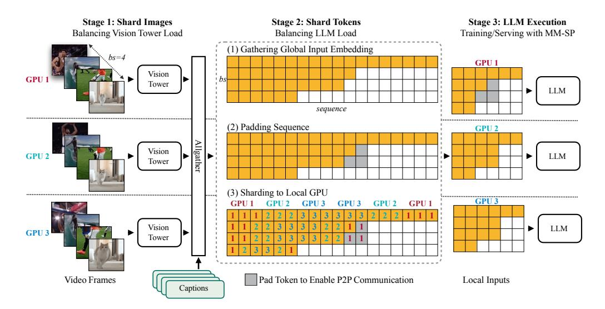
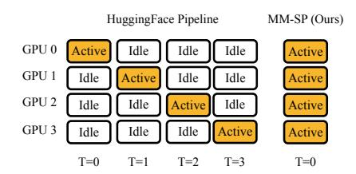

# 4 MULTI-MODAL SEQUENCE PARALLELISM

Training long-context Vision-Language Models (VLMs) results in substantial memory demands. The most widely used open-source solution, fully sharded data parallelism, does not distribute the activations generated by a single sequence, making it unsuitable for our needs. Consequently, we developed a custom system based on sequence parallelism [\(Li et al., 2021;](#page-12-4) [2023a;](#page-12-5) [Liu et al., 2023a;](#page-12-6) [Jacobs et al., 2023\)](#page-11-2), a technique commonly employed in existing foundation model systems to optimize text-only LLM training. However, we discovered that existing systems are neither efficient nor scalable enough to handle our long-context VLM workloads.

### 4.1 LIMITATIONS OF EXISTING SYSTEMS

Modality heterogeneity. In text-only LLMs, sequences are processed by a single tokenizer into tokens, allowing for straightforward distribution of tokens across multiple GPUs. However, VLMs incorporate an encoder architecture where non-text data is initially represented by a placeholder token (*e.g.,* ) and subsequently encoded into multiple real tokens during training. For instance, a single video frame typically requires around 256 tokens [\(Lin et al., 2023b\)](#page-12-1). Due to the differing processing requirements of visual and text modalities, a simplistic implementation that treats placeholder tokens the same as text tokens leads to an imbalance in GPU workloads (Figure [6\)](#page-4-1).

Networking heterogeneity. Our multi-modality comprises extremely long videos (Figure [1\)](#page-1-0), which requires employing sequence parallelism in a *multi-node* setting. In a multi-node setting, internode and intra-node network bandwidth differs significantly. For example, the NVIDIA DGX H100

Figure 7: Workflow of Multi-Modal Sequence Parallelism with a Batch Size (bs) of 4 and a Sequence Parallel Size (SP\_Size) of 3. To accommodate multi-modal inputs, we developed a customized sharding strategy that ensures balanced workload distribution and compatibility with SP communication.

utilizes NVLink at 900 GB/s for intra-node GPU communication and InfiniBand at 50 GB/s for inter-node GPU communication (single path), resulting in an  $18 \times$  difference in bandwidth. Previous work, Ring-Style sequence parallelism (Li et al., 2021; 2023a; Liu et al., 2023a; Zhu, 2023) ignores the heterogeneous networking feature on GPUs and utilizes P2P communication in both inter-node and intra-node settings. This design induces excessive communication costs where they usually attempt to overlap them into computation. However, we found that this design cannot always hide the overhead, and even slows down the computation kernel (Table 2).

Limited maximal sequence length. DeepSpeed-Ulysses (Jacobs et al., 2023) presents a potential solution to the communication challenges in ring-style sequence parallelism by employing All-to-All communication primitives, which reduce the overall communication volume. However, this approach has its limitations. The design relies on parallelizing along the attention head dimension rather than the sequence dimension during attention computation. As a result, DeepSpeed-Ulysses cannot scale effectively beyond the number of attention heads. For instance, the Llama-3 8B model uses Grouped Query Attention (GQA) with 8 Key-Value heads, which restricts the maximum sequence parallelism degree to 8. Even when using replication for Key-Value heads, which introduces additional communication overhead (Li et al., 2023a), the highest achievable sequence parallelism degree is still limited to 32 (the number of Query heads). This constraint is insufficient for handling extremely long sequences, such as full-length movies.

### 4.2 Multi-Modal Sequence Parallelism Training Mode

After identifying the limitations in existing systems, we conclude that an ideal multi-modal sequence parallelism approach should prioritize efficiency and scalability by addressing both modality and network heterogeneity, and should also be capable of scaling beyond the number of attention heads. To achieve this, we adopt 2D-attention (Fang & Zhao, 2024; Gu et al., 2024) mechanism for sequence parallelism. For instance, as illustrated on the left in Figure 6, to enable an 8-degree sequence parallelism across 2 nodes, we construct a  $4\times2$  communication mesh using 2D-SP. In this setup, the A2A process group, with a size of 4, distributes the QKV tensors according to the head dimension and re-partitions them along the sequence dimension within each node. Simultaneously, the P2P process group, with a size of 2, transfers the partitioned KV chunks between nodes. Additionally, to further explain how the 2D-attention mechanism operates, we depict the attention computation schedule using different methods in Figure 11.

**MM-SP workflow.** To address the challenge of modality heterogeneity, we propose a two-stage sharding strategy that optimizes the compute workload for both image encoding and language mod-

Table 2: The forward and backward attention kernel wall-clock time with or without the overlapping design (Unit: µs). The communication overlap design in Ring-style SP slows down the attention kernel by occupying streaming multiprocessor (SM) resources.

| Seq. length | 4K            | 8K            | 16 K          | 24K           | 32K            |
|-------------|---------------|---------------|---------------|---------------|----------------|
| forw. w/o   | 29.5          | 49.3          | 122.1         | 239.2         | 402.9          |
| forw. w/    | 35.0 (+18.6%) | 54.6 (+10.7%) | 131.2 (+7.5%) | 250.9 (+4.8%) | 420.1 (+4.2%)  |
| backw. w/o  | 77.7          | 123.3         | 362.9         | 730.0         | 1218.9         |
| backw. w/   | 82.2 (+5.8%)  | 129.8 (+5.3%) | 367.0 (+1.1%) | 743.2 (+1.8%) | 1225.3 (+0.5%) |

eling stages. As illustrated in Figure [7,](#page-5-0) the process begins by evenly distributing images (e.g., video frames) across devices within the sequence parallelism (SP) process group, thereby achieving load balancing during the image encoding stage. In the second stage, we aggregate global vision and text inputs for token-level sharding. To support ring-based attention, sequences are extended with arbitrary dummy tokens, ensuring that each sequence can be evenly divided according to the ring-based SP degree. This adjustment maintains consistency with the original approach by modifying label inputs to ignore padded tokens during loss calculation. We implement a balanced sharding strategy that distributes the context to each rank from both ends, ensuring equal computation across ranks. The effectiveness of this strategy will be demonstrated later (Table [5\)](#page-15-1). Since this redistribution is performed only once during training, the overhead is minimal. Finally, the balanced local inputs are processed by the LLM backbone, utilizing 2D-Attention to achieve efficient sequence parallelism.

### 4.3 MULTI-MODAL SEQUENCE PARALLELISM INFERENCE MODE

The model we developed through sequence parallelism training is capable of handling long-context multi-modal downstream tasks. However, the most commonly used inference system, built on HuggingFace Transformers, typically operates on a single GPU. This lack of distributed implementation limits the maximum sequence length that can be processed during inference. The most straightforward solution within HuggingFace Transformers is to use its pipeline parallelism inference feature, which shards a single model across multiple devices on a layer-by-layer basis [\(Huang et al., 2019;](#page-11-10) [Narayanan et al., 2019\)](#page-13-7). However, this approach is inefficient, as it only activates one GPU at a time. Additionally, it struggles to support long sequence because the first device must store large input embeddings and images, creating a memory bottleneck.

To address these limitations, we implemented sequence parallelism for distributed inference in VLMs. Unlike the training mode, the inference system additionally manages tensors, such as input tokens and position encodings, that progressively change during the decoding phase [\(Yu](#page-14-6) [et al., 2022\)](#page-14-6). It detects signals from the machine with the last token to terminate the distributed process appropriately. Compared to HuggingFace's pipeline parallelism strategy, our inference mode is more efficient, as all devices participate in computation simultaneously, accelerating the process by a factor proportional to the number of machines (Figure [8\)](#page-6-1). Furthermore, it is scalable, with memory evenly distributed across devices, enabling longer sequences with additional machines.

Figure 8: Inference scheduling comparison between HuggingFace Pipeline and MM-SP, illustrated with 4 GPUs. MM-SP utilizes all GPUs concurrently.

