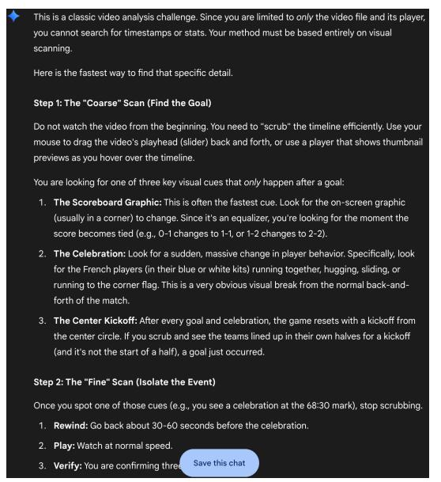

# 2. What Motivates VideoSIAH? Unveiling the Data Contamination in Qwen-VL Series

With the rapid advancements of LMMs, model performance on various benchmarks has steadily improved. However, the "black-box" nature of training data raises a critical question: *Do these improvements reflect genuine reasoning capability, or are they partly due to the model memorizing the benchmark samples?* To investigate this, we conduct a rigorous contamination study on the Qwen-VL series [\[1,](#page-8-18) [2\]](#page-8-15) across two probing settings: (1) No Visual, where we feed the text prompt without video frames to test for direct memorization; (2) Rearranged Choices, where we randomize the mapping between option labels and their textual content (e.g., assigning the original answer A to B) for multiple-choice questions (MCQs) to detect label memorization.

Our experimental results reveal significant vulnerabilities in existing benchmarks and highlight the necessity of our proposed VideoSIAH-Eval: *Observation 1: "No Visual" Performance Indicates Severe Leakage in Existing Benchmarks.* As shown in Table [1,](#page-12-1) both Qwen2.5-VL and Qwen3-VL achieve remarkably high scores on VideoMME and VideoMMMU even without seeing any video frames. Notably, for VideoMME, we specifically evaluate without subtitles to ensure there is no textual leakage, yet Qwen2.5- VL still achieves 40.1%, far exceeding random guessing (∼25%) for such four-option MCQs. Similar patterns of potential data leakage are observed on VideoMMMU. While the 'No Visual' scores of 38.3% (Comprehension) and 39.3% (Perception) might appear similar to VideoMME, they are statistically more improbable given the dataset composition.

(a) Watching Strategy of Gemini 2.5 Pro. (b) Watching Strategy of GPT-5 Thinking.

Figure 1. Comparison of Watching Strategies Proposed by Gemini 2.5 Pro [\[6\]](#page-8-8) and GPT-5 Thinking [\[34\]](#page-9-8). Best viewed when zoomed in.

| Setting                    | VideoMME [10] | VideoMMMU [14] | VideoSIAH-Eval |            |      |  |  |  |  |
|----------------------------|---------------|----------------|----------------|------------|------|--|--|--|--|
|                            | w/o subtitle  | adaptation∗    | comprehension  | perception | test |  |  |  |  |
| Qwen2.5-VL-7B-Instruct [2] |               |                |                |            |      |  |  |  |  |
| Original                   | 64.3          | 35.7           | 44.3           | 54.7       | 33.8 |  |  |  |  |
| No Visual                  | 40.1          | 27.0           | 38.3           | 39.3       | 12.7 |  |  |  |  |
| Rearranged Choices         | 56.0          | 31.6           | 40.3           | 67.0       | -    |  |  |  |  |
| Qwen3-VL-8B-Instruct [1]   |               |                |                |            |      |  |  |  |  |
| Original                   | 69.3          | 40.7           | 60.3           | 71.3       | 46.6 |  |  |  |  |
| No Visual                  | 44.1          | 35.1           | 39.3           | 46.7       | 0.00 |  |  |  |  |
| Rearranged Choices         | 69.0          | 38.7           | 47.7           | 69.3       | -    |  |  |  |  |

Table 1. Contamination Tests for Qwen-VL Series on Long Video Understanding and Reasoning Benchmarks. Results are reported across different perturbation settings. The best result in each block column is in bold, and the second-best is underlined. The VideoSIAH-Eval column shows "-" entries for Rearranged Choices since our proposed benchmark is fully open-ended QA, where random option-answer mapping is not applicable. Note that adaptation∗ is evaluated exclusively on multiple-choice questions.

Our statistics reveal that these subsets are overwhelmingly dominated by MCQs with 10 options (e.g., 286 out of 300 for Comprehension and 279 out of 300 for Perception), implying a random guessing baseline of only ∼ 10–16%. The fact that the model achieves scores significantly above this threshold absent any visual context indicates a high probability of benchmark memorization. In contrast, performance on VideoSIAH-Eval drops significantly in the "No Visual" setting. Specifically, Qwen3-VL collapses to a score of 0.00. Upon manual inspection, we find that without visual grounding, the model generates repetitive code or refusal messages, which is the expected behavior for a clean and non-contaminated benchmark. *Observation 2: "Rearranged Choices" Reveals Overfitting to Option Patterns.* For MCQ-

based benchmarks, we observe distinct performance drops when answer choices are rearranged. For instance, Qwen2.5- VL drops from 64.3 to 56.0 on VideoMME. This indicates that they heavily rely on memorizing specific option mappings (e.g., the answer to this question is usually "A") rather than understanding the content. Since VideoSIAH-Eval utilizes a fully open-ended QA format, it is inherently immune to this type of option hacking, providing a more robust assessment of the model's capabilities.

These findings confirm that existing benchmarks are compromised by data contamination (high "No Visual" scores) and option bias (sensitive to "Rearranged Choices"). This motivates the introduction of VideoSIAH-Eval, which ensures: (1) *Zero leakage* as verified by the 0.00 blind score,

and (2) *Immunity to option bias* via open-ended QA format.

## 3. Additional VideoSIAH Details

| Source            | Purpose                  | Samples |
|-------------------|--------------------------|---------|
| LLaVA-CoT [54]    | General Visual Reasoning | 54,591  |
| OpenVLThinker [7] | Complex Reasoning        | 2,829   |
| We-Math 2.0 [35]  | Mathematical Reasoning   | 602     |

Table 2. Detailed Statistics of Image-based CoT Data for Cold-Start SFT.

Breakdown of Image-based CoT Data. As detailed in Table [2,](#page-13-0) we construct a diverse mixture of image-based CoT data for the cold-start SFT stage, spanning general visual reasoning [\[54\]](#page-10-20), complex logical inference [\[7\]](#page-8-19), and mathematical problem-solving [\[35\]](#page-9-20). Drawing on insights from recent work [\[9,](#page-8-6) [61\]](#page-10-6), we leverage these image-based reasoning traces to strengthen the model's fundamental perceptual capabilities. This strategy exploits the inherent synergy between image and video modalities, where robust spatial grounding serves as a critical foundation for complex temporal reasoning.

Category Distribution for VideoSIAH-Eval. VideoSIAH-Eval comprises 244 videos and 652 high-quality QA pairs. As illustrated in Figure [2a,](#page-14-1) the video corpus encompasses a diverse spectrum of domains, ranging from Travel & Events to Gaming, ensuring broad coverage of real-world scenarios. Furthermore, Figure [2b](#page-14-1) highlights our deliberate emphasis on dynamic video reasoning: Action Recognition and Temporal Reasoning (17% in total) constitute a large portion of queries, rigorously benchmarking the model's capacity for fine-grained event perception and causal understanding in the temporal dimension.

