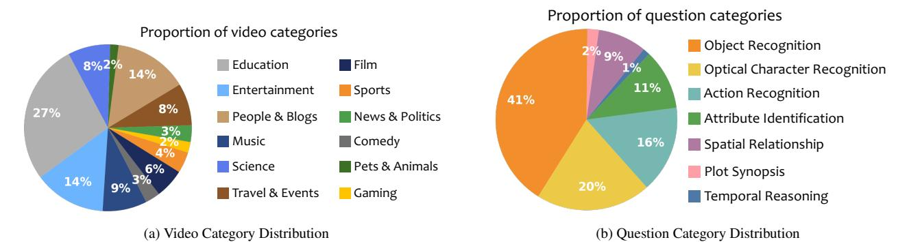
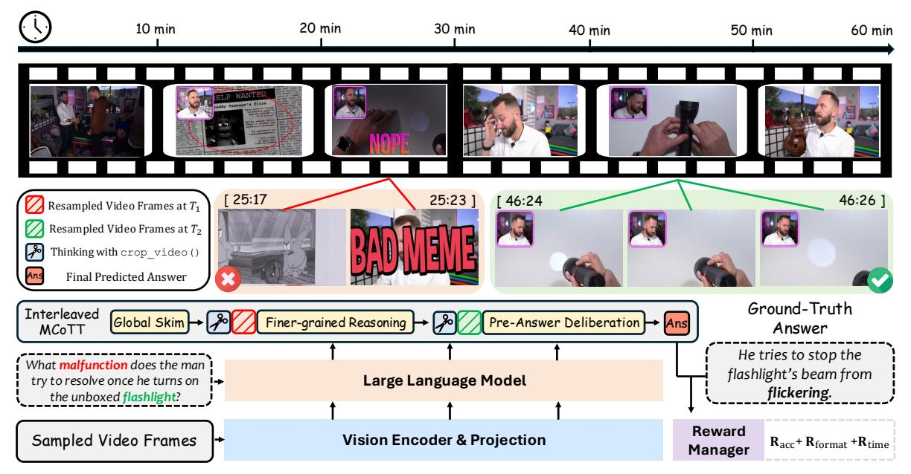
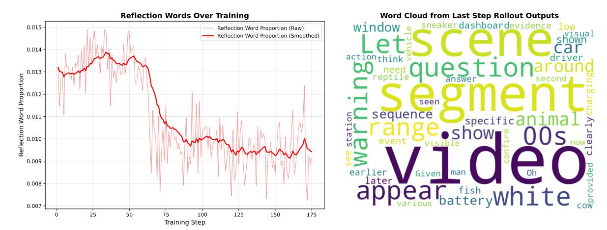

# 5. Reflection Trajectory: From Verbose Self-Correction to Internalized Tool Usage

We visualize the evolution of the model's internal thought process in Figure [4](#page-15-1) (left). Echoing the training dynamics observed in DeepEyes [\[66\]](#page-10-14), the trajectory of reflection token proportion discloses a distinct three-phase evolution from exploratory correction to efficient tool exploitation: (1) *Verbose Self-Correction (Steps 0*∼*50):* Initially, reflection density remains high. Due to insufficient localization accuracy, the model relies on extensive self-correction and iterative verbal reasoning to compensate for sub-optimal tool usage. (2) *Efficiency Optimization (Steps 50*∼*80):* A significant drop follows as the policy matures. As the model's intrinsic grounding capability improves, it identifies prolonged reflection to be redundant, autonomously pruning unnecessary linguistic fillers to maximize reward efficiency. (3) *Internalized Proficiency (After 80 Steps):* The curve stabilizes at a concise baseline, indicating a shift toward selective reasoning—the model invokes explicit reflection only when resolving ambiguity, having internalized the core semantics of tool interaction. Complementing this, the word cloud (right) confirms that the remaining reflection tokens are semantically grounded (e.g., "segment," "confirm"), serving as functional anchors for temporal reasoning rather than generating generic linguistic fillers.

## 6. Additional Implementation Details

The full set of experimental hyperparameters is detailed in Table [3.](#page-15-2)

1The crop video() function is an external executor; "native" refers to the fact that the tool-invocation policy is fully internalized by the model via end-to-end training, requiring no external retrieval agent.

Figure 2. Category Distribution of VideoSIAH-Eval. We present the distribution of video types (a) and question types (b), highlighting the diversity of our proposed benchmark.

Figure 3. Overall Framework of LongVT. Our approach processes long-form videos in a human-like two-stage manner. Specifically, LongVT is augmented with interleaved Multimodal Chain-of-Tool-Thought (iMCoTT): *first* performs a global skim over sampled video frames to form a coarse hypothesis about when evidence likely occurs; *then* invokes a native video tool[1](#page-13-1) crop video(start time, end time) to resample finer-grained frames from a short clip via a hypothesized window and reasons again. Our model itself determines whether to directly answer after one turn (T1) or continue for multiple turns (up to T5) with self-reflection. During reinforcement learning, we jointly optimize answer correctness (Racc), clean formatting (Rformat), and precise temporal grounding (Rtime).

SFT. We initialize the cold-start SFT phase using Qwen2.5- VL-7B-Instruct [\[2\]](#page-8-15), utilizing the LMMs-Engine [\[30\]](#page-9-21) framework. To optimize training throughput and minimize memory overhead, we employ an online stream packing strategy on iterable datasets. Specifically, instead of padding individual sequences, we concatenate input samples to fill a fixed buffer size of 51,200 tokens, thereby eliminating redundant computation on padding tokens. Incoming data is dynamically batched to maximize GPU utilization. Given the streaming nature of this pipeline, we train the model until convergence rather than adhering to a predetermined epoch count.

RL. For the RL stage, we build upon the verl library [\[39\]](#page-9-22), extending it to support multi-turn and multimodal toolaugmented rollouts via SGLang [\[65\]](#page-10-21). We configure a global batch size of 16 and sample 16 rollouts per prompt. To manage context limitations effectively, we restrict the maximum number of new tokens to 16,384 and impose a hard cap of 36,000 tokens on the total prompt length. A constant temperature of 1.0 is maintained across all experiments to encourage exploration. Given the significant computational cost associated with reinforcement learning, we adopt an early stopping strategy, terminating training once the reward metrics saturate.

Figure 4. Trend of Reflection-Related Words and the Corresponding Word Cloud across All Rollouts.

| Component             | SFT        | RL       | RFT    |
|-----------------------|------------|----------|--------|
| Optimizer             | AdamW [31] | AdamW    | AdamW  |
| Learning Rate (LR)    | 5e-5       | 1e-6     | 5e-5   |
| LR Scheduler          | cosine     | constant | cosine |
| Weight Decay          | 0.0        | 1e-2     | 0.0    |
| No. of Training Steps | 3000       | 160      | 1600   |
| No. of Warmup Steps   | 300        | 0        | 160    |
| Max Length            | 51200      | 52384    | 51200  |
| Dynamic Batch Size    | True       | False    | True   |
| Remove Padding        | True       | True     | True   |
| Liger Kernel          | True       | False    | True   |
| No. of GPUs           | 32         | 64       | 64     |
| No. of Frames         | 512        | 512      | 512    |

Table 3. **Detailed Hyperparameters across Training Stages.** Unless otherwise specified, all experiments are conducted on NVIDIA A800-SXM4-80GB GPUs.

RFT. The RFT stage serves to consolidate the agentic behaviors emerging from RL. We adhere to the same efficient training infrastructure and stream-packing protocols established in the SFT stage. However, critically, we initialize this stage using the best-performing checkpoint obtained from RL, rather than the base model. The training corpus contains high-quality, self-distilled trajectories filtered from the RL rollouts. To accommodate this augmented dataset and speed up the refinement process, we scale our computational resources from 32 to 64 GPUs. Accordingly, the training span is adjusted to approximately 1,600 steps, ensuring the model sufficiently internalizes the precise temporal grounding and reasoning patterns present in the self-generated traces.

**Evaluation.** We conduct comprehensive evaluations using the LMMs-Eval framework [63], maintaining a consistent testing environment across SFT, RL, and RFT checkpoints. To robustly assess tool-calling capabilities, we deploy a standard Model Context Protocol server paired with an online inference engine [20] that supports continuous batching for

asynchronous requests. We inject special delimiter tags into the generation stream to rigorously parse reasoning steps, tool invocations, and final answers. Performance is quantified using a hybrid scoring mechanism that integrates deterministic rule-based validators with semantic evaluation via an LLM-as-a-Judge [56] approach.

#### 7. Inference Efficiency Analysis

**Efficiency Analysis.** We present a comparative analysis of inference latency across four benchmarks in Table 4. Despite incorporating multi-turn tool interactions, LongVT-7B-RFT demonstrates remarkable efficiency, achieving the lowest latency on VideoMMMU (1329.8 seconds) and LVBench (1509.3 seconds), and maintaining highly competitive speeds on VideoMME and VideoSIAH-Eval. This counter-intuitive efficiency—where a multi-turn agentic framework outpaces single-turn baselines—can be attributed to the precision of our reasoning. Upon checking the inference results, we found that baselines like Qwen2.5-VL often have a higher chance of hallucinating, generating redundant descriptions by "blindly rephrasing" uncertain visual memories (as discussed in Figure 1 of the main paper). In contrast, LongVT proactively seeks evidence. By grounding its answer in retrieved frames, our model circumvents the need for verbose, uncertainty-driven fabrication, resulting in more concise and faster token generation overall.

**Note on Efficiency Context.** Our criterion for "fastest" does not imply skipping content arbitrarily. Instead, it aligns with human-like viewing: we do not expect the testee to watch the entire video frame-by-frame from start to finish before answering. In the context of LMMs, this translates to the ability to strategically sample and encode relevant segments, avoiding the prohibitive computational cost and context overflow associated with encoding extremely long sequences in their entirety.

| Model                 | VideoMMMU [14] | LVBench [49] | VideoMME [10] | VideoSIAH-Eval | Average |
|-----------------------|----------------|--------------|---------------|----------------|---------|
| Qwen2.5-VL-7B [2]     | 2108.6         | 2014.7       | 3031.6        | 1834.3         | 2247.3  |
| Video-R1-7B [9]       | 1341.8         | 1550.6       | 2483.3        | 1900.3         | 1819.0  |
| VideoRFT-7B [46]      | 1937.9         | 2154.3       | 3544.2        | 2052.6         | 2422.3  |
| Video-Thinker-7B [47] | 3153.8         | 3834.9       | 2475.1        | 1899.2         | 2840.8  |
| LongVT-7B-RFT (Ours)  | 1329.8         | 1509.3       | 2754.0        | 1891.1         | 1871.1  |

Table 4. Inference Latency (in seconds) Comparison Across Various Long Video Understanding and Reasoning Benchmarks. For each benchmark, the lowest latency is shown in bold, and the second-lowest is underlined. Intermediate variants such as LongVT-7B-SFT and LongVT-7B-RL are excluded to focus on representative baselines and final-stage models. All experiments are conducted using uniform 64-frame sampling and online inference served via vLLM [\[20\]](#page-8-20), with latency measured through LMMs-Eval [\[63\]](#page-10-19) on 8 NVIDIA A800-SXM4-80GB GPUs.

## 8. Examples

Prompts and Data Examples. To enhance reproducibility and transparency, we provide concrete examples of the key resources used in our experiments. Figure [5](#page-18-0) shows the RL prompt template, while Figure [6](#page-18-1) presents the evaluation prompts used in LLM-as-a-Judge [\[56\]](#page-10-17) for measuring answer's accuracy during RL. One representative sample from both SFT and RFT stages is shown in Figure [7.](#page-19-0)

Reasoning and Inference Examples. Beyond static prompts and data, we visualize the model's inference process to illustrate its reasoning and self-correction behavior. Figure [8](#page-20-0) highlights a single-turn case where the model uses internal monologue to re-check visual evidence and successfully self-correct an initial hallucination. Figure [9](#page-21-0) further shows a multi-turn example in which tool interactions iteratively refine the temporal window. Finally, Figure [10](#page-22-0) compares our approach with a standard textual CoT baseline: while the latter hallucinates unseen visual details (e.g., incorrect object appearance), our method follows an active verify-and-correct procedure—detecting that the retrieved segment lacks the queried object, adjusting the crop region, and ultimately locating the correct evidence to produce the accurate answer.

## 9. Failure Case Analysis

To further illustrate the instability of the RL-only variant discussed in Section 5.3 of the main paper, we present a representative failure case. As shown in Figure [11,](#page-23-0) the model correctly recognizes the need to invoke a tool to inspect the glass coffee table. However, after receiving the resampled video frames, it fails to integrate the returned evidence to answer the specific question ("which video-game device"). Instead of performing the required reasoning, the model becomes confused by the context shift and reverts to generic video captioning, merely restating superficial scene descriptions. This behavior underscores the importance of the SFT cold start in teaching the model the intended semantics of tool usage, enabling it to correctly interpret tool outputs and

incorporate them into its reasoning process.

