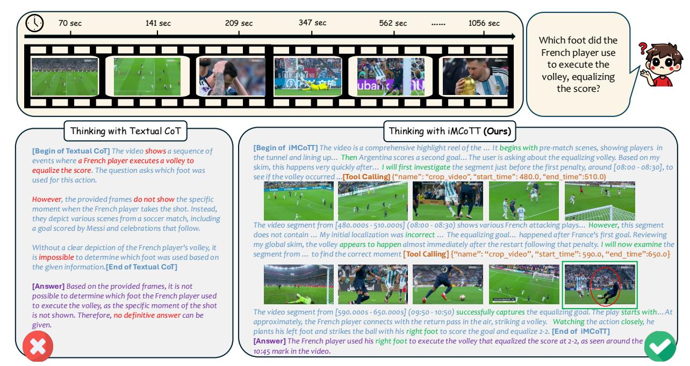

# LongVT: Incentivizing "Thinking with Long Videos" via Native Tool Calling

Zuhao Yang1,2,5,\*, Sudong Wang1,3,5,\*, Kaichen Zhang1,2,5,\*, Keming Wu1,4,5, Sicong Leng2, Yifan Zhang1, Bo Li2,5, Chengwei Qin3, Shijian Lu2,⋈, Xingxuan Li1,⋈, Lidong Bing1

1MiroMind, 2NTU, 3HKUST(GZ), 4THU, 5LMMs-Lab

https://evolvinglmms-lab.github.io/LongVT/

Figure 1. Interleaved Multimodal Chain-of-Tool-Thought (iMCoTT). Compared to prior text-based Chain-of-Thought (CoT) reasoning, iMCoTT in our proposed *LongVT* can *natively* perform self-reflection via *calling* crop\_video(start\_time, end\_time) *tool*. It proposes a time window after a global preview, proactively fetches the corresponding short clip, rethinks based on the new evidence, and determines whether to refine or answer directly. Such tool-augmented reasoning behaviors ground each step in what is actually seen rather than blindly rephrasing in text-only CoT, which mitigates hallucination and leads to enhanced temporal localization and answer correctness.

### **Abstract**

Large multimodal models (LMMs) have shown great potential for video reasoning with textual Chain-of-Thought. However, they remain vulnerable to hallucinations, especially when processing long-form videos where evidence is sparse and temporally dispersed. Inspired by how humans comprehend long videos—by first skimming globally and then examining relevant clips for details—we introduce LongVT, an end-to-end agentic framework that enables "Thinking with Long Videos" via interleaved Multimodal Chain-of-Tool-Thought. Specifically, we exploit LMMs' inherent temporal grounding ability as a native video cropping

tool to zoom in on a specific video clip and resample finergrained video frames. This global-to-local reasoning loop continues until answers are grounded in retrieved visual evidence. Given the scarcity of fine-grained question-answering (QA) data for the long video reasoning task, we curate and release a data suite named VideoSIAH to facilitate both training and evaluation. Specifically, our training dataset consists of 247.9K samples for tool-integrated cold-start supervised fine-tuning, 1.6K samples for agentic reinforcement learning, and 15.4K samples for agentic reinforcement fine-tuning. Our evaluation benchmark consists of 652 QA pairs that are carefully curated through a semi-automatic data pipeline with human-in-the-loop validation. With a meticulously designed three-stage training strategy and extensive empirical validation, LongVT consistently outper-

\*Equal Contribution ™Corresponding Authors: Shijian.Lu@ntu.edu.sg,xingxuan.li@miromind.ai

*forms existing strong baselines across four challenging longvideo understanding and reasoning benchmarks. Our code, data, and model weights are publicly available at* [https:](https://github.com/EvolvingLMMs-Lab/LongVT) [//github.com/EvolvingLMMs-Lab/LongVT](https://github.com/EvolvingLMMs-Lab/LongVT)*.*

## 1. Introduction

Understanding long-form videos (>15 minutes) poses a major challenge in multimodal intelligence [\[10,](#page-8-0) [14,](#page-8-1) [49,](#page-10-0) [52\]](#page-10-1). Compared with short clips, long videos contain complex event structures and require sustained comprehension across thousands of frames, supporting tasks such as video question answering (QA) [\[3,](#page-8-2) [24,](#page-9-0) [27,](#page-9-1) [49,](#page-10-0) [52\]](#page-10-1), temporal grounding [\[11,](#page-8-3) [19,](#page-8-4) [36,](#page-9-2) [55,](#page-10-2) [58\]](#page-10-3), and dense captioning [\[15,](#page-8-5) [19,](#page-8-4) [68\]](#page-10-4). These capabilities underpin applications such as soccer event spotting [\[26\]](#page-9-3) and film understanding [\[40\]](#page-9-4). Recent LMMs [\[9,](#page-8-6) [25,](#page-9-5) [46,](#page-9-6) [50,](#page-10-5) [61\]](#page-10-6) exhibit promising short video reasoning, yet most rely on the R1-style paradigm [\[12\]](#page-8-7)—supervised fine-tuning (SFT) with textual Chain-of-Thought (CoT), followed by Group Relative Policy Optimization (GRPO)-based reinforcement learning (RL) [\[37\]](#page-9-7). Such pipelines remain largely language-centric, limiting visual reasoning and increasing hallucinations in long-video scenarios [\[62\]](#page-10-7). Moreover, their uniform sampling fails to adaptively capture key visual evidence, often missing fine-grained or decisive moments critical for long-video reasoning. This motivates our central question: *Can LMMs reliably reason over long videos by performing human-like visual operations to guide their reasoning?*

Let us consider the following scenario: a testee is asked to answer the question, "Which foot did the French player use to execute the volley, equalizing the score?" using only the silent video of a football match. Without audio, metadata, or timeline markers, the testee must rely purely on visual inspection. Based on common viewing habits, a human would typically jump through the video in coarse intervals, searching for strong visual indicators of a goal—such as crowd reactions, player celebrations, referee gestures, or scoreboard updates. After locating a likely scoring segment, the testee would rewind slightly and examine the surrounding frames more carefully to pinpoint the exact equalizing moment, and then verify the scoring foot using close-up shots. Notably, when we prompt two state-of-the-art proprietary LMMs (i.e., GPT-5 [\[34\]](#page-9-8) and Gemini 2.5 Pro [\[6\]](#page-8-8)) with the same task, the strategies they propose closely mirror this human-intuitive procedure (see the Supplementary Material).

As illustrated in Figure [1,](#page-0-0) the testee, seeking to save time, avoids scanning the entire video frame by frame. Instead, they first perform a coarse global skim and then zoom in on promising segments. When projected to the LMM setting, this global-to-local reasoning strategy enables models with limited context length to process extremely long videos effectively. To implement such a strategy, we design interleaved Multimodal Chain-of-Tool-Thought (iMCoTT) that enables LMMs to naturally interleave reasoning with ondemand temporal retrieval via dynamically selecting and re-inspecting video segments of interest. Such LMM behaviors stem from *latent* temporal grounding capabilities that are activated through tool-integrated fine-tuning, without an auxiliary expert model or external retriever. Our designed iMCoTT enables "looking again" by proposing a more robust time window, examining that snippet, and revising its hypothesis when necessary. This helps reduce hallucinations and reveals finer details, akin to human self-reflection upon realizing an initially inspected segment was erroneous.

This human-inspired "Thinking with Long Videos" paradigm is naturally suitable for queries that either require aggregating clues across multiple shots or hinge on a brief and evidence-bearing segment within hours-long footage. Yet, the open-source community lacks training and evaluation data with such fine-grained queries: most public datasets emphasize general and high-level questions but rarely train and evaluate reasoning capability under a "Video Segment-In-A-Haystack" setting. We address this grand challenge by constructing VideoSIAH that comprises high-quality QA pairs and tool-augmented reasoning traces. VideoSIAH comprises 247.9K samples for SFT, 1.6K samples for agentic RL, and 15.4K samples for reinforcement fine-tuning (RFT). Besides, we curate a dedicated evaluation benchmark, VideoSIAH-Eval, comprising 652 QA pairs that have undergone human-in-the-loop validation [\[4\]](#page-8-9), where each question's supporting evidence lies within a narrow window relative to the full video duration.

In this paper, we introduce LongVT, an end-to-end agentic framework that elicits LMMs' ability for "Thinking with Long Videos" via a three-stage training strategy with large-scale and high-quality Tool-augmented data from VideoSIAH. The *first* stage performs cold-start SFT that empowers the base LMM with three fundamental capabilities: (1) proposing a precise window for relevant event(s), (2) reasoning over densely resampled frames within the window, and (3) self-correcting when the window is suboptimal. The *second* stage adopts agentic RL for enhancing the model's generalization over open-ended QA tasks. Unlike existing work that relies on answer-only rewards for video QA and IoU rewards for temporal grounding [\[9,](#page-8-6) [50\]](#page-10-5), we design a joint answer-temporal grounding reward function that explicitly encourages exploratory rollouts with improved temporal localization while preserving answer correctness. The *third* stage leverages agentic RFT where the model is further optimized by utilizing filtered rollout traces distilled from its own RL-trained policy. This stage stabilizes agentic behaviors learned during RL and consolidates fine-grained temporal localization and multi-step reasoning.

The contributions of our work can be summarized in three major aspects. First, we introduce an end-to-end agentic paradigm that natively interleaves multimodal toolaugmented CoT with on-demand clip inspection over hourslong videos, thereby enabling LMMs to perform more effective and reliable long-video reasoning. Second, to facilitate training and evaluation of evidence-sparse long-video reasoning, we construct a scalable data pipeline that produces diverse and high-quality QAs and tool-integrated reasoning traces, and a dedicated benchmark under a video segmentin-a-haystack setting. Third, we conduct comprehensive ablations and are the first to systematically validate that the joint answer-temporal grounding reward and RFT each yield consistent gains over SFT and RL alone for long-video reasoning, establishing a state-of-the-art baseline with invaluable insights.

# LongVT: Incentivizing "Thinking with Long Videos" via Native Tool Calling

