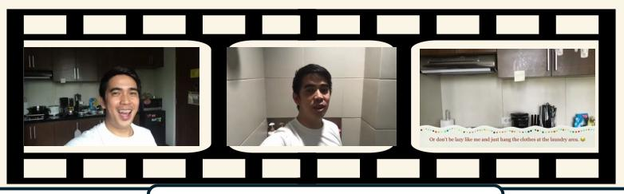

# Prompt for LLM-as-a-Judge

Below are two answers to a question. Question is [Question], [Standard Answer] is the standard answer to the question,

and [Model\_answer] is the answer extracted from a model's output to this question.

Judge how consistent the two answers are.

### Scoring rules

- 1 Fully consistent: they convey the same meaning (e.g., "pink" vs. "it is pink").
- 0.5 Partially consistent: they overlap on some key points but not all.
- 0 Inconsistent: they conflict or share no essential overlap.

Output \*\*only\*\* one of the following numbers: 1, 0.5, or 0.

Figure 6. Evaluation Prompt for LLM-as-a-Judge. We present the full system instruction used to query the judge model. This prompt defines the scoring criteria and guidelines to ensure consistent evaluation of the model's generated responses.

### Data Example for SFT/RFT

**Question** Across the series of festive snack demonstrations—from showing the Planters Holiday Crunch through tasting chocolates—what does the man consistently keep in his arms? Think first, call \*\*crop\_video\*\* if needed, then answer. Format strictly as: <think>...</think> <tool\_call>...</tool\_call> (if tools needed) <answer>...</answer>. The Video path for this video is:

**Answer** <think>The video opens with a couple in festive hats, transitioning to a vlog title before showing them driving in a car and then shopping for Christmas items like sweaters and pet toys, around 3:00 to 4:00. Later, the couple returns home, still wearing their hats, and begins demonstrating and tasting a variety of holiday snacks. During this segment, starting with the presentation of Planters Holiday Crunch and continuing through the tasting of different chocolates, the man consistently holds a small white dog in his arms. This continuous presence of the dog in his arms is evident throughout the snack review portion of the video, specifically within the timeframe of [763.00s – 995.00s].</think>

<tool\_call>{"name":"crop\_video","arguments":{"video\_path": Video path here, "start\_time": 763.0, "end\_time": 995.0}}</tool\_call>

<tool\_response>The tool executed successfully. Here are the processed result: (Processed video here) </tool\_response>

<think>This window provides clear evidence that the man consistently holds a small white dog in his arms throughout the snack demonstrations. From the initial presentation of the Planters Holiday Crunch around ~770s, through tasting the Smash-Mallows (≈820s–860s), to showing and tasting the Nutcracker sugar cookies and various chocolates (≈900s–995s), the dog is visibly present in his arms or on his lap. This observation strongly confirms the earlier hypothesis about the continuous presence of the dog. The localization of this window was appropriate and sufficiently covers the entire period of the snack demonstrations relevant to the question.</think> <answer> A small white dog. </answer>

Figure 7. Representative Data Example for SFT and RFT. The example illustrates the input format and the corresponding ground-truth response used to train the model across both fine-tuning stages.

*What color is the basin the man uses when hand-washing clothes before he later hangs the dripping garments with green clothespins on a drying rack?*

