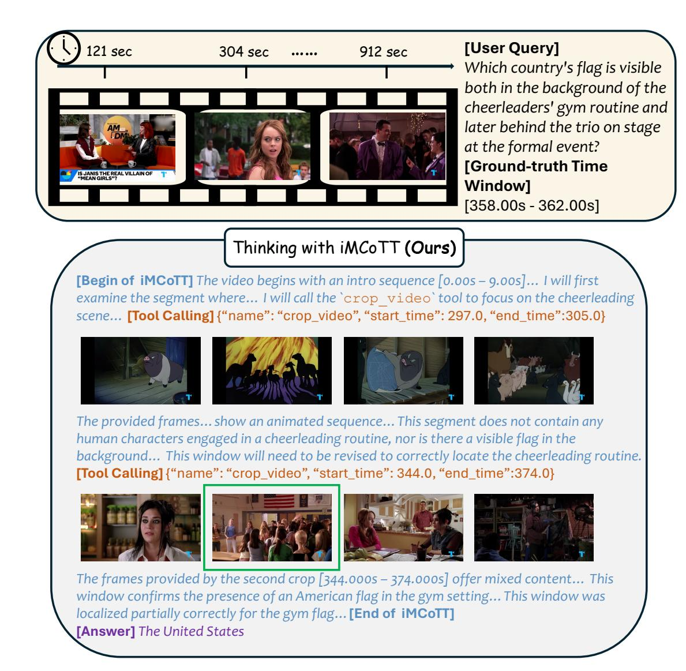
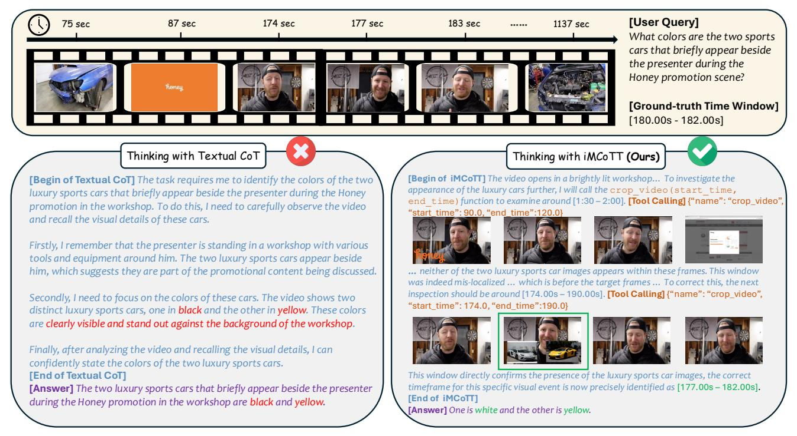
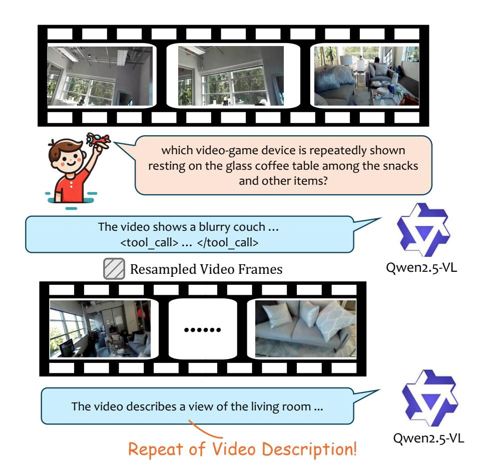

# Thinking with iMCoTT (Ours)

**[Begin of iMCoTT]** *Let me think... The man starts in a kitchen, but soon moves to the laundry area. I notice him using a basin for hand-washing clothes. The color of this basin is quite distinct. It appears to be a bright, cheerful color. Hmm, I think it's pink. Wait, I should doublecheck the details of the video frame by frame to ensure I'm accurate. As he finishes washing and moves to hang the clothes, I can confirm that the basin he used is indeed pink. It's a vibrant pink, which contrasts well with the green clothespins and the darker fabrics. Oh, I see. This matches the scene described in the question. Now, I need to verify one more time that the hand-washing happens before the hanging on the drying rack.* **[Tool Calling]** {"name": "crop\_video", "start\_time": 51.0, "end\_time":117.0}

*Let me think through this again…In the provided video clip, the man is shown…The basin he uses is clearly blue. This is evident in multiple frames where he is seen filling the blue basin with water and scrubbing the clothes… Cross-checking my observations: The blue basin is used for the hand-washing, and subsequently, the clothes from this basin are hung with green clothespins. Therefore, based on the visual evidence and the logical flow of events, the color of the basin used for hand-washing is blue.*

**End of iMCoTT]**

**[Answer]** *Blue* self-correction !

Figure 8. An Example of Single-turn Inference with Self-Correction. The model initially misidentifies the basin color as pink. However, through the reasoning process (highlighted in the "Thinking" block), it explicitly decides to double-check the frames, corrects the hallucinations, and outputs the correct answer (Blue).

Figure 9. An Example of Multi-step Inference Involving Tool Interaction. In this complex query, the model initially crops an incorrect time window (297s-305s) which lacks the target visual information. Recognizing this error during the reasoning phase, it refines the parameters and calls the tool again with the correct window (344s-372s) to successfully identify the US flag.

Figure 10. Qualitative Comparison between Textual CoT and Our Designed iMCoTT. The baseline textual CoT (left) relies on hallucinated memory, confidently providing an incorrect answer regarding the cars' colors ("Black and Yellow"). In contrast, our model (right) actively engages with the video content via tool usage. Despite an initial mis-localization (90s-120s), the model explicitly detects the absence of the target object, self-corrects its temporal search window to the correct range (174s-190s), and accurately identifies the cars as "White and Yellow."

Figure 11. Failure Case of the RL-only Variant. This example demonstrates the model's inability to maintain the logical flow after a tool interaction without prior SFT. Although the model initiates a tool call to inspect the blurred region, it fails to utilize the returned observation to answer the user's question. Instead, it loses the conversational context and hallucinates a repetition of the general video description.