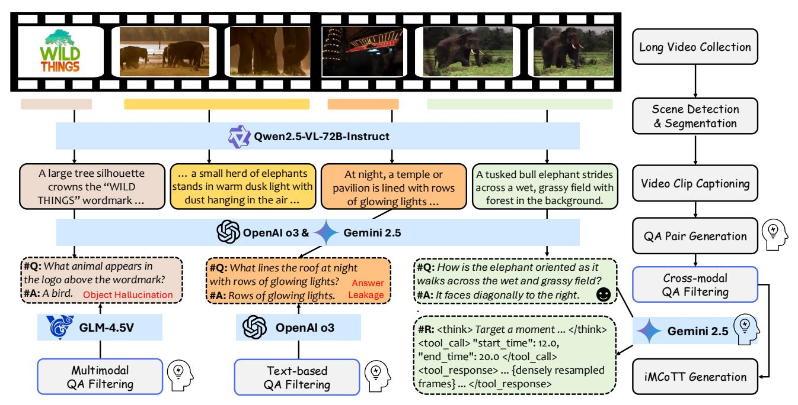
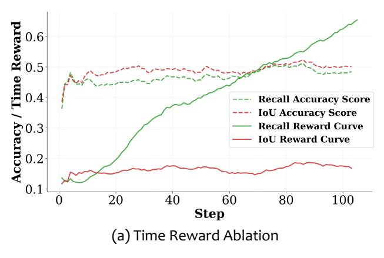
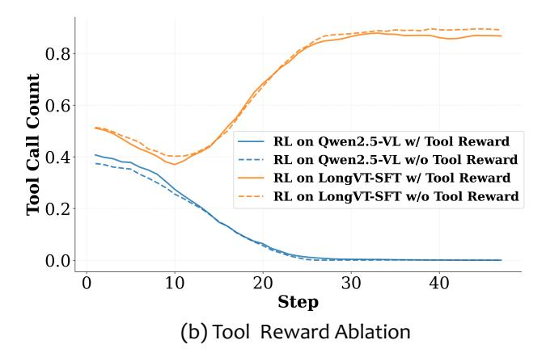

# 3. VideoSIAH: A Fine-Grained Data Suite for Evidence-Sparse Long-Video Reasoning

Long-video reasoning presents a fundamentally different challenge from previous video QA settings: LMMs must locate *sparse, fine-grained, and causally decisive* moments embedded within hours-long content. However, existing toolaugmented LMMs [\[41,](#page-9-15) [62\]](#page-10-7) are mostly trained with *coarsegrained and clip-level* data. This mismatch leaves modern LMMs lacking the supervision needed to learn how temporal hypotheses are formed, verified, or revised—a critical yet underexplored capability for agentic long-video reasoning. Moreover, most existing video understanding benchmarks [\[10,](#page-8-0) [49,](#page-10-0) [52\]](#page-10-1) only offer multiple-choice QAs, which can be solved without genuine temporal grounding and are vulnerable to dataset leakage or shortcut exploitation. Evidence and discussion can be found in the Supplementary Material. To fill this gap, we introduce VideoSIAH, a large-scale, diverse, and high-quality data suite that serves collectively as a training dataset capturing the reasoning dynamics required for segment-in-a-haystack question-answering, and a fine-grained evaluation benchmark, VideoSIAH-Eval, with human-in-the-loop validation for long-video open-ended question-answering.

## 3.1. Data Pipeline

As illustrated in Figure [2,](#page-3-0) VideoSIAH is curated through a semi-automatic, human-in-the-loop pipeline that constructs temporally grounded reasoning traces aligned with human cognitive processes during evidence-sparse long-video reasoning. We apply a deterministic, pixel-level scene detection algorithm on long videos and merge consecutive segments shorter than 10 seconds to obtain semantically stable units, ensuring that tool usage is grounded in visually coherent temporal intervals rather than random splits. For each segment, Qwen2.5-VL-72B [\[2\]](#page-8-15) generates detailed descriptions capturing salient objects, spatial relations, and evolving events. These captions serve as the semantic basis for generating temporally grounded QA pairs. Initial QAs are created from the captions, covering temporal events, spatial layouts, motion, object attributes, and scene transitions, ensuring broad coverage at scale.

To ensure quality, we employ two filtering stages: (1) text-based QA filtering, which removes low-quality or illposed QAs (e.g., answer leakage) using linguistic heuristics and model agreement; and (2) multimodal QA filtering, where GLM-4.5V [\[13\]](#page-8-16) verifies answer consistency against the video segment, eliminating hallucinated and visually unsupported claims. Annotator feedback further refines

Figure 2. **Data Pipeline of VideoSIAH.** We construct a semi-automatic data pipeline that integrates several state-of-the-art LMMs [2, 6, 13, 44] to sequentially perform long video segmentation, video clip captioning, segment-in-a-haystack QA generation, cross-modal QA filtering, and iMCoTT generation. Icons with human silhouettes denote human-in-the-loop validation, where annotators inspect a small set of representative failures to refine prompting rules for QA generation, QA filtering, and iMCoTT generation. Note that iMCoTT traces are generated only for the cold-start SFT stage, whereas RL training operates solely on the filtered QA pairs.

prompting rules for QA generation, filtering, and iMCoTT construction. This prompt-feedback refinement loop boosts reliability without heavy manual annotation, yielding high-fidelity, temporally grounded, and scalable data.

#### 3.2. Dataset Curation

SFT Data Curation. Our SFT data is constructed from three major categories: (1) tool-augmented multi-round data, (2) image reasoning data, and (3) video reasoning data, with the goal of enhancing both tool-calling capability and general reasoning performance. We curate tool-augmented QA pairs following the pipeline illustrated in Figure 2. When processing hours-long videos, we find that sparsely sampled frames from a single round often fail to capture the correct temporal segment, which makes multi-round tool-calling necessary. To address this limitation, we generate multi-round tool-calling traces in an adaptive manner based on video length. Specifically, we define the probability of selecting a sample for multi-round curation as

$$P_{\rm multi} = 1 - \frac{L_{\rm max} - {\rm clip}(L_{\rm video}, L_{\rm min}, L_{\rm max})}{L_{\rm max} - L_{\rm min}}, \label{eq:pmulti}$$

where  $P_{\mathrm{multi}}$  denotes the probability of choosing a given data sample for multi-round generation,  $L_{\mathrm{video}}$  represents the video length, and  $L_{\mathrm{max}}$  and  $L_{\mathrm{min}}$  are the maximum and minimum video length thresholds, respectively. The function  $\mathrm{clip}(x,a,b)$  restricts x to the range [a,b]. Videos selected

| Split          | Source                      | Purpose                              | Samples | Total   |
|----------------|-----------------------------|--------------------------------------|---------|---------|
|                | LongVideo-Reason CoT [5] | Reasoning-augmented Open-ended QA | 5,238   |         |
| SFT (w/o tool) | Video-R1 CoT [9]            | Reasoning-augmented Video QA      | 165,575 | 228,835 |
|                | Image-based CoT             | Reasoning-augmented Image QA         | 58,022  |         |
| SFT (w/ tool)  | Gemini-distilled iMCoTT  | Tool-augmented Open-ended QA         | 12,766  | 19,161  |
|                | Qwen-distilled iMCoTT    | Tool-augmented Temporal Grounding | 6,395   |         |
| RL             | Gemini-distilled QAs     | Open-ended QA over Long Videos    | 1,667   | 17,020  |
| RFT            | Self-distilled iMCoTT    | Agentic Behaviors                    | 15,353  |         |

Table 1. **Dataset Statistics of VideoSIAH.** Our proposed dataset contains non-tool SFT data, tool-augmented SFT data, RL QAs, and self-distilled RFT traces.

under this criterion undergo multi-round data generation to ensure that longer videos receive proportionally more toolcalling rounds, improving temporal coverage and reasoning completeness. We further gather a mixture of diverse video and image reasoning datasets.

**RL Data Curation.** For RL, the split is built from the filtered segment-in-a-haystack QA pairs produced by our data pipeline in Section 3.1. Each QA is associated with the length of its source video, and we partition candidates into several duration bands (short, medium, long). From these

bands, we sample a length-balanced subset, ensuring the RL data is not dominated by very short clips and instead covers a diverse range of video durations. On top of this lengthbalanced pool, we apply a simple difficulty-aware filter based on multi-turn tool runs. For each question, we draw K rollouts of the current policy; if all K trajectories answer correctly (too easy) or all K fail (too hard), we discard the item and retain only questions with mixed outcomes. This focuses RL on a middle band of difficulty and avoids degenerate reward signals, yielding a more informative and stable optimization process.

RFT Data Curation. To construct the RFT traces, we filter trajectories from early RL runs and retain only highquality cases. Concretely, a trajectory is kept if the model produces the correct final answer and its predicted temporal span attains an Intersection over Union (IoU) of at least 0.3 with the annotated ground-truth window. This dual criterion enforces both semantic correctness and sufficiently accurate temporal grounding, ensuring the curated traces reflect genuinely successful long-video reasoning rather than reward hacking or lucky guesses. We then convert these filtered trajectories into supervised training examples for post-RL refinement. Training on this self-generated, well-grounded subset provides high-precision in-distribution supervision, stabilizes optimization, and further strengthens the model's grounding and tool-calling behavior beyond what SFT alone can provide.

### 3.3. Dataset Statistics

As shown in Table [1,](#page-3-1) VideoSIAH comprises 228,835 SFT samples with normal (non-tool) CoT annotation, 19,161 toolaugmented SFT samples, and 17,020 instances used for RL and RFT. In the SFT split, the non-tool portion is dominated by long-video reasoning data [\[5\]](#page-8-14), complemented by Video-R1-CoT [\[9\]](#page-8-6) and a smaller amount of hard imagebased CoT supervision. A detailed breakdown can be found in the Supplementary Material. The tool-augmented subset combines Gemini 2.5 Flash [\[6\]](#page-8-8) distilled CoT traces (i.e., iM-CoTT) for open-ended QA and Qwen2.5-VL-72B-Instruct [\[2\]](#page-8-15) distilled traces for temporal grounding, providing joint supervision for tool usage and timestamp prediction. For the RL split, we filtered a high-quality subset of QA instances from Section [3.1.](#page-2-0) For RFT, we further select high-quality RL rollout traces for post-RL refinement, providing dense supervision that enables the policy to go well beyond the SFT-only performance ceiling. Together, these components yield a large-scale and diverse dataset spanning SFT, RL, and RFT, covering high-level reasoning, temporal grounding, and tool-integrated behaviors. For evaluation, we introduce the VideoSIAH-Eval benchmark, which consists of 244 videos

and 652 carefully filtered QA pairs[1](#page-4-0) via human-in-the-loop validation. This benchmark is specifically designed for longform video reasoning with an average video duration of approximately 1,688 seconds. The duration distribution is concentrated in the 15-30 minute range (71.84%), with the remaining 28.16% of videos being longer than 30 minutes.

## 4. Training Strategy

To make full use of the VideoSIAH and elicit robust "Thinking with Long Videos" behaviors, LongVT adopts a threestage training pipeline: (1) cold-start supervised fine-tuning, which teaches the base model to propose temporal windows, invoke video tools, and compose multimodal evidence; (2) agentic reinforcement learning, which optimizes a joint answer–temporal-grounding reward to refine tool-using rollouts; and (3) agentic reinforcement fine-tuning, which distills high-quality RL trajectories back into supervised data to stabilize these behaviors and consolidate long-horizon reasoning.

## 4.1. Cold-Start Supervised Fine-Tuning

As shown in Figure [3-](#page-5-0)(b), our preliminary RL experiments using Qwen2.5-VL-7B [\[2\]](#page-8-15) as the baseline model reveal that the model fails to improve during RL and ultimately collapses with continued training. This analysis of training dynamics indicates two major deficiencies of the base LMM: (1) the inability to correctly localize the relevant temporal window within a long video, and (2) insufficient reasoning capability when integrating tool outputs. We also present a straightforward failure case in the Supplementary Material that illustrates the necessity of a cold-start SFT stage. These limitations highlight that the model's native tool-calling abilities are too weak for direct RL training. Therefore, a coldstart stage is indispensable for establishing a reliable foundation. After applying SFT cold start, the model's tool-calling activeness improves substantially and continues to increase steadily during RL, supported by results in Table [3.](#page-7-0)

## 4.2. Agentic Reinforcement Learning

In this stage, we treat the model as a tool-using agent that decides when to inspect the video, how long to crop, and how to integrate the retrieved evidence into its reasoning. We employ GRPO [\[37\]](#page-9-7) to achieve this objective. In addition, we introduce a three-part reward modeling that jointly optimizes answer accuracy, format compliance, and temporal grounding precision of sampled trajectories, namely, *joint answer-temporal grounding reward*. Prior work [\[9,](#page-8-6) [50\]](#page-10-5) typically targets either answer correctness or time alignment in isolation. We take a further step toward unifying these

1An earlier release contained 1,280 entries due to unintentional duplication during data export; the cleaned version with 652 unique QA pairs is available on our project page. Since the duplication was approximately uniform across entries, the impact on reported metrics is negligible.

Figure 3. **Ablations on Reward Design.** The left panel shows training dynamics under different accuracy and time rewards, and the right panel shows the effect of tool-call reward on tool usage.

signals within a single reward function for open-ended longvideo QA. This coupling ties answer selection to where the evidence lies in time, improving final-answer correctness and promoting more effective tool use at inference, with more reliable and precise timestamp proposals.

**Answer Accuracy.** Let K be the number of sampled rollouts in a group. For the k-th rollout  $(k \in \{1, \dots, K\})$ , let  $\hat{a}^{(k)}$  denote its generated answer and let  $a^*$  denote the ground-truth answer. Since open-ended QAs cannot be reliably evaluated by rule-based matching, we employ LLM-as-a-Judge [56] with a strict judging protocol that avoids rewarding ambiguous cases to obtain a categorical verdict

$$J^{(k)} = \mathrm{Judge}_{\mathrm{LLM}} \big( \hat{\boldsymbol{a}}^{(k)}, \, \boldsymbol{a}^{\star} \big) \in \{ \mathrm{F}, \mathrm{P}, \mathrm{I} \},$$

where F = fully consistent (semantically equivalent to  $a^*$ ), P = partially consistent (contains some correct information but is incomplete or imprecise), and I = inconsistent (incorrect or contradictory).

The accuracy reward is then defined as the normalized score

$$\mathbf{R}_{\text{acc}}^{(k)} = \begin{cases} 1, & \text{if } J^{(k)} = \mathbf{F}, \\ 0.5, & \text{if } J^{(k)} = \mathbf{P}, \\ 0, & \text{if } J^{(k)} = \mathbf{I}. \end{cases}$$

**Format Compliance.** Let  $y^{(k)}$  denote the full textual output of the k-th rollout. We set  $\mathbf{R}_{\text{format}}^{(k)} = 1$  if  $y^{(k)}$  matches the required output schema  $\mathcal{S}$ , and 0 otherwise.

**Temporal Overlap.** Following previous temporal grounding work [9, 25], we use standard temporal IoU as the reward function for temporal localization. For a prediction  $[t_s, t_e]$  and ground truth  $[t_s', t_e']$ ,

IoU = 
$$\frac{|[t_s, t_e] \cap [t'_s, t'_e]|}{|[t_s, t_e] \cup [t'_s, t'_e]|}.$$

We directly set  $\mathbf{R}_{\text{time}}^{(k)} = \text{IoU}^{(k)}$ , which equals 1 only when the predicted span matches the ground truth exactly and 0 when there is no overlap.

Overall Reward. The final reward combines all three com-

ponents: 
$$\mathbf{R}^{(k)} = \mathbf{R}_{\text{acc}}^{(k)} + \mathbf{R}_{\text{format}}^{(k)} + \mathbf{R}_{\text{time}}^{(k)}$$
.

#### 4.3. Agentic Reinforcement Fine-tuning

We further leverage RFT [42] to stabilize the model's agentic behaviors and consolidate multimodal reasoning. Specifically, we select high-quality cases from early RL rollouts that exhibit both accurate temporal localization and coherent reasoning toward the final answer, and incorporate these trajectories back into the supervised fine-tuning curriculum as privileged and self-distilled demonstrations. Empirically (see Section 5.3), we find that learning from these in-distribution high-quality trajectories helps the model internalize robust grounding and tool-calling patterns complementary to large-scale agentic RL, effectively guiding optimization toward policies that better align answer accuracy, temporal grounding, and tool usage.

**Overall Framework.** As illustrated in the Supplementary Material, Long VT operates in an iterative "hypothesisverification" cycle: SFT teaches the model to skim global frames and invoke the <code>crop\_video</code> tool to resample finegrained evidence, and RL consolidates this trajectory via the *joint answer-temporal grounding reward*, enabling learned self-correction when initial retrieval proves insufficient.

#### 5. Experiments

#### 5.1. Experimental Setup

We utilize Qwen2.5-VL-7B [2] as the baseline model in all experiments. We report the performance of three LongVT variants based on their training stages against Qwen2.5-VL-7B and other open-source video-centric LMMs including Video-R1-7B [9], VideoRFT-7B [46], and Video-Thinker-7B [47] plus proprietary LMMs such as GPT-4o [17] and Gemini 1.5 Pro [43]. Note that we do not include direct comparisons to the concurrent tool-augmented video-centric LMM [62], since its model checkpoints are not publicly

| Model                                      | Reasoning        | Tool    | VideoMME (≈1018 sec) [10] | Video             | MMMU (≈506 se     | ec) [14]          | LVBench [49]      | VideoSIAH-Eval | Average     |
|--------------------------------------------|------------------|---------|---------------------------|-------------------|-------------------|-------------------|-------------------|----------------|-------------|
| Model                                      | Prompt           | Calling | w/ subtitle               | adaptation        | comprehension     | perception        | (≈4101 sec)       | (≈1688 sec)    | Score       |
|                                            | Proprietary LMMs |         |                           |                   |                   |                   |                   |                |             |
| GPT-4o [17]                                | Х                | х       | 77.2 †         | 66.0 † | 62.0 † | 55.7 † | 30.8 † | 17.4           | 51.5        |
| Gemini 1.5 Pro [43]                        | X                | X       | 81.3 †         | 59.0 † | 53.3 † | 49.3 † | 33.1 † | -              | 55.2        |
|                                            |                  |         | Open-Source LMMs          | with Sparse I     | Frame Sampling    |                   |                   |                |             |
| Qwen2.5-VL-7B [2]                          | X                | Х       | <u>62.6</u>               | 37.3              | 28.0              | 36.7              | 30.7              | 28.1           | 37.2        |
| Video-R1-7B [9]                            | /                | Х       | 61.0                      | 36.3              | 40.7              | 52.3              | 37.2              | 27.9           | 42.6        |
| VideoRFT-7B [46]                           | /                | Х       | 60.9                      | 36.7              | 42.0              | 53.0              | 34.7              | 26.5           | 42.3        |
| Video-Thinker-7B [47]                      | 1                | х       | 61.0                      | 34.3              | 44.7              | 53.0              | 52.2              | 10.4           | 42.6        |
| LongVT-7B-SFT (Ours)                       | 1                | 1       | 12.5                      | 37.7              | 46.0              | 58.3              | 36.0              | 26.8           | 36.2        |
| LongVT-7B-RL (Ours)                        | 1                | 1       | 66.1                      | 32.7              | <u>44.7</u>       | 50.0              | <u>37.8</u>       | 31.0           | 43.7        |
| Open-Source LMMs with Dense Frame Sampling |                  |         |                           |                   |                   |                   |                   |                |             |
| Qwen2.5-VL-7B [2]                          | ×                | Х       | 64.3                      | 35.7              | 44.3              | 54.7              | 40.9              | 33.8           | 46.0        |
| Video-R1-7B [9]                            | 1                | Х       | 60.5                      | <u>37.3</u>       | 38.7              | 46.3              | 40.1              | 33.1           | 42.7        |
| VideoRFT-7B [46]                           | 1                | х       | 49.2                      | 37.7              | 40.7              | 48.7              | 18.7              | 26.9           | 37.0        |
| Video-Thinker-7B [47]                      | 1                | Х       | 60.8                      | 37.7              | 42.7              | 55.3              | 54.3              | 6.6            | 42.9        |
| LongVT-7B-SFT (Ours)                       | 1                | ✓       | 64.9                      | 32.3              | 42.0              | 49.7              | 41.1              | 34.8           | 44.1        |
| LongVT-7B-RL (Ours)                        | 1                | /       | <u>66.1</u>               | 37.7              | 42.3              | <u>56.3</u>       | <u>41.4</u>       | <u>35.9</u>    | <u>46.6</u> |
| LongVT-7B-RFT (Ours)                       | 1                | 1       | 67.0                      | 35.7              | <u>43.7</u>       | 56.7              | 41.3              | 42.0           | 47.7        |

Table 2. Performance Comparison with Existing Video-Centric LMMs across Various Long Video Understanding and Reasoning Benchmarks. The best and second-best result among open-source models in each column is marked in **bold** and <u>underlined</u>, respectively. The numbers with "≈" denote the average video duration of each benchmark. † indicates results sourced from official reports [10, 14, 49].

available, which hinders fair and reproducible experiments. We evaluate all models on four long-video understanding and reasoning benchmarks, namely VideoMME [10], VideoM-MMU [14], LVBench [49], and our self-curated VideoSIAH-Eval, leveraging a unified evaluation framework [63] for fair comparison. Results are reported under two frame-sampling regimes: *Sparse Frame Sampling* (64 uniformly sampled video frames) and *Dense Frame Sampling* (512 or 768 uniformly sampled frames; the better result of the two is reported). **Reasoning Prompt** indicates whether a standard reasoning-style prompt ( $\checkmark$ ) or a direct question-answering prompt ( $\checkmark$ ) is applied; **Tool Calling** denotes whether native tool calling is enabled ( $\checkmark$ ) or disabled ( $\checkmark$ ) in the prompt. More implementation details can be found in the Supplementary Material.

#### 5.2. Main Results

As shown in Table 2, our approach achieves a new state-of-the-art among open-source video-centric LMMs under both sparse and dense frame sampling settings. When evaluating at 64 frames, LongVT-7B-RL slightly surpasses the best existing open-source baseline. Under dense frame sampling, both LongVT-7B-RL and LongVT-7B-RFT yield more dominant performance, outperforming existing methods by a large margin. On the challenging VideoSIAH-Eval, which involves open-ended QAs that require the retrieval of fine-grained evidence from hours-long videos, LongVT-7B-RFT reaches 42.0, outperforming the second-best model by 6 points. This confirms that LongVT achieves stronger long-video reasoning and exhibits an emergent ability to invoke native tools for temporal localization. Notably, the gap between open-source and proprietary LMMs has narrowed sub-

stantially: LongVT's best-performing checkpoint lies within roughly four points of GPT-40 on average, marking a significant step forward in long-video reasoning capability among open-source LMMs. Despite incorporating multi-turn tool interactions, LongVT incurs no additional inference latency and can even be faster than single-turn baselines by avoiding hallucination-driven verbose generation; we provide a detailed efficiency analysis in the Supplementary Material.

#### 5.3. Ablation Studies

Fine-grained reasoning data matters. As shown in Table 3, our self-curated training data plays a crucial role in shaping the model's reasoning behavior when dealing with long-form videos. In the SFT stage, removing the self-curated iMCoTTs (SFT w/o self-curated iMCoTT) leads to a consistent performance drop in long-form video understanding. In addition, when self-curated QAs are removed during RL (RL w/o self-curated QAs), the model's performance drops quickly on VideoSIAH-Eval, with lower answer accuracy, weaker temporal localization, and less systematic tool use, which can also be observed in Figure 3-(b).

Recall encourages coverage; IoU demands precision. As shown in Figure 3-(a), using Recall as the reward function during RL presents a drawback: the policy can enlarge the predicted span to envelop the ground-truth interval, which monotonically raises the Recall-based score while ignoring boundary quality. This plateau in the curve of Recall Accuracy Score further validates our hypothesized reward hacking. Quantitatively, in the reward-choice rows of Table 3, IoU-rewarded training outperforms Recall-rewarded training on the temporal grounding benchmark [11], while Recall is only marginally above the RL w/o Decoupled Re-

| Setting                                    | VideoMME [10] | VideoMMMU [14] |                 |            | LVBench [49] | VideoSIAH-Eval | Average |
|--------------------------------------------|---------------|----------------|-----------------|------------|--------------|----------------|---------|
| Setting                                    | w/ subtitle   | adaptation     | comprehension   | perception | test         | test           | Score   |
|                                            |               | Data R         | ecipe           |            |              |                |         |
| SFT w/o self-curated iMCoTT                | 8.4           | 33.6           | 41.6            | 46.0       | 15.1         | 4.1            | 24.8    |
| SFT w/ self-curated iMCoTT (LongVT-7B-SFT) | 64.9          | 32.3           | 42.0            | 49.7       | 41.1         | 34.8           | 44.1    |
| RL w/o self-curated QAs                    | 55.1          | 30.6           | 42.0            | 45.6       | 38.4         | 30.8           | 40.4    |
| RL w/ self-curated QAs (LongVT-7B-RL)      | 66.1          | 37.7           | 42.3            | 56.3       | 41.4         | 35.9           | 46.6    |
|                                            |               | Training       | Stage           |            |              |                |         |
| SFT only (LongVT-7B-SFT)                   | 64.9          | 32.3           | 42.0            | 49.7       | 41.1         | 34.8           | 44.1    |
| RL only                                    | 52.7          | 35.3           | 43.0            | 55.1       | 37.1         | 28.2           | 41.9    |
| SFT+RL (LongVT-7B-RL)                      | 66.1          | 37.7           | 42.3            | 56.3       | 41.4         | 35.9           | 46.6    |
| SFT+RL+RFT (LongVT-7B-RFT)                 | 67.0          | 35.7           | 43.7            | 56.7       | 41.3         | 42.0           | 47.7    |
|                                            | Decouple      | ed Temporal    | Grounding Rewar | d          |              |                |         |
|                                            |               |                | Charades        | -STA [11]  |              |                | Average |
|                                            |               | IoU@0.3        | IoU@0.5         | IoU@0.7    | mIoU         |                | Score   |
| RL w/o Decoupled Reward                    |               | 31.5           | 19.9            | 9.1        | 21.2         |                | 20.4    |
| RL w/ Recall Reward                        |               | 32.0           | 20.4            | 9.6        | 21.6         |                | 20.9    |
| RL w/ IoU Reward                           |               | 41.0           | 25.8            | 11.7       | 27.2         |                | 26.4    |

Table 3. **Ablation Studies.** The best result among each comparison group is in **bold**. We examine *Data Recipe* where we remove self-curated iMCoTTs during SFT or self-curated QAs during RL to test the dependence on fine-grained supervision; *Training Stage* where SFT, RL, and RFT are ablated individually and in combination to test their complementary effect; *Decoupled Temporal Grounding Reward* where Recall-based and IoU-based reward functions are compared, together with a variant without decoupled temporal grounding reward.

ward variant, pointing to IoU's tighter handling of boundary agreement. Optimizing with IoU provides smooth shaping over overlap and implicitly penalizes span inflation via the union term, yielding better-aligned boundaries and more disciplined tool use.

**Is tool reward really necessary?** As shown in Figure 3-(b), the Qwen2.5-VL-7B baseline collapses to near-zero tool calls after training in both configurations (w/ and w/o tool reward), indicating that the model does not internalize the tool's function. After performing cold-start SFT to obtain LongVT-7B-SFT, tool-call frequency rises during training under both configurations and accuracy improves in tandem. Hence, the tool reward is not required for basic competence: once SFT grounds the tool's semantics, the model learns when to invoke the tool and when to abstain. Moreover, introducing the tool reward brings little benefit. In the later training stage, the configuration without the tool reward even exhibits slightly higher tool-use frequency, indicating that the binary bonus does not encourage usage and may suppress exploration, while accuracy remains essentially unchanged. Given these observations, we discard the tool reward in our final recipe and rely on the standard accuracy, format, and decoupled IoU reward modeling.

SFT builds competence; RL optimizes decisions; RFT stabilizes behaviors. We ablate each training stage individually and in combination, finding that strong performance emerges only with the full three-stage pipeline. As shown in Figure 3-(b), removing SFT leaves the model with poor tool-use ability: it cannot reliably invoke the crop\_video tool or integrate cropped evidence into its reasoning. Consistently, the RL-only variant achieves the lowest scores on all

four benchmarks (Table 3) and exhibits behavioral inconsistencies during training—often following surface instructions and becoming confused by the returned crop rather than using it as supporting evidence.

SFT teaches the intended tool-use paradigm—selecting temporal windows, inspecting their content, and incorporating the resulting evidence into the final answer. However, SFT remains imitation-driven [23]: it fits demonstrated formats, suffers from exposure bias, and fails to generalize under distribution shift. On long-video QA, SFT alone yields only modest gains. We therefore introduce RL with a temporal-grounding reward, optimized via GRPO. RL enables the policy to learn *when* to inspect, *how long* to crop, and *how* to integrate retrieved evidence. This stage pushes performance beyond the supervised ceiling on held-out videos and unseen question templates (Table 3), aligning with prior findings that GRPO improves reasoning and generalization [12].

Finally, RFT distills high-reward trajectories back into the supervised corpus, providing additional performance gains. On VideoSIAH-Eval, it surpasses the RL-only plateau by a substantial margin and yields our best-performing model, while still delivering consistent improvements on other benchmarks. This demonstrates that consolidating successful rollouts is essential for fully realizing the benefits of temporal-grounding feedback.

#### 6. Conclusion

In this work, we present **LongVT**, an end-to-end agentic framework that enables LMMs to reliably reason over long

videos. By interleaving multimodal tool-augmented CoT with on-demand temporal inspection, LongVT transforms long-video understanding from passive frame consumption into active, evidence-seeking reasoning. Supported by selfcurated VideoSIAH, a large-scale, fine-grained data suite built specifically for evidence-sparse long-video reasoning tasks, our proposed three-stage training pipeline yields substantial and consistent improvements compared to existing strong baselines.

## Acknowledgements

This project was fully supported by MiroMind, which provided the compute, storage, and engineering infrastructure used for all experiments reported in this paper.

## References

- [1] Shuai Bai, Yuxuan Cai, Ruizhe Chen, Keqin Chen, Xionghui Chen, Zesen Cheng, Lianghao Deng, Wei Ding, Chang Gao, Chunjiang Ge, et al. Qwen3-vl technical report. *arXiv preprint arXiv:2511.21631*, 2025.
- [2] Shuai Bai, Keqin Chen, Xuejing Liu, Jialin Wang, Wenbin Ge, Sibo Song, Kai Dang, Peng Wang, Shijie Wang, Jun Tang, et al. Qwen2.5-VL technical report. *arXiv preprint arXiv:2502.13923*, 2025.
- [3] Mu Cai, Reuben Tan, Jianrui Zhang, Bocheng Zou, Kai Zhang, Feng Yao, Fangrui Zhu, Jing Gu, Yiwu Zhong, Yuzhang Shang, Yao Dou, Jae Sung Park, Jianfeng Gao, Yong Jae Lee, and Jianwei Yang. TemporalBench: Benchmarking fine-grained temporal understanding for multimodal video models. *arXiv preprint arXiv:2410.10818*, 2024.
- [4] Maya Cakmak and Andrea L Thomaz. Eliciting good teaching from humans for machine learners. *Artificial Intelligence*, 217: 198–215, 2014.
- [5] Yukang Chen, Wei Huang, Baifeng Shi, Qinghao Hu, Hanrong Ye, Ligeng Zhu, Zhijian Liu, Pavlo Molchanov, Jan Kautz, Xiaojuan Qi, Sifei Liu, Hongxu Yin, Yao Lu, and Song Han. Scaling RL to long videos. In *Advances in Neural Information Processing Systems*, 2025.
- [6] Gheorghe Comanici, Eric Bieber, Mike Schaekermann, Ice Pasupat, Noveen Sachdeva, Inderjit Dhillon, Marcel Blistein, Ori Ram, Dan Zhang, Evan Rosen, et al. Gemini 2.5: Pushing the frontier with advanced reasoning, multimodality, long context, and next generation agentic capabilities. *arXiv preprint arXiv:2507.06261*, 2025.
- [7] Yihe Deng, Hritik Bansal, Fan Yin, Nanyun Peng, Wei Wang, and Kai-Wei Chang. OpenVLThinker: Complex visionlanguage reasoning via iterative SFT-RL cycles. In *Advances in Neural Information Processing Systems*, 2025.
- [8] Yue Fan, Xuehai He, Diji Yang, Kaizhi Zheng, Ching-Chen Kuo, Yuting Zheng, Xinze Guan, and Xin Eric Wang. GRIT: Teaching MLLMs to think with images. In *Advances in Neural Information Processing Systems*, 2026.
- [9] Kaituo Feng, Kaixiong Gong, Bohao Li, Zonghao Guo, Yibing Wang, Tianshuo Peng, Junfei Wu, Xiaoying Zhang, Benyou Wang, and Xiangyu Yue. Video-R1: Reinforcing

- video reasoning in MLLMs. In *Advances in Neural Information Processing Systems*, 2025.
- [10] Chaoyou Fu, Yuhan Dai, Yongdong Luo, Lei Li, Shuhuai Ren, Renrui Zhang, Zihan Wang, Chenyu Zhou, Yunhang Shen, Mengdan Zhang, et al. Video-MME: The first-ever comprehensive evaluation benchmark of multi-modal LLMs in video analysis. In *Proceedings of the IEEE/CVF Conference on Computer Vision and Pattern Recognition*, pages 24108–24118, 2025.
- [11] Jiyang Gao, Chen Sun, Zhenheng Yang, and Ram Nevatia. TALL: Temporal activity localization via language query. In *Proceedings of the IEEE international conference on computer vision*, pages 5267–5275, 2017.
- [12] Daya Guo, Dejian Yang, Haowei Zhang, Junxiao Song, Ruoyu Zhang, Runxin Xu, Qihao Zhu, Shirong Ma, Peiyi Wang, Xiao Bi, et al. DeepSeek-R1 incentivizes reasoning in LLMs through reinforcement learning. *Nature*, 645:633–638, 2025.
- [13] Wenyi Hong, Wenmeng Yu, Xiaotao Gu, Guo Wang, Guobing Gan, Haomiao Tang, Jiale Cheng, Ji Qi, Junhui Ji, Lihang Pan, et al. GLM-4.5V and GLM-4.1V-Thinking: Towards versatile multimodal reasoning with scalable reinforcement learning. *arXiv preprint arXiv:2507.01006*, 2025.
- [14] Kairui Hu, Penghao Wu, Fanyi Pu, Wang Xiao, Yuanhan Zhang, Xiang Yue, Bo Li, and Ziwei Liu. Video-MMMU: Evaluating knowledge acquisition from multi-discipline professional videos. *arXiv preprint arXiv:2501.13826*, 2025.
- [15] Gabriel Huang, Bo Pang, Zhenhai Zhu, Clara Rivera, and Radu Soricut. Multimodal pretraining for dense video captioning. In *Proceedings of the 1st Conference of the Asia-Pacific Chapter of the Association for Computational Linguistics and the 10th International Joint Conference on Natural Language Processing*, pages 470–490, 2020.
- [16] Wenxuan Huang, Bohan Jia, Zijie Zhai, Shaosheng Cao, Zheyu Ye, Fei Zhao, Zhe Xu, Xu Tang, Yao Hu, and Shaohui Lin. Vision-R1: Incentivizing reasoning capability in multimodal large language models. In *International Conference on Learning Representations*, 2026.
- [17] Aaron Hurst, Adam Lerer, Adam P Goucher, Adam Perelman, Aditya Ramesh, Aidan Clark, AJ Ostrow, Akila Welihinda, Alan Hayes, Alec Radford, et al. GPT-4o system card. *arXiv preprint arXiv:2410.21276*, 2024.
- [18] Aaron Jaech, Adam Kalai, Adam Lerer, Adam Richardson, Ahmed El-Kishky, Aiden Low, Alec Helyar, Aleksander Madry, Alex Beutel, Alex Carney, et al. OpenAI o1 system card. *arXiv preprint arXiv:2412.16720*, 2024.
- [19] Ranjay Krishna, Kenji Hata, Frederic Ren, Li Fei-Fei, and Juan Carlos Niebles. Dense-captioning events in videos. In *Proceedings of the IEEE international conference on computer vision*, pages 706–715, 2017.
- [20] Woosuk Kwon, Zhuohan Li, Siyuan Zhuang, Ying Sheng, Lianmin Zheng, Cody Hao Yu, Joseph Gonzalez, Hao Zhang, and Ion Stoica. Efficient memory management for large language model serving with PagedAttention. In *Proceedings of the 29th symposium on operating systems principles*, pages 611–626, 2023.
- [21] Sicong Leng, Jing Wang, Jiaxi Li, Hao Zhang, Zhiqiang Hu, Boqiang Zhang, Yuming Jiang, Hang Zhang, Xin Li,

- Lidong Bing, Deli Zhao, Wei Lu, Yu Rong, Aixin Sun, and Shijian Lu. MMR1: Enhancing multimodal reasoning with variance-aware sampling and open resources. *arXiv preprint arXiv:2509.21268*, 2025.
- [22] Gang Li, Jizhong Liu, Heinrich Dinkel, Yadong Niu, Junbo Zhang, and Jian Luan. Reinforcement learning outperforms supervised fine-tuning: A case study on audio question answering. *arXiv preprint arXiv:2503.11197*, 2025.
- [23] Jiaxiang Li, Siliang Zeng, Hoi-To Wai, Chenliang Li, Alfredo Garcia, and Mingyi Hong. Getting more juice out of the SFT data: Reward learning from human demonstration improves SFT for LLM alignment. In *Advances in Neural Information Processing Systems*, pages 124292–124318, 2024.
- [24] Kunchang Li, Yali Wang, Yinan He, Yizhuo Li, Yi Wang, Yi Liu, Zun Wang, Jilan Xu, Guo Chen, Ping Luo, Limin Wang, and Yu Qiao. MVBench: A comprehensive multimodal video understanding benchmark. In *Proceedings of the IEEE/CVF Conference on Computer Vision and Pattern Recognition*, pages 22195–22206, 2024.
- [25] Xinhao Li, Ziang Yan, Desen Meng, Lu Dong, Xiangyu Zeng, Yinan He, Yali Wang, Yu Qiao, Yi Wang, and Limin Wang. VideoChat-R1: Enhancing spatio-temporal perception via reinforcement fine-tuning. *arXiv preprint arXiv:2504.06958*, 2025.
- [26] Yixuan Li, Changli Tang, Jimin Zhuang, Yudong Yang, Guangzhi Sun, Wei Li, Zejun Ma, and Chao Zhang. Improving LLM video understanding with 16 frames per second. *arXiv preprint arXiv:2503.13956*, 2025.
- [27] Yuanxin Liu, Shicheng Li, Yi Liu, Yuxiang Wang, Shuhuai Ren, Lei Li, Sishuo Chen, Xu Sun, and Lu Hou. TempCompass: Do video LLMs really understand videos? In *Findings of the Association for Computational Linguistics: ACL 2024*, pages 8731–8772, 2024.
- [28] Yuqi Liu, Bohao Peng, Zhisheng Zhong, Zihao Yue, Fanbin Lu, Bei Yu, and Jiaya Jia. Seg-Zero: Reasoning-chain guided segmentation via cognitive reinforcement. *arXiv preprint arXiv:2503.06520*, 2025.
- [29] Ziyu Liu, Zeyi Sun, Yuhang Zang, Xiaoyi Dong, Yuhang Cao, Haodong Duan, Dahua Lin, and Jiaqi Wang. Visual-RFT: Visual reinforcement fine-tuning. In *Proceedings of the IEEE/CVF International Conference on Computer Vision*, pages 2034–2044, 2025.
- [30] LMMs-Lab. Lmms engine: A simple, unified multimodal framework for pretraining and finetuning., 2025.
- [31] Ilya Loshchilov and Frank Hutter. Decoupled weight decay regularization. In *International Conference on Learning Representations*, 2019.
- [32] Fanqing Meng, Lingxiao Du, Zongkai Liu, Zhixiang Zhou, Quanfeng Lu, Daocheng Fu, Tiancheng Han, Botian Shi, Wenhai Wang, Junjun He, Kaipeng Zhang, Ping Luo, Yu Qiao, Qiaosheng Zhang, and Wenqi Shao. MM-Eureka: Exploring the frontiers of multimodal reasoning with rule-based reinforcement learning. *arXiv preprint arXiv:2503.07365*, 2025.
- [33] Zhanfeng Mo, Xingxuan Li, Yuntao Chen, and Lidong Bing. Multi-agent tool-integrated policy optimization. *arXiv preprint arXiv:2510.04678*, 2025.

- [34] OpenAI. OpenAI GPT-5 system card. *arXiv preprint arXiv:2601.03267*, 2025.
- [35] Runqi Qiao, Qiuna Tan, Peiqing Yang, Yanzi Wang, Xiaowan Wang, Enhui Wan, Sitong Zhou, Guanting Dong, Yuchen Zeng, Yida Xu, et al. We-Math 2.0: A versatile MathBook system for incentivizing visual mathematical reasoning. In *International Conference on Learning Representations*, 2026.
- [36] Shuhuai Ren, Linli Yao, Shicheng Li, Xu Sun, and Lu Hou. TimeChat: A time-sensitive multimodal large language model for long video understanding. In *Proceedings of the IEEE/CVF Conference on Computer Vision and Pattern Recognition*, pages 14313–14323, 2024.
- [37] Zhihong Shao, Peiyi Wang, Qihao Zhu, Runxin Xu, Junxiao Song, Xiao Bi, Haowei Zhang, Mingchuan Zhang, YK Li, Yang Wu, et al. DeepSeekMath: Pushing the limits of mathematical reasoning in open language models. *arXiv preprint arXiv:2402.03300*, 2024.
- [38] Haozhan Shen, Peng Liu, Jingcheng Li, Chunxin Fang, Yibo Ma, Jiajia Liao, Qiaoli Shen, Zilun Zhang, Kangjia Zhao, Qianqian Zhang, Ruochen Xu, and Tiancheng Zhao. VLM-R1: A stable and generalizable R1-style large vision-language model. *arXiv preprint arXiv:2504.07615*, 2025.
- [39] Guangming Sheng, Chi Zhang, Zilingfeng Ye, Xibin Wu, Wang Zhang, Ru Zhang, Yanghua Peng, Haibin Lin, and Chuan Wu. HybridFlow: A flexible and efficient RLHF framework. In *Proceedings of the Twentieth European Conference on Computer Systems*, pages 1279–1297, 2025.
- [40] Enxin Song, Wenhao Chai, Guanhong Wang, Yucheng Zhang, Haoyang Zhou, Feiyang Wu, Haozhe Chi, Xun Guo, Tian Ye, Yanting Zhang, et al. MovieChat: From dense token to sparse memory for long video understanding. In *Proceedings of the IEEE/CVF Conference on Computer Vision and Pattern Recognition*, pages 18221–18232, 2024.
- [41] Alex Su, Haozhe Wang, Weiming Ren, Fangzhen Lin, and Wenhu Chen. Pixel Reasoner: Incentivizing pixel space reasoning via curiosity-driven reinforcement learning. In *Advances in Neural Information Processing Systems*, 2025.
- [42] Haoyuan Sun, Jiaqi Wu, Bo Xia, Yifu Luo, Yifei Zhao, Kai Qin, Xufei Lv, Tiantian Zhang, Yongzhe Chang, and Xueqian Wang. Reinforcement fine-tuning powers reasoning capability of multimodal large language models. *arXiv preprint arXiv:2505.18536*, 2025.
- [43] Gemini Team, Petko Georgiev, Ving Ian Lei, Ryan Burnell, Libin Bai, Anmol Gulati, Garrett Tanzer, Damien Vincent, Zhufeng Pan, Shibo Wang, et al. Gemini 1.5: Unlocking multimodal understanding across millions of tokens of context. *arXiv preprint arXiv:2403.05530*, 2024.
- [44] OpenAI Team. Thinking with images. [https://openai.](https://openai.com/index/thinking-with-images/) [com/index/thinking-with-images/](https://openai.com/index/thinking-with-images/), 2025.
- [45] Shulin Tian, Ruiqi Wang, Hongming Guo, Penghao Wu, Yuhao Dong, Xiuying Wang, Jingkang Yang, Hao Zhang, Hongyuan Zhu, and Ziwei Liu. Ego-R1: Chain-of-toolthought for ultra-long egocentric video reasoning. *arXiv preprint arXiv:2506.13654*, 2025.
- [46] Qi Wang, Yanrui Yu, Ye Yuan, Rui Mao, and Tianfei Zhou. VideoRFT: Incentivizing video reasoning capability in MLLMs via reinforced fine-tuning. In *Advances in Neural Information Processing Systems*, 2025.

- [47] Shijian Wang, Jiarui Jin, Xingjian Wang, Linxin Song, Runhao Fu, Hecheng Wang, Zongyuan Ge, Yuan Lu, and Xuelian Cheng. Video-Thinker: Sparking "Thinking with Videos" via reinforcement learning. *arXiv preprint arXiv:2510.23473*, 2025.
- [48] Sudong Wang, Weiquan Huang, Xiaomin Yu, Zuhao Yang, Hehai Lin, Keming Wu, Chaojun Xiao, Chen Chen, Wenxuan Wang, Beier Zhu, Yunjian Zhang, and Chengwei Qin. Beyond SFT-to-RL: Pre-alignment via black-box on-policy distillation for multimodal RL. *arXiv preprint arXiv:2604.28123*, 2026.
- [49] Weihan Wang, Zehai He, Wenyi Hong, Yean Cheng, Xiaohan Zhang, Ji Qi, Ming Ding, Xiaotao Gu, Shiyu Huang, Bin Xu, Yuxiao Dong, et al. LVBench: An extreme long video understanding benchmark. In *Proceedings of the IEEE/CVF International Conference on Computer Vision*, pages 22958– 22967, 2025.
- [50] Ye Wang, Ziheng Wang, Boshen Xu, Yang Du, Kejun Lin, Zihan Xiao, Zihao Yue, Jianzhong Ju, Liang Zhang, Dingyi Yang, et al. Time-R1: Post-training large vision language model for temporal video grounding. In *Advances in Neural Information Processing Systems*, 2025.
- [51] Cheng Wen, Tingwei Guo, Shuaijiang Zhao, Wei Zou, and Xiangang Li. SARI: Structured audio reasoning via curriculum-guided reinforcement learning. *arXiv preprint arXiv:2504.15900*, 2025.
- [52] Haoning Wu, Dongxu Li, Bei Chen, and Junnan Li. LongVideoBench: A benchmark for long-context interleaved video-language understanding. In *Advances in Neural Information Processing Systems*, pages 28828–28857, 2024.
- [53] Junfei Wu, Jian Guan, Kaituo Feng, Qiang Liu, Shu Wu, Liang Wang, Wei Wu, and Tieniu Tan. Reinforcing spatial reasoning in vision-language models with interwoven thinking and visual drawing. In *Advances in Neural Information Processing Systems*, 2025.
- [54] Guowei Xu, Peng Jin, Ziang Wu, Hao Li, Yibing Song, Lichao Sun, and Li Yuan. LLaVA-CoT: Let vision language models reason step-by-step. In *Proceedings of the IEEE/CVF International Conference on Computer Vision*, pages 2087–2098, 2025.
- [55] Antoine Yang, Arsha Nagrani, Ivan Laptev, Josef Sivic, and Cordelia Schmid. VidChapters-7M: Video chapters at scale. In *Advances in Neural Information Processing Systems*, pages 49428–49444, 2023.
- [56] An Yang, Anfeng Li, Baosong Yang, Beichen Zhang, Binyuan Hui, Bo Zheng, Bowen Yu, Chang Gao, Chengen Huang, Chenxu Lv, et al. Qwen3 technical report. *arXiv preprint arXiv:2505.09388*, 2025.
- [57] Zhongyu Yang, Junhao Song, Siyang Song, Wei Pang, and Yingfang Yuan. MERMAID: Multi-perspective self-reflective agents with generative augmentation for emotion recognition. In *Proceedings of the 2025 Conference on Empirical Methods in Natural Language Processing*, pages 24639–24655, 2025.
- [58] Zuhao Yang, Yingchen Yu, Yunqing Zhao, Shijian Lu, and Song Bai. TimeExpert: An expert-guided video LLM for video temporal grounding. In *Proceedings of the IEEE/CVF International Conference on Computer Vision*, pages 24286– 24296, 2025.

- [59] Zhongyu Yang, Zuhao Yang, Shuo Zhan, Tan Yue, Wei Pang, and Yingfang Yuan. SVAgent: Storyline-guided long video understanding via cross-modal multi-agent collaboration. In *Proceedings of the IEEE/CVF Conference on Computer Vision and Pattern Recognition*, 2026.
- [60] Zuhao Yang, Kaichen Zhang, Sudong Wang, Keming Wu, Zhongyu Yang, Bo Li, Xiaojuan Qi, Shijian Lu, Xingxuan Li, and Lidong Bing. ParaVT: Taming the tool prior paradox for parallel tool use in agentic video reinforcement learning. *arXiv preprint arXiv:2605.20342*, 2026.
- [61] Boqiang Zhang, Kehan Li, Zesen Cheng, Zhiqiang Hu, Yuqian Yuan, Guanzheng Chen, Sicong Leng, Yuming Jiang, Hang Zhang, Xin Li, Peng Jin, Wenqi Zhang, Fan Wang, Lidong Bing, and Deli Zhao. VideoLLaMA 3: Frontier multimodal foundation models for image and video understanding. *arXiv preprint arXiv:2501.13106*, 2025.
- [62] Haoji Zhang, Xin Gu, Jiawen Li, Chixiang Ma, Sule Bai, Chubin Zhang, Bowen Zhang, Zhichao Zhou, Dongliang He, and Yansong Tang. Thinking with videos: Multimodal toolaugmented reinforcement learning for long video reasoning. *arXiv preprint arXiv:2508.04416*, 2025.
- [63] Kaichen Zhang, Bo Li, Peiyuan Zhang, Fanyi Pu, Joshua Adrian Cahyono, Kairui Hu, Shuai Liu, Yuanhan Zhang, Jingkang Yang, Chunyuan Li, and Ziwei Liu. LMMs-Eval: Reality check on the evaluation of large multimodal models. In *Findings of the Association for Computational Linguistics: NAACL 2025*, pages 881–916, 2025.
- [64] Kaichen Zhang, Keming Wu, Zuhao Yang, Bo Li, Kairui Hu, Bin Wang, Ziwei Liu, Xingxuan Li, and Lidong Bing. OpenMMReasoner: Pushing the frontiers for multimodal reasoning with an open and general recipe. In *Proceedings of the IEEE/CVF Conference on Computer Vision and Pattern Recognition*, 2026.
- [65] Lianmin Zheng, Liangsheng Yin, Zhiqiang Xie, Chuyue Sun, Jeff Huang, Cody Hao Yu, Shiyi Cao, Christos Kozyrakis, Ion Stoica, Joseph E. Gonzalez, Clark Barrett, and Ying Sheng. SGLang: Efficient execution of structured language model programs. In *Advances in neural information processing systems*, pages 62557–62583, 2024.
- [66] Ziwei Zheng, Michael Yang, Jack Hong, Chenxiao Zhao, Guohai Xu, Le Yang, Chao Shen, and Xing Yu. DeepEyes: Incentivizing "Thinking with Images" via reinforcement learning. In *International Conference on Learning Representations*, 2026.
- [67] Hao Zhong, Muzhi Zhu, Zongze Du, Zheng Huang, Canyu Zhao, Mingyu Liu, Wen Wang, Hao Chen, and Chunhua Shen. Omni-R1: Reinforcement learning for omnimodal reasoning via two-system collaboration. In *Advances in Neural Information Processing Systems*, 2025.
- [68] Luowei Zhou, Chenliang Xu, and Jason Corso. Towards automatic learning of procedures from web instructional videos. In *Proceedings of the AAAI conference on artificial intelligence*, pages 7590–7598, 2018.

