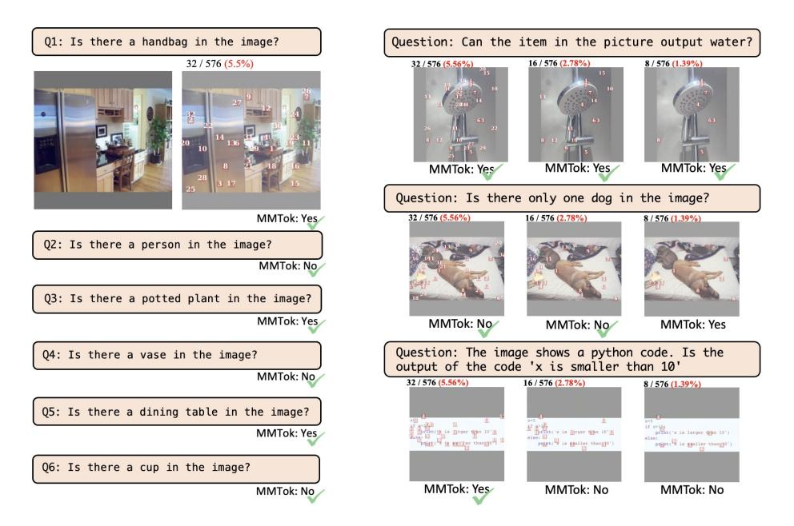

# 3.1.2 MAXIMUM VISION-VISION COVERAGE

Although text-vision coverage can explore vision information according to text, it may be insufficient due to vague text, e.g., "Please describe the image". Therefore, we propose to cover all vision information with a limited number of vision tokens. Concretely, a vision-vision similarity matrix can be generated as

$$M_{i,j}^{vv} = \mathbf{v}_i^{'\top} \mathbf{v}_j^{'}$$

where  $M^{vv} \in \mathbb{R}^{n \times n}$ . Unlike  $M^{tv}$  that adopts vision tokens after the projection layer to align with text tokens, those before projection are more appropriate to capture similarity between vision tokens without mixing text information. We have  $\mathbf{v}'$  to distinguish it from the one after projection (i.e.,  $\mathbf{v}$ ).

Then, we can apply the greedy algorithm to select a subset of vision tokens to cover the main information implied by the whole set of vision tokens. Obviously, vision-vision coverage is complementary to text-vision coverage, which is also confirmed by our ablation study. The remaining challenge is to combine the two maximum coverage problems, which is described in the next subsection.

#### 3.1.3 MAXIMUM MULTIMODAL COVERAGE

The maximum coverage problem can be applied to the original text and vision tokens simultaneously. However,  $M^{tv}$  and  $M^{vv}$  have different shapes and similarity measurements. Therefore, their values must be aligned before fusion. To calibrate the similarity between different modalities, the score for each row, i.e., that for target tokens, is first normalized by a softmax operation as

$$M_{i,j}^{tv'} = \frac{\exp(M_{i,j}^{tv}/\tau_t)}{\sum_{j=1}^n \exp(M_{i,j}^{tv}/\tau_t)}; \quad M_{i,j}^{vv'} = \frac{\exp(M_{i,j}^{vv}/\tau_v)}{\sum_{j=1}^n \exp(M_{i,j}^{vv}/\tau_v)}$$

where the softmax operation normalizes each row to a distribution over all vision tokens.  $\tau_t$  and  $\tau_v$  aim to further normalize the distribution shape for text-vision and vision-vision, respectively.

After calibration, the final objective for multimodal coverage can be written as

$$f(\mathcal{S}; M^{tv'}, M^{vv'}) = f(\mathcal{S}; M^{tv'}) + \alpha f(\mathcal{S}; M^{vv'})$$
(2)

where  $\alpha$  is used to weigh the importance of vision-vision coverage. Incorporating text-vision coverage with vision-vision coverage, the function in Eqn. 2 is still a submodular function as follows.

**Corollary 1.** The sum of two submodular functions is a submodular function.

*Proof.* It comes from the addition property of inequalities directly.

With Corollary 1, we can apply a similar greedy algorithm to obtain the near-optimal solution for the multimodal scenario efficiently. The detailed algorithm is summarized in Alg. 2.

### 4 EXPERIMENTS

To evaluate the performance of the proposed method, MMTok, we conduct experiments on diverse benchmark datasets and VLMs with different architectures. For a fair comparison, we use datasets adopted in VisionZip (Yang et al., 2025a), which contains GQA (Hudson & Manning, 2019), MMBench (Liu et al., 2024c), MME (Fu et al., 2023), POPE (Li et al., 2023b), ScienceQA(IMG) (Lu et al., 2022), VQAv2-Test-Dev (Goyal et al., 2017), TextVQA (Singh et al., 2019), MMMU (Yue et al., 2024), and SeedBench (Li et al., 2023a). Meanwhile, five VLMs are applied for comparison, that is, LLaVA-1.5-7B (Liu et al., 2023), LLaVA-1.5-13B (Liu et al., 2023), LLaVA-NeXT-7B (Liu et al., 2024a), LLaVA-NeXT-13B (Liu et al., 2024a), and a recent model Qwen-2.5-VL-7B (Bai et al., 2025). Finally, we compare our method with state-of-the-art vision token pruning algorithms, including FastV (Chen et al., 2024a) (a vision-based method), SparseVLM (Zhang et al., 2024) (a language-based method), VisionZip (Yang et al., 2025a) (a [CLS]-importance-based method), and DivPrune (Alvar et al., 2025) (a diversity-based method). We also include a fine-tuning-based method, VisionZip in the comparison. We obtain the result of DivPrune through its official code, and that for other baselines is directly from (Yang et al., 2025a). Evaluation is implemented under the Lmms-eval framework (Li et al., 2024a) with the details elaborated as follows.

Implementation Details The proposed method relies on an appropriate similarity for coverage optimization. Since different layers may demonstrate different similarity measurements (Liu et al., 2023), we have vision tokens before the projection layer to compute vision-vision similarity, while those after the projection layer are for text-vision coverage. That is because the latter layer aligns better with the text. We find that our method is not sensitive to hyperparameters, as shown in the ablation study. Therefore, we fix  $\tau_t = 0.02$ ,  $\tau_v = 0.2$ , and  $\alpha = 0.5$  for all experiments if not otherwise specified.

| Method                  | GQA   | MMB   | MME     | POPE       | SQA      | VQA V2 | <b>VQA</b> Text | MMMU  | SEED  | Avg.  |
|-------------------------|-------|-------|---------|------------|----------|-------------------|----------------------------|-------|-------|-------|
|                         |       |       |         | Total      | 576 Toke | ens               |                            |       |       |       |
| LLaVA-1.5-7B            | 61.90 | 64.70 | 1862.00 | 85.90      | 69.50    | 78.50             | 58.20                      | 36.30 | 58.60 | 100%  |
| Retain 192 Tokens ↓ 67% |       |       |         |            |          |                   |                            |       |       |       |
| FastV                   | 52.70 | 61.20 | 1612.00 | 64.80      | 67.30    | 67.10             | 52.50                      | 34.30 | 57.10 | 89.6% |
| SparseVLM               | 57.60 | 62.50 | 1721.00 | 83.60      | 69.10    | 75.60             | 56.10                      | 33.80 | 55.80 | 95.5% |
| VisionZip               | 59.30 | 63.00 | 1782.60 | 85.30      | 68.90    | 76.80             | 57.30                      | 36.60 | 56.40 | 97.9% |
| DivPrune                | 59.97 | 62.54 | 1762.23 | 87.00      | 68.66    | 76.87             | 56.97                      | 35.44 | 58.71 | 98.0% |
| VisionZip 🔞             | 60.10 | 63.40 | 1834.00 | 84.90      | 68.20    | 77.40             | 57.80                      | 36.20 | 57.10 | 98.4% |
| MMTok                   | 60.07 | 63.40 | 1773.86 | 86.42      | 68.76    | 77.11             | 57.68                      | 36.33 | 59.21 | 98.7% |
|                         |       |       | 1       | Retain 128 | 8 Tokens | ↓ 78%             |                            |       |       |       |
| FastV                   | 49.60 | 56.10 | 1490.00 | 59.60      | 60.20    | 61.80             | 50.60                      | 34.90 | 55.90 | 84.4% |
| SparseVLM               | 56.00 | 60.00 | 1696.00 | 80.50      | 67.10    | 73.80             | 54.90                      | 33.80 | 53.40 | 92.9% |
| VisionZip               | 57.60 | 62.00 | 1761.70 | 83.20      | 68.90    | 75.60             | 56.80                      | 37.90 | 54.90 | 96.8% |
| DivPrune                | 59.25 | 62.03 | 1718.22 | 86.72      | 68.66    | 75.96             | 56.06                      | 35.56 | 56.98 | 96.9% |
| VisionZip 🔞             | 58.90 | 62.60 | 1823.00 | 83.70      | 68.30    | 76.60             | 57.00                      | 37.30 | 55.80 | 97.7% |
| MMTok                   | 59.29 | 62.29 | 1779.14 | 86.25      | 68.82    | 76.35             | 57.03                      | 35.67 | 58.59 | 97.8% |
|                         |       |       |         | Retain 64  | Tokens   | ↓ 89%             |                            |       |       |       |
| FastV                   | 46.10 | 48.00 | 1256.00 | 48.00      | 51.10    | 55.00             | 47.80                      | 34.00 | 51.90 | 75.6% |
| SparseVLM               | 52.70 | 56.20 | 1505.00 | 75.10      | 62.20    | 68.20             | 51.80                      | 32.70 | 51.10 | 86.9% |
| VisionZip               | 55.10 | 60.10 | 1690.00 | 77.00      | 69.00    | 72.40             | 55.50                      | 36.20 | 52.20 | 93.2% |
| DivPrune                | 57.78 | 59.28 | 1674.40 | 85.56      | 68.07    | 74.11             | 54.69                      | 35.56 | 55.13 | 94.8% |
| VisionZip 8             | 57.00 | 61.50 | 1756.00 | 80.90      | 68.80    | 74.20             | 56.00                      | 35.60 | 53.40 | 95.0% |
| MMTok                   | 58.29 | 61.17 | 1715.33 | 85.77      | 69.16    | 75.20             | 56.01                      | 36.11 | 57.15 | 96.6% |

Table 1: **Performance Comparison on LLaVA-1.5-7B.** More details in Appendix Table 16.

| Method                               | LLaV                    | aVA-1.5-7B (2023)   LLaVA-1.5 |                         | LLaVA-1.5-13B (2023)   LLaVA-1 |                         |                         | LLaVA-NeXT-7B (2024a)   |                         | LLaVA-                  | LLaVA-NeXT-13B (2024a)  |                         |                         |
|--------------------------------------|-------------------------|-------------------------------|-------------------------|--------------------------------|-------------------------|-------------------------|-------------------------|-------------------------|-------------------------|-------------------------|-------------------------|-------------------------|
|                                      | - :                     | 576 token:                    | s                       |                                | 576 tokens              |                         | Upper(Up.) 2880 tokens  |                         | tokens                  | Upper(Up.) 2880 toker   |                         | tokens                  |
| Compress Ratio                       | ↓ 67%                   | ↓ 78%                         | ↓ 89%                   | ↓ 67%                          | ↓ 78%                   | ↓ 89%                   | ↓ 78%                   | ↓ 89%                   | ↓ 94%                   | ↓ 78%                   | ↓ 89%                   | ↓ 94%                   |
| Remain Token                         | 192                     | 128                           | 64                      | 192                            | 128                     | 64                      | Up. 640                 | Up. 320                 | Up. 160                 | Up. 640                 | Up. 320                 | Up. 160                 |
| VisionZip DivPrune VisionZip 6 | 97.9% 98.0% 98.4% | 96.8% 96.9% 97.7%       | 93.2% 94.8% 95.0% | 97.9% 98.2% 98.7%        | 97.0% 96.9% 97.4% | 93.7% 95.3% 94.8% | 97.5% 97.1% 98.9% | 94.5% 95.1% 97.6% | 90.4% 92.4% 95.0% | 97.7% 97.1% 98.8% | 94.7% 94.5% 97.8% | 91.4% 92.0% 94.6% |
| MMTok                                | 98.7%                   | 97.8%                         | 96.6%                   | 98.7%                          | 97.5%                   | 96.4%                   | 98.7%                   | 97.3%                   | 95.1%                   | 98.2%                   | 96.4%                   | 95.1%                   |

Table 2: Comparison on LLaVA-1.5 and LLaVA-NeXT. Details are in Appendix Tables 16 to 19.

#### 4.1 Performance Comparison on Diverse Tasks

**LLaVA-1.5-7B** First, we compare our method with baselines using LLaVA-1.5-7B, which is a popular benchmark for vision token selection. The model has a fixed number of vision tokens for arbitrary visual inputs. As shown in Table 1, given the original 576 tokens, MMTok achieves the best performance (preserving on average 98.7/97.8/96.6% original performance of LLaVA-1.5-7B), when retaining only 192/128/64 tokens (reducing by 67/78/89% of tokens compared to 576), respectively. Specifically, our method outperforms DivPrune by 1.8% when using a budget of 64 tokens. Although the gap decreases with more tokens as expected, MMTok still surpasses all baselines without finetuning by at least 0.7% with 192 tokens. In addition, compared to the fine-tuning method, the proposed method is 1.6% better than VisionZip with 64 tokens, which shows the potential of the training-free strategy. Since VisionZip and DivPrune show much better performance than FastV and SparseVLM, we will include only them for comparison in the following experiments.

**LLaVA-1.5-13B** The average performance over all benchmark datasets and token budgets is reported in Table 2, while detailed results can be found in Appendix Table 17. Although the model is larger, the observation is similar to the above 7B counterpart, where our method consistently outperforms the baselines with a clear margin.

**LLaVA-NeXT 7B and 13B** In addition to models that have a fixed number of vision tokens, we further evaluate our method on LLaVA-NeXT (Liu et al., 2024a), which dynamically samples up to five images and processes them individually, resulting in up to 2880 vision tokens. To align the comparison with real applications, we keep the dynamic settings as VisionZip (Yang et al., 2025a) and

have token selection performed in a fixed ratio. For example, with a maximum budget of 160 tokens, we retain 32 tokens per image in up to five images  $(32 \times 5 = 160)$ . The retained number of tokens becomes 128 if only four images are sampled by the VLMs according to the ratio of 160/2, 880. The same setting is used for all baselines as a fair comparison. As shown in Table 2, our method retains more than 95% of the original performance using only 5.5% of the tokens with a budget of 160 tokens, indicating substantial redundancy in vision tokens and the effectiveness of the proposed strategy. Detailed results can be found in Appendix Tables 18 and 19.

| Method                      | GQA Acc. ↑ | MMB Acc. ↑ | MME P+C↑ | <b>POPE</b> F1 ↑ | <b>VQA</b> Text Acc. ↑ | SQA Acc. ↑     | OCRBench Acc. ↑ | Avg.†   ↑ |  |
|-----------------------------|---------------|---------------|-------------|---------------------|--------------------------------------|-------------------|--------------------|--------------|--|
| Dynamic Resoluti            | on (MinPi     | ix = 256      | < 28 × 28   | 8, MaxPix           | $= 2048 \times 2$                    | $28 \times 28$ ), | Upper Bound (      | (100%)       |  |
| Avg. Tokens $\bar{T}$       | 358.5         | 276.9         | 867.6       | 359.6               | 976.5                                | 323.0             | 652.8              |              |  |
| Qwen-2.5-VL-7B              | 60.48         | 83.25         | 2327        | 86.16               | 77.72                                | 87.46             | 83.80              | 100%         |  |
| Fixed R                     | esolution (   | MinPix =      | = MaxPix    | = 2048 ×            | $28 \times 28$ ),                    | Upper Bo          | und (100%)         |              |  |
| Qwen-2.5-VL-7B              | 58.59         | 83.59         | 2339        | 86.09               | 76.64                                | 86.91             | 76.60              | 99.3%        |  |
| Retain 20% $\bar{T}$        | 71.7          | 55.4          | 173.5       | 71.9                | 195.3                                | 64.6              | 130.6              | ↓ 80%        |  |
| VisionZip                   | 56.80         | 80.33         | 2174        | 83.38               | 70.43                                | 84.23             | 59.50              | 94.2%        |  |
| DivPrune                    | 56.70         | 76.98         | 2163        | 80.59               | 65.86                                | 80.91             | 48.10              | 91.5%        |  |
| MMTok                       | 58.09         | 79.30         | 2217        | 82.38               | 70.49                                | 81.61             | 59.60              | 94.6%        |  |
| Retain 10% $\bar{T}$        | 35.9          | 27.7          | 86.8        | 36.0                | 97.7                                 | 32.3              | 65.3               | ↓ 90%        |  |
| VisionZip                   | 52.47         | 75.60         | 2003        | 78.90               | 63.78                                | 82.30             | 36.90              | 87.5%        |  |
| DivPrune                    | 53.43         | 72.85         | 1957        | 74.99               | 59.59                                | 79.57             | 37.30              | 84.7%        |  |
| MMTok                       | 55.09         | 74.74         | 2051        | 78.75               | 63.90                                | 80.47             | 43.60              | 88.5%        |  |
| Retain 5% $\bar{T}$         | 17.9          | 13.8          | 43.4        | 18.0                | 48.8                                 | 16.2              | 32.6               | ↓95%         |  |
| VisionZip                   | 46.28         | 67.53         | 1677        | 66.38               | 54.49                                | 79.57             | 19.70              | 75.4%        |  |
| DivPrune                    | 49.01         | 65.89         | 1739        | 68.45               | 52.02                                | 77.05             | 24.90              | 76.3%        |  |
| MMTok                       | 50.66         | 65.89         | 1796        | 71.35               | 55.95                                | 77.19             | 30.70              | 79.0%        |  |
| 0 Token ↓ <mark>100%</mark> |               |               |             |                     |                                      |                   |                    |              |  |
| Qwen-2.5-VL-7B              | 31.84         | 20.10         | 935         | $0.00^{*}$          | 38.93                                | 71.10             | 1.80               | 33.8%        |  |

Table 3: **Comparison on Qwen-2.5-VL-7B.** Avg.† are computed over 5 datasets. \*When no visual tokens are provided, Qwen-2.5-VL outputs "No" for all questions, leading to 0% F1. More detailed results are in Appendix Table 20.

Qwen-2.5-VL-7B Finally, we compare different algorithms on a more advanced VLM, that is, Qwen-2.5-VL-7B. Unlike previous work, it adopts dynamic resolution and a token-merging layer. Those strategies help reduce the total number of vision tokens while demonstrating better performance. For example, the average number of input tokens is only 359.6 in Qwen on POPE, significantly less than 2880 tokens in LLaVA-NeXT. Therefore, it is more challenging to apply the token selection algorithm in this strong model. Following experiments for LLaVA-NeXT, we conduct the evaluation under dynamic resolution for all methods. Due to distinct image pre-processing strategies in Qwen, we include 7 image datasets in this comparison. Since ScienceQA (SQA) is a low-IC dataset that will be discussed in Section 4.2 and all baselines perform poorly on OCRBench, the average performance is computed across the remaining 5 datasets. For MMTok, we reduce  $\tau_t$  to 0.01 for all datasets while other parameters remained.

First, we compare the dynamic resolution to the fixed number of tokens in Qwen as shown in the first two rows of Table 3. Although the model can use a fixed number of about 2,048 vision tokens for different tasks, the performance is worse than that of the dynamic strategy, which has much fewer tokens. It shows that vision tokens are quite redundant for VLM tasks, and the sophisticated strategies in Qwen already compress the number to hundreds, providing even better performance. Based on the challenging dynamic setting, we further investigate whether token selection is still valuable. From Table 3, we can find that our MMTok can preserve nearly 95% of the original performance while further reducing the number of vision tokens to 20%. This observation demonstrates that even for models with token compression, the remaining tokens can still be redundant. The proposed method MMTok can effectively explore the most informative tokens and further reduce the number of vision tokens from hundreds to tens. Furthermore, our method is better than VisionZip with different budgets, which confirms the efficacy of our proposed multimodal coverage strategy. Finally, we can observe that even without any vision tokens, Qwen's performance on SQA is still close to its version with all tokens. This reminds us to investigate the contribution of vision to vision-language tasks in the next subsection, which can help to better evaluate the performance of token selection methods.

#### 4.2 COMPARISON ON HIGH IC TASKS WITH LIMITED VISION TOKENS

Although multimodal tasks rely on images for answers, the contribution of vision varies. Table 4 summarizes the performance with/without vision tokens on different datasets. It is interesting to observe that even without any vision tokens, LLaVA-1.5 still preserves 92% of the original performance on MMMU and 91% on ScienceQA. Those tasks may fail to help adequately assess the efficacy of vision token selection. To mitigate the issue, we introduce Image Contribution (IC) to quantify the relative performance gain from all vision tokens,  $IC = (Perf_{All} - Perf_0)/Perf_0$  and summarize IC values in Table 4. According to the table, we can identify 5 and 6 high-IC datasets for LLaVA and LLaVA-NeXT, respectively. Then, we compare different algorithms on those datasets in Table 5. To evaluate the performance with an extremely aggressive compression ratio, we extend the experiments from 64 tokens to 2 tokens. The comparison shows that our method can substantially preserve the informative vision tokens for VL tasks. Moreover, we illustrate the performance ratio compared to the original result in Figure 1. On POPE, our method maintains about 80% original performance with only 2 vision tokens, showing the importance of appropriate vision tokens. More results can be found in Appendix Tables 21 and 22.

| Dataset | LLaVA-1.5   | 5-7B  | LLaVA-NeXT-7B |       |  |  |
|---------|-------------|-------|---------------|-------|--|--|
| Dutaset | All / Zero  | IC    | All / Zero    | IC    |  |  |
| MMB     | 64.7/19.33  | 2.347 | 67.9/17.87    | 2.801 |  |  |
| POPE    | 85.9/44.64  | 0.924 | 86.4/25.84    | 2.344 |  |  |
| MME     | 1862/970.89 | 0.918 | 1842/867      | 1.125 |  |  |
| SEED-I  | 66.14/37.03 | 0.786 | 70.2/37.43    | 0.875 |  |  |
| GQA     | 61.9/37.65  | 0.644 | 64.2/38.23    | 0.679 |  |  |
| TextVQA | 58.2/41.66  | 0.397 | 61.3/37.77    | 0.623 |  |  |
| SQA     | 69.5/63.51  | 0.094 | 70.2/64.60    | 0.087 |  |  |
| MMMU    | 36.3/33.33  | 0.089 | 35.1/31.56    | 0.112 |  |  |

| Model/Method |           | Di       | fferent To | ken Budg | ets       |       |
|--------------|-----------|----------|------------|----------|-----------|-------|
| modely memod | 64        | 32       | 16         | 8        | 4         | 2     |
| LLaV         | /A-1.5-7B | (MMB, P  | ОРЕ, ММ    | E, SEED, | GQA)      |       |
| VisionZip    | 90.0%     | 83.5%    | 69.7%      | 48.9%    | 43.8%     | 43.0% |
| DivPrune     | 93.1%     | 89.6%    | 81.4%      | 68.4%    | 54.3%     | 50.1% |
| MMTok (Ours) | 94.7%     | 91.0%    | 86.4%      | 79.8%    | 71.4%     | 62.1% |
| LLaVA-Ne     | XT-7B (M) | MB, POPI | E, MME, S  | SEED, GQ | A, TextVQ | QA)   |
| VisionZip    | 93.2%     | 87.5%    | 76.8%      | 52.6%    | 39.4%     | 38.5% |
| DivPrune     | 94.2%     | 89.7%    | 85.7%      | 79.9%    | 71.0%     | 57.8% |
| MMTok (Ours) | 95.7%     | 92.8%    | 89.6%      | 85.2%    | 79.2%     | 71.0% |

bution (IC).

Table 4: Demonstration of Image Contri- Table 5: Comparison on high-IC tasks with different token budgets.

#### 4.3 ABLATION STUDY

We conduct comprehensive ablation studies to demonstrate each component in MMTok. All experiments are performed on LLaVA-1.5-7B with 64 tokens unless otherwise specified.

| Multimodal Coverage           | GQA Acc. ↑ | MMB Acc. ↑ | MME P+C↑    | POPE F1↑  | SQA Acc. ↑ | VQA Text Acc. ↑ | MMMU Acc. ↑ | SEED Acc. ↑ | Avg.   |
|----------------------------------|---------------|---------------|----------------|--------------|---------------|-------------------------------|----------------|----------------|--------|
| Total 576 Tokens ( <b>100</b> %) |               |               |                |              |               |                               |                |                |        |
| LLaVA-1.5-7B                     | 61.9          | 64.7          | 1862           | 85.9         | 69.5          | 58.2                          | 36.3           | 58.6           | 100.0% |
| Retain 64 Tokens ↓ 88.9%         |               |               |                |              |               |                               |                |                |        |
| $\text{T-V}\left(M^{tv}\right)$  | 56.82         | 59.62         | 1632.47        | 83.56        | 68.72         | 51.97                         | 35.33          | 56.36          | 93.8%  |
| $\text{V-V}\left(M^{vv}\right)$  | <u>58.14</u>  | 59.88         | 1662.34        | 83.43        | 67.67         | 53.93                         | 35.33          | 56.90          | 94.7%  |
| Softmax T-V $(M^{tv'})$          | 56.66         | 58.85         | 1674.11        | 83.69        | 68.57         | 52.01                         | 35.33          | 56.37          | 93.9%  |
| Softmax V-V $(M^{vv'})$          | 57.97         | 60.31         | <u>1684.33</u> | <u>84.31</u> | 68.07         | <u>55.90</u>                  | <u>35.89</u>   | 56.88          | 95.7%  |
| MMTok $(M^{tv'} + M^{vv'})$      | 58.29         | 61.17         | 1715.33        | 85.77        | 69.16         | 56.01                         | 36.11          | 57.15          | 96.7%  |

Table 6: **Ablation on multimodal coverage in MMTok**. The best performance with token selection is highlighted in bold and the second-best is underlined.

Unimodal Coverage vs. Multimodal Coverage The proposed method contains both text-vision coverage (T-V) and vision-vision coverage (V-V). We evaluate each component separately in Table 6. Compared with the original similarity matrix, the softmax variant can obtain a similar or even better performance, which shows that calibration on similarity matrices will not hurt the performance. Then, combining coverage optimization on different modalities shows an improvement of about 1% over unimodal coverage, which demonstrates the complementarity between T-V and V-V coverages for various tasks. More ablation experiments can be found in the Appendix.

**Token Selection vs. Resizing** Resizing the image resolution is an effective way to reduce the total number of tokens as shown in (Yang et al., 2025b). We compare the resize strategy with token budgets in Table 7. First, we can find that selecting vision tokens from the original large image can be more effective than resizing under the same token budget. This is because resizing would ignore the redundancy between vision tokens. More importantly, we observe that incorporating with resizing, MMTok can work better than the counterpart with the same token budget on full images. For example, with about 10% original tokens, MMTok with resizing can achieve 2170 on MME while that on original image is only 2051. Exploring resizing with token selection sufficiently can be our future work.

| Model                                  | Image Resize Ratio        | Token Avg.      | MME P+C↑       |  |  |  |  |  |  |
|----------------------------------------|---------------------------|-----------------|----------------|--|--|--|--|--|--|
| Qwen2.5-VL-7B                          | 1                         | 867.6           | 2327           |  |  |  |  |  |  |
| MMTok                                  | 1                         | 173.5           | 2217           |  |  |  |  |  |  |
| MMTok                                  | 1                         | 86.8            | 2051           |  |  |  |  |  |  |
| Resize image to fi                     | ixed ratio of original he | eight and width | , respectively |  |  |  |  |  |  |
| Qwen2.5-VL-7B                          | 1/2                       | 459.1           | 2274           |  |  |  |  |  |  |
| Qwen2.5-VL-7B                          | 1/4                       | 349.6           | 2238           |  |  |  |  |  |  |
| Qwen2.5-VL-7B                          | 1/8                       | 276.0           | 1793           |  |  |  |  |  |  |
| Reta                                   | in $55\%$ Tokens on $1/4$ | Resized Image   | e              |  |  |  |  |  |  |
| MMTok                                  | 1/4                       | 192.3           | 2254           |  |  |  |  |  |  |
| Reta                                   | in $40\%$ Tokens on $1/4$ | Resized Image   | e              |  |  |  |  |  |  |
| MMTok                                  | 1/4                       | 139.8           | 2215           |  |  |  |  |  |  |
| Retain 25% Tokens on 1/4 Resized Image |                           |                 |                |  |  |  |  |  |  |
| MMTok                                  | 1/4                       | 87.4            | 2170           |  |  |  |  |  |  |

Table 7: Comparison with resize strategy on MME with Qwen2.5-VL-7B. The original image is denoted as resize ratio of 1. Qwen has a default minimal number of vision tokens as 256 to obtain meaningful results.

| Model          | Upper     | Total      | POPE       | GPU       | Memory                      | POPE     | SEED     | TextVQA | MME     | MMB   | GQA   | Avg.  |
|----------------|-----------|------------|------------|-----------|-----------------------------|----------|----------|---------|---------|-------|-------|-------|
|                | Token     | Infer T(s) | Infer T(s) | Util.     | (+25.42 GB)                 | F1       | Acc.     | Acc.    | P+C     | Acc.  | Acc.  | (%)   |
|                |           |            | H100 Sing  | gle GPU . | Performance, U l | per 2880 | ) Tokens |         |         |       |       |       |
| LLaVA-NeXT-13B | 2880      | 15204      | 1705       | 86.7%     | 4.59                        | 86.22    | 71.89    | 64.33   | 1900.86 | 69.16 | 65.38 | 100.0 |
| VisionZip      | Upper 160 | 7551       | 866        | 52.4%     | 1.92                        | 76.32    | 61.18    | 58.33   | 1738.24 | 64.78 | 57.77 | 89.6  |
| DivPrune       | Upper 160 | 8186       | 1060       | 50.9%     | 1.23                        | 82.16    | 63.80    | 54.65   | 1699.83 | 64.78 | 59.34 | 90.5  |
| MMTok          | Upper 160 | 7768       | 913        | 58.0%     | 1.78                        | 85.11    | 65.45    | 55.91   | 1811.35 | 65.89 | 61.94 | 93.7  |

Table 8: **Comparison of Inference Efficiency.** All results are reproduced under the same hardware and evaluation settings. The initial memory usage for loading the model is 25.42GB.

**Inference Efficiency** Besides effectiveness, we examine efficiency in real scenarios. To mimic real applications, we report the total running time on different datasets in Table 8. First, we profile the computational cost on POPE. Obviously, all token selection methods help reduce the utility percentage of the GPU by about 30%, which shows that pruning is helpful for inference. Then, with a fixed memory cost of 25.42GB for model loading, these methods can also help reduce the usage of running-time memory by more than 58.2% compared to the baseline. This reduction in computation and memory helps significantly improve the inference time on POPE, where both VisionZip and our method can reduce the running time by about 50%. DivPrune runs a little bit slower due to a different strategy for handling multiple crops in its official code. Although our method introduces two subproblems, that is, T-V and V-V to optimize, the running time is almost the same as the fast unimodal method, i.e., VisionZip, which confirms the efficiency of MMTok. The running time accumulated over 6 tasks demonstrates a similar observation, where the performance of MMTok is better than VisionZip by 4.1%. This further demonstrates the efficiency and efficiency of our proposal.

**Visualization** While MMTok will leverage text information for vision token selection, the vision-vision coverage in our framework can help preserve the vision information and reuse the selected vision tokens for multi-turn conversation as shown in Figure 3. We can observe that MMTok selects tokens with text from Q1 but vision-vision coverage enables the following questions to be answered correctly with the selected vision tokens.

In addition, we also demonstrate how the answer changes with the number of selected tokens in Figure [4.](#page-9-0) Given a simple question as in the first example, only 8 vision tokens can obtain the right answer. However, for the challenging question as in the last example, the answer changes even with 16 tokens. The phenomenon implies that the appropriate number of vision tokens also depends on the hardness of the questions. Hardness-aware vision token selection is an interesting future direction.

Figure 3: Multi-turn conversation by applying MMTok only with text from Q1. Figure 4: Answer changes with different number of tokens. Hard questions need more vision tokens.

