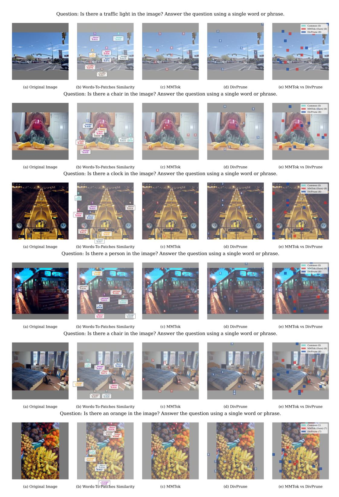

# E COMPLETE EMPIRICAL RESULTS

This section shows per-dataset results for all models and token budgets, including LLaVA-1.5 (7B/13B) (Tables [16](#page-17-0) and [17\)](#page-18-0), LLaVA-NeXT (7B/13B) (Tables [18](#page-19-0) and [19\)](#page-20-0), and Qwen-2.5-VL (7B Table [20\)](#page-21-0). We report both raw scores and percentage retention relative to the full-token setting. We also report results with an extremely low number of tokens on LLaVA-1.5-7B and LLaVA-NeXT-7B (Tables [21](#page-22-0) and [22\)](#page-23-0).

| Method     | GQA    | MMB    | MME     | POPE                      | SQA                      | VQAV2                          | VQAText | MMMU   | SEED   | Avg.  |
|------------|--------|--------|---------|---------------------------|--------------------------|--------------------------------|---------|--------|--------|-------|
|            | Acc. ↑ | Acc. ↑ | P+C ↑   | F1 ↑                      | Acc. ↑                   | Acc. ↑                         | Acc. ↑  | Acc. ↑ | Acc. ↑ | ↑     |
|            |        |        |         |                           |                          | Upper Bound, 576 Tokens (100%) |         |        |        |       |
| LLaVA-1.5  | 61.9   | 64.7   | 1862    | 85.9                      | 69.5                     | 78.5                           | 58.2    | 36.3   | 58.6   | 100%  |
| Vanilla 7B | 100%   | 100%   | 100%    | 100%                      | 100%                     | 100%                           | 100%    | 100%   | 100%   |       |
|            |        |        |         | Retain 192 Tokens ↓ 66.7% |                          |                                |         |        |        |       |
| FastV      | 52.7   | 61.2   | 1612    | 64.8                      | 67.3                     | 67.1                           | 52.5    | 34.3   | 57.1   | 89.6% |
| (2024a)    | 85.1%  | 94.6%  | 86.6%   | 75.4%                     | 96.8%                    | 85.5%                          | 90.2%   | 94.5%  | 97.4%  |       |
| SparseVLM  | 57.6   | 62.5   | 1721    | 83.6                      | 69.1                     | 75.6                           | 56.1    | 33.8   | 55.8   | 95.5% |
| (2024)     | 93.1%  | 96.6%  | 92.4%   | 97.3%                     | 99.4%                    | 96.3%                          | 96.4%   | 93.1%  | 95.2%  |       |
| VisionZip  | 59.3   | 63.0   | 1782.6  | 85.3                      | 68.9                     | 76.8                           | 57.3    | 36.6   | 56.4   | 97.9% |
| (2025a)    | 95.8%  | 97.4%  | 95.7%   | 99.3%                     | 99.1%                    | 97.8%                          | 98.5%   | 100.8% | 96.2%  |       |
| DivPrune   | 59.97  | 62.54  | 1762.23 | 87.00                     | 68.66                    | 76.87                          | 56.97   | 35.44  | 58.71  | 98.0% |
| (2025)     | 96.9%  | 96.7%  | 94.6%   | 101.3%                    | 98.8%                    | 97.9%                          | 97.9%   | 97.6%  | 100.2% |       |
| VisionZip  | 60.1   | 63.4   | 1834    | 84.9                      | 68.2                     | 77.4                           | 57.8    | 36.2   | 57.1   | 98.4% |
| (2025a)    | 97.1%  | 98.0%  | 98.5%   | 98.8%                     | 98.1%                    | 98.6%                          | 99.3%   | 99.7%  | 97.4%  |       |
| MMTok      | 60.07  | 63.40  | 1773.86 | 86.42                     | 68.76                    | 77.11                          | 57.68   | 36.33  | 59.21  | 98.7% |
| (Ours)     | 97.0%  | 98.0%  | 95.3%   | 100.6%                    | 98.9%                    | 98.2%                          | 99.1%   | 100.1% | 101.0% |       |
|            |        |        |         | Retain 128 Tokens ↓ 77.8% |                          |                                |         |        |        |       |
| FastV      | 49.6   | 56.1   | 1490    | 59.6                      | 60.2                     | 61.8                           | 50.6    | 34.9   | 55.9   | 84.4% |
| (2024a)    | 80.1%  | 86.7%  | 80.0%   | 69.4%                     | 86.6%                    | 78.7%                          | 86.9%   | 96.1%  | 95.4%  |       |
| SparseVLM  | 56.0   | 60.0   | 1696    | 80.5                      | 67.1                     | 73.8                           | 54.9    | 33.8   | 53.4   | 92.9% |
| (2024)     | 90.5%  | 92.7%  | 91.1%   | 93.7%                     | 96.5%                    | 94.0%                          | 94.3%   | 93.1%  | 91.1%  |       |
| VisionZip  | 57.6   | 62.0   | 1761.7  | 83.2                      | 68.9                     | 75.6                           | 56.8    | 37.9   | 54.9   | 96.8% |
| (2025a)    | 93.1%  | 95.8%  | 94.6%   | 96.9%                     | 99.1%                    | 96.3%                          | 97.6%   | 104.4% | 93.7%  |       |
| DivPrune   | 59.25  | 62.03  | 1718.22 | 86.72                     | 68.66                    | 75.96                          | 56.06   | 35.56  | 56.98  | 96.9% |
| (2025)     | 95.7%  | 95.9%  | 92.3%   | 101.0%                    | 98.8%                    | 96.8%                          | 96.3%   | 98.0%  | 97.3%  |       |
| VisionZip  | 58.9   | 62.6   | 1823    | 83.7                      | 68.3                     | 76.6                           | 57.0    | 37.3   | 55.8   | 97.7% |
| (2025a)    | 95.2%  | 96.8%  | 97.9%   | 97.4%                     | 98.3%                    | 97.6%                          | 97.9%   | 102.8% | 95.2%  |       |
| MMTok      | 59.29  | 62.29  | 1779.14 | 86.25                     | 68.82                    | 76.35                          | 57.03   | 35.67  | 58.59  | 97.8% |
| (Ours)     | 95.8%  | 96.3%  | 95.5%   | 100.4%                    | 99.0%                    | 97.3%                          | 98.0%   | 98.3%  | 100.0% |       |
|            |        |        |         |                           | Retain 64 Tokens ↓ 88.9% |                                |         |        |        |       |
| FastV      | 46.1   | 48.0   | 1256    | 48.0                      | 51.1                     | 55.0                           | 47.8    | 34.0   | 51.9   | 75.6% |
| (2024a)    | 74.5%  | 74.2%  | 67.5%   | 55.9%                     | 73.5%                    | 70.1%                          | 82.1%   | 93.7%  | 88.6%  |       |
| SparseVLM  | 52.7   | 56.2   | 1505    | 75.1                      | 62.2                     | 68.2                           | 51.8    | 32.7   | 51.1   | 86.9% |
| (2024)     | 85.1%  | 86.9%  | 80.8%   | 87.4%                     | 89.4%                    | 86.9%                          | 89.0%   | 90.1%  | 87.2%  |       |
| VisionZip  | 55.1   | 60.1   | 1690    | 77.0                      | 69.0                     | 72.4                           | 55.5    | 36.2   | 52.2   | 93.2% |
| (2025a)    | 89.0%  | 92.9%  | 90.8%   | 89.6%                     | 99.3%                    | 92.2%                          | 95.4%   | 99.7%  | 89.1%  |       |
| DivPrune   | 57.78  | 59.28  | 1674.4  | 85.56                     | 68.07                    | 74.11                          | 54.69   | 35.56  | 55.13  | 94.8% |
| (2025)     | 93.3%  | 91.6%  | 89.9%   | 99.6%                     | 97.9%                    | 94.4%                          | 94.0%   | 98.0%  | 94.1%  |       |
| VisionZip  | 57.0   | 61.5   | 1756    | 80.9                      | 68.8                     | 74.2                           | 56.0    | 35.6   | 53.4   | 95.0% |
| (2025a)    | 92.1%  | 95.1%  | 94.3%   | 94.2%                     | 99.0%                    | 94.5%                          | 96.2%   | 98.1%  | 91.1%  |       |
| MMTok      | 58.29  | 61.17  | 1715.33 | 85.77                     | 69.16                    | 75.20                          | 56.01   | 36.11  | 57.15  | 96.6% |
| (Ours)     | 94.2%  | 94.5%  | 92.1%   | 99.9%                     | 99.5%                    | 95.8%                          | 96.3%   | 99.5%  | 97.5%  |       |

Table 16: Performance Comparison on LLaVA-1.5-7B. The vanilla number of visual tokens is 576. The first line of each method shows the raw benchmark accuracy, and the second line is the proportion relative to the upper limit. The last column is the average value.

| Method                   | GQA                                                                 | MMB Acc. ↑   | MME P+C↑      | <b>POPE</b> F1 ↑ | SQA Acc. ↑   | VQA V2 Acc. ↑ | VQA Text Acc. ↑ | MMMU Acc. ↑  | SEED-I Acc. ↑ | SEED* Acc. ↑ | Avg.    |  |  |  |
|--------------------------|---------------------------------------------------------------------|-----------------|------------------|---------------------|-----------------|-----------------------------|-------------------------------|-----------------|------------------|-----------------|---------|--|--|--|
|                          | Acc. ↑                                                              | Acc.            | P+C              | <u>'</u>            | <u>'</u>        | <u>'</u>                    | <u>'</u>                      | Acc.            | Acc.             | Acc.            | <u></u> |  |  |  |
| 11 374 15                | 62.2                                                                | 67.7            | 1010             | • •                 |                 | Tokens (1                   |                               | 36.4            | 66.0             | 61.6            |         |  |  |  |
| LLaVA-1.5 Vanilla 13B | 63.2 100%                                                        | 67.7 100%    | 1818 100%     | 85.9 100%        | 72.8 100%    | 80.0 100%                | 61.3 100%                  | 100%            | 66.9 100%     | 61.6 100%    | 100%    |  |  |  |
|                          |                                                                     |                 |                  | Reto                | ain 192 Tok     | kens ↓ 66.7                 | 7%                            |                 |                  |                 |         |  |  |  |
| VisionZip (2025a)     | (2025a) 93.5% 98.8% 96.5% 99.1% 101.0% 97.6% 97.1% 100% 97.5% 99.4% |                 |                  |                     |                 |                             |                               |                 |                  |                 |         |  |  |  |
| DivPrune (2025)       | 59.42 94.0%                                                      | 66.58 98.3%  | 1781.50 98.0% | 86.76 101.0%     | 73.03 100.3% | 77.98 97.5%              | 58.46 95.4%                | 36.56 100.4% | 65.72 98.2%   | 60.83 98.8%  | 98.2%   |  |  |  |
| VisionZip   (2025a)      | 61.6 97.5%                                                       | 67.1 99.1%   | 1790 98.5%    | 84.5 98.4%       | 72.7 99.9%   | 78.6 98.3%               | 59.9 97.7%                 | 36.4 100%    | 66.1 98.8%    | _ _          | 98.7%   |  |  |  |
| MMTok (Ours)          | 59.67 94.4%                                                      | 67.70 100.0% | 1784.16 98.1% | 86.15 100.3%     | 73.62 101.1% | 78.30 97.9%              | 59.64 97.3%                | 36.78 101.0% | 65.49 97.9%   | 61.17 99.3%  | 98.7%   |  |  |  |
|                          | Retain 128 Tokens ↓ 77.8%                                           |                 |                  |                     |                 |                             |                               |                 |                  |                 |         |  |  |  |
| VisionZip (2025a)     | 57.9 91.6%                                                       | 66.7 98.5%   | 1743 95.9%    | 85.2↓ 99.2%      | 74.0 101.6%  | 76.8 96.0%               | 58.7 95.8%                 | 36.1 99.2%   | 63.8 95.4%    | 59.74† 97.0% | 97.0%   |  |  |  |
| DivPrune (2025)          | 58.89 93.2%                                                      | 66.07 97.6%  | 1748.56 96.2% | 86.53 100.7%     | 72.48 99.6%  | 77.10 96.4%              | 58.17 94.9%                | 35.56 97.7%  | 64.22 96.0%   | 59.49 96.6%  | 96.9%   |  |  |  |
| VisionZip • (2025a)      | 60.1 95.1%                                                       | 67.6 99.9%   | 1736 95.5%    | 83.8 97.6%       | 73.0 100.3%  | 77.6 97.0%               | 59.2 96.6%                 | 35.4 97.3%   | 64.9 97.0%    | - -          | 97.4%   |  |  |  |
| MMTok (Ours)          | 58.98 93.3%                                                      | 67.18 99.2%  | 1756.20 96.6% | 86.22 100.4%     | 73.38 100.8% | 77.57 97.0%              | 59.22 96.6%                | 35.44 97.4%  | 64.26 96.1%   | 60.11 97.6%  | 97.5%   |  |  |  |
|                          |                                                                     |                 |                  | Ret                 | ain 64 Tok      | ens ↓88.9                   | %                             |                 |                  |                 |         |  |  |  |
| VisionZip (2025a)     | 56.2 88.9%                                                       | 64.9 95.9%   | 1676 92.2%    | 76.0 88.5%       | 74.4 102.2%  | 73.7 92.1%               | 57.4 93.6%                 | 36.4 100%    | 60.4 90.3%    | 57.13† 92.7% | 93.7%   |  |  |  |
| DivPrune (2025)       | 57.66 91.2%                                                      | 64.60 95.4%  | 1777.93 97.8% | 84.80 98.7%      | 72.09 99.0%  | 75.20 94.0%              | 57.11 93.2%                | 35.22 96.8%  | 62.44 93.3%   | 57.70 93.7%  | 95.3%   |  |  |  |
| VisionZip   (2025a)      | 58.1 91.9%                                                       | 65.6 96.9%   | 1671 91.9%    | 81.6 95.0%       | 72.3 99.3%   | 75.2 94.0%               | 58.5 95.4%                 | 35.3 97.0%   | 61.4 91.8%    | _            | 94.8%   |  |  |  |
| MMTok (Ours)          | 58.42 92.4%                                                      | 65.72 97.1%  | 1763.39 97.0% | 84.39 98.2%      | 72.98 100.2% | 76.55 95.7%              | 58.40 95.3%                | 35.22 96.8%  | 63.39 94.8%   | 59.51 96.6%  | 96.4%   |  |  |  |

Table 17: **Performance Comparison on LLaVA-1.5-13B.** The vanilla number of visual tokens is 576. The first line of each method shows the raw benchmark accuracy, and the second line is the proportion relative to the upper limit. SEED-I represents SEED-IMG, SEED represents SEED-ALL. Following (Yang et al., 2025a), Avg. is based on SEED-I instead of SEED.

| Method                                                 | GQA Acc. ↑        | MMB Acc. ↑        | MME P+C↑          | <b>POPE</b> F1 ↑        | <b>SQA</b> Acc. ↑       | VQA V2 Acc. ↑        | <b>VQA</b> Text Acc. ↑ | MMMU Acc. ↑       | SEED-I Acc. ↑ | Avg. ↑          |
|--------------------------------------------------------|----------------------|----------------------|----------------------|----------------------------|----------------------------|------------------------------------|--------------------------------------|----------------------|------------------|-----------------|
| Avg. Images $\bar{n}$ Avg. Tokens ( $\bar{n}*576$ ) | 4.90 2822.4       | 4.12 2373.12      | 4.53 2609.28      | 4.90 2822.40            | 3.85 2217.60            | 4.98 2868.48                    | 4.98 2868.48                      | 4.07 2344.32      | 4.72 2718.72  |                 |
| LLaVA-NeXT Vanilla 7B                               | 64.2 100%         | 67.9 100%         | 1842 100%         | d: 2880 (5 86.4 100% | × 576) Tol 70.2 100% | kens ( <b>100%</b> 80.1 100% | 61.3 100%                         | 35.1 100%         | 70.2 100%     | 100%            |
| Upper: 5 × 128 = 640 SparseVLM (2024)            | 627 60.3 93.9% | 527 65.7 96.8% | 580 1772 96.2% | 627                        | 493 67.7 96.4%       | 638 77.1 96.3%               | 638 57.8 94.3%                 | 521 34.6 98.6% | 604              | ↓ <b>77.8</b> % |
| VisionZip (2025a)                                   | 61.3 95.5%        | 66.3 97.6%        | 1787 97.0%        | 86.3 99.9%              | 68.1 97.0%              | 79.1 98.8%                      | 60.2 98.2%                        | 34.7 98.9%        | 66.7 95.0%    | 97.5%           |
| DivPrune (2025)                                        | 61.58 95.9%       | 65.38 96.3%       | 1773.04 96.3%     | 85.51 99.0%             | 67.82 96.6%             | 78.94 98.6%                     | 55.41 90.4%                       | 36.89 105.1%      | 67.56 96.2%   | 97.1%           |
| VisionZip 8 (2025a)                                    | 62.4 97.2%        | 65.9 97.1%        | 1778 96.5%        | 87.6 101.4%             | 67.9 96.7%              | 79.9 99.8%                      | 60.8 99.2%                        | 37.2 106.0%       | 67.8 96.6%    | 98.9%           |
| MMTok (Ours)                                        | 62.27 97.0%       | 65.29 96.2%       | 1829.28 99.3%     | 86.74 100.4%            | 68.47 97.5%             | 79.31 99.0%                     | 58.97 96.2%                       | 37.22 106.0%      | 67.74 96.5%   | 98.7%           |
| Upper: $5 \times 64 = 320$ SparseVLM (2024)         | 314 57.7 89.9% | 264 64.3 94.7% | 290 1694 92.0% | 314                        | 246 67.3 95.9%       | 319 73.4 91.6%               | 319 55.9 91.2%                 | 261 34.4 98.0% | 302              | ↓ <b>88.9</b> % |
| VisionZip (2025a)                                   | 59.3 92.4%        | 63.1 92.9%        | 1702 92.4%        | 82.1 95.0%              | 67.3 95.9%              | 76.2 95.1%                      | 58.9 96.1%                        | 35.3 100.6%       | 63.4 90.3%    | 94.5%           |
| DivPrune (2025)                                        | 59.63 92.9%       | 63.66 93.7%       | 1731.04 94.0%     | 83.47 96.6%             | 67.82 96.6%             | 76.64 95.7%                     | 53.84 87.8%                       | 37.11 105.7%      | 65.35 93.1%   | 95.1%           |
| VisionZip 6 (2025a)                                    | 61.0 95.0%        | 64.4 94.8%        | 1770 96.1%        | 86.2 99.8%              | 67.5 96.2%              | 78.4 97.9%                      | 59.3 96.7%                        | 38.0 108.3%       | 65.9 93.9%    | 97.6%           |
| MMTok (Ours)                                        | 60.96 95.0%       | 64.35 94.8%       | 1799.33 97.7%     | 85.76 99.3%             | 67.33 95.9%             | 77.68 97.0%                     | 56.93 92.9%                       | 38.00 108.3%      | 66.29 94.4%   | 97.3%           |
| Upper: $5 \times 32 = 160$ SparseVLM (2024)         | 157 51.2 79.8% | 132 63.1 92.9% | 145 1542 83.7% | 157 - -              | 123 67.5 96.2%       | 159 66.3 82.8%               | 159 46.4 75.7%                 | 130 32.8 93.4% | 151 - -    | ↓ <b>94.4</b> % |
| VisionZip (2025a)                                   | 55.5 86.4%        | 60.1 88.5%        | 1630 88.5%        | 74.8 86.6%              | 68.3 97.3%              | 71.4 89.1%                      | 56.2 91.7%                        | 36.1 102.8%       | 58.3 83.0%    | 90.4%           |
| DivPrune (2025)                                        | 57.79 90.0%       | 62.29 91.7%       | 1658.25 90.0%     | 79.36 91.9%             | 68.02 96.9%             | 73.92 92.3%                     | 52.42 85.5%                       | 36.44 103.8%      | 62.54 89.1%   | 92.4%           |
| VisionZip 6 (2025a)                                    | 58.2 90.7%        | 63.9 94.1%        | 1699 92.2%        | 83.4 96.5%              | 67.5 96.2%              | 75.6 94.4%                      | 57.3 93.5%                        | 37.7 107.4%       | 62.9 89.6%    | 95.0%           |
| MMTok (Ours)                                        | 60.05 93.5%       | 62.97 92.7%       | 1715.54 93.1%     | 83.87 97.1%             | 67.97 96.8%             | 75.62 94.4%                     | 54.17 88.4%                       | 37.89 107.9%      | 64.54 91.9%   | 95.1%           |

Table 18: **Performance Comparison on LLaVA-NeXT-7B.** The vanilla number of visual tokens varies by dataset due to dynamic image processing (max 2880 for 5 images). '-' means performance not available in the original paper.

| Method                                                   | GQA Acc. ↑  | MMB Acc. ↑   | MME P+C↑      | <b>POPE</b> F1 ↑ | SQA Acc. ↑   | VQA V2 Acc. ↑ | VQA Text Acc. ↑ | MMMU Acc. ↑  | SEED-I Acc. ↑ | Avg.    |
|----------------------------------------------------------|----------------|-----------------|------------------|---------------------|-----------------|-----------------------------|----------------------------|-----------------|------------------|---------|
| Avg. Images $\bar{n}$ Avg. Tokens ( $\bar{n} * 576$ ) | 4.90           | 4.12 2373.12 | 4.53 2609.28  | 4.90 2822.40     | 3.85 2217.60 | 4.98 2868.48             | 4.98 2868.48            | 4.07 2344.32 | 4.72 2718.72  |         |
|                                                          | 1              | I)              | pper Bound       | d· 2880 (5          | × 576) Tol      | zens (100 g                 | %)                         |                 |                  |         |
| LLaVA-NeXT Vanilla 13B                                | 65.4 100%   | 70.0 100%    | 1901 100%     | 86.2 100%        | 73.5 100%    | 81.8 100%                | 64.3 100%               | 36.2 100%    | 71.9 100%     | 100%    |
| <i>Upper</i> : $5 \times 128 = 640$                      | 627            | 527             | 580              | 627                 | 493             | 638                         | 638                        | 521             | 604              | ↓ 77.8% |
| VisionZip (2025a)                                     | 63.0 96.3%  | 68.6 98.0%   | 1871 98.4%    | 85.7 99.4%       | 71.2 96.9%   | 79.7 97.4%               | 62.2 96.7%              | 36.4 100.5%  | 68.8 95.7%    | 97.7%   |
| DivPrune (2025)                                          | 62.82 96.1% | 66.84 95.5%  | 1832.76 96.4% | 86.17 99.9%      | 71.84 97.7%  | 79.87 97.6%              | 57.54 89.5%             | 37.78 104.4% | 69.38 96.5%   | 97.1%   |
| VisionZip 6 (2025a)                                      | 63.7 97.4%  | 66.6 95.1%   | 1829 96.2%    | 86.3 100.1%      | 73.2 99.6%   | 81.2 99.3%               | 64.4 100.2%             | 38.1 105.2%  | 69.2 96.2%    | 98.8%   |
| MMTok (Ours)                                          | 63.71 97.4% | 67.44 96.3%  | 1874.63 98.6% | 86.72 100.6%     | 72.29 98.4%  | 80.55 98.5%              | 61.06 95.0%             | 37.11 102.5% | 69.61 96.8%   | 98.2%   |
| <i>Upper:</i> $5 \times 64 = 320$                        | 314            | 264             | 290              | 314                 | 246             | 319                         | 319                        | 261             | 302              | ↓ 88.9% |
| VisionZip (2025a)                                     | 60.7 92.8%  | 67.2 96.0%   | 1805 95.0%    | 82.0 95.1%       | 70.3 95.6%   | 76.8 93.9%               | 60.9 94.7%              | 35.6 98.3%   | 65.2 90.7%    | 94.7%   |
| DivPrune (2025)                                          | 61.03 93.3% | 65.46 93.5%  | 1802.79 94.8% | 84.86 98.4%      | 71.39 97.1%  | 77.6 94.9%               | 55.75 86.7%             | 36.00 99.4%  | 66.75 92.8%   | 94.5%   |
| VisionZip 6 (2025a)                                   | 62.5 95.6%  | 66.9 95.6%   | 1861 97.9%    | 85.7 99.4%       | 72.7 98.9%   | 80.0 97.8%               | 63.2 98.3%              | 36.9 101.9%  | 67.9 94.4%    | 97.8%   |
| MMTok (Ours)                                          | 62.95 96.3% | 65.55 93.6%  | 1840.10 96.8% | 85.88 99.6%      | 72.38 98.5%  | 78.79 96.3%              | 58.88 91.6%             | 36.33 100.4% | 67.81 94.3%   | 96.4%   |
| Upper: $5 \times 32 = 160$                               | 157            | 132             | 145              | 157                 | 123             | 159                         | 159                        | 130             | 151              | ↓ 94.4% |
| VisionZip (2025a)                                     | 57.8 88.4%  | 64.9 92.7%   | 1739 91.5%    | 76.6 88.9%       | 69.3 94.3%   | 72.4 88.5%               | 58.4 90.8%              | 37.0 102.2%  | 61.1 85.0%    | 91.4%   |
| DivPrune (2025)                                       | 59.34 90.7% | 64.78 92.5%  | 1699.83 89.4% | 82.16 95.3%      | 70.55 96.0%  | 74.72 91.3%              | 54.65 85.0%             | 35.89 99.1%  | 63.80 88.7%   | 92.0%   |
| VisionZip 6 (2025a)                                      | 59.7 91.3%  | 65.3 93.3%   | 1766 92.9%    | 84.0 97.4%       | 72.0 98.0%   | 77.6 94.9%               | 60.8 94.6%              | 36.0 99.4%   | 64.4 89.6%    | 94.6%   |
| MMTok (Ours)                                          | 61.94 94.7% | 65.89 94.1%  | 1811.35 95.3% | 85.11 98.7%      | 72.43 98.5%  | 76.8 93.9%               | 55.91 87.0%             | 37.11 102.5% | 65.45 91.0%   | 95.1%   |

Table 19: **Performance Comparison on LLaVA-NeXT-13B.** The vanilla upper number of visual tokens is 2880. SEED-I represents SEED-IMG.

| Method                         | GQA Acc. ↑  | MMB Acc. ↑                         | MME P+C↑    | <b>POPE</b> F1 ↑     | VQA Text Acc. ↑ | SQA Acc. ↑  | OCRBench Acc. ↑ | Avg.†    |
|--------------------------------|----------------|---------------------------------------|----------------|----------------------|-------------------------------|----------------|--------------------|----------|
| Dynamic Resolu                 | · ·            | · · · · · · · · · · · · · · · · · · · |                |                      |                               | '              | '                  | 00%)     |
| Avg. Tokens $\bar{T}$          | 358.5          | 276.9                                 | 867.6          | 359.6                | $-2046 \times 26$ 976.5    | 323.0          | 652.8              |          |
| Qwen-2.5-VL-7B Dynamic Res. | 60.48          | 83.25 100%                         | 2327 100%   | 86.16 100%        | 77.72 100%                 | 87.46 100%  | 83.80 100%      | 100%     |
| Fixed I                        | Resolution     | (MinPix =                             | = MaxPix =     | = 2048 ×             | 28 × 28), U                   | pper Bou       | nd (100%)          | <u>'</u> |
| Qwen-2.5-VL-7B Fixed Res.   | 58.59 96.9% | 83.59 100.4%                       | 2339 100.5% | 86.09 99.9%       | 76.64 98.6%                | 86.91 99.4% | 76.60 91.4%     | 99.3%    |
| Retain 20% $\bar{T}$           | 71.7           | 55.4                                  | 173.5          | 71.9                 | 195.3                         | 64.6           | 130.6              | ↓ 80%    |
| VisionZip (2025a)           | 56.80 93.9% | 80.33 96.5%                        | 2174 93.4%  | 83.38 96.8%       | 70.43 90.6%                | 84.23 96.3% | 59.50 71.0%     | 94.2%    |
| DivPrune (2025)                | 56.70 93.8% | 76.98 92.5%                        | 2163 93.0%  | 80.59 93.5%       | 65.86 84.7%                | 80.91 92.5% | 48.10 57.4%     | 91.5%    |
| MMTok (Ours)                | 58.09 96.0% | 79.30 95.3%                        | 2217 95.3%  | 82.38 95.7%       | 70.49 90.7%                | 81.61 93.3% | 59.60 71.1%     | 94.6%    |
| Retain 10% $\bar{T}$           | 35.9           | 27.7                                  | 86.8           | 36.0                 | 97.7                          | 32.3           | 65.3               | ↓90%     |
| VisionZip (2025a)              | 52.47 86.8% | 75.60 90.8%                        | 2003 86.1%  | 78.90 91.6%       | 63.78 82.1%                | 82.30 94.1% | 36.90 44.0%     | 87.5%    |
| DivPrune (2025)                | 53.43 88.3% | 72.85 87.5%                        | 1957 84.1%  | 74.99 87.0%       | 59.59 76.7%                | 79.57 91.0% | 37.30 44.5%     | 84.7%    |
| MMTok (Ours)                | 55.09 91.1% | 74.74 89.8%                        | 2051 88.1%  | 78.75 91.4%       | 63.90 82.2%                | 80.47 92.0% | 43.60 52.1%     | 88.5%    |
| Retain 5% $\bar{T}$            | 17.9           | 13.8                                  | 43.4           | 18.0                 | 48.8                          | 16.2           | 32.6               | ↓ 95%    |
| VisionZip (2025a)           | 46.28 76.5% | 67.53 81.1%                        | 1677 72.1%  | 66.38 77.1%       | 54.49 70.1%                | 79.57 91.0% | 19.70 23.5%     | 75.4%    |
| DivPrune (2025)                | 49.01 81.0% | 65.89 79.1%                        | 1739 74.7%  | 68.45 79.4%       | 52.02 66.9%                | 77.05 88.1% | 24.90 29.7%     | 76.3%    |
| MMTok (Ours)                | 50.66 83.8% | 65.89 79.2%                        | 1796 77.2%  | 71.35 82.8%       | 55.95 72.0%                | 77.19 88.2% | 30.70 36.6%     | 79.0%    |
|                                |                |                                       |                | $n \downarrow 100\%$ |                               |                |                    |          |
| Qwen-2.5-VL 7B Text-Only    | 31.84 54.3% | 20.10 24.0%                        | 935 40.0%   | 0.00* 0.0%*       | 38.93 50.8%                | 71.10 88.6% | 1.80 2.1%       | 33.8%    |

Table 20: **Performance Comparison on Qwen-2.5-VL-7B-Instruct.** Avg.† is the average performance over the 5 datasets: GQA, MMB, MME, POPE, and VQAText. The first line of each method shows the raw benchmark accuracy, and the second line is the proportion relative to the upper limit. \*Qwen-2.5-VL outputs "No" for all POPE questions when no visual tokens are provided, resulting in 0% F1 score.

| Method        | GQA    | MMB    | MME     | POPE  | SQA        | VQA Text | MMMU    | SEED-I* | Avg@8    | Avg@5      | ≥90% | ≥80% |
|---------------|--------|--------|---------|-------|------------|---------------------|---------|---------|----------|------------|------|------|
| Method        | Acc. ↑ | Acc. ↑ | P+C ↑   | F1 ↑  | Acc. ↑     | Acc. ↑              | Acc. ↑  | Acc. ↑  | <b>†</b> | $\uparrow$ | /8 ↑ | /8 ↑ |
|               |        |        |         |       | Vanilla Bo | iseline (576        | tokens) |         |          |            |      |      |
| LLaVA-1.5-7B  | 61.9   | 64.7   | 1862    | 85.9  | 69.5       | 58.2                | 36.3    | 66.14   | 100.0%   | 100.0%     | 8/8  | 8/8  |
| 90% Threshold | 55.71  | 58.23  | 1675.80 | 77.31 | 62.55      | 52.38               | 32.67   | 59.53   | 90.0%    | 90.0%      | -    | -    |
| 80% Threshold | 49.52  | 51.76  | 1489.60 | 68.72 | 55.60      | 46.56               | 29.04   | 52.91   | 80.0%    | 80.0%      | -    | -    |
|               |        |        |         |       |            | 64 Tokens           |         |         |          |            |      |      |
| VisionZip     | 55.1   | 60.1   | 1690    | 77.0  | 69.0       | 55.5                | 36.2    | 57.84   | 93.0%    | 90.0%      | 5/8  | 8/8  |
| DivPrune      | 57.78  | 59.28  | 1674.40 | 85.56 | 68.07      | 54.69               | 35.56   | 60.21   | 94.4%    | 93.1%      | 7/8  | 8/8  |
| MMTok         | 58.29  | 61.17  | 1715.33 | 85.77 | 69.16      | 56.01               | 36.11   | 61.29   | 96.1%    | 94.7%      | 8/8  | 8/8  |
|               |        |        |         |       |            | 32 Tokens           |         |         |          |            |      |      |
| VisionZip     | 51.78  | 57.22  | 1580.43 | 68.88 | 68.77      | 53.23               | 35.11   | 53.28   | 88.1%    | 83.5%      | 3/8  | 8/8  |
| DivPrune      | 55.11  | 58.93  | 1600    | 82.06 | 68.62      | 53.20               | 35.33   | 57.08   | 91.9%    | 89.6%      | 5/8  | 8/8  |
| MMTok         | 55.95  | 58.59  | 1624.72 | 82.95 | 68.86      | 53.70               | 35.33   | 59.81   | 93.0%    | 91.0%      | 7/8  | 8/8  |
|               |        |        |         |       |            | 16 Tokens           |         |         |          |            |      |      |
| VisionZip     | 46.72  | 45.70  | 1326.89 | 51.84 | 67.67      | 49.74               | 35.00   | 46.66   | 78.4%    | 69.7%      | 2/8  | 3/8  |
| DivPrune      | 51.10  | 53.09  | 1518    | 69.56 | 69.41      | 50.01               | 35.44   | 52.72   | 86.3%    | 81.4%      | 2/8  | 7/8  |
| MMTok         | 53.31  | 54.30  | 1550.65 | 79.79 | 68.82      | 50.04               | 34.22   | 56.67   | 88.9%    | 86.4%      | 3/8  | 8/8  |
|               |        |        |         |       |            | 8 Tokens            |         |         |          |            |      |      |
| VisionZip     | 39.47  | 24.40  | 1069.94 | 23.66 | 64.30      | 44.62               | 33.67   | 38.46   | 63.3%    | 48.9%      | 2/8  | 2/8  |
| DivPrune      | 46.09  | 43.13  | 1294    | 52.10 | 67.92      | 45.21               | 34.00   | 46.68   | 76.4%    | 68.4%      | 2/8  | 2/8  |
| MMTok         | 49.06  | 49.06  | 1355.31 | 78.46 | 66.83      | 45.71               | 34.11   | 52.74   | 83.5%    | 79.8%      | 3/8  | 3/8  |
|               |        |        |         |       |            | 4 Tokens            |         |         |          |            |      |      |
| VisionZip     | 36.57  | 18.30  | 923.57  | 24.48 | 63.56      | 40.82               | 33.78   | 35.34   | 59.2%    | 43.8%      | 2/8  | 2/8  |
| DivPrune      | 40.67  | 28.61  | 1134    | 33.33 | 65.20      | 42.54               | 33.33   | 40.99   | 66.3%    | 54.3%      | 2/8  | 2/8  |
| MMTok         | 43.93  | 36.94  | 1290.31 | 74.84 | 65.64      | 43.52               | 34.00   | 48.10   | 77.5%    | 71.4%      | 2/8  | 3/8  |
|               |        |        |         |       |            | 2 Tokens            |         |         |          |            |      |      |
| VisionZip     | 35.94  | 16.84  | 890.28  | 26.48 | 63.31      | 39.55               | 33.78   | 34.62   | 58.4%    | 43.0%      | 2/8  | 2/8  |
| DivPrune      | 38.58  | 21.48  | 991     | 37.60 | 64.60      | 42.16               | 33.44   | 38.43   | 63.5%    | 50.1%      | 2/8  | 2/8  |
| MMTok         | 40.58  | 25.69  | 1122.42 | 68.95 | 64.90      | 42.42               | 32.67   | 42.89   | 70.9%    | 62.1%      | 2/8  | 3/8  |
|               |        |        |         |       |            | 0 Tokens            |         |         |          |            |      |      |
| Baseline      | 37.65  | 19.33  | 970.89  | 44.64 | 63.51      | 41.66               | 33.33   | 37.03   | 63.2%    | 50.2%      | 2/8  | 2/8  |

Table 21: Extended Performance Comparison with Extremely Less Token Budgets on LLaVA-1.5-7B. \*SEED-I indicts SEEDBench-Image. Avg@8 is across all 8 datasets, while Avg@5 is on 5 High-IC datasets.

| Method                              | GQA    | MMB    | MME P+C↑ | POPE  | SQA        | VQA Text | MMMU      | SEED-I | Avg@8  | Avg@6    | ≥ <b>90</b> % | ≥80% |
|-------------------------------------|--------|--------|-------------|-------|------------|---------------------|-----------|--------|--------|----------|---------------|------|
|                                     | Acc. ↑ | Acc. ↑ | P+C         | F1 ↑  | Acc. ↑     | Acc. ↑              | Acc. ↑    | Acc. ↑ | 1      | <u> </u> | /8↑           | /8↑  |
|                                     |        |        |             |       |            | (Upper 28           | ,         |        |        |          |               |      |
| LLaVA-NeXT-7B                       | 64.2   | 67.9   | 1842        | 86.4  | 70.2       | 61.3                | 35.1      | 70.2   | 100.0% | 100.0%   | 8/8           | 8/8  |
| 90% Threshold                       | 57.78  | 61.11  | 1657.80     | 77.76 | 63.18      | 55.17               | 31.59     | 63.18  | 90.0%  | 90.0%    | -             | -    |
| 80% Threshold                       | 51.36  | 54.32  | 1473.60     | 69.12 | 56.16      | 49.04               | 28.08     | 56.16  | 80.0%  | 80.0%    | _             | -    |
| Upper 32×5 Tokens (160 Tokens) 5.6% |        |        |             |       |            |                     |           |        |        |          |               |      |
| VisionZip                           | 55.5   | 60.1   | 1630        | 74.8  | 68.3       | 56.2                | 36.1      | 58.3   | 90.6%  | 87.5%    | 3/8           | 8/8  |
| DivPrune                            | 57.79  | 62.29  | 1658        | 79.36 | 68.02      | 52.42               | 36.44     | 62.54  | 92.4%  | 89.7%    | 6/8           | 8/8  |
| MMTok                               | 60.05  | 62.97  | 1716        | 83.87 | 67.97      | 54.17               | 37.89     | 64.54  | 95.2%  | 92.8%    | 7/8           | 8/8  |
|                                     |        |        |             | Upper | 16×5 Tok   | ens (80 Tok         | ens) 2.8% |        |        |          |               |      |
| VisionZip                           | 50.80  | 50.69  | 1431        | 61.82 | 66.93      | 51.65               | 34.44     | 51.77  | 81.8%  | 76.8%    | 2/8           | 3/8  |
| DivPrune                            | 55.73  | 59.97  | 1575        | 74.74 | 66.83      | 50.35               | 36.56     | 59.48  | 89.2%  | 85.7%    | 2/8           | 8/8  |
| MMTok                               | 58.23  | 62.54  | 1681        | 81.89 | 67.13      | 49.56               | 36.11     | 61.86  | 92.0%  | 89.6%    | 6/8           | 8/8  |
|                                     |        |        |             | Upper | 8×5 Toke   | ens (40 Toke        | ns) 1.4%  |        |        |          |               |      |
| VisionZip                           | 41.87  | 28.35  | 999         | 21.22 | 64.25      | 42.85               | 31.44     | 41.93  | 62.1%  | 52.6%    | 1/8           | 2/8  |
| DivPrune                            | 52.87  | 55.76  | 1462        | 67.49 | 66.78      | 48.02               | 33.44     | 55.40  | 83.7%  | 79.9%    | 2/8           | 4/8  |
| MMTok                               | 54.52  | 59.88  | 1555        | 81.84 | 67.73      | 45.77               | 35.00     | 59.28  | 88.4%  | 85.2%    | 3/8           | 7/8  |
|                                     |        |        |             | Upper | 4×5 Toke   | ens (20 Toke        | ns) 0.7%  |        |        |          |               |      |
| VisionZip                           | 36.56  | 18.38  | 814         | 0.40  | 63.56      | 35.36               | 31.56     | 34.98  | 52.1%  | 39.4%    | 1/8           | 2/8  |
| DivPrune                            | 49.57  | 48.54  | 1324        | 52.14 | 65.94      | 44.06               | 31.78     | 51.25  | 76.3%  | 71.0%    | 2/8           | 2/8  |
| MMTok                               | 49.60  | 51.20  | 1457        | 82.41 | 66.88      | 42.33               | 33.67     | 55.34  | 83.3%  | 79.2%    | 3/8           | 3/8  |
|                                     |        |        |             | Upper | · 2×5 Toke | ens (10 Toke        | ns) 0.3%  |        |        |          |               |      |
| VisionZip                           | 36.17  | 17.96  | 823         | 0.80  | 62.91      | 32.84               | 30.56     | 34.31  | 50.9%  | 38.5%    | 0/8           | 2/8  |
| DivPrune                            | 45.19  | 37.11  | 1134        | 25.48 | 65.25      | 40.33               | 33.22     | 45.54  | 66.8%  | 57.8%    | 2/8           | 2/8  |
| MMTok                               | 45.72  | 38.75  | 1283        | 79.62 | 65.64      | 39.77               | 33.78     | 49.73  | 76.9%  | 71.0%    | 3/8           | 3/8  |
|                                     |        |        |             |       | 0          | Tokens              |           |        |        |          |               |      |
| Baseline                            | 38.23  | 17.87  | 867         | 25.84 | 64.60      | 37.77               | 31.56     | 37.43  | 57.5%  | 46.3%    | 1/8           | 2/8  |

Table 22: **Extended Performance Comparison with Extremely Less Token Budgets on LLaVA-NeXT-7B.** Avg@8 is across all 8 datasets, while Avg@6 is across 6 High-IC datasets. The "x5" notation indicates maximum sampling to 5 images. Average percentages are calculated relative to the vanilla baseline for each metric.

Figure 5: Visualization of Selected Tokens. Compared with the diversity-based method, DivPrune, our method selected token coverage the necessary token associate to language context.