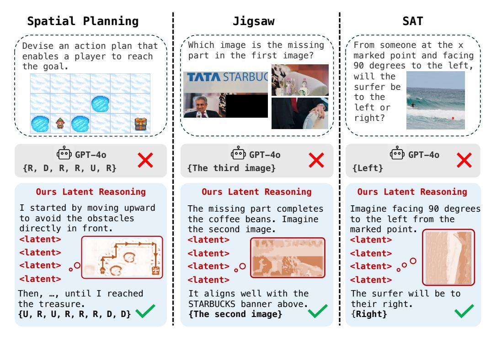

# 1 Introduction

Vision–language models (VLMs) jointly encode images and text and attain impressive results on visual-understanding benchmarks through text-only decoding [\[Wang et al.,](#page-11-0) [2024\]](#page-11-0). Techniques such as chain-of-thought prompting and reinforcement-learning fine-tuning can lengthen these textual reasoning traces and yield extra gains. Nonetheless, VLMs still stumble on multimodal reasoning tasks such as spatial reasoning, which demand more than passive perception; they require a coherent understanding and manipulation of visual elements.

Consider the jigsaw puzzle in Fig. [1.](#page-1-0) Instead of textualizing every candidate piece, people picture how the two fragments might align and decide on the correct match. This reasoning unfolds in a native multimodal fashion, not through language alone. Recent studies [\[Team,](#page-11-1) [2024,](#page-11-1) [Tong et al.,](#page-11-2) [2024,](#page-11-2) [Chern et al.,](#page-10-0) [2024,](#page-10-0) [Chen et al.,](#page-10-1) [2025\]](#page-10-1) have pre-trained VLMs for large-scale image generation so a single model can produce both words and pictures. Yet the cognitive demands of logical reasoning differ sharply from the task of synthesizing pixels, and asking one model to master both goals often degrades its reasoning quality [\[Wang et al.,](#page-11-3) [2025\]](#page-11-3). In addition, the image decoders cannot produce interleaved trajectories pertinent to input images. Consequently, fully exploiting the dormant multimodal reasoning capacity of VLMs remains an open challenge.

†Equal contribution

Figure 1: Multimodal Reasoning Examples. Mirage interleaves latent visual tokens, which represent compact imagery visual features, with explicit text tokens to solve diverse spatial reasoning multimodal tasks, boosting the reasoning performance without the full pixel-level image generation.

According to imagery theory, humans do not summon photorealistic pictures while thinking. We instead construct and manipulate mental images, simplified sketches that capture only task-relevant information, a process known as mental imagery [\[Shepard and Metzler,](#page-11-4) [1971,](#page-11-4) [Farah,](#page-10-2) [1985,](#page-10-2) [Kosslyn,](#page-10-3) [1996\]](#page-10-3). In the jigsaw example, we examine fragment contours to decide whether two pieces fit. Likewise, when searching for misplaced keys, we recall the outline of the shelf edge rather than the full room. Inspired by this behavior, we ask whether VLMs can reason directly in their latent visual embedding space, weaving compact visual embeddings into the text stream and dispensing with the need for explicit image generation.

To this end, we present Mirage, a decoding mechanism that interleaves latent visual representations among text tokens. Prior studies have shown that LLMs can reason directly within the latent space. Building upon this insight, in our Mirage framework, when the model chooses to reason visually by producing a special token, it then reuses its current hidden state as a compact visual embedding and appends it to the context, skipping the language projection. These internal embeddings furnish focused visual cues for later reasoning steps. As illustrated in Fig. [1,](#page-1-0) Mirage yields a chain-of-thought trajectory without any external image decoder.

As illustrated in Fig. [2,](#page-3-0) we adopt a two-stage fine-tuning paradigm to equip the model with interleaved reasoning. In the first stage, with annotated interleaving trajectories, we supervise both modalities: the model predicts the next word while reconstructing a compact latent visual vector obtained from compressed image embeddings. This dual objective anchors the latent tokens in the visual subspace and teaches the model to weave visual cues into its output.

The second stage removes direct supervision on the latent vectors and optimizes only the text tokens, letting the model treat its autoregressively generated latent embeddings as priors that guide subsequent word generation. This relaxation yields a more flexible interleave reasoning trajectory without forcing the latent channel to match any predetermined embedding. After these two stages, we apply reinforcement learning to further boost the reasoning performance.

Extensive experiments and superior performance across multiple benchmarks demonstrate that our proposed Mirage significantly enhances the reasoning ability of VLMs compared with text-only decoding. More concretely, our contributions are threefold,

- • We introduce Mirage, which enables VLMs to generate interleaved reasoning trajectories that mix latent visual tokens with ordinary text, without relying on external visual decoders.
- Our two-stage training paradigm empowers VLMs to produce stable yet flexible interleaved reasoning and shows that reinforcement learning can further boost performance.
- Mirage achieves consistent gains across diverse multimodal reasoning benchmarks. Further analysis reveals that the latent tokens embody meaningful visual cues, underscoring the potential to unlock deeper multimodal reasoning capabilities in VLMs.

