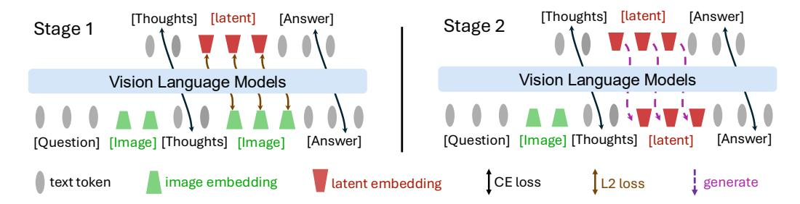
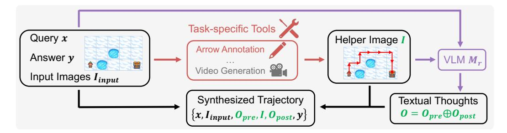

# 3 Multimodal Reasoning with Latent Visual Tokens

Inspired by the cognitive process of mental imagery, we introduce Mirage, a framework that lets VLMs reason in interleaved multimodal trajectories. In contrast to prior unified models that integrate an external image decoder and pre-train on large-scale image generation, our method generates compact latent embeddings that serve as visual tokens. By sidestepping image generation, the model can devote its capacity to reasoning, producing only the essential visual cues and thereby echoing the concise, sketch-like representations humans employ during reasoning.

Figure 2: Pipeline of Mirage Framework. Stage 1 jointly supervises text and latent visual tokens, grounding the latter in the visual subspace; Stage 2 drops the latent supervision, anchoring the grounded latent tokens for subsequent text generation.

In this section, we first explain how we synthesize informative multimodal reasoning data (Sec. [3.1\)](#page-3-1). Next, we introduce our first joint supervision training stage in Sec. [3.2.](#page-3-2) Finally, we explain the second stage, which applies text-only supervision while relaxing the latent constraints (Sec. [3.3\)](#page-4-0).

#### 3.1 Data Generation

Consider the multimodal reasoning task where the VLMs need to generate responses y to the input that consists of one or more images and a textual query. For simplicity, we denote the input that contains both image and text as x.

Given VLMs naturally generating text tokens only, they require additional supervised fine-tuning to learn an interleaved reasoning pattern. We therefore begin by synthesizing a training corpus that pairs each input x with a task-specific helper image I (See Fig. [3\)](#page-4-1). For example, in the navigation task, the helper image can be generated by taking the ground truth action list and manually drawing the corresponding path on the starting map with red arrows. Similarly, for the jigsaw task, we can concatenate the candidate fragments to form a composite image that captures the relationship among pieces. More details on the image generation procedures for different tasks can be found in the supplementary materials. In general, we obtain a help image that delivers precisely the visual cues needed to supervise latent reasoning.

With the helper image I prepared, we next synthesize a reasoning chain where the LLM incorporates the helper image to generate the final solution. Specifically, we first feed a large reasoning VLM M with the original input x, the ground-truth answer y, and the helper image I and prompt it to generate a step-by-step reasoning that incorporates the helper image. For example, the prompt can be Generate a step-by-step reasoning that leads to the ground-truth answer while properly incorporating the helper image in reasoning. Denote the model response as

$$o = M(x, y, I)$$
.

Here o is a step-by-step reasoning with the helper image embedded in the reasoning process. Since the helper image is embedded in the reasoning chain, it splits the reasoning chain into two parts. Without loss of generality, we represent o = opre ⊕I ⊕opost, where ⊕ is the concatenation operation, opre is the reasoning chain before the helper image while opost is the reasoning chain after the helper image. By prompt the large reasoning VLM with different inputs, we can thus collect a training dataset D = {x (i) , I (i) , o (i) , y (i)} N i=1, where each o (i) is a synthesized reasoning chain with text and image interleaved.

## 3.2 Joint Supervision for Latent Grounding

To teach the model an interleaved style of reasoning, one naive solution is to directly train a VLM on the data collected above. However, the effectiveness can be negatively affected by the model's limited capability of synthesizing helper images. Therefore, we propose a novel training strategy: pass the helper images to the VLM first to convert the helper images in the synthetic training data into patch-level features; then fine-tune the VLM to output such features as latent reasoning tokens, thus eliminating the need to generate helper images by the VLM.

Figure 3: **Data-generation Pipeline.** For each question—answer pair, we first create a helper image with task-specific tools (here, annotate the map with arrows), then prompt a VLM to produce textual reasoning that embeds this image. The text and helper image together form the synthetic multimodal trajectory used for training.

More specifically, for each training example  $(x, I, o, y) \in \mathcal{D}$ , we pass the helper image I through the VLM  $f_{\theta}(\cdot)$  with parameter  $\theta$  to obtain its patch-level features  $\{e_1, \ldots, e_n\} = f_{\theta}(I)$ . Rather than asking the model to reproduce every patch, we mimic human mental imagery by compressing these features into k salient vectors,  $\{\hat{e}_1, \ldots, \hat{e}_k\} = \operatorname{Compress}(\{e_1, \ldots, e_n\})$ , that retain only task-critical visual cues. In this work, we realize  $\operatorname{Compress}(\cdot)$  with simple average pooling over the original patch features, a lightweight yet surprisingly effective strategy that supplies a concise visual summary for supervision. We then train our model to (1) generate the response  $o_{\text{pre}}$  conditioned on the input x, (2) generate the latent tokens  $\{\hat{e}_1, \ldots, \hat{e}_k\}$  conditioned on x and x and x and x where the last layer hidden states at corresponding positions will be regarded as the generated latent tokens, and (3) generate the response x conditioned on the proceeding content.

For the training objective for latent token generation, we adopt the cosine similarity between the last layer hidden states of the model and the target latent tokens:

$$\mathcal{L}_{\text{visual}} = \ell_{\text{cos}} \left( \hat{\boldsymbol{e}}_{j}, g_{\theta} \left( \boldsymbol{o}_{\text{pre}}, \hat{\boldsymbol{e}}_{1:j-1} \right) \right),$$
 (1)

where  $g_{\theta}(o_{\text{pre}}, \hat{e}_{1:j-1})$  denotes the model's prediction for the j-th latent token conditioned on the preceding context. This loss grounds the latent tokens firmly in the visual representation space.

Meanwhile, we train the surrounding textual tokens using the standard cross-entropy loss for next token prediction. For the left segment  $o_{pre}$  the model conditions only on earlier words, whereas for the right segment  $o_{post}$  it also attends to the k compressed visual embeddings.

$$\mathcal{L}_{\text{text}} = \sum_{i=1}^{|\boldsymbol{o}_{\text{pre}}|} \ell_{\text{CE}}(\boldsymbol{o}_{\text{pre},i}, f_{\theta}(\boldsymbol{x}, \boldsymbol{o}_{\text{pre}, < i})) + \sum_{i=1}^{|\boldsymbol{o}_{\text{post}}|} \ell_{\text{CE}}(\boldsymbol{o}_{\text{post},i}, f_{\theta}(\boldsymbol{x}, \boldsymbol{o}_{\text{pre}}, \{\hat{\boldsymbol{e}}_{j}\}_{1}^{k}, \boldsymbol{o}_{\text{post}, < i}). \quad (2)$$

Here  $f_{\theta}(x)$  denotes the next token prediction probability conditioned on the input and  $\{\hat{e}_j\}_1^k$  is the set of the ground-truth latent tokens. The overall training objective in this stage combines this term with the visual-alignment loss  $\mathcal{L}_1 = \mathcal{L}_{\text{visual}} + \gamma \mathcal{L}_{\text{text}}$ , where the  $\gamma$  is the loss coefficient, thereby anchoring the latent tokens in visual space while teaching the model to weave them naturally into its textual thoughts.

#### 3.3 Text-Only Supervision with Latent Relaxation

The first stage grounds the latent tokens by forcing the model to reconstruct the compressed image embeddings. Although effective for visual alignment, this can over-constrain the model, diverting capacity from its primary goal of answering the question correctly, degrading the reasoning performance. Therefore, in the second stage, we remove the cosine loss altogether and keep only the cross-entropy loss over text tokens.

Although the latent tokens no longer carry an explicit loss, we still anchor them so that they meaningfully guide the following thoughts. For each training instance, the model first autoregressively produces its own latent tokens  $\{e_i\}_{i=1}^k$ , with

$$e_j = f_{\theta}(x, o_{\text{pre}}, e_{< j}).$$
 (3)

These self-generated embeddings replace the compressed image vectors used in Stage 1 and serve as priors for the tokens that follow the image placeholder. Therefore, the training objective becomes

$$\mathcal{L}_{\text{text}} = \sum_{i=1}^{|\boldsymbol{o}_{\text{pre}}|} \ell_{\text{CE}}(\boldsymbol{o}_{\text{pre},i}, f_{\theta}(\boldsymbol{x}, \boldsymbol{o}_{\text{pre}, < i})) + \sum_{i=1}^{|\boldsymbol{o}_{\text{post}}|} \ell_{\text{CE}}(\boldsymbol{o}_{\text{post},i}, f_{\theta}(\boldsymbol{x}, \boldsymbol{o}_{\text{pre}}, \{\boldsymbol{e}_{j}\}_{1}^{k}, \boldsymbol{o}_{\text{post}, < i}).$$
(4)

Due to the continuous property of  $\{e_i\}_{i=1}^k$ , these self-generated latent tokens are fully differentiable. Since the next token prediction of  $o_{\text{post}}$  is a function of the latent tokens, the gradient can be propagated to these latent tokens when minimizing the above loss on the textual tokens. This allows us to optimize the generation of the latent tokens within the learned visual subspace, acting as flexible priors that guide subsequent text generation and yield a more adaptive, task-focused reasoning.

The overall framework of our two-stage pipeline is provided in Fig. 2. These two stages jointly endow VLMs with the ability to generate interleaved multimodal reasoning with latent visual tokens. Empirical results in Sec. 4.2 further validate the effectiveness of our latent reasoning over naive text-only decoding.

#### 3.4 Reinforcement Learning

After the two supervised fine-tuning stages, the model has already learned to reason using both interleaved text and latent tokens. Here, we further explore whether the model's performance can be improved using reinforcement learning (RL), inspired by recent long-CoT language models [Xie et al., 2025, Shen et al., 2025]. Specifically, we adopt group relative policy optimization (GRPO) [Shao et al., 2024b] for RL training. For each input query in the training set, we sample multiple responses from the model. During RL, we explicitly optimize the probabilities of textual tokens while allowing gradients to flow through the latent tokens. Following LMM-R1 [Peng et al., 2025], we adopt two types of rewards: accuracy and format. We consider both accuracy and format rewards. For accuracy reward, we set  $r_{\rm acc}(o,x)=1$  if the final answer is correct, and 0 otherwise. For the format reward, we check whether the thinking process is enclosed between "<think>" and "
"
Tags and whether the final answer format is formatted as "\boxed{}" in the output response o. If the format is correct, the reward is 0.1; otherwise, it is 0. We then use the aggregated reward for optimization.

