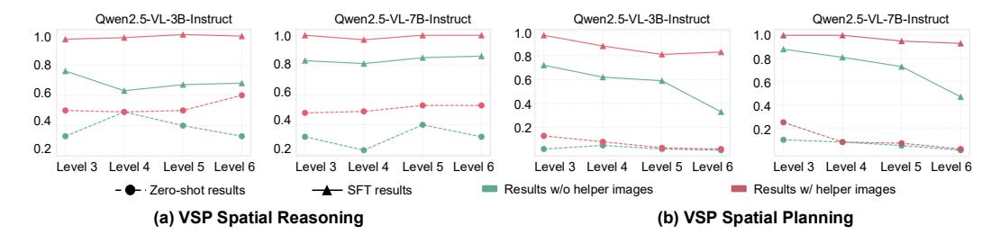

# 4.3 Ablation Study

In this section, we first conduct an ablation study to evaluate the influence of the two stages of our framework. Tab. [4](#page-7-1) reports the effect of removing each training phase. Training with only the first phase, which jointly supervises text and latent visual tokens, anchors the latent embeddings but leaves them constrained and lowers performance, similar to the plight of unified models.

Training with only the second stage, which relies on text loss alone while

Figure 4: Ablation Study of Training Stages on VSP Spatial Planning task. Both training stages work jointly to achieve better reasoning performance.

|                                |              | VSP Spatial Planning |              |              |              |  |  |
|--------------------------------|--------------|----------------------|--------------|--------------|--------------|--|--|
| Method                         | 3            | 4                    | 5            | 6            | Avg.         |  |  |
| Ours                           | 0.75         | 0.63                 | 0.53         | 0.39         | 0.58         |  |  |
| - w/o Stage 1 - w/o Stage 2 | 0.69 0.38 | 0.58 0.19         | 0.46 0.16 | 0.36 0.09 | 0.52 0.21 |  |  |

letting latent tokens evolve freely, performs slightly better the text-only baseline. Without the grounding supplied by the first stage, the latent vectors drift into regions of the multimodal embedding space that do not aid reasoning. This outcome contrasts with findings on LLMs in Coconut [\[Hao et al.,](#page-10-15) [2024\]](#page-10-15), where unsupervised latent vectors can benefit subsequent reasoning. The difference indicates that visual and textual subspaces in VLMs remain heterogeneous enough that a grounding phase is effective. These ablations confirm that the first stage aligns latent tokens with visual features, the second stage allows them to adapt to the task, and both steps are necessary for the final performance. We also include a deeper analysis of the generated latent embeddings in Sec. [5.](#page-9-0)

Figure 6: Performance with Helper Images as Input Priors. We evaluate model accuracy using synthesized helper images under both zero-shot and fine-tuned settings. The results highlight the informativeness of the generated images and confirm their high data quality.

To delve deeper into the robustness of our framework, we investigate the influence of hyperparameters: latent token size k and the multimodal loss coefficient γ. As Tab. [5](#page-8-0) shows, adjusting the loss coefficient γ has a moderate effect. A larger γ weights the latent-alignment loss less in the first stage. When γ approaches infinity, the first stage becomes equivalent to skipping visual supervision entirely, in other words, the second stage. This gives a poor initialization for subsequent training. Even so, after the second stage, each γ tested still obtains over 80% accuracy, which attests to the overall robustness of the framework.

Figure 5: Ablation Study of Latent Size k and Loss Coefficient γ on VSP Spatial Reasoning. Our training pipeline remains robust and superior performance across different hyperparameters.

| k | γ   | VSP Spatial Reasoning |      |      |      |      |  |  |
|---|-----|-----------------------|------|------|------|------|--|--|
|   |     | 3                     | 4    | 5    | 6    | Avg. |  |  |
| 2 | 0.1 | 0.85                  | 0.86 | 0.89 | 0.93 | 0.86 |  |  |
| 4 | 0.1 | 0.87                  | 0.92 | 0.86 | 0.84 | 0.87 |  |  |
| 6 | 0.1 | 0.85                  | 0.90 | 0.91 | 0.87 | 0.88 |  |  |
| 8 | 0.1 | 0.77                  | 0.77 | 0.74 | 0.70 | 0.75 |  |  |
| 4 | 0.5 | 0.84                  | 0.91 | 0.84 | 0.78 | 0.84 |  |  |
| 4 | 1   | 0.77                  | 0.85 | 0.85 | 0.87 | 0.83 |  |  |

We observe that varying the latent size k from 2 to 6 yields consistently strong performance,

with k = 6 showing a slight improvement—highlighting the resilience of our latent design. However, increasing k to 8 results in a significant performance drop around 13%, likely due to error accumulation in longer latent sequences under autoregressive non-decoding generation. These observations are consistent with prior findings that optimal latent reasoning performance in LLMs typically occurs with fewer than 6 latent tokens [\[Hao et al.,](#page-10-15) [2024\]](#page-10-15).

