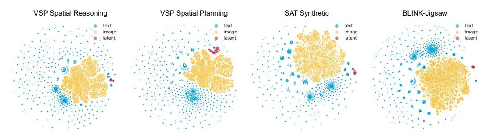

# 5 Analysis

Generalization to Smaller Models. To further investigate the impact of our latent design, we also evaluate performance using the Qwen2.5-VL 3B model. As shown in Tab. [3,](#page-7-2) results are consistent with those observed on the 7B model, demonstrating clear performance gains across both tasks. Notably, compared to text-only baselines, our Mirage achieves even larger improvements—5% on the Jigsaw task and 10% on the SAT Real task. These findings further highlight the strength of our latent design and its potential to generalize across different model scales.

Synthesized Data Quality. Data quality plays a critical role in model performance. In this section, we investigate whether the helper images generated by various tools are genuinely informative for VLM reasoning. For the two VSP tasks, we supply the helper image as prior input and evaluate model performance in both zero-shot and fine-tuned settings. As shown in Fig. [6,](#page-8-1) providing the helper image leads both models to achieve nearly 100% accuracy on both tasks. Even in the zero-shot setting, we observe substantial performance gains on the spatial reasoning task. However, improvements on the spatial planning task are limited to simpler map layouts in the zero-shot setting. We attribute this to the inherent difficulty of extracting and leveraging spatial information from the helper image without task-specific fine-tuning. These results suggest that the synthesized helper images do indeed enhance VLM reasoning. Moreover, if the model's latent thoughts can fully internalize the information encoded in these images, it would represent a strong performance upper bound for our Mirage.

Figure 7: Visualization of Latent Embeddings. We visualize our latent tokens along with text and image embeddings with t-SNE. Our latent tokens cluster near, yet just outside, the visual representation subspace, consistent with the two-stage training design.

Latent Behavior Analysis. During the first stage, the model learns to reproduce compressed image embeddings, anchoring its latent tokens in the visual subspace. However, after the second stage, these latent tokens receive no direct supervision. Therefore, it is unclear whether they still encode visual representations. Therefore, in this section, we further investigate the latent behaviors of our Mirage.

By sampling 100 examples from each dataset, we obtain the corresponding latent token vectors alongside the text and visual embeddings. Next, we use t-SNE to embed all vectors into two dimensions for better visualization with a perplexity of 30, and initialize the embeddings via PCA. As shown in Fig. [7,](#page-9-1) the text embeddings (blue dots) fill the entire plot in a radial scattering pattern, while the visual token embeddings (yellow dots) cluster tightly inside a distinct visual subspace, consistent with previous findings. Our latent embeddings (red dots) form a compact cloud that sits just outside that visual cluster, shifted by the second training stage, which tailors the latent embeddings to answer generation. However, we notice that our latent tokens remain clearly separated from the text distribution and closer to the visual embedding across diverse tasks. This pattern shows that even without an explicit decoder, the latent tokens stay close to the visual manifold while retaining the flexibility introduced in the second stage, echoing the way mental imagery abstracts rather than reproduces visual input.

