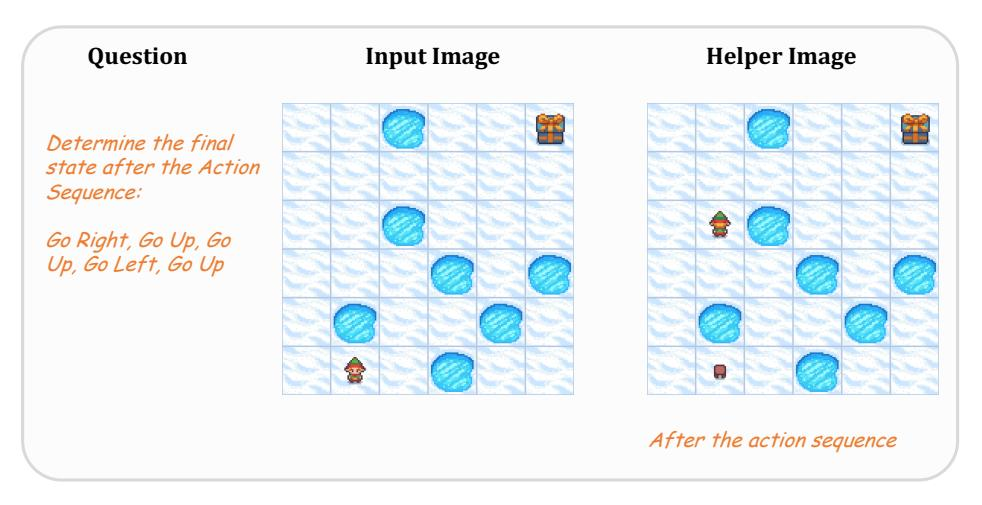
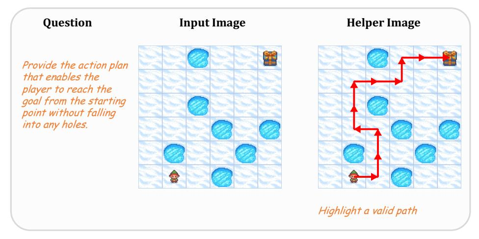
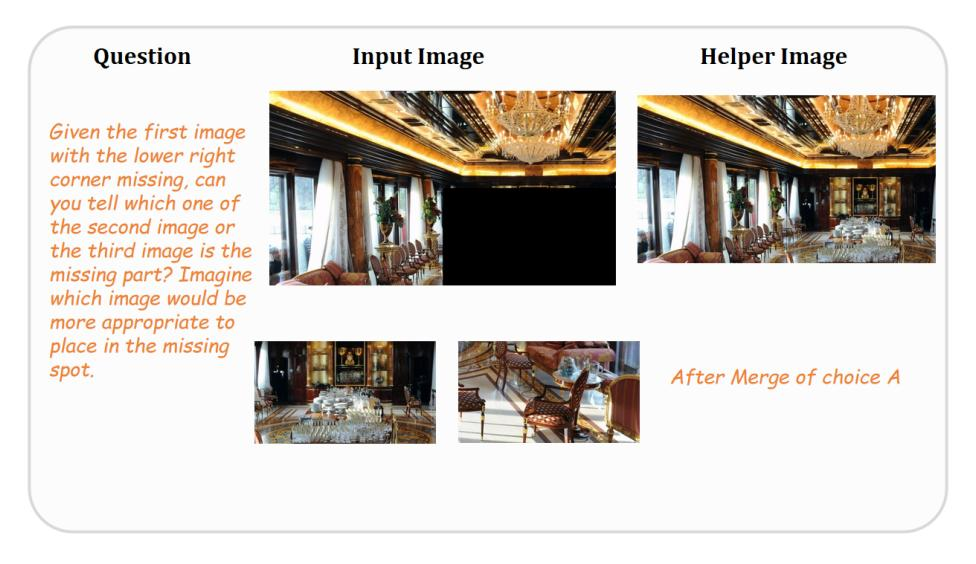
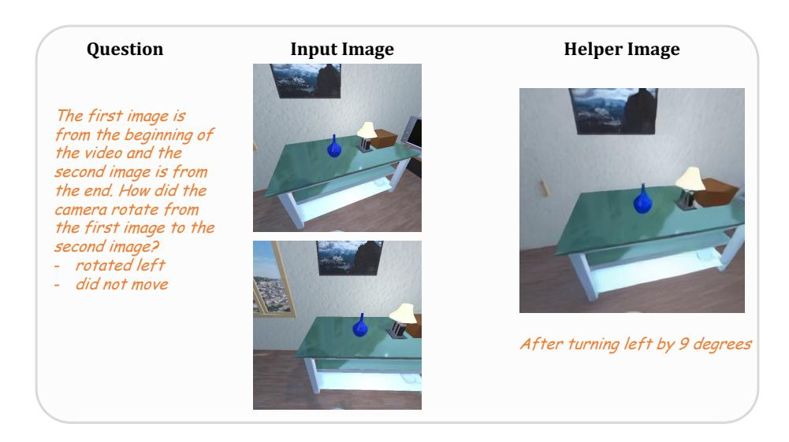

# A Datasets

#### A.1 Help Image Generation

Diverse task-specific tools are employed to generate the helper images used in fine-tuning. In this section, we will detail the generation pipeline for each task.

VSP Spatial Reasoning. To assist in inferring the final state after a sequence of actions, we leverage the map layout visualization as the helper image, including the agent position after part of the action trajectory. Following the VSP implementation, we render this state with the OpenAI Gym package [\[Brockman et al.,](#page-10-19) [2016\]](#page-10-19), using the initial map and the action sequence as inputs.

Figure 8: An example of the helper image of the VSP Spatial Reasoning task.

VSP Spatial Planning. For the planning task, we provide a map annotated with the ground-truth path, turning the problem into simply reading the highlighted trajectory. Specifically, we select one valid action sequence for each sample and highlight its steps as a red arrow that begins at the agent's start position and ends at the goal.

Figure 9: An example of the helper image of the VSP Spatial Planning task.

Blink Jigsaw. The Jigsaw task asks which candidate patch completes the reference image. For each instance we create a helper image by inserting one randomly chosen candidate patch into the masked region. The model then can judge whether the composite looks seamless: if the patch blends smoothly, it is the correct answer; if not, the other candidate should be chosen.

Figure 10: An example of the helper image of the BLINK task.

SAT. For the SAT task, we focus on the GoalAim and ObjM subtasks, which require reasoning about a specified camera pose movement. Providing the target view as a helper image would ease the model's spatial reasoning burden. Therefore, given the recent advance in world model research, we adopt a high-quality video generation model CogVideoX-5B to generate this image. To further ensure the image quality, we restrict the action condition for generation to three primitives: move forward, turn left, and turn right. Sampling 9 frames along each trajectory, we instruct a VLM to choose the most informative frame. The chosen frame is then used as the helper image.

Figure 11: An example of the helper image of the SAT task.

#### A.2 Textual Thoughts Generation

For each task, we generate the textual thoughts instead of leveraging closed-source outputs. We feed the helper image and the ground truth answer to a large reasoning model Qwen2.5-VL 32B. Task-specific prompts are applied. Simplified prompts and one illustrative example per task are provided in Tab. [4](#page-15-0)[–7.](#page-17-0)

The generated thoughts and the associated helper image serve as the supervision for fine-tuning, and the quality of these explanations sets an upper bound on our model's performance. Our current approach relies on straightforward prompts, which occasionally yield subpar reasoning trajectories. Developing richer prompts or otherwise curating higher-quality trajectories remains an important future work.

#### Table 4: Data Example of VSP Spatial Reasoning

### VSP Spatial Reasoning

#### Thoughts Generation System Prompt:

You are analysing \*\*one move\*\* in FrozenLake.

Tiles (numeric): 1=Start point, 0=Ice, -1=Hole, 2=Target

End-states: success, fail in hole, fail on ice

Task: Given the map, current position, and one action, write \*\*one short sentence thought\*\* that states: 1. the square reached [(row,col), TileType]; 2. how that move shifts the likelihood of the three end-states.

No bullets, no extra lines, just the single sentence.

Current numeric map: {map\_desc} Current position: {position} Chosen action: {action}

Example 1

Numeric map: [[1,0,0],[0,-1,0],[0,0,2]] At (0,0) action RIGHT

Thought: I slide onto [(0,1),Ice] staying safe and inching closer to the target, so success is a bit likelier while hole-failure remains unchanged.

Example 2

Numeric map: [[1,0,-1],[0,-1,0],[0,0,2]]

At (1,0) action RIGHT

Thought: Moving to [(1,1),Hole] ends the game instantly in a hole, making "fail in hole" certain and wiping out other outcomes.

#### Example Input:

Task: FrozenLake

Given the initial state and action sequence, visualize the final state of the frozen lake map and determine whether the agent (elf character) can safely reach the gift following the action sequence without falling into the holes. If not, identify the failure reason from the given options.

The definitions of the actions are as below.

Go Up/Left/Down/Right: move one grid space in the absolute up/left/down/right direction.

Return A, B or C.

A. Action Success.

B. Action Failed: Fall into the Hole.

C. Action Failed: Agent Safe.

Full Action Sequence: Go Left, Go Down

Here is the image of the initial state of the frozenlake map. <image>

The reasoning process MUST BE enclosed within <think> </think> tags. The final answer MUST BE put in \boxed{}.

#### Example Output:

<think> Moving to [(1,3),Hole] ends the game instantly in a hole, making ¨fail in holecertain and ¨ wiping out other outcomes. Next, Moving to [(1,4),Hole] ends the game instantly in a hole, making ¨fail in holecertain and wiping out other outcomes. Next, Moving to [(2,4),Ice] keeps me on the ¨ slippery path, increasing the likelihood of success slightly while the risk of failing in a hole remains high due to nearby hazards. </think>The answer is \boxed{A}.

#### VSP Spatial Planning

#### Thoughts Generation System Prompt:

You are a concise maze navigator.

Input: (1) an image of a maze, (2) a second image, and (3) a proposed action sequence.

Task: Write 1-2 English sentences that logically justify why the given action sequence reaches the treasure.

- Pretend you derived the sequence yourself; NEVER say it was supplied.
- NEVER mention or allude to the second image or any 'highlighted route'.
- Do not output anything else.

#### Example Input:

As a professional maze solver, your task is to analyze a grid-based map and devise an action plan that enables a player to reach the goal from the starting point without falling into any holes, using the fewest possible moves.

#### ## Game Setup

- The game presents a fully observable grid-based map.
- The player starts at a specified grid square, with the goal located elsewhere on the map.
- Each grid square is either safe or contains a hole.
- Your goal is to guide the player to the goal while avoiding holes.
- For example, your final answer should be like "L,L,R,U,D", which means an action plan of left, left, right, up, and down.

#### ## Moving Rules

- The action plan involves a series of moves: 'L' (left), 'R' (right), 'U' (up), or 'D' (down).
- Each move transfers the player to the adjacent square in that direction, provided it is a safe square. The player cannot move more than one square at a time.
- Moving off the edge of the map has no effect. The player will remain at the same square.
- DO NOT MOVE INTO A HOLE! Falling into a hole results in defeat.
- Locating at the grid containing the goal results in victory.

Here is the map: <image>

Please provide your action plan.

The reasoning process MUST BE enclosed within <think> </think> tags. The final answer MUST BE put in \boxed{}.

#### Example Output:

<think> Moving RIGHT is the best choice because it allows me to avoid the hole directly below me and keeps me on a path that is moving closer to the goal 'G'. Moving up would lead me to a frozen square but doesn't advance me towards the goal, while moving down would immediately result in falling into a hole. Therefore, moving RIGHT is the safest and most efficient option at this moment. Next, Moving down is a strategic choice because it avoids the immediate danger of the hole to the right. It also moves the agent closer to the goal by entering a column that is likely to lead towards 'G' without any immediate threats. Moving left or right poses a higher risk of falling into a hole, whereas moving down appears to be a safe and progressive step towards the goal. Next, Moving DOWN from position is a strategic choice because it avoids the immediate danger to the left and right while still moving closer to the goal. Moving RIGHT would risk falling into the hole, and moving LEFT would take me further away from the goal. Thus, moving DOWN is the safest and most direct path towards the goal. Next, Moving DOWN is the best choice because it allows me to continue progressing towards the goal 'G' while avoiding immediate danger. To the right, there is a hole, and moving left would not bring me any closer to my objective. Moving up would be counterproductive as it would take me further away from the goal. Thus, moving DOWN is the safest and most efficient option. <image></think> The answer is \boxed{RIGHT, DOWN, DOWN, DOWN}.

#### BLINK Jigsaw

#### Thoughts Generation System Prompt:

You are a concise visual inspector.

When shown: (1) a jigsaw with a missing section, (2) two candidate pieces, and (3) the fully assembled image using the correct piece, you must give a brief justification of why the chosen piece fits.

Write 1-2 English sentences, focus on visual cues such as edge continuity, color/lighting consistency, perspective, and semantics.

#### Example Input:

Given the first image with the lower right corner missing, can you tell which one of the second image or the third image is the missing part? Imagine which image would be more appropriate to place in the missing spot. You can also carefully observe and compare the edges of the images.

Select from the following choices

- (A) the second image
- (B) the third image
- <image><image><image>

The reasoning process MUST BE enclosed within <think> </think> tags. The final answer MUST BE put in \boxed{}.

#### Example Output:

<think> Option (B) shows a person in the foreground with a light source, which disrupts the continuity of the crowd and lighting in the main image. </think> <image> <think> The lighting and shadows in the main image suggest a more uniform and darker environment, which is not consistent with the brighter, focused light in the wrong piece. </think> \boxed{A}.

#### Table 7: Data Example of SAT

#### SAT

#### Thoughts Generation System Prompt:

You are a concise spatial-reasoning expert.

Input items may include one or more scene images, a question, an additional helper image, the available answer choices, and a special field called TargetAnswer.

- Use any information you need internally, but NEVER mention or allude to the additional image or the TargetAnswer.
- Write 1 short English sentence that logically deduces the answer.
- Embed the additional image exactly once using the literal token <image>.

