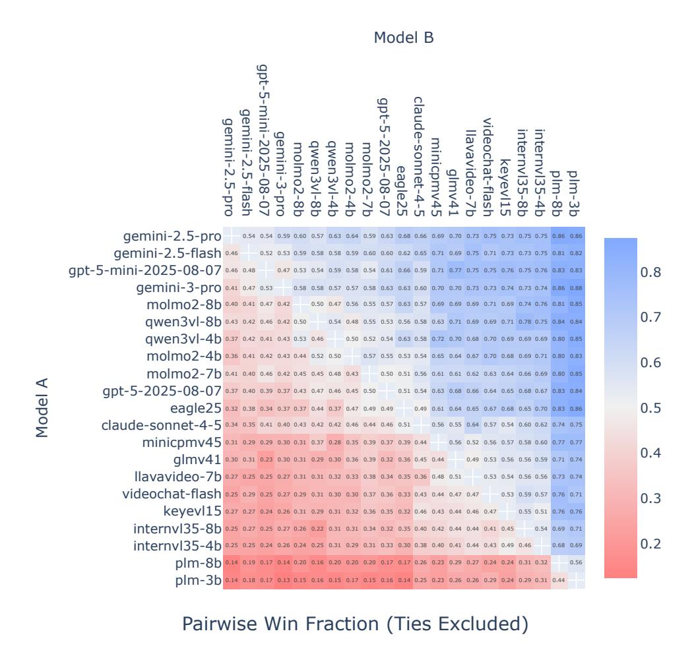

# **B** Training details

In this section, we provide additional details about packing, the data mixture, and other components of how Molmo2 was trained.

**Packing.** Our packing algorithm keeps a pool of M=48 examples that have already been preprocessed and converted into a tokenized representation. If the pool is not full, examples are drawn from the training mixture and added to the pool. When the pool is full, we run a dynamic programming solver to find the optimal subset of examples that maximizes  $T+I*w_i$  subject to  $T \le 16384$  and  $I \le 128$ , where T is the total number of text tokens in the selected subset, I is the total number of crops, and  $w_i = 30$  is a hyperparameter. During long context training, we instead use a max of 384 images and 36864 tokens. The selected examples are yielded as a single packed sequence and removed from the pool. In practice, we run the solver on a quantized version of the problem by rounding the number of tokens to the nearest multiple of 32.

Increasing M quickly leads to diminishing returns in terms of packing efficiency. We do not observe any gains from using more than 48. The algorithm is usually robust to  $w_i$ , but we observe that in some settings, if  $w_i$  is too low, the pool can become filled with examples with 128 crops, which usually cannot be packed with anything else, thereby reducing efficiency.

Implementation-wise, we add this logic into torch's *DataLoader* so that each data-worker runs this algorithm independently. This makes the algorithm easy to use, but it does add some unnecessary overhead when there

<span id="page-27-0"></span><sup>4</sup>https://pytorch.org/docs/stable/report/amp.html

<span id="page-27-1"></span><sup>&</sup>lt;sup>5</sup>https://unsloth.ai/blog/gradient

<span id="page-28-0"></span>

|           |                          | 4B     | 7B           | 8B     |
|-----------|--------------------------|--------|--------------|--------|
|           | Params                   |        | 380m         |        |
|           | Dim                      |        | 1152         |        |
|           | MLP Dim                  |        |              |        |
| Encoder   | Act.                     |        | 4304<br>GELU |        |
|           | Heads                    |        | 16           |        |
|           | KV Heads                 |        | 16           |        |
| Image     | Layers                   |        | 27           |        |
|           | Image Size               |        | 384×384      |        |
|           | Patch Size               |        | 14           |        |
|           | Dropout                  |        | 0.0          |        |
|           | Params                   | 57m    | 80m          | 88m    |
| Connector | Image Pool Size          |        | 2×2          |        |
|           | Video Pool Size          |        | 3×3          |        |
|           | Pool Dim                 |        | 1152         |        |
|           | Pool Heads               |        | 16           |        |
| V/L       | MLP Dim                  | 9728   | 100352       | 12288  |
|           | Act.                     |        | SwiGLU       |        |
|           | Dropout                  |        | 0.0          |        |
|           | Params                   | 4.0b   | 7.3m         | 8.2m   |
|           | Embed                    | 151936 | 100352       | 151936 |
|           | Dim                      | 2560   | 4096         | 4096   |
|           | MLP Dim                  | 9728   | 11008        | 12288  |
| M         |                          |        |              |        |
| LL        | Act.                     |        | SwiGLU       |        |
|           | Heads                    |        | 32           |        |
|           | KV Heads                 | 8      | 32           | 8      |
|           | Layers                   | 36     | 32           | 36     |
|           | Theta<br>Dropout         | 1m     | 0.5m<br>0.1  | 1m     |
|           |                          |        |              |        |
|           | Warmup ViT               |        | 2000         |        |
|           | Warmup Con.              |        | 200          |        |
|           | Warmup LLM               |        | 2000         |        |
|           | LR ViT                   |        | 6e-6         |        |
| Pre-Train | LR Con.                  |        | 2e-4         |        |
|           | LR LLM                   |        | 2e-4         |        |
|           | Cosine Decay             |        | 10%          |        |
|           | Eps.                     |        | 1e-6         |        |
|           | Betas                    |        | 0.9, 0.95    |        |
|           | Batch Size               |        | 128          |        |
|           | Sequence Length          |        | 2560         |        |
|           | Steps                    |        | 32k          |        |
|           | Warmup ViT               |        | 200          |        |
|           | Warmup Con.              |        | 200          |        |
|           | Warmup LLM               |        | 200          |        |
|           | LR ViT                   |        | 5e-6         |        |
|           | LR Con.                  |        | 5e-6         |        |
| SFT       | LR LLM                   |        | 1e-5         |        |
|           | Cosine Decay             |        | 10%          |        |
|           | Eps.                     |        | 1e-6         |        |
|           | Betas                    |        | 0.9, 0.95    |        |
|           |                          |        |              |        |
|           | Batch Size               |        | 128          |        |
|           | Sequence Length<br>Steps |        | 16384<br>30k |        |

**Table 12 Model and training hyper-parameters**, Molmo2-O-7B is a version of Molmo2 with OLMo 3 [\[112\]](#page-22-4). Longcontext post-training used the same parameters as SFT

<span id="page-29-0"></span>

| name                                 |            | rate visual anno. |             | ex.        | name                                   |      | rate visual anno.      |      | ex.       |
|--------------------------------------|------------|-------------------|-------------|------------|----------------------------------------|------|------------------------|------|-----------|
| Image QA                             |            | 22.7 2.7m         | 32m         | 2.4m       | Video QA                               |      | 18.2 2.3m              |      | 4.7m 2.4m |
| PixMo-Clocks                         | 1.9        | 800k              |             | 800k 800k  | Molmo2-CapQA                           | 1.6  | 190k                   | 950k | 190k      |
| Llava-665k-Multi                     | 1.5        | 280k              |             | 2.5m 160k  | Molmo2-SubtitleQA                      | 1.2  | 100k                   | 470k | 100k      |
| TallyQA                              | 1.4        | 130k              |             | 250k 130k  | Video Localized Narratives             | 1.1  | 53k                    | 180k | 56k       |
| CoSyn-chart                          | 1.3        | 120k              |             | 1.1m 120k  | TGIF                                   | 0.9  | 63k                    | 210k | 63k       |
| NLVR2                                | 1.1        | 100k              | 86k         | 86k        | TVQA                                   | 0.9  | 120k                   | 120k | 120k      |
| VQA v2                               | 1.1        | 83k               | 440k        | 83k        | Paxion                                 | 0.9  | 440k                   | 440k | 440k      |
| CoSyn-doc                            | 1.0        | 71k               | 610k        | 71k        | Moments In Time                        | 0.9  | 710k                   | 710k | 710k      |
| A-OKVQA                              | 1.0        | 33k               | 34k         | 34k        | Kinentics                              | 0.9  | 420k                   | 420k | 420k      |
| CoSyn-math                           | 1.0        | 67k               | 67k         | 67k        | LLaVA Academic                         | 0.9  | 11k                    | 62k  | 31k       |
| CoSyn-table                          | 0.8        | 47k               | 420k        | 47k        | Ego4D                                  | 0.9  | 53k                    | 53k  | 53k       |
| DocVQA                               | 0.7        | 10k               | 39k         | 39k        | EPIC KITCHENS                          | 0.7  | 37k                    | 37k  | 37k       |
| CoSyn-diagram                        | 0.7        | 35k               | 300k        | 35k        | COIN                                   | 0.7  | 7.8k                   | 30k  | 30k       |
| TextQA                               | 0.7        | 22k               | 35k         | 35k        | How2QA                                 | 0.6  | 25k                    | 35k  | 25k       |
| Molmo2-SynMultiImageQA-chart         | 0.7        | 100k              | 330k        | 33k        | ActivityNet                            | 0.5  | 12k                    | 46k  | 21k       |
| ChartQA                              | 0.6        | 18k               | 28k         | 28k        | FunQA                                  | 0.5  | 3.1k                   | 200k | 21k       |
| Molmo2-SynMultiImageQA-doc<br>ST-VQA | 0.6<br>0.6 | 88k<br>18k        | 270k<br>25k | 28k<br>25k | CLEVRER                                | 0.5  | 10k                    | 130k | 20k       |
| InfographicVQA                       | 0.6        | 4.4k              | 24k         | 24k        | STAR                                   | 0.5  | 3k                     | 91k  | 19k       |
| TabWMP                               | 0.6        | 23k               | 23k         | 23k        | YouCook2                               | 0.4  | 1.2k                   | 18k  | 10k       |
| PlotQA                               | 0.5        | 160k              | 20m         | 160k       | SUTD-TrafficQA                         | 0.4  | 10k                    | 56k  | 10k       |
| AI2D                                 | 0.5        | 6.2k              | 15k         | 15k        | CinePile                               | 0.4  | 9.2k                   | 300k | 9.2k      |
| Molmo2-SynMultiImageQA-diagram       | 0.5        | 45k               | 150k        | 15k        | Charades STA                           | 0.4  | 5.3k                   | 12k  | 9.2k      |
| Molmo2-SynMultiImageQA-table         | 0.4        | 47k               | 140k        | 14k        | QVHighlights                           | 0.3  | 6.8k                   | 7k   | 7k        |
| CoSyn-music                          | 0.4        | 12k               | 82k         | 12k        | MotionBench                            | 0.3  | 5k                     | 5k   | 5k        |
| DVQA                                 | 0.4        | 200k              |             | 2.3m 200k  | Countix                                | 0.2  | 3.9k                   | 4.4k | 4.4k      |
| FigureQA                             | 0.4        | 100k              |             | 1.3m 100k  | NExT-QA                                | 0.2  | 3.9k                   | 34k  | 3.9k      |
| OK-VQA                               | 0.4        | 9k                | 9k          | 9k         | Sports-QA                              | 0.2  | 3.6k                   | 56k  | 3.6k      |
| CoSyn-chemical                       | 0.4        | 8.9k              | 55k         | 8.9k       | IntentQA                               | 0.2  | 3.2k                   | 24k  | 3.2k      |
| Spot-the-Difference                  | 0.3        | 15k               | 14k         | 7.5k       | NewsVideoQA                            | 0.2  | 2.9k                   | 8.4k | 2.9k      |
| ScienceQA                            | 0.3        | 6.2k              | 6.2k        | 6.2k       | RoadTextVQA                            | 0.2  | 2.6k                   | 8.4k | 2.6k      |
| Molmo2-SynMultiImageQA-music         | 0.3        | 12k               | 46k         | 4.7k       | PerceptionTest                         | 0.2  | 2k                     | 7.4k | 2k        |
| Molmo2-SynMultiImageQA-chemical 0.2  |            | 8k                | 23k         | 2.4k       | CamaeraBench                           | 0.1  | 1.4k                   | 1.4k | 1.4k      |
|                                      |            |                   |             |            | Social IQ 2                            | 0.1  | 0.79k                  | 5k   | 0.79k     |
| Image Pointing                       | 9.1        | 510k              |             | 5.5m 1.1m  | Video Tracking                         |      | 13.6 130k              | 800k | 800k      |
| PixMo-Points                         | 4.6        | 220k              |             | 4.6m 530k  | Molmo2-VideoTrack                      | 4.6  | 8k                     | 220k | 220k      |
| Molmo2-MultiImagePoint               | 2.0        | 180k              |             | 470k 470k  | AcademicVideoTrack-MeViS               | 2.0  | 1.7k                   | 150k | 150k      |
| PixMo-Count                          | 1.2        | 37k               | 74k         | 74k        | AcademicVideoTrack-ViCaS               | 1.2  | 15k                    | 130k | 130k      |
| CoSyn-point                          | 1.2        | 68k               | 320k        | 68k        | AcademicVideoTrack-ReVOS               | 1.2  | 0.7k                   | 82k  | 82k       |
|                                      |            |                   |             |            | AcademicVideoTrack-TrackingNet         | 1.1  | 29k                    | 29k  | 29k       |
| Captions/Long QA                     |            | 13.6 1.2m         |             | 1.6m 1.2m  | AcademicVideoTrack-Ref-Youtube-VOS 0.9 |      | 3.5k                   | 26k  | 26k       |
| Molmo2-Cap                           | 3.4        | 100k              |             | 280k 100k  | AcademicVideoTrack-VastTrack           | 0.8  | 46k                    | 93k  | 93k       |
| PixMo-CapQa                          | 3.1        | 190k              |             | 270k 190k  | AcademicVideoTrack-LV-VIS              | 0.8  | 3.1k                   | 38k  | 38k       |
| PixMo-Cap                            | 2.3        | 710k              |             | 710k 710k  | AcademicVideoTrack-GOT-10k             | 0.4  | 9.2k                   | 18k  | 18k       |
| PixMo-AskModelAnything               | 1.9        | 71k               | 160k        | 71k        | AcademicVideoTrack-WebUAV              | 0.2  | 3.2k                   | 6.3k | 6.3k      |
| Molmo2-MultiImageQA                  | 1.5        | 98k               | 73k         | 45k        | AcademicVideoTrack-BURST               |      | 0.07 0.28k             | 2.9k | 2.9k      |
| Molmo2-AskModelAnything              | 1.5        | 43k               | 130k        | 43k        | AcademicVideoTrack-LaSOT               | 0.06 | 1.1k                   | 2.2k | 2.2k      |
|                                      |            |                   |             |            | AcademicVideoTrack-TNL2K               |      | 0.06 0.88k             | 1.8k | 1.8k      |
| NLP                                  | 9.1        | 0                 |             | 980k 980k  | AcademicVideoTrack-WebUOT              |      | 0.05 0.84k             | 1.5k | 1.5k      |
| Tulu                                 | 9.1        | 0                 |             | 980k 980k  | AcademicVideoTrack-LVOS V2             |      | 0.05 0.42k             | 1.2k | 1.2k      |
|                                      |            |                   |             |            | AcademicVideoTrack-lasot               |      | 0.03 0.22k 0.45k 0.45k |      |           |
| Video Pointing                       |            | 13.6 260k         |             | 500k 370k  | AcademicVideoTrack-UW-COT220           |      | 0.03 0.21k             | 0.4k | 0.4k      |
| Molmo2-VideoPoint                    |            | 10.9 250k         |             | 450k 330k  | AcademicVideoTrack-LVOS V1             |      | 0.02 0.12k             | 0.3k | 0.3k      |
| AcademicVideoPoint-MeViS             | 1.2        | 1.6k              | 20k         | 20k        | AcademicVideoTrack-TNLLT               |      | 0.02 0.15k 0.29k 0.29k |      |           |
| AcademicVideoPoint-ReVOS             | 0.7        | 3.4k              | 11k         | 11k        | AcademicVideoTrack-Ref-DAVIS17         |      | 0.02 0.06k             | 1.1k | 1.1k      |
| AcademicVideoPoint-LV-VIS            | 0.7        | 3.1k              | 11k         | 11k        | AcademicVideoTrack-YouTube-VIS         | 0.02 | 1.2k                   | 1.4k | 1.4k      |
| AcademicVideoPoint-OVIS              | 0.05       | 600               | 880         | 880        | AcademicVideoTrack-MoCA-Video          |      | 0.01 0.13k             | 0.4k | 0.4k      |
| AcademicVideoPoint-BURST             | 0.04       | 310               | 680         | 680        |                                        |      |                        |      |           |
| AcademicVideoPoint-Ref-DAVIS17       | 0.03       | 58                | 450         | 450        |                                        |      |                        |      |           |

**Table 13 Full dataset list**. Columns show sampling rates, the number of videos or images, the number of annotations, and the number of training examples built after formatting the data into message trees.

<span id="page-30-0"></span>

Figure 4 Molmo2 SFT mixture. Categories and datasets are shown in proportion to sampling rates in SFT mixture.

are many data workers. This could be addressed in future work through a deeper integration into torch's data-loading logic. In practice, we find that packing still does not slow down the training speed. Loading and extracting frames from videos remains, by far, the most costly part of data loading.

**Pre-training.** During pre-training, we use response-only dropout, *i.e.*, residual dropout on just the output tokens, of 0.1, length conditioning, and both the caption and transcript, following Molmo [29].

**SFT**. The full list of datasets in our SFT mixture is shown in Table 13, and visualized in Figure 4. During SFT we use regular residual dropout of 0.1.

**Prompting.** We use the human-written questions with long-form answers from PixMo-AskModelAnything, PixMo-CapQA, and Molmo2-AskModelAnything directly. For captioning, all multiple-choice questions, and our various grounding tasks, we use prompt templates to generate a variety of ways to prompt the model for the target output. The remaining short-answer or captioning academic datasets typically have answer styles that are poorly suited for user-facing behaviors, either because they are too terse or have other idiosyncratic quirks due to how the data was collected. For these datasets, we prompt the model with style tags (e.g. "short video answer:") so that Molmo2 adopts those answer styles only if specifically prompted to do so.

**Hyperparameters.** Hyperparameters for AdamW [67] are in Table 12. Following Molmo [73], during pretraining, we use a high learning rate for the connector and a long warmup for the ViT and LLM so that the first steps of training mostly train the connector. We use a cosine learning rate that decays to 10% of the

<span id="page-31-1"></span>

| Model | Pre-train |      |         | SFT  |      |         | Long-Context |      |         |
|-------|-----------|------|---------|------|------|---------|--------------|------|---------|
|       | GPUs      | time | GPU hr. | GPUs | time | GPU hr. | GPUs         | time | GPU hr. |
| 4B    | 32        | 15.2 | 490     | 128  | 58.8 | 7.5k    | 128          | 25.3 | 3.2k    |
| 7B    | 64        | 11.3 | 720     | 128  | 59.3 | 7.6k    | 128          | 25.7 | 3.3k    |
| 8B    | 64        | 12.1 | 780     | 128  | 63.0 | 8.1k    | 128          | 26.0 | 3.3k    |

**Table 14 Training times**. Training was done with Nvidia H100 GPUs.

peak learning rate. We do not use weight decay.

**Training time.** We show the time and compute used for training Molmo2 in Table [14.](#page-31-1) During SFT, a high portion of the computation is from the ViT because, for videos, 9 patches in the ViT are processed for each visual token in the LLM. As a result, increasing the LLM size has a reduced effect on the training time.

**Specialized models.** Specialized models are pre-trained and then undergo a shorter SFT training round with a subset of our SFT data.

For the QA-specialized model, we start with an earlier version of the pre-trained Molmo2-4B checkpoint and perform SFT on video caption and video QA data, excluding image, NLP, and video pointing/tracking datasets. We only train the model for 6k steps. For the captioning-specialized model, we only use the Molmo2-Cap dataset and train the model for 5k steps. For the pointing-specialized model, we use a three-stage training pipeline in which the model is first pre-trained on image captioning for 22k steps, then further trained for 26k steps on the Molmo2 SFT mixture excluding video pointing and tracking data, and finally finetuned for 6k steps solely on video pointing data. For the tracking-specialized model, we use the same three-stage pipeline except that we finetune the model on video pointing and tracking data for 10k steps in the final stage. Finally, the image-specialized model is trained for 24k steps and a sequence length of 2560 on just the NLP, image pointing, image academic, and image datasets from the Captions/Long QA dataset groups, starting from Molmo2-4B pre-trained checkpoint. We do not do long-context post-training for any specialized models.

## <span id="page-31-0"></span>**C Evaluation Details**

Next, we provide more details about our evaluation setup.

**Captioning.** We evaluate video captioning quality on a set of 693 diverse videos using an F1 score designed to evaluate how accurate and detailed the captions are, similar to Molmo [\[29\]](#page-18-2). We selected a small number of videos across diverse categories from creative-commons licensed Vimeo[6](#page-31-2) to ensure that the videos are disjoint from our training set, which is mostly composed of YouTube videos. The human captions of this evaluation set are collected using a protocol similar to Molmo2-Cap, but with annotators who were manually selected because they provided high-quality captions when collecting Molmo2-Cap. Each evaluation video has up to five human captions. For every model-generated caption and the human caption set, we first prompt GPT-4.1 to enumerate all distinct atomic statements. Precision is computed as the percentage of statements from the model-generated caption that were also stated in the human captions, using GPT-4.1 as a judge. Recall is computed through the opposite process, by matching statements from human captions to the model-generated captions. We average precision and recall across all videos and compute their harmonic mean to obtain our final summary metric: video caption F1.

We prompt Molmo2 and baseline models by asking for a long, detailed caption of the input video.

**Human Eval.** Following the best practices from [\[21\]](#page-18-11), we use bootstrapping with 1000 rounds to get a more stable version of Elo ratings and estimate confidence intervals. We plot the Elo scores with confidence intervals in Figure [5.](#page-32-0)

To better understand the results from human preference evaluation, we also analyze (1) fine-grained taskspecific Elo ratings for diagnostic purposes [\[82\]](#page-20-21) (Table [15\)](#page-32-1), (2) deterministic pairwise win rates (Figure [6\)](#page-33-0); and (3) human explanations of their preference. From the task-specific results, we learn that Molmo2

<span id="page-31-2"></span><sup>6</sup> <https://vimeo.com/creativecommons/cc0>

<span id="page-32-1"></span>

|                          | Overall  |           | Captio   | Captioning |       | L    |
|--------------------------|----------|-----------|----------|------------|-------|------|
| Model                    | Score    | Rank      | Score    | Rank       | Score | Rank |
| API call only            |          |           |          |            |       |      |
| GPT-5 [114]              | 1031     | 10        | 1136     | 2          | 1019  | 11   |
| GPT-5 mini [114]         | 1076     | 4         | 1086     | 5          | 1075  | 4    |
| Gemini 3 Pro [45]        | 1082     | 3         | 1126     | 3          | 1076  | 3    |
| Gemini 2.5 Pro [25]      | 1096     | 1         | 1148     | 1          | 1090  | 1    |
| Gemini 2.5 Flash [25]    | 1084     | 2         | 1109     | 4          | 1082  | 2    |
| Claude Sonnet 4.5 [5]    | 1008     | 12        | 1009     | 10         | 1008  | 12   |
| Open weights only        |          |           |          |            |       |      |
| InternVL3.5-4B [149]     | 935      | 19        | 817      | 19         | 947   | 19   |
| InternVL3.5-8B [149]     | 941      | 18        | 855      | 18         | 951   | 17   |
| Qwen 3-VL-4B [10]        | 1048     | 7         | 1052     | 7          | 1049  | 6    |
| Qwen 3-VL-8B [10]        | 1054     | 6         | 1105     | 5          | 1048  | 7    |
| Keye-VL-1.5-8B [170]     | 952      | 17        | 957      | 15         | 950   | 18   |
| GLM-4.1V-9B [137]        | 962      | 14        | 1013     | 9          | 956   | 15   |
| MiniCPM-V-4.5-8B [176]   | 975      | 13        | 978      | 14         | 975   | 13   |
| Eagle2.5-8B [17]         | 1019     | 11        | 987      | 13         | 1022  | 10   |
| Open models              |          |           |          |            |       |      |
| PLM-3B [22]              | 841      | 21        | 880      | 17         | 836   | 21   |
| PLM-8B [22]              | 853      | 20        | 761      | 21         | 863   | 20   |
| LLaVA-Video-7B [184]     | 959      | 15        | 981      | 14         | 955   | 16   |
| VideoChat-Flash-7B [79]  | 956      | 16        | 932      | 16         | 959   | 14   |
| Molmo2 family: Open weig | hts, Ope | n data, C | Open cod | de         |       |      |
| Molmo2-4B                | 1041     | 8         | 1004     | 11         | 1045  | 8    |
| Molmo2-8B                | 1057     | 5         | 1049     | 8          | 1059  | 5    |
| Molmo2-O-7B              | 1033     | 9         | 1019     | 9          | 1034  | 9    |

 $\textbf{Table 15 Human evaluation results.} \ \ \text{Scores updated using bootstrap Elo medians from overall, captioning, and QA evaluations.}$ 

<span id="page-32-0"></span>

 $\textbf{Figure 5} \ \, \textbf{Elo ratings with confidence intervals}$ 

performs better than Qwen3-VL on the open-ended QA task, ranking first among open models. However, it underperforms Qwen3-VL and GLM-4.1V on captioning. Furthermore, we also examine the pairwise win rates

<span id="page-33-0"></span>

Figure 6 Pairwise win rates across all model pairs in human preference evaluation.

across all model pairs, which are deterministic. We note that Molmo2-8B's win rate against Qwen3-VL-8B is 53%, and Molmo2-4B's win rate against Qwen3-VL-4B is 51%, suggesting that Molmo2 family of models is competitive against Qwen3-VL models. Lastly, from a qualitative analysis of human annotators' explanations of their preferences, we learn that our model performs well on QA because it provides a detailed explanation to its answer when needed and a concise one otherwise, However Molmo2 falls short on captioning because it sometimes outputs repetitive or non-sensical content at the end of the caption, which we believe is due to text-repetition issues when generating extremely long output (see Section H).

Counting and Pointing. For the video counting evaluation, we preprocess 2 fps videos and clip them to random intervals under 63 seconds. In addition to exact accuracy and close accuracy, we also track models' counting accuracy by query category (Table 16) and by object count (Table 17). We find that Molmo2-8B performs the best on Action/Event and Object counting, just behind Gemini 2.5 Pro and GPT-5. Molmo2-8B also performs competitively on Animal counting, trailing slightly behind GPT-5 and Qwen3-VL-8B. Importantly, Molmo2 achieves similar accuracies to Qwen3-VL on low-count (0-10) queries while performing substantially better on high-count cases (10-60). Notably, Qwen3-VL obtains 0% accuracy in the 25-60 range, whereas Molmo2 exceeds 10%, placing it just behind Gemini 2.5 Pro.

For the video pointing evaluation, we use 2 fps videos with a maximum of 384 frames along with ground truth points and masks at 2 fps. For metrics, we compute recall, precision, F1, and valid accuracy (*i.e.*, the percentage of predictions that are parsed correctly), reporting all metrics in Table 3. In contrast to the counting task, Qwen3-VL struggles to perform meaningful pointing: Qwen3-VL-8B achieves only 1.5 F1,

#### **Query Catogery**

<span id="page-34-0"></span>

| Model                                             | Action/Event | Animal | Object | Avg. |  |  |  |  |
|---------------------------------------------------|--------------|--------|--------|------|--|--|--|--|
| API call only                                     |              |        |        |      |  |  |  |  |
| GPT-5 [114]                                       | 46.6         | 75.5   | 29.8   | 50.6 |  |  |  |  |
| GPT-5 mini [114]                                  | 36.2         | 63.3   | 25.1   | 41.5 |  |  |  |  |
| Gemini 3 Pro [45]                                 | 58.6         | 75.5   | 29.7   | 54.6 |  |  |  |  |
| Gemini 2.5 Pro [25]                               | 53.4         | 63.3   | 30.0   | 48.9 |  |  |  |  |
| Gemini 2.5 Flash [25]                             | 36.2         | 63.3   | 27.7   | 42.4 |  |  |  |  |
| Claude Sonnet 4.5 [5]                             | 26.3         | 53.1   | 24.3   | 34.6 |  |  |  |  |
| Open weights only                                 |              |        |        |      |  |  |  |  |
| Qwen3-VL-4B [10]                                  | 39.7         | 59.2   | 19.5   | 39.4 |  |  |  |  |
| Qwen3-VL-8B [10]                                  | 43.1         | 75.5   | 22.5   | 47.0 |  |  |  |  |
| Molmo2 family: Open weights, Open data, Open code |              |        |        |      |  |  |  |  |
| Molmo2-4B                                         | 51.7         | 59.2   | 29.1   | 46.7 |  |  |  |  |
| Molmo2-8B                                         | 50.0         | 69.4   | 29.6   | 49.7 |  |  |  |  |
| Molmo2-O-7B                                       | 50.0         | 63.3   | 27.5   | 46.9 |  |  |  |  |

**Table 16 Molmo2-VideoCount** accuracy by query category.

indicating that it rarely produces correct points. Even the strongest proprietary model shows a significant gap relative to ours: Gemini 3 and 2.5 Pro reach 20.0 and 13.0 F1, whereas Molmo2-4B and Molmo2-8B achieve 39.9 and 38.4 F1, respectively. This highlights a substantial performance advantage of Molmo2 on fine-grained spatio-temporal localization.

To evaluate the performance of baseline models on counting and pointing, we adopt the following setups. For both counting and pointing, we feed the entire videos to Gemini and Qwen3-VL models and use their default setup for video preprocessing. For GPT and Claude models, we feed the video frames to them using the same max frames and fps in our models' video preprocessing. As for the prompt, we use a general counting prompt followed by a brief format instruction across all models: "How many {label} are there? Output the integer number of the count only. The answer is:". For pointing, we first try prompting baseline models with our pointing format, but find that they struggle to follow the instruction and produce sensible outputs. We then carefully review various cookbooks for the baseline models where available, and design prompts with the HH:MM:SS format for timestamps and the bounding box format (which we then calculate the center's coordinates and use those for evaluation). We present the prompts used in video pointing evaluation for models with video and image inputs in prompt [1](#page-34-1) and [2,](#page-35-1) respectively.

<span id="page-34-1"></span>You are a video-analysis assistant that points to unique target objects in the video at 2FPS.

#### Goal:

Point to the timestamp and spatial coordinates of target objects, actions, or events in the input video.

- timestamp (as a string in 'HH:MM:SS' format, where the second can be to the closest 0.5 seconds e. g. '00:01:23.5')
- x\_min, y\_min, x\_max, y\_max (integer coordinates normalized to a 0-1000 scale)

#### Rules (strict):

- For actions/events spanning some time, pick the most representative / clear timestamp.
- Each instance should be a separate spatial-temporal point in "results".
- Do NOT point to the same object more than once.
- Return only valid JSON, without markdown code blocks, explanations, or extra text.

```
Output format (strict JSON):
{
  "results": [
    {
```

<span id="page-35-0"></span>

| Model                                             | 0–5  | 5–10 | 10–15 | 15–20 | 20–25 | 25–60 | Avg. |  |
|---------------------------------------------------|------|------|-------|-------|-------|-------|------|--|
| API call only                                     |      |      |       |       |       |       |      |  |
| GPT-5 [114]                                       | 64.4 | 34.1 | 31.3  | 16.2  | 11.1  | 10.5  | 27.9 |  |
| GPT-5 mini [114]                                  | 55.7 | 28.2 | 25.0  | 10.8  | 6.3   | 10.5  | 22.8 |  |
| Gemini 3 Pro [45]                                 | 69.5 | 34.1 | 24.1  | 16.2  | 14.3  | 12.5  | 28.5 |  |
| Gemini 2.5 Pro [25]                               | 61.5 | 31.3 | 31.5  | 15.7  | 17.5  | 13.0  | 28.4 |  |
| Gemini 2.5 Flash [25]                             | 56.9 | 31.0 | 27.5  | 19.2  | 9.8   | 3.5   | 24.6 |  |
| Claude Sonnet 4.5 [5]                             | 48.0 | 24.7 | 20.3  | 14.9  | 15.9  | 5.4   | 21.5 |  |
| Open weights only                                 |      |      |       |       |       |       |      |  |
| Qwen3-VL-4B [10]                                  | 56.9 | 17.6 | 21.3  | 2.7   | 3.2   | 0.0   | 16.9 |  |
| Qwen3-VL-8B [10]                                  | 63.8 | 30.6 | 15.0  | 6.8   | 6.3   | 0.0   | 20.4 |  |
| Molmo2 family: Open weights, Open data, Open code |      |      |       |       |       |       |      |  |
| Molmo2-4B                                         | 58.0 | 31.8 | 30.0  | 24.3  | 9.5   | 12.3  | 27.7 |  |
| Molmo2-8B                                         | 64.4 | 32.9 | 26.3  | 25.7  | 7.9   | 7.0   | 27.4 |  |
| Molmo2-O-7B                                       | 60.9 | 32.9 | 27.5  | 16.2  | 6.3   | 8.8   | 25.4 |  |

**Table 17 Molmo2-VideoCount** accuracy by object count.

```
"timestamp": <str>, 'HH:MM:SS' format
      "x_min": <int>,
      "y_min": <int>,
      "x_max": <int>,
      "y_max": <int>
    },
    ...
  ]
}
```

Target: {label}

**Listing 1** Video pointing prompt for baselines with video inputs

<span id="page-35-1"></span>You are a video-analysis assistant that points to unique target objects in the video, **represented as a sequence of image frames at 2FPS**.

```
Goal:
```

Point to the timestamp and spatial coordinates of target objects, actions, or events in the input **video frames at 0.5 second intervals**.

- timestamp (as a string in 'HH:MM:SS' format, where the second can be to the closest 0.5 seconds e. g. '00:01:23.5')
- x\_min, y\_min, x\_max, y\_max (integer coordinates normalized to a 0-1000 scale)

#### Rules (strict):

- For actions/events spanning some time, pick the most representative / clear timestamp.
- Each instance should be a separate spatial-temporal point in "results".
- Do NOT point to the same object more than once.
- Return only valid JSON, without markdown code blocks, explanations, or extra text.

```
Output format (strict JSON):
{
"results": [
    {
    "timestamp": <str>, 'HH:MM:SS' format
    "x_min": <int>,
```

```
"y_min": <int>,
    "x_max": <int>,
    "y_max": <int>
},
    ...
]
```

Target: {label}

**Listing 2** Video pointing prompt for baselines with image inputs

Tracking. We explain the tracking evaluation setup used for Tables 4–5. Across all benchmarks, segmentation metrics are computed at the original video frame rate, while point-based metrics are evaluated at 1 fps and marked as correct if they fall inside the mask. For baselines, we evaluate specialized open segmentation models that output a single foreground mask per frame and report their segmentation quality. When a model can produce discrete points per object (e.g., VLMs), we additionally report its point-based metrics. We found that API models and generic VLMs are incapable of producing accurate point tracks, as shown in the video pointing task (Table 3), but their grounding performance improves substantially when prompted to output bounding boxes instead. Thus, for these models, we predict bounding boxes at 1-second intervals, use the boxes to prompt SAM 2 to generate segmentation masks, and take the box centers as representative points for point-based metrics. Our model, instead, can predict discrete point tracks with explicit IDs, and their points are directly fed to SAM 2 to obtain segmentation masks.

For metrics, we report their average  $\mathcal{J}\&\mathcal{F}$  over all objects and frames as a standard metric for segmentation quality. The Jaccard index  $\mathcal{J}$  measures region overlap between predicted and ground-truth masks via intersection-over-union (IoU). The boundary F-score  $\mathcal{F}$  measures how well predicted and ground-truth object contours align. Point F1 is computed similarly to the video counting task but at 1 fps, and captures frame-wise detection performance. Since Point F1 is insensitive to identity swaps when the number of objects remains constant, we also report HOTA [97] (HOTA =  $\sqrt{\mathrm{DetA} \times \mathrm{AssA}}$ ) to measure tracking quality, which jointly scores detection accuracy (DetA) and association accuracy (AssA). While originally designed for bounding box tracking, where similarity is measured via IoU, we adapt HOTA to point-based tracking by defining similarity as binary: a predicted point matches a ground-truth object if it falls within the object's segmentation mask. DetA then measures whether points are placed in correct masks, while AssA measures whether consistent object IDs are maintained over time based on their presence in the mask and penalizes identity switches if swapped. Since baseline models do not output stable track IDs but only counts, HOTA is only reported for Molmo2 that can perform tracking reliably.

Table 4 presents comprehensive results across all academic benchmarks and their splits. We see Molmo2 substantially outperforms API-based and open-source VLMs by a wide margin, suggesting the existing VLMs are not well-suited for object tracking tasks. Specialized open models that directly generate segmentation also fall behind our approach, indicating their inability to effectively ground object semantics despite being specifically trained for tracking. The most directly comparable baseline is VideoMolmo [3], another video language model trained for point grounding in videos. While specialized models perform on par or outperform our model on Ref-Davis, which involves single objects with simple text queries, our model excels in more complex scenarios beyond basic tracking, where it significantly outperforms multi-object tracking supported in MeViS [31] and reasoning-intensive tasks in ReasonVOS [166].

Lastly, we report the performance on our proposed benchmark Molmo2-Track in Table 5, further broken down by video domains. Overall, Molmo2 comes out on top, outperforming other VLMs and even the specialized open video models. Across the board, API-based and open-source VLMs, including Molmo and VideoMolmo [3], struggle to count and track consistent objects throughout videos, as indicated by their low F1 and HOTA scores. Interestingly, the Molmo variants and specialized models achieve a high segmentation score ( $\mathcal{J}\&\mathcal{F}$ ), though we observe that for cluttered scenes—such as Pedestrians, Sports, and Dancers—models generate large, coarse masks covering entire people rather than precisely localizing individual objects. This results in high region overlap that inflates  $\mathcal{J}\&\mathcal{F}$  while failing to accurately ground and track specific objects, as reflected in the substantially lower F1 and HOTA scores. This highlights the importance and necessity of our point-based F1 and identity-aware HOTA metrics, which more directly measure a model's ability to

<span id="page-37-0"></span>precisely ground and track the correct objects.

