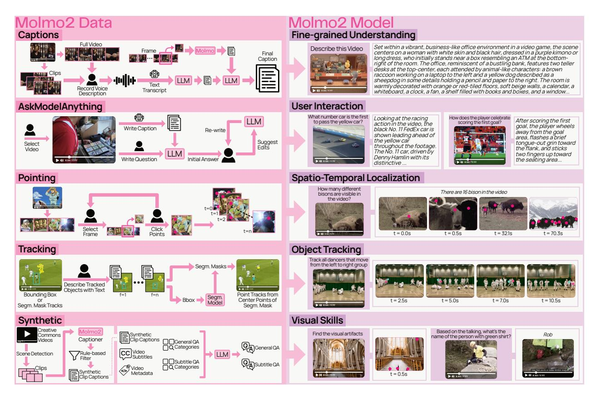
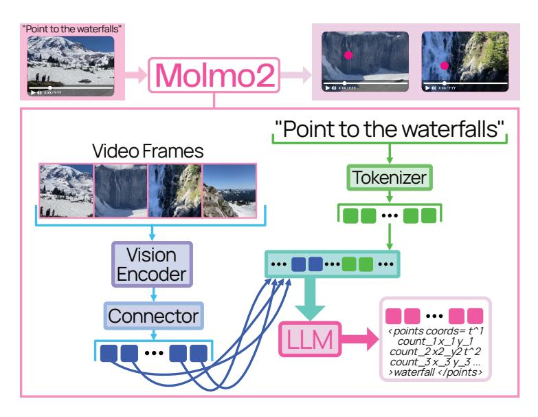

# Open Weights and Data for Vision-Language Models with Video Understanding and Grounding

Christopher Clark Jieyu Zhang Zixian Ma $^{1,2*}$  Jae Sung Park Mohammadreza Salehi Rohun Tripathi Sangho Lee

Zhongzheng  $Ren^{1,2}$  Chris Dongjoo  $Kim^1$  Yinuo Yang $^2$  Vincent Shao $^2$  Yue Yang $^1$  Weikai Huang $^2$  Ziqi Gao $^1$  Taira Anderson $^1$  Jianrui Zhang $^1$  Jitesh Jain $^1$  George Stoica $^1$  Winson Han $^1$ 

Ali Farhadi1,2 Ranjay KrishnaV1,2

Models: Molmo2-4B Molmo2-8B Molmo2-0-7B

**Data:** Molmo2 Data

Code: https://github.com/allenai/molmo2

Demo: playground.allenai.org
Contact: molmo@allenai.org

Abstract

Today's strongest video-language models (VLMs) remain proprietary. The strongest open-weight models either rely on synthetic data from proprietary VLMs, effectively distilling from them, or do not disclose their training data or recipe. As a result, the open-source community lacks the foundations needed to improve on the state-of-the-art video (and image) language models. Crucially, many downstream applications require more than just high-level video understanding; they require grounding—either by pointing or by tracking in pixels. Even proprietary models lack this capability. We present Molmo2, a new family of VLMs that are state-of-the-art among open-source models and demonstrate exceptional new capabilities in point-driven grounding in single image, multi-image, and video tasks. Our key contribution is a collection of 7 new video datasets and 2 multi-image datasets, including a dataset of highly detailed video captions for pre-training, a free-form video Q&A dataset for fine-tuning, a new object tracking dataset with complex queries, and an innovative new video pointing dataset, all collected without the use of closed VLMs. We also present a training recipe for this data utilizing an efficient packing and message-tree encoding scheme, and show bi-directional attention on vision tokens and a novel token-weight strategy improves performance. Our best-in-class 8B model outperforms others in the class of open weight and data models on short videos, counting, and captioning, and is competitive on long-videos. On video-grounding Molmo2 significantly outperforms existing open-weight models like Qwen3-VL (35.5 vs 29.6 accuracy on video counting) and surpasses proprietary models like Gemini 3 Pro on some tasks (38.4 vs 20.0 F1 on video pointing and 56.2 vs  $41.1 \mathcal{J}\&\mathcal{F}$  on video tracking).

&lt;sup>1Allen Institute for AI, 2University of Washington

\*denotes equal contribution. ♥ marks core contributors, who were all integral to the project See full author contributions here.

Figure 1 Molmo2 is trained on one of the largest fully open video-centric multimodal corpus to date, including nine new datasets for dense video captioning, long-form and long-video QA, and open-vocabulary pointing and tracking over images, multi-images, and videos. Molmo2 accepts single images, image sets, and videos as input and can produce both free-form language and grounded outputs such as spatio-temporal points, object tracks, and grounded chain-of-thoughts that localize objects and events over time. Across diverse video-language and grounding benchmarks, Molmo2 matches or surpasses prior open models, approaches proprietary systems, and remains fully open.

## 1 Introduction

Visual data (especially videos) is now ubiquitous, streaming continuously from phones, home cameras, social media, autonomous systems, and industrial sensors [34]. Understanding this video is fundamental for applications such as video search, household and industrial robotics, assistive technologies, sports analytics, security and traffic monitoring, and autonomous driving [83, 84, 87]. Yet the strongest video—language models remain proprietary [135, 113, 17, 145], with closed weights, data, and training recipes.

A key missing capability in current video—language models is *grounding*. Grounding would allow models to answer "How many times does the robot grasp the red block?", by emitting *points* for each grasp event in space and time. It would identify "When did the cup fall off the table?" by returning a *track* of the cup so users can precisely locate the event. Although image grounding is now standard [20], video grounding is only supported in some proprietary systems, and even there in a limited form.

We present the Molmo2 (Multimodal Open Language Model), a family of fully open state-of-the-art vision-language models. Molmo2 supports single image, multi-image, as well as video, bridging the aforementioned gap by bringing grounding capabilities to video understanding. To promote open research, we release our training data, model weights, and training code. To ensure our work is transparent and fully open, all our data is constructed without distilling from proprietary models.

A core contribution of this work is a suite of 9 novel datasets targeting crucial skills underrepresented in existing open data for video and multi-image inputs. This includes: (1) two open-vocabulary video pointing and tracking datasets (520k instances), enabling models to pinpoint when and where events or objects occur

in videos; (2) a dense video captioning corpus (104k videos) with captions far longer and more detailed than in any prior work (e.g., GPT-generated video captions in LLaVA-Video [\[184\]](#page-25-0) and ShareGPT4Video [\[19\]](#page-17-1)); (3) two long-form QA datasets (212k instances), including user questions on multi-image/video inputs with rich human-crafted answers (without distilling proprietary models); and (4) two long-video question answering datasets (around 1.3M instances) that tackle videos longer than those in current benchmarks (addressing a known weakness of open models on long-duration content [\[118\]](#page-22-1)); (5) two multi-image datasets to improve multi-image pointing and document understanding.

Our data collection uses multiple innovative pipelines (Figure [1\)](#page-1-0). For dense video captioning, we devised a multi-stage process: human annotators first narrate each video clip in detail via spoken descriptions (allowing much more detail than text typing), which are transcribed and then enriched with frame-level visual details sourced from Molmo [\[29\]](#page-18-2) to ensure no detail is overlooked.

Because existing large-scale datasets for video or multi-image are largely distilled from proprietary models [\[99,](#page-21-3) [93,](#page-21-4) [59,](#page-19-0) [76,](#page-20-0) [19\]](#page-17-1), we develop a human-and-LLM collaboration pipeline to create high-quality, long-form QA data from scratch. To add more data for medium (1-3 minutes) length videos, we introduce a synthetic data generator that uses our own captioning model to summarize and annotate extended videos (segmented into clips) and then formulates questions from those captions and the video's transcript.

Grounding capabilities are vital. We extend the 2D pointing paradigm popularized in image-based VLMs [\[29,](#page-18-2) [60,](#page-19-1) [178\]](#page-25-1) into the temporal domain. Our models can not only point to objects in a frame, but also identify the moment an action happens or continuously track an object across a video. We created dedicated datasets for both video-pointing in space and time (e.g. "click the moment and location where X occurs"), and video-tracking (continuously indicating an object's position whenever it appears).

Existing video grounding datasets tend to be narrow in scope or vocabulary, which is insufficient for training general models that can respond to arbitrary user input [\[3,](#page-17-2) [111\]](#page-22-2). We address this by generating large-scale video grounding data covering diverse actions and objects (including many high-frequency everyday objects and complex referring expressions), and we complement it with data converted from several academic sources (e.g. reference video segmentation benchmarks) to ensure broad coverage. Finally, we construct a multi-image pointing dataset using PixMo-Points [\[29\]](#page-18-2), enabling our model to output points on multiple images.

All Molmo2 variants are trained in a three-stage pipeline: (1) an image-captioning and image-pointing pre-training stage, (2) a joint supervised fine-tuning stage on our integrated multimodal dataset mixture (images, videos, and multi-image inputs), and (3) a short long-context training stage on the same data. We introduce several training innovations that further boost performance: a novel token-weighting scheme during fine-tuning to balance learning from diverse tasks, as well as efficient training techniques like sequence packing and a message-tree schedule that dramatically increase training throughput. We also show that enabling bi-directional attention between visual tokens yields notable gains.

We evaluate Molmo2 across a broad spectrum of established benchmarks, and also propose new evaluation sets for the less-explored capabilities we target (such as dense video captioning and open-vocabulary video pointing). On short-video understanding, Molmo2 achieves results on par with or better than existing models; for example, it outperforms previous open models on benchmarks like MVBench [\[78\]](#page-20-1) and MotionBench [\[54\]](#page-19-2), and even challenges some proprietary models' performance on these tasks. In tasks like visual counting and captioning, Molmo2 (even at 4B scale) is only outperformed by the strongest closed-source systems (e.g. Gemini 3.0 [\[45\]](#page-19-3)), demonstrating the benefits of our fine-grained grounding data. Molmo2 also establishes new state-of-the-art results in video grounding (both tracking and pointing), substantially ahead of prior open models [\[3,](#page-17-2) [111\]](#page-22-2), all while maintaining strong performance on traditional image and multi-image benchmarks [\[59,](#page-19-0) [93\]](#page-21-4). A human preference evaluation ranks Molmo2 as equal or better than existing open-weight models and ahead of a few proprietary models, including GPT-5 [\[114\]](#page-22-3) and Claude Sonnet 4.5 [\[5\]](#page-17-3), showing its general-purpose capabilities.

We release three versions of Molmo2: 4B and 8B models based on the Qwen3 LLMs [\[169\]](#page-24-0), and a 7B model based on the OLMo LLM [\[112\]](#page-22-4), to demonstrate what can be achieved with a fully-open language model. All our code, data, and models will be made open source.

| Dataset Group  | Description                                                                                                                                                                                                                                                                                                                     |      |    | Rate(%) Datasets Examples |
|----------------|---------------------------------------------------------------------------------------------------------------------------------------------------------------------------------------------------------------------------------------------------------------------------------------------------------------------------------|------|----|---------------------------|
|                | Captions/Long QA Captioning and long-form question answering data on images and videos, including Molmo2-Cap, -AskModelAnything, -MultiImageQA and PixMo-Cap, -AskModelAnything and -CapQA.                                                                                                                               | 13.6 | 6  | 1.2m                      |
| Image QA       | Multiple-choice and short answer image QA data, including Molmo2- SynMultiImageQA, open-source image datasets [48, 130, 101, 102, 103, 105, 65, 125, 94, 95, 14, 2, 61, 62, 107] following Molmo with CoSyn [172] instead of PixMo-Docs, and open-source multi-image datasets [132, 89, 58].                        | 22.7 | 32 | 2.4m                      |
| Video QA       | Multiple-choice and short answer video QA, including Molmo2-CapQA, -SubtitleQA, and various open video datasets [80, 74, 154, 184, 115, 160, 57, 167, 163, 173, 155, 156, 138, 38, 86, 54, 46, 109, 64, 42, 134, 188, 15, 49, 26, 141, 75, 77, 161, 123, 159]. Downsampled since video benchmarks converge quickly. | 18.2 | 32 | 2.4m                      |
| Image Pointing | PixMo-Points and PixMo-Count, CoSyn-Point [172], and Molmo2- MultiImagePoint. PixMo-Points is weighted to emphasize high counts. Downsampled since it was seen during pre-training.                                                                                                                                       | 9.1  | 4  | 1.1m                      |
| Video Pointing | Molmo2-VideoPoint and AcademicVideoPoint. Upsampled since this task is slow to converge.                                                                                                                                                                                                                                     | 13.6 | 7  | 0.37m                     |
| Video Tracking | Molmo2-VideoTrack and AcademicVideoTrack. Re-weighted to em phasize tail concepts.                                                                                                                                                                                                                                           | 13.6 | 22 | 0.80m                     |
| NLP            | Text-only SFT data from Tulu [71] to preserve performance on natural language understanding.                                                                                                                                                                                                                                 | 9.1  | 1  | 0.99m                     |

**Table 1** We create nine new datasets (in pink) to train Molmo2. We also include a suite of image and language data from academic datasets into our training mix. We categorize all datasets into categories and show each categories' sampling rate, dataset count, and total training examples after filtering and formatting the data into message trees. See Section [2](#page-2-0) and the appendix for details.

## **2 Data**

We create five human-annotated datasets and four synthetic datasets, and additionally curate two datasets by repurposing existing open-source data. We summarize their design and collection pipelines below; see the appendix for details.

**Molmo2-Cap (human).** We collect 104k video-level and 431k clip-level dense captions from annotators, targeting both high detail and broad diversity. Videos are drawn from multiple large-scale sources [\[180,](#page-25-5) [147,](#page-23-6) [153,](#page-24-9) [184\]](#page-25-0), starting from a pool of over 10M clips, then filtered for informativeness and sampled for diversity to obtain a balanced subset.

Obtaining dense video captions is challenging because annotators must describe dynamic events alongside finegrained visual details [\[69\]](#page-20-11). We use a two-stage pipeline: annotators first describe short clips, then summarize the entire video. As in PixMo-Cap [\[29\]](#page-18-2), annotators speak their descriptions, which are transcribed with Whisper-1 [\[120\]](#page-22-10) and then rewritten by a text-only LLM for coherence. We condition annotators to describe dynamic visual details (e.g. object or event changes over time) by prompting them with a set of predefined questions. To add any missing low-level details, we use Molmo to generate frame-level captions and an LLM to merge the clip and frame captions into a single long caption. This produces the densest video caption dataset to date, averaging 924 words per video, compared to 75 words in Video Localized Narratives [\[141\]](#page-23-5), 89 and 100 in RCap and RDCap [\[22\]](#page-18-4), 280 in ShareGPT4-Video [\[19\]](#page-17-1), and 547 in LLaVA-Video-178K [\[184\]](#page-25-0).

**Molmo2-AskModelAnything (human).** We collect 140k human-authored video QA pairs. Using video captions, we cluster videos into 31 categories and sample them evenly to promote data diversity. Annotators then write specific, fine-grained questions (e.g. about text, actions, or temporal relations), while we discourage counting questions (handled separately by pointing data), overly generic prompts, or questions requiring expert knowledge. For each question, we first obtain an initial answer from an LLM (Claude Sonnet 4.5) conditioned on a caption generated by an early Molmo2 captioner. Annotators either accept the answer or

iteratively refine it through dialogue with the LLM. Finally, we post-process all QA pairs with an LLM filter to remove non-English, mismatched, or counting questions. We remove counting questions since the model should point for those questions instead of producing a pure text response.

**Molmo2-CapQA and -SubtitleQA (synthetic).** To build large-scale synthetic video QA, we use a video captioner trained on Molmo2-Cap to caption videos from YT-Temporal [\[180\]](#page-25-5) and YouTube keyword search. We segment each video into multiple scenes and caption each scene instead of the entire video to encourage detailed descriptions. An LLM then uses these captions and video metadata to generate 1M QA pairs (200k videos, 5 QA per video). For SubtitleQA, we transcribe the video audio with Whisper-1 and additionally prompt the LLM with the transcript to create 300k QA pairs (100k videos, 3 QA per video) that require reasoning over both visual content and language.

**Molmo2-VideoPoint (human).** To improve Molmo2's counting and spatial-temporal localization, we collect over 650k video pointing queries on 280k videos, with an average of 6 points per video, targeting eight diverse categories: objects, animals, actions/events, referring expressions, indirect references, spatial references, comparative references, and visual artifacts/anomalies (for generative videos only). We generate queries by using LLM on video captions from an early version of Molmo2. Annotators first identify the frame where an object appears and then click on its exact location in the frame. Frames were obtained at 2 fps.

**Molmo2-VideoTrack (human).** We collect point-based object-tracking data covering 3.6k video clips and 15k complex natural language queries, with an average of 2.28 objects per query. Our dataset collection follows Ref-VOS [\[12\]](#page-17-7) by asking users to re-label existing tracking annotations. For each video, we display either segmentation or bounding box object tracks, and ask annotators to craft non-trivial text queries that apply to a subset of objects. The queries are then validated in a separate validation round. We source videos and tracks from diverse open-source segmentation tracks [\[12,](#page-17-7) [33,](#page-18-5) [108,](#page-21-14) [122\]](#page-22-11) and bounding-box tracks [\[133,](#page-23-7) [183,](#page-25-6) [126,](#page-22-12) [144,](#page-23-8) [44,](#page-19-11) [30,](#page-18-6) [186,](#page-25-7) [37,](#page-18-7) [140,](#page-23-9) [174\]](#page-25-8).

**AcademicVideoPoint and AcademicVideoTrack (curated).** For pointing, we convert existing object tracking annotations from six datasets [\[6,](#page-17-8) [143,](#page-23-10) [117,](#page-22-13) [12,](#page-17-7) [66,](#page-20-12) [31\]](#page-18-8) into 49k pointing and counting QAs. We first obtain the timestamp of the first frame in which an object appears and then randomly sample a point in the object's mask with a Gaussian distribution around the mask center. For tracking, we repurpose 7 existing Ref-VOS datasets [\[66,](#page-20-12) [127,](#page-22-14) [31,](#page-18-8) [6,](#page-17-8) [143,](#page-23-10) [166,](#page-24-10) [7\]](#page-17-9) to obtain point tracking supervision data. In addition, we process 11 bounding-box based tracking datasets [\[182,](#page-25-9) [55,](#page-19-12) [116,](#page-22-15) [110,](#page-22-16) [53,](#page-19-13) [39,](#page-19-14) [181,](#page-25-10) [72,](#page-20-13) [151,](#page-24-11) [152,](#page-24-12) [189\]](#page-25-11) by using SAM-2 to generate segmentation masks and corresponding point tasks.

**Molmo2-MultiImageQA (human).** We collect QA data on semantically related image sets to support real-world multi-image queries. We form image sets by grouping images whose captions (generated by a PixMo-Cap–trained model) have high sentence-level similarity; each set contains 2–5 images (2.73 on average). Human annotators then write questions over each set, and answers are refined through the same human–LLM loop as above. In total, we construct 45k image sets from 96k unique images and 72k QA pairs.

**Molmo2-MultiImagePoint and -SynMultiImageQA (synthetic).** To improve multi-image grounding, we construct a dataset of over 470k pointing and counting examples by applying soft clustering over images in PixMo-Points. Image sets are formed using a combination of single-token and sentence-level label embedding similarities, producing sets of 2–5 semantically related images (mean set size: 3.24). For each image set, we first normalize all human-provided labels via lowercasing, punctuation, and whitespace normalization, and synonym consolidation. We then use a large language model to resolve these normalized labels into a single canonical description that is semantically consistent across the set. This canonical label defines the shared entity or concept to be pointed to and counted across all images in the set. During training, we stochastically sample from the original (pre-canonicalized) human annotations rather than always using the canonical label, thereby preserving lexical diversity and improving robustness to annotation variability.

For Molmo2-SynMultiImageQA, we adapt CoSyn [\[172\]](#page-25-2) to create 188k synthetic multi-image examples with text-rich images such as charts, tables, and documents.

Figure 2 Molmo2 follows the standard design of connecting a vision encoder and a language model to process video inputs.

Figure 3 Attention mask for a packed sequence with two examples. The first contains two QA pairs for one image. Frame tokens (dark pink) have forward attention, while masking blocks cross-attention between different examples (lower-left empty block) and between distinct QA pairs within the same example (upper empty block).

