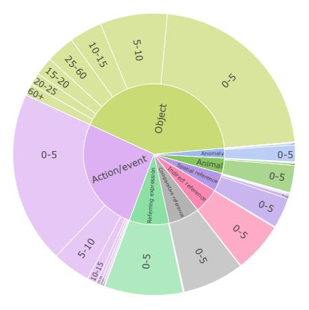
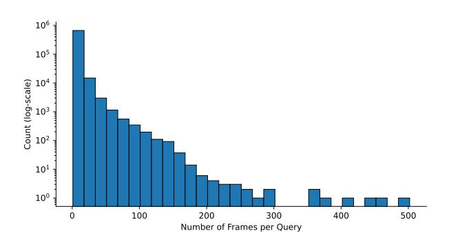
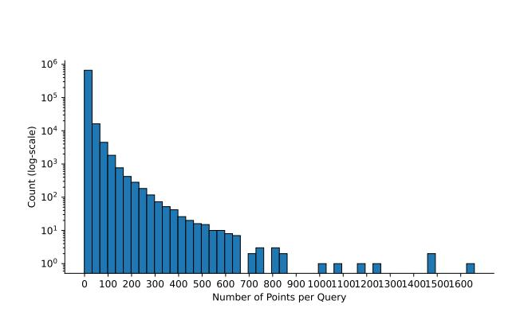
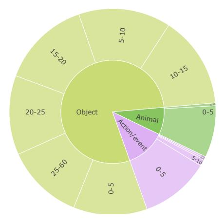
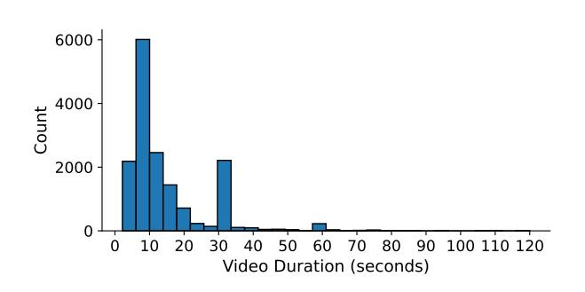
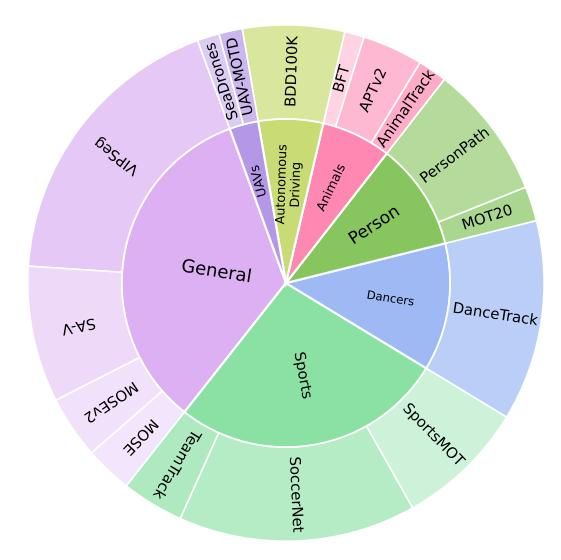
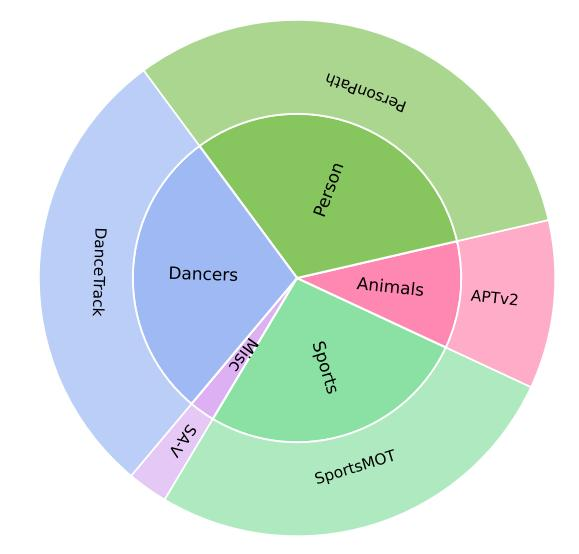

# **E Test time scaling with 128-frame model**

In this section, we consider whether it is possible to scale the number of frames past 128 during inference without long-context training. We also test an approach using SlowFast [\[164\]](#page-24-18) to provide the model with a mix of high and low-resolution frames during inference, or during both training and inference.

Figure 7 Long video benchmark results with different max frames, the average of our six long video benchmarks.

| Model                                             | VTok  | ${\bf Video\text{-}MME}$ | ${\bf Video\text{-}MME\text{-}Sub}$ | ${\bf Long Video Bench}$ | MLVU | LVBench | ${\bf Video Eval Pro}$ | Short QA avg | Long QA avg |
|---------------------------------------------------|-------|--------------------------|-------------------------------------|--------------------------|------|---------|------------------------|--------------|-------------|
| 128 frames                                        | 10.6k | 68.8                     | 74.3                                | 65.9                     | 74.5 | 49.6    | 54.3                   | 69.8         | 64.6        |
| pool4, 216 frames                                 | 11k   | 68.9                     | 75.0                                | 64.3                     | 75.7 | 48.9    | 54.9                   | 68.8         | 64.6        |
| pool5, 332 frames                                 | 10.6k | 69.1                     | 74.2                                | 64.2                     | 76.5 | 50.6    | 56.9                   | 68.4         | 65.2        |
| 128  frames + SF-periodic                         | 10.7k | 68.1                     | 74.5                                | 64.2                     | 74.5 | 48.3    | 53.5                   | 69.6         | 63.9        |
| 128  frames + SF-diff                             | 10.7k | 68.4                     | 74.1                                | 64.7                     | 75.7 | 48.7    | 54.8                   | 69.6         | 64.4        |
| 128  frames + SF-query                            | 10.7k | 68.9                     | 73.9                                | 66.6                     | 76.2 | 51.5    | 57.2                   | 69.6         | 65.7        |
| $128~\mathrm{frames} + \mathrm{SF}\text{-tr-}0.1$ | 10.7k | 69.1                     | 74.3                                | 65.4                     | 75.0 | 48.6    | 54.3                   | 69.8         | 64.4        |
| 128  frames + SF-tr-0.1 + SF-query                | 10.7k | 68.9                     | 74.3                                | 65.5                     | 75.4 | 51.5    | 57.1                   | 69.8         | 65.5        |
| 224 frames                                        | 18.6k | 69.2                     | 74.6                                | 66.1                     | 76.4 | 50.7    | 56.7                   | 69.7         | 65.6        |

Table 20 Molmo2-8B with test time scaling / SlowFast (SF) encoding SF-query boosts long video understanding and matches using 224 frames while using  $\sim 43\%$  fewer visual tokens. Training without SF and then using SF-query marginally beats training with SF-tr-0.1 on long video understanding tasks. All SlowFast models use a max of 368 frames. VTok denotes max vision tokens. SF-tr-0.1 denotes using SlowFast 10% of the time in training.

Increasing max frames. At test time, we scale the maximum number of frames for better long video understanding. We evaluate Molmo2-8B after the SFT stage, but before long-context training, with 160, 192, 224, 256, 320, and 512 max frames and report the average on the val sets of our six long video understanding benchmarks in Figure 7. Molmo2 has the best performance with 224 frames for long video benchmarks. For short video understanding benchmarks, the average is 69.8 for 128 frames and 69.7 for all other settings as shown in Table 20.

Keeping Vision tokens fixed. However, increasing the maximum number of frames also increases the number of vision tokens fed into the model, which raises compute cost and may not be feasible on GPUs with limited memory. With the default setting of max 128 frames, the maximum number of vision tokens is  $83*128 \sim 10.6k$ . We therefore evaluate alternative test-time strategies that keep the number of max vision tokens close to 10.6k. Specifically, we evaluate different pooling strategies in the vision-language connector -  $4 \times 4$  pooling with 216 frames and  $5 \times 5$  pooling with 332 frames. The  $5 \times 5$  pooling setting improves long video understanding by accessing more frames; however, both settings regress on short video understanding (Table 20).

**SlowFast encoding.** Since we find that our model can generalize to different pooling sizes at test time, we further explore a SlowFast video strategy [164]. We build on the interleaved SlowFast variant used in [165, 170, 129], which dynamically allocates computational resources across frames by varying their spatial pooling in the Molmo2 connector, with each frame represented exactly once – either in the slow or the fast pathway. Frames are categorized as slow or fast based on a periodicity parameter p: every p-th frame is designated as a slow frame, while the remaining frames are fast frames. We refer to this approach as Slowfast-periodic. Note that p=1 reduces to the default setting. Slow frames use the default pooling size

of 3 × 3, whereas fast frames use 9 × 9 pooling. We use four different periodicities p ∈ {1, 2, 3, 4} with corresponding max frames M ∈ {128, 224, 300, 368}. The max frame M for each periodicity is chosen such that the maximum number of vision tokens input to the LLM is approximately 10.6k. 10.6k is the maximum number of vision tokens used in the default setup of Molmo2. When processing a video with SlowFast encoding, after we sample Ft frames, p is selected to maximize the tokens in the slow pathway. For example, when Ft ≤ 128, we use p = 1 and all the frames are in the slow pathway, or when 128 < Ft ≤ 224, we use p = 2 and every other frame is in the slow pathway. In practice, that leads to stepwise changes in selected p as the number of frames ranges from 1 to 368.

We explore two strategies to score the frames' relevance for inclusion in the slow pathway. First, we embed both the query and all the frames using SigLIP 2 [\[139\]](#page-23-17) and calculate per frame cosine similarity scores. Second, we calculate the average of the absolute similarity difference of the embedded frames with their neighboring frames. In either strategy, we use the per-frame score to select the relevant frames for the slow pathway. Our formulation when selecting Fs slow pathway frames from Ft sampled frames is to include both frames that globally have the highest scores and frames that have high scores in their local neighborhoods. To select locally high scoring frames, we first select Fs/2 frames by choosing the single highest scoring frame from temporally ordered groups of size Ft ÷ Fs/2. To select globally relevant frames, we select the remaining Fs/2 frames that have the highest scores from all the remaining frames. Additionally, we don't use score based selection and use Slowfast-periodic when the frames per second Fr is high. This follows the intuition that frame selection is useful when selecting amongst sparser frames for long videos with multiple scenes, but not for shorter videos that get densely sampled and tend to have only one scene. In practice, we fall back to Slowfast-periodic when Fr ≥ 2.

With Slowfast-periodic, the model regresses on the long video understanding, contrary to the finding in [\[164\]](#page-24-18). Using the frame difference improves over using periodic sampling, but still lags behind the default setting. However, using the query to select frames for the slow pathway achieves the best performance. It provides a boost to long video understanding with minor regression in short video understanding. It closes the gap to the optimal setting of using 224 frames while having ∼ 43% fewer visual tokens (Table [20\)](#page-38-1).

**Training with SlowFast.** Due to the improvement on long video understanding tasks using SlowFast encoding in the training-free regime, we explore training with SlowFast. We report results for training in a combined single stage starting from the image captioner. We keep the max frames the same 128 and sample using the SlowFast setup with a probability Psf while randomly sampling different p ∈ 2, 4, 8. We use the default sampling with a probability if 1 − Psf and use Psf = 0.1. When training with a SlowFast setup, we randomize the slow frames. Concretely, to select Fs frames from Ft sampled frames, 1 frame in ordered groups of size Ft ÷ Fs is selected randomly. Even though the max frames is not increased, the goal is to familiarize the video model with the SlowFast encoding similar to score-based Slow frame selection, but without increasing the training cost by requiring the use of more frames. At test time, we evaluate with and without the query based SlowFast setup described above. Surprisingly, training without SF and then using the query to select Slow frames beats training with SF 10% of the time as shown in Table [20.](#page-38-1) This suggests Molmo2 can frame using 9 × 9 pooling even though such frames were not seen during training.

## **F Dataset details**

In this section, we provide additional details about our data collection methodology.

## **F.1 Dataset statistics**

**Pointing.** We report the statistics on the Molmo2-VideoPoint training and validation sets. Overall, the Molmo2-VideoPoint dataset contains diverse pointing queries across seven categories (Figure [8\)](#page-40-0). There are more queries in Action/Event, Object, and Referring expression, as we expect these to be harder for the model to learn. We also see that the distribution is skewed towards low-count examples with 0 to 5 counts (Figure [8](#page-40-0) and [10\)](#page-40-1). We mitigate this bias by upsampling medium- and high-count examples during training, and plan to collect more high-count examples in the future. Similarly, the distribution of frames annotated per query is also heavily skewed to the left (Figure [9\)](#page-40-0).

**Figure 8** The distribution of categories and counts across pointing queries in **Molmo2-VideoPoint**.

**Figure 9** The distribution of annotated frame count per query in **Molmo2-VideoPoint**.

Figure 10 The distribution of annotated point count per query in Molmo2-VideoPoint.

 $\label{lem:figure11} \textbf{Figure 11} \ \ \text{The distribution of categories and counts across } \\ \text{queries in the } \ \ \ \ \ \ \ \ \ \ \ \ \ \ \ \ \ \$ 

Figure 12 The distribution of categories and counts across queries in the Molmo2-VideoPoint evaluation.

For the validation sets used in Molmo2-VideoCount and Molmo2-VideoPoint evaluations, we carefully build them by (1) collecting double annotations on some queries and selecting high-confidence examples where two different annotators provide the same answer; and (2) sampling queries across diverse categories and counts (Figure 11 and 12). For video counting, we mostly sample queries from the object category, as there are significantly more high-count examples in this category than in others (Figure 11). For video pointing evaluation, we intentionally pick queries in the more difficult categories – referring expression and indirect reference (Figure 12) – orthogonal to the ones in the counting evaluation, so that we have a comprehensive evaluation of our model's counting and pointing capabilities.

**Tracking.** We report statistics on the videos and text queries in Molmo2-VideoTrack and the Molmo2-Track benchmark. The two datasets have a total of 8k video clips, with 6.6k for training and 1.3k for evaluation. Both datasets provide segmentation masks, text queries, and metadata for each video. On average, there are 6.08 annotated objects per video, and the videos are up to 2 minutes long, with most being around 10-30 seconds. The distribution of video durations is shown in Figure 13.

Our dataset contains a total of 29k diverse text queries covering a wide variety of categories, bringing an average of 1.33 text queries per video. The distribution of categories is detailed in Figure 16 and Figure 17. Multi-object tracking is a primary focus in the tracking capabilities of Molmo2, so we strived to find text queries that describe many objects within a video. The dataset has an average of 3.31 objects described per text query, with many queries describing far more than that. The distribution is shown in Figure 14. Each text query is on average 8.21 words long, but there is a wide range. The exact distribution across all text queries is shown in Figure 15.

104 (a) 103 (b) 102 (c) 103 (c) 103 (c) 103 (c) 103 (c) 103 (c) 103 (c) 103 (c) 103 (c) 103 (c) 103 (c) 103 (c) 103 (c) 103 (c) 103 (c) 103 (c) 103 (c) 103 (c) 103 (c) 103 (c) 103 (c) 103 (c) 103 (c) 103 (c) 103 (c) 103 (c) 103 (c) 103 (c) 103 (c) 103 (c) 103 (c) 103 (c) 103 (c) 103 (c) 103 (c) 103 (c) 103 (c) 103 (c) 103 (c) 103 (c) 103 (c) 103 (c) 103 (c) 103 (c) 103 (c) 103 (c) 103 (c) 103 (c) 103 (c) 103 (c) 103 (c) 103 (c) 103 (c) 103 (c) 103 (c) 103 (c) 103 (c) 103 (c) 103 (c) 103 (c) 103 (c) 103 (c) 103 (c) 103 (c) 103 (c) 103 (c) 103 (c) 103 (c) 103 (c) 103 (c) 103 (c) 103 (c) 103 (c) 103 (c) 103 (c) 103 (c) 103 (c) 103 (c) 103 (c) 103 (c) 103 (c) 103 (c) 103 (c) 103 (c) 103 (c) 103 (c) 103 (c) 103 (c) 103 (c) 103 (c) 103 (c) 103 (c) 103 (c) 103 (c) 103 (c) 103 (c) 103 (c) 103 (c) 103 (c) 103 (c) 103 (c) 103 (c) 103 (c) 103 (c) 103 (c) 103 (c) 103 (c) 103 (c) 103 (c) 103 (c) 103 (c) 103 (c) 103 (c) 103 (c) 103 (c) 103 (c) 103 (c) 103 (c) 103 (c) 103 (c) 103 (c) 103 (c) 103 (c) 103 (c) 103 (c) 103 (c) 103 (c) 103 (c) 103 (c) 103 (c) 103 (c) 103 (c) 103 (c) 103 (c) 103 (c) 103 (c) 103 (c) 103 (c) 103 (c) 103 (c) 103 (c) 103 (c) 103 (c) 103 (c) 103 (c) 103 (c) 103 (c) 103 (c) 103 (c) 103 (c) 103 (c) 103 (c) 103 (c) 103 (c) 103 (c) 103 (c) 103 (c) 103 (c) 103 (c) 103 (c) 103 (c) 103 (c) 103 (c) 103 (c) 103 (c) 103 (c) 103 (c) 103 (c) 103 (c) 103 (c) 103 (c) 103 (c) 103 (c) 103 (c) 103 (c) 103 (c) 103 (c) 103 (c) 103 (c) 103 (c) 103 (c) 103 (c) 103 (c) 103 (c) 103 (c) 103 (c) 103 (c) 103 (c) 103 (c) 103 (c) 103 (c) 103 (c) 103 (c) 103 (c) 103 (c) 103 (c) 103 (c) 103 (c) 103 (c) 103 (c) 103 (c) 103 (c) 103

Figure 13 Distribution of video clip duration in Molmo2-VideoTrack and Molmo2-Track.

**Figure 14** Distribution of objects described by text queries in **Molmo2-VideoTrack** and **Molmo2-Track**.

Figure 15 Distribution of text query lengths in Molmo2-VideoTrack and Molmo2-Track.

#### F.2 Data collection

Here, we detail how we collect videos and synthesize annotations for most of Molmo2 video datasets.

**Video collection for Molmo2-Cap.** We first source videos less than 3 minutes from multiple large-scale datasets [180, 147, 153, 184] and YouTube videos searched with keywords used in MetaCLIP [162] to form a

pool of over 10M videos.

Then, we perform one step of filtering based on the informativeness of the video: we first discard the audio track and uniformly sample the video at 1 fps; Then the sampled frames are encoded using H.264; The total size of the resulting encoded stream (in bits) is divided by the product of the video duration and spatial resolution (duration × W × H) to obtain a normalized video informativeness score. After collecting scores for all videos in the pool, we discard those whose score falls below (mean - 1 standard deviation), effectively removing videos with unusually low visual or temporal diversity.

After this filtering, we conduct a diversity-based sampling to obtain a final set of videos for human annotation: for each remaining video, we uniformly sample 5 frames and apply SAM 2 [\[122\]](#page-22-11) to segment each frame, computing the average number of segments as a proxy for visual complexity. We further use Molmo to caption each sampled frame and follow MetaCLIP's processing pipeline to extract a set of keywords that characterize its semantic content. To select a diverse subset, we perform a greedy sampling procedure that aims to maximize the entropy of both the segment-count distribution and the keyword distribution. At each step, we score all candidate videos using a two-stage ranking: (1) we compute a "what-if" entropy gain for the keyword distribution if the candidate were selected, and rank candidates accordingly; (2) we compute a density-based score that favors videos contributing to underrepresented segment-count regions. The final score is obtained by summing the two ranks, and we select the top-ranked candidate. For efficiency, we approximate this process by scanning the pool in chunks of 1,000 candidates at a time, rather than evaluating the entire pool at each iteration. This procedure yields a video subset that is both semantically diverse and visually varied, providing a strong foundation for high-quality human annotations. Finally, we set the sampling ratio to be 1% and obtained around 100k videos.

**Videoandsyntheticannotationcollection forMolmo2-CapQA,-SubtitleQA,-VideoPoint, and-AskModelAnything.** We first source 500k videos with Creative Commons license from YT-Temporal [\[180\]](#page-25-5) and YouTube keyword search. Then we use a video captioner trained on Molmo2-Cap to caption these videos. In particular, we segment each video into multiple scenes and caption each scene instead of the entire video to encourage detailed descriptions. Since model-generated captions can sometimes be low-quality, we apply a heuristic rule-based filter to remove captions with repetition patterns. The final set of videos and synthetic captions is used to curate Molmo2-CapQA, -SubtitleQA, and -VideoPoint datasets.

For Molmo2-CapQA and Molmo2-SubtitleQA, we prompt an LLM to generate both the question and the answer. For Molmo2-VideoPoint, we prompt an LLM to generate the queries and solicit human answers. For Molmo2-AskModelAnything, we elicit questions from human annotators and generate the corresponding answers using an LLM with human feedback.

## **F.3 Data annoation**

**Molmo2-Cap.** To obtain clips for the first-stage captioning, we develop an algorithm to split a video into clips of variable lengths between 10 and 30 seconds based on their information density so that a more informative clip has a shorter duration. This algorithm minimizes the highest information density of a video clip across all clips. Overall, videos are split into 4-5 clips on average. We then deploy the video-description task to online crowdworkers (see Figure [21](#page-49-0) for the task interface). For each full video, workers are first shown a sequence of shorter clips split by our algorithm from the original video with audio muted. At the top of the interface, we provide instructions to guide their descriptions. For each clip, workers verbally describe what is happening on the screen, and their speech is automatically converted to text via real-time transcription. They then edit the transcript to correct recognition errors before submitting it. After completing all clips, workers are asked to provide a comprehensive description of the full video (see Figure [22\)](#page-49-1).

**Molmo2-VideoPoint.** For each video, we design several visual questions that require workers to answer using evidence from a single or several frames (see Figure [23](#page-50-0) for the task interface). Crowdworkers first watch the full video clip without audio. For each question, they capture screenshots from the video at the moments when the relevant content is visible. On the screenshot, workers annotate points on object instances that satisfy the question, and we record both the video timestamp and the (x, y) coordinates of all points. Then they answer the corresponding questions in a required format. Workers could mark a question as Unanswerable (e.g., if the content is missing or ambiguous) or flag that they are unsure about their answer. This process is repeated

for all questions associated with the video.

To collect annotations for anomaly identification queries in Molmo2-VideoPoint, we first need to construct a dataset of generative videos exhibiting visual defects. We begin by leveraging two publicly available datasets: the ViBe dataset [\[124\]](#page-22-20) and the Broken Video Detection Dataset [\[85\]](#page-21-25). The Broken Video Detection Dataset provides high-quality, frame-level annotations of defective regions, allowing us to directly incorporate its pixel-accurate defect masks. From the ViBe dataset, we selectively retain only videos labeled as Vanishing Subject, Physical Incongruity, or Temporal Dysmorphia. These categories correspond to defects intrinsic to the generated video itself rather than issues arising from ill-posed or misleading prompts, ensuring our dataset focuses on model-induced visual failures. To complement these sources with realistic user prompts, we sample 2,000 human-written prompts from the VidProM dataset [\[148\]](#page-23-19). For each prompt, we generate videos using 10 T2V models and manually filter the outputs to retain only those containing clear and salient defects. This step introduces diversity in both content and failure types and reflects real-world usage patterns of contemporary text-to-video systems. In total, our final training set for generative video anomaly pointing consists of 10k videos, covering a broad range of defective generations produced by around 25 T2V models.

**Molmo2-VideoTrack.** Directly reusing the Molmo2-VideoPoint annotation strategy for tracking is infeasible, as it would require point annotations on every sampled frame. One could use off-the-shelf tracking models, such as Co-Tracker [\[63\]](#page-20-16) or SAM 2 [\[122\]](#page-22-11), with point prompts; however, we found them to yield incomplete or unstable trajectories and are therefore not reliable sources for generating accurate training data for tracking. We thus resort to existing human-annotated tracks and focus on expanding coverage to video domains and object categories underrepresented in standard training datasets.

As our base pool, we use a set of videos in video object segmentation (VOS) datasets: SAM-V [\[122\]](#page-22-11), VIPSeg [\[108\]](#page-21-14), MOSE [\[32\]](#page-18-17), and MOSEv2 [\[33\]](#page-18-5), which are not as densely supported in existing academic video track datasets. We discard videos that are shorter than 3 seconds or that contain fewer than three object tracks. We additionally decontaminate videos in MOSE [\[32\]](#page-18-17) with respect to the MeViS validation set [\[31\]](#page-18-8); we sample 8 frames per video, extract CLIP ViT-L/14 features [\[119\]](#page-22-21), and remove any videos whose maximum pairwise frame similarity exceeds 0.95. We then extract points from segmentation masks by computing an alpha-weighted score that combines centroid distance and distance to mask boundaries, which keeps the points near the center while minimizing flickering.

We further extend our pool with datasets that provide video object tracks in the form of bounding boxes. These datasets span diverse domains and challenging multi-object scenarios with occlusion, including pedestrians, dancers, autonomous vehicles, animals, athletes, and UAV footage. Unlike in segmentation tracks, naively sampling a (center) point from a bounding box does not guarantee that the point lies on the object. Thus, we convert each bounding-box track into a segmentation task to obtain reliable point tracks. We prompt SAM 2 with the first available bounding box for an object to generate a mask tracklet and propagate this segmentation through the rest of the video. We re-prompt SAM 2 with a new box if the predicted mask has low IoU with the ground truth bounding box or if more than 20% of the mask is outside the bounding box. We filter out object tracks whose predicted segmentation masks have an average IoU below a threshold 0.5 across all frames. We then apply the same point-sampling procedure on these generated segmentation masks to obtain point tracks. This process is depicted in the first panel of Figure [18,](#page-46-0) and the annotator interface for this step is shown in Figure [19.](#page-48-0)

Text descriptions for these tracks are acquired with human annotators. The annotation procedure is illustrated in the second panel of Figure [18,](#page-46-0) where human annotators are given a video and its list of object tracks and are asked to select one or more objects to write text queries for. The query should describe the selected objects only. The process is repeated N times per video, while ensuring that the set of selected objects is unique for each query. A separate validation round performs quality checks on the annotated text queries. After this filtering, we retain approximately 70% of the queries on average. This process yields both our training set and the Molmo2-Track benchmark. The annotator interface for validation is shown in Figure [20.](#page-48-0)

Table [21](#page-44-0) summarizes the dataset statistics, and Figures [16](#page-45-2) and [17](#page-45-2) break down the distribution of queries and objects per semantic category for both training data and Molmo2-Track. The segmentation datasets provide general object tracking across diverse categories, while the bounding-box datasets contribute domain-specific tracking scenarios. Together, these complementary data sources yield a large-scale and diverse corpus for object tracking.

| Data Source | Type (Ann.)          | # Clips | # Tracks | # Queries | Avg # Obj/Q |
|-------------|----------------------|---------|----------|-----------|-------------|
| VIPSeg      | General (Segm)       | 675     | 2,150    | 5,466     | 2.65        |
| SAM-V       | General (Segm)       | 1,090   | 2,282    | 2,537     | 1.43        |
| MOSEv2      | General (Segm)       | 463     | 1,107    | 1,168     | 2.08        |
| MOSE        | General (Segm)       | 337     | 863      | 880       | 1.91        |
| TeamTrack   | Sports (Bbox)        | 154     | 899      | 1,158     | 2.13        |
| SoccerNet   | Sports (Bbox)        | 610     | 4109     | 4420      | 6.60        |
| SportsMOT   | Sports (Bbox)        | 396     | 2,150    | 2,420     | 4.48        |
| BDD100K     | Auto. Driving (Bbox) | 450     | 1,810    | 1892      | 3.10        |
| APTv2       | Animals (Bbox)       | 401     | 1,051    | 1,132     | 2.68        |
| AnimalTrack | Animals (Bbox)       | 52      | 413      | 542       | 3.59        |
| BFT         | Animals (Bbox)       | 30      | 214      | 364       | 2.38        |
| UAV-MOTD    | UAV (Bbox)           | 142     | 426      | 437       | 3.43        |
| SeaDrones   | UAV (Bbox)           | 79      | 368      | 408       | 2.25        |
| MOT20       | Person (Bbox)        | 147     | 603      | 643       | 2.68        |
| PersonPath  | Person (Bbox)        | 1,146   | 2,383    | 2,502     | 1.86        |
| DanceTrack  | Dancers (Bbox)       | 704     | 3,199    | 3,735     | 4.07        |
| Total       | All                  | 6,624   | 25,437   | 29,704    | 3.38        |

**(a)** Statistics for the Molmo2-VideoTrack dataset.

| Data Source | Type (Ann.)    | # Clips | # Tracks | # Queries | Avg # Obj/Q |
|-------------|----------------|---------|----------|-----------|-------------|
| APTv2       | Animals (Bbox) | 188     | 331      | 332       | 1.57        |
| PersonPath  | Person (Bbox)  | 487     | 958      | 992       | 1.58        |
| SportsMOT   | Sports (Bbox)  | 323     | 825      | 838       | 4.03        |
| DanceTrack  | Dancers (Bbox) | 360     | 885      | 905       | 3.11        |
| SAM-V       | Misc (Segm)    | 28      | 63       | 80        | 1.21        |
| Total       | All            | 1,386   | 3,062    | 3,147     | 2.66        |

**(b)** Statistics for the Molmo2-Track benchmark

**Table 21 Distribution of tracking dataset for Molmo2-VideoTrack (train) and Molmo2-Track (benchmark)**. We report the number of unique video clips, unique tracks, total queries, and average number of objects per query (Avg # Obj/Q) for each dataset. Type indicates video category; Ann. indicates original tracking annotation format (Segm: segmentation masks, Bbox: bounding boxes).

**Academic-VideoTrack.** We additionally construct an Academic-VideoTrack dataset by aggregating existing academic VOS datasets and bounding-box tracking datasets with referring expressions. Similar to the bounding-box processing for Molmo2-VideoTrack, we convert bounding-box tracks into segmentation mask tracklets by running them through the same pipeline (bounding-box–prompted SAM 2 followed by propagation and IoU-based filtering).

We also accommodate datasets with non-exhaustive labels, where objects mentioned in the text queries lack corresponding tracks despite appearing in the video. Since these missing objects cannot be used directly for general multi-object tracking, we repurpose them for the "single-point" task (Section [3\)](#page-4-0), where the model receives a single point on the target object with the associated query and generates its track. This allows us to augment non-exhaustive tracking datasets to our training data and have the model be exposed to diverse, challenging tracking scenarios.

Table [13](#page-29-0) shows the detailed composition of the Academic-VideoTrack dataset used for training.

**Molmo2-AskModelAnything.** For each video, we first ask crowdworkers to watch the clip without audio and

Figure 16 Molmo2-VideoTrack dataset

Figure 17 Molmo2-Track benchmark

write questions in English that require non-trivial visual reasoning, such as temporal understanding, reading on-screen text details, or identifying fine-grained visual details. We discourage questions that were too vague, too easy or low-level, subjective with no clear ground-truth answer, dependent on unverifiable information such as names or identities, or simple counting questions, which we do not collect for this task. We then feed the full video caption together with the worker's question into a backend language model, which produces an initial answer. Workers are then instructed to slightly edit the question to form a valid query and to carefully edit the model answer to form a final answer. Once they are satisfied, they submit the final Q&A pair, which we used as our annotation (see Figure 24 for the task interface).

