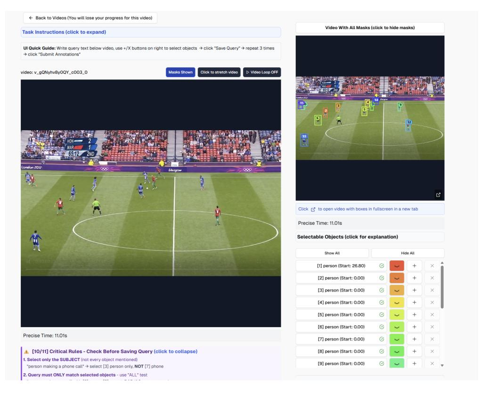
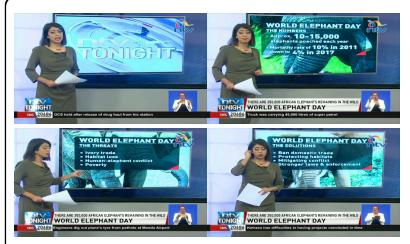
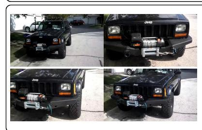
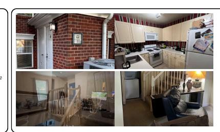
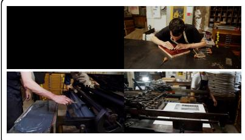
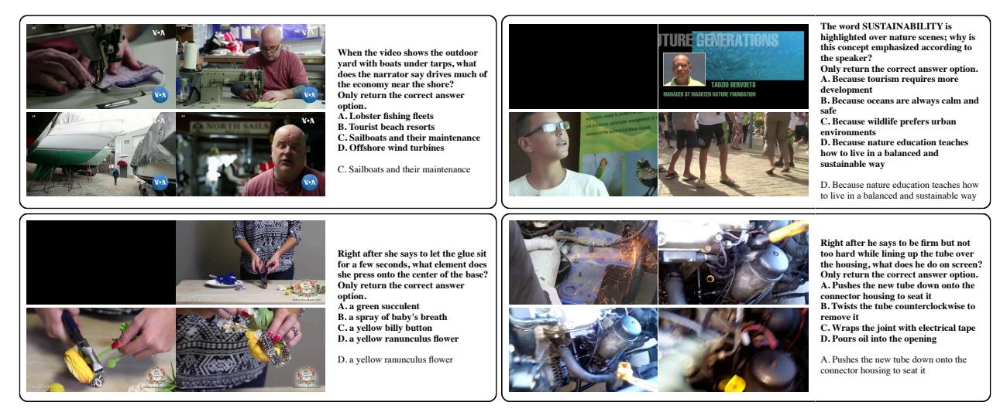
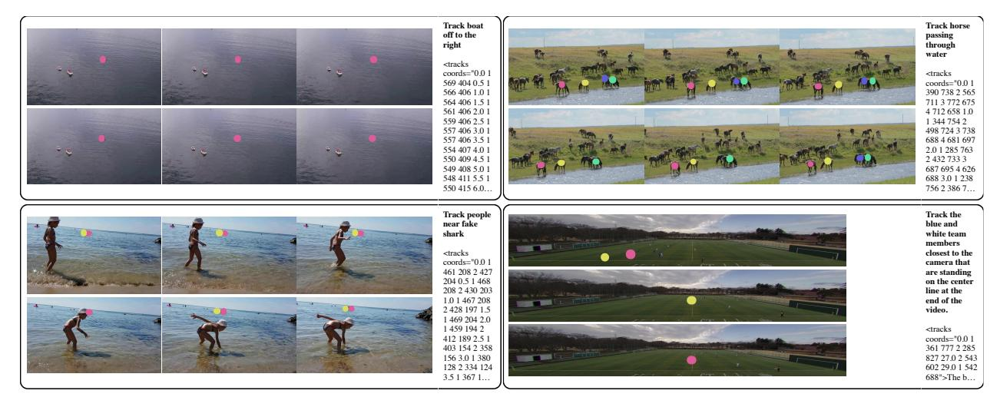
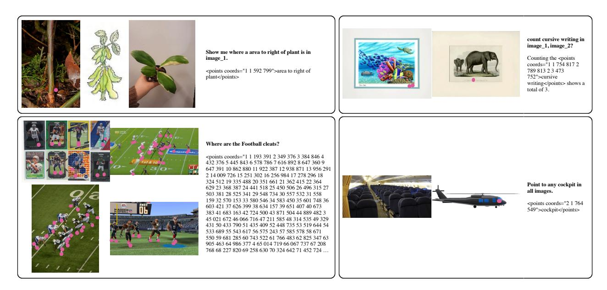
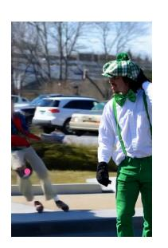

# G Data examples

Here, we present qualitative examples from the Molmo2 datasets. For datasets, we show **randomly** selected examples. Prompts are in bold, and the target output text is below. Videos are shown using a small number of sampled frames. Examples can be found in:

• Molmo2-Cap: Figure 25

• Molmo2-AskModelAnything: Figure 26

• Molmo2-CapQA: Figure 27

• Molmo2-SubtitleQA: Figure 28

• Molmo2-VideoPoint: Figure 29

• Molmo2-VideoTrack: Figure 30

• Molmo2-MultiImageQA: Figure 31

• Molmo2-SynMultiImageQA: Figure 32

• Molmo2-MultiImagePoint: Figure 33

### **H** Limitations

Here we discuss some of the limitations of the Molmo2 models.

Closed image ViT. Even with OLMo 3 as the LLM, our models still utilize a closed-data SigLIP 2 image

**Figure 18** Overview of the annotation pipeline for **Molmo2-VideoTrack** and the **Molmo2-Track** benchmark.

encoder [\[139\]](#page-23-17). We chose to use SigLIP 2 because there are currently no competitive open-data encoders. We call upon the open-source community to explore such alternatives in future work.

**Use of closed LLMs**. We use closed text-only LLMs for data generation, as is common practice [\[89\]](#page-21-12). This reduces the transparency of our data collection pipeline. However, we believe that future open LLMs will become sufficiently proficient to be used in place of closed ones to reproduce this dataset in a fully open manner. It is still important that we avoid using closed VLM s, which would create a circular dependency (training our VLMs would require first building a VLM to generate the training data) and therefore cannot lead to a fully open system in the same way.

**Video grounding repeating points**. For both video tracking and pointing, we sometimes observe that the model produces degenerate outputs, such as a long line of points on one frame or the same point for every frame. This is particularly common when pointing to high-frequency objects or on long videos, so this could likely be mitigated by sourcing more training data to better cover these cases. We also observe the issue is

less common in specialized models, so we hypothesize that there might be some interference between the tasks in the joint training mixture which leads to this behavior.

**Video grounding**. Video grounding is less consistent than image grounding. Our metrics reflect this, with none of the models we tested reaching more than 40% on either our counting or pointing metrics, while image models often achieve 70-90% on image grounding metrics like PointBench.

We believe this is partly due to the inherent complexity of the task. Video grounding typically requires looking at much more visual content, and pointing at more things, than image grounding. Video grounding also requires re-identification, meaning understanding whether two objects in two different frames are the same object or not, which can be challenging. We also think that the lower resolution typically used when processing long videos, and the fact that the vision encoders are often not pre-trained on videos, could be contributing factors.

**Long video grounding**. Grounding has limited support for long (3 minutes+) videos because our grounding training is limited to that length. Handling longer videos is complicated by the fact that we would have to lower the fps when sampling frames to < 2. This would result in our annotations, which are always at 2 fps, not being aligned with the selected frames. A possible solution is to customize how frames are sampled in these cases to ensure that all grounding annotations are selected.

**Point tracking**. Molmo2's generated tracks will sometimes change the location of its output point on the target object. This is likely because our tracking data generation pipeline does not always ensure that the point is consistently placed within the target object for every frame. Future improvements in generating points from bounding box or segment mask data could mitigate this issue.

**Captioning.** We observe that Molmo2 can sometimes generate repeating text when generating a very long video caption using greedy decoding. This is a known issue with LLMs [\[52\]](#page-19-22), including Qwen3[7](#page-47-1) . However, we also think that the limited captioning training data contributed, as well as the high length of the captions (we observe that this typically occurs after generating thousands of tokens). We do not observe this behavior for other tasks.

## **I Qualitative results**

We show qualitative examples from Molmo2-8B. Each figure shows a query, the response from the model, and selected frames from the input video. The returned points are annotated with pink dots. Successful examples are shown in Figure [34](#page-55-0) and Figure [35.](#page-56-0) We also show some failure cases in Figure [36.](#page-57-0)

7 <https://huggingface.co/Qwen/Qwen3-4B> Best Practices

**Figure 19** Crowdworkers annotating object text queries.

**Figure 20** Crowdworkers validating object text queries.

**Figure 21** Video clip captioning interface. Crowdworkers are instructed to annotate captions for video clips in sequence.

**Figure 22** Video captioning interface. Crowdworkers are instructed to annotate captions for complete videos.

**Figure 23** Video pointing interface. Crowdworkers are instructed to annotate points for object instances to answer visual questions.

**Figure 24** AskModelAnything interface. Crowdworkers are instructed to ask model non-trivial visual questions and finalize Q&A.

#### Describe this video in detail

A live newsroom segment unfolds under the banner of a nightly program, opening with a large studio screen that reads "In V Tonight" as a female anchor in an olive green dress steps into frame. She holds a white piece of paper and a pen in her right hand, wears a gold necklace with a red accent at the front, and addresses the camera from the left side of the set. The NTV logo appears in the upper right corner as a teardrop with a colored swirt, and a time display reads 21:30-45 while a black...

#### Caption

Inside a large wide-body airliner, likely a 747, an empty twin-aisle cabin appears bright and clean: a red carpet runs between long rows of seats upholstered in combinations of red with tan, gray, or white, many topped with red headrest covers and matched with red seathels. Overhead beins remain closed beneath a white ceiling with a blue section down the center, and panels and compartments show a mix of white and blue; windows sit behind white shades that let in bright light. As milling flight attendant of Asian descent with long, curled dark hair walks down the aisle toward the ...

#### Generate a long caption about

A black Jeep Cherokee XJ sits in a residential setting, first shown full and head-on, its boxy body gleaming with a slight gloss that reflects trees and sky. The vehicle stands noticeably lifted on large, aggressive-tread black tires mounted to matte black wheels, the front end dominated by a heavy-duty black steel bumper carrying a centrally mounted winch. The "Jeep" name appears in white letters at the very front, and again on the hood, framed by a black grille...

#### Write a long caption

A vibrant, child-friendly teaching graphic fills the screen. Toward the top left sits a xylophone on a black, center-lit surface, its light tan, wood-like body holding light-colored metal bars that form tall-to-short rectangular keys from left to right. A mallet with a blue ball head is visible. Above the instrument, white new component content of the content of the content of the content of the content of the content of the content of the content of the content of the content of the content of the content of the content of the content of the content of the content of the content of the content of the content of the content of the content of the content of the content of the content of the content of the content of the content of the content of the content of the content of the content of the content of the content of the content of the content of the content of the content of the content of the content of the content of the content of the content of the content of the content of the content of the content of the content of the content of the content of the content of the content of the content of the content of the content of the content of the content of the content of the content of the content of the content of the content of the content of the content of the content of the content of the content of the content of the content of the content of the content of the content of the content of the content of the content of the content of the content of the content of the content of the content of the content of the content of the content of the content of the content of the content of the content of the content of the content of the content of the content of the content of the content of the content of the content of the content of the content of the content of the content of the content of the content of the content of the content of the content of the content of the content of the content of the content of the content of the content of the content of the content of the content of the content of the content of t

Figure 25 Random examples from Molmo2-Cap. Prompts are generated from our captioning prompt templates.

What team is written on the shirt this man is wearing?

The man is wearing a shirt with "Golden Stat Varriors" on it.

what number is on the plaque in front of the house

The number on the plaque in front of the house is 2.

What message or emphasis do the gestures convey?

The gestures convey strong emphasis and conviction in what the man is communicating. His hand movements appear deliberate and purposeful, suggesting he is making important points that he wants to drive home to his audience.

The specific nature of his gestures reveals several layers of meaning:

\*\*Authority and clarity\*\* - When he cuts through the air with his hands and raises his palm forward in a stopping or presenting motion, he seems to be punctuating key ideas and ensuring his points land with precision....

What color shorts is the man carrying the bushel of green plants on his shoulders

The man carrying the large bundle of green vegetables on his head is wearing bright yellow shorts as he walks through the waterlogged lane.

Figure 26 Random examples from Molmo2-AskModelAnything.

How many digits are in the case number shown on the report page? Short answer:

11

What human relationship is depicted by the small sculpture above the building's door? Only return the correct answer

option.
A. Two men shaking hands.
B. A woman holding a child.
C. A couple embracing.
D. A soldier carrying a wounded comrade.

B. A woman holding a child.

What specific action does the deer closest to the camera perform?
Only return the correct answer option.
A. It stamps a hoof.
B. It licks its lips.
C. It lies down.
D. It shakes its head

B. It licks its lips.

In the opening advertisement, which way does the scrolling "listen to Dr. Tony Evans" text move?
Only return the correct answer option.
A. downward
B. left
C. upward
D. right

C. upward

Figure 27 Random examples from Molmo2-CapQA.

Figure 28 Random examples from Molmo2-SubtitleQA.

Figure 29 Random examples from Molmo2-VideoPoint. Points are shown in pink, output text follows Molmo2's point formatting.

**Figure 30** Random examples from Molmo2-VideoTrack. Points are shown in different colors that are shared between the same objects, output text follows Molmo2's point formatting.

Figure 31 Random examples from Molmo2-MultiImageQA.

Figure 32 Random examples from Molmo2-SynMultiImageQA.

Figure 33 Random examples from Molmo2-MultiImagePoint. Points are shown in pink, output text follows Molmo2's point formatting.

Figure 34 Qualitative examples of captioning, counting, and tracking from Molmo2-8B

#### Q: Find cars on the highway.

A: <points coords="2 1 222 460 2 365 140 3 545 420 4 615 950 5 805 340 6 895 600 3 7 298 060 8 300 170 9 450 270 10 500 420 11 570 010 12 620 770 4 13 082 344 14 178 128 15 198 190 16 290 300 17 368 534 18 450 514 19 500 764 20 658 724 21 940 744">cars on the highway</points>

- Q: How long should I marinate chickens?
- A: You should marinate the chicken for 45 minutes in the refrigerator.

#### Q: Which team won the game?

A: The winning team was UCLA. You can see their blue-and-white pinstriped uniforms throughout the celebration, and the championship trophy they hoisted displays "UCLA" along with "Baseball National Champions 2013."

Q: Point to visual artifacts. A: <points coords="1.5 1 081 491">

**Figure 35** Qualitative examples of pointing and QA from Molmo2-8B

**Figure 36** Qualitative failure cases from Molmo2-8B. The model identifies false positives in the first two examples and misses several of the penguins in the bottom example.