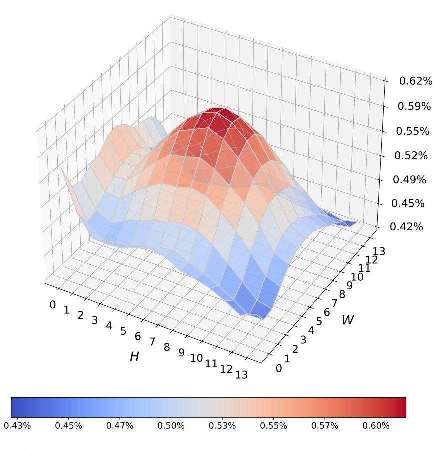

# 10 Spatial Bias Analysis

As shown in Figure 8, the reported statistics are computed from a random subset of 200,000 video samples drawn from the training data. When using codec-guided patch selection alone, the selected visual tokens exhibit a pronounced spatial center bias, with the majority of tokens concentrated in the central regions of the

Figure 8 Spatial Bias Analysis of Selected Visual Patches under a given setting.

frame. This behavior reflects intrinsic statistical properties of video data: due to camera framing and subject placement, salient motion cues and residual signals are typically denser near the image center. While such a bias enables the model to focus on regions with strong motion signals, it also leads to insufficient coverage of peripheral areas, thereby weakening the representation of global scene structure and fine-grained action cues.

With the introduction of chunk-wise patchification, the spatial distribution of selected tokens becomes markedly more uniform, redistributing tokens toward the image periphery and boundary regions and effectively mitigating the center bias induced by codec-driven selection. This effect arises because chunk-wise sampling partitions the video along the temporal dimension and performs global selection over visible patch indices, resulting in a more structurally balanced spatial coverage. Importantly, this rebalancing is achieved without increasing the token budget, but through a principled reallocation of patch selection that enhances spatial diversity and complements motion-centric evidence with global contextual information.

