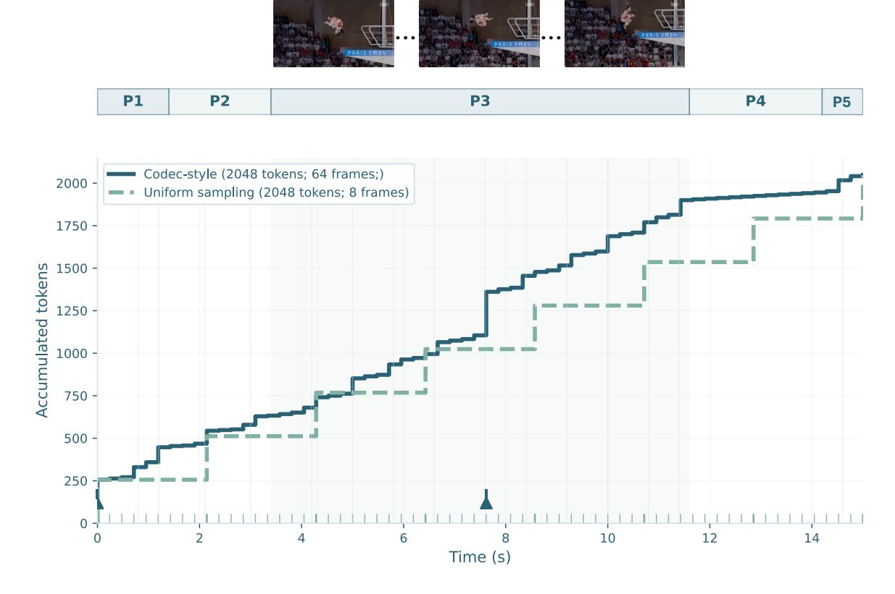
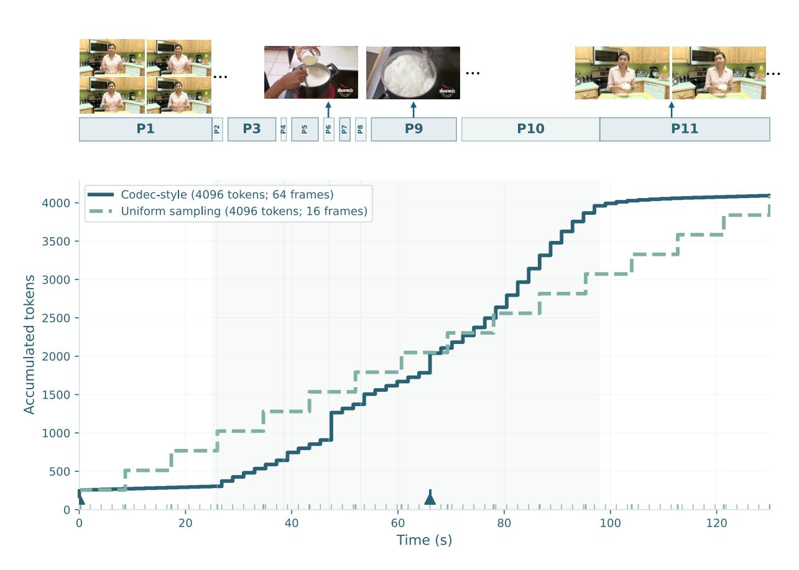
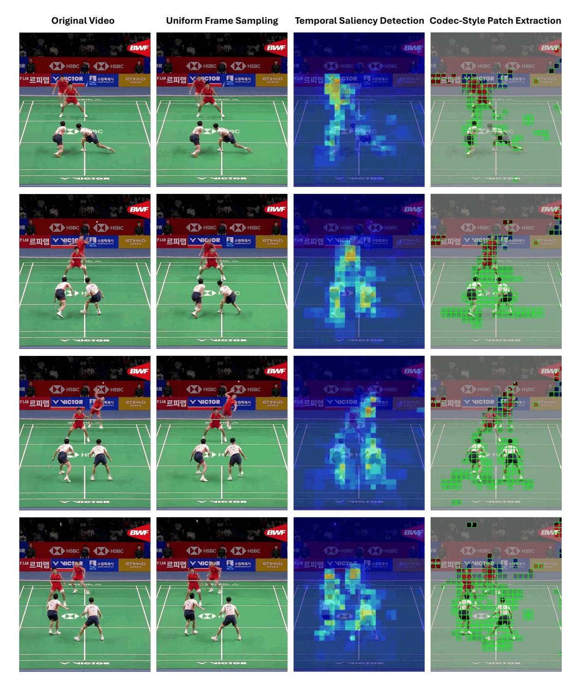

# 11 Token Allocation Case Study

For each case, we plot time (x-axis) versus accumulated visual tokens (y-axis) under a fixed token budget. Stepwise growth indicates when a method allocates a non-trivial number of tokens to a timestamp. Vertical rugs at the bottom show the actual timestamps observed by each strategy, and triangles denote I-frame anchors in the codec-style layout. Case 1 uses a 2048-token budget (uniform 8-frame baseline), and Case 2 uses a 4096-token budget (uniform 16-frame baseline). Detailed experiments and evaluation protocols for these two motion regimes will be reported in LLaVA-OneVision 2.

Figure 9 Case study 1 (Diving): dense evidence for continuous motion. Under a fixed budget of 2048 tokens, codec-style patch extraction distributes tokens over 64 sampled frames to capture dense pose transitions, while uniform sampling allocates the same budget to only 8 frames and may miss brief but critical instants. Phases: P1 0.0–1.4s (takeoff + angular momentum), P2 1.4–3.4s (tuck/pike set; body shape), P3 3.4–11.6s (twist+somersault progression; dense cues), P4 11.6–14.2s (spot water + open/align), P5 14.2–15.0s (entry alignment; line/splash). Diving is high-speed and continuous, so discriminative cues are temporally dense and benefit from dense coverage.

### 11.1 Case 1

We consider videos whose semantics are carried by smooth, persistent motion, where essentially every moment contributes evidence. In this regime, missing intermediate timestamps breaks trajectory continuity and harms recognition. Figure [9](#page-21-0) visualizes this behavior on a Diving example. Under the same fixed token budget of 2048 tokens, uniform 8-frame sampling concentrates all tokens on only eight sparse timestamps (leaving large temporal gaps), whereas codec-style allocation first samples a 64-frame timeline and then reallocates tokens through saliency-guided P-frame patch selection, preserving dense motion evidence across time. This is particularly important for high-angular-velocity actions such as diving, where discriminative cues are temporally dense and distributed across many brief pose transitions rather than confined to a single transition.

### 11.2 Case 2

We consider videos whose semantics concentrate in short, discrete transitions, where the true "key frames" are sparse events such as brief pours, quick tool interactions, or sudden scene changes. In this regime, the primary risk of uniform sampling is misplacement: even with a sufficient token budget, the 16 sampled frames can easily miss a short segment entirely, causing decisive evidence to be absent from the visual input. Figure [10](#page-22-0) illustrates this effect on a 130-second cooking video. Notably, several pour segments are extremely short (e.g., P4: 38.0–39.0s), making them easy to skip under uniform sampling. In contrast, codec-style allocation first samples a 64-frame timeline and then reallocates the same token budget toward high-saliency moments via P-frame patch selection, increasing the probability of capturing the decisive evidence that later multi-turn QA may depend on.

Figure 10 Case study 2 (Cooking): sparse key frames under instantaneous motion. We analyze a 130-second cooking video where decisive evidence concentrates in short, discrete transitions (e.g., brief pours) rather than being uniformly distributed over time. Under a fixed budget of 4096 tokens, codec-style allocation spreads tokens over a 64-frame timeline and reallocates P-frame tokens toward high-saliency moments, while uniform sampling allocates the same budget to only 16 frames and may miss brief segments entirely (misplacement). Phases: P1 0.0–25.0s (context), P2 25.0–27.0s (pour raw materials), P3 28.0–37.0s (mix raw materials), P4 38.0–39.0s (pour raw materials), P5 40.0–45.0s (mix raw materials), P6 46.0–48.0s (pour raw materials), P7 49.0–51.0s (mix raw materials), P8 52.0–54.0s (pour raw materials), P9 55.0–71.0s (mix raw materials), P10 72.0–98.0s (pour raw materials), P11 98.0–130.0s (context).

Figure 11 Comparison of video processing pipelines for spatiotemporal representation learning. (a) original dense video input with full temporal context, (b) uniform frame sampling that sparsely selects evenly spaced frames, (c) temporal saliency detection that identifies motion- and event-centric regions across all frames, and (d) Codec patch extraction that selectively retains temporally salient patches under a fixed token budget.

### References

- Nicola Adami, Alberto Signoroni, and Riccardo Leonardi. State-of-the-art and trends in scalable video compression with wavelet-based approaches. IEEE Transactions on Circuits and Systems for Video Technology, 17(9):1238–1255, 2007.
- Xiang An, Jiankang Deng, Kaicheng Yang, Jaiwei Li, Ziyong Feng, Jia Guo, Jing Yang, and Tongliang Liu. Unicom: Universal and compact representation learning for image retrieval. In ICLR, 2023.
- Xiang An, Kaicheng Yang, Xiangzi Dai, Ziyong Feng, and Jiankang Deng. Multi-label cluster discrimination for visual representation learning. In ECCV, pages 428–444. Springer, 2024.
- Xiang An, Yin Xie, Kaicheng Yang, Wenkang Zhang, Xiuwei Zhao, Zheng Cheng, Yirui Wang, Songcen Xu, Changrui Chen, Didi Zhu, et al. Llava-onevision-1.5: Fully open framework for democratized multimodal training. arXiv preprint arXiv:2509.23661, 2025.
- Mahmoud Assran, Quentin Duval, Ishan Misra, Piotr Bojanowski, Pascal Vincent, Michael Rabbat, Yann LeCun, and Nicolas Ballas. Self-supervised learning from images with a joint-embedding. CVPR, 2023.
- Mido Assran, Adrien Bardes, David Fan, Quentin Garrido, Russell Howes, Matthew Muckley, Ammar Rizvi, Claire Roberts, Koustuv Sinha, Artem Zholus, et al. V-jepa 2: Self-supervised video models enable understanding, prediction and planning. arXiv:2506.09985, 2025.
- Alexei Baevski, Wei-Ning Hsu, Qiantong Xu, Arun Babu, Jiatao Gu, and Michael Auli. Data2vec: A general framework for self-supervised learning in speech, vision and language. arXiv:2202.03555, 2022.
- Shuai Bai, Yuxuan Cai, Ruizhe Chen, Keqin Chen, Xionghui Chen, Zesen Cheng, Lianghao Deng, Wei Ding, Chang Gao, Chunjiang Ge, Wenbin Ge, Zhifang Guo, Qidong Huang, Jie Huang, Fei Huang, Binyuan Hui, Shutong Jiang, Zhaohai Li, Mingsheng Li, Mei Li, Kaixin Li, Zicheng Lin, Junyang Lin, Xuejing Liu, Jiawei Liu, Chenglong Liu, Yang Liu, Dayiheng Liu, Shixuan Liu, Dunjie Lu, Ruilin Luo, Chenxu Lv, Rui Men, Lingchen Meng, Xuancheng Ren, Xingzhang Ren, Sibo Song, Yuchong Sun, Jun Tang, Jianhong Tu, Jianqiang Wan, Peng Wang, Pengfei Wang, Qiuyue Wang, Yuxuan Wang, Tianbao Xie, Yiheng Xu, Haiyang Xu, Jin Xu, Zhibo Yang, Mingkun Yang, Jianxin Yang, An Yang, Bowen Yu, Fei Zhang, Hang Zhang, Xi Zhang, Bo Zheng, Humen Zhong, Jingren Zhou, Fan Zhou, Jing Zhou, Yuanzhi Zhu, and Ke Zhu. Qwen3-vl technical report. arXiv preprint arXiv:2511.21631, 2025.
- Hangbo Bao, Li Dong, and Furu Wei. Beit: Bert pre-training of image transformers. arXiv:2106.08254, 2021.
- Adrien Bardes, Quentin Garrido, Jean Ponce, Xinlei Chen, Michael Rabbat, Yann LeCun, Mido Assran, and Nicolas Ballas. V-jepa: Latent video prediction for visual representation learning. arXiv:2404.08471, 2023.
- Adrien Bardes, Quentin Garrido, Jean Ponce, Xinlei Chen, Michael Rabbat, Yann LeCun, Mahmoud Assran, and Nicolas Ballas. Revisiting feature prediction for learning visual representations from video, 2024.
- Daniel Bolya and Judy Hoffman. Token Merging for Fast Stable Diffusion. In CVPR Workshops, pages 4599–4603. IEEE, 2023.
- Daniel Bolya, Cheng-Yang Fu, Xiaoliang Dai, Peizhao Zhang, Christoph Feichtenhofer, and Judy Hoffman. Token Merging: Your ViT But Faster. In ICLR. OpenReview.net, 2023.
- Daniel Bolya, Po-Yao Huang, Peize Sun, Jang Hyun Cho, Andrea Madotto, Chen Wei, Tengyu Ma, Jiale Zhi, Jathushan Rajasegaran, Hanoona Rasheed, et al. Perception encoder: The best visual embeddings are not at the output of the network. arXiv:2504.13181, 2025.
- Minwoo Byeon, Beomhee Park, Haecheon Kim, Sungjun Lee, Woonhyuk Baek, and Saehoon Kim. Coyo-700m: Image-text pair dataset. <https://github.com/kakaobrain/coyo-dataset>, 2022.
- Mathilde Caron, Piotr Bojanowski, Armand Joulin, and Matthijs Douze. Deep clustering for unsupervised learning of visual features. In ECCV, 2018.
- João Carreira, Dilara Gokay, Michael King, Chuhan Zhang, Ignacio Rocco, Aravindh Mahendran, Thomas Albert Keck, Joseph Heyward, Skanda Koppula, Etienne Pot, et al. Scaling 4d representations. arXiv:2412.15212, 2024.
- Wenhao Chai, Enxin Song, Yilun Du, Chenlin Meng, Vashisht Madhavan, Omer Bar-Tal, Jenq-Neng Hwang, Saining Xie, and Christopher D Manning. Auroracap: Efficient, performant video detailed captioning and a new benchmark. arXiv:2410.03051, 2024.

- Lei Chen, Zhan Tong, Yibing Song, Gangshan Wu, and Limin Wang. Efficient Video Action Detection with Token Dropout and Context Refinement. In ICCV, pages 10354–10365. IEEE, 2023.
- Lin Chen, Jinsong Li, Xiaoyi Dong, Pan Zhang, Yuhang Zang, Zehui Chen, Haodong Duan, Jiaqi Wang, Yu Qiao, Dahua Lin, et al. Are we on the right way for evaluating large vision-language models? arXiv:2403.20330, 2024a.
- Tsai-Shien Chen et al. Panda-70m: Captioning 70m videos with multiple cross-modality teachers. CVPR, 2024b.
- Rohan Choudhury, Guanglei Zhu, Sihan Liu, Koichiro Niinuma, Kris Kitani, and László Jeni. Don't look twice: Faster video transformers with run-length tokenization. Advances in Neural Information Processing Systems, 2024.
- Yung-Sung Chuang, Yang Li, Dong Wang, Ching-Feng Yeh, Kehan Lyu, Ramya Raghavendra, James Glass, Lifei Huang, Jason Weston, Luke Zettlemoyer, et al. Meta clip 2: A worldwide scaling recipe. arXiv preprint arXiv:2507.22062, 2025.
- X.AI Corp. Grok-1.5 vision preview: Connecting the digital and physical worlds with our first multimodal model. <https://x.ai/blog/grok-1.5v>, 2024.
- Dima Damen, Hazel Doughty, Giovanni Maria Farinella, Antonino Furnari, Evangelos Kazakos, Jian Ma, Davide Moltisanti, Jonathan Munro, Toby Perrett, Will Price, and Michael Wray. Rescaling Egocentric Vision: Collection, Pipeline and Challenges for EPIC-KITCHENS-100. Int. J. Comput. Vis., 130(1):33–55, 2022.
- Rumen Dangovski, Li Jing, Charlotte Loh, Seungwook Han, Akash Srivastava, Brian Cheung, Pulkit Agrawal, , and Marin Soljačić. Equivariant contrastive learning. arXiv:2111.00899, 2021.
- Jia Deng, Wei Dong, Richard Socher, Li-Jia Li, Kai Li, and Li Fei-Fei. Imagenet: A large-scale hierarchical image database. In CVPR, 2009.
- Alexandre Devillers and Mathieu Lefort. Equimod: An equivariance module to improve self-supervised learning. arXiv:2211.01244, 2023.
- Alexey Dosovitskiy, Lucas Beyer, Alexander Kolesnikov, Dirk Weissenborn, Xiaohua Zhai, Thomas Unterthiner, Mostafa Dehghani, Matthias Minderer, Georg Heigold, Sylvain Gelly, et al. An image is worth 16x16 words: Transformers for image recognition at scale. arXiv:2010.11929, 2020.
- Alexey Dosovitskiy, Lucas Beyer, Alexander Kolesnikov, Dirk Weissenborn, Xiaohua Zhai, Thomas Unterthiner, Mostafa Dehghani, Matthias Minderer, Georg Heigold, Sylvain Gelly, Jakob Uszkoreit, and Neil Houlsby. An image is worth 16x16 words: Transformers for image recognition at scale. In ICLR, 2021.
- Alaaeldin El-Nouby, Michal Klein, Shuangfei Zhai, Miguel Angel Bautista, Alexander Toshev, Vaishaal Shankar, Joshua M Susskind, and Armand Joulin. Scalable pre-training of large autoregressive image models. arXiv:2401.08541, 2024.
- Alex Fang, Albin Madappally Jose, Amit Jain, Ludwig Schmidt, Alexander Toshev, and Vaishaal Shankar. Data filtering networks. In ICLR, 2024.
- Enrico Fini, Mustafa Shukor, Xiujun Li, Philipp Dufter, Michal Klein, David Haldimann, Sai Aitharaju, Victor G Turrisi da Costa, Louis Béthune, Zhe Gan, et al. Multimodal autoregressive pre-training of large vision encoders. In Proceedings of the Computer Vision and Pattern Recognition Conference, pages 9641–9654, 2025.
- Chaoyou Fu, Peixian Chen, Yunhang Shen, Yulei Qin, Mengdan Zhang, Xu Lin, Jinrui Yang, Xiawu Zheng, Ke Li, Xing Sun, et al. Mme: A comprehensive evaluation benchmark for multimodal large language models. arXiv:2306.13394, 2023.
- Chaoyou Fu, Yuhan Dai, Yondong Luo, Lei Li, Shuhuai Ren, Renrui Zhang, Zihan Wang, Chenyu Zhou, Yunhang Shen, Mengdan Zhang, et al. Video-mme: The first-ever comprehensive evaluation benchmark of multi-modal llms in video analysis. arXiv:2405.21075, 2024.
- Quentin Garrido, Laurent Najman, and Yann Lecun. Self-supervised learning of split invariant equivariant. Proceedings of Machine Learning Research, pages 10975–10996, 2023.
- B. Girod, A.M. Aaron, S. Rane, and D. Rebollo-Monedero. Distributed video coding. Proceedings of the IEEE, 93(1): 71–83, 2005.
- Raghav Goyal, Samira Ebrahimi Kahou, Vincent Michalski, Joanna Materzyńska, Susanne Westphal, Heuna Kim, Valentin Haenel, Ingo Fruend, Peter Yianilos, Moritz Mueller-Freitag, Florian Hoppe, Christian Thurau, Ingo Bax, and Roland Memisevic. The "something something" video database for learning and evaluating visual common sense. In Proceedings of the IEEE international conference on computer vision, pages 5842–5850, 2017.

- Sharut Gupta, Joshua Robinson, Derek Lim, Soledad Villar, and Stefanie Jegelka. Structuring representation geometry with rotationally equivariant contrastive learning. In ICLR, 2024.
- Tengda Han, Weidi Xie, and Andrew Zisserman. Turbo Training with Token Dropout. In BMVC, page 622. BMVA Press, 2022.
- Kaiming He, Xinlei Chen, Saining Xie, Yanghao Li, Piotr Dollár, and Ross Girshick. Masked autoencoders are scalable vision learners. arXiv:2111.06377, 2021.
- Yang Jin, Zhicheng Sun, Kun Xu, Liwei Chen, Hao Jiang, Quzhe Huang, Chengru Song, Yuliang Liu, Di Zhang, Yang Song, et al. Video-lavit: Unified video-language pre-training with decoupled visual-motional tokenization. arXiv preprint arXiv:2402.03161, 2024.
- Cijo Jose, Théo Moutakanni, Dahyun Kang, Federico Baldassarre, Timothée Darcet, Hu Xu, Daniel Li, Marc Szafraniec, Michaël Ramamonjisoa, Maxime Oquab, Oriane Siméoni, Huy V. Vo, Patrick Labatut, and Piotr Bojanowski. DINOv2 meets text: A unified framework for image- and pixel-level vision-language alignment. In CVPR, 2025.
- Will Kay, Joao Carreira, Karen Simonyan, Brian Zhang, Chloe Hillier, Sudheendra Vijayanarasimhan, Fabio Viola, Tim Green, Trevor Back, Paul Natsev, et al. The kinetics human action video dataset. arXiv preprint arXiv:1705.06950, 2017.
- Aniruddha Kembhavi, Mike Salvato, Eric Kolve, Minjoon Seo, Hannaneh Hajishirzi, and Ali Farhadi. A diagram is worth a dozen images. In ECCV, 2016.
- Wonkyun Kim, Changin Choi, Wonseok Lee, and Wonjong Rhee. An image grid can be worth a video: Zero-shot video question answering using a vlm. IEEE Access, 2024.
- Rajat Koner, Gagan Jain, Prateek Jain, Volker Tresp, and Sujoy Paul. Lookupvit: Compressing visual information to a limited number of tokens. In ECCV (86), pages 322–337. Springer, 2024.
- Hildegard Kuehne, Hueihan Jhuang, Estíbaliz Garrote, Tomaso Poggio, and Thomas Serre. Hmdb: a large video database for human motion recognition. In ICCV, 2011.
- Dr T Senthil Kumar. A novel method for hdr video encoding, compression and quality evaluation. Journal of Innovative Image Processing, 1(2):71–80, 2019.
- Hugo Laurençon, Lucile Saulnier, Léo Tronchon, Stas Bekman, Amanpreet Singh, Anton Lozhkov, Thomas Wang, Siddharth Karamcheti, Alexander Rush, Douwe Kiela, et al. Obelics: An open web-scale filtered dataset of interleaved image-text documents. NeurIPS, 2023.
- Seon-Ho Lee, Jue Wang, Zhikang Zhang, David Fan, and Xinyu Li. Video token merging for long-form video understanding. arXiv:2410.23782, 2024.
- Jiahao Li, Bin Li, and Yan Lu. Deep contextual video compression. NeurIPS, 34:18114–18125, 2021.
- Kunchang Li, Yali Wang, Peng Gao, Guanglu Song, Yu Liu, Hongsheng Li, and Yu Qiao. Uniformer: Unified transformer for efficient spatiotemporal representation learning. arXiv:2201.04676, 2022a.
- Kunchang Li, Yali Wang, Yinan He, Yizhuo Li, Yi Wang, Limin Wang, and Yu Qiao. Uniformerv2: Spatiotemporal learning by arming image vits with video uniformer. arXiv:2211.09552, 2022b.
- Kunchang Li, Yali Wang, Yinan He, Yizhuo Li, Yi Wang, Yi Liu, Zun Wang, Jilan Xu, Guo Chen, Ping Luo, Limin Wang, and Yu Qiao. Mvbench: A comprehensive multi-modal video understanding benchmark, 2023a.
- Kunchang Li, Yali Wang, Yizhuo Li, Yi Wang, Yinan He, Limin Wang, and Yu Qiao. Unmasked teacher: Towards training-efficient video foundation models. In ICCV, 2023b.
- Xianhang Li, Zeyu Wang, and Cihang Xie. CLIPA-v2: Scaling CLIP training with 81.1% zero-shot imagenet accuracy within a \$10,000 budget; an extra \$4,000 unlocks 81.8% accuracy. arXiv:2306.15658, 2023c.
- Yingwei Li, Yi Li, and Nuno Vasconcelos. Resound: Towards action recognition without representation bias. In Proceedings of the European conference on computer vision (ECCV), pages 513–528, 2018.
- Youwei Liang, Chongjian Ge, Zhan Tong, Yibing Song, Jue Wang, and Pengtao Xie. Not All Patches are What You Need: Expediting Vision Transformers via Token Reorganizations. CoRR, abs/2202.07800, 2022.
- Haotian Liu, Chunyuan Li, Yuheng Li, Bo Li, Yuanhan Zhang, Sheng Shen, and Yong Jae Lee. Llava-next: Improved reasoning, ocr, and world knowledge, 2024a.

- Yue Liu, Christos Matsoukas, Fredrik Strand, Hossein Azizpour, and Kevin Smith. PatchDropout: Economizing Vision Transformers Using Patch Dropout. In WACV, pages 3942–3951. IEEE, 2023.
- Yuliang Liu, Zhang Li, Mingxin Huang, Biao Yang, Wenwen Yu, Chunyuan Li, Xu-Cheng Yin, Cheng-Lin Liu, Lianwen Jin, and Xiang Bai. Ocrbench: on the hidden mystery of ocr in large multimodal models. Science China Information Sciences, 2024b.
- Ahmed Masry, Xuan Long Do, Jia Qing Tan, Shafiq Joty, and Enamul Hoque. Chartqa: A benchmark for question answering about charts with visual and logical reasoning. In ACL, 2022.
- Minesh Mathew, Dimosthenis Karatzas, and CV Jawahar. Docvqa: A dataset for vqa on document images. In WACV, 2021.
- Minesh Mathew, Viraj Bagal, Rubèn Tito, Dimosthenis Karatzas, Ernest Valveny, and CV Jawahar. Infographicvqa. In WACV, 2022.
- Fabian Mentzer, George Toderici, David Minnen, Sung-Jin Hwang, Sergi Caelles, Mario Lucic, and Eirikur Agustsson. Vct: A video compression transformer. arXiv:2206.07307, 2022.
- Antoine Miech et al. Howto100m: Learning a text-video embedding by watching hundred million narrated video clips. ICCV, 2019.
- Jung Yeon Park, Ondrej Biza, Linfeng Zhao, Jan Willem van de Meent, and Robin Walters. Learning symmetric embeddings for equivariant world models. arXiv:2204.11371, 2022.
- Viorica Patraucean, Lucas Smaira, Ankush Gupta, Adria Recasens, Larisa Markeeva, Dylan Banarse, Skanda Koppula, joseph heyward, Mateusz Malinowski, Yi Yang, Carl Doersch, Tatiana Matejovicova, Yury Sulsky, Antoine Miech, Alexandre Fréchette, Hanna Klimczak, Raphael Koster, Junlin Zhang, Stephanie Winkler, Yusuf Aytar, Simon Osindero, Dima Damen, Andrew Zisserman, and Joao Carreira. Perception test: A diagnostic benchmark for multimodal video models. In NeurIPS, pages 42748–42761. Curran Associates, Inc., 2023.
- Alec Radford, Jong Wook Kim, Chris Hallacy, Aditya Ramesh, Gabriel Goh, Sandhini Agarwal, Girish Sastry, Amanda Askell, Pamela Mishkin, Jack Clark, Gretchen Krueger, and Ilya Sutskever. Learning transferable visual models from natural language supervision. In ICML, 2021.
- Yongming Rao, Wenliang Zhao, Benlin Liu, Jiwen Lu, Jie Zhou, and Cho-Jui Hsieh. Dynamicvit: Efficient vision transformers with dynamic token sparsification. NeurIPS, 34:13937–13949, 2021.
- Oshmita Sarkar, Satyam Sinha, Ajay Kumar Jena, Ajaya Kumar Parida, Nirupama Parida, and Raj Kumar Parida. Automatic number plate character recognition using paddle-ocr. In 2024 International Conference on Innovations and Challenges in Emerging Technologies (ICICET), pages 1–7. IEEE, 2024.
- Christoph Schuhmann, Richard Vencu, Romain Beaumont, Robert Kaczmarczyk, Clayton Mullis, Aarush Katta, Theo Coombes, Jenia Jitsev, and Aran Komatsuzaki. Laion-400m: Open dataset of clip-filtered 400 million image-text pairs. arXiv:2111.02114, 2021.
- Christoph Schuhmann, Romain Beaumont, Richard Vencu, Cade W Gordon, Ross Wightman, Mehdi Cherti, Theo Coombes, Aarush Katta, Clayton Mullis, Mitchell Wortsman, Patrick Schramowski, Srivatsa R Kundurthy, Katherine Crowson, Ludwig Schmidt, Robert Kaczmarczyk, and Jenia Jitsev. LAION-5b: An open large-scale dataset for training next generation image-text models. In NeurIPS Datasets and Benchmarks, 2022.
- Kazutoshi Shinoda, Nobukatsu Hojo, Kyosuke Nishida, Saki Mizuno, Keita Suzuki, Ryo Masumura, Hiroaki Sugiyama, and Kuniko Saito. Tomato: Verbalizing the mental states of role-playing llms for benchmarking theory of mind. In Proceedings of the AAAI Conference on Artificial Intelligence, pages 1520–1528, 2025.
- Yan Shu, Zheng Liu, Peitian Zhang, Minghao Qin, Junjie Zhou, Zhengyang Liang, Tiejun Huang, and Bo Zhao. Video-xl: Extra-long vision language model for hour-scale video understanding. In Proceedings of the Computer Vision and Pattern Recognition Conference, pages 26160–26169, 2025.
- Gunnar A Sigurdsson, Abhinav Gupta, Cordelia Schmid, Ali Farhadi, and Karteek Alahari. Charades-ego: A large-scale dataset of paired third and first person videos. arXiv preprint arXiv:1804.09626, 2018.
- Oriane Siméoni, Huy V. Vo, Maximilian Seitzer, Federico Baldassarre, Maxime Oquab, Cijo Jose, Vasil Khalidov, Marc Szafraniec, Seungeun Yi, Michaël Ramamonjisoa, Francisco Massa, Daniel Haziza, Luca Wehrstedt, Jianyuan Wang, Timothée Darcet, Théo Moutakanni, Leonel Sentana, Claire Roberts, Andrea Vedaldi, Jamie Tolan, John Brandt, Camille Couprie, Julien Mairal, Hervé Jégou, Patrick Labatut, and Piotr Bojanowski. DINOv3, 2025.

- Mattia Soldan, Fabian Caba Heilbron, Bernard Ghanem, Josef Sivic, and Bryan Russell. Residualvit for efficient temporally dense video encoding. In ICCV, pages 22305–22315, 2025.
- Enxin Song, Wenhao Chai, Shusheng Yang, Ethan Armand, Xiaojun Shan, Haiyang Xu, Jianwen Xie, and Zhuowen Tu. Videonsa: Native sparse attention scales video understanding. arXiv:2510.02295, 2025.
- Jianlin Su, Murtadha Ahmed, Yu Lu, Shengfeng Pan, Wen Bo, and Yunfeng Liu. Roformer: Enhanced transformer with rotary position embedding. Neurocomputing, 568:127063, 2024.
- Gary J Sullivan and Thomas Wiegand. Video compression-from concepts to the h. 264/avc standard. Proceedings of the IEEE, 93(1):18–31, 2005.
- Gary J Sullivan, Jens-Rainer Ohm, Woo-Jin Han, and Thomas Wiegand. Overview of the high efficiency video coding (hevc) standard. IEEE Transactions on circuits and systems for video technology, 22(12):1649–1668, 2012.
- Quan Sun, Yuxin Fang, Ledell Wu, Xinlong Wang, and Yue Cao. EVA-CLIP: Improved training techniques for clip at scale. arXiv:2303.15389, 2023.
- Ilya Sutskever. An observation on generalization. Talk at the Workshop on Large Language Models and Transformers, Simons Institute for the Theory of Computing, 2023. Accessed: 2023-XX-XX.
- Feilong Tang, Xiang An, Haolin Yang, Yin Xie, Kaicheng Yang, Ming Hu, Zheng Cheng, Xingyu Zhou, Zimin Ran, Imran Razzak, Ziyong Feng, Behzad Bozorgtabar, Jiankang Deng, and Zongyuan Ge. Univit: Unifying image and video understanding in one vision encoder. In The Thirty-ninth Annual Conference on Neural Information Processing Systems, 2025.
- Michael Tschannen, Alexey Gritsenko, Xiao Wang, Muhammad Ferjad Naeem, Ibrahim Alabdulmohsin, Nikhil Parthasarathy, Talfan Evans, Lucas Beyer, Ye Xia, Basil Mustafa, Olivier Hénaff, Jeremiah Harmsen, Andreas Steiner, and Xiaohua Zhai. SigLIP 2: Multilingual vision-language encoders with improved semantic understanding, localization, and dense features. arXiv:2502.14786, 2025.
- Chenting Wang, Kunchang Li, Tianxiang Jiang, Xiangyu Zeng, Yi Wang, and Limin Wang. Make your training flexible: Towards deployment-efficient video models. arXiv:2503.14237, 2025.
- Yi Wang, Yinan He, Yizhuo Li, Kunchang Li, Jiashuo Yu, Xin Ma, Xinhao Li, Guo Chen, Xinyuan Chen, Yaohui Wang, et al. Internvid: A large-scale video-text dataset for multimodal understanding and generation. In ICLR, 2023.
- Yi Wang, Kunchang Li, Xinhao Li, Jiashuo Yu, Yinan He, Guo Chen, Baoqi Pei, Rongkun Zheng, Zun Wang, Yansong Shi, Tianxiang Jiang, Songze Li, Jilan Xu, Hongjie Zhang, Yifei Huang, Yu Qiao, Yali Wang, and Limin Wang. InternVideo2: Scaling foundation models for multimodal video understanding. In ECCV, 2024.
- Yuetian Weng, Mingfei Han, Haoyu He, Xiaojun Chang, and Bohan Zhuang. LongVLM: Efficient Long Video Understanding via Large Language Models. In ECCV (33), pages 453–470. Springer, 2024.
- Haoning Wu, Dongxu Li, Bei Chen, and Junnan Li. Longvideobench: A benchmark for long-context interleaved video-language understanding, 2024.
- Junbin Xiao, Xindi Shang, Angela Yao, and Tat-Seng Chua. Next-qa: Next phase of question-answering to explaining temporal actions. In CVPR, pages 9777–9786, 2021.
- Chunyu Xie, Heng Cai, Jincheng Li, Fanjing Kong, Xiaoyu Wu, Jianfei Song, Henrique Morimitsu, Lin Yao, Dexin Wang, Xiangzheng Zhang, et al. Ccmb: A large-scale chinese cross-modal benchmark. In Proceedings of the 31st ACM International Conference on Multimedia, pages 4219–4227, 2023.
- Yin Xie, Kaicheng Yang, Xiang An, Kun Wu, Yongle Zhao, Weimo Deng, Zimin Ran, Yumeng Wang, Ziyong Feng, Roy Miles, et al. Region-based cluster discrimination for visual representation learning. In ICCV, pages 1793–1803, 2025.
- Zhenda Xie, Zheng Zhang, Yue Cao, Yutong Lin, Jianmin Bao, Zhuliang Yao, Qi Dai, and Han Hu. Simmim: A simple framework for masked image modeling, 2022.
- Hu Xu, Saining Xie, Xiaoqing Ellen Tan, Po-Yao Huang, Russell Howes, Vasu Sharma, Shang-Wen Li, Gargi Ghosh, Luke Zettlemoyer, and Christoph Feichtenhofer. Demystifying clip data. In ICLR, 2024.
- Weili Xu, Enxin Song, Wenhao Chai, Xuexiang Wen, Tian Ye, and Gaoang Wang. Auroralong: Bringing rnns back to efficient open-ended video understanding. arXiv:2507.02591, 2025.

- Hongwei Xue, Tiankai Hang, Yanhong Zeng, Yuchong Sun, Bei Liu, Huan Yang, Jianlong Fu, and Baining Guo. Advancing high-resolution video-language representation with large-scale video transcriptions. In International Conference on Computer Vision and Pattern Recognition (CVPR), 2022.
- Haolin Yang, Feilong Tang, Lingxiao Zhao, Xiang An, Ming Hu, Huifa Li, Xinlin Zhuang, Yifan Lu, Xiaofeng Zhang, Abdalla Swikir, et al. Streamagent: Towards anticipatory agents for streaming video understanding. arXiv:2508.01875, 2025.
- Ren Yang, Fabian Mentzer, Luc Van Gool, and Radu Timofte. Learning for video compression with recurrent auto-encoder and recurrent probability model. IEEE Journal of Selected Topics in Signal Processing, 15(2):388–401, 2021.
- Hongxu Yin, Arash Vahdat, José M. Álvarez, Arun Mallya, Jan Kautz, and Pavlo Molchanov. A-ViT: Adaptive Tokens for Efficient Vision Transformer. In CVPR, pages 10799–10808. IEEE, 2022.
- Wang Zeng, Sheng Jin, Wentao Liu, Chen Qian, Ping Luo, Wanli Ouyang, and Xiaogang Wang. Not All Tokens Are Equal: Human-centric Visual Analysis via Token Clustering Transformer. In CVPR, pages 11091–11101. IEEE, 2022.
- Xiaohua Zhai, Basil Mustafa, Alexander Kolesnikov, and Lucas Beyer. Sigmoid loss for language image pre-training. In ICCV, 2023.
- Guozhen Zhang, Yuhan Zhu, Haonan Wang, Youxin Chen, Gangshan Wu, and Limin Wang. Extracting motion and appearance via inter-frame attention for efficient video frame interpolation. In CVPR, pages 5682–5692, 2023.
- Kaichen Zhang, Bo Li, Peiyuan Zhang, Fanyi Pu, Joshua Adrian Cahyono, Kairui Hu, Shuai Liu, Yuanhan Zhang, Jingkang Yang, Chunyuan Li, and Ziwei Liu. Lmms-eval: Reality check on the evaluation of large multimodal models. In ACL, 2025.
- Yuanhan Zhang, Bo Li, haotian Liu, Yong jae Lee, Liangke Gui, Di Fu, Jiashi Feng, Ziwei Liu, and Chunyuan Li. Llava-next: A strong zero-shot video understanding model, 2024.
- Zhuo Zhao and Ping Liang. A highly efficient parallel algorithm for h. 264 video encoder. In 2006 IEEE International Conference on Acoustics Speech and Signal Processing Proceedings, pages V–V. IEEE, 2006.
- Zijia Zhao, Yuqi Huo, Tongtian Yue, Longteng Guo, Haoyu Lu, Bingning Wang, Weipeng Chen, and Jing Liu. Efficient motion-aware video mllm. In Proceedings of the Computer Vision and Pattern Recognition Conference, pages 24159–24168, 2025.
- Junjie Zhou, Yan Shu, Bo Zhao, Boya Wu, Shitao Xiao, Xi Yang, Yongping Xiong, Bo Zhang, Tiejun Huang, and Zheng Liu. Mlvu: A comprehensive benchmark for multi-task long video understanding. arXiv:2406.04264, 2024.
- Xingyi Zhou, Anurag Arnab, Chen Sun, and Cordelia Schmid. How can objects help action recognition? In CVPR, pages 2353–2362. IEEE, 2023.