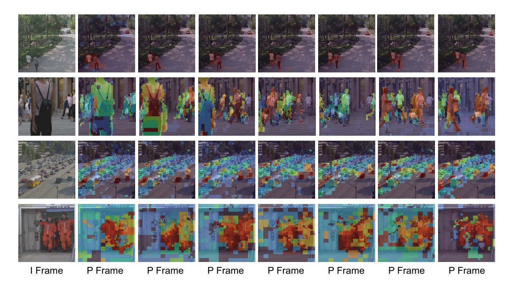
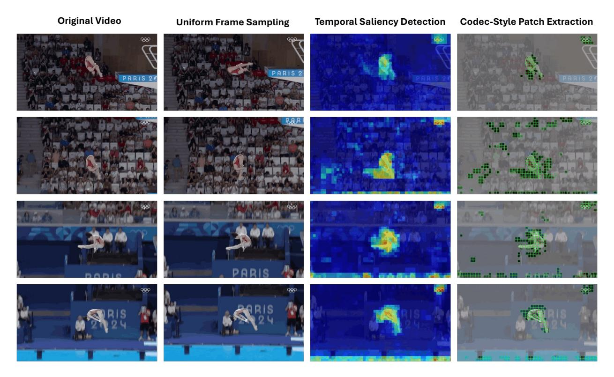
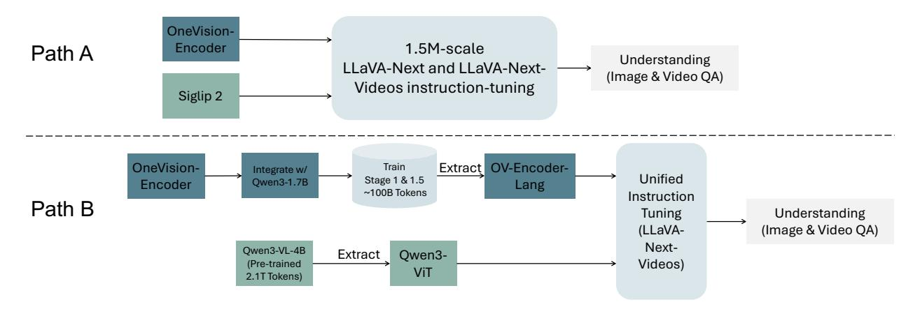

# 3 Pretraining Dataset

Data Annotation and Processing. This section details the annotation and processing pipeline for the OneVision-Encoder pretraining data. Our core objective is to generate high-quality supervision signals for massive-scale data through automated means.

Image Data Annotation. For image data, we primarily process LAION-400M [\(Schuhmann et al.,](#page-27-5) [2022\)](#page-27-5) and COYO-700M [\(Byeon et al.,](#page-24-9) [2022\)](#page-24-9). First, we employ a Union-Find algorithm to strictly deduplicate the dataset. Subsequently, we utilize the metaclip-h14-fullcc2.5b [\(Xu et al.,](#page-28-10) [2024\)](#page-28-10) model to extract image features and cluster all images into two million classes. Based on this clustering, each image sample is annotated with the nearest Top-10 class centers as its multi-label supervision signal. Furthermore, we incorporate the OBELICS [\(Laurençon et al.,](#page-26-2) [2023\)](#page-26-2) and Zero250M [\(Xie et al.,](#page-28-11) [2023\)](#page-28-11) datasets. We utilize PaddleOCR [\(Sarkar](#page-27-6) [et al.,](#page-27-6) [2024\)](#page-27-6) to recognize text within images and perform word segmentation on the recognized content; the resulting vocabulary is used as multi-labels to construct a supervision signal containing exactly 100 fine-grained tags per image.

Video Data Annotation. The video data construction encompasses HowTo100M [\(Miech et al.,](#page-27-4) [2019\)](#page-27-4), Panda-70M [\(Chen et al.,](#page-25-4) [2024b\)](#page-25-4), Kinetics-710 [\(Li et al.,](#page-26-3) [2022b\)](#page-26-3), and Something-Something-V2 (SSV2) [\(Goyal et al.,](#page-25-5) [2017\)](#page-25-5). We uniformly adopt metaclip-h14-fullcc2.5b as the video encoder, performing uniform frame sampling to extract features from a fixed 8-frame clip. In the feature processing stage, we adopt a "L2 Normalize → Concatenate → L2 Normalize" strategy to generate video-level representations. We then cluster the video representations into 400k classes and assign each video clip the nearest Top-10 class centers as its multi-labels.

### 4 Experiments

### 4.1 Pretraining OneVision-Encoder

We adopt a two-stage pretraining pipeline using large-scale image, video, and OCR data, trained on 128 A800 GPUs (16 nodes × 8 GPUs).

Stage 1: For the image model, we use images at a resolution of 224. We adopt the AdamW optimizer with a learning rate of 0.001 and a weight decay of 0.2. The number of classes (k) is two million, the ratio of sampled negative class centers (r) is 0.1, and the number of positive labels (l) assigned to each image (and each video) is 10. In this stage, we trained on 13B samples using only image data.

Stage 2: In the second pre-training stage, we introduced OCR data and video data, training on 4B samples with an image resolution of 448 and video resolution of 224 (frame sampling). For video processing, we randomly adopted one of Codec Patchification formulations. For dense video-Codec inputs, each training sample corresponds to a fixed-length clip of 64 consecutive frames. We follow an HEVC-style GOP configuration with an I-frame every 32 frames, resulting in two I-frames and sixty-two P-frames per clip. All I-frames are fully encoded, retaining all spatial patches to establish complete spatial context. For the remaining P-frames, codec-derived motion vectors and residuals are used to identify temporally salient regions, and patches are selected sparsely across all P-frames. Importantly, the patch budget is enforced at the clip level rather than the GOP level. While GOPs define the I/P frame structure, the total number of visual tokens for the entire 64-frame clip is fixed to 2,048. Specifically, 512 tokens are allocated to the two I-frames (256 patches each), and the remaining 1,536 tokens are distributed across all P-frames by selecting motion-relevant residual patches. This results in an 87.5% reduction compared to dense processing of all 64 frames (16,384 patches), while preserving full temporal coverage. All samples shared the same ViT backbone, with loss calculated separately for each modality based on their annotations. The video-to-image ratio was 1:1, and the learning rate was reduced to 0.0001.

Training Strategy. During the training phase, all data sources share the same OneVision-Encoder for feature extraction. However, when computing the loss, the loss is calculated separately for each data type and then aggregated. Detailed training configurations and implementation specifics are provided in the supplementary material.

### 4.2 LMM Probing Evaluation - Language Alignment

In this section, we evaluate the effectiveness of OV-Encoder when integrated into LMMs. Our goal is to assess whether the learned visual representations transfer robustly to multimodal reasoning settings, while isolating the contribution of the vision encoder from language model capacity and training protocol. We lift these features through alignment tuning to construct a new codec encoder, OV-Encoder-Lang, specialized for MLLMs. The controlled evaluation pipeline is illustrated in Figure [7](#page-19-0) in the supplementary material.

MLLM Evaluation Tasks. We adapt vision encoders to large multimodal models and evaluate downstream performance on a set of image- and video-centric benchmarks using LMMs-Eval [\(Zhang et al.,](#page-29-3) [2025\)](#page-29-3) with the default prompt. Image tasks include ChartQA [\(Masry et al.,](#page-27-7) [2022\)](#page-27-7), DocVQA [\(Mathew et al.,](#page-27-8) [2021\)](#page-27-8), InfoVQA [\(Mathew et al.,](#page-27-9) [2022\)](#page-27-9), AI2D [\(Kembhavi et al.,](#page-26-4) [2016\)](#page-26-4), MMBench-EN [\(Fu et al.,](#page-25-6) [2023\)](#page-25-6), OCRBench [\(Liu](#page-27-10) [et al.,](#page-27-10) [2024b\)](#page-27-10), OCRBench v2 [\(Liu et al.,](#page-27-10) [2024b\)](#page-27-10), MMStar [\(Chen et al.,](#page-25-7) [2024a\)](#page-25-7), and RealWorldQA [\(Corp.,](#page-25-8) [2024\)](#page-25-8). Video tasks include MVBench [\(Li et al.,](#page-26-5) [2023a\)](#page-26-5), MLVU-dev [\(Zhou et al.,](#page-29-4) [2024\)](#page-29-4), NExT-QA [\(Xiao et al.,](#page-28-12) [2021\)](#page-28-12), VideoMME [\(Fu et al.,](#page-25-9) [2024\)](#page-25-9), PerceptionTest [\(Patraucean et al.,](#page-27-11) [2023\)](#page-27-11), TOMATO [\(Shinoda et al.,](#page-27-12) [2025\)](#page-27-12), and LongVideoBench-Val-Video [\(Wu et al.,](#page-28-13) [2024\)](#page-28-13).

Experimental Setup. Following a probing-based fine-tuning paradigm, we keep the language model architecture fixed and vary only the visual encoder. Unless otherwise specified, all experiments are conducted with Qwen3-4B-Instruct2507 as the language backbone. We adopt a two-stage training pipeline: first, a Stage-1 alignment phase, followed by a Stage-2 instruction-tuning phase. The instruction-tuning corpus consists of approximately 1.5M samples, including 740K single-image instruction from LLaVA-Next and 800K samples from LLaVA-Next-Videos. This unified instruction-following setting enables a controlled comparison across different vision encoders under identical multimodal supervision.

Table 2 Comparison of different vision encoders onmultimodal benchmarks. All models are evaluated on a unified multimodal setting using Qwen3-4B-Instruct2507 as the language backbone. OV-Encoder-Lang denotes the language-aligned variant of the OV-Encoder architecture. Qwen3-ViT is extracted from Qwen3-VL-4B. SigLIP2 uses siglip2-so400mpatch16-naflex. (Codec) indicates codec-guided visual encoding using motion vectors and residual signals, while (Frame) indicates frame-based visual encoding with dense spatial patchification. Bold values indicate the best performance under the same evaluation setting. Results reported in the left columns correspond to encoders trained with caption supervision, whereas results in the right columns correspond to encoders trained without caption supervision.

| Task  | Benchmark                |                            |                      | Qwen3-4B-Instruct2507 |                             |                    |
|-------|--------------------------|----------------------------|----------------------|-----------------------|-----------------------------|--------------------|
|       |                          | OV-Encoder-Lang (Codec) | Qwen3-ViT (Frame) | OV-Encoder (Codec) | OV-Encoder-Frame (Frame) | SigLIP2 (Frame) |
|       | MVBench                  | 53.2                       | 47.4                 | 52.4                  | 49.8                        | 47.2               |
|       | MLVU-dev                 | 47.4                       | 47.2                 | 46.3                  | 49.4                        | 48.4               |
|       | NExT-QA (MC)             | 76.1                       | 70.1                 | 75.6                  | 71.9                        | 70.6               |
| Video | VideoMME                 | 54.1                       | 47.2                 | 53.4                  | 49.3                        | 46.8               |
|       | Perception Test          | 60.6                       | 57.1                 | 60.3                  | 56.7                        | 56.0               |
|       | TOMATO                   | 21.8                       | 22.2                 | 22.2                  | 21.8                        | 22.3               |
|       | LongVideoBench-Val-Video | 51.6                       | 45.0                 | 50.4                  | 45.5                        | 45.2               |
|       | AI2D                     | 80.2                       | 77.8                 | 75.7                  | 76.5                        | 78.6               |
|       | ChartQA                  | 80.1                       | 79.6                 | 76.5                  | 77.8                        | 76.4               |
|       | DocVQA                   | 83.2                       | 85.1                 | 78.4                  | 79.5                        | 75.0               |
|       | InfoVQA                  | 51.6                       | 49.0                 | 43.1                  | 45.5                        | 42.0               |
| Image | MMBench-EN               | 80.2                       | 79.4                 | 77.2                  | 78.5                        | 79.6               |
|       | OCRBench                 | 657                        | 706                  | 605                   | 630                         | 621                |
|       | OCRBench v2              | 30.8                       | 30.6                 | 26.3                  | 26.1                        | 26.1               |
|       | MMStar                   | 56.6                       | 56.6                 | 52.1                  | 54.3                        | 55.0               |
|       | RealWorldQA              | 66.1                       | 63.3                 | 60.8                  | 61.2                        | 62.1               |

### 4.2.1 Native-Resolution Evaluation.

We adopt a native-resolution evaluation strategy following LLaVA-Next, with a key distinction: input frames matching the native resolution of the vision encoder are processed directly without spatial tiling or cropping. For video inputs, we use a fixed per-frame resolution, set to 512×512 for SigLIP2 and Qwen3-ViT, and 504×504 for OneVision-Encoder. This design avoids resolution-induced artifacts and enables a direct assessment of the encoder's native-resolution modeling capability under realistic multimodal inference conditions.

Codec-based Patch Sampling. We evaluate the same codec-guided patchification principle as described in Stage 2 of Section [4.1](#page-8-0) under a strictly controlled token budget. For each test video, we uniformly sample 64 frames over the full duration to obtain broad temporal coverage. We do not re-encode or transcode benchmark videos; compressed-domain signals (e.g., motion vectors and residuals) are extracted directly from the original bitstreams, thus preserving the native GOP structures and codec parameters of each dataset. Based on these signals, we compute a lightweight saliency score to estimate temporally informative regions and select patches sparsely across the sampled frames. The selected patches are then packed into a fixed number of visual tokens. Importantly, we keep the total token budget identical to the dense baseline that encodes only 8 frames, ensuring that performance differences reflect improved token allocation rather than increased token count.

Comparison with SigLIP2. We first compare OneVision-Encoder with SigLIP2 under identical multimodal fine-tuning conditions, as shown in Table [2.](#page-9-0) All models share the same instruction-tuning corpus, data preprocessing pipelines, training schedules, decoding strategies, and visual token budgets. Under this setting, OneVision-Encoder consistently outperforms SigLIP2 across 16 video, image, and document understanding benchmarks when integrated into an LMM built upon Qwen3-4B, indicating stronger multimodal transfer from the learned visual representations.

Comparison with Qwen3-ViT. We further conduct a comparison with Qwen3-ViT. Specifically, we integrate

Table 3 Comparison of OV-Encoder training stages on image understanding benchmarks. In this study, we evaluate two training variants of the same ViT architecture under an identical data scale: OV-Encoder-stage1 is trained with image-only data, while OV-Encoder-stage2 continues training from Stage 1 and incorporates OCR and video data with codec-style patch selection. Bold values indicate the best performance among the compared encoders.

| Benchmark   | OV-Encoder-stage1 | OV-Encoder-stage2 | SigLIP2-sig |
|-------------|-------------------|-------------------|-------------|
| AI2D        | 73.6              | 74.5              | 77.5        |
| ChartQA     | 73.6              | 76.2              | 77.0        |
| DocVQA      | 74.3              | 78.5              | 74.4        |
| InfoVQA     | 34.7              | 41.4              | 37.7        |
| MMBench-EN  | 74.7              | 76.3              | 78.1        |
| MMStar      | 49.3              | 49.7              | 52.6        |
| RealWorldQA | 61.8              | 61.3              | 62.2        |
| OCRBench    | 551.0             | 601.0             | 590.0       |

OneVision-Encoder with the Qwen3-1.7B language model and train it under the LLaVA-OneVision-1.5 framework, completing both Stage 1 and Stage 1.5 to adapt the encoder to native-resolution inputs. After this adaptation, the trained OneVision-Encoder is decoupled and compared with Qwen3-ViT under the same LLaVA-Next-Videos instruction-tuning setting. Under this setting, OneVision-Encoder outperforms Qwen3- ViT across 16 understanding benchmarks when evaluated with an LMM built upon Qwen3-4B, as shown in Table [2.](#page-9-0) Notably, these gains are achieved despite OneVision-Encoder being pretrained on substantially fewer visual–text tokens (approximately 100B caption tokens), whereas Qwen3-ViT is pretrained on more than 2.1T caption and instruction-aligned tokens. This result suggests that the observed improvements arise from more effective visual representation learning, rather than increased pretraining scale or architectural specialization.

#### 4.2.2 Stage-wise Multimodal Training Analysis.

We further analyze how stage-wise multimodal training contributes to the observed performance in LMM probing. In the first stage (OV-Encoder-Stage1), the visual encoder is trained using image-only data, focusing on general-purpose visual representation learning. In the second stage (OV-Encoder-Stage2), OCR and video data are introduced on top of Stage1, together with Codec patch selection and chunk-wise temporal sampling strategies.

As shown in Table [3,](#page-10-0) the Stage2 model consistently outperforms its Stage1 counterpart on multimodal and OCR-related benchmarks, while maintaining strong performance on general visual reasoning tasks. This comparison demonstrates that injecting OCR and video supervision plays a critical role in enhancing the ViT-based encoder's suitability as a unified visual backbone for LMMs. Together with the native-resolution results above, this analysis highlights that stage-wise multimodal training is a key factor enabling both robust native-resolution generalization and effective multimodal reasoning.

### 4.3 Attentive Probing Evaluation

We evaluate the quality of visual representations learned by OV-Encoder using an attentive probing protocol, which has been widely adopted to assess backbone-level spatiotemporal modeling capacity without task-specific adaptation. In this setting, the visual encoder is frozen and a lightweight attention-based classifier head is trained on top of the extracted features for downstream video classification. This protocol isolates the intrinsic representational strength of the encoder and enables fair comparison across architectures with different tokenization and temporal modeling strategies.

Experimental Setup. All models are evaluated under a controlled and unified attentive probing protocol. Following prior work on vision-language pretraining and attentive pooling [\(Tschannen et al.,](#page-28-9) [2025\)](#page-28-9), we employ a multi-head attention pooling classifier to aggregate spatiotemporal features into video-level representations. The same classifier architecture is used for all methods to ensure architectural consistency, and the probing head is trained with an identical number of epochs, optimization settings, and learning rate schedules across

Table 4 Comparison with state-of-the-art methods on video understanding benchmarks. We report top-1 accuracy (%) using an attentive probe with frozen backbones, evaluated under two input configurations: 8 Frames / 2048 Patches and 16 Frames / 4096 Patches. For OV-Encoder (Codec), inputs are constructed using Dense Video-codec Patchification, which selectively encodes temporally salient patches from dense video inputs under the corresponding patch budgets. Bold indicates the best performance and underline indicates the second-best.

|                          | Model Setup |      | Video Benchmarks (Acc. %) |      |          |                    |             |           |           |              |            |
|--------------------------|-------------|------|---------------------------|------|----------|--------------------|-------------|-----------|-----------|--------------|------------|
| Method                   | Backbone    | Res. | Avg.                      | SSV2 | Diving48 | Test Perception | CharadesEgo | Epic-Verb | Epic-Noun | Kinetics-400 | MDB51 H |
| 8 Frames / 2048 Patches  |             |      |                           |      |          |                    |             |           |           |              |            |
| CLIP                     | ViT-L/14    | 224  | 50.5                      | 48.2 | 46.6     | 52.2               | 10.8        | 52.8      | 36.1      | 79.3         | 78.0       |
| SigLIP                   | ViT-L/16    | 256  | 50.1                      | 50.7 | 43.9     | 48.9               | 10.9        | 52.2      | 39.1      | 78.2         | 77.0       |
| MetaCLIP                 | ViT-L/14    | 224  | 48.5                      | 50.6 | 28.9     | 49.8               | 10.4        | 54.1      | 37.1      | 79.6         | 77.1       |
| MetaCLIP2                | ViT-L/14    | 224  | 50.2                      | 47.2 | 48.0     | 47.7               | 11.0        | 48.0      | 40.9      | 82.4         | 76.3       |
| AIMv2                    | ViT-L/14    | 224  | 53.8                      | 55.1 | 43.6     | 55.1               | 12.0        | 56.6      | 45.6      | 81.1         | 81.3       |
| SigLIP2                  | ViT-L/16    | 256  | 53.1                      | 52.6 | 50.1     | 52.7               | 11.6        | 54.2      | 43.8      | 80.9         | 79.1       |
| DINOv3                   | ViT-L/14    | 224  | 58.0                      | 57.4 | 58.6     | 59.3               | 13.2        | 62.5      | 51.7      | 82.9         | 78.6       |
| OV-Encoder (Frame)       | ViT-L/14    | 224  | 58.4                      | 57.7 | 57.6     | 58.3               | 12.1        | 61.4      | 52.5      | 84.3         | 83.1       |
| OV-Encoder (Codec)       | ViT-L/14    | 224  | 60.2                      | 58.5 | 67.2     | 60.0               | 12.3        | 62.3      | 53.9      | 84.4         | 83.4       |
| 16 Frames / 4096 Patches |             |      |                           |      |          |                    |             |           |           |              |            |
| SigLIP                   | ViT-L/16    | 256  | 52.8                      | 52.7 | 54.7     | 51.0               | 11.7        | 54.1      | 40.2      | 79.1         | 78.8       |
| MetaCLIP2                | ViT-L/14    | 224  | 51.0                      | 49.3 | 42.1     | 51.1               | 11.2        | 49.2      | 43.2      | 84.0         | 78.2       |
| AIMv2                    | ViT-L/14    | 224  | 56.4                      | 57.2 | 55.7     | 56.4               | 12.4        | 58.3      | 46.2      | 82.2         | 82.6       |
| SigLIP2                  | ViT-L/16    | 256  | 55.7                      | 58.2 | 56.7     | 53.3               | 11.9        | 56.4      | 45.2      | 82.7         | 81.2       |
| DINOv3                   | ViT-L/14    | 224  | 59.1                      | 58.3 | 61.3     | 60.8               | 14.0        | 63.2      | 51.9      | 83.9         | 79.7       |
| OV-Encoder (Frame)       | ViT-L/14    | 224  | 59.9                      | 58.7 | 63.2     | 60.3               | 12.6        | 62.9      | 54.5      | 85.1         | 81.6       |
| OV-Encoder (Codec)       | ViT-L/14    | 224  | 61.5                      | 60.1 | 69.4     | 60.9               | 12.9        | 63.3      | 54.4      | 85.4         | 85.3       |

all experiments. All experiments are conducted on a cluster of 8 NVIDIA A800 GPUs. We therefore evaluate our model by assessing the quality of the model's learned representation on a set of seven benchmarks: SSV2, Diving48 [\(Li et al.,](#page-26-6) [2018\)](#page-26-6), Perception Test [\(Patraucean et al.,](#page-27-11) [2023\)](#page-27-11), CharadesEgo [\(Sigurdsson et al.,](#page-27-13) [2018\)](#page-27-13), Epic-Kitchens-100 [\(Kay et al.,](#page-26-7) [2017\)](#page-26-7), Kinetics-400 [\(Damen et al.,](#page-25-10) [2022\)](#page-25-10), HMDB51 [\(Kuehne et al.,](#page-26-8) [2011\)](#page-26-8). Batch sizes are determined on a per-dataset basis to balance computational efficiency and training stability: a batch size of 32 is used for SSV2, Diving48, and Perception Test, 16 for HMDB51, and 128 for all remaining datasets. During evaluation, we adopt a single-crop inference protocol, using one temporal crop and one spatial crop per video clip, resulting in a single prediction for each input video.

Input Configuration. For frame-centric baselines, including SigLIP2, DINOv3, and AIMv2, we evaluate both 8-frame and 16-frame inputs using uniform temporal sampling. For OV-Encoder, we evaluate two instantiations under an identical patch budget of 512 visual tokens. Specifically, the codec-guided variant operates on dense 64-frame video inputs, where codec-derived signals determine the visible patch indices, while the chunk-wise variant samples frames within fixed temporal chunks. This design ensures that all methods are compared under a fixed token budget, decoupling representational capacity from raw input resolution or frame count.

Evaluation Protocol. During inference, all crops belonging to the same video are aggregated by averaging logits across crops. Labels are shared across crops of the same video, and no test-time augmentation beyond the single-crop setting is applied. For codec-based models, visible patch indices are provided as part of the input to ensure consistent patch selection across crops.

Results. Table [4](#page-11-0) shows that OV-Encoder consistently outperforms SigLIP2, DINOv3, and AIMv2 across all evaluated video benchmarks under both 8-frame and 16-frame settings. In particular, OV-Encoder achieves a 12.7% absolute Top-1 accuracy improvement over SigLIP2 on Diving48 at an identical patch budget, demonstrating superior motion modeling capability. Notably, these gains are achieved without sacrificing

Table 5 Effect of patch budget scaling under attentive probing. Patch budgets of 512/1024/2048/4096 correspond to 2/4/8/16 video frames, respectively. Dense SigLIP2 processes all spatial patches per frame, while OV-Encoder (Codec) selectively retains motion-relevant patches guided by codec-derived temporal signals.

| Setting             | Video Benchmarks (Acc. %) |      |          |                    |             |           |           |              |            |
|---------------------|---------------------------|------|----------|--------------------|-------------|-----------|-----------|--------------|------------|
|                     | AVG                       | SSV2 | Diving48 | Test Perception | CharadesEgo | Epic-Verb | Epic-Noun | Kinetics-400 | MDB51 H |
| Patch Budget = 512  |                           |      |          |                    |             |           |           |              |            |
| SigLIP2             | 43.4                      | 42.8 | 28.1     | 38.7               | 10.1        | 42.9      | 37.4      | 74.5         | 72.4       |
| OV-Encoder (Codec)  | 50.1                      | 50.0 | 46.5     | 50.5               | 10.6        | 50.3      | 41.7      | 76.7         | 74.7       |
| Patch Budget = 1024 |                           |      |          |                    |             |           |           |              |            |
| SigLIP2             | 50.8                      | 49.0 | 48.7     | 50.1               | 10.8        | 50.6      | 42.0      | 78.8         | 76.6       |
| OV-Encoder (Codec)  | 56.2                      | 56.6 | 54.9     | 58.6               | 11.1        | 58.2      | 48.4      | 81.8         | 80.3       |
| Patch Budget = 2048 |                           |      |          |                    |             |           |           |              |            |
| SigLIP2             | 53.1                      | 52.6 | 50.1     | 52.7               | 11.6        | 54.2      | 43.8      | 80.9         | 79.1       |
| OV-Encoder (Codec)  | 60.2                      | 58.5 | 67.2     | 60.0               | 12.3        | 62.3      | 53.9      | 84.4         | 83.4       |
| Patch Budget = 4096 |                           |      |          |                    |             |           |           |              |            |
| SigLIP2             | 55.7                      | 58.2 | 56.7     | 53.3               | 11.9        | 56.4      | 45.2      | 82.7         | 81.2       |
| OV-Encoder (Codec)  | 61.5                      | 60.1 | 69.4     | 60.9               | 12.9        | 63.3      | 54.4      | 85.4         | 85.3       |

performance on appearance-dominated datasets such as Kinetics-400, confirming that Codec patch-level encoding yields more discriminative and efficient spatiotemporal representations. We further observe that for 64-frame inputs under a fixed token budget, allocating only one to two I-frames is sufficient to establish stable spatial context, with subsequent frames contributing primarily through sparse motion-driven updates.

### 4.4 Patch-Efficient Video Understanding Comparison

We conduct an efficiency analysis comparing SigLIP2 with dense full-frame patch processing and OV-Encoder (Codec) under a fixed token budget, as shown in Table [5.](#page-12-0) It is important to emphasize that OV-Encoder (Codec) does not perform temporal downsampling of the input video. All results are obtained from the same 64-frame (16384 patches) source video, where codec-native motion vectors and residuals are used to selectively extract a fixed number of spatiotemporal patches distributed across the entire temporal extent.

For a fair comparison, SigLIP2 is evaluated under the same token budgets and adopts a traditional frame sampling strategy, where each group of 256 patches corresponds to a contiguous RGB frame. Under a fixed token budget, OV-Encoder (Codec) redistributes patches across time while preserving their spatial positions, enabling long-range temporal coverage. As a result, it outperforms SigLIP2 on Diving48 and Perception Test while reducing patch processing by 75.0%–96.9% compared to dense processing of 16,384 patches. Specifically, the reduction ratio is computed relative to the dense baseline that processes all 64 × 256 = 16,384 patches from the full video. Using token budgets of 4096, 2048, 1024, and 512 patches corresponds to retaining 25.0%, 12.5%, 6.25%, and 3.1% of the dense patches, respectively, yielding a patch reduction of 75.0%–96.9%.

### 4.5 Ablation of Codec-guided Patch Selection

Although OV-Encoder (Codec) consistently outperforms frame-centric baselines under attentive probing, as shown in Table [4,](#page-11-0) performance gains alone do not establish codec-guided patch selection as a functional mechanism. To isolate its causal role, we conduct a set of controlled interventions that explicitly manipulate

Table 6 Controlled interventions on codec-selected motion patches. All settings use identical token budgets and visual content unless otherwise specified.

| Setting                                                                    | Video Benchmarks (Acc. %) |      |          |                    |             |           |           |              |            |
|----------------------------------------------------------------------------|---------------------------|------|----------|--------------------|-------------|-----------|-----------|--------------|------------|
|                                                                            | AVG                       | SSV2 | Diving48 | Test Perception | CharadesEgo | Epic-Verb | Epic-Noun | Kinetics-400 | MDB51 H |
| OV-Encoder (Codec)                                                         | 61.5                      | 60.1 | 69.4     | 60.9               | 12.9        | 63.3      | 54.4      | 85.4         | 85.3       |
| Non-motion Patch Replacement (50%) (Same Video, Same Position)          | 55.4                      | 52.1 | 55.4     | 54.9               | 11.6        | 56.3      | 50.2      | 83.1         | 79.4       |
| Counterfactual Motion Replacement (50%) (Motion Patch from Other Video) | 54.9                      | 50.6 | 57.2     | 53.8               | 11.3        | 55.1      | 49.6      | 82.7         | 79.0       |
| Patch–Position Shuffle (Content Preserved, Positions Shuffled)          | 48.1                      | 41.8 | 46.3     | 45.1               | 8.7         | 48.2      | 42.5      | 78.4         | 73.6       |

patch content while holding token count, spatiotemporal positions, positional encodings, and model parameters fixed.

Patch Content Necessity. We first examine whether the content of codec-selected motion patches is necessary for the observed gains. In this setting, motion-heavy patches identified by the codec are replaced with non-motion patches sampled from the same video, while preserving their original spatiotemporal positions. As shown in Table [6,](#page-13-0) this intervention leads to substantial performance degradation across all benchmarks. The drop is particularly pronounced on motion-sensitive datasets, with accuracy decreasing, while appearance-dominated datasets such as Kinetics-400 exhibit smaller but consistent declines. These results indicate that the benefits of OV-Encoder (Codec) cannot be attributed to token sparsity or positional bias alone, but critically depend on the motion-centric content encoded by the selected patches.

Semantic Specificity of Motion Cues. To further assess whether the model relies on semantically aligned motion rather than generic motion signals, we perform a counterfactual replacement in which codec-selected motion patches are substituted with motion patches drawn from unrelated videos. Despite preserving motion magnitude and patch positions, this intervention results in even larger performance drops on fine-grained temporal benchmarks, as shown in Table [6.](#page-13-0) The consistent degradation relative to non-motion replacement demonstrates that OV-Encoder (Codec) is sensitive to the semantic correctness of motion cues, rather than merely benefiting from the presence of motion energy or stochastic perturbations.

Negative Control: Patch-Position Shuffle. As a sanity check, we additionally evaluate a patch-position shuffle intervention, in which the visual content of codec-selected patches is preserved but their spatiotemporal positions are randomly permuted. This intervention causes a substantially larger performance drop across all benchmarks, as shown in Table [6,](#page-13-0) confirming that coherent spatial and temporal alignment is critical for effective representation learning. Importantly, this experiment is not intended to demonstrate the causal role of codec guidance itself, but rather to rule out degenerate explanations in which patch content alone suffices without positional structure.

Discussion. Taken together, these interventions establish a consistent ordering across benchmarks: preserving semantically correct motion patches yields the strongest performance, followed by non-motion substitutions, while semantically mismatched motion patches and patch-position shuffling are most detrimental. This hierarchy rules out alternative explanations based on regularization, noise injection, or attention disruption, and provides converging evidence that codec-guided patch selection captures motion-centric visual evidence that is both semantically meaningful and structurally aligned with the underlying video content.

Figure 5 Visualization of I- and P-frame decomposition in HEVC. I-frames retain complete spatial structure, whereas P-frames encode motion-compensated residuals highlighting motion. Bright areas denote high residual magnitudes, while dark areas indicate static content.

### 4.6 Qualitative Analysis

To understand how our model leverages temporal information for selective patch processing, we visualize the patch selection mechanism guided by residual magnitudes and motion vectors. As illustrated in Figure [5,](#page-14-0) we compare an I-frame (reference frame) with subsequent P-frames in a video sequence, where patch colors indicate their selection priority based on residual and motion strength. In the I-frame (top-left), all patches are processed uniformly since no temporal prior exists. In contrast, the P-frames show selective emphasis on patches with large residuals and strong motion vectors, corresponding to regions with significant appearance changes or object movements. The highlighted patches, shown in warmer colors (red, orange, yellow), primarily correspond to dynamic foreground objects such as moving pedestrians, whereas static background regions (trees, buildings) appear in cooler colors (blue, green), indicating reduced computational focus. Across the sequence, the model consistently tracks salient motion regions, as pedestrians maintain high activation throughout their trajectories, demonstrating that the residual–motion criterion effectively identifies temporally informative patches. This visualization confirms that our approach achieves spatial selectivity by concentrating computation on motion-rich areas and allocating representational capacity according to temporal saliency, leading to more efficient video understanding.

Figure [6](#page-15-0) contrasts conventional frame-centric video processing with the proposed Codec patch extraction. While dense 64-frame inputs preserve full temporal context at high computational cost, uniform frame sampling reduces computation by sparsely selecting frames but inevitably discards fine-grained inter-frame motion, particularly for fast or subtle actions. Temporal saliency detection instead analyzes all frames to identify motion- and event-centric regions. Leveraging this signal, Codec patch extraction selectively encodes only temporally salient patches using a codec-inspired ordering, achieving substantial token reduction (75%–96.9%) while preserving critical motion dynamics. This formulation decouples temporal coverage from token density, enabling efficient and scalable spatiotemporal modeling without reliance on sparse frame sampling.

Figure 6 Comparison of video processing pipelines for spatiotemporal representation learning. (a) original dense video input with full temporal context, (b) uniform frame sampling that sparsely selects evenly spaced frames, (c) temporal saliency detection that identifies motion- and event-centric regions across all frames, and (d) Codec patch extraction that selectively retains temporally salient patches under a fixed token budget.

### 5 Related Work

### 5.1 Advances in Visual Representation Learning

Vision Transformers [\(Dosovitskiy et al.,](#page-25-11) [2021;](#page-25-11) [Li et al.,](#page-26-9) [2022a\)](#page-26-9) have emerged as a dominant approach in visual representation learning. DINOv2 [\(Jose et al.,](#page-26-10) [2025\)](#page-26-10) and DINOv3 [\(Siméoni et al.,](#page-27-2) [2025\)](#page-27-2) introduce a self-supervised framework that does not require labels, achieving state-of-the-art results across a wide range of vision tasks. Simultaneously, equivariant self-supervised methods [\(Devillers and Lefort,](#page-25-12) [2023;](#page-25-12) [Park et al.,](#page-27-14) [2022;](#page-27-14) [Garrido et al.,](#page-25-13) [2023;](#page-25-13) [Gupta et al.,](#page-26-11) [2024;](#page-26-11) [Dangovski et al.,](#page-25-14) [2021\)](#page-25-14) have been developed to predict structured transformations consistent with group-theoretic principles. Masked image modeling techniques [\(He et al.,](#page-26-0) [2021;](#page-26-0) [Bao et al.,](#page-24-10) [2021;](#page-24-10) [El-Nouby et al.,](#page-25-15) [2024;](#page-25-15) [Xie et al.,](#page-28-14) [2022\)](#page-28-14) learn visual representations by reconstructing masked regions within the pixel domain. Furthermore, Joint-Embedding Predictive Architecture [\(Assran](#page-24-11) [et al.,](#page-24-11) [2023,](#page-24-11) [2025;](#page-24-1) [Baevski et al.,](#page-24-12) [2022\)](#page-24-12) showed that predicting a learned latent space instead of the pixel space leads to more powerful, higher-level features. Contrastive Language-Image Pretraining (CLIP) [\(Bolya](#page-24-13) [et al.,](#page-24-13) [2025;](#page-24-13) [Sun et al.,](#page-28-15) [2023;](#page-28-15) [Li et al.,](#page-26-12) [2023c;](#page-26-12) [Fang et al.,](#page-25-16) [2024;](#page-25-16) [Xu et al.,](#page-28-10) [2024;](#page-28-10) [Schuhmann et al.,](#page-27-5) [2022\)](#page-27-5) aligns images and texts within a shared embedding space through instance-level contrastive supervision. However, existing methods mainly focus on either pixel-level reconstruction or instance-level contrastive alignment, limiting their ability to capture structured semantic relationships across samples and modalities. In this work, we adopt the self-supervised cluster discrimination paradigm (e.g., UNICOM [\(An et al.,](#page-24-3) [2023\)](#page-24-3), MLCD [\(An](#page-24-4) [et al.,](#page-24-4) [2024\)](#page-24-4), RICE [\(Xie et al.,](#page-28-5) [2025\)](#page-28-5), UniViT [\(Tang et al.,](#page-28-6) [2025\)](#page-28-6)), which learns structured semantics by jointly clustering similar instances and discriminating between clusters.

### 5.2 Efficient Video Representations

(1) Video Sampling. Conventional methods first divide selected frames into fixed patch embeddings (e.g., 16×16 in ViT) before encoding, where frame selection typically follows uniform sampling or motion-based heuristics [\(Xue et al.,](#page-29-5) [2022;](#page-29-5) [Wang et al.,](#page-28-16) [2023\)](#page-28-16). However, such strategies still process all patches per frame, resulting in long token sequences and high preprocessing cost. To improve efficiency, patch-level merging is adopted in AuroraCap [\(Chai et al.,](#page-24-14) [2024\)](#page-24-14) and AuroraLong [\(Xu et al.,](#page-28-17) [2025\)](#page-28-17), while adaptive sampling [\(Kim](#page-26-13) [et al.,](#page-26-13) [2024\)](#page-26-13) allocates more frames to motion-intensive segments but fails to mitigate the quadratic cost of self-attention under large token budgets. Moreover, flexible-FPS variants impose an upper bound on frame count, limiting scalability to high frame rates. Video-LaVIT [\(Jin et al.,](#page-26-14) [2024\)](#page-26-14) explores decomposing videos into keyframes and motion signals to enable efficient tokenization and unified generative pretraining with multimodal LLMs. (2) Token Dropout. A simple strategy to reduce transformer sequence length is token dropout, which removes redundant tokens either randomly [\(Han et al.,](#page-26-15) [2022;](#page-26-15) [Liu et al.,](#page-27-15) [2023\)](#page-27-15) or through learned selection [\(Rao et al.,](#page-27-16) [2021;](#page-27-16) [Yin et al.,](#page-29-6) [2022;](#page-29-6) [Chen et al.,](#page-25-17) [2023\)](#page-25-17). PatchDropout [\(Liu et al.,](#page-27-15) [2023\)](#page-27-15) applies random token removal to standard ViTs for faster training while retaining all tokens at inference, whereas Turbo [\(Han et al.,](#page-26-15) [2022\)](#page-26-15) adopts partial masking for video reconstruction. However, token dropout often removes informative regions and disrupts temporal consistency, leading to unstable optimization and weakened motion modeling. (3) Token Merging. Various approaches have been employed to merge tokens in order to mitigate the information loss associated with dropout. In [\(Liang et al.,](#page-26-16) [2022\)](#page-26-16), inattentive tokens are combined into a singular "background" token, while other studies utilize semantics to enhance the features of interest [\(Zeng et al.,](#page-29-7) [2022;](#page-29-7) [Zhou et al.,](#page-29-8) [2023\)](#page-29-8). Additional research [\(Lee et al.,](#page-26-17) [2024\)](#page-26-17) focuses on optimizing token merging through the use of trainable parameters. The latest work by [\(Koner et al.,](#page-26-18) [2024\)](#page-26-18) trains models using an additional stream of compressed tokens to minimize the overhead of attention. Alternatively, numerous studies have implemented token merging, as detailed in [\(Bolya et al.,](#page-24-15) [2023;](#page-24-15) [Bolya and Hoffman,](#page-24-16) [2023\)](#page-24-16), where image tokens are merged via a weighted average, leveraging attention keys as a similarity metric. In this work, we do not aim to improve compression efficiency or replace existing codecs. Instead, we treat the structural decomposition exposed by modern video codecs as a guiding principle for visual representation learning, where stable spatial context is separated from sparse, motion driven variations. This perspective directly informs the design of our spatiotemporal transformer.

### 5.3 Video Codec Compression

Video codec compression has been extensively studied, with a large body of work devoted to designing efficient and effective video coding systems [\(Girod et al.,](#page-25-18) [2005;](#page-25-18) [Adami et al.,](#page-24-17) [2007;](#page-24-17) [Kumar,](#page-26-19) [2019\)](#page-26-19). Classical standards such as H.264/AVC [\(Sullivan et al.,](#page-28-7) [2012;](#page-28-7) [Zhao and Liang,](#page-29-9) [2006\)](#page-29-9) established the foundation of modern video compression by introducing key techniques including motion compensation, transform coding, and entropy coding, leading to substantial gains in compression efficiency. Building upon this framework, the High Efficiency Video Coding (HEVC) standard, also known as H.265 [\(Sullivan and Wiegand,](#page-28-18) [2005;](#page-28-18) [Sullivan et al.,](#page-28-7) [2012\)](#page-28-7), further improved coding performance through more expressive block partitioning, enhanced motion modeling, and refined entropy coding mechanisms.

Beyond traditional hand-crafted codecs, recent research has explored deep learning-based video compression methods [\(Li et al.,](#page-26-20) [2021;](#page-26-20) [Mentzer et al.,](#page-27-17) [2022;](#page-27-17) [Yang et al.,](#page-29-10) [2021;](#page-29-10) [Li et al.,](#page-26-21) [2023b;](#page-26-21) [Zhang et al.,](#page-29-11) [2023;](#page-29-11) [Wang](#page-28-19) [et al.,](#page-28-19) [2025\)](#page-28-19), which employ neural networks to model spatial and temporal redundancies directly from data. These approaches have demonstrated promising compression performance and have also motivated perceptually driven coding strategies that allocate bits according to human visual sensitivity. Efficiency has also been explored in transformer-based video models, where methods such as Run-Length Tokenization (RLT) [\(Choudhury et al.,](#page-25-19) [2024\)](#page-25-19) exploit temporal redundancy at the token level to reduce input tokens while maintaining performance. Recent work such as EMA [\(Zhao et al.,](#page-29-12) [2025\)](#page-29-12) further leverages compressed video streams by encoding GOP structures with motion-aware mechanisms for efficient video MLLM understanding. Collectively, prior work in video compression has made significant progress toward compactly representing video content by exploiting its inherent temporal predictability and structural redundancy. In this work, we do not aim to improve compression efficiency or replace existing codecs; instead, we draw inspiration from the structural principles underlying modern video codecs, particularly their explicit decomposition of spatial context and temporal variation, to guide the design of spatiotemporal representations for visual transformers.

## 6 Conclusion

In this work, we introduced OV-Encoder, a unified self-supervised vision framework that departs from frame-centric modeling and aligns representation learning with the predictive structure of video signals. By treating discriminative visual evidence as patch-level and motion-centric, OneVision-Encoder selectively encodes informative regions while preserving dense temporal coverage under fixed token budgets. Central to this design is Codec Patchification, which constructs sparse yet structure-preserving spatiotemporal token layouts and naturally extends to chunk-wise temporal modeling and single-image inputs within a unified attention-based encoder, supported by 3D rotary positional encoding. Combined with a cluster discrimination objective that jointly models object-level and motion-level semantics without external supervision, OneVision-Encoder achieves state-of-the-art performance under both LMM probing and attentive probing. These results highlight codec-inspired patch-level sparsity as an effective and scalable foundation for general-purpose visual representation learning.

### 7 Contributors

#### Contributors

core contributors are in bold

- Feilong Tang
- Xiang An
- Yunyao Yan
- Yin Xie
- Bin Qin
- Kaicheng Yang
- Yifei Shen
- Yuanhan Zhang
- Chunyuan Li
- Shikun Feng
- Changrui Chen
- Huajie Tan
- Ming Hu
- Manyuan Zhang

### Project Leaders

- Bo Li
- Ziyong Feng
- Ziwei Liu
- Zongyuan Ge
- Jiankang Deng

### 8 Implementation Details

Model Architecture and Configuration. OneVision-Encoder Large is implemented as a Vision Transformer with 24 transformer layers, a hidden dimension of 1024, and 16 attention heads. The model uses a patch size of 14 × 14 and adopts GELU activations with Layer Normalization throughout the network. Attention computation is accelerated using Flash Attention 2, enabling efficient training and inference at scale. A summary of the core architectural hyperparameters is provided in Table [7.](#page-18-0)

Table 7 Architecture configuration of OneVision-Encoder Large.

| Component           | Setting                 |
|---------------------|-------------------------|
| Transformer layers  | 24                      |
| Hidden dimension    | 1024                    |
| Attention heads     | 16                      |
| Patch size          | 14 × 14                 |
| MLP expansion ratio | 4×                      |
| Position encoding   | 3D RoPE (T:H:W = 4:6:6) |

Unified Patch-based Input Representation. All inputs are converted into patch tokens and processed by a single ViT backbone. Images are treated as single-frame videos (T=1), while videos are represented in a 5D tensor format. To ensure consistent temporal reasoning, all video inputs are mapped to a virtual temporal grid of 64 frames, regardless of the actual number of frames processed. This mapping enables uniform temporal position encoding across dense, sparse, and Codec inputs.

For inputs that do not cover all 64 frames explicitly, a visible indices mechanism is used to associate each selected patch with its corresponding temporal position in the virtual grid. This design decouples temporal coverage from token density and allows sparse inputs to preserve long-range temporal structure.

Codec-style Patch Selection. Codec-style processing operates on dense videos of 64 frames at a spatial resolution of 224 × 224. Motion vectors and prediction residuals are extracted from the HEVC codec and used to estimate patch-level temporal saliency. Motion vectors capture object displacement at sub-pixel precision, while residuals encode fine-grained appearance changes not explained by motion compensation. These signals are fused into a unified saliency score for each patch across all frames.

Patches are ranked globally by their saliency scores, and only the top-K patches are retained. This selection typically preserves between 3.1% and 25% of all patches, corresponding to a compression ratio of 75%–96.9% relative to dense processing. Selected patches are then reassembled into a compact video representation and passed to the ViT using sparse visible indices. Table [8](#page-18-1) summarizes the codec-style selection procedure.

Table 8 Codec-style patch selection pipeline.

| Step                | Description                                                |
|---------------------|------------------------------------------------------------|
| Motion extraction   | Decode HEVC motion vectors with camera motion compensation |
| Residual extraction | Obtain prediction residuals for fine-grained changes       |
| Energy fusion       | Combine motion and residual energies into a saliency score |
| Top-K selection     | Retain globally most salient patches across all frames     |
| Sparse encoding     | Process selected patches with sparse visible indices       |

Video Processing Modes and Batch Composition. During pretraining, OneVision-Encoder employs a mixedmodality batch that includes multiple video processing modes. This design exposes the model to diverse temporal structures and encourages robust representation learning. Video samples within a batch are split into three processing modes: Codec patchification, uniform frame sampling, and Tiling-style spatial concatenation. All modes produce inputs that are compatible with the same ViT backbone and position encoding.

Position Encoding Consistency. All input modes share the same 3D Rotary Position Embedding. The temporal

**Table 9** Video processing modes used during training.

| Mode           | Batch Ratio | Input Form                   | Output Shape        |
|----------------|-------------|------------------------------|---------------------|
| Codec          | 50%         | $Dense\ video\ +\ saliency$  | [B, 3, 8, 224, 224] |
| Frame sampling | 37.5%       | Uniform temporal bins        | [B, 3, 8, 224, 224] |
| Tiling         | 12.5%       | Vertical frame concatenation | [B, 3, 1792, 224]   |

dimension of the RoPE encodes the position of each patch within the 64-frame virtual grid, while spatial dimensions encode patch row and column indices. For Codec inputs, patches may originate from arbitrary frames but are positioned correctly via their temporal indices. For uniformly sampled frames, temporal gaps are explicitly encoded. Tiling inputs are treated as single-frame inputs with fixed temporal positions. This unified encoding scheme enables the model to reason coherently over heterogeneous spatiotemporal layouts.

**Training and Inference Behavior.** The model is trained using a unified optimization pipeline across all modalities. No modality-specific parameters or task-specific encoders are introduced. At inference time, the same preprocessing logic is applied, and the model can flexibly switch between Codec sparse processing and conventional frame sampling depending on computational constraints. This design allows efficient deployment across a wide range of image and video understanding tasks without architectural modification.

### 9 Controlled Evaluation Pipeline

As shown in Figure 7, we adopt a controlled evaluation protocol to compare OneVision-Encoder with Qwen3-ViT and SigLIP2 under LMM probing. For comparison with Qwen3-ViT, OneVision-Encoder is first integrated with the Qwen3-1.7B language model and trained through Stage 1 and Stage 1.5 under the LLaVA-OneVision-1.5 framework to adapt the encoder to native-resolution multimodal inputs. After alignment, the trained vision encoder is decoupled and evaluated under the same LLaVA-Next-Videos instruction-tuning setting as Qwen3-ViT, ensuring a fair comparison under identical downstream supervision. For comparison with SigLIP2, all models are directly evaluated under identical multimodal fine-tuning conditions using a unified 1.5M-scale instruction-tuning corpus, while keeping the language model backbone fixed. This decoupled and unified evaluation pipeline isolates the contribution of visual representation learning and avoids confounding effects from language model capacity, instruction data leakage, or differing alignment procedures.

Figure 7 Controlled evaluation pipeline decoupling the encoder for fair comparison against Qwen3-ViT and SigLIP2

