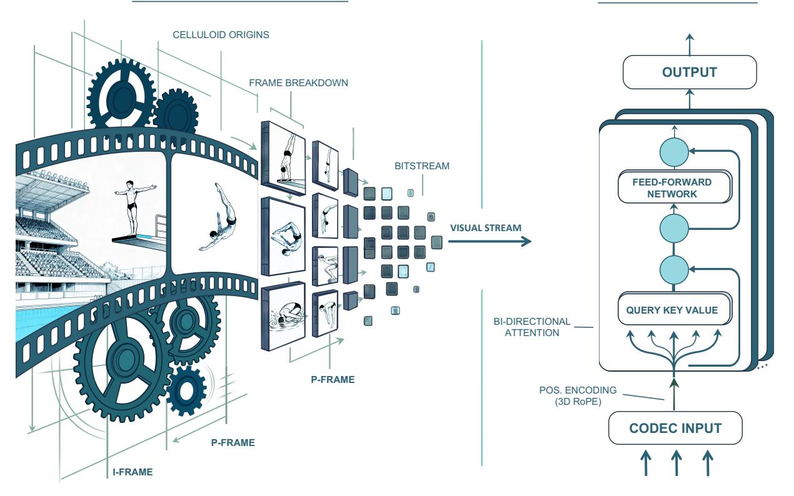
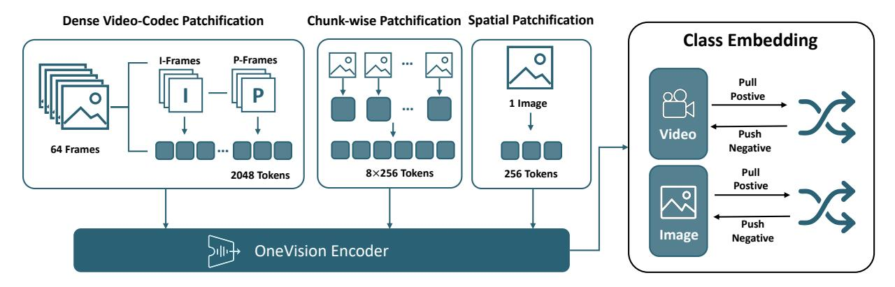
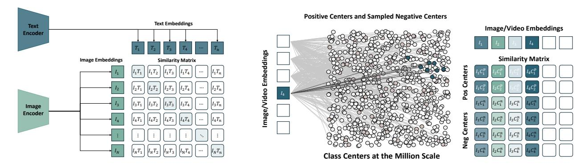
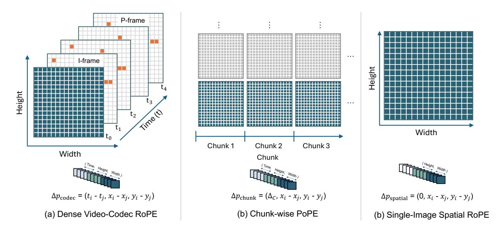

# OneVision-Encoder: Codec-Aligned Sparsity as a Foundational Principle for Multimodal Intelligence

Glint Lab, AIM for Health Lab, MVP Lab

Hypothesis. Artificial general intelligence is, at its core, a compression problem [\(Sutskever,](#page-28-0) [2023\)](#page-28-0). Effective compression demands resonance: deep learning scales best when its architecture aligns with the fundamental structure of the data. These are the fundamental principles. Yet, modern vision architectures have strayed from these truths: visual signals are highly redundant, while discriminative information, the surprise, is sparse. Current models process dense pixel grids uniformly, wasting vast compute on static background rather than focusing on the predictive residuals that define motion and meaning. We argue that to solve visual understanding, we must align our architectures with the information-theoretic principles of video, i.e., Codecs.

Method. OneVision-Encoder encodes video by compressing predictive visual structure into semantic meaning. By adopting Codec Patchification, OneVision-Encoder abandons uniform computation to focus exclusively on the 3.1%-25% of regions rich in signal entropy. To unify spatial and temporal reasoning under irregular token layouts, OneVision-Encoder employs a shared 3D RoPE and is trained with a large-scale cluster discrimination objective over more than one million semantic concepts, jointly capturing object permanence and motion dynamics.

Evidence. The results validate our core hypothesis: efficiency and accuracy are not a trade-off; they are positively correlated. By resolving the dichotomy between dense grids and sparse semantics, OV-Encoder redefines the performance frontier. When integrated into large multimodal models, it consistently outperforms strong vision backbones such as Qwen3-ViT and SigLIP2 across 16 image, video, and document understanding benchmarks, despite using substantially fewer visual tokens and pretraining data. Notably, on video understanding tasks, OneVision-Encoder achieves an average improvement of 4.1% over Qwen3-ViT. Under attentive probing, it achieves state-of-the-art representation quality, with 17.1% and 8.1% Top-1 accuracy improvements over SigLIP2 and DINOv3, respectively, on Diving-48 under identical patch budgets. These results demonstrate that codec-aligned, patch-level sparsity is not an optimization trick, but a foundational principle for next-generation visual generalists, positioning OneVision-Encoder as a scalable engine for universal multimodal intelligence.

Date: February 27, 2026

Code: <https://github.com/EvolvingLMMs-Lab/OneVision-Encoder>

Data: [https://github.com/EvolvingLMMs-Lab/OneVision-Encoder/blob/main/docs/data\\_card.md](https://github.com/EvolvingLMMs-Lab/OneVision-Encoder/blob/main/docs/data_card.md)

Model: <https://huggingface.co/collections/lmms-lab-encoder/onevision-encoder>

### 1 Introduction

Transformer-based methods have achieved significant improvements in video understanding [\(Carreira et al.,](#page-24-0) [2024;](#page-24-0) [Wang et al.,](#page-28-1) [2024;](#page-28-1) [Soldan et al.,](#page-28-2) [2025;](#page-28-2) [Assran et al.,](#page-24-1) [2025;](#page-24-1) [Shu et al.,](#page-27-0) [2025;](#page-27-0) [Yang et al.,](#page-29-0) [2025\)](#page-29-0). By representing videos as sequences of visual tokens, these models have demonstrated a strong capacity to capture long-range spatial and temporal dependencies [\(Weng et al.,](#page-28-3) [2024;](#page-28-3) [Song et al.,](#page-28-4) [2025\)](#page-28-4). Reconstruction-based self-supervised frameworks (e.g., MAE [\(He et al.,](#page-26-0) [2021\)](#page-26-0), V-JEPA [\(Bardes et al.,](#page-24-2) [2024\)](#page-24-2)) emphasize pixelor feature-level prediction, which is effective for capturing low-level spatial and temporal correlations but often lacks explicit semantic structuring. In contrast, contrastive learning paradigms (e.g., CLIP [\(Radford](#page-27-1) [et al.,](#page-27-1) [2021\)](#page-27-1), SigLIP [\(Zhai et al.,](#page-29-1) [2023\)](#page-29-1)) focus on instance-level discrimination and typically rely on external language supervision to induce semantic separation, limiting their ability to model intra-class consistency and fine-grained inter-class relationships. Recent cluster discrimination methods [\(An et al.,](#page-24-3) [2023,](#page-24-3) [2024;](#page-24-4) [Xie](#page-28-5)

#### **Predictive Video Structure**

### **OneVision Encoder**

Figure 1 Visual intelligence as codec-aligned predictive compression. Visual intelligence as a compression problem, where scalable learning emerges from alignment with the predictive structure of the world. Video exemplifies this principle: most visual content is redundant and predictable, while meaningful information arises sparsely as motion and residual change. Video codecs make this structure explicit by decomposing visual signals into stable spatial context and sparse temporal updates. Grounded in this codec principle, OV-Encoder reframes visual modeling as predictive compression, serving as a scalable engine for universal multimodal intelligence that sees, updates, and reasons over time.

et al., 2025; Tang et al., 2025) address this gap by encouraging semantically related entities to form coherent clusters, pointing toward structured object-centric representation learning. Despite these advances, existing video transformers predominantly rely on representations constructed from sparsely sampled frames, leading to dense token sequences that implicitly assume equivalence across spatial regions and temporal frames. Such a frame-centric design reflects a prevailing modeling assumption in video pretraining and motivates rethinking how visual evidence is structured in video signals.

At its core, general intelligence is a compression problem. Natural videos are highly redundant, exhibiting strong spatial and temporal regularities. As a result, the majority of the visual content in a video is predictable from its surrounding context rather than constituting new discriminative evidence. However, standard video pretraining strategies rely on uniform computation over dense pixel grids, expending substantial capacity on static or easily inferred background regions. Discriminative information, the *surprise*, is sparse. This sparsity is not a modeling artifact, but a property of the signal itself. Video compression makes this explicit. Video codecs such as H.264 and H.265/HEVC (*High Efficiency Video Coding*) decompose video signals into spatially complete intra-coded frames (I-frames) that establish global context and predicted frames (P-frames) that encode inter-frame variations via motion compensation and residuals (Sullivan et al., 2012). This codec-driven formulation reveals that the vast majority of the video signal corresponds to motion-driven incremental updates to existing spatial context rather than independently discriminative visual evidence. In other words, visual understanding is governed by sparse, localized evidence that defines motion and meaning, rather than dense grids of uniformly processed pixels.

These observations lead to a unified conclusion: to scale visual intelligence, architectures must align with the information-theoretic structure of the data. In this work, we present **OneVision-Encoder (OV-Encoder)**, a

HEVC-style Vision Transformer that aligns spatiotemporal representation learning with the intrinsic predictive structure of video signals, as illustrated in Figure [1.](#page-1-0) Rather than uniformly processing dense pixel grids, OV-Encoder explicitly determines which visual signals constitute independent evidence and selectively encodes only the regions rich in signal entropy. To enable this, we introduce Codec Patchification, a codec-inspired input formulation that leverages temporal signals exposed by video codecs to organize visual tokens at the patch level, together with a 3D Rotary Position Embedding (RoPE) [\(Su et al.,](#page-28-8) [2024\)](#page-28-8) that jointly encodes spatial and temporal positions to support coherent attention over irregular spatiotemporal layouts. Specifically, (a) Dense Video-Codec Patchification: a codec-inspired video encoding formulation that leverages motion-centric temporal signals exposed by P-frames to patchify selected visual regions (3.1%-25%) in dense video inputs, while preserving dense temporal coverage. (b) Chunk-wise Patchification: a codec-inspired temporal patchification scheme that partitions video streams into fixed-length chunks and constructs patch-level representations with chunk-level positional encoding. (c) Single-Image Spatial Patchification: a spatial instantiation of Codec Patchification that constructs patch-level representations for single-image input, enabling structured modeling of static visual content. Furthermore, explicitly modeling visual evidence at the patch level requires a training objective that enforces semantic structure. We adopt a self-supervised cluster discrimination objective based on large-scale semantic clustering over a concept bank with more than one million clusters, jointly capturing object-level permanence and motion dynamics. In particular, OV-Encoder provides a bi-directional attention-based vision encoder that effectively supports image and video understanding.

Extensive experiments demonstrate the efficacy of OV-Encoder across both multimodal and representationlevel evaluation protocols. For comparison with SigLIP2 [\(Tschannen et al.,](#page-28-9) [2025\)](#page-28-9), all models are assessed under identical multimodal fine-tuning conditions, employing a 1.5M-scale LLaVA-Next (single-image instruction) [\(Liu et al.,](#page-26-1) [2024a\)](#page-26-1) and LLaVA-Next-Videos [\(Zhang et al.,](#page-29-2) [2024\)](#page-29-2) instruction-tuning corpus, together with a native-resolution processing strategy. Within this experimental configuration, OV-Encoder outperforms SigLIP2 across 16 benchmarks spanning video, image, and document understanding tasks, when evaluated using large multimodal models (LMMs) built upon Qwen3-4B [\(Bai et al.,](#page-24-5) [2025\)](#page-24-5).

For comparison with Qwen3-ViT [\(Bai et al.,](#page-24-5) [2025\)](#page-24-5), we adopt a controlled evaluation protocol. Specifically, we integrate OneVision-Encoder with the Qwen3-1.7B language model and train it under the LLaVA-OneVision-1.5 [\(An et al.,](#page-24-6) [2025\)](#page-24-6) framework, completing both Stage 1 and Stage 1.5 to adapt the encoder to native-resolution inputs. The trained OneVision-Encoder is then decoupled and compared with Qwen3-ViT under the same LLaVA-Next-Videos instruction-tuning training setting, where OV-Encoder outperforms Qwen3-ViT across 16 understanding benchmarks under an LMM built upon Qwen3-4B. In particular, despite having been pretrained on substantially fewer visual–text tokens (approximately 100B caption tokens), OV-Encoder outperforms Qwen3-ViT, which is pretrained on more than 2.1T caption and instruction-aligned tokens.

Under attentive probing on 7 benchmarks, OV-Encoder achieves state-of-the-art performance, including a 17.1% and 8.1% Top-1 accuracy improvements over SigLIP2 and DINOv3 [\(Siméoni et al.,](#page-27-2) [2025\)](#page-27-2), respectively, on Diving-48 under an identical patch budget of 2048. Moreover, OV-Encoder outperforms strong vision baselines such as DINOv3, SigLIP2, MetaCLIP2 [\(Chuang et al.,](#page-25-0) [2025\)](#page-25-0), and AIMv2 [\(Fini et al.,](#page-25-1) [2025\)](#page-25-1) under dense-patch evaluation. We release our data, training protocols, and model parameters to support transparent, reproducible, and cost-effective vision–language research. Our contributions are as follows:

- We present OneVision-Encoder (OV-Encoder), a HEVC-style vision transformer that aligns spatiotemporal representation learning with the intrinsic predictive structure of video signals through Codec patch-level encoding.
- We introduce Codec Patchification, a codec-inspired input formulation that leverages codec-derived temporal signals to selectively encode informative visual patches (3.1%-25%) from dense video, while unifying video, chunk-wise sampling, and single-image inputs with 3D-RoPE.
- We adopt a self-supervised cluster discrimination objective that jointly models object-level and motionlevel semantics with a large-scale concept bank, enabling structured and modality-agnostic visual representation learning.
- Extensive experiments establish the effectiveness of OV-Encoder across evaluation settings. Under LLM-based probing, the model consistently surpasses strong vision backbones, including Qwen3-ViT and SigLIP2, across multimodal benchmarks. Under attentive probing, OV-Encoder outperforms SigLIP2

### 2 Approach

Although most previous video encoders focus on short clips of 16 frames (roughly seconds) (Bardes et al., 2023; Wang et al., 2024), we explore training with longer clips of up to 64 frames at higher spatial resolutions. Let  $\mathcal{V}_i = \{\mathcal{I}_{i,t}\}_{t=1}^{T_i}$  denote the *i*-th input video of spatial size  $H \times W$ , where  $T_i$  is the total number of frames in  $\mathcal{V}_i$ . Our objective is to process raw video inputs within the proposed different input configurations and jointly encode them using a shared ViT for unified spatiotemporal representation learning.

#### 2.1 HEVC Guided Patch Selection

Codec Based Video Factorization. Following the standard High Efficiency Video Coding formulation (Sullivan et al., 2012), each video  $V_i$  is divided into  $N_i$  Groups of Pictures (GOP),  $\{S_{i,n}\}_{n=1}^{N_i}$ . Applying the HEVC codec to each Groups of Pictures yields one intra-coded frame and  $(K_{i,n}-1)$  predicted frames:

$$(F_{i,n}^{\mathrm{I}}, \{F_{i,n,\tau}^{\mathrm{P}}\}_{\tau=1}^{K_{i,n}-1}) = \mathcal{C}_{\mathrm{HEVC}}(\mathcal{S}_{i,n}),$$
 (1)

where  $F_{i,n}^{\rm I} \in \mathbb{R}^{H \times W \times C_{\rm img}}$  is the I-frame (RGB,  $C_{\rm img} = 3$ ), and each  $F_{i,n,\tau}^{\rm P}$  denotes a P-frame, which is represented in the bitstream by motion vectors and a residual signal.  $K_{i,n}$  denotes the GOP length.

Motion and Residual Signals. In HEVC, motion is represented by motion vectors  $d_{i,n,\tau}$  that encode block level displacements between the current frame and its motion compensated prediction from the reference frame. Concretely, P-frames are partitioned into coding units (CUs) with variable sizes ranging from  $4\times4$  to  $64\times64$ , and all pixels within a CU share the same motion vector. To align codec signals with ViT patchification, we first broadcast each CU motion vector to its covered pixels, obtaining a dense pixel level motion field. The magnitude  $\|d_{i,n,\tau}\|_2$  reflects the intensity of local motion, with larger values indicating stronger or more complex dynamics. In addition to motion, each P-frame is associated with a residual signal that captures appearance changes not explained by motion compensation; we decode the luma residual into the pixel domain and measure its energy as a complementary cue for unpredictable visual variation. At the patch level, we aggregate motion magnitude and residual energy over all pixels inside each ViT patch, so the two signals jointly characterize the amount of new visual evidence introduced by a region. We use these codec exposed signals as a principled proxy for unpredictability, enabling the identification of salient regions that contribute new spatiotemporal information.

**Sparse Patch Selection.** Let p denote the patch size (e.g., p=14). We define the patch grid  $\mathcal{G} = \{(y,x) \mid 0 \leq y < H/p, \ 0 \leq x < W/p\}$ , with cardinality  $P_0 = (H/p)(W/p)$ . For each P-frame, we compute a patch level saliency score by aggregating the codec exposed motion magnitude and residual energy defined above. Based on the aggregated saliency score, we construct a binary mask  $\Omega_{i,n,\tau} \subseteq \mathcal{G}$  by selecting a fixed proportion of the most salient patches. The sparsity ratio is fixed throughout training and inference by selecting a fixed proportion r of the most salient patches, i.e.,  $|\Omega_{i,n,\tau}| = |rP_0|$ .

#### 2.2 Codec Patchification

**Dense Video-Codec Patchification.** Following the codec formulation, each video  $\mathcal{V}_i$  is partitioned into  $N_i$  GOP. For the n-th GOP, the HEVC encoder produces one intra-coded frame  $F_{i,n}^{\mathrm{I}}$  and  $(K_{i,n}-1)$  predicted frames  $\{F_{i,n,\tau}^{\mathrm{P}}\}_{\tau=1}^{K_{i,n}-1}$  that are defined by motion vectors and a residual signal after motion compensation. Let  $\Omega_{i,n,\tau}$  denote the codec-derived binary mask that selects dynamically informative patches based on motion magnitude and residual energy, and let  $\Pi_p(\cdot)$  denote patchification with patch size p. The HEVC-compressed input sequence is defined as

$$\mathcal{F}_{i,n}^{(\text{hevc})} \triangleq \left[ \Pi_p(F_{i,n}^{\text{I}}) \oplus \left\{ \Pi_p(\bar{F}_{i,n,\tau}^{\text{P}})[\Omega_{i,n,\tau}] \right\}_{\tau=1}^{K_{i,n}-1} \right], \tag{2}$$

where  $\bar{F}_{i,n,\tau}^{P} \in \mathbb{R}^{H \times W \times C_{\text{img}}}$  denotes the decoded RGB P-frame in the pixel domain obtained by decoding the HEVC bitstream. The binary mask  $\Omega_{i,n,\tau}$  is computed from the codec-exposed motion vectors  $\boldsymbol{d}_{i,n,\tau}$  and

Utilize video codec structure for efficient spatiotemporal feature extraction.

Build a shared-parameter unified encoder to process video and images.

Through contrastive learning, enable the model to simultaneously master action and category recognition.

Figure 2 Overview of the OneVision-Encoder framework. Left: Input formulation. The framework integrates three Codec Patchification strategies: Dense Video-Codec Patchification, Chunk-wise Patchification, and (Sigle-Image/Frame) Spatial Patchification. All inputs are processed by a shared-parameter OneVision-Encoder. Right: Unified cluster discrimination objective. Image and video embeddings are aligned through contrastive learning against a global set of class centers, jointly optimizing object-level and action-level representations within a single encoder.

the associated motion-compensated residual signal of the same P-frame, and is used only for salient patch selection. Therefore, the tokens fed to the encoder for P-frames are RGB patches from  $\bar{F}_{i,n,\tau}^{P}$  indexed by  $\Omega_{i,n,\tau}$ .  $K_{i,n}$  is the GOP length.  $[\Omega]$  denotes masked patch selection along the patch dimension.  $\oplus$  denotes concatenation along the token dimension. Let  $M_{i,n}$  be the number of tokens in  $\mathcal{F}_{i,n}^{(\text{hevc})}$ ; the total tokens over the video satisfy:

$$M_{i} = \sum_{n=1}^{N_{i}} M_{i,n} = \sum_{n=1}^{N_{i}} \left( P_{0} + \sum_{\tau=1}^{K_{i,n}-1} |\Omega_{i,n,\tau}| \right), \tag{3}$$

which yields a pixel/token compression ratio per GOP,  $\gamma_{i,n} = 1 - M_{i,n}/(K_{i,n}P_0)$ . Under our default setting (64 frames, GOP size 32, token budget 2048,  $P_0 = 256$ ), the overall clip-level token reduction is  $1 - 2048/(64P_0) = 87.5\%$ .

**Chunk-wise Patchification.** To unify Codec patchification with sparse temporal sampling, each video  $V_i$  is uniformly partitioned into C temporal chunks of  $\lfloor T_i/C \rfloor$  consecutive frames. From every chunk, one frame is randomly sampled, resulting in a temporally stratified subsequence  $\pi_i = \{t_c\}_{c=1}^C$ , where  $t_c \in [(c-1)|T_i/C|, c|T_i/C|)$ . The corresponding chunk-wise sampling sequence is defined as

$$\mathcal{F}_i^{\text{(chunk)}} \triangleq \left\{ \Pi_p(\mathcal{I}_{i,t_c}) \mid t_c \in \pi_i \right\} = \Pi_p(\mathcal{V}_i[\pi_i]). \tag{4}$$

Single-Image Spatial Patchification. To achieve spatial scalability, each image  $\mathcal{I}_{i,t} \in \mathbb{R}^{H \times W \times C_{\mathrm{img}}}$  is processed independently as a static image input. Each image is directly patchified in a row-wise manner from top to bottom to ensure a deterministic spatial ordering of visual tokens, preserving the original spatial layout. The resulting patch sequence is defined as

$$\mathcal{F}_i^{\text{(image)}} \triangleq \left\{ \Pi_p(\mathcal{I}_{i,t}) \mid t = 1, \dots, T_i \right\}, \tag{5}$$

where  $\Pi_p(\cdot)$  denotes the patchification operator applied to a single frame, and  $T_i = 1$  for single-image inputs. A detailed spatial bias analysis is provided in the supplementary material.

**Tokenization and Transformer Encoding.** After generating the three types of input sequences, namely the Codec Patchification formulation, we uniformly tokenize and encode them using a shared Transformer backbone  $\phi(\cdot)$ . For each video input vid  $\in$  {hevc, chunk, image}, the token sequence  $\mathcal{F}_i^{\text{vid}} = \{x_{i,k}^{\text{vid}}\}_{k=1}^{M_i^{\text{vid}}}$  is processed by

(a) Standard contrastive learning methods

(b) Cluster discrimination learning methods

Figure 3 Contrastive learning vs. cluster discrimination. (a) Standard contrastive learning contrasts samples against batch-local negatives, constraining the view of the embedding space. (b) Cluster discrimination contrasts samples against a global concept bank of clustered centers at scale, yielding discriminative and structurally separated representations.

the encoder  $\phi(\cdot)$  followed by a linear projection head  $W \in \mathbb{R}^{d \times D}$  where d and D denote hidden and latent dimensions of the encoder, respectively, to obtain latent embeddings:

$$E_i^{\text{vid}} = \phi(\mathcal{F}_i^{\text{vid}})W = Z_i^{\text{vid}}W.$$
 (6)

which defines  $Z_i^{\text{vid}} = \phi(\mathcal{F}_i^{\text{vid}}) \in \mathbb{R}^{M_i^{\text{vid}} \times d}$  as the encoder output features before projection. Finally, a function  $f(\cdot)$ , such as attentive pooling, integrates all token embeddings into a compact video-level representation  $e_i^{\text{vid}} = f(E_i^{\text{vid}}) \in \mathbb{R}^D$ .

#### 2.3 Image and Video Clustering

Iterative clustering-discrimination approaches commonly suffer from substantial computational overhead (Caron et al., 2018). To address this issue, we adopt a single-step offline clustering to efficiently capture both object-level semantics from images and motion-level semantics from videos. Notably, embeddings used for clustering are extracted using a separate frozen vision encoder (e.g., metaclip-h14 (Xu et al., 2024))

For the image modality, we follow the clustering formulation in MLCD (An et al., 2024) to capture object-level semantics. Given an image embedding  $e_i^{\text{obj}} \in \mathbb{R}^D$ , we learn a set of object-level semantic centroids  $\mathcal{C}_{\text{obj}} = \{c_k^{\text{obj}}\}_{k=1}^{K_{\text{obj}}} \subseteq \mathbb{R}^D$  by minimizing the within-cluster distance:

$$C_{\text{obj}} = \arg \min_{\{c_k^{\text{obj}}\}} \sum_{i=1}^{N_{\text{obj}}} \min_{1 \le k \le K_{\text{obj}}} \left\| e_i^{\text{obj}} - c_k^{\text{obj}} \right\|_2^2, \tag{7}$$

where  $N_{\text{obj}}$  denotes the number of image samples.

For the video modality, we extend this formulation to model motion-level dynamics. Video embeddings are derived from fixed-length 16-frame inputs, where frame-level features are concatenated to form a single video-level representation  $e_i^{\text{vid}} \in \mathbb{R}^D$ . We then define a set of video semantic centroids  $C_{\text{vid}} = \{c_k^{\text{vid}}\}_{k=1}^{K_{\text{vid}}} \subseteq \mathbb{R}^D$ , and formulate the clustering objective for videos as

$$C_{\text{vid}} = \arg\min_{\{c_k^{\text{vid}}\}} \sum_{i=1}^{N_{\text{vid}}} \min_{1 \le k \le K_{\text{vid}}} \|e_i^{\text{vid}} - c_k^{\text{vid}}\|_2^2,$$
 (8)

where  $N_{\text{vid}}$  denotes the number of video samples. We define a set of shared semantic centroids  $C_{uni} = \{c_k^{\text{obj}}\}_{k=1}^{K_{\text{obj}}} \cup \{c_k^{\text{vid}}\}_{k=1}^{K_{\text{vid}}}$ , and  $K = K_{\text{obj}} + K_{\text{vid}}$  represents the total number of clusters across both image and video modalities. These semantic centroids are later used as supervision signals in the cluster discrimination objective, where image embeddings are supervised by object-level centroids and video embeddings are supervised by motion-level centroids.

Figure 4 3D-RoPE for Codec Patchification. A unified relative positional encoding scheme is adopted for Codec Patchification. (a) encodes full spatiotemporal offsets  $(\Delta t, \Delta x, \Delta y)$  over I/P-frame sequences to preserve motion-driven inter-frame structure. (b) defines temporal offsets at the chunk level, enabling structured reasoning under non-uniform temporal sampling. (c) degenerates the formulation to purely spatial offsets  $(0, \Delta x, \Delta y)$  for static inputs. 3D-RoPE preserves structural consistency, enabling coherent attention over sparse and irregular token layouts.

### 2.4 Training Objective

Visual samples commonly exhibit multiple semantic components, including object-level semantics from images and motion-level semantics from videos, rendering single-label assignments inadequate for unified representation learning. To capture both semantic structures, we introduce a contrastive objective that leverages these semantic clusters as pseudo-label supervision to explicitly enforce structural constraints, as illustrated in Figure 3. Specifically, for each visual embedding  $e_i \in \mathbb{R}^D$ , we identify multiple positive semantic labels from a unified semantic centroid set  $C_{uni}$ , which consists of both object-level centroids  $C_{obj}$  and motion-level centroids  $C_{vid}$ . We compute the training objective separately for each semantic granularity  $m \in \{\text{obj}, \text{vid}\}$ , where negative labels are drawn from the corresponding centroid set  $C_m$ . The remaining centroids within the same granularity are treated as negative labels. Subsequently, the joint multi-label semantic discrimination objective is formulated as:

$$\mathcal{L} = \sum_{m \in \{\text{obj,vid}\}} \mathbb{E}_{(u,k) \sim \mathcal{C}_m} \log \left( 1 + \exp(-y_{u,k}^m \sigma_{u,k}^m) \right), \tag{9}$$

where  $\sigma_{u,k}^m = e_u^\top c_k^m$  denotes the similarity score between the embedding  $e_u$  and its semantic centroid  $c_k^m$ , and u indexes visual embeddings while k indexes centroids in  $\mathcal{C}_m$ . For each granularity m,  $(u,k) \sim \mathcal{C}_m$  samples visual embeddings  $e_u$  and semantic centroids  $c_k^m$  from the corresponding cluster set, with pseudo-labels  $y_{u,k}^m \in \{+1,-1\}$  indicating positive or negative semantic associations. This unified formulation integrates both object- and motion-level clustering signals, enforcing spatiotemporal consistency and promoting discriminative representation learning.

### 2.5 Architecture

For the OneVision-Encoder, we adopt the Vision Transformer (ViT) architecture (Dosovitskiy et al., 2020).

**3D-RoPE for Codec Patchification.** Unlike absolute encoding p=(t,x,y), 3D-RoPE adopts a relative positional scheme (Su et al., 2024) represented as  $\Delta p=(t_1-t_2,x_1-x_2,y_1-y_2)$ , as illustrated in Figure 4. The relative offsets  $\Delta p$  for the three inputs are defined as:

• Dense Video-Codec Patchification:  $\Delta p_{\text{codec}} = (t_i - t_j, x_i - x_j, y_i - y_j)$ , which emphasizes inter-frame (I/P) residual alignment via the temporal offset  $t_i - t_j$ .

Table 1 OneVision-Encoder Pretraining Dataset. The pretraining corpus combines large-scale image and video datasets for unified visual representation learning. Image datasets primarily provide broad visual coverage, while video datasets support temporal modeling and video–language alignment. We use "ExoVideo" to denote large-scale third-person web videos, and "ActionVideo" to denote curated action recognition datasets.

| Source                              | Samples | Type          | Modality | Temporal | Curation |
|-------------------------------------|---------|---------------|----------|----------|----------|
| LAION-400M (Schuhmann et al., 2021) | 250M    | WebImages     | Image    | –        | Yes      |
| COYO-700M (Byeon et al., 2022)      | 400M    | WebImages     | Image    | –        | Yes      |
| OBELICS (Laurençon et al., 2023)    | 15M     | Documents     | Image    | –        | Yes      |
| Zero250M (Xie et al., 2023)         | 15M     | CuratedImages | Image    | –        | Yes      |
| ImageNet-21K (Deng et al., 2009)    | 14M     | Images        | Image    | –        | Yes      |
| HowTo100M (Miech et al., 2019)      | 50M     | ExoVideo      | Video    | Short    | No       |
| Panda-70M (Chen et al., 2024b)      | 50M     | ExoVideo      | Video    | Long     | Yes      |
| Kinetics-710 (Li et al., 2022b)     | 658K    | ActionVideo   | Video    | Short    | Yes      |
| SSV2 (Goyal et al., 2017)           | 221K    | ActionVideo   | Video    | Short    | Yes      |

- Chunk-wise Patchification: for frames ti , tj belonging to chunks ci , cj ∈ {1, . . . , C}, the relative offset is defined as ∆pchunk = (∆c, ∆x, ∆y), capturing inter-chunk temporal disparity under non-uniform sampling, where ∆c = ci − cj .
- Single-Image Spatial Patchification: for two patches within the same frame t with spatial coordinates (xi , yi) and (xj , yj ), the relative positional offset is defined as ∆pspatial = (0, ∆x, ∆y), where ∆x = xi − xj and ∆y = yi − yj , encoding spatial positional relationships without temporal shifts.

Attentive Pooling Head. We employ a multi-head attention pooling module, adapted from SigLIP [\(Zhai et al.,](#page-29-1) [2023\)](#page-29-1), to aggregate spatiotemporal tokens into compact class embeddings through learnable token-to-class attention weights, emphasizing salient regions and enabling unified global contextual representation across image and video modalities.

