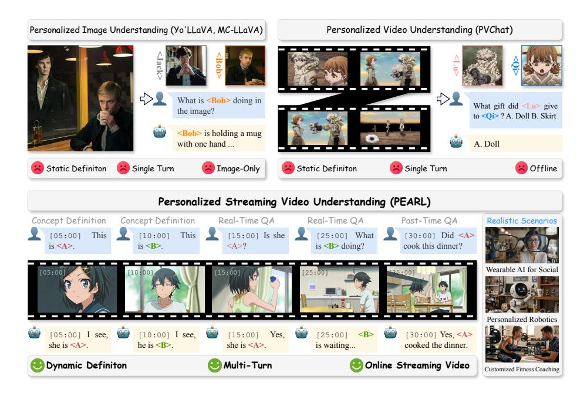

# 1 Introduction

Recent advancements in Vision-Language Models (VLMs) [\[1–](#page-14-0)[6\]](#page-14-1) have remarkably expanded the boundaries of multimodal understanding, empowering models to recognize and interact with personalized, user-specific concepts. Despite

\* Equal contribution. † Project leader. # Corresponding authors.

Fig. 1: Comparison between our proposed Personalized Streaming Video Understanding (PSVU) task and traditional Personalized Image/Video Understanding tasks. Unlike traditional settings, PSVU better aligns with real-world scenarios by featuring continuous streaming video inputs, dynamically defined concepts, and multi-turn conversations regarding these customized concepts.

these strides, current personalization methods [\[7–](#page-14-2)[15\]](#page-15-0) remain fundamentally constrained. As shown in Fig. [1,](#page-1-0) approaches such as Yo'LLaVA [\[8\]](#page-14-3) and MC-LLaVA [\[7\]](#page-14-2) are mainly designed for static image-text tasks. Furthermore, while PVChat [\[10\]](#page-14-4) pioneers personalized video understanding, it operates strictly in offline settings and only supports single turn interaction, failing to accommodate the openended, streaming nature of real-world environments.

In contrast, humans continuously recognize new individuals and objects, forming memories over time as they process the world as a seamless visual stream. This fundamental cognitive mechanism highlights a critical limitation of existing methods, which remain confined to static images or pre-recorded videos. Bridging this gap is not merely a technical step, but an essential prerequisite for the next generation of personalized AI assistants [\[16\]](#page-15-1): such systems must be capable of handling streaming visual inputs and delivering real-time, interactive, and personalized responses in dynamic real-world environments [\[17\]](#page-15-2). For instance, in customized fitness coaching (Fig. [1\)](#page-1-0), an AI assistant must continuously monitor a user's specific weightlifting actions across an video stream to provide instant, tailored form correction. This real-time, streaming personalization capability is indispensable for deploying truly practical AI assistants.

To bridge this gap, we firstly propose and formally define the novel task of Personalized Streaming Video Understanding (PSVU). To facilitate research in this new direction, we introduce PEARL-Bench, the first comprehensive benchmark specifically designed to evaluate personalized streaming video understanding. Unlike traditional offline tasks, PEARL-Bench distinguishes itself through two core properties: (1) Continuous Temporal Precision, requiring models to localize and reason about personalized concepts at exact timestamps within an ongoing stream; and (2) Interactive Concept Definition, challenging models to grasp user-specific concepts dynamically defined on-the-fly, rather than relying on predefined pools. To thoroughly assess model capabilities, the benchmark evaluates two modes: (1) Frame-level Personalization, focusing on the continuous recognition and reasoning of a specific person or object appearing across discrete frames; and (2) a novel Video-level Personalization, which goes beyond static appearances to focus on specific, customized actions that unfold across continuous frames. PEARL-Bench comprises 132 unique videos, and 2,173 finegrained annotations with precise timestamps. The video data is carefully curated through a combination of expert manual collection and rigorous programmatic synthesis pipelines. By sourcing data from diverse domains including anime, movies, reality shows, and digital humans, we ensure both extensive concept diversity and high annotation quality.

The challenging PSVU task presents significant efficiency and architectural hurdles for existing models, as they struggle to maintain streaming visual context and instantly acquire new concepts without computationally expensive retraining. To tackle this, we propose PEARL, a training-free plug-and-play framework designed to serve as a strong baseline. Specifically, PEARL features a Dual-grained Memory System that explicitly decouples concept-centric knowledge from stream-centric observations, incrementally archiving continuous video clips while dynamically registering user-defined concepts. To ensure fast and accurate response, we further introduce a Concept-aware Retrieval Algorithm that leverages stored concept descriptions to precisely retrieve relevant historical visual evidence. Consequently, without any parameter updates, PEARL seamlessly empowers off-the-shelf VLMs to deliver real-time, personalized responses in continuous video streams. Extensive evaluations demonstrate that PEARL establishes a new state-of-the-art among 8 offline and online models. Notably, equipped with PEARL drives consistent improvements across 3 distinct architectures, yielding an average performance gain of 13.79% at the frame-level and 12.80% at the video-level, thereby proving its effectiveness and robustness.

We summarize our contributions as follows:

- New Task and Benchmark: We are the first to propose and formally define the novel task of Personalized Streaming Video Understanding. To facilitate evaluation in this direction, we introduce PEARL-Bench, the first comprehensive benchmark specifically designed for this challenging setting.
- Novel Framework: We propose PEARL, a novel, training-free, and plugand-play method. By seamlessly integrating into existing models, it demonstrates remarkable effectiveness and robustness across multiple architectures.
- State-of-the-Art Performance: Extensive experiments show that PEARL achieves state-of-the-art results compared to 8 offline and online video un-

derstanding methods. We hope this work inspires the field of VLM personalization and paves the way for next-generation interactive AI assistants.

