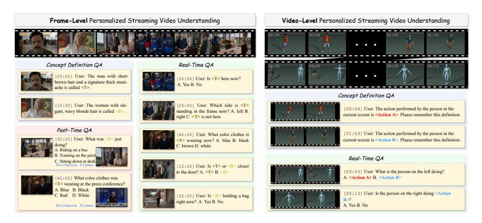

# 3.3 Curation Pipeline

Our curation pipeline consists of four stages: video collection and filtering, followed by the annotation of three QA types (Concept-Definition, Real-Time, and

Fig. 2: Overview of PEARL-Bench. (Left) Frame-level split: Concept-Definition QA registers a person at early timestamps; Real-Time QA queries the concept's current state in the scene; Past-Time QA requires retrieving a historical evidence clip to answer questions about prior states. (Right) Video-level split: Concept-Definition QA registers a personalized action observed in a clip; Real-Time QA asks whether the defined action is being performed at the current timestamp.

Past-Time), and concludes with a quality control phase. We employ a diverse set of question templates to annotate the three QA types. Representative examples are illustrated in Fig. [2,](#page-5-0) and complete templates are provided in the appendix.

Video Collection and Filtering We collect videos from publicly available internet sources and manually filter them according to the following criteria: (i) the video exhibits high dynamics and poses real-time understanding demands; (ii) the video contains multiple repeatedly appearing, clearly definable personalized concepts; and (iii) the video resolution is no lower than 480p. Videos in the frame-level split are drawn from diverse domains including anime, movies, and reality shows, ensuring variety in visual styles and concept types. For the video-level split, collecting videos with clean personalized action annotations from existing internet data is extremely challenging, as these action concepts must appear repeatedly and ideally be performed by different subjects within the video. We therefore adopt a digital human synthesis approach: we synthesize diverse videos using assets from Mixamo [\[43\]](#page-17-1) by randomly combining 8 distinct characters, 20 unique actions, and 20 background scenes to foster data diversity and visual richness, where each distinct action serves as a video-level concept.

Concept-Definition QA Annotation Concept-Definition QA is designed to register a new concept into the model's memory, and carries no specific groundtruth answer, which excludes it from the final evaluation: it suffices for the model to correctly identify and register the concept according to the user's instruction. Given a video, annotators first locate multiple timestamps at which the target concept appears in the scene, and pose a registration question at each such timestamp. For example, at t=5 minutes an annotator issues "This is XiaoJing." alongside the frame showing the target character, thereby registering XiaoJing as a new concept. Notably, to prevent the model from leveraging prior knowledge to recognize a specific concept, we collect 10k common names from the U.S. SSA database [\[44\]](#page-17-2) and use them to randomly replace the original concept names, thereby enhancing benchmark robustness. Previous research [\[7,](#page-14-2) [10\]](#page-14-4) discussed the rationale for this naming strategy.

Real-Time QA Annotation After completing concept definition annotation, annotators begin labeling Real-Time QA. Specifically, they identify timestamps in the video suitable for real-time questioning and pose concept-related questions with corresponding answers. The current clip, question, and answer are then fed to a strong VLM to generate multiple-choice distractors. For example, at t=20 minute an annotator poses "What is XiaoJing wearing now?", which requires the model to ground the recognized concept in the current scene to answer correctly. During annotation, questions that can be answered without any knowledge of the defined concepts are strictly excluded to ensure benchmark validity.

Past-Time QA Annotation Past-Time QA annotation likewise follows concept definition. The key distinction from Real-Time QA is that Past-Time QA cannot be answered from the current clip alone. It additionally requires a historical clip as evidence. Annotators therefore identify both a query timestamp and a corresponding historical evidence timestamp, and pose a question with its answer accordingly. For example, at t=40 minute with evidence at t=10 minute, the question "What was XiaoJing wearing when she was cooking?" can only be answered by retrieving the historical cooking scene, not from the current frame. The current clip, evidence clip, question, and answer are then jointly fed to a VLM to generate distractors. The constraint of this QA type is that correct answering must depend on retrieving and reasoning over historical evidence clips.

Quality Control To ensure the highest annotation quality, our curation team consists of 10 researchers, each with over a year of experience in multimodal research. Specifically, 6 members are dedicated to the primary annotation tasks, while the remaining 4 focus on rigorous review and quality control. Overall, we adopt a combined pipeline of automated filtering and human verification. In the automated stage, we apply an ablation-based filtering method with an experimental setup similar to Section [5.5.](#page-11-0) Specifically, for Real-Time QA, we test models with and without provided concepts; for Past-Time QA, we test with and without historical evidence clips. Questions that models can answer correctly even when the necessary information (i.e., concepts or historical evidence clips) is withheld are deemed trivial and therefore filtered. In the human verification stage, our reviewers conduct multiple rounds of manual inspection to verify that each QA item and its timestamp are accurately aligned with the video content. We additionally collect human evaluation scores as an upper-bound reference for benchmark performance, which are reported in Table [3.](#page-10-0)

