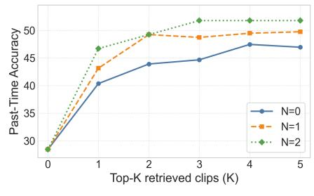
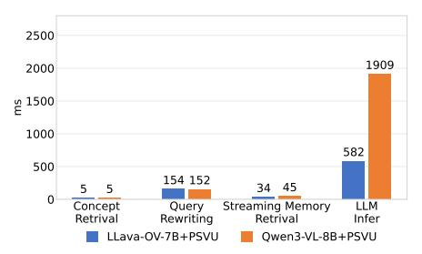

# 5.2 Text-Only Results and Human Score

To establish the upper and lower bounds for PEARL-Bench in Table [3,](#page-10-0) we report the Human Score and a Text-only baseline. The Human Score is obtained by having annotators answer questions with full access to both the visual stream and concept definitions. This human performance sets a robust upper bound, demonstrating that the task is highly solvable given sufficient visual information. Conversely, the Text-only baseline feeds only the query text to the model without any visual inputs. Evaluated using Qwen3-VL-8B (a model with strong pure-text

Table 3: Results on PEARL-Bench. We report Frame-level Real-Time/Past-Time (with Avg) and Video-level Real-Time metrics. Bold and underline denote the best and second-best results among open-source models and PEARL, respectively.

| Method                   | #Frames                   |                           | Video-level  |              |              |  |  |
|--------------------------|---------------------------|---------------------------|--------------|--------------|--------------|--|--|
|                          |                           | Real-Time                 | Past-Time    | Avg          | Real-Time    |  |  |
| Human Score              |                           |                           |              |              |              |  |  |
| Human                    | -                         | 97.61                     | 96.45        | 97.03        | 97.49        |  |  |
|                          |                           | Text-only                 |              |              |              |  |  |
| Qwen3-VL-8B [2]          | -                         | 11.06                     | 17.45        | 14.26        | 7.04         |  |  |
|                          |                           | Proprietary Offline Model |              |              |              |  |  |
| Gemini3-pro-preview [5]  | 64                        | 47.40                     | 48.98        | 48.19        | 24.51        |  |  |
|                          | Open-source Offline Model |                           |              |              |              |  |  |
| LLava-OV-7B [3]          | 64                        | 24.95                     | 34.01        | 29.48        | 10.86        |  |  |
| Qwen2-VL-7B [46]         | 64                        | 23.21                     | 35.79        | 29.50        | 17.89        |  |  |
| InternVL3.5-8B [1]       | 64                        | 30.35                     | 35.06        | 32.71        | 5.57         |  |  |
| Qwen3-VL-8B [2]          | 64                        | 27.33                     | 30.20        | 28.77        | 25.51        |  |  |
| Open-source Online Model |                           |                           |              |              |              |  |  |
| ReKV(LLava-OV-7B) [33]   | 0.5fps                    | 26.20                     | 37.46        | 31.83        | 24.11        |  |  |
| StreamForest-7B [35]     | 1fps                      | 29.18                     | 40.86        | 35.02        | 10.85        |  |  |
| TimeChat-Online-7B [34]  | 1fps                      | 31.89                     | 35.28        | 33.59        | 22.29        |  |  |
| PEARL Framework          |                           |                           |              |              |              |  |  |
| LLava-OV-7B+PEARL        | 1fps                      | 33.41 ↑8.46               | 42.64 ↑8.63  | 38.03 ↑8.55  | 19.94 ↑9.08  |  |  |
| Qwen2-VL-7B+PEARL        | 1fps                      | 33.30 ↑10.09              | 44.42 ↑8.63  | 38.86 ↑9.36  | 24.34 ↑6.45  |  |  |
| Qwen3-VL-8B+PEARL        | 1fps                      | 54.99 ↑27.66              | 49.49 ↑19.29 | 52.24 ↑23.47 | 48.39 ↑22.88 |  |  |

capability), this lower bound exhibits poor performance across all metrics. The significant disparity between these bounds confirms that the benchmark cannot be reliably solved relying on text priors alone, and fundamentally requires visual grounding in the streaming content.

#### 5.3 Frame-level Results

Comparison with Offline Baselines We evaluate several representative opensource offline models, along with a strong proprietary offline baseline. As shown in Table [3,](#page-10-0) these offline approaches struggle on PSVU task, exhibiting generally poor performance across the board. In contrast, applying PEARL to the same base models yields consistent and substantial improvements: LLaVA-OV-7B+PEARL, Qwen2-VL-7B+PEARL, and Qwen3-VL-8B+PEARL improve their offline counterparts by 8.55%, 9.36%, and 23.47%, respectively, demonstrating the generality and robustness of PEARL across distinct architectures. Notably, even the strong proprietary Gemini3-pro-preview [\[5\]](#page-14-10) falls short of our Qwen3- VL-8B+PEARL, lagging behind by over 4%. This performance gap reveals a key limitation of offline models in the streaming setting: to satisfy low-latency inference, they operate with a restricted visual context (64 frames in our experiments) and typically lack explicit memory mechanisms to preserve and retrieve

long-range historical evidence. Consequently, the visual information needed to answer many queries is often missing, leading to degraded accuracy.

Comparison with Online Baselines We compare PEARL against three representative open-source online models: ReKV (LLaVA-OV-7B) [\[33\]](#page-16-6), StreamForest-7B [\[35\]](#page-16-7), and TimeChat-Online-7B [\[34\]](#page-16-8). As shown in Table [3,](#page-10-0) all three PEARL variants consistently surpass the best online baseline StreamForest-7B. Specifically, LLaVA-OV-7B+PEARL improves upon StreamForest-7B by 3.01%, Qwen2- VL-7B+PEARL by 3.84%, and Qwen3-VL-8B+PEARL achieves a substantial gain of 17.22%. These improvements underscore the superiority of PEARL in effectively managing continuous visual streams for personalized understanding.

Notably, LLaVA-OV-7B+PEARL comprehensively outperforms ReKV on both Real-Time and Past-Time metrics, achieving gains of 7.21% and 5.18% respectively. Since ReKV shares the same backbone and is likewise a training-free, plug-and-play framework, this controlled comparison strongly indicates that the performance gains stem from the PEARL framework design itself rather than differences in backbone capability. We attribute these advantages to PEARL's Dual-grained Memory System and Concept-aware Retrieval Algorithm: whereas traditional online models compress historical information into a fixed-size state and lack concept-grounded retrieval, PEARL explicitly stores user-defined concept representations and precisely retrieves query-relevant historical clips, enabling more accurate personalized responses in the streaming setting.

#### 5.4 Video-level Results

As shown in Table [3,](#page-10-0) all models achieve notably lower scores on the videolevel split than on the frame-level split, reflecting the greater difficulty of this setting, where models must not only recognize personalized concepts but also reason over continuous actions unfolding across frames. Nevertheless, PEARL demonstrates clear superiority. When compared to their respective offline base models, all three PEARL variants yield consistent and significant performance improvements. Moreover, Qwen3-VL-8B+PEARL achieves the highest overall accuracy, outperforming the best online baseline ReKV by a massive margin of 24.28%. It also substantially surpasses Gemini3-pro-preview, leading by nearly 24%. These results indicate that the design of PEARL generalizes effectively to the more demanding video-level personalized understanding task.

## 5.5 Ablation Study

Effectiveness of PEARL Design We ablate PEARL by progressively enabling its components in Table [4.](#page-12-0) Using Qwen3-VL-8B on the frame-level split, text-only performance starts near random chance, and adding the current clip provides only a marginal improvement. In contrast, adding Concept Memory with concept retrieval leads to a dramatic gain of over 35% in Real-Time accuracy, showing that explicit concept grounding is crucial. Subsequently, incorporating Streaming Memory with retrieval yields a substantial jump of more than 20% in Past-Time accuracy, indicating the need for historical evidence. Finally, adding Query Rewriting (full PEARL) further improves both Real-Time and Past-Time performance, elevating the average accuracy by an additional 4.28% over the non-rewritten version.

These results suggest three takeaways. (i) Concept Memory is indispensable: without concept-specific information, the model cannot reliably link user-defined names to personalized entities, so the benchmark is hard to solve. (ii) Streaming Memory is essential for Past-Time QA, which depends on retrieving and reasoning over historical clips rather than the current scene. (iii) Query Rewriting turns personalized names into descriptive semantics that embedding models can match more effectively, improving evidence retrieval and final answers.

**Table 4: Ablation of PEARL components** on the frame-level split with Qwen3-VL-8B, showing progressive gains from Text-only to the full PEARL pipeline.

| Text | Current | Concept | Streaming | g Rewrite | Real-Time | Past-Time | Avg   |
|------|---------|---------|-----------|-----------|-----------|-----------|-------|
| 1    | X       | Х       | Х         | Х         | 11.06     | 17.45     | 14.26 |
| 1    | 1       | X       | X         | Х         | 15.84     | 20.30     | 18.07 |
| 1    | 1       | ✓       | X         | Х         | 51.41     | 25.43     | 38.42 |
| 1    | 1       | ✓       | ✓         | Х         | 50.22     | 45.69     | 47.96 |
| ✓    | 1       | ✓       | ✓         | ✓         | 54.99     | 49.49     | 52.24 |

Efficiency of PEARL Design We further evaluate end-to-end inference efficiency. As shown in Table 5, on the frame-level split of PEARL-Bench, although PEARL introduces a minor latency overhead compared to the respective base models, both LLaVA-OV-7B+PEARL and Qwen3-VL-8B+PEARL achieve substantial improvements in frame-level average

**Table 5:** Comparison of end-to-end inference latency across models. F-Avg denotes the frame-level average accuracy.

| Method                                   | #Frames            | F-Avg I | Latency (ms) |
|------------------------------------------|--------------------|---------|--------------|
| LLaVA-OV-7B                              | 64                 | 29.48   | 670          |
| Qwen3-VL-8B                              | 64                 | 28.77   | 1,594        |
| ReKV (LLaVA-OV-7B)                       | $0.5 \mathrm{fps}$ | 31.83   | 1,818        |
| StreamForest-7B                          | 1 fps              | 35.02   | 1,164        |
| TimeChat-Online-7B                       | 1fps               | 33.59   | 4,769        |
| LLaVA-OV-7B+PEARL                        | 1fps               | 38.03   | 775          |
| ${\bf Qwen 3\text{-}VL\text{-}8B+PEARL}$ | $1 \mathrm{fps}$   | 52.24   | 2,111        |

accuracy, with gains of 8.55% and 23.47% respectively. Moreover, LLaVA-OV-7B+PEARL not only maintains higher accuracy than all online baselines but also remains faster than all of them. Although Qwen3-VL-8B+PEARL has a slightly higher latency, its accuracy heavily surpasses the strongest online baseline, StreamForest-7B, leading by 17.22%.

Furthermore, as shown in Fig. 5, the end-to-end latency of our PEARL framework breaks down into Concept Retrieval, Query Rewriting, Streaming Memory Retrieval, and LLM Inference. Notably, the latency introduced by PEARL's core modules (retrieval and rewriting) is exceptionally low and invariant across different models, and the underlying LLM inference constitutes the primary latency bottleneck. This demonstrates that PEARL can seamlessly adapt to diverse model architectures while maintaining real-time retrieval capabilities.

Fig. 4: Past-Time accuracy under different top-K(K) and expansion sizes(N).

Fig. 5: End-to-end latency breakdown of PEARL across different models.

Hyperparameter Analysis We analyze two key hyperparameters on Past-Time QA: the number of top-K retrieved clips (K) and the number of adjacent clips to expand per retrieved clip (N). As shown in Fig. [4,](#page-13-0) when K = 0, no historical clips are retrieved, so the model cannot leverage historical video evidence and the metric remains low; as K increases, accuracy improves rapidly and plateaus after K ≥ 3, indicating that moderate retrieval suffices to cover the visual evidence needed for answering. Regarding N, larger adjacent expansion provides richer local temporal context, but the gap between N = 1 and N = 2 is small, suggesting that one adjacent clip already captures most of the useful information. Balancing performance and efficiency, we adopt K = 4 and N = 1 as our default configuration. Since Real-Time QA can be accurately addressed without relying on historical clips, it is inherently less sensitive to the parameters K and N. For completeness, corresponding experimental results for Real-Time QA are provided in the appendix.

