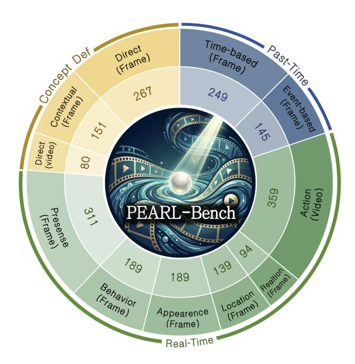

# A QA Sub-categories

To thoroughly evaluate model capabilities under diverse scenarios, we further categorize the queries in PEARL-Bench. As shown in Fig. [6,](#page-18-0) we systematically classify the questions within Concept-Definition QA, Real-Time QA, and Past-Time QA into fine-grained sub-categories based on their reasoning requirements.

Fig. 6: Distribution of fine-grained sub-categories in PEARL-Bench. "(Frame)" denotes sub-categories belonging to the frame-level split, while "(Video)" denotes those in the video-level split.

Concept-Definition QA. We classify the concept definitions into two distinct types:

- Direct: The concept is defined straightforwardly without relying on complex descriptions. For frame-level concepts, it points out the main character in the scene (e.g., "This character is called {ConceptName}. Please remember this name."); for video-level concepts, it identifies a specific personalized action unfolding over a continuous clip (e.g., "The sequence of movements shown in this clip is defined as {ConceptName}. Please remember this name.")
- Contextual: The concept is defined by describing its explicit visual attributes (like clothing color) or its interactions and relationships with other objects in the scene. (e.g., "The character wearing white clothes is named {ConceptName}. Please remember this name.")

Real-Time QA. To evaluate multi-dimensional perception, we categorize the real-time queries into six distinct sub-tasks:

- Presence: Asking whether the concept is present in the current scene. (e.g., "Is {ConceptName} here now?")
- Behavior: Querying the current action or state of the defined concept. (e.g., "What is {ConceptName} doing now?")
- Appearance: Focusing on the transient visual details of the concept, such as current clothing. (e.g., "What color is {ConceptName} wearing now?")
- Location: Identifying the spatial positioning of the concept within the scene. (e.g., "Where is {ConceptName} located in this scene now?")
- Relation: Inquiring about the interaction or relationship between the target concept and other entities or objects. (e.g., "Who is standing next to {ConceptName} now?")
- Action: Querying whether a dynamically defined action concept is being performed across the current continuous clip. (e.g., "Is the person doing {ConceptName} now?")

Past-Time QA. We divide the past-time queries into two types based on the retrieval mechanism required to answer them:

- Event-based: The historical evidence can be localized purely based on a specific event or action, without requiring strict temporal reasoning. (e.g., "What was {ConceptName} holding when he was cooking?")
- Time-based: The historical evidence requires the model to understand the temporal sequence or order of events to accurately retrieve the correct clip. (e.g., "What did {ConceptName} do right before he left the room?")

