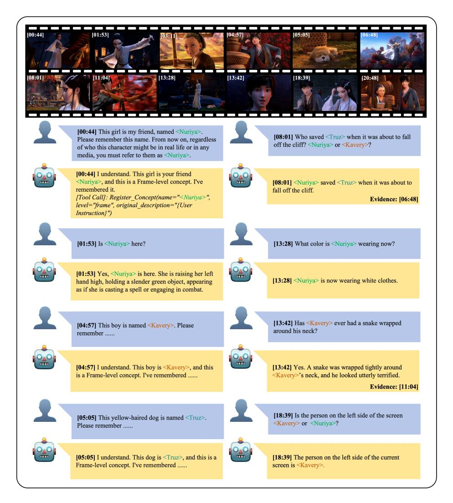
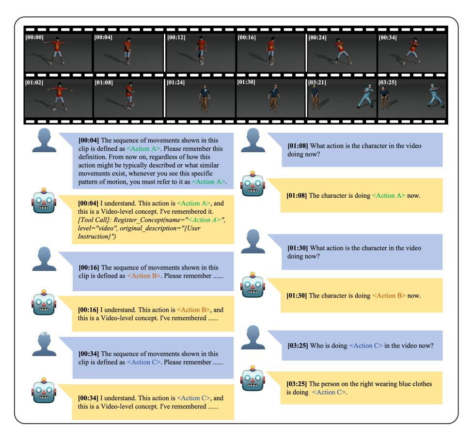

# D More Visualization Examples

To better illustrate the complexity and diversity of our dataset, as well as the effectiveness of our proposed framework, we present additional visualization examples from PEARL-Bench. These examples demonstrate the model's capability to handle continuous video streams, dynamically register personalized concepts, and accurately answer both real-time and past-time queries.

### D.1 Frame-level Visualization

As shown in Fig. [7,](#page-25-0) we showcase a comprehensive frame-level interaction process using the Qwen3-VL-8B+PEARL model on a long animated video. As the video stream progresses, the user dynamically defines multiple frame-level concepts at different timestamps (e.g., <Nuriya> at [00:44], <Kavery> at [04:57], and <Truz> at [05:05]). Upon receiving these Concept-Definition instructions, the PEARL framework successfully invokes the Register\_Concept tool. This tool specifically functions to extract the current visual evidence (i.e., the current frame), generate a concise visual description for the target concept, and subsequently update the Concept Memory by storing the visual evidence, the generated description, and the concept name as a unified entity.

Subsequently, the model demonstrates robust real-time perception by accurately answering Real-Time QA based on the current scene. For example, at [01:53], the model not only successfully recognizes <Nuriya>'s presence but also accurately describes her combat posture. Later, at [18:39], it correctly identifies <Kavery> on the left side of the screen. Furthermore, the model exhibits strong long-term temporal reasoning in Past-Time QA. For instance, at [08:01], when asked who saved <Truz>, the model successfully retrieves the historical evidence from [06:48] to provide the correct answer. Similarly, at [13:42], it accurately recalls the terrifying snake encounter that occurred at [11:04]. These results highlight PEARL's ability to maintain and retrieve long-range personalized memories effectively.

#### D.2 Video-level Visualization

In addition to static entities, PEARL-Bench also evaluates the model's ability to understand personalized dynamic actions unfolding over continuous frames. As shown in Fig. [8,](#page-26-0) we illustrate a video-level interaction example using the Qwen3- VL-8B+PEARL model. During the initial phase of the video stream, the user dynamically registers multiple complex action sequences as video-level concepts (e.g., <Action A> at [00:04], <Action B> at [00:16], and <Action C> at [00:34]). Similar to the frame-level process, the model invokes the Register\_Concept tool. However, instead of extracting a single frame, the tool extracts the current video clip corresponding to the action, generates a descriptive summary of the movement pattern, and stores it in the Concept Memory as a video-level entity.

Subsequently, the model accurately recognizes these customized actions when they reappear later in the stream, even when performed by different characters or in different contexts. For example, at [01:08] and [01:30], the model successfully identifies that the character is performing <Action A> and <Action B>, respectively. Furthermore, at [03:25], when multiple characters are present in the scene, the model correctly distinguishes and identifies that the person on the right wearing blue clothes is the one performing <Action C>. These results demonstrate the robust spatiotemporal reasoning and video-level personalization capabilities of the PEARL framework.

Fig. 7: Visualization example of frame-level multi-turn interactions in PEARL-Bench. The model successfully registers multiple user-defined concepts (e.g., <Nuriya>, <Kavery>, <Truz>) and accurately answers subsequent Real-Time and Past-Time queries by retrieving corresponding historical evidence.

Fig. 8: Visualization example of video-level multi-turn interactions in PEARL-Bench. The model successfully registers multiple user-defined action sequences (e.g., <Action A>, <Action B>, <Action C>) and accurately recognizes these customized actions when they are performed by different characters later in the video stream.

